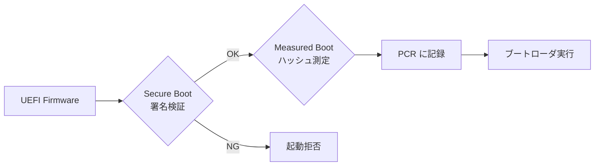
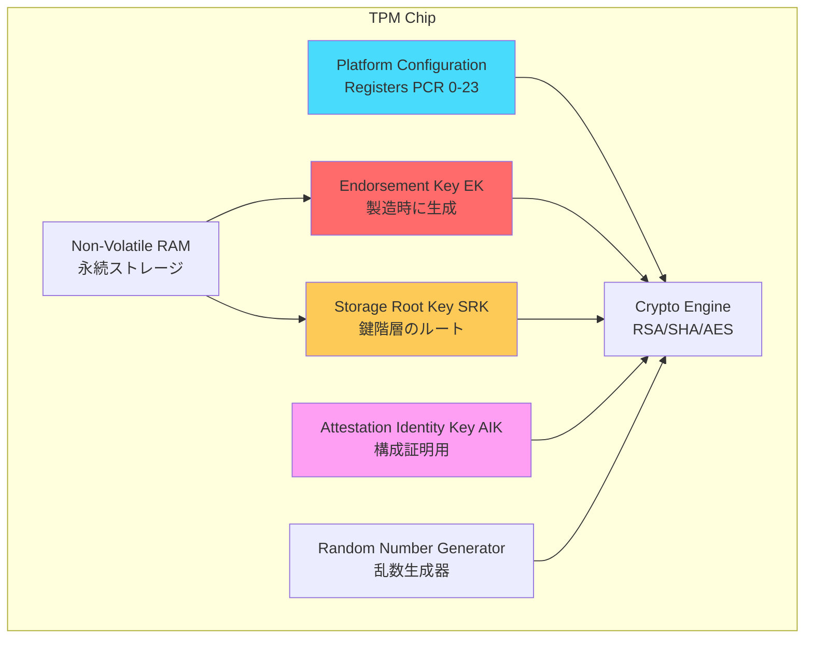
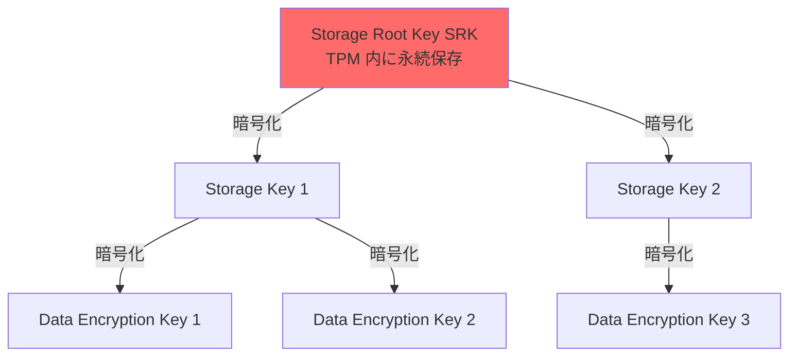
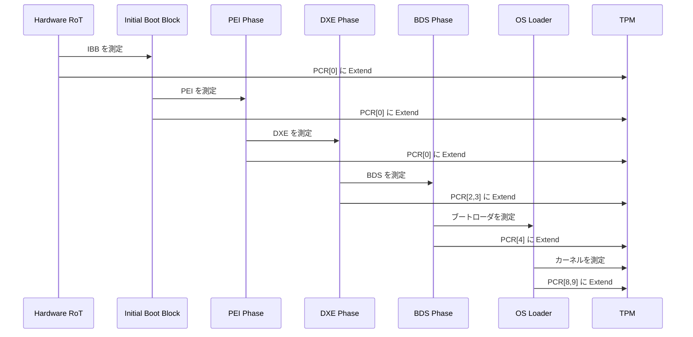
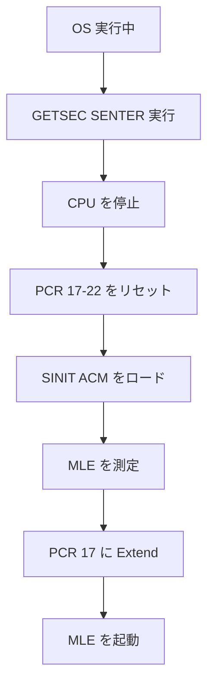
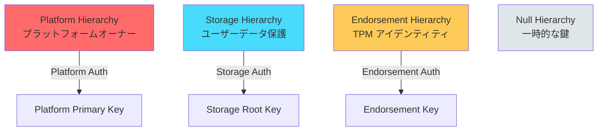
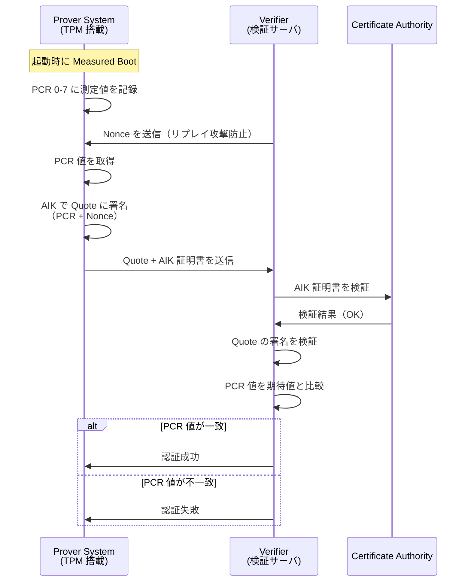
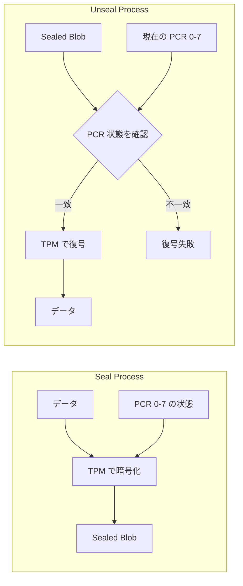

# TPM と Measured Boot

<!-- Status: completed -->
<!-- Last Updated: 2025-10-05 -->

🎯 **この章で学ぶこと**
- TPM（Trusted Platform Module）のアーキテクチャと役割
- Platform Configuration Register（PCR）の仕組み
- Measured Boot のプロセスと SRTM/DRTM の違い
- TPM 1.2 と TPM 2.0 の比較
- Remote Attestation（リモート構成証明）の仕組み
- Sealed Storage による鍵の保護
- TPM を使った実践的なセキュリティ実装

📚 **前提知識**
- [Part IV Chapter 2: 信頼チェーンの構築](./02-chain-of-trust.md)
- [Part IV Chapter 3: UEFI Secure Boot の仕組み](./03-secure-boot-architecture.md)
- ハッシュ関数（SHA-1、SHA-256）の基礎

---

## TPM（Trusted Platform Module）とは

**TPM（Trusted Platform Module）** は、プラットフォームに**ハードウェアベースのセキュリティ機能**を提供する専用チップです。TPM は、CPU やマザーボードとは独立した専用のセキュリティプロセッサとして動作し、暗号化処理や鍵の保管、システム構成の測定といった重要なセキュリティ機能を担います。TPM は、TCG（Trusted Computing Group）によって標準化されており、サーバからコンシューマ PC、さらには組込みデバイスまで、幅広いプラットフォームで採用されています。TPM の最大の特徴は、**ソフトウェアから独立したハードウェアベースの Root of Trust** であることです。OS やファームウェアが侵害されても、TPM 内部の秘密鍵や測定データは保護されるため、システムの信頼性を根底から支えます。

TPM の主要な役割は、**4つのセキュリティ機能**に集約されます。まず、**測定と記録（Measurement）** では、ブートプロセスの各段階（BIOS、ブートローダ、カーネル）のハッシュ値を計算し、PCR（Platform Configuration Register）と呼ばれる特殊なレジスタに記録します。この測定値は、後でシステムの完全性を検証するために使用されます。次に、**暗号化鍵の保護（Key Protection）** では、ディスク暗号化鍵や認証鍵といった機密情報を、TPM のハードウェア内に安全に格納します。TPM 内の秘密鍵は外部に取り出すことができないため、ソフトウェア攻撃やメモリダンプからも保護されます。さらに、**構成証明（Attestation）** では、TPM が記録した測定値に署名し、リモートの検証者（サーバなど）に対して「このシステムは改ざんされていない」ことを証明します。最後に、**改ざん検出（Tamper Detection）** では、システムの構成（ファームウェア、ブートローダ、カーネル）が変更された場合、PCR 値が変化することで改ざんを検出します。

TPM を理解する上で重要なのが、**Secure Boot との関係**です。Secure Boot は、[Part IV Chapter 3](./03-secure-boot-architecture.md) で説明したように、**デジタル署名の検証（Verification）** によって未承認コードの実行を防ぎます。これに対し、**Measured Boot** は、**ハッシュ値の測定と記録（Measurement）** を行いますが、実行の可否は判断しません。つまり、Secure Boot は「正しい署名を持つコードのみ実行する」というゲートキーパーであり、Measured Boot は「何が実行されたかを記録する」という監査ログです。両者は補完的な関係にあり、併用することで、**実行時の保護（Secure Boot）** と **事後検証・証明（Measured Boot）** の両方を実現します。

この違いを具体的に説明すると、Secure Boot の場合、ブートローダの署名が無効であれば**起動を拒否**します。一方、Measured Boot は、ブートローダが署名されているかどうかに関わらず、そのハッシュ値を PCR に記録し、**起動は継続**します。ただし、後で PCR 値を確認することで「どのブートローダが実行されたか」を検証できます。このため、Measured Boot は、Secure Boot では防げない**ゼロデイ攻撃**や、**正規の署名を持つが脆弱なコード**の実行も記録できる点で優れています。また、Measured Boot で記録された PCR 値は、**Remote Attestation（リモート構成証明）** により、サーバに送信して検証できるため、クラウド環境やエンタープライズ環境での信頼性確認に広く使用されています。

### 補足表：Secure Boot vs Measured Boot の比較

| 項目 | Secure Boot | Measured Boot |
|------|-------------|---------------|
| **目的** | 未承認コードの実行を防ぐ | システム構成を記録する |
| **動作** | 署名検証 → OK なら実行 | ハッシュ測定 → PCR に記録 |
| **失敗時** | 実行を拒否 | 記録のみ（実行は継続） |
| **使用技術** | デジタル署名（RSA/ECDSA） | ハッシュ（SHA-256） |
| **保護対象** | ブートローダ、ドライバ | すべてのコンポーネント |
| **証明** | 不可 | Remote Attestation で可能 |

**組み合わせ**：


---

## TPM のアーキテクチャ

### TPM の物理形態

| 形態 | 説明 | 使用例 |
|------|------|--------|
| **dTPM（Discrete TPM）** | 独立したチップ（専用ハードウェア） | サーバ、エンタープライズ PC |
| **fTPM（Firmware TPM）** | ファームウェアで実装（Intel ME/AMD PSP） | コンシューマ PC、ノート PC |
| **vTPM（Virtual TPM）** | 仮想化環境のソフトウェア実装 | クラウド VM（Azure、AWS） |
| **PTT（Platform Trust Technology）** | Intel の fTPM 実装 | Intel 第 4 世代以降 |

### TPM の内部構造



### TPM の主要コンポーネント

#### 1. Platform Configuration Registers（PCR）

**役割**：
- システム構成の**測定値を記録**
- TPM 1.2: 24個のPCR（PCR 0-23）
- TPM 2.0: 24個以上（実装依存、最大32個）

**PCR の仕様**：
- サイズ: SHA-1（20バイト）または SHA-256（32バイト）
- 初期値: すべて 0（起動時にリセット）
- 操作: **Extend 操作のみ**（上書き不可）

**Extend 操作**：
```c
// PCR Extend の擬似コード
PCR[n] = SHA256(PCR[n] || NewMeasurement)
```

つまり、**現在の PCR 値**と**新しい測定値**を連結してハッシュを取り、PCR に書き戻します。

**PCR の用途（TCG 標準）**：

| PCR | 用途 | 測定内容 |
|-----|------|---------|
| 0 | BIOS | BIOS/UEFI ファームウェアコード |
| 1 | BIOS | プラットフォーム設定（UEFI 変数など） |
| 2 | ROM Code | Option ROM |
| 3 | ROM Code | Option ROM 設定 |
| 4 | IPL Code | MBR / GPT / UEFI ブートローダ |
| 5 | IPL Config | ブート設定（GPT パーティションテーブル） |
| 6 | State Transition | OS がロードされる直前の状態 |
| 7 | OEM/Vendor | OEM 固有の用途 |
| 8-15 | OS | OS が使用（カーネル、ドライバ） |
| 16 | Debug | デバッグ用 |
| 17-22 | DRTM | Dynamic Root of Trust 用 |
| 23 | Application | アプリケーション用 |

#### 2. Endorsement Key（EK）

**役割**：
- TPM の**アイデンティティ**を証明
- **製造時に生成**され、TPM 内に永続保存
- 公開鍵は CA に登録され、証明書が発行される

**特徴**：
- **秘密鍵は TPM 外に出ない**
- RSA-2048 または ECC P-256
- プライバシー保護のため、直接使用せず AIK を介して使う

#### 3. Storage Root Key（SRK）

**役割**：
- TPM 内の**鍵階層のルート鍵**
- 他の鍵（データ保護鍵など）は SRK で暗号化して保存

**鍵階層**：


#### 4. Attestation Identity Key（AIK）

**役割**：
- **Remote Attestation**（リモート構成証明）に使用
- PCR 値に署名して第三者に送信

**プライバシー保護**：
- EK を直接使うとプライバシーが侵害される
- AIK は匿名性を持つ（複数の AIK を生成可能）

---

## Measured Boot のプロセス

### Measured Boot の流れ



### SRTM（Static Root of Trust for Measurement）

**定義**：
- **起動時**に確立される Root of Trust
- すべてのコンポーネントを順番に測定

**測定範囲**：
- PCR 0-7: BIOS/UEFI、Option ROM、ブートローダ
- PCR 8-15: OS カーネル、ドライバ

**制限**：
- 起動時のみ測定（実行中の変更は検出できない）
- すべてのコンポーネントを信頼する必要がある

### DRTM（Dynamic Root of Trust for Measurement）

**定義**：
- **実行中**に確立される Root of Trust
- 既存のソフトウェアを信頼せずに、特定の環境を測定

**技術**：
- **Intel TXT（Trusted Execution Technology）**: `GETSEC[SENTER]` 命令
- **AMD SVM（Secure Virtual Machine）**: `SKINIT` 命令

**測定範囲**：
- PCR 17-22: DRTM 用

**使用例**：
- セキュアな仮想マシンの起動
- トラステッド実行環境の構築

**DRTM の流れ**：


---

## TPM 1.2 と TPM 2.0 の比較

### 主要な違い

| 項目 | TPM 1.2 | TPM 2.0 |
|------|---------|---------|
| **策定団体** | TCG | TCG + ISO/IEC |
| **暗号アルゴリズム** | RSA-2048, SHA-1 固定 | アルゴリズムアジリティ（複数対応） |
| **ハッシュ** | SHA-1 のみ | SHA-1, SHA-256, SHA-384, SHA-512 |
| **公開鍵暗号** | RSA のみ | RSA, ECC（楕円曲線） |
| **PCR バンク** | 1つ（SHA-1） | 複数（SHA-1 + SHA-256 など） |
| **階層構造** | 単純（EK/SRK） | 階層化（Platform/Storage/Endorsement） |
| **コマンド体系** | 固定 | 柔軟（コマンドのパラメータ化） |
| **NV RAM サイズ** | 1280 バイト | 実装依存（通常 8KB 以上） |
| **Windows 対応** | Windows 7-10 | Windows 8.1 以降（必須: Windows 11） |

### TPM 2.0 のアルゴリズムアジリティ

TPM 2.0 では、複数のアルゴリズムを同時にサポート：

```c
// TPM 2.0 の PCR バンク
typedef struct {
  TPMI_ALG_HASH   hashAlg;  // ハッシュアルゴリズム
  BYTE            digest[]; // ダイジェスト
} TPMT_HA;

// 複数のハッシュを同時に計算
TPML_DIGEST_VALUES digests = {
  .count = 2,
  .digests = {
    { .hashAlg = TPM_ALG_SHA1,   .digest = {...} },
    { .hashAlg = TPM_ALG_SHA256, .digest = {...} }
  }
};
```

### TPM 2.0 の階層構造



---

## TPM コマンドと操作

### TPM 2.0 の基本コマンド

#### PCR の読み取り

```c
#include <tss2/tss2_esys.h>

/**
  PCR 値を読み取る

  @param[in]  PcrIndex  PCR インデックス（0-23）
  @param[out] PcrValue  PCR 値（32 バイト）

  @retval TSS2_RC_SUCCESS  成功
**/
TSS2_RC
ReadPcr (
  IN  UINT32  PcrIndex,
  OUT UINT8   *PcrValue
  )
{
  TSS2_RC               rc;
  ESYS_CONTEXT          *esysContext;
  TPML_PCR_SELECTION    pcrSelection;
  UINT32                pcrUpdateCounter;
  TPML_PCR_SELECTION    *pcrSelectionOut;
  TPML_DIGEST           *pcrValues;

  // 1. ESYS コンテキストを初期化
  rc = Esys_Initialize (&esysContext, NULL, NULL);
  if (rc != TSS2_RC_SUCCESS) {
    return rc;
  }

  // 2. PCR 選択を設定（SHA-256 バンク、指定された PCR）
  pcrSelection.count = 1;
  pcrSelection.pcrSelections[0].hash = TPM2_ALG_SHA256;
  pcrSelection.pcrSelections[0].sizeofSelect = 3;
  pcrSelection.pcrSelections[0].pcrSelect[0] = 0;
  pcrSelection.pcrSelections[0].pcrSelect[1] = 0;
  pcrSelection.pcrSelections[0].pcrSelect[2] = 0;
  pcrSelection.pcrSelections[0].pcrSelect[PcrIndex / 8] = (1 << (PcrIndex % 8));

  // 3. PCR_Read コマンドを実行
  rc = Esys_PCR_Read (
         esysContext,
         ESYS_TR_NONE,
         ESYS_TR_NONE,
         ESYS_TR_NONE,
         &pcrSelection,
         &pcrUpdateCounter,
         &pcrSelectionOut,
         &pcrValues
         );

  if (rc != TSS2_RC_SUCCESS) {
    Esys_Finalize (&esysContext);
    return rc;
  }

  // 4. PCR 値をコピー
  memcpy (PcrValue, pcrValues->digests[0].buffer, 32);

  // 5. リソース解放
  free (pcrSelectionOut);
  free (pcrValues);
  Esys_Finalize (&esysContext);

  return TSS2_RC_SUCCESS;
}
```

#### PCR の拡張（Extend）

```c
/**
  PCR に測定値を Extend する

  @param[in] PcrIndex      PCR インデックス
  @param[in] Measurement   測定値（32 バイト）

  @retval TSS2_RC_SUCCESS  成功
**/
TSS2_RC
ExtendPcr (
  IN UINT32  PcrIndex,
  IN UINT8   *Measurement
  )
{
  TSS2_RC              rc;
  ESYS_CONTEXT         *esysContext;
  TPML_DIGEST_VALUES   digests;
  ESYS_TR              pcrHandle;

  rc = Esys_Initialize (&esysContext, NULL, NULL);
  if (rc != TSS2_RC_SUCCESS) {
    return rc;
  }

  // PCR ハンドルを取得
  pcrHandle = ESYS_TR_PCR0 + PcrIndex;

  // ダイジェストを設定（SHA-256）
  digests.count = 1;
  digests.digests[0].hashAlg = TPM2_ALG_SHA256;
  memcpy (digests.digests[0].digest.sha256, Measurement, 32);

  // PCR_Extend コマンドを実行
  rc = Esys_PCR_Extend (
         esysContext,
         pcrHandle,
         ESYS_TR_PASSWORD,
         ESYS_TR_NONE,
         ESYS_TR_NONE,
         &digests
         );

  Esys_Finalize (&esysContext);
  return rc;
}
```

### Linux での TPM 操作

#### tpm2-tools を使った PCR 読み取り

```bash
# PCR 0-7 を読み取り（SHA-256）
tpm2_pcrread sha256:0,1,2,3,4,5,6,7

# 出力例:
# sha256:
#   0 : 0x3B3F88E6F3B5E8D9F7A4E8C3D2F1A9B8C7D6E5F4A3B2C1D0E9F8A7B6C5D4E3F2
#   1 : 0x...
```

#### PCR の Extend

```bash
# PCR 16 に測定値を Extend
echo "test measurement" | tpm2_pcrextend 16:sha256

# PCR 16 を確認
tpm2_pcrread sha256:16
```

#### PCR のリセット（DRTM のみ）

```bash
# PCR 16 をリセット（Resettable PCR のみ）
tpm2_pcrreset 16
```

---

## Remote Attestation（リモート構成証明）

### Remote Attestation の目的

**Remote Attestation** は、リモートの検証者（Verifier）に対して、ローカルシステム（Prover）の構成が正しいことを証明する仕組みです：

1. **完全性の証明**: システムが改ざんされていないことを証明
2. **信頼の確立**: 信頼できない環境で通信相手を信頼
3. **動的な検証**: 起動時だけでなく、実行中も検証可能（DRTM）

### Attestation のフロー



### Quote の生成

**Quote** は、PCR 値と Nonce を含む署名付きデータです：

```c
/**
  TPM Quote を生成

  @param[in]  PcrList      PCR インデックスのリスト
  @param[in]  PcrCount     PCR の数
  @param[in]  Nonce        検証者から受け取った Nonce
  @param[in]  NonceSize    Nonce のサイズ
  @param[out] Quote        生成された Quote
  @param[out] Signature    署名

  @retval TSS2_RC_SUCCESS  成功
**/
TSS2_RC
TpmQuote (
  IN  UINT32             *PcrList,
  IN  UINT32             PcrCount,
  IN  UINT8              *Nonce,
  IN  UINT32             NonceSize,
  OUT TPM2B_ATTEST       **Quote,
  OUT TPMT_SIGNATURE     **Signature
  )
{
  TSS2_RC               rc;
  ESYS_CONTEXT          *esysContext;
  ESYS_TR               aikHandle;
  TPML_PCR_SELECTION    pcrSelection;
  TPM2B_DATA            qualifyingData;

  rc = Esys_Initialize (&esysContext, NULL, NULL);
  if (rc != TSS2_RC_SUCCESS) {
    return rc;
  }

  // 1. AIK（Attestation Identity Key）をロード
  // （事前に生成された AIK を使用）
  aikHandle = LoadAIK (esysContext);

  // 2. PCR 選択を設定
  pcrSelection.count = 1;
  pcrSelection.pcrSelections[0].hash = TPM2_ALG_SHA256;
  pcrSelection.pcrSelections[0].sizeofSelect = 3;
  memset (pcrSelection.pcrSelections[0].pcrSelect, 0, 3);
  for (UINT32 i = 0; i < PcrCount; i++) {
    pcrSelection.pcrSelections[0].pcrSelect[PcrList[i] / 8] |= (1 << (PcrList[i] % 8));
  }

  // 3. Nonce を設定
  qualifyingData.size = NonceSize;
  memcpy (qualifyingData.buffer, Nonce, NonceSize);

  // 4. TPM2_Quote コマンドを実行
  rc = Esys_Quote (
         esysContext,
         aikHandle,
         ESYS_TR_PASSWORD,
         ESYS_TR_NONE,
         ESYS_TR_NONE,
         &qualifyingData,
         &(TPMT_SIG_SCHEME){ .scheme = TPM2_ALG_RSASSA, .details.rsassa.hashAlg = TPM2_ALG_SHA256 },
         &pcrSelection,
         Quote,
         Signature
         );

  Esys_Finalize (&esysContext);
  return rc;
}
```

### Attestation の検証（Verifier 側）

```python
#!/usr/bin/env python3
import hashlib
from cryptography.hazmat.primitives import hashes, serialization
from cryptography.hazmat.primitives.asymmetric import padding
from cryptography import x509

def verify_quote(quote, signature, aik_cert, expected_pcrs, nonce):
    """
    TPM Quote を検証

    Args:
        quote: Quote データ（TPMS_ATTEST）
        signature: 署名
        aik_cert: AIK 証明書（X.509）
        expected_pcrs: 期待される PCR 値のリスト
        nonce: 送信した Nonce

    Returns:
        True: 検証成功, False: 検証失敗
    """
    # 1. AIK 証明書を検証（CA で署名されているか）
    cert = x509.load_pem_x509_certificate(aik_cert)
    # （CA 検証は省略）

    # 2. Quote の署名を検証
    public_key = cert.public_key()
    try:
        public_key.verify(
            signature,
            quote,
            padding.PKCS1v15(),
            hashes.SHA256()
        )
    except Exception as e:
        print(f"Signature verification failed: {e}")
        return False

    # 3. Nonce を検証（リプレイ攻撃防止）
    # Quote 内の extraData フィールドと比較
    # （パース処理は省略）

    # 4. PCR 値を検証
    # Quote 内の PCR ダイジェストを抽出
    # （パース処理は省略）
    for pcr_index, actual_value in actual_pcrs.items():
        if actual_value != expected_pcrs[pcr_index]:
            print(f"PCR {pcr_index} mismatch!")
            return False

    print("Attestation succeeded!")
    return True
```

### 実際の使用例（Linux）

```bash
# 1. AIK を生成
tpm2_createek -c ek.ctx -G rsa -u ek.pub
tpm2_createak -C ek.ctx -c ak.ctx -G rsa -s rsassa -g sha256 -u ak.pub -n ak.name

# 2. Quote を生成（PCR 0-7 を含む）
echo "random-nonce-12345" > nonce.bin
tpm2_quote -c ak.ctx -l sha256:0,1,2,3,4,5,6,7 -q nonce.bin -m quote.msg -s quote.sig -o quote.pcr

# 3. Quote を検証
tpm2_checkquote -u ak.pub -m quote.msg -s quote.sig -f quote.pcr -q nonce.bin
```

---

## Sealed Storage（封印ストレージ）

### Sealed Storage の目的

**Sealed Storage** は、データを**特定の PCR 状態でのみ復号可能**にする仕組みです：

1. **システム構成に紐付け**: 特定の構成でのみデータを復号
2. **改ざん検出**: システムが変更されると復号不可
3. **鍵の保護**: ディスク暗号化鍵などを保護

### Sealing の仕組み



### Seal 操作の実装

```c
/**
  データを TPM で Seal する

  @param[in]  Data         封印するデータ
  @param[in]  DataSize     データサイズ
  @param[in]  PcrList      PCR インデックスのリスト
  @param[in]  PcrCount     PCR の数
  @param[out] SealedBlob   封印されたデータ

  @retval TSS2_RC_SUCCESS  成功
**/
TSS2_RC
SealData (
  IN  UINT8              *Data,
  IN  UINT32             DataSize,
  IN  UINT32             *PcrList,
  IN  UINT32             PcrCount,
  OUT TPM2B_PRIVATE      **SealedBlob
  )
{
  TSS2_RC               rc;
  ESYS_CONTEXT          *esysContext;
  ESYS_TR               srkHandle;
  TPM2B_SENSITIVE_CREATE inSensitive;
  TPM2B_PUBLIC          inPublic;
  TPML_PCR_SELECTION    creationPCR;
  TPM2B_PUBLIC          *outPublic;
  TPM2B_CREATION_DATA   *creationData;
  TPM2B_DIGEST          *creationHash;
  TPMT_TK_CREATION      *creationTicket;

  rc = Esys_Initialize (&esysContext, NULL, NULL);
  if (rc != TSS2_RC_SUCCESS) {
    return rc;
  }

  // 1. SRK（Storage Root Key）をロード
  srkHandle = LoadSRK (esysContext);

  // 2. 封印するデータを設定
  inSensitive.sensitive.data.size = DataSize;
  memcpy (inSensitive.sensitive.data.buffer, Data, DataSize);

  // 3. PCR ポリシーを設定
  creationPCR.count = 1;
  creationPCR.pcrSelections[0].hash = TPM2_ALG_SHA256;
  creationPCR.pcrSelections[0].sizeofSelect = 3;
  memset (creationPCR.pcrSelections[0].pcrSelect, 0, 3);
  for (UINT32 i = 0; i < PcrCount; i++) {
    creationPCR.pcrSelections[0].pcrSelect[PcrList[i] / 8] |= (1 << (PcrList[i] % 8));
  }

  // 4. オブジェクトの属性を設定
  inPublic.publicArea.type = TPM2_ALG_KEYEDHASH;
  inPublic.publicArea.nameAlg = TPM2_ALG_SHA256;
  inPublic.publicArea.objectAttributes = TPMA_OBJECT_USERWITHAUTH |
                                          TPMA_OBJECT_FIXEDTPM |
                                          TPMA_OBJECT_FIXEDPARENT;
  inPublic.publicArea.authPolicy.size = 0; // PCR ポリシーはここでは省略

  // 5. TPM2_Create コマンドで Seal
  rc = Esys_Create (
         esysContext,
         srkHandle,
         ESYS_TR_PASSWORD,
         ESYS_TR_NONE,
         ESYS_TR_NONE,
         &inSensitive,
         &inPublic,
         NULL,              // outsideInfo
         &creationPCR,
         SealedBlob,
         &outPublic,
         &creationData,
         &creationHash,
         &creationTicket
         );

  // リソース解放
  free (outPublic);
  free (creationData);
  free (creationHash);
  free (creationTicket);
  Esys_Finalize (&esysContext);

  return rc;
}
```

### Unseal 操作の実装

```c
/**
  Sealed データを復号

  @param[in]  SealedBlob   封印されたデータ
  @param[out] Data         復号されたデータ
  @param[out] DataSize     データサイズ

  @retval TSS2_RC_SUCCESS  成功
  @retval TSS2_RC_FAILURE  PCR 状態が一致せず復号失敗
**/
TSS2_RC
UnsealData (
  IN  TPM2B_PRIVATE  *SealedBlob,
  OUT UINT8          **Data,
  OUT UINT32         *DataSize
  )
{
  TSS2_RC               rc;
  ESYS_CONTEXT          *esysContext;
  ESYS_TR               srkHandle;
  ESYS_TR               objectHandle;
  TPM2B_SENSITIVE_DATA  *outData;

  rc = Esys_Initialize (&esysContext, NULL, NULL);
  if (rc != TSS2_RC_SUCCESS) {
    return rc;
  }

  // 1. SRK をロード
  srkHandle = LoadSRK (esysContext);

  // 2. Sealed オブジェクトをロード
  rc = Esys_Load (
         esysContext,
         srkHandle,
         ESYS_TR_PASSWORD,
         ESYS_TR_NONE,
         ESYS_TR_NONE,
         SealedBlob,
         NULL,  // Public 部分
         &objectHandle
         );
  if (rc != TSS2_RC_SUCCESS) {
    Esys_Finalize (&esysContext);
    return rc;
  }

  // 3. TPM2_Unseal コマンドで復号
  // PCR 状態が一致しない場合、ここで失敗する
  rc = Esys_Unseal (
         esysContext,
         objectHandle,
         ESYS_TR_PASSWORD,
         ESYS_TR_NONE,
         ESYS_TR_NONE,
         &outData
         );

  if (rc != TSS2_RC_SUCCESS) {
    Esys_FlushContext (esysContext, objectHandle);
    Esys_Finalize (&esysContext);
    return rc;
  }

  // 4. データをコピー
  *DataSize = outData->size;
  *Data = malloc (outData->size);
  memcpy (*Data, outData->buffer, outData->size);

  // リソース解放
  free (outData);
  Esys_FlushContext (esysContext, objectHandle);
  Esys_Finalize (&esysContext);

  return TSS2_RC_SUCCESS;
}
```

### 実用例: BitLocker / LUKS でのディスク暗号化

#### Windows BitLocker

BitLocker は TPM を使ってディスク暗号化鍵を保護します：

1. **Volume Master Key（VMK）** をランダム生成
2. VMK を TPM で Seal（PCR 0, 1, 2, 3, 4, 5, 7, 11 を使用）
3. システムが正常な状態でのみ VMK を Unseal
4. VMK でディスクを復号

**設定例**：
```powershell
# BitLocker を有効化（TPM のみ）
Enable-BitLocker -MountPoint "C:" -EncryptionMethod XtsAes256 -UsedSpaceOnly -TpmProtector

# PCR の使用状況を確認
manage-bde -protectors -get C:
```

#### Linux LUKS + TPM

LUKS（Linux Unified Key Setup）と TPM を組み合わせた例：

```bash
# 1. LUKS パーティションを作成
sudo cryptsetup luksFormat /dev/sda2

# 2. マスターキーを TPM で Seal
sudo systemd-cryptenroll --tpm2-device=auto --tpm2-pcrs=0+1+2+3+4+5+7 /dev/sda2

# 3. 起動時に自動 Unseal
# /etc/crypttab に以下を追加:
# luks-volume /dev/sda2 none tpm2-device=auto
```

---

## トラブルシューティング

### Q1: TPM が認識されない

**原因**：
- TPM が無効化されている（UEFI Setup で無効）
- fTPM がサポートされていない
- カーネルモジュール未ロード

**確認方法**：

```bash
# TPM デバイスの存在確認
ls /dev/tpm*

# TPM 2.0 の場合:
# /dev/tpm0
# /dev/tpmrm0

# カーネルモジュールの確認
lsmod | grep tpm

# 出力例:
# tpm_tis               16384  0
# tpm_crb               16384  0
# tpm                   77824  2 tpm_tis,tpm_crb
```

**解決策**：

1. UEFI Setup で TPM を有効化
2. カーネルモジュールをロード：
   ```bash
   sudo modprobe tpm_tis
   sudo modprobe tpm_crb
   ```

### Q2: PCR 値が予想と異なる

**原因**：
- BIOS/UEFI ファームウェアが更新された
- Secure Boot の設定が変更された
- ブートローダやカーネルが更新された

**確認方法**：

```bash
# PCR 値を確認
tpm2_pcrread sha256:0,1,2,3,4,5,6,7

# イベントログを確認（どのコンポーネントが測定されたか）
sudo tpm2_eventlog /sys/kernel/security/tpm0/binary_bios_measurements
```

**解決策**：

- Sealed データを再生成（新しい PCR 値で再 Seal）
- BitLocker の場合: Recovery Key で復号して再設定

### Q3: Unseal が失敗する

**原因**：
- PCR 状態が Seal 時と異なる
- TPM がリセットされた
- ハードウェア構成が変更された

**確認方法**：

```bash
# 現在の PCR 値と期待値を比較
tpm2_pcrread sha256:0,1,2,3,4,5,6,7 > current_pcr.txt
# Seal 時の PCR 値と比較
```

**解決策**：

1. システム構成を Seal 時の状態に戻す
2. Recovery Key を使用
3. データを再 Seal

---

## 💻 演習

### 演習 1: TPM の基本操作

**目標**: TPM の存在確認と PCR 読み取り

**手順**：

```bash
# 1. TPM の存在確認
ls -l /dev/tpm*

# 2. TPM のバージョン確認
sudo tpm2_getcap properties-fixed | grep TPM2_PT_FAMILY_INDICATOR

# 3. PCR 0-7 を読み取り
tpm2_pcrread sha256:0,1,2,3,4,5,6,7

# 4. イベントログを表示
sudo tpm2_eventlog /sys/kernel/security/tpm0/binary_bios_measurements | head -50
```

**期待される結果**：
- TPM 2.0 が認識される
- PCR 値が表示される
- ブートプロセスの測定イベントが確認できる

### 演習 2: Seal と Unseal

**目標**: データを TPM で Seal/Unseal する

**手順**：

```bash
# 1. SRK を生成
tpm2_createprimary -C o -c srk.ctx

# 2. テストデータを作成
echo "This is a secret message" > secret.txt

# 3. PCR 0-7 の状態で Seal
tpm2_create -C srk.ctx -i secret.txt -u seal.pub -r seal.priv -L sha256:0,1,2,3,4,5,6,7

# 4. Sealed オブジェクトをロード
tpm2_load -C srk.ctx -u seal.pub -r seal.priv -c seal.ctx

# 5. Unseal（PCR 状態が一致すれば成功）
tpm2_unseal -c seal.ctx -o unsealed.txt

# 6. 確認
diff secret.txt unsealed.txt
```

**期待される結果**：
- Seal と Unseal が成功
- `diff` コマンドで差分がないことを確認

### 演習 3: Remote Attestation

**目標**: Quote を生成して PCR 値を証明する

**手順**：

```bash
# 1. EK を生成
tpm2_createek -c ek.ctx -G rsa -u ek.pub

# 2. AIK を生成
tpm2_createak -C ek.ctx -c ak.ctx -G rsa -g sha256 -s rsassa -u ak.pub -n ak.name

# 3. Nonce を生成
dd if=/dev/urandom of=nonce.bin bs=32 count=1

# 4. Quote を生成（PCR 0-7）
tpm2_quote -c ak.ctx -l sha256:0,1,2,3,4,5,6,7 -q nonce.bin -m quote.msg -s quote.sig -o quote.pcr

# 5. Quote を検証
tpm2_checkquote -u ak.pub -m quote.msg -s quote.sig -f quote.pcr -q nonce.bin

# 6. Quote の内容を確認
cat quote.msg | xxd | head -20
```

**期待される結果**：
- Quote の生成と検証が成功
- Nonce が Quote に含まれることを確認

---

## まとめ

この章では、**TPM（Trusted Platform Module）** と **Measured Boot** について詳しく学びました。TPM は、プラットフォームに**ハードウェアベースの Root of Trust** を提供する専用チップであり、ソフトウェアから独立してセキュリティ機能を実現します。TPM の主要な役割は、**測定と記録、暗号化鍵の保護、構成証明、改ざん検出**の 4 つに集約されます。まず、**PCR（Platform Configuration Register）** を使用してブートプロセスの各段階のハッシュ値を記録し、システムの完全性を証明するための基盤を提供します。次に、**暗号化鍵をハードウェア内に安全に格納**し、ソフトウェア攻撃やメモリダンプからの保護を実現します。さらに、**Remote Attestation** により、TPM が記録した測定値を第三者に証明し、リモート環境でのシステムの信頼性を確保します。最後に、**Sealed Storage** により、特定の PCR 状態でのみデータを復号可能にし、システム構成が変更された場合の不正アクセスを防ぎます。

**Measured Boot** は、Secure Boot と**補完的な関係**にあります。Secure Boot が**デジタル署名の検証**によって未承認コードの実行を防ぐのに対し、Measured Boot は**すべてのブートコンポーネントのハッシュ値を測定**し、PCR に記録します。重要なのは、Measured Boot は**実行の可否を判断しない**という点です。つまり、署名が無効なコードでも測定して記録し、起動を継続します。この記録は、後で**リモート構成証明**や**Sealed Storage の復号条件**として使用され、システムの完全性を事後的に検証します。Measured Boot には、**SRTM（Static Root of Trust for Measurement）** と **DRTM（Dynamic Root of Trust for Measurement）** の 2 つのモードがあります。SRTM は**起動時**に確立され、PCR 0-7 を使用してファームウェアからブートローダまでを測定します。一方、DRTM は**実行中**に確立され、PCR 17-22 を使用して特定の環境（仮想マシンなど）を動的に測定します。Intel TXT の `GETSEC[SENTER]` 命令や AMD の `SKINIT` 命令により、既存のソフトウェアを信頼せずに新しい Root of Trust を確立できます。

**PCR（Platform Configuration Register）** は、TPM の中核となるコンポーネントです。PCR は、測定値を記録する特殊なレジスタであり、**Extend 操作のみ**が許可されています。つまり、PCR の値を直接上書きすることはできず、新しい測定値は `PCR[n] = SHA256(PCR[n] || NewMeasurement)` という式で現在の値と連結してハッシュを取ることで追加されます。この仕組みにより、ブートプロセスの**各段階の順序と内容**が正確に記録され、改ざんを検出できます。TCG 標準では、PCR 0-7 は BIOS/UEFI とブートローダの測定に使用され、PCR 8-15 は OS カーネルとドライバの測定に使用されます。PCR 17-22 は DRTM 用に予約されており、動的な信頼確立に使用されます。TPM 2.0 では、複数の**ハッシュアルゴリズム**（SHA-1、SHA-256、SHA-384 など）を同時にサポートする**アルゴリズムアジリティ**が導入され、SHA-1 の脆弱性が発覚した場合でも、SHA-256 バンクの PCR 値を使用することで継続的なセキュリティを確保できます。

**TPM 2.0** は、TPM 1.2 から大幅に改良されています。最大の違いは、**アルゴリズムアジリティ**です。TPM 1.2 では RSA-2048 と SHA-1 のみがサポートされていましたが、TPM 2.0 では RSA、ECC（楕円曲線暗号）、SHA-1、SHA-256、SHA-384、SHA-512 など、複数のアルゴリズムを同時に使用できます。これにより、将来的に新しい暗号アルゴリズムが登場した場合でも、ファームウェア更新で対応可能になります。また、**階層化された鍵管理**も導入されており、Platform Hierarchy（プラットフォームオーナー用）、Storage Hierarchy（ユーザーデータ保護用）、Endorsement Hierarchy（TPM アイデンティティ用）、Null Hierarchy（一時的な鍵用）の 4 つの階層が定義されています。これにより、異なる用途の鍵を明確に分離し、セキュリティポリシーを柔軟に設定できます。さらに、TPM 2.0 では**コマンド体系が柔軟化**され、ポリシーベースの認証が可能になりました。これにより、「PCR 0-7 が特定の値である場合のみ復号可能」といった複雑な条件を設定できます。

**Remote Attestation（リモート構成証明）** は、TPM の最も強力な機能の 1 つです。Remote Attestation では、ローカルシステム（Prover）が TPM を使用して自身の構成を証明し、リモートの検証者（Verifier）がその証明を検証します。具体的には、Verifier が**ランダムな Nonce** を Prover に送信し、Prover は**現在の PCR 値**と Nonce を含む**Quote** を生成し、**AIK（Attestation Identity Key）** で署名します。Verifier は、AIK 証明書を検証し、Quote の署名を確認し、PCR 値が期待値と一致するかをチェックします。この仕組みにより、リモート環境でシステムの完全性を証明できます。Nonce を使用することで、**リプレイ攻撃**（過去の正しい Quote を再送する攻撃）を防ぎます。Remote Attestation は、クラウド環境での仮想マシンの信頼性確認や、エンタープライズネットワークへのアクセス制御（NAC: Network Access Control）に広く使用されています。

**Sealed Storage（封印ストレージ）** は、データを**特定の PCR 状態でのみ復号可能**にする仕組みです。例えば、ディスク暗号化鍵を PCR 0-7 の状態で Seal すると、その鍵はシステムが正常な状態（ファームウェアとブートローダが改ざんされていない状態）でのみ Unseal（復号）できます。もしブートキットがインストールされてファームウェアが変更された場合、PCR 値が変化し、Unseal が失敗します。これにより、攻撃者がディスクを取り出して別のシステムで復号しようとしても、TPM が異なるため復号できません。Sealed Storage は、**Windows BitLocker** や **Linux LUKS** といったディスク暗号化ソリューションで広く使用されています。BitLocker は、Volume Master Key（VMK）を TPM で Seal し、PCR 0, 1, 2, 3, 4, 5, 7, 11 の状態に紐付けます。LUKS でも、`systemd-cryptenroll` コマンドを使用して TPM 2.0 で鍵を Seal できます。これにより、システムが正常に起動した場合のみディスクが自動的に復号され、改ざんされた状態では復号できないため、強固なセキュリティを実現します。

### 補足表：セキュリティのベストプラクティス

| 項目 | 推奨事項 |
|------|---------|
| **TPM の有効化** | UEFI Setup で TPM を有効化 |
| **Measured Boot** | Secure Boot と併用 |
| **PCR の選択** | 用途に応じた PCR を使用（Seal 時） |
| **Remote Attestation** | 定期的に構成を検証 |
| **ファームウェア更新** | 更新後は Sealed データを再生成 |

---

次章では、**Intel Boot Guard** について学びます。Intel Boot Guard は、ハードウェアレベルで BIOS/UEFI の検証を行い、改ざんを防ぐ技術です。TPM との連携により、より強固なセキュリティを実現します。

📚 **参考資料**
- [Trusted Computing Group (TCG)](https://trustedcomputinggroup.org/)
- [TPM 2.0 Library Specification](https://trustedcomputinggroup.org/resource/tpm-library-specification/)
- [TCG PC Client Platform Firmware Profile Specification](https://trustedcomputinggroup.org/resource/pc-client-specific-platform-firmware-profile-specification/)
- [tpm2-tools GitHub Repository](https://github.com/tpm2-software/tpm2-tools)
- [Intel TXT Software Development Guide](https://www.intel.com/content/www/us/en/developer/articles/technical/intel-trusted-execution-technology-software-development-guide.html)
- [Windows BitLocker Drive Encryption](https://learn.microsoft.com/en-us/windows/security/information-protection/bitlocker/bitlocker-overview)
- [A Practical Guide to TPM 2.0 (Apress)](https://link.springer.com/book/10.1007/978-1-4302-6584-9)
