# TPM と Measured Boot

<!-- Status: completed -->
<!-- Last Updated: 2025-10-05 -->

🎯 **この章で学ぶこと**
- TPM（Trusted Platform Module）のアーキテクチャと役割
- Platform Configuration Register（PCR）の仕組み
- Measured Boot のプロセスと SRTM/DRTM の違い
- TPM 1.2 と TPM 2.0 の比較
- Remote Attestation（リモート構成証明）の仕組み
- Sealed Storage による鍵の保護
- TPM を使った実践的なセキュリティ実装

📚 **前提知識**
- [Part IV Chapter 2: 信頼チェーンの構築](./02-chain-of-trust.md)
- [Part IV Chapter 3: UEFI Secure Boot の仕組み](./03-secure-boot-architecture.md)
- ハッシュ関数（SHA-1、SHA-256）の基礎

---

## TPM（Trusted Platform Module）とは

### TPM の目的

**TPM** は、プラットフォームに**ハードウェアベースのセキュリティ機能**を提供する専用チップです：

1. **測定と記録**: ブートプロセスの各段階を測定し、PCR に記録
2. **暗号化鍵の保護**: 鍵をハードウェア内に安全に格納
3. **構成証明**: プラットフォームの状態を第三者に証明
4. **改ざん検出**: システムの構成が変更されたことを検出

> **Note**: Secure Boot が「検証（Verification）」であるのに対し、Measured Boot は「測定と記録（Measurement）」を行います。両者は補完的な関係にあります。

### Secure Boot vs Measured Boot

| 項目 | Secure Boot | Measured Boot |
|------|-------------|---------------|
| **目的** | 未承認コードの実行を防ぐ | システム構成を記録する |
| **動作** | 署名検証 → OK なら実行 | ハッシュ測定 → PCR に記録 |
| **失敗時** | 実行を拒否 | 記録のみ（実行は継続） |
| **使用技術** | デジタル署名（RSA/ECDSA） | ハッシュ（SHA-256） |
| **保護対象** | ブートローダ、ドライバ | すべてのコンポーネント |
| **証明** | 不可 | Remote Attestation で可能 |

**組み合わせ**：

```mermaid
graph LR
    A[UEFI Firmware] --> B{Secure Boot<br/>署名検証}
    B -->|OK| C{Measured Boot<br/>ハッシュ測定}
    B -->|NG| D[起動拒否]
    C --> E[PCR に記録]
    E --> F[ブートローダ実行]
```


---

## TPM のアーキテクチャ

### TPM の物理形態

| 形態 | 説明 | 使用例 |
|------|------|--------|
| **dTPM（Discrete TPM）** | 独立したチップ（専用ハードウェア） | サーバ、エンタープライズ PC |
| **fTPM（Firmware TPM）** | ファームウェアで実装（Intel ME/AMD PSP） | コンシューマ PC、ノート PC |
| **vTPM（Virtual TPM）** | 仮想化環境のソフトウェア実装 | クラウド VM（Azure、AWS） |
| **PTT（Platform Trust Technology）** | Intel の fTPM 実装 | Intel 第 4 世代以降 |

### TPM の内部構造

```mermaid
graph TB
    subgraph TPM Chip
        PCR[Platform Configuration<br/>Registers PCR 0-23]
        EK[Endorsement Key EK<br/>製造時に生成]
        SRK[Storage Root Key SRK<br/>鍵階層のルート]
        AIK[Attestation Identity Key AIK<br/>構成証明用]
        NVRAM[Non-Volatile RAM<br/>永続ストレージ]
        RNG[Random Number Generator<br/>乱数生成器]
        ENGINE[Crypto Engine<br/>RSA/SHA/AES]
    end

    PCR --> ENGINE
    EK --> ENGINE
    SRK --> ENGINE
    AIK --> ENGINE
    NVRAM --> EK
    NVRAM --> SRK
    RNG --> ENGINE

    style PCR fill:#48dbfb
    style EK fill:#ff6b6b
    style SRK fill:#feca57
    style AIK fill:#ff9ff3
```



### TPM の主要コンポーネント

#### 1. Platform Configuration Registers（PCR）

**役割**：
- システム構成の**測定値を記録**
- TPM 1.2: 24個のPCR（PCR 0-23）
- TPM 2.0: 24個以上（実装依存、最大32個）

**PCR の仕様**：
- サイズ: SHA-1（20バイト）または SHA-256（32バイト）
- 初期値: すべて 0（起動時にリセット）
- 操作: **Extend 操作のみ**（上書き不可）

**Extend 操作**：
```c
// PCR Extend の擬似コード
PCR[n] = SHA256(PCR[n] || NewMeasurement)
```

つまり、**現在の PCR 値**と**新しい測定値**を連結してハッシュを取り、PCR に書き戻します。

**PCR の用途（TCG 標準）**：

| PCR | 用途 | 測定内容 |
|-----|------|---------|
| 0 | BIOS | BIOS/UEFI ファームウェアコード |
| 1 | BIOS | プラットフォーム設定（UEFI 変数など） |
| 2 | ROM Code | Option ROM |
| 3 | ROM Code | Option ROM 設定 |
| 4 | IPL Code | MBR / GPT / UEFI ブートローダ |
| 5 | IPL Config | ブート設定（GPT パーティションテーブル） |
| 6 | State Transition | OS がロードされる直前の状態 |
| 7 | OEM/Vendor | OEM 固有の用途 |
| 8-15 | OS | OS が使用（カーネル、ドライバ） |
| 16 | Debug | デバッグ用 |
| 17-22 | DRTM | Dynamic Root of Trust 用 |
| 23 | Application | アプリケーション用 |

#### 2. Endorsement Key（EK）

**役割**：
- TPM の**アイデンティティ**を証明
- **製造時に生成**され、TPM 内に永続保存
- 公開鍵は CA に登録され、証明書が発行される

**特徴**：
- **秘密鍵は TPM 外に出ない**
- RSA-2048 または ECC P-256
- プライバシー保護のため、直接使用せず AIK を介して使う

#### 3. Storage Root Key（SRK）

**役割**：
- TPM 内の**鍵階層のルート鍵**
- 他の鍵（データ保護鍵など）は SRK で暗号化して保存

**鍵階層**：

```mermaid
graph TD
    SRK[Storage Root Key SRK<br/>TPM 内に永続保存]
    SK1[Storage Key 1]
    SK2[Storage Key 2]
    DATA1[Data Encryption Key 1]
    DATA2[Data Encryption Key 2]
    DATA3[Data Encryption Key 3]

    SRK -->|暗号化| SK1
    SRK -->|暗号化| SK2
    SK1 -->|暗号化| DATA1
    SK1 -->|暗号化| DATA2
    SK2 -->|暗号化| DATA3

    style SRK fill:#ff6b6b
```


#### 4. Attestation Identity Key（AIK）

**役割**：
- **Remote Attestation**（リモート構成証明）に使用
- PCR 値に署名して第三者に送信

**プライバシー保護**：
- EK を直接使うとプライバシーが侵害される
- AIK は匿名性を持つ（複数の AIK を生成可能）

---

## Measured Boot のプロセス

### Measured Boot の流れ

```mermaid
sequenceDiagram
    participant HW as Hardware RoT
    participant IBB as Initial Boot Block
    participant PEI as PEI Phase
    participant DXE as DXE Phase
    participant BDS as BDS Phase
    participant LOADER as OS Loader
    participant TPM as TPM

    HW->>IBB: IBB を測定
    HW->>TPM: PCR[0] に Extend
    IBB->>PEI: PEI を測定
    IBB->>TPM: PCR[0] に Extend
    PEI->>DXE: DXE を測定
    PEI->>TPM: PCR[0] に Extend
    DXE->>BDS: BDS を測定
    DXE->>TPM: PCR[2,3] に Extend
    BDS->>LOADER: ブートローダを測定
    BDS->>TPM: PCR[4] に Extend
    LOADER->>TPM: カーネルを測定
    LOADER->>TPM: PCR[8,9] に Extend
```



### SRTM（Static Root of Trust for Measurement）

**定義**：
- **起動時**に確立される Root of Trust
- すべてのコンポーネントを順番に測定

**測定範囲**：
- PCR 0-7: BIOS/UEFI、Option ROM、ブートローダ
- PCR 8-15: OS カーネル、ドライバ

**制限**：
- 起動時のみ測定（実行中の変更は検出できない）
- すべてのコンポーネントを信頼する必要がある

### DRTM（Dynamic Root of Trust for Measurement）

**定義**：
- **実行中**に確立される Root of Trust
- 既存のソフトウェアを信頼せずに、特定の環境を測定

**技術**：
- **Intel TXT（Trusted Execution Technology）**: `GETSEC[SENTER]` 命令
- **AMD SVM（Secure Virtual Machine）**: `SKINIT` 命令

**測定範囲**：
- PCR 17-22: DRTM 用

**使用例**：
- セキュアな仮想マシンの起動
- トラステッド実行環境の構築

**DRTM の流れ**：

```mermaid
graph TD
    A[OS 実行中] --> B[GETSEC SENTER 実行]
    B --> C[CPU を停止]
    C --> D[PCR 17-22 をリセット]
    D --> E[SINIT ACM をロード]
    E --> F[MLE を測定]
    F --> G[PCR 17 に Extend]
    G --> H[MLE を起動]
```


---

## TPM 1.2 と TPM 2.0 の比較

### 主要な違い

| 項目 | TPM 1.2 | TPM 2.0 |
|------|---------|---------|
| **策定団体** | TCG | TCG + ISO/IEC |
| **暗号アルゴリズム** | RSA-2048, SHA-1 固定 | アルゴリズムアジリティ（複数対応） |
| **ハッシュ** | SHA-1 のみ | SHA-1, SHA-256, SHA-384, SHA-512 |
| **公開鍵暗号** | RSA のみ | RSA, ECC（楕円曲線） |
| **PCR バンク** | 1つ（SHA-1） | 複数（SHA-1 + SHA-256 など） |
| **階層構造** | 単純（EK/SRK） | 階層化（Platform/Storage/Endorsement） |
| **コマンド体系** | 固定 | 柔軟（コマンドのパラメータ化） |
| **NV RAM サイズ** | 1280 バイト | 実装依存（通常 8KB 以上） |
| **Windows 対応** | Windows 7-10 | Windows 8.1 以降（必須: Windows 11） |

### TPM 2.0 のアルゴリズムアジリティ

TPM 2.0 では、複数のアルゴリズムを同時にサポート：

```c
// TPM 2.0 の PCR バンク
typedef struct {
  TPMI_ALG_HASH   hashAlg;  // ハッシュアルゴリズム
  BYTE            digest[]; // ダイジェスト
} TPMT_HA;

// 複数のハッシュを同時に計算
TPML_DIGEST_VALUES digests = {
  .count = 2,
  .digests = {
    { .hashAlg = TPM_ALG_SHA1,   .digest = {...} },
    { .hashAlg = TPM_ALG_SHA256, .digest = {...} }
  }
};
```

### TPM 2.0 の階層構造

```mermaid
graph TD
    PLATFORM[Platform Hierarchy<br/>プラットフォームオーナー]
    STORAGE[Storage Hierarchy<br/>ユーザーデータ保護]
    ENDORSEMENT[Endorsement Hierarchy<br/>TPM アイデンティティ]
    NULL[Null Hierarchy<br/>一時的な鍵]

    PLATFORM -->|Platform Auth| PLATFORM_KEY[Platform Primary Key]
    STORAGE -->|Storage Auth| SRK[Storage Root Key]
    ENDORSEMENT -->|Endorsement Auth| EK[Endorsement Key]

    style PLATFORM fill:#ff6b6b
    style STORAGE fill:#48dbfb
    style ENDORSEMENT fill:#feca57
    style NULL fill:#dfe6e9
```



---

## TPM コマンドと操作

### TPM 2.0 の基本コマンド

#### PCR の読み取り

```c
#include <tss2/tss2_esys.h>

/**
  PCR 値を読み取る

  @param[in]  PcrIndex  PCR インデックス（0-23）
  @param[out] PcrValue  PCR 値（32 バイト）

  @retval TSS2_RC_SUCCESS  成功
**/
TSS2_RC
ReadPcr (
  IN  UINT32  PcrIndex,
  OUT UINT8   *PcrValue
  )
{
  TSS2_RC               rc;
  ESYS_CONTEXT          *esysContext;
  TPML_PCR_SELECTION    pcrSelection;
  UINT32                pcrUpdateCounter;
  TPML_PCR_SELECTION    *pcrSelectionOut;
  TPML_DIGEST           *pcrValues;

  // 1. ESYS コンテキストを初期化
  rc = Esys_Initialize (&esysContext, NULL, NULL);
  if (rc != TSS2_RC_SUCCESS) {
    return rc;
  }

  // 2. PCR 選択を設定（SHA-256 バンク、指定された PCR）
  pcrSelection.count = 1;
  pcrSelection.pcrSelections[0].hash = TPM2_ALG_SHA256;
  pcrSelection.pcrSelections[0].sizeofSelect = 3;
  pcrSelection.pcrSelections[0].pcrSelect[0] = 0;
  pcrSelection.pcrSelections[0].pcrSelect[1] = 0;
  pcrSelection.pcrSelections[0].pcrSelect[2] = 0;
  pcrSelection.pcrSelections[0].pcrSelect[PcrIndex / 8] = (1 << (PcrIndex % 8));

  // 3. PCR_Read コマンドを実行
  rc = Esys_PCR_Read (
         esysContext,
         ESYS_TR_NONE,
         ESYS_TR_NONE,
         ESYS_TR_NONE,
         &pcrSelection,
         &pcrUpdateCounter,
         &pcrSelectionOut,
         &pcrValues
         );

  if (rc != TSS2_RC_SUCCESS) {
    Esys_Finalize (&esysContext);
    return rc;
  }

  // 4. PCR 値をコピー
  memcpy (PcrValue, pcrValues->digests[0].buffer, 32);

  // 5. リソース解放
  free (pcrSelectionOut);
  free (pcrValues);
  Esys_Finalize (&esysContext);

  return TSS2_RC_SUCCESS;
}
```

#### PCR の拡張（Extend）

```c
/**
  PCR に測定値を Extend する

  @param[in] PcrIndex      PCR インデックス
  @param[in] Measurement   測定値（32 バイト）

  @retval TSS2_RC_SUCCESS  成功
**/
TSS2_RC
ExtendPcr (
  IN UINT32  PcrIndex,
  IN UINT8   *Measurement
  )
{
  TSS2_RC              rc;
  ESYS_CONTEXT         *esysContext;
  TPML_DIGEST_VALUES   digests;
  ESYS_TR              pcrHandle;

  rc = Esys_Initialize (&esysContext, NULL, NULL);
  if (rc != TSS2_RC_SUCCESS) {
    return rc;
  }

  // PCR ハンドルを取得
  pcrHandle = ESYS_TR_PCR0 + PcrIndex;

  // ダイジェストを設定（SHA-256）
  digests.count = 1;
  digests.digests[0].hashAlg = TPM2_ALG_SHA256;
  memcpy (digests.digests[0].digest.sha256, Measurement, 32);

  // PCR_Extend コマンドを実行
  rc = Esys_PCR_Extend (
         esysContext,
         pcrHandle,
         ESYS_TR_PASSWORD,
         ESYS_TR_NONE,
         ESYS_TR_NONE,
         &digests
         );

  Esys_Finalize (&esysContext);
  return rc;
}
```

### Linux での TPM 操作

#### tpm2-tools を使った PCR 読み取り

```bash
# PCR 0-7 を読み取り（SHA-256）
tpm2_pcrread sha256:0,1,2,3,4,5,6,7

# 出力例:
# sha256:
#   0 : 0x3B3F88E6F3B5E8D9F7A4E8C3D2F1A9B8C7D6E5F4A3B2C1D0E9F8A7B6C5D4E3F2
#   1 : 0x...
```

#### PCR の Extend

```bash
# PCR 16 に測定値を Extend
echo "test measurement" | tpm2_pcrextend 16:sha256

# PCR 16 を確認
tpm2_pcrread sha256:16
```

#### PCR のリセット（DRTM のみ）

```bash
# PCR 16 をリセット（Resettable PCR のみ）
tpm2_pcrreset 16
```

---

## Remote Attestation（リモート構成証明）

### Remote Attestation の目的

**Remote Attestation** は、リモートの検証者（Verifier）に対して、ローカルシステム（Prover）の構成が正しいことを証明する仕組みです：

1. **完全性の証明**: システムが改ざんされていないことを証明
2. **信頼の確立**: 信頼できない環境で通信相手を信頼
3. **動的な検証**: 起動時だけでなく、実行中も検証可能（DRTM）

### Attestation のフロー

```mermaid
sequenceDiagram
    participant Prover as Prover System<br/>(TPM 搭載)
    participant Verifier as Verifier<br/>(検証サーバ)
    participant CA as Certificate Authority

    Note over Prover: 起動時に Measured Boot
    Prover->>Prover: PCR 0-7 に測定値を記録

    Verifier->>Prover: Nonce を送信（リプレイ攻撃防止）
    Prover->>Prover: PCR 値を取得
    Prover->>Prover: AIK で Quote に署名<br/>（PCR + Nonce）
    Prover->>Verifier: Quote + AIK 証明書を送信

    Verifier->>CA: AIK 証明書を検証
    CA->>Verifier: 検証結果（OK）

    Verifier->>Verifier: Quote の署名を検証
    Verifier->>Verifier: PCR 値を期待値と比較

    alt PCR 値が一致
        Verifier->>Prover: 認証成功
    else PCR 値が不一致
        Verifier->>Prover: 認証失敗
    end
```



### Quote の生成

**Quote** は、PCR 値と Nonce を含む署名付きデータです：

```c
/**
  TPM Quote を生成

  @param[in]  PcrList      PCR インデックスのリスト
  @param[in]  PcrCount     PCR の数
  @param[in]  Nonce        検証者から受け取った Nonce
  @param[in]  NonceSize    Nonce のサイズ
  @param[out] Quote        生成された Quote
  @param[out] Signature    署名

  @retval TSS2_RC_SUCCESS  成功
**/
TSS2_RC
TpmQuote (
  IN  UINT32             *PcrList,
  IN  UINT32             PcrCount,
  IN  UINT8              *Nonce,
  IN  UINT32             NonceSize,
  OUT TPM2B_ATTEST       **Quote,
  OUT TPMT_SIGNATURE     **Signature
  )
{
  TSS2_RC               rc;
  ESYS_CONTEXT          *esysContext;
  ESYS_TR               aikHandle;
  TPML_PCR_SELECTION    pcrSelection;
  TPM2B_DATA            qualifyingData;

  rc = Esys_Initialize (&esysContext, NULL, NULL);
  if (rc != TSS2_RC_SUCCESS) {
    return rc;
  }

  // 1. AIK（Attestation Identity Key）をロード
  // （事前に生成された AIK を使用）
  aikHandle = LoadAIK (esysContext);

  // 2. PCR 選択を設定
  pcrSelection.count = 1;
  pcrSelection.pcrSelections[0].hash = TPM2_ALG_SHA256;
  pcrSelection.pcrSelections[0].sizeofSelect = 3;
  memset (pcrSelection.pcrSelections[0].pcrSelect, 0, 3);
  for (UINT32 i = 0; i < PcrCount; i++) {
    pcrSelection.pcrSelections[0].pcrSelect[PcrList[i] / 8] |= (1 << (PcrList[i] % 8));
  }

  // 3. Nonce を設定
  qualifyingData.size = NonceSize;
  memcpy (qualifyingData.buffer, Nonce, NonceSize);

  // 4. TPM2_Quote コマンドを実行
  rc = Esys_Quote (
         esysContext,
         aikHandle,
         ESYS_TR_PASSWORD,
         ESYS_TR_NONE,
         ESYS_TR_NONE,
         &qualifyingData,
         &(TPMT_SIG_SCHEME){ .scheme = TPM2_ALG_RSASSA, .details.rsassa.hashAlg = TPM2_ALG_SHA256 },
         &pcrSelection,
         Quote,
         Signature
         );

  Esys_Finalize (&esysContext);
  return rc;
}
```

### Attestation の検証（Verifier 側）

```python
#!/usr/bin/env python3
import hashlib
from cryptography.hazmat.primitives import hashes, serialization
from cryptography.hazmat.primitives.asymmetric import padding
from cryptography import x509

def verify_quote(quote, signature, aik_cert, expected_pcrs, nonce):
    """
    TPM Quote を検証

    Args:
        quote: Quote データ（TPMS_ATTEST）
        signature: 署名
        aik_cert: AIK 証明書（X.509）
        expected_pcrs: 期待される PCR 値のリスト
        nonce: 送信した Nonce

    Returns:
        True: 検証成功, False: 検証失敗
    """
    # 1. AIK 証明書を検証（CA で署名されているか）
    cert = x509.load_pem_x509_certificate(aik_cert)
    # （CA 検証は省略）

    # 2. Quote の署名を検証
    public_key = cert.public_key()
    try:
        public_key.verify(
            signature,
            quote,
            padding.PKCS1v15(),
            hashes.SHA256()
        )
    except Exception as e:
        print(f"Signature verification failed: {e}")
        return False

    # 3. Nonce を検証（リプレイ攻撃防止）
    # Quote 内の extraData フィールドと比較
    # （パース処理は省略）

    # 4. PCR 値を検証
    # Quote 内の PCR ダイジェストを抽出
    # （パース処理は省略）
    for pcr_index, actual_value in actual_pcrs.items():
        if actual_value != expected_pcrs[pcr_index]:
            print(f"PCR {pcr_index} mismatch!")
            return False

    print("Attestation succeeded!")
    return True
```

### 実際の使用例（Linux）

```bash
# 1. AIK を生成
tpm2_createek -c ek.ctx -G rsa -u ek.pub
tpm2_createak -C ek.ctx -c ak.ctx -G rsa -s rsassa -g sha256 -u ak.pub -n ak.name

# 2. Quote を生成（PCR 0-7 を含む）
echo "random-nonce-12345" > nonce.bin
tpm2_quote -c ak.ctx -l sha256:0,1,2,3,4,5,6,7 -q nonce.bin -m quote.msg -s quote.sig -o quote.pcr

# 3. Quote を検証
tpm2_checkquote -u ak.pub -m quote.msg -s quote.sig -f quote.pcr -q nonce.bin
```

---

## Sealed Storage（封印ストレージ）

### Sealed Storage の目的

**Sealed Storage** は、データを**特定の PCR 状態でのみ復号可能**にする仕組みです：

1. **システム構成に紐付け**: 特定の構成でのみデータを復号
2. **改ざん検出**: システムが変更されると復号不可
3. **鍵の保護**: ディスク暗号化鍵などを保護

### Sealing の仕組み

```mermaid
graph LR
    subgraph Seal Process
        A[データ] --> B[TPM で暗号化]
        C[PCR 0-7 の状態] --> B
        B --> D[Sealed Blob]
    end

    subgraph Unseal Process
        D2[Sealed Blob] --> E{PCR 状態を確認}
        F[現在の PCR 0-7] --> E
        E -->|一致| G[TPM で復号]
        E -->|不一致| H[復号失敗]
        G --> I[データ]
    end
```



### Seal 操作の実装

```c
/**
  データを TPM で Seal する

  @param[in]  Data         封印するデータ
  @param[in]  DataSize     データサイズ
  @param[in]  PcrList      PCR インデックスのリスト
  @param[in]  PcrCount     PCR の数
  @param[out] SealedBlob   封印されたデータ

  @retval TSS2_RC_SUCCESS  成功
**/
TSS2_RC
SealData (
  IN  UINT8              *Data,
  IN  UINT32             DataSize,
  IN  UINT32             *PcrList,
  IN  UINT32             PcrCount,
  OUT TPM2B_PRIVATE      **SealedBlob
  )
{
  TSS2_RC               rc;
  ESYS_CONTEXT          *esysContext;
  ESYS_TR               srkHandle;
  TPM2B_SENSITIVE_CREATE inSensitive;
  TPM2B_PUBLIC          inPublic;
  TPML_PCR_SELECTION    creationPCR;
  TPM2B_PUBLIC          *outPublic;
  TPM2B_CREATION_DATA   *creationData;
  TPM2B_DIGEST          *creationHash;
  TPMT_TK_CREATION      *creationTicket;

  rc = Esys_Initialize (&esysContext, NULL, NULL);
  if (rc != TSS2_RC_SUCCESS) {
    return rc;
  }

  // 1. SRK（Storage Root Key）をロード
  srkHandle = LoadSRK (esysContext);

  // 2. 封印するデータを設定
  inSensitive.sensitive.data.size = DataSize;
  memcpy (inSensitive.sensitive.data.buffer, Data, DataSize);

  // 3. PCR ポリシーを設定
  creationPCR.count = 1;
  creationPCR.pcrSelections[0].hash = TPM2_ALG_SHA256;
  creationPCR.pcrSelections[0].sizeofSelect = 3;
  memset (creationPCR.pcrSelections[0].pcrSelect, 0, 3);
  for (UINT32 i = 0; i < PcrCount; i++) {
    creationPCR.pcrSelections[0].pcrSelect[PcrList[i] / 8] |= (1 << (PcrList[i] % 8));
  }

  // 4. オブジェクトの属性を設定
  inPublic.publicArea.type = TPM2_ALG_KEYEDHASH;
  inPublic.publicArea.nameAlg = TPM2_ALG_SHA256;
  inPublic.publicArea.objectAttributes = TPMA_OBJECT_USERWITHAUTH |
                                          TPMA_OBJECT_FIXEDTPM |
                                          TPMA_OBJECT_FIXEDPARENT;
  inPublic.publicArea.authPolicy.size = 0; // PCR ポリシーはここでは省略

  // 5. TPM2_Create コマンドで Seal
  rc = Esys_Create (
         esysContext,
         srkHandle,
         ESYS_TR_PASSWORD,
         ESYS_TR_NONE,
         ESYS_TR_NONE,
         &inSensitive,
         &inPublic,
         NULL,              // outsideInfo
         &creationPCR,
         SealedBlob,
         &outPublic,
         &creationData,
         &creationHash,
         &creationTicket
         );

  // リソース解放
  free (outPublic);
  free (creationData);
  free (creationHash);
  free (creationTicket);
  Esys_Finalize (&esysContext);

  return rc;
}
```

### Unseal 操作の実装

```c
/**
  Sealed データを復号

  @param[in]  SealedBlob   封印されたデータ
  @param[out] Data         復号されたデータ
  @param[out] DataSize     データサイズ

  @retval TSS2_RC_SUCCESS  成功
  @retval TSS2_RC_FAILURE  PCR 状態が一致せず復号失敗
**/
TSS2_RC
UnsealData (
  IN  TPM2B_PRIVATE  *SealedBlob,
  OUT UINT8          **Data,
  OUT UINT32         *DataSize
  )
{
  TSS2_RC               rc;
  ESYS_CONTEXT          *esysContext;
  ESYS_TR               srkHandle;
  ESYS_TR               objectHandle;
  TPM2B_SENSITIVE_DATA  *outData;

  rc = Esys_Initialize (&esysContext, NULL, NULL);
  if (rc != TSS2_RC_SUCCESS) {
    return rc;
  }

  // 1. SRK をロード
  srkHandle = LoadSRK (esysContext);

  // 2. Sealed オブジェクトをロード
  rc = Esys_Load (
         esysContext,
         srkHandle,
         ESYS_TR_PASSWORD,
         ESYS_TR_NONE,
         ESYS_TR_NONE,
         SealedBlob,
         NULL,  // Public 部分
         &objectHandle
         );
  if (rc != TSS2_RC_SUCCESS) {
    Esys_Finalize (&esysContext);
    return rc;
  }

  // 3. TPM2_Unseal コマンドで復号
  // PCR 状態が一致しない場合、ここで失敗する
  rc = Esys_Unseal (
         esysContext,
         objectHandle,
         ESYS_TR_PASSWORD,
         ESYS_TR_NONE,
         ESYS_TR_NONE,
         &outData
         );

  if (rc != TSS2_RC_SUCCESS) {
    Esys_FlushContext (esysContext, objectHandle);
    Esys_Finalize (&esysContext);
    return rc;
  }

  // 4. データをコピー
  *DataSize = outData->size;
  *Data = malloc (outData->size);
  memcpy (*Data, outData->buffer, outData->size);

  // リソース解放
  free (outData);
  Esys_FlushContext (esysContext, objectHandle);
  Esys_Finalize (&esysContext);

  return TSS2_RC_SUCCESS;
}
```

### 実用例: BitLocker / LUKS でのディスク暗号化

#### Windows BitLocker

BitLocker は TPM を使ってディスク暗号化鍵を保護します：

1. **Volume Master Key（VMK）** をランダム生成
2. VMK を TPM で Seal（PCR 0, 1, 2, 3, 4, 5, 7, 11 を使用）
3. システムが正常な状態でのみ VMK を Unseal
4. VMK でディスクを復号

**設定例**：
```powershell
# BitLocker を有効化（TPM のみ）
Enable-BitLocker -MountPoint "C:" -EncryptionMethod XtsAes256 -UsedSpaceOnly -TpmProtector

# PCR の使用状況を確認
manage-bde -protectors -get C:
```

#### Linux LUKS + TPM

LUKS（Linux Unified Key Setup）と TPM を組み合わせた例：

```bash
# 1. LUKS パーティションを作成
sudo cryptsetup luksFormat /dev/sda2

# 2. マスターキーを TPM で Seal
sudo systemd-cryptenroll --tpm2-device=auto --tpm2-pcrs=0+1+2+3+4+5+7 /dev/sda2

# 3. 起動時に自動 Unseal
# /etc/crypttab に以下を追加:
# luks-volume /dev/sda2 none tpm2-device=auto
```

---

## トラブルシューティング

### Q1: TPM が認識されない

**原因**：
- TPM が無効化されている（UEFI Setup で無効）
- fTPM がサポートされていない
- カーネルモジュール未ロード

**確認方法**：

```bash
# TPM デバイスの存在確認
ls /dev/tpm*

# TPM 2.0 の場合:
# /dev/tpm0
# /dev/tpmrm0

# カーネルモジュールの確認
lsmod | grep tpm

# 出力例:
# tpm_tis               16384  0
# tpm_crb               16384  0
# tpm                   77824  2 tpm_tis,tpm_crb
```

**解決策**：

1. UEFI Setup で TPM を有効化
2. カーネルモジュールをロード：
   ```bash
   sudo modprobe tpm_tis
   sudo modprobe tpm_crb
   ```

### Q2: PCR 値が予想と異なる

**原因**：
- BIOS/UEFI ファームウェアが更新された
- Secure Boot の設定が変更された
- ブートローダやカーネルが更新された

**確認方法**：

```bash
# PCR 値を確認
tpm2_pcrread sha256:0,1,2,3,4,5,6,7

# イベントログを確認（どのコンポーネントが測定されたか）
sudo tpm2_eventlog /sys/kernel/security/tpm0/binary_bios_measurements
```

**解決策**：

- Sealed データを再生成（新しい PCR 値で再 Seal）
- BitLocker の場合: Recovery Key で復号して再設定

### Q3: Unseal が失敗する

**原因**：
- PCR 状態が Seal 時と異なる
- TPM がリセットされた
- ハードウェア構成が変更された

**確認方法**：

```bash
# 現在の PCR 値と期待値を比較
tpm2_pcrread sha256:0,1,2,3,4,5,6,7 > current_pcr.txt
# Seal 時の PCR 値と比較
```

**解決策**：

1. システム構成を Seal 時の状態に戻す
2. Recovery Key を使用
3. データを再 Seal

---

## 💻 演習

### 演習 1: TPM の基本操作

**目標**: TPM の存在確認と PCR 読み取り

**手順**：

```bash
# 1. TPM の存在確認
ls -l /dev/tpm*

# 2. TPM のバージョン確認
sudo tpm2_getcap properties-fixed | grep TPM2_PT_FAMILY_INDICATOR

# 3. PCR 0-7 を読み取り
tpm2_pcrread sha256:0,1,2,3,4,5,6,7

# 4. イベントログを表示
sudo tpm2_eventlog /sys/kernel/security/tpm0/binary_bios_measurements | head -50
```

**期待される結果**：
- TPM 2.0 が認識される
- PCR 値が表示される
- ブートプロセスの測定イベントが確認できる

### 演習 2: Seal と Unseal

**目標**: データを TPM で Seal/Unseal する

**手順**：

```bash
# 1. SRK を生成
tpm2_createprimary -C o -c srk.ctx

# 2. テストデータを作成
echo "This is a secret message" > secret.txt

# 3. PCR 0-7 の状態で Seal
tpm2_create -C srk.ctx -i secret.txt -u seal.pub -r seal.priv -L sha256:0,1,2,3,4,5,6,7

# 4. Sealed オブジェクトをロード
tpm2_load -C srk.ctx -u seal.pub -r seal.priv -c seal.ctx

# 5. Unseal（PCR 状態が一致すれば成功）
tpm2_unseal -c seal.ctx -o unsealed.txt

# 6. 確認
diff secret.txt unsealed.txt
```

**期待される結果**：
- Seal と Unseal が成功
- `diff` コマンドで差分がないことを確認

### 演習 3: Remote Attestation

**目標**: Quote を生成して PCR 値を証明する

**手順**：

```bash
# 1. EK を生成
tpm2_createek -c ek.ctx -G rsa -u ek.pub

# 2. AIK を生成
tpm2_createak -C ek.ctx -c ak.ctx -G rsa -g sha256 -s rsassa -u ak.pub -n ak.name

# 3. Nonce を生成
dd if=/dev/urandom of=nonce.bin bs=32 count=1

# 4. Quote を生成（PCR 0-7）
tpm2_quote -c ak.ctx -l sha256:0,1,2,3,4,5,6,7 -q nonce.bin -m quote.msg -s quote.sig -o quote.pcr

# 5. Quote を検証
tpm2_checkquote -u ak.pub -m quote.msg -s quote.sig -f quote.pcr -q nonce.bin

# 6. Quote の内容を確認
cat quote.msg | xxd | head -20
```

**期待される結果**：
- Quote の生成と検証が成功
- Nonce が Quote に含まれることを確認

---

## まとめ

この章では、TPM（Trusted Platform Module）と Measured Boot について学びました：

### ✅ 重要なポイント

1. **TPM の役割**：
   - ハードウェアベースの Root of Trust
   - PCR による測定値の記録
   - 暗号化鍵の安全な保管

2. **Measured Boot**：
   - Secure Boot（検証）と補完的
   - すべてのブートコンポーネントを測定
   - SRTM（起動時）と DRTM（実行時）

3. **PCR（Platform Configuration Register）**：
   - 測定値を記録するレジスタ
   - Extend 操作のみ（上書き不可）
   - PCR 0-7: BIOS/ブートローダ、PCR 8-15: OS

4. **TPM 2.0 の利点**：
   - アルゴリズムアジリティ（複数のハッシュ/暗号）
   - 階層化された鍵管理
   - より柔軟なポリシー

5. **Remote Attestation**：
   - PCR 値を第三者に証明
   - AIK で Quote に署名
   - リプレイ攻撃を防ぐ Nonce

6. **Sealed Storage**：
   - 特定の PCR 状態でのみ復号可能
   - ディスク暗号化鍵の保護に使用
   - BitLocker、LUKS などで活用

### 🔒 セキュリティのベストプラクティス

| 項目 | 推奨事項 |
|------|---------|
| **TPM の有効化** | UEFI Setup で TPM を有効化 |
| **Measured Boot** | Secure Boot と併用 |
| **PCR の選択** | 用途に応じた PCR を使用（Seal 時） |
| **Remote Attestation** | 定期的に構成を検証 |
| **ファームウェア更新** | 更新後は Sealed データを再生成 |

---

次章では、**Intel Boot Guard** について学びます。Intel Boot Guard は、ハードウェアレベルで BIOS/UEFI の検証を行い、改ざんを防ぐ技術です。TPM との連携により、より強固なセキュリティを実現します。

📚 **参考資料**
- [Trusted Computing Group (TCG)](https://trustedcomputinggroup.org/)
- [TPM 2.0 Library Specification](https://trustedcomputinggroup.org/resource/tpm-library-specification/)
- [TCG PC Client Platform Firmware Profile Specification](https://trustedcomputinggroup.org/resource/pc-client-specific-platform-firmware-profile-specification/)
- [tpm2-tools GitHub Repository](https://github.com/tpm2-software/tpm2-tools)
- [Intel TXT Software Development Guide](https://www.intel.com/content/www/us/en/developer/articles/technical/intel-trusted-execution-technology-software-development-guide.html)
- [Windows BitLocker Drive Encryption](https://learn.microsoft.com/en-us/windows/security/information-protection/bitlocker/bitlocker-overview)
- [A Practical Guide to TPM 2.0 (Apress)](https://link.springer.com/book/10.1007/978-1-4302-6584-9)
