# Intel Boot Guard の役割と仕組み

<!-- Status: completed -->
<!-- Last Updated: 2025-10-05 -->

🎯 **この章で学ぶこと**
- Intel Boot Guard のアーキテクチャと目的
- Verified Boot と Measured Boot の違い
- ACM（Authenticated Code Module）の役割
- Key Manifest（KM）と Boot Policy Manifest（BPM）の構造
- OTP Fuse による鍵の保護
- Boot Guard の動作フローと検証プロセス
- Boot Guard の設定とプロビジョニング
- 攻撃シナリオと対策

📚 **前提知識**
- [Part IV Chapter 2: 信頼チェーンの構築](./02-chain-of-trust.md)
- [Part IV Chapter 4: TPM と Measured Boot](./04-tpm-and-measured-boot.md)
- デジタル署名と公開鍵暗号の基礎

---

## Intel Boot Guard とは

### Boot Guard の目的

**Intel Boot Guard** は、Intel プロセッサに組み込まれた**ハードウェアベースの BIOS 検証機構**です：

1. **BIOS の完全性保護**: BIOS/UEFI ファームウェアの改ざんを検出
2. **早期検証**: リセット直後、CPU の ROM コードが BIOS を検証
3. **鍵の保護**: OTP Fuse に保存された鍵で署名を検証
4. **改ざん時の動作制御**: エラー時にシステムを停止または警告

> **Note**: Boot Guard は、Secure Boot よりも**さらに早い段階**（CPU のリセット直後）で検証を行います。これにより、BIOS 自体が改ざんされていても起動を防ぐことができます。

### Boot Guard の位置づけ

```mermaid
graph TD
    A[電源 ON] --> B[CPU Reset]
    B --> C[Microcode Load]
    C --> D{Boot Guard<br/>BIOS 検証}
    D -->|OK| E[BIOS/UEFI 実行]
    D -->|NG| F[起動停止 or 警告]
    E --> G{Secure Boot<br/>ブートローダ検証}
    G -->|OK| H{Measured Boot<br/>TPM 測定}
    G -->|NG| I[起動拒否]
    H --> J[OS ロード]

    style D fill:#ff6b6b
    style G fill:#48dbfb
    style H fill:#feca57
```



### 他の検証機構との比較

| 項目 | Intel Boot Guard | UEFI Secure Boot | TPM Measured Boot |
|------|-----------------|------------------|-------------------|
| **検証タイミング** | CPU リセット直後 | DXE Phase | 全ブートフェーズ |
| **検証対象** | BIOS/UEFI | ブートローダ、ドライバ | すべてのコンポーネント |
| **検証方法** | ハードウェア署名検証 | ソフトウェア署名検証 | ハッシュ測定 |
| **失敗時** | 停止 or 警告 | 起動拒否 | 記録のみ |
| **鍵の保管** | CPU OTP Fuse | UEFI 変数 | TPM NVRAM |
| **攻撃耐性** | 非常に高い | 高い | 中（測定のみ） |

---

## Boot Guard のアーキテクチャ

### Boot Guard の主要コンポーネント

```mermaid
graph TB
    subgraph CPU
        UCODE[Microcode<br/>Boot Guard Logic]
        OTP[OTP Fuse<br/>Public Key Hash]
        ACM_CACHE[ACM Cache<br/>認証済み ACM]
    end

    subgraph SPI Flash
        ACM[ACM<br/>Authenticated Code Module]
        KM[Key Manifest KM<br/>公開鍵 + 署名]
        BPM[Boot Policy Manifest BPM<br/>ポリシー + 署名]
        IBB[Initial Boot Block<br/>BIOS の最初のコード]
    end

    UCODE -->|1. Hash 検証| OTP
    UCODE -->|2. ACM をロード| ACM
    ACM -->|3. KM を検証| KM
    KM -->|4. BPM を検証| BPM
    BPM -->|5. IBB を検証| IBB

    style UCODE fill:#ff6b6b
    style OTP fill:#feca57
    style ACM fill:#48dbfb
    style KM fill:#ff9ff3
    style BPM fill:#a29bfe
```



#### 1. OTP Fuse（One-Time Programmable Fuse）

**役割**：
- Boot Guard の**ルート公開鍵のハッシュ**を保存
- **製造時または初期設定時に書き込み**
- 一度書き込むと変更不可（OTP）

**格納内容**：
```c
typedef struct {
  UINT8   BootGuardKeyHash[32];  // SHA-256 ハッシュ
  UINT8   BootGuardAcmSvn;       // ACM Security Version Number
  UINT8   BootGuardKmSvn;        // KM Security Version Number
  UINT8   BootGuardBpmSvn;       // BPM Security Version Number
  UINT32  BootGuardProfile;      // Verified / Measured / Both
  // ...
} BOOT_GUARD_OTP_FUSE;
```

**OTP Fuse の読み取り**：
```bash
# Linux: MSR (Model Specific Register) から読み取り
sudo rdmsr 0x13A  # BOOT_GUARD_SACM_INFO
```

#### 2. ACM（Authenticated Code Module）

**役割**：
- Intel が署名した**信頼された実行モジュール**
- BIOS の検証ロジックを実行
- CPU の特権モード（SMM や TXT）で動作

**特徴**：
- **Intel の秘密鍵で署名**（OEM は署名できない）
- CPU のマイクロコードが検証
- バージョン管理（ACM SVN: Security Version Number）

**ACM の構造**：
```c
typedef struct {
  UINT32  ModuleType;       // ACM タイプ（Boot Guard ACM = 0x02）
  UINT32  ModuleSubType;    // サブタイプ
  UINT32  HeaderLen;        // ヘッダ長
  UINT32  HeaderVersion;    // ヘッダバージョン
  UINT16  ChipsetID;        // 対応チップセット ID
  UINT16  Flags;            // フラグ
  UINT32  ModuleVendor;     // Intel = 0x8086
  UINT32  Date;             // ビルド日付
  UINT32  Size;             // ACM サイズ（4KB 単位）
  UINT16  TxtSvn;           // TXT Security Version Number
  UINT16  SeSvn;            // SE Security Version Number
  UINT32  CodeControl;      // コード制御フラグ
  // ...
  UINT8   RSAPublicKey[256]; // RSA-2048 公開鍵
  UINT8   RSASignature[256]; // RSA-2048 署名
} ACM_HEADER;
```

#### 3. Key Manifest（KM）

**役割**：
- **OEM の公開鍵**を格納
- BPM（Boot Policy Manifest）の検証に使用
- OEM が作成し、自身の秘密鍵で署名

**構造**：
```c
typedef struct {
  UINT32  StructureID;      // 'KEYM' = 0x4D59454B
  UINT8   Version;          // KM バージョン
  UINT8   KmSvn;            // KM Security Version Number
  UINT8   KmId;             // KM ID
  UINT8   Reserved;
  UINT8   Hash[32];         // KM 本体のハッシュ
  UINT8   KeyManifestSignature[256]; // OEM 秘密鍵による署名
} KEY_MANIFEST_HEADER;

typedef struct {
  UINT8   Usage;            // 鍵の用途（BPM 署名用 = 0x10）
  UINT8   Hash[32];         // 公開鍵のハッシュ
  RSA_PUBLIC_KEY PublicKey; // RSA-2048/3072 公開鍵
} KEY_MANIFEST_ENTRY;
```

#### 4. Boot Policy Manifest（BPM）

**役割**：
- **BIOS の検証ポリシー**を定義
- どの部分を検証するか、失敗時の動作を指定
- OEM が作成し、KM の秘密鍵で署名

**構造**：
```c
typedef struct {
  UINT32  StructureID;      // 'PMSG' = 0x47534D50
  UINT8   Version;          // BPM バージョン
  UINT8   BpmSvn;           // BPM Security Version Number
  UINT8   AcmSvn;           // 必要な ACM SVN
  UINT8   Reserved;
  // IBB（Initial Boot Block）の定義
  IBB_ELEMENT IbbElements[];
  // Platform データ
  PLATFORM_DATA PlatformData;
  // 署名
  UINT8   BpmSignature[256];
} BOOT_POLICY_MANIFEST;

typedef struct {
  UINT32  Flags;            // フラグ
  UINT32  IbbMchBar;        // MCH BAR
  UINT32  VtdBar;           // VT-d BAR
  UINT32  DmaProtectionBase0; // DMA 保護範囲
  UINT32  DmaProtectionLimit0;
  UINT64  IbbEntryPoint;    // IBB エントリポイント
  UINT8   IbbHash[32];      // IBB のハッシュ（SHA-256）
  UINT32  IbbSegmentCount;
  IBB_SEGMENT IbbSegments[];
} IBB_ELEMENT;
```

---

## Boot Guard の動作モード

### 1. Verified Boot モード

**動作**：
- BIOS の署名を検証
- **失敗時にシステムを停止**

**用途**：
- セキュリティが最重要のシステム
- エンタープライズ PC、サーバ

**フロー**：


```mermaid
graph TD
    A[CPU Reset] --> B[Microcode: ACM をロード]
    B --> C{ACM 署名検証}
    C -->|OK| D[ACM 実行]
    C -->|NG| E[FATAL ERROR: システム停止]
    D --> F{KM 検証}
    F -->|OK| G{BPM 検証}
    F -->|NG| E
    G -->|OK| H{IBB ハッシュ検証}
    G -->|NG| E
    H -->|OK| I[BIOS 起動]
    H -->|NG| E
```

### 2. Measured Boot モード

**動作**：
- BIOS のハッシュを測定
- TPM PCR に記録
- **検証失敗でも起動は継続**

**用途**：
- Remote Attestation で後から検証
- 柔軟性が必要なシステム

**フロー**：


```mermaid
graph TD
    A[CPU Reset] --> B[ACM 実行]
    B --> C[KM/BPM 検証]
    C --> D[IBB ハッシュ計算]
    D --> E[TPM PCR 0 に Extend]
    E --> F[BIOS 起動<br/>検証結果に関わらず]
```

### 3. Verified + Measured Boot モード

**動作**：
- Verified Boot と Measured Boot の**両方**を実行
- 署名検証 + TPM 測定

**用途**：
- 最高レベルのセキュリティ
- 金融機関、政府機関

---

## Boot Guard の動作フロー

### 詳細フロー

```mermaid
sequenceDiagram
    participant CPU as CPU Microcode
    participant OTP as OTP Fuse
    participant FLASH as SPI Flash
    participant ACM as ACM
    participant TPM as TPM (Optional)

    CPU->>CPU: リセット後、Microcode 実行
    CPU->>FLASH: ACM をロード
    CPU->>ACM: ACM の署名検証<br/>（Intel 公開鍵）
    alt ACM 署名が無効
        CPU->>CPU: FATAL ERROR
    end

    CPU->>ACM: ACM を実行

    ACM->>FLASH: Key Manifest (KM) をロード
    ACM->>OTP: OEM 公開鍵ハッシュを取得
    ACM->>ACM: KM 内の公開鍵ハッシュを計算
    ACM->>ACM: ハッシュを比較
    alt ハッシュ不一致
        ACM->>ACM: ERROR（Verified モードなら停止）
    end

    ACM->>ACM: KM 署名を検証
    alt KM 署名が無効
        ACM->>ACM: ERROR
    end

    ACM->>FLASH: Boot Policy Manifest (BPM) をロード
    ACM->>ACM: BPM 署名を KM 公開鍵で検証
    alt BPM 署名が無効
        ACM->>ACM: ERROR
    end

    ACM->>FLASH: IBB（Initial Boot Block）をロード
    ACM->>ACM: IBB のハッシュを計算
    ACM->>ACM: BPM 内のハッシュと比較
    alt IBB ハッシュ不一致
        ACM->>ACM: ERROR
    end

    opt Measured Boot モード
        ACM->>TPM: IBB ハッシュを PCR 0 に Extend
        ACM->>TPM: KM/BPM を PCR 0 に Extend
    end

    ACM->>CPU: 検証完了
    CPU->>FLASH: IBB（BIOS）を実行
```



### 各ステップの詳細

#### Step 1: ACM の検証

```c
// Microcode 内の擬似コード
BOOLEAN VerifyAcm(ACM_HEADER *Acm) {
  // 1. ACM のサイズと構造を確認
  if (Acm->ModuleType != ACM_TYPE_BOOT_GUARD) {
    return FALSE;
  }

  // 2. Intel の公開鍵で署名を検証
  UINT8 AcmHash[32];
  Sha256(Acm, Acm->Size - 256, AcmHash);

  if (!RsaVerify(IntelPublicKey, Acm->RSASignature, AcmHash)) {
    return FALSE;
  }

  // 3. ACM SVN（Security Version Number）を確認
  if (Acm->AcmSvn < OtpFuse->MinAcmSvn) {
    return FALSE; // ダウングレード攻撃防止
  }

  return TRUE;
}
```

#### Step 2: KM の検証

```c
// ACM 内の擬似コード
BOOLEAN VerifyKeyManifest(KEY_MANIFEST *Km) {
  // 1. KM 公開鍵のハッシュを計算
  UINT8 KmKeyHash[32];
  Sha256(&Km->PublicKey, sizeof(RSA_PUBLIC_KEY), KmKeyHash);

  // 2. OTP Fuse のハッシュと比較
  if (memcmp(KmKeyHash, OtpFuse->BootGuardKeyHash, 32) != 0) {
    return FALSE; // 鍵が一致しない
  }

  // 3. KM の署名を検証
  UINT8 KmHash[32];
  Sha256(Km, Km->HeaderSize, KmHash);

  if (!RsaVerify(&Km->PublicKey, Km->Signature, KmHash)) {
    return FALSE;
  }

  return TRUE;
}
```

#### Step 3: BPM の検証

```c
BOOLEAN VerifyBootPolicyManifest(
  BOOT_POLICY_MANIFEST *Bpm,
  KEY_MANIFEST *Km
) {
  // 1. BPM のハッシュを計算
  UINT8 BpmHash[32];
  Sha256(Bpm, Bpm->HeaderSize, BpmHash);

  // 2. KM の公開鍵で BPM 署名を検証
  if (!RsaVerify(&Km->PublicKey, Bpm->BpmSignature, BpmHash)) {
    return FALSE;
  }

  // 3. BPM SVN を確認（アンチロールバック）
  if (Bpm->BpmSvn < OtpFuse->MinBpmSvn) {
    return FALSE;
  }

  return TRUE;
}
```

#### Step 4: IBB の検証

```c
BOOLEAN VerifyIbb(
  BOOT_POLICY_MANIFEST *Bpm,
  UINT8 *IbbImage,
  UINT32 IbbSize
) {
  // 1. IBB のハッシュを計算
  UINT8 IbbHash[32];
  Sha256(IbbImage, IbbSize, IbbHash);

  // 2. BPM 内のハッシュと比較
  if (memcmp(IbbHash, Bpm->IbbElement.IbbHash, 32) != 0) {
    // Verified モードならシステム停止
    if (OtpFuse->BootGuardProfile & PROFILE_VERIFIED) {
      ShutdownSystem();
    }
    // Measured モードなら TPM に記録して継続
    if (OtpFuse->BootGuardProfile & PROFILE_MEASURED) {
      TpmExtendPcr(0, IbbHash);
      return FALSE; // 検証失敗を記録
    }
  }

  // 3. Measured モードなら TPM に Extend
  if (OtpFuse->BootGuardProfile & PROFILE_MEASURED) {
    TpmExtendPcr(0, IbbHash);
  }

  return TRUE;
}
```

---

## Boot Guard の設定とプロビジョニング

### プロビジョニングフロー

```mermaid
graph TD
    A[1. OEM が鍵ペアを生成] --> B[2. 公開鍵ハッシュを Intel に送信]
    B --> C[3. Intel が OTP Fuse に書き込み<br/>または OEM が書き込みツール使用]
    C --> D[4. KM を作成<br/>公開鍵 + OEM 署名]
    D --> E[5. BPM を作成<br/>IBB ハッシュ + KM 署名]
    E --> F[6. ACM + KM + BPM を<br/>SPI Flash に書き込み]
    F --> G[7. Boot Guard 有効化]
```



### 1. 鍵ペアの生成

```bash
# RSA-3072 鍵ペアを生成（Boot Guard 推奨）
openssl genrsa -out boot_guard_private.pem 3072

# 公開鍵を抽出
openssl rsa -in boot_guard_private.pem -pubout -out boot_guard_public.pem

# 公開鍵のハッシュを計算（OTP Fuse に書き込む）
openssl rsa -pubin -in boot_guard_public.pem -outform DER | sha256sum
```

### 2. Key Manifest（KM）の作成

```bash
# Intel の Boot Guard Key Generation Tool を使用
# （実際のツールは Intel から NDA で提供）

bg_keygen \
  --key boot_guard_public.pem \
  --km_svn 1 \
  --km_id 0x1 \
  --output km.bin

# KM に署名
bg_sign \
  --key boot_guard_private.pem \
  --manifest km.bin \
  --output km_signed.bin
```

### 3. Boot Policy Manifest（BPM）の作成

```bash
# BPM 設定ファイルを作成（XML または JSON）
cat > bpm_config.xml <<EOF
<BootPolicyManifest>
  <Version>2.1</Version>
  <BpmSvn>1</BpmSvn>
  <AcmSvn>2</AcmSvn>
  <IbbElement>
    <Flags>0x00</Flags>
    <IbbSegment>
      <Base>0xFFF00000</Base>
      <Size>0x100000</Size>
    </IbbSegment>
  </IbbElement>
  <BootGuardProfile>Verified</BootGuardProfile>
</BootPolicyManifest>
EOF

# BIOS の IBB 部分のハッシュを計算
dd if=bios.bin bs=1 skip=$((0xFFF00000)) count=$((0x100000)) | sha256sum > ibb_hash.txt

# BPM を生成
bg_prov \
  --config bpm_config.xml \
  --ibb_hash ibb_hash.txt \
  --km km_signed.bin \
  --output bpm.bin

# BPM に署名
bg_sign \
  --key boot_guard_private.pem \
  --manifest bpm.bin \
  --output bpm_signed.bin
```

### 4. SPI Flash への書き込み

```bash
# BIOS イメージに ACM + KM + BPM を統合
# 通常は OEM のビルドツールが行う

# FIT（Firmware Interface Table）に ACM/KM/BPM のポインタを追加
fit_tool \
  --input bios.bin \
  --add_acm acm.bin \
  --add_km km_signed.bin \
  --add_bpm bpm_signed.bin \
  --output bios_with_bootguard.bin

# SPI Flash に書き込み
flashrom -p internal -w bios_with_bootguard.bin
```

### 5. OTP Fuse の書き込み

```bash
# Intel Management Engine (ME) を使用
# または Intel の専用ツール

# 公開鍵ハッシュを OTP Fuse に書き込み
# 警告: この操作は不可逆！
intel_fuse_tool \
  --write_boot_guard_hash \
  --hash $(cat boot_guard_public_hash.txt) \
  --profile verified

# OTP Fuse の内容を確認
intel_fuse_tool --read_boot_guard_info
```

---

## Boot Guard の状態確認

### Linux での確認

```bash
# 1. Boot Guard の有効化状態を確認
sudo rdmsr 0x13A

# 出力例（16進数）:
# 0x0000000100000003
# ビット 0: Verified Boot 有効
# ビット 1: Measured Boot 有効
# ビット 32: Boot Guard 有効

# 2. ACM の存在確認
sudo dmidecode -t bios | grep -i "boot guard"

# 3. dmesg で Boot Guard のログ確認
sudo dmesg | grep -i "boot guard"
```

### UEFI Shell での確認

```
Shell> mm 0xFED30000 -w 4
# Intel TXT Public Space を読み取り

Shell> mm 0xFED30010 -w 4
# Boot Guard Status Register
# ビット 0: Measured Boot Enabled
# ビット 1: Verified Boot Enabled
# ビット 15: Boot Guard ACM Executed
```

### Windows での確認

```powershell
# System Information で確認
msinfo32.exe
# "BIOS Mode" に "Boot Guard" と表示されるか確認

# PowerShell でレジストリ確認
Get-ItemProperty -Path "HKLM:\HARDWARE\DESCRIPTION\System\BIOS" | Select-Object *BootGuard*
```

---

## 攻撃シナリオと対策

### 1. SPI Flash の物理的書き換え

**攻撃手法**：
- SPI Flash チップを取り外し
- 外部プログラマで BIOS を書き換え
- 再度実装

**対策**：
- **Verified Boot モード**: 改ざんされた BIOS は起動しない
- **SPI Flash 保護**: Write Protect ピンの有効化
- **物理セキュリティ**: ケースロック、封印シール

### 2. IBB 以外の部分の改ざん

**攻撃手法**：
- Boot Guard は IBB のみを検証
- IBB 以降（OBB: OEM Boot Block）を改ざん

**対策**：
- **UEFI Secure Boot**: IBB が OBB を検証
- **信頼チェーンの継続**: IBB → PEI → DXE の各段階で検証

### 3. ダウングレード攻撃

**攻撃手法**：
- 古いバージョンの ACM/KM/BPM に戻す
- 既知の脆弱性を悪用

**対策**：
- **SVN（Security Version Number）**: OTP Fuse に最小バージョンを記録
- **アンチロールバック**: SVN 未満のバージョンは拒否

**実装例**：
```c
if (Acm->AcmSvn < OtpFuse->MinAcmSvn) {
  // ダウングレード検出
  ShutdownSystem();
}
```

### 4. Time-of-Check to Time-of-Use (TOCTOU) 攻撃

**攻撃手法**：
- ACM が IBB を検証した後、実行前に IBB を改ざん
- メモリやキャッシュを操作

**対策**：
- **DMA 保護**: VT-d を有効化し、DMA を制限
- **キャッシュロック**: 検証後の IBB をキャッシュにロック
- **CAR（Cache-as-RAM）**: メモリ初期化前はキャッシュのみ使用

---

## トラブルシューティング

### Q1: Boot Guard 有効化後に起動しない

**原因**：
- IBB のハッシュが BPM と一致しない
- BIOS が更新され、署名が無効化された

**確認方法**：

```bash
# シリアルコンソールのログを確認
# Boot Guard ACM のエラーメッセージを探す

# 出力例:
# ACM: BPM verification failed
# ACM: IBB hash mismatch
# ACM: Entering shutdown
```

**解決策**：

1. **Recovery モード**（Jumper で Boot Guard を一時無効化）
2. **BIOS を正しいバージョンに戻す**
3. **BPM を再生成して書き込み**

### Q2: OTP Fuse を誤って書き込んだ

**原因**：
- 誤った公開鍵ハッシュを OTP Fuse に書き込み

**解決策**：

> **Warning**: OTP Fuse は**書き換え不可**です。以下の回避策しかありません。

1. **マザーボード交換**（最終手段）
2. **Boot Guard 無効化**（Jumper がある場合）
3. **Intel に連絡**（特殊な場合のみ対応）

### Q3: Measured Boot モードで PCR 値が変わる

**原因**：
- BIOS が更新された
- KM や BPM が変更された

**確認方法**：

```bash
# TPM イベントログで Boot Guard の測定を確認
sudo tpm2_eventlog /sys/kernel/security/tpm0/binary_bios_measurements | grep -A 10 "PCR 0"

# 出力例:
# PCR 0: Event Type: EV_S_CRTM_VERSION
# Digest: SHA256: 0x1234...
```

**解決策**：

- Sealed データを再生成
- Remote Attestation の期待値を更新

---

## 💻 演習

### 演習 1: Boot Guard の状態確認

**目標**: システムで Boot Guard が有効か確認

**手順**：

```bash
# 1. MSR から Boot Guard 状態を読み取り
sudo rdmsr 0x13A

# 2. ビット解析
# ビット 0 が 1: Verified Boot 有効
# ビット 1 が 1: Measured Boot 有効

# 3. BIOS 情報から確認
sudo dmidecode -t 0 | grep -i version
sudo dmidecode -t 0 | grep -i vendor

# 4. dmesg で ACM ログを確認
sudo dmesg | grep -i acm
sudo dmesg | grep -i "boot guard"
```

**期待される結果**：
- Boot Guard の有効/無効が判明
- Verified または Measured モードが判別できる

### 演習 2: BIOS ハッシュの計算

**目標**: IBB 部分のハッシュを計算

**手順**：

```bash
# 1. BIOS イメージをダンプ
sudo flashrom -p internal -r bios_dump.bin

# 2. FIT（Firmware Interface Table）を解析
# Intel の FIT ツールまたは UEFITool を使用
python fit_parser.py bios_dump.bin

# 3. IBB の範囲を特定（例: 0xFFF00000 - 0xFFFFFFFF）
# 4. IBB のハッシュを計算
dd if=bios_dump.bin bs=1 skip=$((0xF00000)) count=$((0x100000)) | sha256sum

# 5. BPM 内のハッシュと比較
# （BPM は FIT から抽出）
```

**期待される結果**：
- IBB のハッシュが計算できる
- BPM 内のハッシュと一致することを確認

### 演習 3: Measured Boot のログ確認

**目標**: Boot Guard の測定イベントを確認

**手順**：

```bash
# 1. TPM イベントログを取得
sudo tpm2_eventlog /sys/kernel/security/tpm0/binary_bios_measurements > eventlog.txt

# 2. PCR 0 のイベントを抽出
grep -A 20 "PCR: 0" eventlog.txt

# 3. Boot Guard 関連イベントを探す
# EventType: EV_S_CRTM_VERSION (Start of CRTM)
# EventType: EV_EFI_PLATFORM_FIRMWARE_BLOB (IBB)

# 4. ハッシュ値を確認
# Digest フィールドの値が IBB のハッシュ
```

**期待される結果**：
- PCR 0 に Boot Guard の測定値が記録されている
- IBB のハッシュが確認できる

---

## まとめ

この章では、Intel Boot Guard の仕組みを詳しく学びました：

### ✅ 重要なポイント

1. **Boot Guard の役割**：
   - CPU リセット直後に BIOS を検証
   - ハードウェアベースの Root of Trust
   - OTP Fuse に保存された鍵で検証

2. **主要コンポーネント**：
   - **ACM**: Intel が署名した検証モジュール
   - **KM**: OEM の公開鍵を格納
   - **BPM**: BIOS 検証ポリシーを定義
   - **OTP Fuse**: 鍵のハッシュを不変保存

3. **動作モード**：
   - **Verified Boot**: 検証失敗で起動停止
   - **Measured Boot**: TPM に測定値を記録
   - **Verified + Measured**: 両方を実行

4. **検証フロー**：
   - ACM 検証 → KM 検証 → BPM 検証 → IBB 検証

5. **セキュリティ対策**：
   - SVN によるアンチロールバック
   - DMA 保護（VT-d）
   - キャッシュロック（CAR）

6. **注意点**：
   - OTP Fuse は書き換え不可
   - 誤設定でシステムが起動不能に
   - Recovery 手段を事前に確保

### 🔒 セキュリティのベストプラクティス

| 項目 | 推奨事項 |
|------|---------|
| **鍵管理** | 秘密鍵を HSM で厳重保管 |
| **バックアップ** | OTP Fuse 書き込み前に十分テスト |
| **SVN 管理** | 脆弱性修正時に SVN をインクリメント |
| **Recovery** | Boot Guard バイパス Jumper を用意 |
| **信頼チェーン** | Boot Guard + Secure Boot + Measured Boot |

---

次章では、**AMD PSP（Platform Security Processor）** について学びます。AMD PSP は、Intel Boot Guard に相当する AMD のセキュリティ機構で、独自のアーキテクチャを持ちます。

📚 **参考資料**
- [Intel Boot Guard Technology](https://www.intel.com/content/www/us/en/architecture-and-technology/boot-guard.html)
- [Intel Firmware Interface Table (FIT) BIOS Specification](https://www.intel.com/content/dam/www/public/us/en/documents/technical-specifications/firmware-interface-table-bios-specification.pdf)
- [Coreboot: Intel Boot Guard Documentation](https://doc.coreboot.org/security/intel/bootguard.html)
- [Trammell Hudson: Boot Guard Presentation (31C3)](https://trmm.net/Bootguard)
- [Positive Technologies: Intel Boot Guard, Explained](https://www.ptsecurity.com/ww-en/analytics/intelligence-data-from-pt-esc-threat-intelligence/intel-boot-guard-explained/)
