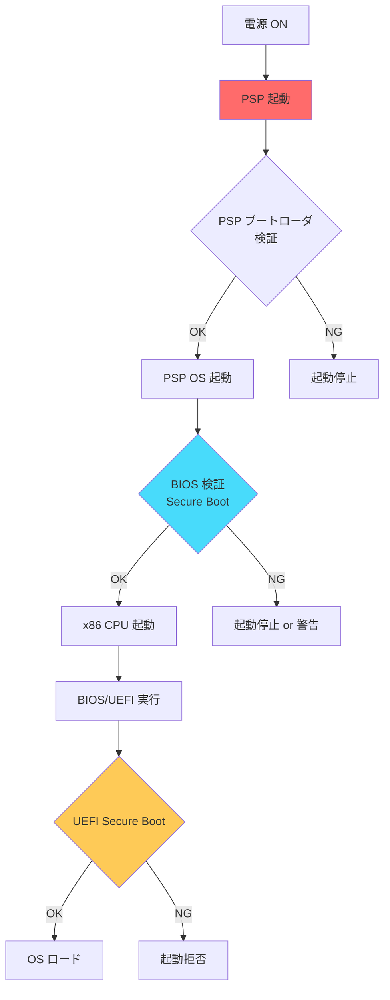
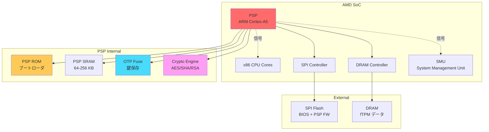
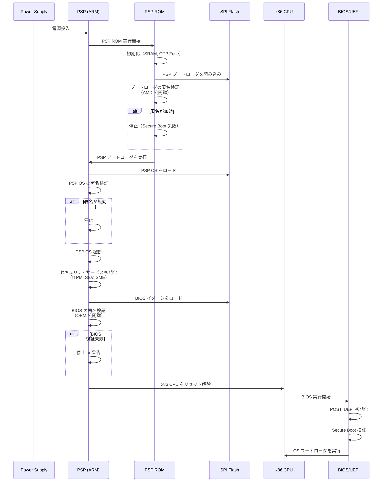
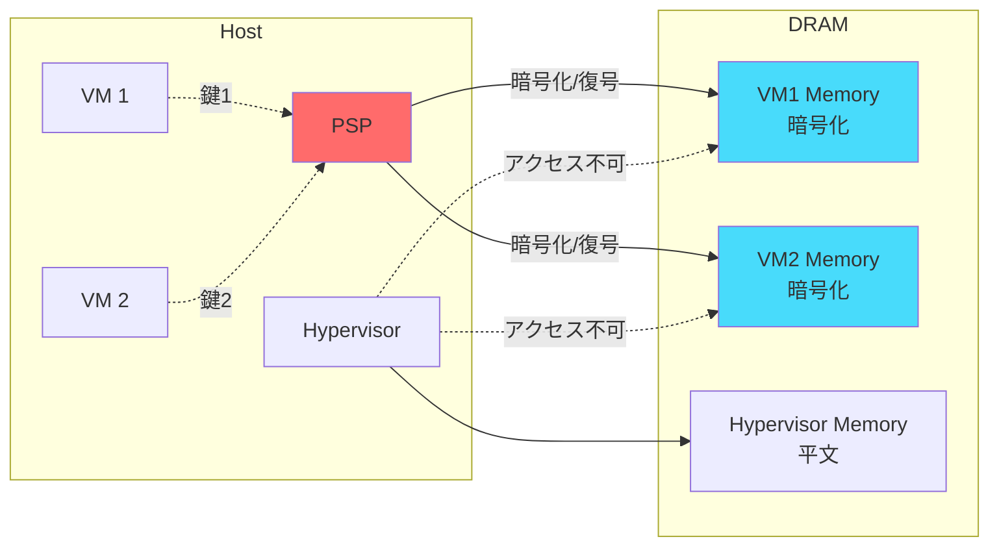
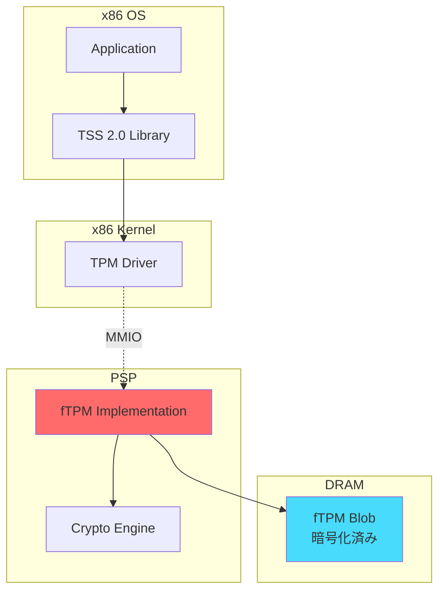

# AMD PSP の役割と仕組み

<!-- Status: completed -->
<!-- Last Updated: 2025-10-05 -->

🎯 **この章で学ぶこと**
- AMD PSP（Platform Security Processor）のアーキテクチャと目的
- PSP と Intel ME/Boot Guard の違い
- PSP のブートフローとセキュアブート
- AMD Secure Processor の機能と役割
- PSP ファームウェアの構造と検証プロセス
- SEV、SME、fTPM などのセキュリティ機能
- PSP の設定とデバッグ方法
- PSP に関するセキュリティ考察

📚 **前提知識**
- [Part IV Chapter 5: Intel Boot Guard の役割と仕組み](./05-intel-boot-guard.md)
- [Part IV Chapter 4: TPM と Measured Boot](./04-tpm-and-measured-boot.md)
- ARM アーキテクチャの基礎

---

## AMD PSP とは

**AMD Platform Security Processor（PSP）** は、AMD プロセッサに統合された**セキュリティ専用のプロセッサ**であり、プラットフォームセキュリティの中核を担います。PSP の最大の特徴は、**独立した ARM Cortex-A5 プロセッサ**として動作し、x86 メインプロセッサよりも**先に起動**する点です。PSP は、Intel の Management Engine（ME）と Intel Boot Guard を組み合わせたような存在であり、セキュアブート、鍵管理、メモリ暗号化、TPM 機能など、幅広いセキュリティサービスを提供します。PSP は、AMD Ryzen、EPYC、Threadripper といった AMD の主要プロセッサに搭載されており、サーバからコンシューマ PC まで、広範なプラットフォームで使用されています。

PSP の主要な役割は、**5つのセキュリティ機能**に集約されます。まず、**セキュアブート**では、BIOS/UEFI ファームウェアの完全性を検証し、改ざんされたコードの実行を防ぎます。PSP は、x86 CPU がリセット解除される前に BIOS の署名を検証し、検証に成功した場合のみ x86 CPU を起動します。これにより、[Part IV Chapter 5](./05-intel-boot-guard.md) で説明した Intel Boot Guard と同様の早期検証を実現します。次に、**鍵管理**では、暗号化鍵の生成、保存、管理を PSP 内部で行います。PSP は、OTP Fuse（One-Time Programmable Fuse）にチップ固有鍵（Chip Unique Key）を保存し、この鍵を使用してファームウェアや fTPM データを暗号化します。さらに、**メモリ暗号化**では、SEV（Secure Encrypted Virtualization）や SME（Secure Memory Encryption）を制御し、VM ごとのメモリ暗号化やシステムメモリ全体の透過的な暗号化を実現します。これにより、クラウド環境でのマルチテナント分離や、物理攻撃からのデータ保護が可能になります。また、**TPM 機能**では、fTPM（Firmware TPM）を実装し、物理的な dTPM（Discrete TPM）チップがないシステムでも TPM 2.0 機能を提供します。fTPM は PSP 内で動作し、PCR、鍵階層、Sealed Storage、Remote Attestation など、標準的な TPM 機能をすべてサポートします。最後に、**セキュアアップデート**では、PSP ファームウェア自体を安全に更新するための仕組みを提供し、署名検証とアンチロールバック（Anti-Rollback）により、不正なファームウェアへのダウングレードを防ぎます。

PSP を理解する上で重要なのが、**起動順序における位置づけ**です。PSP は、電源投入後、**x86 CPU よりも先に起動**します。具体的には、電源が投入されると、まず PSP の ROM コード（PSP Boot ROM）が実行され、PSP ブートローダを検証してロードします。次に、PSP ブートローダが PSP OS をロードして起動します。PSP OS が起動すると、セキュリティサービス（fTPM、SEV、SME）を初期化し、その後、SPI Flash から BIOS イメージをロードして署名を検証します。BIOS の検証に成功すると、PSP は x86 CPU のリセットを解除し、x86 CPU が BIOS/UEFI ファームウェアの実行を開始します。この起動順序により、**PSP → BIOS → UEFI Secure Boot → OS** という信頼チェーンが確立されます。PSP がなければ、攻撃者は BIOS を改ざんし、その後の Secure Boot 検証を無効化できてしまいます。PSP により、この最初のステップが保護され、プラットフォーム全体のセキュリティ基盤が確保されます。

PSP は、**Intel の ME と Boot Guard** と比較されることが多いですが、いくつかの重要な違いがあります。まず、**プロセッサアーキテクチャ**において、PSP は ARM Cortex-A5（32ビット RISC）を使用するのに対し、Intel ME は x86 ベースの Quark または Atom プロセッサを使用します。ARM アーキテクチャの利点は、低消費電力で動作し、TrustZone（Secure/Non-Secure の分離）をサポートすることです。次に、**セキュアブート**において、PSP は BIOS の検証を PSP OS が行うのに対し、Intel では Boot Guard ACM（Authenticated Code Module）が検証を行います。さらに、**メモリ暗号化**において、AMD SEV は VM ごとに異なる鍵で暗号化できるのに対し、Intel TME（Total Memory Encryption）は初期バージョンではシステム全体で同じ鍵を使用します。AMD SEV-SNP（Secure Nested Paging）では、さらに VM の完全性保護とアタック面の縮小が実現されています。また、**オープンソース対応**において、AMD は PSP の一部仕様やツールを公開しており、コミュニティによるリバースエンジニアリング（PSPReverse プロジェクト）も活発です。一方、Intel ME は完全にクローズドソースであり、仕様の公開が限定的です。最後に、**リモート管理**において、Intel ME は AMT（Active Management Technology）による強力なリモート管理機能を提供しますが、PSP のリモート管理機能は限定的です。

### 補足図：PSP の位置づけ



### 補足表：Intel ME/Boot Guard との比較

| 項目 | AMD PSP | Intel ME + Boot Guard |
|------|---------|----------------------|
| **プロセッサ** | ARM Cortex-A5 | x86 (Quark/Atom) |
| **起動順序** | PSP → x86 CPU | ME → x86 CPU |
| **セキュアブート** | PSP が BIOS を検証 | Boot Guard ACM が検証 |
| **鍵保存** | PSP OTP Fuse | Intel OTP Fuse |
| **メモリ暗号化** | SEV/SME | TME/MKTME |
| **TPM** | fTPM 2.0 | PTT（Platform Trust Technology） |
| **オープンソース** | 一部公開 | 非公開 |
| **リモート管理** | 限定的 | AMT（Active Management Technology） |

---

## PSP のアーキテクチャ

### PSP の物理構成



### PSP の主要コンポーネント

#### 1. ARM Cortex-A5 コア

**仕様**：
- ARM Cortex-A5（32ビット RISC プロセッサ）
- 動作周波数: 〜100-200 MHz（x86 より低い）
- TrustZone 対応

**役割**：
- PSP ファームウェアを実行
- BIOS の検証
- セキュリティサービスの提供

#### 2. PSP ROM（Boot ROM）

**役割**：
- PSP の**最初の Root of Trust**
- PSP ブートローダを検証してロード
- **読み取り専用**（製造時に焼き込み、変更不可）

**格納内容**：
- PSP ブートローダ検証コード
- AMD の公開鍵（ハッシュ）
- 初期化コード

#### 3. OTP Fuse（One-Time Programmable）

**格納内容**：
```c
typedef struct {
  UINT8   PlatformVendorId[16];    // プラットフォームベンダー ID
  UINT8   PspBootloaderHash[32];   // PSP ブートローダのハッシュ
  UINT8   OemPublicKeyHash[32];    // OEM 公開鍵のハッシュ
  UINT32  SecureBootPolicy;        // セキュアブートポリシー
  UINT8   FirmwareEncryptionKey[32]; // ファームウェア暗号化鍵
  UINT32  AntiRollbackCounters[8]; // アンチロールバック カウンタ
  UINT8   ChipUniqueKey[32];       // チップ固有鍵
} PSP_OTP_FUSE;
```

#### 4. PSP SRAM

**役割**：
- PSP の**作業メモリ**
- サイズ: 64KB〜256KB（世代により異なる）
- x86 CPU からはアクセス不可

**用途**：
- PSP OS とアプリケーションの実行
- 一時的な鍵の保存
- fTPM のデータキャッシュ

#### 5. Crypto Engine

**サポートアルゴリズム**：
- **対称鍵暗号**: AES-128/256（GCM/CBC/CTR）
- **ハッシュ**: SHA-1/SHA-256/SHA-384/SHA-512
- **公開鍵暗号**: RSA-2048/3072/4096、ECC P-256/P-384
- **乱数生成器**: TRNG（True Random Number Generator）

---

## PSP のブートフロー

### PSP とシステムの起動シーケンス



### 詳細ステップ

#### Step 1: PSP ROM の実行

```c
// PSP ROM の擬似コード
VOID
PspRomEntry (
  VOID
  )
{
  // 1. SRAM を初期化
  InitializeSram ();

  // 2. OTP Fuse から設定を読み込み
  ReadOtpFuse (&gOtpFuse);

  // 3. SPI Flash から PSP ブートローダをロード
  UINT8 *Bootloader = LoadFromFlash (PSP_BOOTLOADER_OFFSET, PSP_BOOTLOADER_SIZE);

  // 4. ブートローダの署名を検証
  if (!VerifySignature (Bootloader, &AmdPublicKey)) {
    // セキュアブート失敗
    HaltSystem ();
  }

  // 5. ブートローダにジャンプ
  ((VOID (*)(VOID))Bootloader) ();
}
```

#### Step 2: PSP ブートローダの実行

```c
VOID
PspBootloaderEntry (
  VOID
  )
{
  // 1. PSP OS イメージをロード
  PSP_OS_IMAGE *PspOs = LoadPspOs ();

  // 2. PSP OS の署名を検証
  if (!VerifyPspOs (PspOs)) {
    HaltSystem ();
  }

  // 3. アンチロールバック チェック
  if (PspOs->Version < gOtpFuse.MinPspVersion) {
    // ダウングレード攻撃
    HaltSystem ();
  }

  // 4. PSP OS を復号（暗号化されている場合）
  DecryptPspOs (PspOs, &gOtpFuse.FirmwareEncryptionKey);

  // 5. PSP OS にジャンプ
  JumpToPspOs (PspOs);
}
```

#### Step 3: PSP OS の実行と BIOS 検証

```c
VOID
PspOsEntry (
  VOID
  )
{
  // 1. PSP サービスを初期化
  InitializeCryptoEngine ();
  InitializeFtpm ();
  InitializeSev ();

  // 2. BIOS イメージをロード
  UINT8 *BiosImage = LoadBiosFromFlash ();

  // 3. BIOS の署名を検証
  if (gOtpFuse.SecureBootPolicy & SECURE_BOOT_ENABLED) {
    if (!VerifyBiosSignature (BiosImage, &gOtpFuse.OemPublicKeyHash)) {
      if (gOtpFuse.SecureBootPolicy & HALT_ON_FAILURE) {
        // 検証失敗 → 停止
        HaltSystem ();
      } else {
        // 警告のみ
        LogSecurityEvent (BIOS_VERIFICATION_FAILED);
      }
    }
  }

  // 4. fTPM に BIOS ハッシュを Extend
  ExtendPcr (0, CalculateHash (BiosImage));

  // 5. x86 CPU を起動
  ReleaseX86Reset ();

  // 6. x86 CPU の要求に応じてサービスを提供
  PspServiceLoop ();
}
```

---

## PSP ファームウェアの構造

### PSP Firmware Directory Table

PSP ファームウェアは SPI Flash 内の **PSP Directory** に格納されます：

```
+---------------------------+
| BIOS Region               |
+---------------------------+
| ...                       |
+---------------------------+
| PSP Directory L2          | ← 第2レベル（詳細エントリ）
| - PSP Recovery Bootloader |
| - PSP Bootloader          |
| - PSP OS                  |
| - Secure OS (TEE)         |
| - SMU Firmware            |
| - fTPM Blob               |
| - OEM Signing Key         |
| - BIOS Key Manifest       |
| - BIOS RTM Signature      |
+---------------------------+
| PSP Directory L1          | ← 第1レベル（ポインタ）
+---------------------------+
| Embedded Firmware Structure |
+---------------------------+
```

### PSP Directory Entry

```c
typedef struct {
  UINT32  Type;           // エントリタイプ（ブートローダ、OS など）
  UINT32  Size;           // サイズ
  UINT64  Location;       // SPI Flash 内のオフセット
  UINT64  Destination;    // ロード先アドレス（PSP SRAM）
  // オプショナル
  UINT32  Version;        // バージョン番号
  UINT8   Hash[32];       // SHA-256 ハッシュ
  UINT8   Signature[256]; // RSA 署名
} PSP_DIRECTORY_ENTRY;
```

### 主要な PSP ファームウェアエントリ

| Type | 名前 | 説明 |
|------|------|------|
| 0x01 | PSP Recovery Bootloader | リカバリ用ブートローダ |
| 0x02 | PSP Bootloader | 通常ブートローダ |
| 0x08 | SMU Firmware | System Management Unit FW |
| 0x0A | PSP OS | PSP オペレーティングシステム |
| 0x12 | Secure OS | ARM TrustZone Secure OS |
| 0x1A | fTPM Blob | ファームウェア TPM データ |
| 0x05 | OEM Signing Key | OEM 公開鍵 |
| 0x07 | RTM Signature | BIOS RTM（Root of Trust for Measurement）署名 |
| 0x4A | SEV Code | SEV（Secure Encrypted Virtualization）コード |

---

## AMD セキュリティ機能

### 1. Secure Boot（PSP セキュアブート）

**仕組み**：
- PSP が BIOS の署名を検証
- OEM の公開鍵を OTP Fuse に保存
- BIOS RTM Signature と比較

**検証フロー**：
```c
BOOLEAN
VerifyBiosSignature (
  IN UINT8  *BiosImage,
  IN UINTN  BiosSize
  )
{
  PSP_DIRECTORY_ENTRY  *RtmSigEntry;
  PSP_DIRECTORY_ENTRY  *OemKeyEntry;
  UINT8                BiosHash[32];
  RSA_PUBLIC_KEY       *OemKey;
  UINT8                *Signature;

  // 1. BIOS のハッシュを計算
  Sha256 (BiosImage, BiosSize, BiosHash);

  // 2. PSP Directory から OEM 公開鍵を取得
  OemKeyEntry = FindPspDirectoryEntry (PSP_ENTRY_OEM_KEY);
  OemKey = (RSA_PUBLIC_KEY *) LoadEntry (OemKeyEntry);

  // 3. OEM 公開鍵のハッシュを OTP Fuse と比較
  UINT8 OemKeyHash[32];
  Sha256 (OemKey, sizeof (RSA_PUBLIC_KEY), OemKeyHash);
  if (memcmp (OemKeyHash, gOtpFuse.OemPublicKeyHash, 32) != 0) {
    return FALSE; // 鍵が一致しない
  }

  // 4. BIOS RTM Signature を取得
  RtmSigEntry = FindPspDirectoryEntry (PSP_ENTRY_RTM_SIGNATURE);
  Signature = LoadEntry (RtmSigEntry);

  // 5. 署名を検証
  return RsaVerify (OemKey, Signature, BiosHash, 32);
}
```

### 2. SEV（Secure Encrypted Virtualization）

**目的**：
- **仮想マシンのメモリを暗号化**
- ハイパーバイザーからも保護

**仕組み**：


**暗号化プロセス**：
- 各 VM に**固有の暗号化鍵**（AMD Secure Encryption Key, SEK）
- メモリコントローラで**透過的に暗号化/復号**
- ハイパーバイザーには暗号化されたデータのみ見える

**SEV バリエーション**：

| 機能 | SEV | SEV-ES | SEV-SNP |
|------|-----|--------|---------|
| **メモリ暗号化** | ✓ | ✓ | ✓ |
| **レジスタ保護** | ✗ | ✓ | ✓ |
| **Integrity 保護** | ✗ | ✗ | ✓ |
| **Remote Attestation** | ✓ | ✓ | ✓ |
| **対応世代** | EPYC 1st Gen | EPYC 2nd Gen | EPYC 3rd Gen+ |

**SEV-SNP（Secure Nested Paging）**：
- **Integrity チェック**: メモリページの改ざんを検出
- **Reverse Map Table**: ハイパーバイザーの不正なページマッピングを防止

### 3. SME（Secure Memory Encryption）

**目的**：
- **システム全体のメモリを暗号化**
- 物理攻撃（Cold Boot Attack）を防止

**仕組み**：
- CPU が生成した **Memory Encryption Key（MEK）** で暗号化
- DRAM コントローラで透過的に暗号化/復号
- OS やアプリケーションは変更不要

**SME と SEV の違い**：

| 項目 | SME | SEV |
|------|-----|-----|
| **用途** | OS 全体の保護 | 仮想マシン個別の保護 |
| **鍵** | システムで1つ | VM ごとに異なる |
| **性能** | オーバーヘッド小 | オーバーヘッド中 |
| **対象** | すべてのメモリ | 指定したメモリ領域 |

### 4. fTPM（Firmware TPM）

**仕組み**：
- PSP 上で **TPM 2.0 仕様を実装**
- TPM データは暗号化して DRAM に保存
- PSP が x86 CPU に TPM サービスを提供

**fTPM のアーキテクチャ**：


**fTPM の初期化**：
```c
VOID
InitializeFtpm (
  VOID
  )
{
  // 1. DRAM から fTPM Blob をロード
  FTPM_BLOB *Blob = LoadFtpmBlob ();

  // 2. Blob を復号（PSP の ChipUniqueKey を使用）
  DecryptFtpmBlob (Blob, &gOtpFuse.ChipUniqueKey);

  // 3. fTPM の状態を復元
  RestoreFtpmState (Blob);

  // 4. PCR をリセット（起動時）
  for (int i = 0; i < 24; i++) {
    ResetPcr (i);
  }

  // 5. x86 とのインターフェースを初期化
  InitializeTpmInterface ();
}
```

---

## PSP の設定とデバッグ

### PSP の有効化/無効化

**UEFI Setup での設定**：
```
Security
  └─ AMD Platform Security
      ├─ PSP Enabled: [Enabled/Disabled]
      ├─ Secure Boot: [Enabled/Disabled]
      ├─ fTPM: [Enabled/Disabled]
      └─ SEV: [Enabled/Disabled]
```

### Linux での PSP 状態確認

```bash
# 1. PSP デバイスの確認
ls /dev/psp*

# 出力例:
# /dev/psp

# 2. SEV の状態を確認
sudo cat /sys/firmware/efi/efivars/SevStatus-* | xxd

# 3. fTPM の状態を確認
ls /dev/tpm*

# 4. dmesg で PSP ログを確認
sudo dmesg | grep -i psp
sudo dmesg | grep -i sev

# 出力例:
# ccp 0000:22:00.2: enabling device (0000 -> 0002)
# ccp 0000:22:00.2: sev enabled
# ccp 0000:22:00.2: psp enabled
```

### PSP ファームウェアの抽出と解析

```bash
# 1. BIOS イメージをダンプ
sudo flashrom -p internal -r bios_dump.bin

# 2. PSP Tool を使って PSP Directory を抽出
# https://github.com/PSPReverse/PSPTool
psptool bios_dump.bin

# 出力例:
# PSP Directory L1:
#   Entry 0: Type=0x01 (Recovery Bootloader), Size=0x10000, Offset=0x20000
#   Entry 1: Type=0x02 (Bootloader), Size=0x20000, Offset=0x30000
#   Entry 2: Type=0x08 (SMU Firmware), Size=0x40000, Offset=0x50000
#   Entry 3: Type=0x0A (PSP OS), Size=0x80000, Offset=0x90000

# 3. 特定エントリを抽出
psptool -X -t 0x0A bios_dump.bin -o psp_os.bin

# 4. PSP OS を逆アセンブル（ARM）
arm-none-eabi-objdump -D -b binary -marm psp_os.bin > psp_os.asm
```

### PSP のシリアルデバッグ

**PSP UART の有効化**：

一部のマザーボードでは、PSP の UART 出力をヘッダピンで取り出せます：

```bash
# 1. PSP UART を有効化（BIOS 設定またはレジスタ書き込み）
# Ryzen の例: FCH::UART0 を PSP に割り当て

# 2. シリアルコンソールで接続
# ボーレート: 115200 bps, 8N1
screen /dev/ttyUSB0 115200

# 3. PSP のブートログが表示される
# 出力例:
# [PSP] ROM: Init
# [PSP] ROM: Loading Bootloader from 0x30000
# [PSP] ROM: Verifying signature...
# [PSP] ROM: Signature OK
# [PSP] BL: Starting PSP OS
# [PSP] OS: Initializing services
# [PSP] OS: fTPM init
# [PSP] OS: SEV init
```

---

## PSP のセキュリティ考察

### 1. PSP の攻撃面

**潜在的な脅威**：
- **PSP ファームウェアの脆弱性**: PSP OS のバグ
- **サイドチャネル攻撃**: 電力解析、タイミング攻撃
- **物理攻撃**: OTP Fuse の読み取り、SPI Flash の書き換え
- **リプレイ攻撃**: 古いファームウェアへのロールバック

### 2. 既知の脆弱性と対策

#### CVE-2021-26333: PSP ブートローダの脆弱性

**概要**：
- PSP ブートローダの**バッファオーバーフロー**
- 特定条件で任意コード実行が可能

**影響**：
- EPYC 1st/2nd Gen、Ryzen 1000-3000 シリーズ

**対策**：
- PSP ファームウェアの更新
- BIOS アップデート（PSP FW を含む）

#### PSP のサプライチェーンリスク

**懸念**：
- PSP ファームウェアは **AMD のクローズドソース**
- 製造時の改ざんリスク

**対策**：
- **Verified Boot**: AMD とOEM の二重署名
- **アンチロールバック**: OTP Fuse のバージョンカウンタ

### 3. プライバシーとトラストの問題

**論点**：
- PSP は**常時動作**している
- x86 CPU からは制御不可
- リモートからの攻撃や監視の可能性

**コミュニティの取り組み**：
- **PSPReverse**: PSP の解析プロジェクト
  - https://github.com/PSPReverse/PSPTool
- **AMD PSP Disable**: PSP を無効化する試み（非公式）

---

## トラブルシューティング

### Q1: PSP 有効化後に起動しない

**原因**：
- BIOS の署名が無効
- OTP Fuse に誤った鍵ハッシュが書き込まれた

**確認方法**：

```bash
# シリアルコンソールでエラーメッセージを確認
# 出力例:
# [PSP] BIOS verification failed
# [PSP] Halting system
```

**解決策**：

1. **CMOS クリア**: PSP 設定をリセット
2. **Recovery BIOS**: デュアル BIOS 機能があれば切り替え
3. **SPI Flash 再書き込み**: 外部プログラマで修復

### Q2: fTPM がエラーを返す

**原因**：
- fTPM Blob の破損
- PSP ファームウェアのバグ

**確認方法**：

```bash
# TPM のエラーログを確認
sudo dmesg | grep -i tpm

# 出力例:
# tpm tpm0: A TPM error (28) occurred cmd get random
```

**解決策**：

```bash
# 1. fTPM をクリア（BIOS Setup で）
# Security -> fTPM -> Clear fTPM

# 2. または Linux から
sudo tpm2_clear
```

### Q3: SEV が有効にならない

**原因**：
- CPU が SEV 非対応
- BIOS 設定で無効化
- カーネルが SEV 非対応

**確認方法**：

```bash
# 1. CPU の SEV サポート確認
grep sev /proc/cpuinfo

# 2. SEV デバイスの確認
ls /dev/sev

# 3. SEV 機能の確認
sudo dmesg | grep sev

# 出力例:
# ccp 0000:22:00.2: sev enabled
# SEV supported: 509 ASIDs
```

**解決策**：

1. **BIOS で SEV を有効化**
2. **カーネルを SEV 対応版に更新**（CONFIG_AMD_MEM_ENCRYPT=y）

---

## 💻 演習

### 演習 1: PSP の状態確認

**目標**: システムで PSP が動作しているか確認

**手順**：

```bash
# 1. PSP デバイスの確認
ls -l /dev/psp*

# 2. dmesg で PSP ログを確認
sudo dmesg | grep -i "ccp\|psp\|sev"

# 3. fTPM の確認
ls -l /dev/tpm*
sudo tpm2_getcap properties-fixed | grep "TPM2_PT_FAMILY_INDICATOR"

# 4. SEV のサポート確認
grep sev /proc/cpuinfo
ls /dev/sev
```

**期待される結果**：
- PSP デバイスが存在する
- fTPM が TPM 2.0 として認識される
- SEV 対応 CPU では /dev/sev が存在

### 演習 2: PSP ファームウェアの解析

**目標**: BIOS から PSP ファームウェアを抽出

**手順**：

```bash
# 1. PSPTool をインストール
git clone https://github.com/PSPReverse/PSPTool.git
cd PSPTool
pip3 install -r requirements.txt

# 2. BIOS イメージをダンプ
sudo flashrom -p internal -r bios.bin

# 3. PSP Directory を解析
python3 psptool.py bios.bin

# 4. PSP OS を抽出
python3 psptool.py -X -t 0x0A bios.bin -o psp_os.bin

# 5. ファイル情報を確認
file psp_os.bin
hexdump -C psp_os.bin | head -20
```

**期待される結果**：
- PSP Directory のエントリが一覧表示される
- PSP OS が抽出できる

### 演習 3: SEV 仮想マシンの起動

**目標**: SEV で保護された仮想マシンを起動

**前提**：
- AMD EPYC または Ryzen Pro CPU
- QEMU/KVM with SEV support

**手順**：

```bash
# 1. SEV のサポート確認
sudo /usr/sbin/sevctl ok

# 2. SEV VM 用の OVMF（UEFI）をダウンロード
wget https://download.01.org/intel-sgx/latest/dcap-latest/linux/prebuilt/ovmf/OVMF_CODE.fd

# 3. VM を SEV で起動
qemu-system-x86_64 \
  -enable-kvm \
  -cpu EPYC \
  -machine q35 \
  -smp 4 \
  -m 4096 \
  -drive if=pflash,format=raw,readonly=on,file=OVMF_CODE.fd \
  -drive file=ubuntu.qcow2,if=virtio \
  -object sev-guest,id=sev0,cbitpos=47,reduced-phys-bits=1 \
  -machine memory-encryption=sev0 \
  -nographic

# 4. VM 内で暗号化を確認
# VM 内で実行:
sudo dmesg | grep -i sev
# 出力例: AMD Memory Encryption Features active: SEV
```

**期待される結果**：
- SEV が有効な VM が起動する
- VM のメモリがホストから保護される

---

## まとめ

この章では、**AMD PSP（Platform Security Processor）** の詳細な仕組みを学びました。AMD PSP は、AMD プロセッサに統合された**セキュリティ専用のプロセッサ**であり、**独立した ARM Cortex-A5 プロセッサ**として動作します。PSP の最大の特徴は、**x86 CPU よりも先に起動**し、BIOS/UEFI ファームウェアのセキュアブートを実行する点です。この早期起動により、PSP は**信頼チェーンの起点**（Root of Trust）となり、BIOS の改ざんを検出して不正なコードの実行を防ぎます。PSP は、Intel の Management Engine（ME）と Intel Boot Guard を組み合わせたような存在であり、セキュアブート、鍵管理、メモリ暗号化、fTPM、セキュアアップデートといった幅広いセキュリティ機能を統合的に提供します。

PSP のアーキテクチャは、**4つの主要コンポーネント**で構成されています。まず、**ARM Cortex-A5 コア**は、32ビット RISC プロセッサであり、約 100-200 MHz の低周波数で動作します。ARM TrustZone をサポートし、Secure World と Normal World を分離してセキュリティを強化します。次に、**PSP ROM（Boot ROM）** は、PSP の**最初の Root of Trust** であり、製造時に焼き込まれた読み取り専用のコードです。PSP ROM は、PSP ブートローダを AMD の公開鍵で検証し、検証に成功した場合のみ実行します。さらに、**OTP Fuse（One-Time Programmable Fuse）** は、プラットフォームベンダー ID、OEM 公開鍵ハッシュ、セキュアブートポリシー、ファームウェア暗号化鍵、アンチロールバックカウンタ、チップ固有鍵（Chip Unique Key）などの重要な設定と鍵を不変保存します。OTP Fuse は一度書き込むと変更できないため、ソフトウェア攻撃では改ざんできません。最後に、**Crypto Engine** は、AES-128/256、SHA-1/SHA-256/SHA-384/SHA-512、RSA-2048/3072/4096、ECC P-256/P-384、TRNG（True Random Number Generator）といった暗号化アルゴリズムをハードウェアで高速に実行します。

PSP が提供する**主要なセキュリティ機能**は、プラットフォーム全体のセキュリティを大幅に向上させます。まず、**Secure Boot（PSP セキュアブート）** では、PSP が SPI Flash から BIOS イメージをロードし、OEM の公開鍵で署名を検証します。検証に成功した場合のみ x86 CPU のリセットを解除し、BIOS を起動します。これにより、ブートキットや BIOS ルートキットの実行を根本から防ぎます。次に、**SEV（Secure Encrypted Virtualization）** では、仮想マシンごとに異なる暗号化鍵を使用してメモリを暗号化し、ハイパーバイザーからも VM のメモリ内容を保護します。SEV は、クラウド環境でのマルチテナント分離に極めて有効であり、ハイパーバイザーが侵害されても VM のデータは保護されます。SEV-ES（Encrypted State）では、さらにレジスタ状態も暗号化し、SEV-SNP（Secure Nested Paging）では、VM の完全性保護とサイドチャネル攻撃への耐性が強化されています。さらに、**SME（Secure Memory Encryption）** では、システムメモリ全体を透過的に暗号化し、物理的な攻撃（Cold Boot Attack、メモリダンプ）からデータを保護します。SME は OS から意識されず、既存のソフトウェアをそのまま使用できます。また、**fTPM（Firmware TPM）** では、PSP 内で TPM 2.0 を実装し、物理的な dTPM チップがないシステムでも PCR、Sealed Storage、Remote Attestation などの TPM 機能を提供します。fTPM のデータは PSP の SRAM と DRAM に保存され、Chip Unique Key で暗号化されます。

PSP は、**Intel の ME と Boot Guard** と比較すると、いくつかの重要な違いがあります。まず、**プロセッサアーキテクチャ**において、PSP は ARM Cortex-A5 を使用し、低消費電力で動作します。ARM TrustZone により、Secure World と Normal World を分離し、セキュリティを強化します。一方、Intel ME は x86 ベースの Quark または Atom プロセッサを使用します。次に、**メモリ暗号化**において、AMD SEV は VM ごとに異なる鍵で暗号化できるのに対し、Intel TME（Total Memory Encryption）は初期バージョンではシステム全体で同じ鍵を使用します。SEV-SNP では、さらに VM の完全性保護が追加され、ハイパーバイザーによる不正な VM メモリの変更を検出できます。さらに、**オープンソース対応**において、AMD は PSP の一部仕様やツール（PSPTool、AMD SEV ドキュメント）を公開しており、コミュニティによる解析活動（PSPReverse プロジェクト）も活発です。一方、Intel ME は完全にクローズドソースであり、仕様の公開が限定的です。最後に、**リモート管理**において、Intel ME は AMT（Active Management Technology）による帯域外管理（Out-of-Band Management）を提供しますが、PSP のリモート管理機能は限定的です。

PSP に関しては、**セキュリティ考察**も重要です。PSP ファームウェアは、過去にいくつかの脆弱性が報告されており、2018年には CTS Labs が複数の脆弱性（MASTERKEY、RYZENFALL、FALLOUT、CHIMERA）を公表しました。これらの脆弱性の多くは、ローカル管理者権限や物理アクセスが必要であり、実際の攻撃リスクは限定的でしたが、PSP ファームウェアの攻撃面を示しました。AMD は、定期的に BIOS/PSP ファームウェアの更新を提供し、既知の脆弱性を修正しています。また、PSP のコードの大部分は**クローズドソース**であり、外部からの監査が困難です。これに対し、コミュニティは PSPReverse プロジェクトなどでリバースエンジニアリングを行い、PSP の動作を解析しています。PSP の透明性を高めるために、AMD にはより多くの仕様の公開が期待されています。さらに、PSP には**ハードウェア的な無効化手段がない**ため、完全に無効化することは困難です。一部のマザーボードでは BIOS 設定で PSP の一部機能を無効化できますが、セキュアブートや fTPM を無効化するとセキュリティが低下します。

### 補足表：セキュリティのベストプラクティス

| 項目 | 推奨事項 |
|------|---------|
| **ファームウェア更新** | 定期的に BIOS/PSP FW を更新 |
| **Secure Boot** | PSP セキュアブートを有効化 |
| **fTPM** | dTPM がない場合は fTPM を使用 |
| **SEV** | 仮想化環境では SEV を検討 |
| **監視** | PSP のログとエラーを監視 |

---

次章では、**SPI フラッシュ保護機構**について学びます。BIOS を格納する SPI Flash の保護は、Boot Guard や PSP と組み合わせることで、完全な信頼チェーンを構築します。

📚 **参考資料**
- [AMD Platform Security Processor](https://www.amd.com/en/technologies/pro-security)
- [AMD SEV Documentation](https://developer.amd.com/sev/)
- [PSPReverse: PSP Reverse Engineering](https://github.com/PSPReverse/PSPTool)
- [AMD Memory Encryption Whitepaper](https://www.amd.com/system/files/TechDocs/memory-encryption-white-paper.pdf)
- [Google: AMD PSP Security Analysis](https://cfp.recon.cx/2019/talk/EVDARE/)
- [Linux Kernel: AMD SEV Documentation](https://www.kernel.org/doc/html/latest/virt/kvm/amd-memory-encryption.html)
