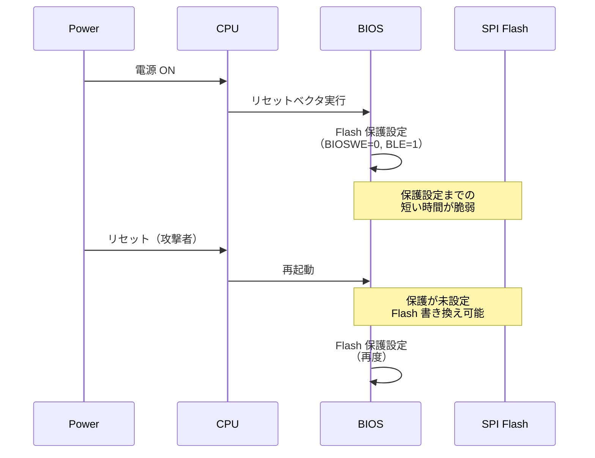

# SPI フラッシュ保護機構

<!-- Status: completed -->
<!-- Last Updated: 2025-10-05 -->

🎯 **この章で学ぶこと**
- SPI Flash の役割とブートプロセスにおける重要性
- ソフトウェア保護とハードウェア保護の仕組み
- Flash Descriptor と BIOS Region の構造
- Write Protection と Protected Range Registers
- Intel BIOS Guard / AMD PSP との統合
- Platform Reset Attack とその対策
- SPI Flash の設定とデバッグ方法
- 攻撃シナリオと防御策

📚 **前提知識**
- [Part IV Chapter 5: Intel Boot Guard の役割と仕組み](./05-intel-boot-guard.md)
- [Part IV Chapter 6: AMD PSP の役割と仕組み](./06-amd-psp.md)
- SPI プロトコルの基礎

---

## SPI Flash とは

### SPI Flash の役割

**SPI Flash** は、BIOS/UEFI ファームウェアを格納する不揮発性メモリです：

1. **BIOS の保存**: UEFI ファームウェアイメージ全体を格納
2. **設定の保存**: UEFI 変数、ブート設定
3. **管理データの保存**: Intel ME、AMD PSP のファームウェア
4. **リカバリ**: BIOS リカバリイメージ

> **Note**: SPI Flash は、システムの**Root of Trust**を格納する最も重要なコンポーネントの1つです。その保護が不十分だと、すべてのセキュリティ機構が無効化されます。

### SPI Flash の物理接続

```mermaid
graph LR
    CPU[CPU/PCH] <-->|SPI Bus| FLASH[SPI Flash Chip]

    subgraph SPI Interface
        CLK[CLK: Clock]
        MOSI[MOSI: Master Out Slave In]
        MISO[MISO: Master In Slave Out]
        CS[CS#: Chip Select]
        WP[WP#: Write Protect]
        HOLD[HOLD#: Hold]
    end

    CPU -.6本の信号線.-> SPI Interface
    SPI Interface -.-> FLASH

    style FLASH fill:#ff6b6b
    style CPU fill:#48dbfb
```

**SPI 信号線**：
- **CLK**: クロック信号（通常 16-50 MHz）
- **MOSI**: データ送信（CPU → Flash）
- **MISO**: データ受信（Flash → CPU）
- **CS#**: チップ選択（アクティブ Low）
- **WP#**: ハードウェア書き込み保護（アクティブ Low）
- **HOLD#**: データ転送の一時停止

### SPI Flash の容量とレイアウト

```
+---------------------------+ 0x0000000
| Flash Descriptor          | 4 KB
| - Flash Map               |
| - Component Section       |
| - Region Section          |
| - Master Section          |
+---------------------------+ 0x0001000
| Intel ME / AMD PSP        | 1-7 MB
| - ME/PSP Firmware         |
| - Configuration           |
+---------------------------+ 0x0800000
| GbE (Gigabit Ethernet)    | 8 KB (Optional)
+---------------------------+ 0x0802000
| Platform Data             | Variable
+---------------------------+ 0x0C00000
| BIOS Region               | 4-8 MB
| - SEC (Reset Vector)      |
| - PEI Core                |
| - DXE Core                |
| - UEFI Variables          |
| - Boot Guard (ACM/KM/BPM) |
+---------------------------+ 0x1000000 (16 MB Flash の場合)
```

---

## Flash Descriptor

### Flash Descriptor の役割

**Flash Descriptor** は、SPI Flash の先頭 4KB に配置される**制御データ**です：

1. **リージョンの定義**: Flash 内の各領域の位置とサイズ
2. **アクセス権限の設定**: 各マスターがアクセス可能な領域
3. **ストラップ設定**: CPU/PCH の初期設定

### Flash Descriptor の構造

```c
typedef struct {
  // Signature: 0x0FF0A55A
  UINT32  Signature;
  UINT32  FlashParameters;
  UINT32  ComponentSection[3];
  UINT32  RegionSection[5];
  UINT32  MasterSection[3];
  UINT32  IchStrapSection[18];
  UINT32  MchStrapSection[8];
  // ...
} FLASH_DESCRIPTOR;
```

### Region Section（領域定義）

5つのリージョンが定義されます：

```c
typedef struct {
  UINT16  Base;    // 4KB 単位のオフセット
  UINT16  Limit;   // 4KB 単位のリミット
} FLASH_REGION;

typedef struct {
  FLASH_REGION  FlashDescriptor;  // 0: Flash Descriptor
  FLASH_REGION  BiosRegion;       // 1: BIOS
  FLASH_REGION  MeRegion;         // 2: Intel ME / AMD PSP
  FLASH_REGION  GbeRegion;        // 3: Gigabit Ethernet
  FLASH_REGION  PlatformData;     // 4: Platform Data
} FLASH_REGIONS;
```

### Master Section（アクセス権限）

各マスター（CPU, ME/PSP, GbE）のアクセス権限を定義：

```c
typedef struct {
  UINT8  ReadAccess;   // 読み取り可能なリージョン（ビットマップ）
  UINT8  WriteAccess;  // 書き込み可能なリージョン（ビットマップ）
} FLASH_MASTER_ACCESS;

typedef struct {
  FLASH_MASTER_ACCESS  BiosAccess;  // CPU (BIOS)
  FLASH_MASTER_ACCESS  MeAccess;    // Intel ME / AMD PSP
  FLASH_MASTER_ACCESS  GbeAccess;   // GbE Controller
} FLASH_MASTER_PERMISSIONS;
```

**例**：
```
BIOS (CPU):
  Read:  11111b (すべてのリージョン)
  Write: 11000b (BIOS, Platform Data のみ)

ME/PSP:
  Read:  00110b (ME, GbE)
  Write: 00110b (ME, GbE のみ)
```

### Flash Descriptor の読み取り

```bash
# flashrom で Flash Descriptor を読み取り
sudo flashrom -p internal -r flash.bin

# Intel Flash Image Tool (FIT) で解析
# または、fptw64 (Flash Programming Tool)
fptw64 -d flash.bin

# 出力例:
# Flash Descriptor
#   Region 0 (Descriptor): 0x00000000 - 0x00000FFF
#   Region 1 (BIOS):       0x00C00000 - 0x00FFFFFF
#   Region 2 (ME):         0x00001000 - 0x007FFFFF
#   Region 3 (GbE):        0x00800000 - 0x00801FFF
#   Region 4 (Platform):   0x00802000 - 0x00BFFFFF
#
# Master Access:
#   BIOS: Read=0x1F, Write=0x18
#   ME:   Read=0x06, Write=0x06
```

---

## SPI Flash 保護機構

### 1. ソフトウェア保護（Write Protection）

#### BIOS Control Register（BC）

```c
// PCH の LPC/eSPI コンフィグレーション空間
// オフセット 0xDC
typedef union {
  struct {
    UINT8  BiosWriteEnable    : 1;  // ビット 0: BIOS 書き込み許可
    UINT8  BiosLockEnable     : 1;  // ビット 1: BIOS ロック
    UINT8  Reserved           : 2;
    UINT8  TopSwapStatus      : 1;  // ビット 4: Top Swap
    UINT8  SmmBiosWriteProtect: 1;  // ビット 5: SMM BIOS 書き込み保護
    UINT8  Reserved2          : 2;
  } Bits;
  UINT8  Uint8;
} BIOS_CONTROL;
```

**重要なビット**：
- **BIOSWE（Bit 0）**: BIOS 書き込み許可
  - 0: 書き込み禁止
  - 1: 書き込み許可
- **BLE（Bit 1）**: BIOS ロック
  - 1: BIOSWE の変更を禁止（ロック）
- **SMM_BWP（Bit 5）**: SMM BIOS 書き込み保護
  - 1: BIOSWE=1 でも SMM 外からの書き込みを禁止

**設定例**：
```c
// UEFI DXE Phase で BIOS を保護
VOID
ProtectBiosRegion (
  VOID
  )
{
  BIOS_CONTROL  Bc;

  // 1. BIOS Control レジスタを読み取り
  Bc.Uint8 = MmioRead8 (PCH_LPC_BASE + 0xDC);

  // 2. BIOS 書き込みを禁止
  Bc.Bits.BiosWriteEnable = 0;

  // 3. SMM BIOS 書き込み保護を有効化
  Bc.Bits.SmmBiosWriteProtect = 1;

  // 4. BIOS ロックを有効化
  Bc.Bits.BiosLockEnable = 1;

  // 5. レジスタに書き戻し
  MmioWrite8 (PCH_LPC_BASE + 0xDC, Bc.Uint8);

  // これ以降、BIOSWE の変更は不可（リセットまで）
}
```

#### Protected Range Registers（PR0-PR4）

```c
// 最大 5 つの保護範囲を設定可能
// PCH SPIBAR + 0x84-0x90
typedef union {
  struct {
    UINT32  ProtectedRangeBase  : 13;  // 保護範囲の開始（4KB 単位）
    UINT32  Reserved            : 2;
    UINT32  ReadProtectionEnable: 1;   // 読み取り保護
    UINT32  ProtectedRangeLimit : 13;  // 保護範囲の終了（4KB 単位）
    UINT32  Reserved2           : 2;
    UINT32  WriteProtectionEnable:1;   // 書き込み保護
  } Bits;
  UINT32  Uint32;
} PROTECTED_RANGE;
```

**設定例**：
```c
VOID
SetProtectedRange (
  IN UINT32  RangeIndex,
  IN UINT32  BaseAddress,
  IN UINT32  LimitAddress
  )
{
  PROTECTED_RANGE  Pr;
  UINT32           SpiBar;

  // 1. SPI BAR を取得
  SpiBar = MmioRead32 (PCH_SPI_BASE + 0x10) & ~0xFFF;

  // 2. Protected Range を設定
  Pr.Bits.ProtectedRangeBase = BaseAddress >> 12;   // 4KB 単位
  Pr.Bits.ProtectedRangeLimit = LimitAddress >> 12;
  Pr.Bits.ReadProtectionEnable = 0;   // 読み取りは許可
  Pr.Bits.WriteProtectionEnable = 1;  // 書き込みは禁止

  // 3. PR レジスタに書き込み
  MmioWrite32 (SpiBar + 0x84 + (RangeIndex * 4), Pr.Uint32);
}

// 使用例: BIOS Region 全体を保護
SetProtectedRange (
  0,                    // PR0
  0x00C00000,           // BIOS Base
  0x00FFFFFF            // BIOS Limit
);
```

### 2. ハードウェア保護

#### WP# ピン（Write Protect Pin）

**仕組み**：
- SPI Flash チップの **WP#** ピンを **Low** にすると、ステータスレジスタの書き込みを禁止
- マザーボード上のジャンパやレジスタで制御

```c
// Status Register（Flash Chip 内部）
typedef union {
  struct {
    UINT8  WriteInProgress    : 1;  // ビット 0: 書き込み中
    UINT8  WriteEnableLatch   : 1;  // ビット 1: 書き込み許可ラッチ
    UINT8  BlockProtect       : 4;  // ビット 2-5: ブロック保護
    UINT8  Reserved           : 1;
    UINT8  StatusRegProtect   : 1;  // ビット 7: ステータスレジスタ保護
  } Bits;
  UINT8  Uint8;
} SPI_STATUS_REGISTER;

// WP# = Low の場合、ステータスレジスタの書き込みが禁止される
// → BlockProtect ビットが変更不可
// → 保護範囲が固定される
```

#### Block Protection（BP ビット）

SPI Flash チップ内部の保護ビット：

| BP2 | BP1 | BP0 | 保護範囲（16MB Flash の場合） |
|-----|-----|-----|---------------------------|
| 0   | 0   | 0   | 保護なし |
| 0   | 0   | 1   | 上位 8MB（0x800000 - 0xFFFFFF） |
| 0   | 1   | 0   | 上位 12MB（0x400000 - 0xFFFFFF） |
| 0   | 1   | 1   | 上位 14MB（0x200000 - 0xFFFFFF） |
| 1   | 0   | 0   | 上位 15MB（0x100000 - 0xFFFFFF） |
| 1   | 0   | 1   | すべて（0x000000 - 0xFFFFFF） |

**設定方法**：
```python
#!/usr/bin/env python3
import flashrom

# flashrom ライブラリを使用
flash = flashrom.open("internal")

# Status Register を読み取り
status = flash.read_status()
print(f"Current Status: 0x{status:02X}")

# Block Protect を設定（上位 8MB を保護）
# BP2=0, BP1=0, BP0=1
new_status = (status & ~0x1C) | 0x04
flash.write_status(new_status)

# WP# ピンを Low にして保護を固定
# （ハードウェア設定が必要）
```

### 3. Intel BIOS Guard との統合

**BIOS Guard** は、SMM でのみ BIOS 更新を許可する仕組みです：

```c
/**
  BIOS Guard による保護付き Flash 更新

  @param[in] Address   更新するアドレス
  @param[in] Data      更新データ
  @param[in] Size      サイズ

  @retval EFI_SUCCESS  成功
**/
EFI_STATUS
BiosGuardFlashUpdate (
  IN UINT32  Address,
  IN UINT8   *Data,
  IN UINT32  Size
  )
{
  // 1. SMM かどうかチェック
  if (!InSmm ()) {
    return EFI_ACCESS_DENIED;  // SMM 外からは不可
  }

  // 2. BIOS Guard が有効かチェック
  if (!IsBiosGuardEnabled ()) {
    return EFI_UNSUPPORTED;
  }

  // 3. BIOS Guard スクリプトを実行
  // BIOS Guard は専用のマイクロコードで Flash を更新
  ExecuteBiosGuardScript (Address, Data, Size);

  return EFI_SUCCESS;
}
```

**利点**：
- OS やドライバから直接 Flash を書き換えられない
- BIOS 更新は SMM を経由する必要がある
- 署名検証と組み合わせて使用

---

## Platform Reset Attack

### Platform Reset Attack とは

**攻撃手法**：
1. BIOS が起動して保護を設定
2. **攻撃者が瞬時にリセット**（電源ボタン、デバッガ）
3. 保護設定が有効になる前に Flash を書き換え



### 対策1: Early Boot Guard

**仕組み**：
- **CPU の Microcode** が起動直後に Flash を保護
- BIOS が実行される前に保護を有効化

```c
// Microcode 内（擬似コード）
VOID
EarlyBootGuard (
  VOID
  )
{
  // 1. OTP Fuse から設定を読み込み
  if (OtpFuse.EnableEarlyFlashProtection) {
    // 2. BIOS Control レジスタを設定
    SetBiosControl (BIOSWE=0, BLE=1, SMM_BWP=1);

    // 3. Protected Range を設定
    SetProtectedRange (0, BIOS_BASE, BIOS_LIMIT);
  }

  // 4. BIOS を検証（Boot Guard）
  VerifyBios ();

  // 5. BIOS を実行
  JumpToBios ();
}
```

### 対策2: Flash Descriptor Lock

**Flash Descriptor のロック**：
```c
// Flash Descriptor の FLOCKDN ビットを設定
// PCH SPIBAR + 0x04 (HSFS: Hardware Sequencing Flash Status)
typedef union {
  struct {
    UINT16  FlashCycleError      : 1;
    UINT16  FlashCycleDone       : 1;
    UINT16  Reserved             : 3;
    UINT16  FlashDescriptorLockDown:1;  // ビット 15
    // ...
  } Bits;
  UINT16  Uint16;
} HARDWARE_SEQUENCING_FLASH_STATUS;

VOID
LockFlashDescriptor (
  VOID
  )
{
  UINT32  SpiBar;
  UINT16  Hsfs;

  SpiBar = MmioRead32 (PCH_SPI_BASE + 0x10) & ~0xFFF;
  Hsfs = MmioRead16 (SpiBar + 0x04);

  // FLOCKDN ビットを設定
  Hsfs |= BIT15;
  MmioWrite16 (SpiBar + 0x04, Hsfs);

  // これ以降、Flash Descriptor の変更は不可（リセットまで）
}
```

### 対策3: Top Swap

**仕組み**：
- Flash の上位と下位を**スワップ**
- リカバリ用の BIOS を常に保護

```
通常モード:
+---------------------------+
| Main BIOS (上位)          | ← アクティブ
+---------------------------+
| Recovery BIOS (下位)      |
+---------------------------+

Top Swap モード:
+---------------------------+
| Main BIOS (上位)          |
+---------------------------+
| Recovery BIOS (下位)      | ← アクティブ
+---------------------------+
```

**設定**：
```c
VOID
EnableTopSwap (
  VOID
  )
{
  BIOS_CONTROL  Bc;

  Bc.Uint8 = MmioRead8 (PCH_LPC_BASE + 0xDC);
  Bc.Bits.TopSwapStatus = 1;  // Top Swap 有効
  MmioWrite8 (PCH_LPC_BASE + 0xDC, Bc.Uint8);

  // 次回起動時、Recovery BIOS から起動
}
```

---

## SPI Flash のデバッグとツール

### flashrom を使った Flash 操作

```bash
# 1. Flash 全体をダンプ
sudo flashrom -p internal -r flash_backup.bin

# 2. Flash の情報を表示
sudo flashrom -p internal

# 出力例:
# Found chipset "Intel C620 series chipset (QS/PRQ SKU)"
# Enabling flash write... OK.
# Found Winbond flash chip "W25Q128.V" (16384 kB, SPI) on ich_spi.

# 3. BIOS Region のみをダンプ
sudo flashrom -p internal -r bios_region.bin --ifd -i bios

# 4. BIOS Region に書き込み
sudo flashrom -p internal -w new_bios.bin --ifd -i bios

# 5. 保護状態を確認
sudo flashrom -p internal --wp-status

# 出力例:
# WP: status: 0x80
# WP: status.srp0: 1
# WP: write protect is enabled.
# WP: write protect range: start=0x00c00000, len=0x00400000
```

### chipsec を使ったセキュリティチェック

```bash
# 1. chipsec をインストール
sudo pip3 install chipsec

# 2. BIOS 書き込み保護をチェック
sudo chipsec_main -m common.bios_wp

# 出力例:
# [*] running module: chipsec.modules.common.bios_wp
# [*] Module path: /usr/local/lib/python3.8/dist-packages/chipsec/modules/common/bios_wp.py
#
# [*] BIOS Region Write Protection
# [*] BC = 0x02 << BIOS Control (b:d.f 00:31.5 + 0xDC)
#     [00] BIOSWE           = 0 << BIOS Write Enable
#     [01] BLE              = 1 << BIOS Lock Enable
#     [05] SMM_BWP          = 0 << SMM BIOS Write Protection
# [!] BIOS region write protection is enabled (writes restricted to SMM)
# [+] PASSED: BIOS is write protected

# 3. SPI Flash 保護をチェック
sudo chipsec_main -m common.spi_lock

# 4. Flash Descriptor のロック状態をチェック
sudo chipsec_main -m common.spi_desc

# 5. すべてのセキュリティチェックを実行
sudo chipsec_main
```

### UEFITool で Flash イメージを解析

```bash
# 1. UEFITool をダウンロード
wget https://github.com/LongSoft/UEFITool/releases/download/A59/UEFITool_NE_A59_linux_x86_64.zip
unzip UEFITool_NE_A59_linux_x86_64.zip

# 2. Flash イメージを開く
./UEFITool flash_backup.bin

# GUI で確認できる内容:
# - Flash Descriptor
# - ME/PSP Region
# - BIOS Region
#   - Volumes
#   - Files (DXE, PEI)
#   - Sections

# 3. コマンドラインで検索
./UEFIExtract flash_backup.bin dump/
ls dump/
```

---

## 攻撃シナリオと防御

### 1. 外部プログラマによる Flash 書き換え

**攻撃手法**：
- SPI Flash チップを **物理的に取り外し**
- 外部プログラマで書き換え
- 再度実装

**対策**：
- **エポキシ樹脂**: チップを固定
- **ケースロック**: マザーボードへのアクセス制限
- **Tamper Detection**: 開封検知シール

### 2. ソフトウェアからの Flash 書き換え

**攻撃手法**：
- OS 権限を取得
- flashrom などのツールで Flash を書き換え

**対策**：
- **BIOSWE=0, BLE=1**: BIOS 書き込みを禁止
- **SMM_BWP=1**: SMM 外からの書き込みを禁止
- **Protected Range**: 重要領域を保護

### 3. DMA 攻撃による Flash 書き換え

**攻撃手法**：
- Thunderbolt や PCIe 経由で DMA
- メモリ上の SPI コントローラレジスタを書き換え

**対策**：
- **IOMMU（VT-d/AMD-Vi）**: DMA を仮想化
- **Kernel DMA Protection**: Windows/Linux の機能

---

## トラブルシューティング

### Q1: flashrom で書き込みができない

**原因**：
- BIOS 書き込み保護が有効

**確認方法**：

```bash
# BIOS Control レジスタを確認
sudo setpci -s 00:1f.0 dc.b

# 出力例: 02
# ビット 0 (BIOSWE) = 0: 書き込み禁止
# ビット 1 (BLE)    = 1: ロック有効
```

**解決策**：

1. **UEFI Setup で無効化**（機種により異なる）
2. **Jumper でクリア**（マザーボードによる）
3. **外部プログラマを使用**

### Q2: BIOS 更新後に起動しない

**原因**：
- 更新に失敗し、Flash が破損
- 署名検証に失敗（Boot Guard 有効時）

**解決策**：

1. **Recovery Mode**: 一部のマザーボードには BIOS リカバリ機能
   - USB メモリに BIOS イメージをコピー
   - 特定のキーを押しながら起動
2. **Dual BIOS**: 予備 BIOS に切り替え
3. **外部プログラマで復旧**

### Q3: chipsec で FAILED が表示される

**原因**：
- BIOS 保護が正しく設定されていない

**確認と修正**：

```bash
# 詳細ログを確認
sudo chipsec_main -m common.bios_wp -l log.txt
cat log.txt

# 推奨設定:
# BIOSWE = 0
# BLE = 1
# SMM_BWP = 1
# PRx に BIOS Region を設定
```

---

## 💻 演習

### 演習 1: Flash 保護状態の確認

**目標**: システムの Flash 保護を確認

**手順**：

```bash
# 1. BIOS Control レジスタを確認
sudo setpci -s 00:1f.0 dc.b

# 2. flashrom で保護状態を確認
sudo flashrom -p internal --wp-status

# 3. chipsec で検証
sudo chipsec_main -m common.bios_wp
sudo chipsec_main -m common.spi_lock

# 4. Protected Range を確認
# （SPI BAR + 0x84-0x90 を読む）
sudo chipsec_util mmio read 0xFED1F800 0x84 4
```

**期待される結果**：
- BIOSWE=0, BLE=1 であること
- Protected Range が設定されていること

### 演習 2: Flash イメージの解析

**目標**: Flash イメージの構造を理解

**手順**：

```bash
# 1. Flash をダンプ
sudo flashrom -p internal -r flash.bin

# 2. Flash Descriptor を解析
# Intel FIT（Flash Image Tool）または UEFITool を使用
./UEFITool flash.bin

# 3. BIOS Region を抽出
sudo flashrom -p internal -r bios.bin --ifd -i bios

# 4. UEFITool で BIOS Region を開く
./UEFITool bios.bin
```

**期待される結果**：
- Flash Descriptor の内容が確認できる
- 各 Region のサイズと位置が分かる

### 演習 3: 保護設定のシミュレーション

**目標**: QEMU で Flash 保護をテスト

**手順**：

```bash
# 1. QEMU用の Flash イメージを作成
dd if=/dev/zero of=flash.img bs=1M count=16

# 2. OVMF（UEFI for QEMU）をコピー
cp /usr/share/ovmf/OVMF.fd flash.img

# 3. QEMU で起動（Flash を read-only に）
qemu-system-x86_64 \
  -bios flash.img \
  -drive if=pflash,format=raw,readonly=on,file=flash.img \
  -nographic

# 4. UEFI Shell から Flash 書き込みを試行
# （read-only なので失敗するはず）
```

---

## まとめ

この章では、SPI Flash の保護機構について詳しく学びました：

### ✅ 重要なポイント

1. **SPI Flash の役割**：
   - BIOS/UEFI の保存
   - システムの Root of Trust
   - 保護が不十分だとすべてのセキュリティが無効化

2. **Flash Descriptor**：
   - Flash の制御データ
   - Region とアクセス権限の定義
   - FLOCKDN でロック

3. **保護機構**：
   - **BIOS Control**: BIOSWE, BLE, SMM_BWP
   - **Protected Range**: PR0-PR4 で範囲を保護
   - **WP# ピン**: ハードウェア保護
   - **Block Protection**: Flash チップ内部の保護

4. **Platform Reset Attack**：
   - 保護設定前にリセット
   - **対策**: Early Boot Guard, FLOCKDN, Top Swap

5. **Intel BIOS Guard**：
   - SMM のみで Flash 更新
   - OS からの直接書き換えを防止

### 🔒 セキュリティのベストプラクティス

| 項目 | 推奨事項 |
|------|---------|
| **BIOS 保護** | BIOSWE=0, BLE=1, SMM_BWP=1 |
| **Protected Range** | BIOS Region 全体を保護 |
| **Flash Descriptor** | FLOCKDN=1 でロック |
| **物理セキュリティ** | ケースロック、改ざん検知 |
| **定期チェック** | chipsec で保護状態を監視 |

---

次章では、**SMM（System Management Mode）のセキュリティ**について学びます。SMM は最高権限で動作するため、その保護は極めて重要です。

📚 **参考資料**
- [Intel Platform Controller Hub (PCH) Datasheet](https://www.intel.com/content/www/us/en/products/docs/chipsets/300-series-chipset-pch-datasheet-vol-2.html)
- [SPI Flash Memory Datasheet (Winbond W25Q128)](https://www.winbond.com/resource-files/w25q128jv%20revf%2003272018%20plus.pdf)
- [chipsec: Platform Security Assessment Framework](https://github.com/chipsec/chipsec)
- [flashrom: Flash ROM Programmer](https://www.flashrom.org/)
- [UEFITool: UEFI Image Parser](https://github.com/LongSoft/UEFITool)
- [Intel BIOS Guard Technology](https://www.intel.com/content/dam/www/public/us/en/documents/white-papers/bios-guard-technology-white-paper.pdf)
