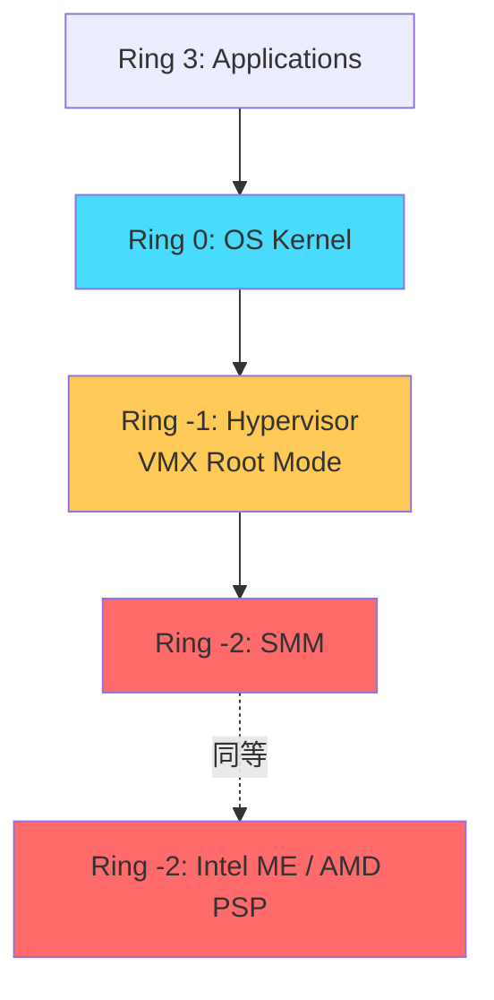
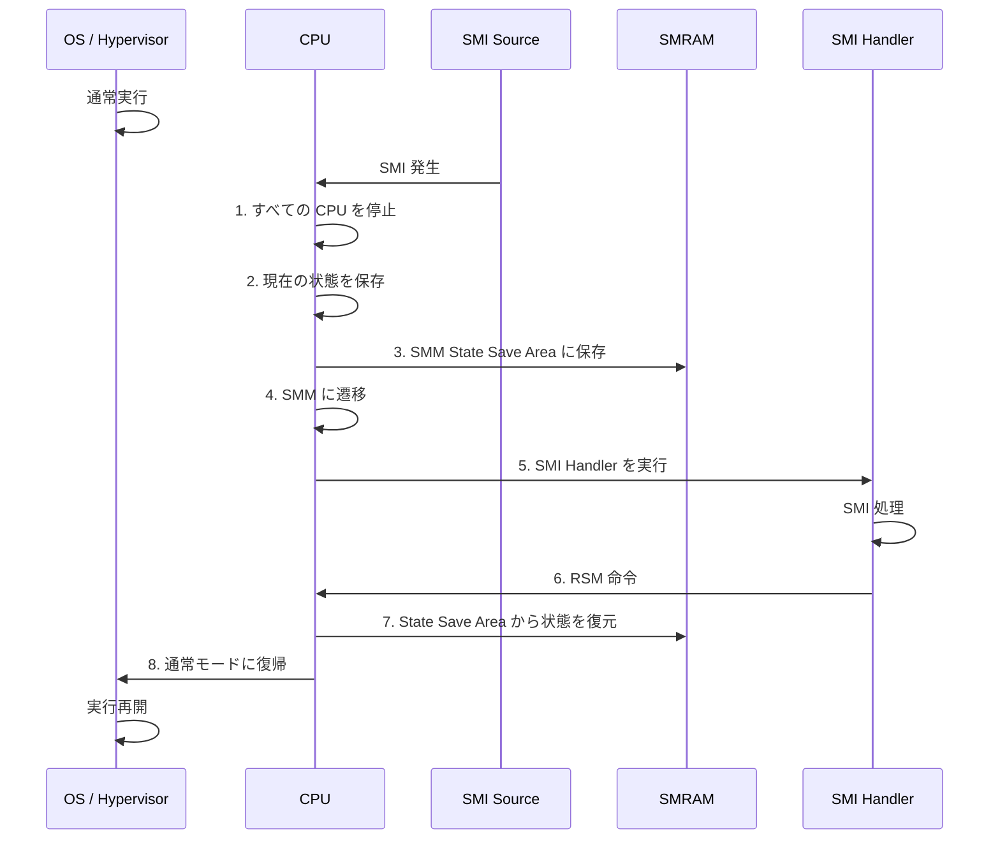
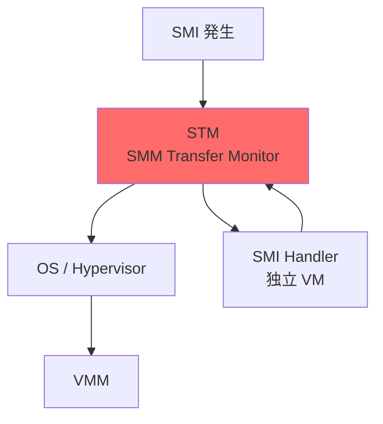

# SMM の仕組みとセキュリティ

<!-- Status: completed -->
<!-- Last Updated: 2025-10-05 -->

🎯 **この章で学ぶこと**
- SMM（System Management Mode）の役割と動作原理
- SMRAM（System Management RAM）の仕組み
- SMI（System Management Interrupt）の発生と処理
- SMM のセキュリティリスクと脆弱性
- SMRAM ロックと保護機構
- SMM 攻撃の事例と対策
- SMM Transfer Monitor（STM）による分離
- SMM のデバッグ方法

📚 **前提知識**
- [Part I Chapter 3: x86_64 特権レベルとメモリ保護](../part1/03-privilege-and-protection.md)
- [Part IV Chapter 7: SPI フラッシュ保護機構](./07-spi-flash-protection.md)
- x86 アーキテクチャの基礎

---

## SMM（System Management Mode）とは

### SMM の目的

**System Management Mode（SMM）** は、x86 プロセッサの**最高特権モード**です：

1. **電源管理**: ACPI S3（Suspend to RAM）などの処理
2. **ハードウェア制御**: ファン制御、温度管理
3. **セキュリティ機能**: BIOS Flash の更新、変数の保護
4. **エミュレーション**: レガシーハードウェアのエミュレーション
5. **エラーハンドリング**: ハードウェアエラーの処理

> **Note**: SMM は Ring -2 と呼ばれることがあり、OS（Ring 0）やハイパーバイザー（Ring -1）よりも高い権限を持ちます。そのため、SMM が攻撃されると**システム全体が危殆化**します。

### SMM の特権レベル



---

## SMM の動作原理

### SMI（System Management Interrupt）

**SMI** は、SMM に遷移するための**特殊な割り込み**です：

**SMI の発生源**：
- **Software SMI**: `OUT 0xB2, AL` 命令（I/O ポート 0xB2 への書き込み）
- **Hardware SMI**: チップセットからの SMI 信号
  - 電源ボタン
  - 温度センサー
  - タイマー
  - PCIe Hot Plug

### SMM 遷移のフロー



### SMM State Save Area

**State Save Area** は、SMM 遷移時の CPU 状態を保存する領域です：

```c
typedef struct {
  // 汎用レジスタ
  UINT64  Rax;
  UINT64  Rbx;
  UINT64  Rcx;
  UINT64  Rdx;
  UINT64  Rsi;
  UINT64  Rdi;
  UINT64  Rbp;
  UINT64  Rsp;
  UINT64  R8;
  UINT64  R9;
  UINT64  R10;
  UINT64  R11;
  UINT64  R12;
  UINT64  R13;
  UINT64  R14;
  UINT64  R15;

  // 制御レジスタ
  UINT64  Rip;
  UINT64  Rflags;
  UINT64  Cr0;
  UINT64  Cr3;
  UINT64  Cr4;

  // セグメントレジスタ
  UINT16  Cs;
  UINT16  Ds;
  UINT16  Es;
  UINT16  Fs;
  UINT16  Gs;
  UINT16  Ss;

  // その他
  UINT64  GdtrBase;
  UINT64  IdtrBase;
  UINT32  SmiHandlerBase;  // SMI Handler のエントリポイント
  UINT32  AutoHalt;         // Auto Halt Restart
  // ...
} SMM_STATE_SAVE_AREA;
```

**配置**：
- 各 CPU コアごとに **SMRAM の末尾** に配置
- サイズ: 約 512 バイト

---

## SMRAM（System Management RAM）

### SMRAM の構造

**SMRAM** は、SMM 専用のメモリ領域です：

```
+---------------------------+ TSEG Base + TSEG Size (例: 0xA0000000)
| CPU 0 State Save Area     | ← 512 bytes
+---------------------------+
| CPU 1 State Save Area     |
+---------------------------+
| ...                       |
+---------------------------+
| CPU N State Save Area     |
+---------------------------+
| SMM Stack                 |
+---------------------------+
| SMM Heap                  |
+---------------------------+
| SMM Code                  |
| - SMI Entry Point         |
| - SMI Handlers            |
| - SMM Services            |
+---------------------------+ TSEG Base (例: 0x9F000000)
```

### TSEG（Top of Memory Segment）

**TSEG** は、メインメモリの**最上位部分**に確保される SMRAM です：

**設定方法**：
```c
// TSEG は PCH の SMRAM レジスタで設定
// MCH (Memory Controller Hub) のレジスタ
typedef union {
  struct {
    UINT32  TsegBase  : 20;  // TSEG の開始アドレス（1MB 単位）
    UINT32  Reserved  : 11;
    UINT32  Lock      : 1;   // ロックビット
  } Bits;
  UINT32  Uint32;
} TSEG_BASE_REGISTER;

typedef union {
  struct {
    UINT32  TsegSize  : 3;   // TSEG のサイズ
                             // 0: 1 MB
                             // 1: 2 MB
                             // 2: 4 MB
                             // 3: 8 MB
    UINT32  Reserved  : 29;
  } Bits;
  UINT32  Uint32;
} TSEG_SIZE_REGISTER;
```

**TSEG の保護**：
- 通常モード（Ring 0-3）からは**アクセス不可**
- SMM 内からのみアクセス可能
- ロックビットを設定すると、TSEG の位置とサイズが変更不可

---

## SMM のセキュリティリスク

### 1. SMM Callout

**問題**：
- SMI Handler が **通常メモリ上のコード**を呼び出す
- OS が通常メモリを書き換えて任意コードを実行

```c
// 脆弱な SMI Handler の例
EFI_STATUS
VulnerableSmiHandler (
  IN EFI_HANDLE  DispatchHandle,
  IN VOID        *Context
  )
{
  // 通常メモリ上の関数ポインタを呼び出し
  VOID (*UserFunction)(VOID) = (VOID (*)(VOID)) 0x10000000;

  // これは危険！OS が 0x10000000 を書き換え可能
  UserFunction ();

  return EFI_SUCCESS;
}
```

**攻撃**：
```c
// OS から攻撃
// 1. 0x10000000 に悪意あるコードを配置
memcpy ((VOID *) 0x10000000, ShellcodeForSmm, sizeof (ShellcodeForSmm));

// 2. SMI を発生させる
__outbyte (0xB2, 0x55);  // Software SMI

// 3. SMI Handler が ShellcodeForSmm を SMM 権限で実行
```

### 2. TOCTOU（Time-of-Check to Time-of-Use）

**問題**：
- SMI Handler が通常メモリのデータを**チェック後に使用**
- OS がチェックと使用の間にデータを書き換え

```c
// 脆弱な例
EFI_STATUS
ToctouVulnerableSmiHandler (
  IN SMM_COMM_BUFFER  *Buffer
  )
{
  // 1. バッファのサイズをチェック
  if (Buffer->Size > MAX_SIZE) {
    return EFI_INVALID_PARAMETER;
  }

  // 2. バッファをコピー（危険！）
  // チェックから使用までの間に Buffer->Size が変更される可能性
  CopyMem (SmmLocalBuffer, Buffer->Data, Buffer->Size);

  return EFI_SUCCESS;
}
```

**攻撃**：
```c
// 並行スレッドから攻撃
while (1) {
  Buffer->Size = 100;       // チェックを通過
  // SMI Handler がチェック中
  Buffer->Size = 0x100000;  // チェック後にサイズを変更
  // SMI Handler が巨大なサイズでコピー → バッファオーバーフロー
}
```

### 3. ポインタ検証の欠如

**問題**：
- SMI Handler が通常メモリからの**ポインタを検証せず**に使用
- SMRAM 内部を指すポインタを渡して SMRAM を読み書き

```c
// 脆弱な例
EFI_STATUS
PointerVulnerableSmiHandler (
  IN UINT8  *Pointer
  )
{
  // ポインタが SMRAM を指していないかチェックしていない
  *Pointer = 0x42;  // 任意アドレスへの書き込み

  return EFI_SUCCESS;
}
```

**攻撃**：
```c
// SMI Handler に SMRAM 内のアドレスを渡す
UINT8 *SmramAddress = (UINT8 *) 0x9F000000;  // TSEG Base
__outbyte (0xB2, SMI_NUMBER);                 // SMI 発生

// SMI Handler が SMRAM を書き換えてしまう
```

---

## SMM の保護機構

### 1. SMRAM ロック

**D_LCK（SMRAM Lock）**：
```c
// SMRAMC (SMRAM Control) レジスタ
// MCH のコンフィグレーション空間
typedef union {
  struct {
    UINT8  CState     : 3;  // C_BASE_SEG
    UINT8  GState     : 1;  // G_SMRAME
    UINT8  DState     : 1;  // D_OPEN
    UINT8  DLock      : 1;  // D_LCK (SMRAM Lock)
    UINT8  Reserved   : 2;
  } Bits;
  UINT8  Uint8;
} SMRAM_CONTROL;

VOID
LockSmram (
  VOID
  )
{
  SMRAM_CONTROL  Smramc;

  // SMRAMC レジスタを読み取り
  Smramc.Uint8 = MmioRead8 (MCH_BASE + SMRAMC_OFFSET);

  // D_LCK ビットを設定
  Smramc.Bits.DLock = 1;

  // レジスタに書き戻し
  MmioWrite8 (MCH_BASE + SMRAMC_OFFSET, Smramc.Uint8);

  // これ以降、SMRAM の設定は変更不可（リセットまで）
}
```

### 2. SMM_BWP（SMM BIOS Write Protection）

**仕組み**：
- **SMM 外からの BIOS 書き込みを禁止**
- BIOSWE=1 でも、SMM 外からは Flash を書き込めない

```c
// BIOS Control レジスタ (前章参照)
// SMM_BWP ビットを設定
VOID
EnableSmmBiosWriteProtection (
  VOID
  )
{
  BIOS_CONTROL  Bc;

  Bc.Uint8 = MmioRead8 (PCH_LPC_BASE + 0xDC);
  Bc.Bits.SmmBiosWriteProtect = 1;
  MmioWrite8 (PCH_LPC_BASE + 0xDC, Bc.Uint8);

  // SMM 外からは BIOS を書き換えられない
}
```

### 3. SMM Code Access Check（SMRR）

**SMRR（SMM Range Register）**：
- **SMRAM の範囲**を MSR で定義
- SMM 外からの SMRAM アクセスを禁止

```c
// SMRR MSR
#define MSR_IA32_SMRR_PHYS_BASE  0x1F2
#define MSR_IA32_SMRR_PHYS_MASK  0x1F3

VOID
ConfigureSmrr (
  IN UINT64  SmramBase,
  IN UINT64  SmramSize
  )
{
  UINT64  SmrrPhysBase;
  UINT64  SmrrPhysMask;

  // 1. SMRR Base を設定
  // ビット 12-35: Physical Base
  // ビット 0-7: Memory Type (WB = 6)
  SmrrPhysBase = SmramBase | 0x06;
  AsmWriteMsr64 (MSR_IA32_SMRR_PHYS_BASE, SmrrPhysBase);

  // 2. SMRR Mask を設定
  // ビット 12-35: Physical Mask
  // ビット 11: Valid
  SmrrPhysMask = (~(SmramSize - 1) & 0xFFFFFFFFF000ULL) | BIT11;
  AsmWriteMsr64 (MSR_IA32_SMRR_PHYS_MASK, SmrrPhysMask);

  // SMM 外から SMRAM へのアクセスは例外が発生
}
```

### 4. ポインタ検証

**SmmIsBufferOutsideSmram**：
```c
/**
  バッファが SMRAM 外にあるか確認

  @param[in] Buffer     バッファのアドレス
  @param[in] BufferSize バッファのサイズ

  @retval TRUE   SMRAM 外
  @retval FALSE  SMRAM 内（危険）
**/
BOOLEAN
SmmIsBufferOutsideSmram (
  IN VOID   *Buffer,
  IN UINTN  BufferSize
  )
{
  UINT64  BufferStart;
  UINT64  BufferEnd;

  BufferStart = (UINT64) Buffer;
  BufferEnd = BufferStart + BufferSize - 1;

  // SMRAM の範囲をチェック
  if ((BufferStart >= gSmramBase && BufferStart < gSmramBase + gSmramSize) ||
      (BufferEnd >= gSmramBase && BufferEnd < gSmramBase + gSmramSize)) {
    // SMRAM 内を指している → 危険
    return FALSE;
  }

  return TRUE;
}

// 使用例
EFI_STATUS
SecureSmiHandler (
  IN SMM_COMM_BUFFER  *Buffer
  )
{
  // 1. ポインタが SMRAM を指していないか確認
  if (!SmmIsBufferOutsideSmram (Buffer, sizeof (SMM_COMM_BUFFER))) {
    return EFI_SECURITY_VIOLATION;
  }

  // 2. データを安全にコピー
  CopyMem (SmmLocalBuffer, Buffer->Data, MIN (Buffer->Size, MAX_SIZE));

  return EFI_SUCCESS;
}
```

### 5. TOCTOU の回避

**対策**：
```c
EFI_STATUS
ToctouSecureSmiHandler (
  IN SMM_COMM_BUFFER  *Buffer
  )
{
  SMM_COMM_BUFFER  LocalBuffer;

  // 1. バッファ全体を SMRAM にコピー（アトミック）
  if (!SmmIsBufferOutsideSmram (Buffer, sizeof (SMM_COMM_BUFFER))) {
    return EFI_SECURITY_VIOLATION;
  }
  CopyMem (&LocalBuffer, Buffer, sizeof (SMM_COMM_BUFFER));

  // 2. ローカルコピーに対して処理
  // 以降、Buffer->Size が変更されても影響しない
  if (LocalBuffer.Size > MAX_SIZE) {
    return EFI_INVALID_PARAMETER;
  }

  CopyMem (SmmDestination, LocalBuffer.Data, LocalBuffer.Size);

  return EFI_SUCCESS;
}
```

---

## SMM Transfer Monitor（STM）

### STM の目的

**STM** は、SMM を**監視・分離**する仮想化技術です：

1. **SMM の分離**: SMI Handler を独立した VM として実行
2. **ポリシー強制**: SMM からのリソースアクセスを制限
3. **脆弱性の軽減**: SMM Callout などの攻撃を防止



### STM の動作

**SMI 発生時**：
1. STM が SMI を捕捉
2. SMI Handler を**独立した VM** として起動
3. Handler からのリソースアクセスを STM が監視
4. ポリシー違反があれば拒否
5. Handler 終了後、STM が制御を OS に戻す

---

## SMM のデバッグ

### 1. シリアルコンソールでのログ

```c
// SMI Handler 内からログ出力
VOID
SmiHandlerEntry (
  VOID
  )
{
  SerialPortWrite ((UINT8 *) "[SMM] SMI Handler entered\n", 28);

  // SMI 処理

  SerialPortWrite ((UINT8 *) "[SMM] SMI Handler exiting\n", 27);
}
```

### 2. UEFI デバッガでの SMM デバッグ

**SourceLevel Debugger（UDK Debugger）**：
```bash
# QEMU で SMM デバッグを有効化
qemu-system-x86_64 \
  -bios OVMF.fd \
  -s -S \
  -enable-kvm \
  -m 4096

# GDB で接続
gdb
(gdb) target remote localhost:1234
(gdb) b SmiHandlerEntry
(gdb) c
```

### 3. chipsec での SMM チェック

```bash
# SMM の設定を確認
sudo chipsec_main -m common.smm

# 出力例:
# [*] running module: chipsec.modules.common.smm
# [*] Checking SMM configuration...
# [+] SMRAMC.D_LCK = 1 (SMRAM is locked)
# [+] TSEG.Lock = 1 (TSEG is locked)
# [+] SMRR configured: Base=0x9F000000, Mask=0xFF000800
# [+] PASSED: SMM configuration is secure
```

---

## 既知の SMM 攻撃と対策

### 1. ThinkPwn (CVE-2016-3287)

**脆弱性**：
- Lenovo の SMI Handler に **TOCTOU 脆弱性**
- OS から SMRAM を書き換え可能

**対策**：
- ポインタ検証の徹底
- SMRAM へのアクセスチェック

### 2. SMM Privilege Escalation

**脆弱性**：
- SMI Handler が OS から渡されたポインタを検証せず
- SMRAM 内のデータを書き換え

**対策**：
- SmmIsBufferOutsideSmram を使用
- すべてのポインタを検証

---

## トラブルシューティング

### Q1: SMM に入ると応答しなくなる

**原因**：
- SMI Handler に無限ループ
- デッドロック

**デバッグ**：
```c
// タイムアウト機構を追加
UINT64 StartTick = AsmReadTsc ();
while (Condition) {
  if (AsmReadTsc () - StartTick > TIMEOUT_TICKS) {
    SerialPortWrite ((UINT8 *) "[SMM] Timeout!\n", 16);
    break;
  }
}
```

### Q2: chipsec で SMM が FAILED

**原因**：
- SMRAM がロックされていない

**解決策**：
```c
// PEI/DXE Phase で SMRAM をロック
LockSmram ();
ConfigureSmrr (TSEG_BASE, TSEG_SIZE);
```

---

## 💻 演習

### 演習 1: SMM 設定の確認

**手順**：

```bash
# chipsec で SMM を検証
sudo chipsec_main -m common.smm
sudo chipsec_main -m common.smrr

# SMRAMC レジスタを確認
sudo setpci -s 00:00.0 88.b

# SMRR MSR を確認
sudo rdmsr 0x1F2
sudo rdmsr 0x1F3
```

---

## まとめ

この章では、SMM のセキュリティについて学びました：

### ✅ 重要なポイント

1. **SMM の役割**：
   - 最高特権モード（Ring -2）
   - 電源管理、ハードウェア制御
   - BIOS 更新などのセキュリティ機能

2. **セキュリティリスク**：
   - **SMM Callout**: 通常メモリのコード呼び出し
   - **TOCTOU**: データの書き換え
   - **ポインタ検証の欠如**: SMRAM への不正アクセス

3. **保護機構**：
   - **SMRAM Lock**: TSEG の設定を固定
   - **SMRR**: SMRAM へのアクセス制御
   - **SMM_BWP**: SMM 外からの BIOS 書き込み禁止

4. **ベストプラクティス**：
   - すべてのポインタを検証
   - TOCTOU を回避（ローカルコピー）
   - SMM Callout を避ける

---

次章では、**攻撃事例から学ぶ設計原則**について学びます。

📚 **参考資料**
- [Intel 64 and IA-32 Architectures Software Developer Manual Volume 3: System Programming Guide](https://www.intel.com/sdm)
- [UEFI Platform Initialization Specification](https://uefi.org/specifications)
- [chipsec: Platform Security Assessment Framework](https://github.com/chipsec/chipsec)
- [Attacking SMM Memory via Intel CPU Cache Poisoning](https://invisiblethingslab.com/resources/2015/x86_sinkhole.pdf)
