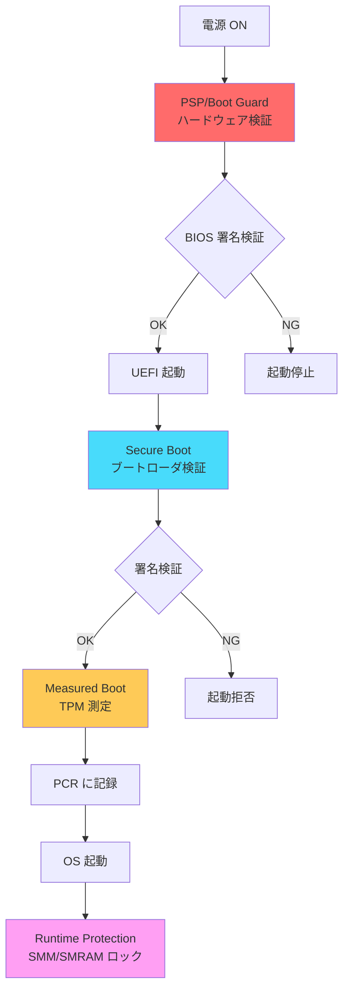

# Part IV まとめ

🎯 **Part IV で学んだこと**
- ファームウェアセキュリティの包括的な理解
- 信頼チェーンの構築方法（Boot Guard/PSP → Secure Boot → Measured Boot）
- SPI Flash、SMM、TPM の保護機構
- 実際の攻撃事例から学ぶセキュリティ設計原則

---

## Part IV の全体像

**Part IV: ファームウェアセキュリティ**では、BIOS/UEFI のセキュリティ機構を体系的に学びました。ファームウェアは、システムの**Root of Trust** として、OS やアプリケーションのセキュリティの基盤を提供します。ファームウェアが侵害されると、OS のセキュリティ機構（Secure Boot、カーネル保護、アンチウイルス）はすべて無効化されてしまいます。したがって、ファームウェアセキュリティは、プラットフォーム全体のセキュリティにおいて**最も重要な要素**です。Part IV では、ハードウェアベースの Root of Trust から、ソフトウェアレベルの保護機構、さらには実際の攻撃事例まで、ファームウェアセキュリティの全体像を網羅しました。

Part IV は、**10章**で構成され、それぞれが異なる側面からファームウェアセキュリティを扱っています。Chapter 1 では、ファームウェアセキュリティの全体像を概観し、なぜファームウェアが攻撃されるのか、どのような脅威が存在するのかを理解しました。Chapter 2-3 では、信頼チェーンの構築方法を学び、Root of Trust、Verified Boot、Measured Boot、UEFI Secure Boot の仕組みを詳しく分析しました。Chapter 4-6 では、ハードウェアセキュリティ機構（TPM、Intel Boot Guard、AMD PSP）を学び、ハードウェアレベルでの検証と測定の重要性を理解しました。Chapter 7-8 では、SPI Flash と SMM の保護機構を学び、ソフトウェアとハードウェアの両方から Flash とメモリを保護する手法を習得しました。Chapter 9 では、実際の攻撃事例（ThinkPwn、LoJax、BootHole、MosaicRegressor、Thunderspy）を分析し、脆弱性パターンと対策を学びました。そして本章では、Part IV 全体を振り返り、統合的なセキュリティ設計の指針を提示します。

---

## 各章の要点

### Chapter 1: ファームウェアセキュリティの全体像

ファームウェアは、**SMM（Ring -2）** という OS やハイパーバイザーよりも高い権限で動作し、**SPI Flash** という不揮発性メモリに格納されるため、OS の再インストールでも除去できない永続性を持ちます。また、ファームウェアは **OS から見えない**ため、アンチウイルスソフトウェアでは検出できません。このため、ファームウェアは攻撃者にとって極めて魅力的なターゲットとなります。

ファームウェア攻撃の歴史を振り返ると、2005年頃の理論的研究から始まり、2011-2015年に実践的な攻撃（ThinkPwn、BadUSB）が登場し、2016-2020年にはサプライチェーン攻撃（NotPetya、LoJax）が発生し、2021年以降は国家支援型の高度な脅威（APT）が主流となっています。具体的な攻撃事例として、LoJax（2015年、史上初の野生の UEFI ルートキット）、ThinkPwn（2018年、SMM 権限昇格）、Plundervolt（2019年、電圧操作による SGX 攻撃）、BootHole（2020年、GRUB2 の脆弱性）、LogoFAIL（2022年、ロゴ画像パーサの脆弱性）などが挙げられます。

ファームウェアセキュリティの主要な攻撃ベクトルは、**5つ**に分類されます。SPI Flash の書き換え（物理アクセスまたはソフトウェアからの不正書き込み）、DMA 攻撃（Thunderbolt、Firewire による直接メモリアクセス）、SMM 攻撃（SMM Callout、TOCTOU、ポインタ検証の欠如）、UEFI 変数攻撃（認証されていない変数の書き込み）、ブートキット・ルートキット（ブートプロセスに常駐するマルウェア）です。

これらの脅威に対抗するため、**Defense in Depth（多層防御）** のアプローチが採用されます。Hardware Root of Trust（Boot Guard、PSP、TPM）、Verified Boot（デジタル署名による検証）、Secure Boot（OS ブートローダの検証）、Measured Boot（ハッシュ値の測定と記録）という4つの層が、順次検証を行い、信頼チェーンを確立します。

### Chapter 2: 信頼チェーンの構築

信頼チェーンは、**Root of Trust** から始まり、各ステージが次のステージを検証することで確立されます。Root of Trust には、**4つのタイプ**があります。RTM（Root of Trust for Measurement）は、ブートコンポーネントの測定を担当し、TPM の PCR に記録します。RTV（Root of Trust for Verification）は、デジタル署名の検証を担当し、公開鍵暗号を使用します。RTS（Root of Trust for Storage）は、秘密情報の安全な保管を担当し、TPM や OTP Fuse に鍵を格納します。RTR（Root of Trust for Reporting）は、測定結果の報告を担当し、Remote Attestation で使用されます。

Intel プラットフォームでは、信頼チェーンは **CPU Microcode → IBB → PEI Core → DXE Core** と進みます。CPU の Microcode が Boot Guard ACM を検証し、ACM が Initial Boot Block（IBB）を検証し、IBB が PEI Core を検証し、PEI Core が DXE Core を検証します。AMD プラットフォームでは、**PSP Boot ROM → PSP Firmware → x86 BIOS** という順序で検証が進みます。PSP の Boot ROM が PSP ブートローダを検証し、PSP ファームウェアが x86 BIOS を検証します。

信頼チェーンの重要な原則は、**3つ**あります。不変性（Immutability）では、Root of Trust は変更できないハードウェア（CPU ROM、OTP Fuse）に配置されます。順次検証（Sequential Verification）では、各ステージは次のステージのみを検証し、飛び越えた検証は行いません。チェーンの性質（Chain Property）では、1つのステージの検証が失敗すると、チェーン全体が破綻します。

Measured Boot には、**SRTM（Static Root of Trust for Measurement）** と **DRTM（Dynamic Root of Trust for Measurement）** の2つのモードがあります。SRTM は、電源投入時に確立され、PCR 0-7 を使用してファームウェアとブートローダを測定します。DRTM は、実行中に確立され、PCR 17-22 を使用して特定の環境を動的に測定します。Intel TXT の `GETSEC[SENTER]` 命令や AMD の `SKINIT` 命令により、既存のソフトウェアを信頼せずに新しい Root of Trust を確立できます。

### Chapter 3: UEFI Secure Boot の仕組み

UEFI Secure Boot は、**ファームウェアレベルのセキュリティ機構**であり、ブートローダとドライバの署名を検証します。Secure Boot の主な目的は、**4つ**です。未署名コードの実行防止、ブートキット対策、信頼チェーンの確立、改ざん検出です。Windows 8（2012年）以降、Secure Boot が必須要件となり、Linux では Shim と MOK（Machine Owner Key）という仕組みで対応しています。

Secure Boot は、**階層的な鍵管理**を使用します。PK（Platform Key）は、プラットフォームの最上位の鍵であり、OEM が所有します。PK は1つのみ存在し、Setup Mode と User Mode を制御します。KEK（Key Exchange Key）は、中間鍵であり、複数存在できます。通常、Microsoft、OEM、OS ベンダーの KEK が登録されます。KEK は、db と dbx の更新を署名します。db（Signature Database）は、許可リストであり、信頼されたブートローダとドライバの署名または証明書を格納します。dbx（Forbidden Signature Database）は、禁止リストであり、侵害された署名や脆弱なコードのハッシュを格納します。

Secure Boot の検証プロセスは、**3ステップ**で行われます。まず、ブートローダのバイナリから Authenticode 署名を抽出します。次に、署名が **db（許可リスト）** に含まれるかを確認します。db には、Microsoft Windows Production PCA、Canonical Ltd. Master CA などの証明書が格納されており、ブートローダの署名がこれらの証明書のいずれかによって発行されていれば、検証の第一段階は合格です。最後に、署名が **dbx（禁止リスト）** に含まれないかを確認します。dbx には、侵害された署名や既知の脆弱性を持つコードのハッシュが格納されており、該当する場合は起動を拒否します。

Linux では、Microsoft の UEFI CA で署名された **Shim** というブートローダを使用します。Shim は、MOK（Machine Owner Key）というユーザーが追加できる鍵をサポートし、カスタムカーネルや署名されていないドライバを起動できます。これにより、Secure Boot を無効化せずに、Linux の柔軟性を維持します。

### Chapter 4: TPM と Measured Boot

TPM（Trusted Platform Module）は、**ハードウェアベースの Root of Trust** を提供する専用チップです。TPM は、測定と記録、暗号化鍵の保護、構成証明、改ざん検出という4つの主要な役割を担います。TPM の中核となるコンポーネントは、**PCR（Platform Configuration Register）** です。PCR は、測定値を記録する特殊なレジスタであり、**Extend 操作のみ**が許可されています。つまり、PCR の値を直接上書きすることはできず、新しい測定値は `PCR[n] = SHA256(PCR[n] || NewMeasurement)` という式で現在の値と連結してハッシュを取ることで追加されます。

TCG 標準では、PCR の用途が定義されています。PCR 0-7 は、BIOS/UEFI とブートローダの測定に使用され、PCR 8-15 は、OS カーネルとドライバの測定に使用されます。PCR 17-22 は、DRTM 用に予約されており、動的な信頼確立に使用されます。

TPM には、**4つの重要な鍵**があります。EK（Endorsement Key）は、TPM のアイデンティティを証明する鍵であり、製造時に生成され、TPM 内に永続保存されます。SRK（Storage Root Key）は、TPM 内の鍵階層のルート鍵であり、他の鍵は SRK で暗号化して保存されます。AIK（Attestation Identity Key）は、Remote Attestation に使用する鍵であり、PCR 値に署名して第三者に送信します。プライバシー保護のため、EK を直接使用せず、AIK を介して証明します。

**Remote Attestation** は、ローカルシステム（Prover）が TPM を使用して自身の構成を証明し、リモートの検証者（Verifier）がその証明を検証する仕組みです。Verifier がランダムな Nonce を Prover に送信し、Prover は現在の PCR 値と Nonce を含む Quote を生成し、AIK で署名します。Verifier は、AIK 証明書を検証し、Quote の署名を確認し、PCR 値が期待値と一致するかをチェックします。

**Sealed Storage** は、データを特定の PCR 状態でのみ復号可能にする仕組みです。例えば、ディスク暗号化鍵を PCR 0-7 の状態で Seal すると、その鍵はシステムが正常な状態（ファームウェアとブートローダが改ざんされていない状態）でのみ Unseal（復号）できます。もしブートキットがインストールされてファームウェアが変更された場合、PCR 値が変化し、Unseal が失敗します。Windows BitLocker や Linux LUKS といったディスク暗号化ソリューションで広く使用されています。

### Chapter 5: Intel Boot Guard の役割と仕組み

Intel Boot Guard は、Intel プロセッサに組み込まれた**ハードウェアベースの BIOS 検証機構**であり、**CPU リセット直後**という極めて早い段階で BIOS/UEFI ファームウェアを検証します。Boot Guard の主要なコンポーネントは、**4つ**です。

**ACM（Authenticated Code Module）** は、Intel が署名した信頼された実行モジュールであり、BIOS の検証ロジックを実行します。ACM は Intel の秘密鍵で署名されており、OEM は独自の ACM を作成できません。**Key Manifest（KM）** は、OEM の公開鍵を格納し、BPM（Boot Policy Manifest）の検証に使用されます。KM は OEM が作成し、自身の秘密鍵で署名します。**Boot Policy Manifest（BPM）** は、BIOS の検証ポリシーを定義し、どの部分（IBB: Initial Boot Block）を検証するか、失敗時にどう動作するかを指定します。BPM も OEM が作成し、KM の秘密鍵で署名します。**OTP Fuse** は、OEM 公開鍵のハッシュと、最小 Security Version Number（SVN）を不変保存します。OTP Fuse は一度書き込むと変更できないため、ソフトウェア攻撃では改ざんできません。

Boot Guard は、**3つの動作モード**をサポートしています。**Verified Boot モード**では、デジタル署名の検証を行い、失敗時にシステムを即座に停止します。**Measured Boot モード**では、BIOS のハッシュ値を TPM PCR 0 に記録しますが、検証失敗でも起動は継続します。**Verified + Measured Boot モード**では、両方を同時に実行し、検証による即座の保護と、測定による事後検証の両方を実現します。

Boot Guard の検証フローは、厳密に定義された順序で実行されます。CPU のマイクロコードが SPI Flash から ACM をロードし、Intel の公開鍵で ACM の署名を検証します。ACM の検証に成功すると、ACM が実行され、Key Manifest（KM）をロードします。ACM は、KM 内の公開鍵のハッシュを計算し、OTP Fuse に保存されたハッシュと比較します。次に、ACM は Boot Policy Manifest（BPM）をロードし、KM の公開鍵で BPM の署名を検証します。最後に、ACM は Initial Boot Block（IBB）をロードし、IBB のハッシュを計算して BPM 内のハッシュと比較します。すべての検証に成功すると、CPU は IBB（BIOS の最初のコード）の実行を開始します。

### Chapter 6: AMD PSP の役割と仕組み

AMD PSP（Platform Security Processor）は、AMD プロセッサに統合された**セキュリティ専用のプロセッサ**であり、**独立した ARM Cortex-A5 プロセッサ**として動作します。PSP は、x86 CPU よりも先に起動し、BIOS/UEFI ファームウェアのセキュアブートを実行します。

PSP のアーキテクチャは、**4つの主要コンポーネント**で構成されています。**ARM Cortex-A5 コア**は、32ビット RISC プロセッサであり、約 100-200 MHz の低周波数で動作します。**PSP ROM（Boot ROM）** は、PSP の最初の Root of Trust であり、製造時に焼き込まれた読み取り専用のコードです。PSP ROM は、PSP ブートローダを AMD の公開鍵で検証し、検証に成功した場合のみ実行します。**OTP Fuse** は、プラットフォームベンダー ID、OEM 公開鍵ハッシュ、セキュアブートポリシー、ファームウェア暗号化鍵、アンチロールバックカウンタ、チップ固有鍵（Chip Unique Key）などの重要な設定と鍵を不変保存します。**Crypto Engine** は、AES-128/256、SHA-1/SHA-256/SHA-384/SHA-512、RSA-2048/3072/4096、ECC P-256/P-384、TRNG といった暗号化アルゴリズムをハードウェアで高速に実行します。

PSP が提供する主要なセキュリティ機能には、**Secure Boot、SEV、SME、fTPM** があります。**SEV（Secure Encrypted Virtualization）** では、仮想マシンごとに異なる暗号化鍵を使用してメモリを暗号化し、ハイパーバイザーからも VM のメモリ内容を保護します。SEV は、クラウド環境でのマルチテナント分離に極めて有効です。**SME（Secure Memory Encryption）** では、システムメモリ全体を透過的に暗号化し、物理的な攻撃（Cold Boot Attack、メモリダンプ）からデータを保護します。**fTPM（Firmware TPM）** では、PSP 内で TPM 2.0 を実装し、物理的な dTPM チップがないシステムでも PCR、Sealed Storage、Remote Attestation などの TPM 機能を提供します。

### Chapter 7: SPI フラッシュ保護機構

SPI Flash は、BIOS/UEFI ファームウェアを格納する不揮発性メモリであり、システムの **Root of Trust** を保持する最も重要なコンポーネントです。SPI Flash の保護が不十分だと、攻撃者は Boot Guard、Secure Boot、TPM といったすべてのセキュリティ機構を無効化できてしまいます。

**Flash Descriptor** は、SPI Flash の先頭 4KB に配置される制御データであり、Flash 全体の「目次」として機能します。Flash Descriptor は、リージョンの定義（Descriptor、BIOS、ME/PSP、GbE、Platform Data の位置とサイズ）、アクセス権限の設定（各マスターがアクセス可能な領域）、ストラップ設定（CPU/PCH の初期設定）という3つの重要な役割を果たします。Flash Descriptor は、**FLOCKDN（Flash Lockdown）** ビットでロックされ、一度ロックされると、リセットまで変更できなくなります。

SPI Flash の保護には、**複数の保護機構**が階層的に組み合わされています。**BIOS Control レジスタ**では、BIOSWE（BIOS Write Enable）、BLE（BIOS Lock Enable）、SMM_BWP（SMM BIOS Write Protect）という3つの重要なビットを使用して BIOS 領域を保護します。**Protected Range Registers（PR0-PR4）** では、最大 5 つの保護範囲を 4KB 単位で設定できます。**WP# ピン（Hardware Write Protect）** では、SPI Flash チップの WP# ピンを Low にすることで、Flash の Status Register の一部ビットを変更不可にします。**Intel BIOS Guard** は、SPI Flash の更新を SMM のみに制限する技術であり、OS が侵害されても、不正な Flash 更新を防ぐことができます。

### Chapter 8: SMM の仕組みとセキュリティ

SMM（System Management Mode）は、x86 プロセッサの**最高特権モード**（Ring -2）であり、OS（Ring 0）やハイパーバイザー（Ring -1）よりも高い権限を持ちます。SMM は、電源管理、ハードウェア制御、BIOS Flash の更新、Secure Boot 変数の保護といった重要な機能を担っています。

SMM には、**3つの主要なセキュリティリスク**があります。**SMM Callout** は、SMM が通常メモリのコードやデータを呼び出す脆弱性です。**TOCTOU（Time-of-Check to Time-of-Use）攻撃**は、SMM がポインタを検証した後、実際に使用するまでの間にデータを書き換える攻撃です。**ポインタ検証の欠如**は、SMM が OS から渡されたポインタを検証せずに使用する脆弱性です。

SMM を保護するための主要な保護機構は、階層的に組み合わされています。**SMRAM Lock（D_LCK ビット）** は、TSEG（Top of Memory Segment）の設定を固定します。**SMRR（SMM Range Registers）** は、各 CPU コアの MSR を使用して、SMRAM へのアクセスを制御します。**SMM_BWP（SMM BIOS Write Protect）** は、SMM 外からの BIOS Flash への書き込みを禁止します。**SMM Transfer Monitor（STM）** は、Intel VT-x の技術を使用して、SMM 内の異なるコンポーネントを分離します。

### Chapter 9: 攻撃事例から学ぶ設計原則

実際の攻撃事例から導かれる**セキュリティ設計の6原則**は、ファームウェア開発における普遍的な指針となります。**最小特権の原則（Least Privilege）** では、各コンポーネントに必要最小限の権限のみを付与します。**信頼できる基盤（Trusted Foundation）** では、ハードウェアベースの Root of Trust を確立します。**失敗時の安全性（Fail-Safe Defaults）** では、エラーが発生した場合、より安全な状態に遷移します。**多層防御（Defense in Depth）** では、複数の独立した防御層を配置します。**最小限の共通メカニズム（Economy of Mechanism）** では、セキュリティドメイン間の共有を最小化します。**心理的受容性（Psychological Acceptability）** では、使いやすいセキュリティを設計します。

5つの重要な攻撃事例（ThinkPwn、LoJax、BootHole、MosaicRegressor、Thunderspy）は、それぞれ異なる教訓を示しています。ThinkPwn は SMM ハンドラの入力検証の重要性、LoJax はハードウェア保護の必要性、BootHole は信頼チェーンの最も弱い部分の重要性、MosaicRegressor は ESP の監視の必要性、Thunderspy は物理アクセスの脅威を示しました。

---

## 統合的なセキュリティ設計

ファームウェアセキュリティは、単一の技術では実現できません。**多層防御（Defense in Depth）** のアプローチにより、複数の独立した防御層を配置し、1つの層が破られても、他の層が防御を継続します。

### セキュリティ機構の階層構造



この階層構造では、各層が独立して動作し、前の層の検証結果に依存しません。Boot Guard/PSP が BIOS を検証し、BIOS が Secure Boot を実行し、Secure Boot が Measured Boot を実行します。1つの層（例: Secure Boot）がバイパスされても、Measured Boot は引き続き測定を記録し、Remote Attestation で異常を検出できます。

### セキュリティ機能の組み合わせ

| 層 | 技術 | 目的 | 失敗時の動作 |
|----|------|------|-------------|
| **Hardware RoT** | Boot Guard/PSP | BIOS 検証 | 起動停止 |
| **Verified Boot** | Secure Boot | ブートローダ検証 | 起動拒否 |
| **Measured Boot** | TPM | ハッシュ測定 | 記録のみ |
| **Runtime Protection** | SMM Lock, SMRR | メモリ保護 | 異常検出 |
| **Flash Protection** | WP#, BIOS Guard | 不正書き込み防止 | 書き込み拒否 |

---

## 実装ロードマップ

ファームウェアセキュリティを実装する際は、**段階的なアプローチ**が推奨されます。

### Phase 1: 基本的な保護（必須）

**目標**: 最低限のセキュリティ要件を満たす

1. **Secure Boot の有効化**
   - PK/KEK/db/dbx の設定
   - Windows/Linux ブートローダの署名検証

2. **SPI Flash の基本保護**
   - BIOSWE=0, BLE=1, SMM_BWP=1
   - Protected Range の設定

3. **SMRAM のロック**
   - D_LCK=1
   - SMRR の設定

4. **TPM の基本設定**
   - fTPM または dTPM の有効化
   - PCR 0-7 の測定

**検証方法**:
```bash
# Secure Boot 確認
mokutil --sb-state

# SPI Flash 保護確認
sudo chipsec_main -m common.bios_wp

# SMRAM ロック確認
sudo chipsec_main -m common.smrr

# TPM 確認
sudo tpm2_getcap properties-fixed
```

### Phase 2: ハードウェア保護（推奨）

**目標**: ハードウェアベースの Root of Trust を確立

1. **Boot Guard/PSP のプロビジョニング**
   - OTP Fuse への公開鍵ハッシュ書き込み
   - KM/BPM の作成と署名

2. **SPI Flash の物理保護**
   - WP# ピンの有効化
   - ケースロック、改ざん検知シール

3. **IOMMU の有効化**
   - VT-d/AMD-Vi の設定
   - DMA Protection Range の定義

4. **Measured Boot の統合**
   - SRTM による起動時測定
   - Remote Attestation の準備

**検証方法**:
```bash
# Boot Guard 確認
sudo rdmsr 0x13A

# IOMMU 確認
dmesg | grep -i "dmar\|iommu"

# Measured Boot 確認
sudo tpm2_pcrread sha256:0,1,2,3,4,5,6,7
```

### Phase 3: 高度な保護（オプション）

**目標**: エンタープライズレベルのセキュリティ

1. **DRTM の実装**
   - Intel TXT/AMD SKINIT の設定
   - Trusted Boot の統合

2. **STM（SMM Transfer Monitor）の導入**
   - SMM の分離とモニタリング

3. **Remote Attestation の運用**
   - 定期的な PCR チェック
   - 異常検出時の自動アラート

4. **Incident Response の準備**
   - フォレンジック手順の文書化
   - Recovery 手順の整備

---

## 今後の展望

ファームウェアセキュリティは、今後も進化し続けます。以下のトレンドが予想されます。

### 技術的トレンド

1. **Post-Quantum Cryptography の導入**
   - RSA/ECDSA から耐量子暗号への移行
   - CRYSTALS-Dilithium、FALCON の採用

2. **Hardware-based Attestation の標準化**
   - DICE（Device Identifier Composition Engine）
   - Project Cerberus

3. **Confidential Computing の普及**
   - Intel SGX、AMD SEV-SNP、ARM CCA
   - エンクレーブ技術の進化

4. **Supply Chain Security の強化**
   - Software Bill of Materials（SBOM）
   - 透明性の向上

### 組織的トレンド

1. **エコシステム全体の連携**
   - OEM、OS ベンダー、セキュリティ研究者の協力
   - dbx 更新プロセスの改善

2. **自動化とCI/CDの統合**
   - ファームウェアのセキュリティテスト自動化
   - chipsec、FWTS の CI/CD 統合

3. **インシデント対応の成熟**
   - PSIRT（Product Security Incident Response Team）の設立
   - 脆弱性開示プロセスの標準化

---

## Part IV の学習成果

Part IV を完了したことで、以下のスキルと知識を習得しました。

### 技術的スキル

✅ ファームウェアセキュリティの包括的な理解
✅ 信頼チェーンの構築方法（Boot Guard/PSP → Secure Boot → Measured Boot）
✅ SPI Flash、SMM、TPM の保護機構の実装
✅ セキュリティ脆弱性の分析と対策
✅ chipsec、tpm2-tools などのツールの使用

### 設計能力

✅ 多層防御（Defense in Depth）の設計
✅ Least Privilege、Fail-Safe Defaults の適用
✅ TOCTOU、SMM Callout などの脆弱性パターンの回避
✅ セキュアなコーディング規約の遵守

### 運用能力

✅ Secure Boot、Boot Guard、TPM の設定
✅ SPI Flash の保護設定
✅ セキュリティ監視とインシデント対応
✅ Remote Attestation の運用

---

## 次のステップ

Part IV で学んだファームウェアセキュリティの知識を基に、次の Part V では**デバッグと最適化**を学びます。セキュリティ機構を実装した後、それらが正しく動作しているかをデバッグし、パフォーマンスを最適化する手法を習得します。

Part V では以下のトピックを扱います：
- UEFI Shell と UEFI アプリケーションによるデバッグ
- シリアルコンソールとログの活用
- GDB によるソースレベルデバッグ
- パフォーマンス測定と最適化
- トラブルシューティングのベストプラクティス

これらのスキルを習得することで、実践的なファームウェア開発者としての能力が完成します。

---

📚 **Part IV 参考資料まとめ**
- [UEFI Specification](https://uefi.org/specifications)
- [TCG PC Client Platform Firmware Profile Specification](https://trustedcomputinggroup.org/resource/pc-client-specific-platform-firmware-profile-specification/)
- [Intel Boot Guard Technology](https://www.intel.com/content/www/us/en/architecture-and-technology/boot-guard.html)
- [AMD Platform Security Processor](https://www.amd.com/en/technologies/pro-security)
- [chipsec: Platform Security Assessment Framework](https://github.com/chipsec/chipsec)
- [NIST SP 800-147: BIOS Protection Guidelines](https://csrc.nist.gov/publications/detail/sp/800-147/final)
- [NIST SP 800-193: Platform Firmware Resiliency Guidelines](https://csrc.nist.gov/publications/detail/sp/800-193/final)
