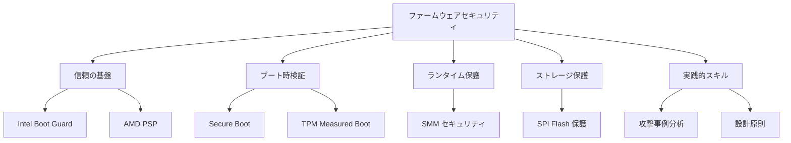
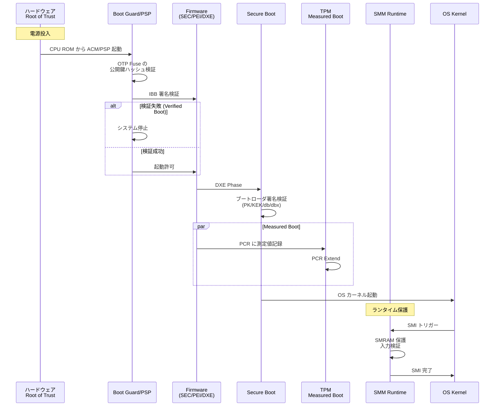
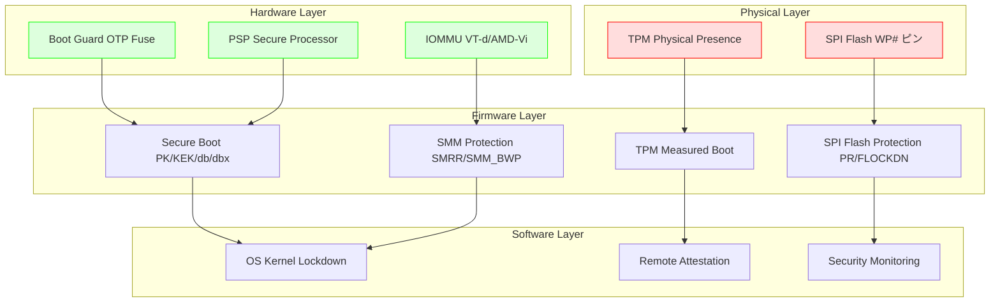
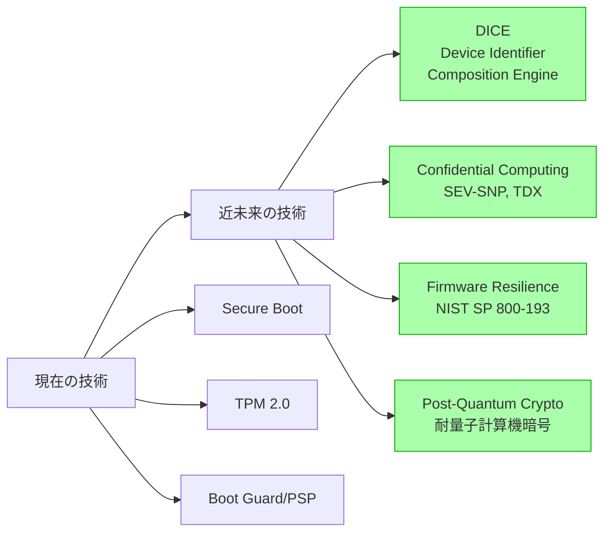

# Part IV まとめ

🎯 **この章で学ぶこと**
- Part IV で学んだセキュリティ機能の統合的な理解
- セキュリティメカニズム間の連携と相互補完
- 包括的なファームウェアセキュリティ戦略の設計
- 実装のベストプラクティスと推奨事項
- ファームウェアセキュリティの今後の展望

📚 **前提知識**
- [Part IV 全章](README.md)の内容

---

## Part IV の振り返り

Part IV では、ファームウェアのセキュリティアーキテクチャを多層防御の観点から学びました。本章では、これまでに学んだ個別のセキュリティ機能がどのように連携し、包括的な防御システムを構築するかを整理します。

### Part IV で扱ったトピック



---

## セキュリティメカニズムの階層構造

ファームウェアセキュリティは、複数の独立した防御層が相互に補完し合う多層防御（Defense in Depth）の構造を持っています。

### 時系列での防御層



### 防御層の関係

| レイヤー | メカニズム | 保護対象 | 失敗時の影響 | 次の防御層 |
|---------|----------|---------|------------|----------|
| **L0: HW Root of Trust** | CPU ROM, OTP Fuse | ACM/PSP Bootloader | システム起動不能 | なし（最終防衛線） |
| **L1: Verified Boot** | Boot Guard/PSP | IBB (Initial Boot Block) | 起動停止 or TPM 記録 | Secure Boot |
| **L2: Secure Boot** | UEFI Secure Boot | ブートローダ、OS カーネル | 未署名カーネル起動拒否 | TPM Measured Boot |
| **L3: Measured Boot** | TPM PCR | すべてのブート段階 | Remote Attestation 失敗 | OS セキュリティ |
| **L4: Runtime Protection** | SMM, SMRR, IOMMU | ランタイムファームウェア | SMM 攻撃成功 | OS 保護機能 |
| **L5: Storage Protection** | SPI Flash WP, PR | BIOS イメージ | BIOS 改竄 | Boot Guard 検出 |

---

## 統合セキュリティアーキテクチャ

### 包括的な防御システムの構築

最も堅牢なファームウェアセキュリティを実現するには、すべての防御層を組み合わせる必要があります。



### セキュリティ機能の相互補完

| 機能A | 機能B | 補完関係 |
|-------|-------|---------|
| **Boot Guard** | **Secure Boot** | Boot Guard が IBB を検証、Secure Boot がそれ以降を検証 |
| **Secure Boot** | **Measured Boot** | Secure Boot が阻止、TPM が記録・証明 |
| **SPI Flash WP** | **Boot Guard** | WP が物理的に保護、Boot Guard が論理的に検証 |
| **SMRR** | **SMM_BWP** | SMRR が範囲保護、SMM_BWP が書き込み制限 |
| **IOMMU** | **Kernel DMA Protection** | IOMMU がハードウェア保護、OS が管理 |

---

## プラットフォーム別のセキュリティ構成

### Intel プラットフォーム

```c
// Intel プラットフォームのセキュリティ初期化例
EFI_STATUS
EFIAPI
InitializeIntelSecurityFeatures (
  VOID
  )
{
  EFI_STATUS  Status;

  //
  // 1. Boot Guard の状態確認
  //
  BOOT_GUARD_STATUS  BgStatus;
  Status = GetBootGuardStatus(&BgStatus);
  if (EFI_ERROR(Status) || !BgStatus.Enabled) {
    DEBUG((DEBUG_WARN, "Boot Guard is not enabled!\n"));
  } else {
    DEBUG((DEBUG_INFO, "Boot Guard: %a, Measured: %a\n",
           BgStatus.VerifiedBoot ? "Verified" : "Disabled",
           BgStatus.MeasuredBoot ? "Enabled" : "Disabled"));
  }

  //
  // 2. TPM 初期化と Measured Boot
  //
  if (IsTpmPresent()) {
    Status = InitializeTpm();
    if (!EFI_ERROR(Status)) {
      // IBB 測定値を PCR 0 に記録
      ExtendPcrForIbb();
    }
  }

  //
  // 3. Secure Boot のセットアップ
  //
  Status = SetupSecureBoot();
  if (EFI_ERROR(Status)) {
    DEBUG((DEBUG_ERROR, "Failed to setup Secure Boot: %r\n", Status));
  }

  //
  // 4. SMM 保護の構成
  //
  ConfigureSmrrProtection();
  EnableSmmBiosWriteProtection();

  //
  // 5. SPI Flash 保護
  //
  LockFlashProtection();
  SetProtectedRanges();

  //
  // 6. IOMMU (VT-d) 有効化
  //
  Status = EnableVtd();
  if (EFI_ERROR(Status)) {
    DEBUG((DEBUG_WARN, "VT-d not available or failed: %r\n", Status));
  }

  return EFI_SUCCESS;
}
```

**Intel プラットフォームのチェックリスト**:

- [ ] Boot Guard をプロビジョニング（Verified + Measured）
- [ ] TPM 2.0 を有効化
- [ ] Secure Boot を有効化（Microsoft UEFI CA 証明書）
- [ ] SMRR を構成（TSEG 領域）
- [ ] SMM_BWP を有効化（BIOS Control Register）
- [ ] SPI Flash Protected Range を設定
- [ ] FLOCKDN ビットをセット
- [ ] VT-d を有効化
- [ ] Kernel DMA Protection をサポート（Windows 10 1803+）

### AMD プラットフォーム

```c
// AMD プラットフォームのセキュリティ初期化例
EFI_STATUS
EFIAPI
InitializeAmdSecurityFeatures (
  VOID
  )
{
  EFI_STATUS  Status;

  //
  // 1. PSP の状態確認
  //
  PSP_STATUS  PspStatus;
  Status = GetPspStatus(&PspStatus);
  if (EFI_ERROR(Status)) {
    DEBUG((DEBUG_ERROR, "PSP not available: %r\n", Status));
    return Status;
  }

  DEBUG((DEBUG_INFO, "PSP Bootloader Ver: %d.%d.%d\n",
         PspStatus.Version.Major,
         PspStatus.Version.Minor,
         PspStatus.Version.Build));

  //
  // 2. fTPM 初期化
  //
  if (PspStatus.FtpmEnabled) {
    Status = InitializeFtpm();
    if (!EFI_ERROR(Status)) {
      ExtendPcrForIbb();
    }
  }

  //
  // 3. Secure Boot のセットアップ
  //
  Status = SetupSecureBoot();

  //
  // 4. SMM 保護の構成
  //
  ConfigureSmrrProtection();
  EnableSmmBiosWriteProtection();

  //
  // 5. SPI Flash 保護（AMD FCH）
  //
  LockFchSpiProtection();

  //
  // 6. IOMMU (AMD-Vi) 有効化
  //
  Status = EnableAmdVi();

  //
  // 7. SEV/SME の状態確認（サーバ向け）
  //
  if (IsSevSupported()) {
    UINT32 SevStatus = GetSevStatus();
    DEBUG((DEBUG_INFO, "SEV Status: 0x%x\n", SevStatus));
  }

  return EFI_SUCCESS;
}
```

**AMD プラットフォームのチェックリスト**:

- [ ] PSP が正常に動作しているか確認
- [ ] fTPM 2.0 を有効化
- [ ] Secure Boot を有効化
- [ ] SMRR を構成（TSEG 領域）
- [ ] SMM_BWP を有効化
- [ ] FCH SPI ROM 保護を設定
- [ ] AMD-Vi (IOMMU) を有効化
- [ ] SEV/SEV-ES を有効化（該当環境）

---

## セキュリティ設定の検証

### 自動検証スクリプト

```python
#!/usr/bin/env python3
# firmware_security_audit.py - 包括的なセキュリティ監査

import subprocess
import json
import sys
from dataclasses import dataclass
from typing import List, Dict

@dataclass
class SecurityCheck:
    name: str
    category: str
    severity: str  # "critical", "high", "medium", "low"
    passed: bool
    details: str

class FirmwareSecurityAuditor:
    def __init__(self):
        self.checks: List[SecurityCheck] = []

    def check_secure_boot(self) -> SecurityCheck:
        """Secure Boot の状態確認"""
        try:
            result = subprocess.run(['mokutil', '--sb-state'],
                                  capture_output=True, text=True)
            enabled = 'SecureBoot enabled' in result.stdout

            return SecurityCheck(
                name="Secure Boot",
                category="Boot Protection",
                severity="critical",
                passed=enabled,
                details=result.stdout.strip()
            )
        except FileNotFoundError:
            return SecurityCheck(
                name="Secure Boot",
                category="Boot Protection",
                severity="critical",
                passed=False,
                details="mokutil not found (Windows or EFI stub?)"
            )

    def check_tpm(self) -> SecurityCheck:
        """TPM の存在と状態確認"""
        try:
            # TPM 2.0 の PCR 読み取り
            result = subprocess.run(['tpm2_pcrread'],
                                  capture_output=True, text=True, timeout=5)
            tpm_present = result.returncode == 0

            return SecurityCheck(
                name="TPM 2.0",
                category="Measured Boot",
                severity="high",
                passed=tpm_present,
                details="TPM 2.0 available" if tpm_present else "TPM not found"
            )
        except (FileNotFoundError, subprocess.TimeoutExpired):
            return SecurityCheck(
                name="TPM 2.0",
                category="Measured Boot",
                severity="high",
                passed=False,
                details="tpm2-tools not installed or TPM unavailable"
            )

    def check_iommu(self) -> SecurityCheck:
        """IOMMU の有効化確認"""
        try:
            with open('/proc/cmdline', 'r') as f:
                cmdline = f.read()

            intel_iommu = 'intel_iommu=on' in cmdline
            amd_iommu = 'amd_iommu=on' in cmdline or 'iommu=pt' in cmdline

            # dmesg でも確認
            result = subprocess.run(['dmesg'], capture_output=True, text=True)
            iommu_active = 'DMAR' in result.stdout or 'AMD-Vi' in result.stdout

            passed = (intel_iommu or amd_iommu) and iommu_active

            return SecurityCheck(
                name="IOMMU",
                category="DMA Protection",
                severity="high",
                passed=passed,
                details=f"Intel: {intel_iommu}, AMD: {amd_iommu}, Active: {iommu_active}"
            )
        except Exception as e:
            return SecurityCheck(
                name="IOMMU",
                category="DMA Protection",
                severity="high",
                passed=False,
                details=f"Check failed: {str(e)}"
            )

    def check_spi_flash_protection(self) -> SecurityCheck:
        """SPI Flash 保護状態の確認（chipsec 使用）"""
        try:
            result = subprocess.run(
                ['sudo', 'chipsec_main', '-m', 'common.bios_wp', '--no-time'],
                capture_output=True, text=True, timeout=30
            )

            # "PASSED" が出力に含まれるか確認
            passed = 'PASSED' in result.stdout

            return SecurityCheck(
                name="SPI Flash Write Protection",
                category="Storage Protection",
                severity="critical",
                passed=passed,
                details=result.stdout.split('\n')[-5:]  # 最後の5行
            )
        except (FileNotFoundError, subprocess.TimeoutExpired) as e:
            return SecurityCheck(
                name="SPI Flash Write Protection",
                category="Storage Protection",
                severity="critical",
                passed=False,
                details=f"chipsec not available: {str(e)}"
            )

    def check_smm_protection(self) -> SecurityCheck:
        """SMM 保護メカニズムの確認"""
        try:
            result = subprocess.run(
                ['sudo', 'chipsec_main', '-m', 'common.smm', '--no-time'],
                capture_output=True, text=True, timeout=30
            )

            passed = 'PASSED' in result.stdout

            return SecurityCheck(
                name="SMM Protection",
                category="Runtime Protection",
                severity="high",
                passed=passed,
                details="SMRR and SMM_BWP configured" if passed else "SMM vulnerabilities detected"
            )
        except (FileNotFoundError, subprocess.TimeoutExpired):
            return SecurityCheck(
                name="SMM Protection",
                category="Runtime Protection",
                severity="high",
                passed=False,
                details="chipsec not available"
            )

    def check_boot_guard(self) -> SecurityCheck:
        """Boot Guard/PSP の状態確認"""
        try:
            result = subprocess.run(
                ['sudo', 'chipsec_main', '-m', 'common.cpu.ia_untrusted', '--no-time'],
                capture_output=True, text=True, timeout=30
            )

            # Boot Guard が有効な場合、"IA Untrusted Mode" は無効であるべき
            passed = 'PASSED' in result.stdout

            return SecurityCheck(
                name="Boot Guard/Verified Boot",
                category="Root of Trust",
                severity="critical",
                passed=passed,
                details="Verified Boot active" if passed else "Not provisioned or disabled"
            )
        except (FileNotFoundError, subprocess.TimeoutExpired):
            return SecurityCheck(
                name="Boot Guard/Verified Boot",
                category="Root of Trust",
                severity="critical",
                passed=False,
                details="Cannot verify - chipsec unavailable"
            )

    def run_all_checks(self) -> List[SecurityCheck]:
        """すべてのチェックを実行"""
        self.checks = [
            self.check_secure_boot(),
            self.check_tpm(),
            self.check_iommu(),
            self.check_spi_flash_protection(),
            self.check_smm_protection(),
            self.check_boot_guard(),
        ]
        return self.checks

    def generate_report(self) -> Dict:
        """レポートを生成"""
        critical_failed = sum(1 for c in self.checks
                            if c.severity == "critical" and not c.passed)
        high_failed = sum(1 for c in self.checks
                        if c.severity == "high" and not c.passed)
        total_checks = len(self.checks)
        passed_checks = sum(1 for c in self.checks if c.passed)

        # セキュリティスコア計算
        score = (passed_checks / total_checks) * 100 if total_checks > 0 else 0

        return {
            "summary": {
                "total_checks": total_checks,
                "passed": passed_checks,
                "failed": total_checks - passed_checks,
                "critical_failures": critical_failed,
                "high_failures": high_failed,
                "security_score": round(score, 2)
            },
            "checks": [
                {
                    "name": c.name,
                    "category": c.category,
                    "severity": c.severity,
                    "status": "PASS" if c.passed else "FAIL",
                    "details": c.details
                }
                for c in self.checks
            ],
            "recommendation": self._get_recommendation(critical_failed, high_failed)
        }

    def _get_recommendation(self, critical: int, high: int) -> str:
        """推奨事項を返す"""
        if critical > 0:
            return "CRITICAL: Immediate action required. System is vulnerable to firmware attacks."
        elif high > 0:
            return "HIGH: Important security features are missing. Review and enable them."
        else:
            return "GOOD: All major security features are enabled. Continue monitoring."

# メイン実行
if __name__ == "__main__":
    print("=== Firmware Security Audit ===\n")

    auditor = FirmwareSecurityAuditor()
    checks = auditor.run_all_checks()

    # 結果表示
    for check in checks:
        status_symbol = "✅" if check.passed else "❌"
        print(f"{status_symbol} [{check.severity.upper():8s}] {check.name}")
        print(f"   Category: {check.category}")
        if not check.passed:
            print(f"   Details: {check.details}")
        print()

    # JSON レポート生成
    report = auditor.generate_report()
    print("\n=== Summary ===")
    print(f"Total Checks: {report['summary']['total_checks']}")
    print(f"Passed: {report['summary']['passed']}")
    print(f"Failed: {report['summary']['failed']}")
    print(f"Security Score: {report['summary']['security_score']}%")
    print(f"\nRecommendation: {report['recommendation']}")

    # JSON 出力（オプション）
    with open('security_audit_report.json', 'w') as f:
        json.dump(report, f, indent=2)
    print("\nFull report saved to: security_audit_report.json")

    # 終了コード
    sys.exit(0 if report['summary']['critical_failures'] == 0 else 1)
```

### 実行例

```bash
# スクリプトを実行
sudo python3 firmware_security_audit.py

# 出力例
=== Firmware Security Audit ===

✅ [CRITICAL] Secure Boot
   Category: Boot Protection

✅ [HIGH    ] TPM 2.0
   Category: Measured Boot

❌ [HIGH    ] IOMMU
   Category: DMA Protection
   Details: Intel: False, AMD: False, Active: False

✅ [CRITICAL] SPI Flash Write Protection
   Category: Storage Protection

✅ [HIGH    ] SMM Protection
   Category: Runtime Protection

❌ [CRITICAL] Boot Guard/Verified Boot
   Category: Root of Trust
   Details: Not provisioned or disabled

=== Summary ===
Total Checks: 6
Passed: 4
Failed: 2
Security Score: 66.67%

Recommendation: CRITICAL: Immediate action required. System is vulnerable to firmware attacks.
```

---

## ベストプラクティス集

### 開発段階のベストプラクティス

#### 1. セキュアコーディング原則

```c
// ベストプラクティス: 入力検証の徹底
EFI_STATUS
EFIAPI
SecureProtocolHandler (
  IN  PROTOCOL_DATA  *Input,
  OUT RESULT_DATA    *Output
  )
{
  EFI_STATUS  Status;

  //
  // 1. NULL ポインタチェック
  //
  if (Input == NULL || Output == NULL) {
    return EFI_INVALID_PARAMETER;
  }

  //
  // 2. 構造体サイズ検証
  //
  if (Input->Size != sizeof(PROTOCOL_DATA)) {
    DEBUG((DEBUG_ERROR, "Invalid size: %d (expected %d)\n",
           Input->Size, sizeof(PROTOCOL_DATA)));
    return EFI_INVALID_PARAMETER;
  }

  //
  // 3. バッファサイズ検証
  //
  if (Input->DataLength > MAX_ALLOWED_SIZE) {
    DEBUG((DEBUG_ERROR, "Data too large: %d (max %d)\n",
           Input->DataLength, MAX_ALLOWED_SIZE));
    return EFI_BUFFER_TOO_SMALL;
  }

  //
  // 4. ポインタ範囲検証（SMM の場合）
  //
  if (InSmm()) {
    if (!SmmIsBufferOutsideSmram(Input->Data, Input->DataLength)) {
      DEBUG((DEBUG_ERROR, "Buffer points to SMRAM!\n"));
      return EFI_SECURITY_VIOLATION;
    }
  }

  //
  // 5. 整数オーバーフロー対策
  //
  UINTN  TotalSize;
  if (EFI_ERROR(SafeUintnMult(Input->DataLength, sizeof(UINT32), &TotalSize))) {
    return EFI_INVALID_PARAMETER;
  }

  //
  // 6. TOCTOU 対策（必要に応じてローカルコピー）
  //
  PROTOCOL_DATA  LocalInput;
  CopyMem(&LocalInput, Input, sizeof(PROTOCOL_DATA));

  //
  // 7. 処理実行
  //
  Status = ProcessData(&LocalInput, Output);

  //
  // 8. エラーハンドリング
  //
  if (EFI_ERROR(Status)) {
    ZeroMem(Output, sizeof(RESULT_DATA));  // 失敗時はクリア
    return Status;
  }

  return EFI_SUCCESS;
}
```

#### 2. 暗号化とキー管理

```c
// ベストプラクティス: 安全な鍵管理
#define SECRET_KEY_GUID \
  { 0x12345678, 0x1234, 0x5678, \
    { 0x12, 0x34, 0x56, 0x78, 0x9a, 0xbc, 0xde, 0xf0 } }

EFI_STATUS
EFIAPI
SecureKeyStorage (
  IN  UINT8   *KeyMaterial,
  IN  UINTN   KeySize
  )
{
  EFI_STATUS  Status;

  //
  // 悪い例: 鍵をそのまま保存
  //
  // gRT->SetVariable(L"EncryptionKey", &gVendorGuid,
  //                  EFI_VARIABLE_NON_VOLATILE,
  //                  KeySize, KeyMaterial);  // ❌ 平文保存

  //
  // 良い例1: TPM Sealed Storage を使用
  //
  TPM2B_DIGEST  SealedKey;
  TPML_PCR_SELECTION  PcrSelection;

  // PCR 0, 7 の値にバインド
  PcrSelection.count = 1;
  PcrSelection.pcrSelections[0].hash = TPM2_ALG_SHA256;
  PcrSelection.pcrSelections[0].sizeofSelect = 3;
  PcrSelection.pcrSelections[0].pcrSelect[0] = 0x81;  // PCR 0, 7

  Status = Tpm2Seal(
    KeyMaterial,
    KeySize,
    &PcrSelection,
    &SealedKey
  );

  if (!EFI_ERROR(Status)) {
    // Sealed された鍵を保存（PCR 値が変わるとアンシール不可）
    Status = gRT->SetVariable(
      L"SealedKey",
      &SECRET_KEY_GUID,
      EFI_VARIABLE_NON_VOLATILE | EFI_VARIABLE_BOOTSERVICE_ACCESS,
      SealedKey.size,
      SealedKey.buffer
    );
  }

  //
  // 良い例2: PSP/ME を使った暗号化（ベンダー固有 API）
  //
  // UINT8  EncryptedKey[256];
  // Status = PspEncryptData(KeyMaterial, KeySize, EncryptedKey);

  //
  // メモリクリア（鍵の痕跡を残さない）
  //
  ZeroMem(KeyMaterial, KeySize);

  return Status;
}
```

#### 3. デバッグとログ

```c
// ベストプラクティス: セキュアなデバッグ出力
#ifdef DEBUG_BUILD
  #define SECURE_DEBUG(Expression, ...) \
    do { \
      DEBUG((DEBUG_INFO, Expression, ##__VA_ARGS__)); \
    } while (FALSE)
#else
  #define SECURE_DEBUG(Expression, ...) do { } while (FALSE)
#endif

EFI_STATUS
EFIAPI
ProcessCredential (
  IN  CHAR16  *Password
  )
{
  //
  // 悪い例: パスワードをログに出力
  //
  // DEBUG((DEBUG_INFO, "Password: %s\n", Password));  // ❌ 絶対NG

  //
  // 良い例: ハッシュ値のみ記録
  //
  UINT8  Hash[32];
  Sha256(Password, StrLen(Password) * sizeof(CHAR16), Hash);

  SECURE_DEBUG("Password hash: %02x%02x%02x%02x...\n",
               Hash[0], Hash[1], Hash[2], Hash[3]);

  // ...

  //
  // 処理後は必ずメモリクリア
  //
  ZeroMem(Password, StrLen(Password) * sizeof(CHAR16));

  return EFI_SUCCESS;
}
```

### デプロイ段階のベストプラクティス

#### セキュリティ設定の標準化

```python
# security_provisioning.py - 自動セキュリティプロビジョニング

class SecurityProvisioner:
    """セキュリティ設定の自動化"""

    def __init__(self, platform="intel"):
        self.platform = platform
        self.config = self.load_security_policy()

    def load_security_policy(self):
        """セキュリティポリシーの読み込み"""
        return {
            "secure_boot": {
                "enabled": True,
                "vendor_keys": ["MicrosoftCorporationUEFICA2011"],
                "custom_keys": []
            },
            "tpm": {
                "enabled": True,
                "version": "2.0",
                "pcr_banks": ["SHA256", "SHA384"]
            },
            "boot_guard": {
                "enabled": True,
                "profile": "verified_and_measured",
                "acm_version": "latest"
            },
            "spi_flash": {
                "write_protection": True,
                "protected_ranges": [
                    {"start": 0x00000000, "end": 0x001FFFFF}  # IBB region
                ]
            },
            "smm": {
                "smrr_enabled": True,
                "smm_bwp_enabled": True
            },
            "iommu": {
                "enabled": True,
                "type": "vt-d" if self.platform == "intel" else "amd-vi"
            }
        }

    def provision_secure_boot(self):
        """Secure Boot のプロビジョニング"""
        print("[*] Provisioning Secure Boot...")

        # PK, KEK, db, dbx の設定
        # （実際の実装はベンダー固有のツールを使用）
        if self.config["secure_boot"]["enabled"]:
            print("  [+] Enabling Secure Boot")
            print("  [+] Installing vendor certificates")
            # subprocess.run(["KeyEnroll.efi", ...])

    def provision_boot_guard(self):
        """Boot Guard のプロビジョニング"""
        print("[*] Provisioning Boot Guard...")

        if self.config["boot_guard"]["enabled"]:
            print("  [+] Generating OEM key pair")
            print("  [+] Creating Key Manifest")
            print("  [+] Creating Boot Policy Manifest")
            print("  [+] Burning OTP Fuse")
            print("  [!] WARNING: This is irreversible!")
            # 実際のプロビジョニング処理

    def run_provisioning(self):
        """全体のプロビジョニング実行"""
        print("=== Security Provisioning ===\n")

        self.provision_secure_boot()
        self.provision_boot_guard()
        # ... 他の設定

        print("\n[✓] Provisioning completed!")

# 実行
provisioner = SecurityProvisioner(platform="intel")
provisioner.run_provisioning()
```

---

## トラブルシューティングガイド

### 一般的な問題と解決策

| 症状 | 考えられる原因 | 解決策 |
|------|--------------|--------|
| Secure Boot 有効化後にシステムが起動しない | カーネルが署名されていない | 1. Secure Boot を一時無効化<br/>2. shim/MOK で署名<br/>3. Secure Boot を再度有効化 |
| TPM PCR 値が毎回変わる | ファームウェアまたはブート構成の変更 | 1. 変更がないか確認<br/>2. ベースラインを再取得<br/>3. Remote Attestation ポリシーを更新 |
| Boot Guard 有効化後に起動しない | IBB 署名の不一致 | 1. Recovery Mode で起動<br/>2. 正しい署名済み BIOS に更新<br/>3. OTP Fuse 設定を確認 |
| SPI Flash 書き込みエラー | WP# ピンまたは BIOS Lock が有効 | 1. ハードウェアジャンパー確認<br/>2. BIOS Setup で設定変更<br/>3. flashrom -p internal --wp-disable |
| SMM ハンドラがクラッシュする | ポインタ検証の不備 | 1. SmmIsBufferOutsideSmram() 追加<br/>2. TOCTOU 対策実施<br/>3. chipsec でテスト |
| IOMMU 有効化後にデバイスが動作しない | IOMMU グループの設定ミス | 1. dmesg でエラー確認<br/>2. IOMMU パススルーモード試行<br/>3. ベンダーサポートに問い合わせ |

### デバッグ手順

```bash
#!/bin/bash
# debug_security_issues.sh - セキュリティ問題のデバッグ

echo "=== Firmware Security Debug ==="

# 1. Secure Boot 状態
echo -e "\n[1] Secure Boot Status:"
mokutil --sb-state
efivar -l | grep -i "secure"

# 2. TPM 状態
echo -e "\n[2] TPM Status:"
tpm2_getcap properties-fixed
tpm2_pcrread

# 3. UEFI 変数ダンプ
echo -e "\n[3] UEFI Variables:"
efivar -l | head -20

# 4. BIOS 保護状態
echo -e "\n[4] BIOS Protection:"
sudo chipsec_main -m common.bios_wp --no-time

# 5. SMM 保護状態
echo -e "\n[5] SMM Protection:"
sudo chipsec_main -m common.smm --no-time

# 6. カーネルログからセキュリティ関連エラー
echo -e "\n[6] Kernel Security Errors:"
dmesg | grep -iE "secure|tpm|iommu|smm|bios|uefi" | tail -20

# 7. /proc/iomem からメモリマップ確認
echo -e "\n[7] Memory Map (SMRAM):"
sudo cat /proc/iomem | grep -i "smram\|tseg"

echo -e "\n=== Debug Complete ==="
```

---

## 今後の展望

### 新しいセキュリティ技術



#### 1. DICE (Device Identifier Composition Engine)

Trusted Computing Group (TCG) が策定する新しい Root of Trust の仕様。

**特徴**:
- ハードウェアベースの Unique Device Secret (UDS) から派生した鍵階層
- ファームウェア層ごとの証明書チェーン自動生成
- より柔軟な Attestation メカニズム

#### 2. Confidential Computing

Intel TDX、AMD SEV-SNP による VM レベルの暗号化と隔離。

**特徴**:
- VMM (Hypervisor) からもゲスト VM を保護
- メモリ暗号化と整合性保護
- Remote Attestation でゲスト環境を証明

#### 3. Firmware Resilience (NIST SP 800-193)

ファームウェアの検出・保護・復旧能力の標準化。

**要件**:
- **保護**: 未認証の変更を防止
- **検出**: 改竄を検知
- **復旧**: 既知の正常状態に自動復旧

#### 4. Post-Quantum Cryptography

量子計算機に耐性のある暗号アルゴリズムへの移行。

**影響範囲**:
- Secure Boot 署名アルゴリズム（RSA → CRYSTALS-Dilithium）
- TPM の鍵生成・署名（ECDSA → LMS/XMSS）
- Boot Guard Key Manifest（RSA-3072 → PQC）

### セキュリティ脅威の進化

| 時期 | 主な脅威 | 対策技術 |
|------|---------|---------|
| **2010-2015** | Rootkit, MBR Bootkit | UEFI Secure Boot |
| **2015-2020** | UEFI Rootkit (LoJax) | Boot Guard, TPM Measured Boot |
| **2020-2025** | Supply Chain 攻撃 | Firmware Resilience, DICE |
| **2025-2030** | 量子計算機による暗号解読 | Post-Quantum Cryptography |
| **2030-** | AI による高度な攻撃 | AI ベースの異常検知、自律的な復旧 |

---

## 💻 総合演習

### 演習 1: セキュアなプラットフォームの設計

以下の要件を満たすプラットフォームのセキュリティアーキテクチャを設計してください。

**要件**:
- クライアント PC（Intel プラットフォーム）
- Windows 11 および Ubuntu 22.04 デュアルブート
- 企業環境での使用（リモートワーク含む）
- 高度な脅威（APT）への耐性

**提出物**:
1. セキュリティ機能の一覧と有効化設定
2. ブートフローのシーケンス図
3. 想定される攻撃と対策のマトリクス
4. Remote Attestation の実装方針

### 演習 2: セキュリティインシデント対応

以下のシナリオに対する対応計画を作成してください。

**シナリオ**:
あなたの組織の 100 台の PC で、TPM PCR 値の異常が検出されました。調査の結果、SPI Flash 内の DXE ドライバが未知のモジュールに置き換えられていることが判明しました（LoJax 類似の攻撃）。

**提出物**:
1. 初動対応（検出から24時間）
2. 技術的調査手順
3. 影響範囲の特定方法
4. 根絶・復旧手順
5. 再発防止策

### 演習 3: セキュリティ監査レポート

本章で紹介した `firmware_security_audit.py` を実行し、以下の作業を行ってください。

1. 自分の環境でスクリプトを実行
2. 失敗した項目の原因を調査
3. 修正可能な項目を修正
4. 修正前後のスコアを比較
5. 監査レポートを作成

---

## まとめ

Part IV では、ファームウェアセキュリティの包括的な理解を目指し、以下の内容を学びました。

### Part IV で習得したスキル

| カテゴリー | 習得内容 | 実務での活用 |
|----------|---------|------------|
| **Root of Trust** | Boot Guard, PSP の仕組みと設定 | セキュアなプラットフォームの構築 |
| **Verified Boot** | Secure Boot の実装と運用 | 未署名コードの実行防止 |
| **Measured Boot** | TPM を使った測定と証明 | Remote Attestation の実装 |
| **Runtime Protection** | SMM のセキュリティ設計 | SMM 脆弱性の回避 |
| **Storage Protection** | SPI Flash 保護メカニズム | BIOS 改竄の防止 |
| **Attack Analysis** | 実攻撃の分析と対策 | インシデント対応能力の向上 |

### 重要なポイント

1. **多層防御が不可欠**: 単一のセキュリティ機能に依存せず、複数の独立した防御層を組み合わせる
2. **Hardware Root of Trust**: ソフトウェアだけの保護は不十分。ハードウェアベースの信頼の起点が必要
3. **継続的な監視**: セキュリティ設定は一度きりではなく、定期的な監査と更新が必要
4. **エコシステム全体で対応**: ファームウェアセキュリティは、OEM、OS ベンダー、ユーザーの協力が必要

### 次のステップ

Part V では、ファームウェアのデバッグと最適化について学びます。セキュリティ機能を実装する際のデバッグ手法や、パフォーマンスへの影響を最小化する最適化テクニックを習得します。

---

**Part IV を完了したあなたは、ファームウェアセキュリティのプロフェッショナルとして、セキュアなプラットフォームを設計・実装・運用する能力を身につけました。おめでとうございます！** 🎉

📚 **参考資料**
- [NIST SP 800-147: BIOS Protection Guidelines](https://csrc.nist.gov/publications/detail/sp/800-147/final)
- [NIST SP 800-193: Platform Firmware Resiliency Guidelines](https://csrc.nist.gov/publications/detail/sp/800-193/final)
- [TCG PC Client Platform Firmware Profile Specification](https://trustedcomputinggroup.org/resource/pc-client-specific-platform-firmware-profile-specification/)
- [UEFI Security White Papers](https://uefi.org/learning_center/white_papers)
- [Trusted Computing Group](https://trustedcomputinggroup.org/)
- [chipsec Documentation](https://chipsec.github.io/)
