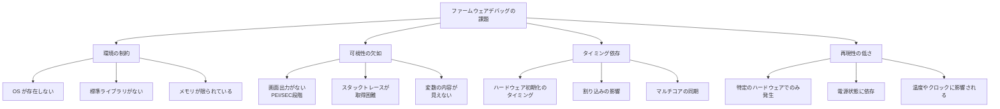
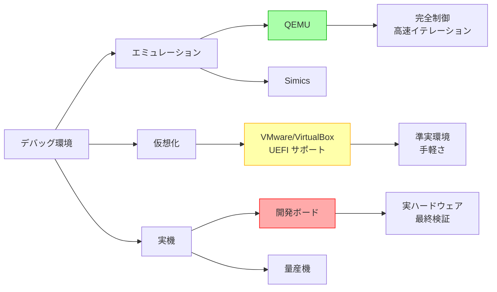
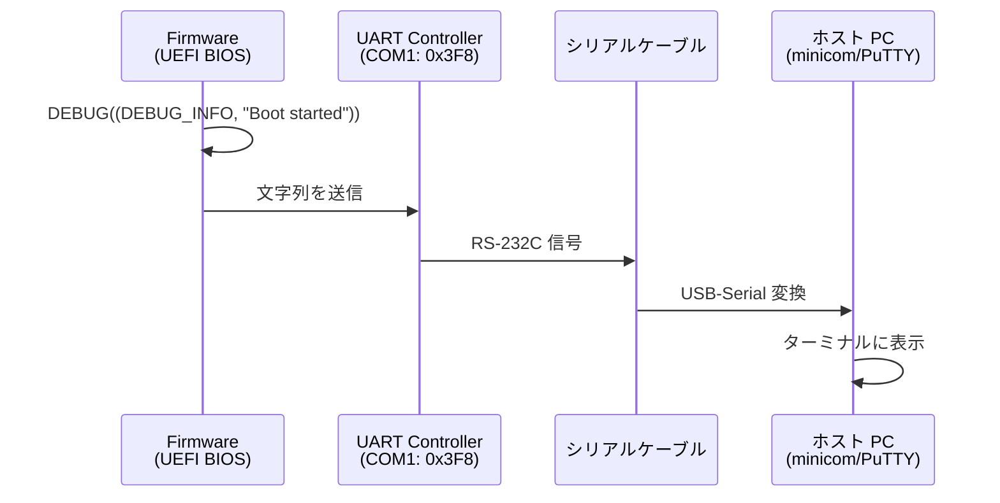
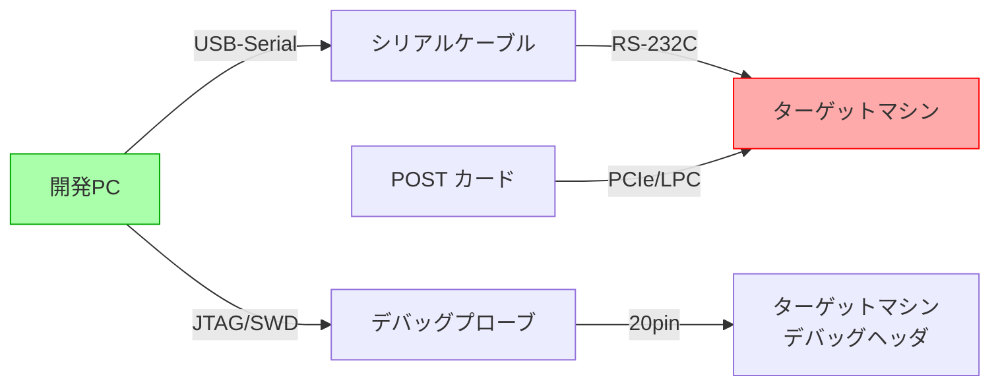
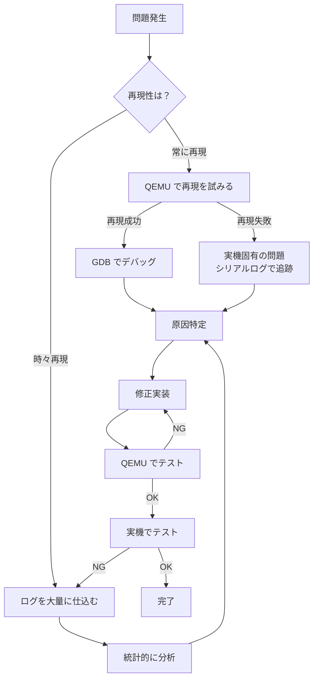

# ファームウェアデバッグの基礎

🎯 **この章で学ぶこと**
- ファームウェアデバッグの特殊性と課題
- デバッグ環境の構築方法
- シリアルポートを使った基本的なデバッグ手法
- QEMU を使ったエミュレーション環境でのデバッグ
- 実機デバッグの準備と注意点

📚 **前提知識**
- [Part 0: 開発環境の構築](../part0/README.md)
- [Part I: x86_64 ブート基礎](../part1/README.md)
- [Part II: EDK II 実装](../part2/README.md)

---

## ファームウェアデバッグの特殊性

**ファームウェアのデバッグ** は、アプリケーション開発におけるデバッグとは根本的に異なる課題を抱えています。アプリケーション開発では、OS カーネルが提供する豊富なデバッグ機構（デバッガ、プロファイラ、ログシステム）を活用できますが、ファームウェアは **OS が存在しない環境**、すなわち**ベアメタル環境**で動作するため、こうした高水準なデバッグ支援は一切期待できません。ファームウェアは、プロセッサがリセットされた直後から、メモリコントローラの初期化、ハードウェアの検出、OS への制御移譲まで、すべてを自力で実行しなければならないため、デバッグも同様に「何もない状態」から始める必要があるのです。

ファームウェアデバッグの最大の困難は、**可視性の欠如**です。SEC/PEI フェーズでは、グラフィックスカードがまだ初期化されていないため、画面に何も表示できません。また、OS が提供する `printf` や `fprintf` のような標準的なログ出力機構も存在しないため、デバッグ情報を外部に伝える手段は**シリアルポート**や **I/O ポート経由の POST コード**に限られます。さらに、ファームウェアが異常終了（クラッシュ）した場合、OS のようなコアダンプやスタックトレースは生成されず、システムは単に**ハング（無応答）** するか、**即座にリセット**されてしまうため、問題の原因を特定することが極めて困難になります。

また、ファームウェアデバッグには**タイミング依存性の問題**が頻繁に発生します。ハードウェア初期化には、特定のレジスタへの書き込み後に一定時間の**待機（ディレイ）** が必要な場合が多く、この待機時間が不足すると、次の処理が失敗します。さらに、マルチコア環境では、各コアが並行して初期化処理を実行するため、コア間の**同期タイミング**がずれると、競合状態（Race Condition）やデッドロックが発生します。こうしたタイミング依存の問題は、デバッグ出力を追加しただけで**再現しなくなる**（Heisenbug）ことがあるため、原因の特定がさらに困難になります。

ファームウェアデバッグの**再現性の低さ**も大きな課題です。特定のハードウェア構成やファームウェアバージョンでのみ発生する問題や、特定の電源状態（S3 スリープからの復帰など）でのみ再現する問題、さらには温度やクロック周波数といった環境条件に依存する問題もあります。こうした問題は、開発環境（QEMU エミュレータや開発ボード）では再現せず、量産機でのみ発生することが多いため、デバッグには実機へのアクセスと、繰り返しの BIOS 書き込み・検証が必要となり、**デバッグサイクルが数分から数十分**にも及びます。

したがって、ファームウェアデバッグを効果的に行うためには、**段階的なデバッグ環境の構築**が不可欠です。まず、QEMU などのエミュレータ環境で基本的な機能実装とデバッグを行い、次に仮想マシンで OS ブートまでの統合テストを実施し、最後に実機で最終検証を行うという**3段階のアプローチ**が推奨されます。各段階で適切なデバッグツール（シリアルポート、GDB、POST コード、JTAG デバッガ）を使い分けることで、効率的にファームウェアの問題を特定し、修正することが可能になります。

### アプリケーションデバッグとの違い（補足表）

| 観点 | アプリケーション | ファームウェア |
|------|----------------|--------------|
| **実行環境** | OS カーネル上 | ベアメタル（OS なし） |
| **デバッガ** | gdb, Visual Studio など | JTAG, シリアル、エミュレータ |
| **出力手段** | printf, ログファイル | シリアルポート、POST コード |
| **メモリ保護** | あり（ページング、ASLR） | なし（物理アドレス直接アクセス） |
| **クラッシュ時** | コアダンプ、スタックトレース | 即座にハング、再起動 |
| **再現性** | 比較的高い | 低い（タイミング依存が多い） |
| **デバッグサイクル** | 数秒～数分 | 数分～数十分（書き込み時間含む） |

### ファームウェアデバッグ固有の課題



---

## デバッグ環境の階層

ファームウェアのデバッグには、複数の環境を組み合わせて使用します。

### デバッグ環境の種類



### 環境ごとの用途

| 環境 | 用途 | メリット | デメリット |
|------|------|---------|----------|
| **QEMU** | 初期開発、機能実装 | 高速、完全制御、再現性高 | ハードウェアの細部は再現されない |
| **仮想マシン** | OS ブート検証、統合テスト | 手軽、スナップショット可能 | UEFI 機能に制限あり |
| **開発ボード** | ハードウェア依存機能の実装 | 実ハードウェアで検証可能 | 高価、セットアップが複雑 |
| **量産機** | 最終検証、バグ再現 | 実環境と同一 | デバッグ機能が制限される |

---

## シリアルデバッグの基礎

最も基本的で重要なデバッグ手法がシリアルポート経由のログ出力です。

### シリアルポートの役割



### シリアルポートの設定

#### UEFI 側の設定 (.dsc ファイル)

```ini
[PcdsFixedAtBuild]
  # シリアルポートの基本設定
  gEfiMdeModulePkgTokenSpaceGuid.PcdSerialUseMmio|FALSE
  gEfiMdeModulePkgTokenSpaceGuid.PcdSerialRegisterBase|0x3F8
  gEfiMdeModulePkgTokenSpaceGuid.PcdSerialBaudRate|115200
  gEfiMdeModulePkgTokenSpaceGuid.PcdSerialLineControl|0x03  # 8N1
  gEfiMdeModulePkgTokenSpaceGuid.PcdSerialFifoControl|0x07  # FIFO enabled
  gEfiMdeModulePkgTokenSpaceGuid.PcdSerialDetectCable|FALSE
  gEfiMdeModulePkgTokenSpaceGuid.PcdSerialRegisterStride|1

  # デバッグレベルの設定
  gEfiMdePkgTokenSpaceGuid.PcdDebugPrintErrorLevel|0x8000004F
  # 0x80000000 = DEBUG_ERROR
  # 0x00000040 = DEBUG_INFO
  # 0x00000008 = DEBUG_WARN
  # 0x00000004 = DEBUG_LOAD
  # 0x00000002 = DEBUG_FS
  # 0x00000001 = DEBUG_INIT

  # デバッグプロパティ
  gEfiMdePkgTokenSpaceGuid.PcdDebugPropertyMask|0x1F
  # 0x01 = DEBUG_PROPERTY_DEBUG_ASSERT_ENABLED
  # 0x02 = DEBUG_PROPERTY_DEBUG_PRINT_ENABLED
  # 0x04 = DEBUG_PROPERTY_DEBUG_CODE_ENABLED
  # 0x08 = DEBUG_PROPERTY_CLEAR_MEMORY_ENABLED
  # 0x10 = DEBUG_PROPERTY_ASSERT_DEADLOOP_ENABLED
```

#### デバッグ出力の例

```c
// MyDriver.c
#include <Uefi.h>
#include <Library/UefiLib.h>
#include <Library/DebugLib.h>

EFI_STATUS
EFIAPI
MyDriverEntry (
  IN EFI_HANDLE        ImageHandle,
  IN EFI_SYSTEM_TABLE  *SystemTable
  )
{
  EFI_STATUS  Status;

  //
  // デバッグ出力の基本形
  //
  DEBUG((DEBUG_INFO, "MyDriver: Entry point called\n"));

  //
  // 変数の値を出力
  //
  UINTN  MemorySize = 0x100000;
  DEBUG((DEBUG_INFO, "Memory size: 0x%lx (%ld bytes)\n",
         MemorySize, MemorySize));

  //
  // 条件付きデバッグ
  //
  if (ImageHandle == NULL) {
    DEBUG((DEBUG_ERROR, "ERROR: ImageHandle is NULL!\n"));
    ASSERT(ImageHandle != NULL);  // Assert も出力される
    return EFI_INVALID_PARAMETER;
  }

  //
  // ポインタの値を出力
  //
  DEBUG((DEBUG_VERBOSE, "ImageHandle: 0x%p\n", ImageHandle));
  DEBUG((DEBUG_VERBOSE, "SystemTable: 0x%p\n", SystemTable));

  //
  // GUID の出力
  //
  EFI_GUID  TestGuid = { 0x12345678, 0x1234, 0x5678,
                         { 0x12, 0x34, 0x56, 0x78, 0x9a, 0xbc, 0xde, 0xf0 } };
  DEBUG((DEBUG_INFO, "GUID: %g\n", &TestGuid));

  //
  // Unicode 文字列の出力
  //
  CHAR16  *DevicePath = L"\\EFI\\BOOT\\BOOTX64.EFI";
  DEBUG((DEBUG_INFO, "Device path: %s\n", DevicePath));

  Status = DoSomething();
  if (EFI_ERROR(Status)) {
    DEBUG((DEBUG_ERROR, "DoSomething failed: %r\n", Status));
    // %r はEFI_STATUS を文字列化（例: "Not Found"）
    return Status;
  }

  DEBUG((DEBUG_INFO, "MyDriver: Initialization complete\n"));
  return EFI_SUCCESS;
}
```

### ホスト側のシリアル受信設定

#### Linux での設定 (minicom)

```bash
# minicom のインストール
sudo apt install minicom

# シリアルポート権限の付与
sudo usermod -a -G dialout $USER
# ログアウト・ログインが必要

# minicom 設定
sudo minicom -s

# 設定内容:
# Serial port setup:
#   A - Serial Device: /dev/ttyUSB0
#   E - Baud rate: 115200 8N1
#   F - Hardware Flow Control: No
#   G - Software Flow Control: No

# 設定を保存して終了後、接続
minicom -D /dev/ttyUSB0 -b 115200
```

#### Windows での設定 (PuTTY)

```
PuTTY Configuration:
  Connection type: Serial
  Serial line: COM3 (デバイスマネージャーで確認)
  Speed: 115200

Session > Logging:
  Session logging: All session output
  Log file name: C:\uefi_debug.log
```

### 実際の出力例

```
PROGRESS CODE: V03020002 I0
PROGRESS CODE: V03020003 I0
SecCoreStartupWithStack(0xFFFCC000, 0x820000)
SEC: Normal boot
PeiCoreImageHandle: 0xFFFC1010
PeiCoreEntryPoint: 0xFFFC5000
Install PPI: 8C8CE578-8A3D-4F1C-9935-896185C32DD3 (gEfiPeiMemoryDiscoveredPpiGuid)
Install PPI: 49EDB1C1-BF21-4761-BB12-EB0031AABB39 (gEfiPeiResetPpiGuid)
Temp RAM: BaseAddress=0xFEF00000 Length=0x10000
Heap: BaseAddress=0xFEF08000 Length=0x6000
Stack: BaseAddress=0xFEF00000 Length=0x8000
PEI Phase started...
Install PPI: 8D8A88FF-2E1C-4677-8DD8-A8A48B39C3BB (gEfiPeiBootInRecoveryModePpiGuid)

DXE Core Entry Point: 0x7F800000
DXE: Loading drivers...
Loading driver 80CF7257-87AB-47F9-A3FE-D50B76D89541 (PcdDxe)
  - InstallProtocolInterface: 13A3F0F6-264A-3EF0-F2E0-DEC512342F34 (gPcdProtocolGuid)
Loading driver D93CE3D8-A7EB-4730-8C8F-917C23B3F2F2 (RuntimeDxe)
  - InstallProtocolInterface: B7DFB4E1-052F-449F-87BE-9818FC91B733 (gEfiRuntimeArchProtocolGuid)
```

---

## QEMU エミュレーション環境でのデバッグ

### QEMU の起動オプション

```bash
#!/bin/bash
# debug_qemu.sh - QEMU デバッグセッション起動スクリプト

OVMF_CODE=/usr/share/OVMF/OVMF_CODE.fd
OVMF_VARS=/usr/share/OVMF/OVMF_VARS.fd
DISK_IMAGE=test.img

qemu-system-x86_64 \
  -machine q35 \
  -cpu qemu64 \
  -m 2048 \
  -drive if=pflash,format=raw,readonly=on,file=${OVMF_CODE} \
  -drive if=pflash,format=raw,file=${OVMF_VARS} \
  -drive format=raw,file=${DISK_IMAGE} \
  -serial stdio \
  -debugcon file:debug.log \
  -global isa-debugcon.iobase=0x402 \
  -monitor unix:/tmp/qemu-monitor,server,nowait \
  -S -s
  # -S: 起動時に一時停止
  # -s: GDB サーバーを localhost:1234 で起動
```

**オプション解説**:

| オプション | 説明 |
|----------|------|
| `-serial stdio` | シリアル出力を標準入出力に |
| `-debugcon file:debug.log` | デバッグコンソールをファイルに |
| `-global isa-debugcon.iobase=0x402` | I/O ポート 0x402 をデバッグ出力に |
| `-S` | 起動時に CPU を停止（GDB 接続待ち） |
| `-s` | GDB サーバーを TCP:1234 で起動 |

### GDB を使ったデバッグ

#### GDB の起動と接続

```bash
# GDB を起動
gdb

# QEMU に接続
(gdb) target remote localhost:1234
Remote debugging using localhost:1234
0x000000000000fff0 in ?? ()

# シンボルファイルをロード
(gdb) symbol-file Build/OvmfX64/DEBUG_GCC5/X64/MdeModulePkg/Core/Dxe/DxeMain/DEBUG/DxeCore.dll
Reading symbols from Build/OvmfX64/DEBUG_GCC5/X64/MdeModulePkg/Core/Dxe/DxeMain/DEBUG/DxeCore.dll...

# DxeCore エントリポイントにブレークポイント
(gdb) break DxeMain
Breakpoint 1 at 0x12345: file DxeMain.c, line 123.

# 実行を継続
(gdb) continue
Continuing.

Breakpoint 1, DxeMain (
    HobStart=0x7f000000)
    at /path/to/edk2/MdeModulePkg/Core/Dxe/DxeMain/DxeMain.c:123
123       DEBUG((DEBUG_INFO, "DXE Core Entry Point\n"));

# 変数の表示
(gdb) print HobStart
$1 = (VOID *) 0x7f000000

# スタックトレースの表示
(gdb) backtrace
#0  DxeMain (HobStart=0x7f000000) at DxeMain.c:123
#1  0x000000007f801234 in _ModuleEntryPoint () at AutoGen.c:45

# 次の行に進む
(gdb) next
124       InitializeCore (HobStart);

# 関数内にステップイン
(gdb) step
InitializeCore (HobStart=0x7f000000) at DxeInit.c:89
89        gHobList = HobStart;
```

### デバッグコンソール (DebugCon) の活用

```c
// DebugLib の内部実装例（簡略版）
VOID
EFIAPI
DebugPrint (
  IN  UINTN        ErrorLevel,
  IN  CONST CHAR8  *Format,
  ...
  )
{
  CHAR8    Buffer[256];
  VA_LIST  Marker;
  UINTN    Index;

  // 可変長引数を展開
  VA_START(Marker, Format);
  AsciiVSPrint(Buffer, sizeof(Buffer), Format, Marker);
  VA_END(Marker);

  // DebugCon ポート (0x402) に出力
  for (Index = 0; Buffer[Index] != '\0'; Index++) {
    IoWrite8(0x402, Buffer[Index]);
  }

  // シリアルポート (COM1: 0x3F8) にも出力
  for (Index = 0; Buffer[Index] != '\0'; Index++) {
    SerialPortWrite((UINT8 *)&Buffer[Index], 1);
  }
}
```

**出力先の違い**:

| 出力先 | I/O ポート | 用途 | QEMU オプション |
|-------|-----------|------|----------------|
| **DebugCon** | 0x402 | デバッグ専用（高速） | `-debugcon file:debug.log` |
| **Serial** | 0x3F8 (COM1) | 標準出力、対話も可能 | `-serial stdio` |
| **POST コード** | 0x80 | ブート進行状況 | デフォルトで QEMU 内部ログ |

---

## 💡 コラム: GDB で UEFI をデバッグする - 実践的な落とし穴と回避策

🛠️ **開発ツールTips**

QEMU + GDB による UEFI デバッグは強力ですが、アプリケーション開発の常識が通用しない場面が多々あります。最大の落とし穴は**シンボルのロードアドレス**です。UEFI ドライバは、DXE フェーズで動的にメモリに配置されるため、ビルド時のアドレスと実行時のアドレスが異なります。例えば、`DxeCore.dll` をビルドすると `0x0` ベースで生成されますが、実際には `0x7F800000` 番地にロードされることがあります。このため、単純に `symbol-file DxeCore.dll` とするだけでは、ブレークポイントが正しく設定されません。

解決策は、**実行時のベースアドレスを調べて手動でオフセットを指定する**ことです。UEFI のシリアル出力には、各ドライバのロード情報（`Loading driver ... at 0xXXXXXXXX`）が表示されます。この情報を使い、GDB で `add-symbol-file DxeCore.dll 0x7F800000` のようにベースアドレスを指定します。この作業を自動化するため、EDK II には `scripts/` ディレクトリに GDB スクリプトが用意されており、HOB（Hand-Off Block）から動的にアドレスを抽出してシンボルをロードするツールも存在します。

PEI フェーズのデバッグはさらに困難です。PEI は DRAM 初期化前の**キャッシュメモリ上（Cache as RAM, CAR）** で実行されるため、GDB がメモリ内容を正しく読み取れないことがあります。また、PEI ドライバは XIP（eXecute In Place）でフラッシュメモリから直接実行されるため、アドレスが `0xFFxxxxxx` のような高位アドレスになり、GDB の仮想アドレス解決が失敗することがあります。この場合は、**ハードウェアブレークポイント**（`hbreak` コマンド）を使うか、QEMU の内部トレース機能（`-d exec,cpu`）でアセンブリレベルの実行を追跡する必要があります。

最適化ビルド（`RELEASE` ビルド）では、コンパイラの最適化によって変数がレジスタに割り当てられたり、関数がインライン展開されたりするため、GDB で `print` しても「optimized out」と表示されることがあります。この問題を回避するには、デバッグしたい関数だけ `DEBUG` ビルドにするか、`.inf` ファイルで `GCC:*_*_*_CC_FLAGS = -O0 -g` のように最適化を無効化する必要があります。しかし、最適化を無効化するとタイミングが変わり、Heisenbug（デバッグすると消えるバグ）が発生するリスクもあるため、注意が必要です。

実践的なデバッグシナリオとして、筆者が経験した例を紹介します。ある日、UEFI Shell が起動しない問題に遭遇しました。シリアル出力には `DxeCore: Loading Shell.efi...` の後、何も表示されずハングしました。GDB で `DxeLoadImage` にブレークポイントを設定し、シェルのロード処理をステップ実行したところ、PE/COFF ヘッダの `SectionAlignment` が `0x1000` なのに、実際のメモリ配置が 4KB アラインされておらず、メモリアクセス違反が発生していることが判明しました。原因は、メモリアロケータの実装ミスでした。このように、GDB を駆使すれば、シリアル出力だけでは特定できない複雑な問題も解決できます。

📚 **参考資料**
- [EDK II Debugging - TianoCore Wiki](https://github.com/tianocore/tianocore.github.io/wiki/Debugging)
- [UEFI Debug with GDB - OSDev Wiki](https://wiki.osdev.org/Debugging_UEFI_applications_with_GDB)
- [QEMU GDB Documentation](https://qemu.readthedocs.io/en/latest/system/gdb.html)

---

## POST コードによるデバッグ

### POST コードとは

POST (Power-On Self-Test) コードは、ブートプロセスの進行状況を示す 1 バイトの値です。

```c
// POST コードの例
#define POST_CODE_SEC_ENTRY           0x01
#define POST_CODE_PEI_CORE_ENTRY      0x10
#define POST_CODE_MEMORY_INIT         0x15
#define POST_CODE_DXE_CORE_ENTRY      0x30
#define POST_CODE_BDS_ENTRY           0x60
#define POST_CODE_BOOT_DEVICE_SELECT  0x61
#define POST_CODE_OS_HANDOFF          0xA0

// POST コードの出力
VOID
PostCode (
  IN UINT8  Value
  )
{
  IoWrite8(0x80, Value);  // I/O ポート 0x80 に書き込み
}

// 使用例
EFI_STATUS
EFIAPI
PeiCoreEntryPoint (
  IN CONST EFI_PEI_SERVICES  **PeiServices,
  IN EFI_PEI_PPI_DESCRIPTOR  *PpiList
  )
{
  PostCode(POST_CODE_PEI_CORE_ENTRY);  // 0x10 を出力

  // メモリ初期化
  PostCode(POST_CODE_MEMORY_INIT);  // 0x15 を出力

  // ...
}
```

### POST コードカードの使用

物理的な POST コードカード（PCIe または LPC バス接続）は、画面出力がない状態でも進行状況を確認できます。

```
┌─────────────────────┐
│  POST Code Card     │
│  ┌───────────────┐  │
│  │  Segment LED  │  │
│  │   ┌─┐ ┌─┐     │  │
│  │   │1│ │5│     │  │  ← "15" を表示
│  │   └─┘ └─┘     │  │     (Memory Init)
│  └───────────────┘  │
└─────────────────────┘
```

**典型的な POST コードシーケンス**:

```
01 → SEC Entry
0F → Microcode Load
10 → PEI Core Entry
12 → CPU Init
15 → Memory Init
31 → DXE Core Entry
60 → BDS Entry
61 → Boot Device Select
A0 → OS Handoff
```

---

## ASSERT とデッドループ

### ASSERT マクロの動作

```c
// DebugLib.h から抜粋
#define ASSERT(Expression)  \
  do {  \
    if (DebugAssertEnabled()) {  \
      if (!(Expression)) {  \
        _ASSERT(__FILE__, __LINE__, #Expression);  \
      }  \
    }  \
  } while (FALSE)

// ASSERT の実装例
VOID
EFIAPI
_ASSERT (
  IN CONST CHAR8  *FileName,
  IN UINTN        LineNumber,
  IN CONST CHAR8  *Description
  )
{
  // シリアル出力
  DebugPrint(DEBUG_ERROR,
    "ASSERT_EFI_ERROR (Status = %r)\n",
    Status);
  DebugPrint(DEBUG_ERROR,
    "%a(%d): %a\n",
    FileName, LineNumber, Description);

  // スタックトレース（アーキテクチャ依存）
  DumpStackTrace();

  // デッドループに入る
  if (DebugDeadLoopEnabled()) {
    CpuDeadLoop();
  }

  // リセット（デッドループが無効の場合）
  gRT->ResetSystem(EfiResetCold, EFI_ABORTED, 0, NULL);
}

// デッドループの実装
VOID
EFIAPI
CpuDeadLoop (
  VOID
  )
{
  volatile UINTN  Index;

  // 無限ループ（デバッガからの介入を待つ）
  for (Index = 0; ;) {
    // volatile により最適化で削除されない
  }
}
```

### ASSERT の実用例

```c
EFI_STATUS
EFIAPI
AllocateAndInitialize (
  OUT VOID  **Buffer,
  IN  UINTN Size
  )
{
  EFI_STATUS  Status;

  // 入力検証
  ASSERT(Buffer != NULL);  // NULL ポインタチェック
  ASSERT(Size > 0);        // サイズが正の値であることを確認

  *Buffer = AllocatePool(Size);
  if (*Buffer == NULL) {
    DEBUG((DEBUG_ERROR, "AllocatePool failed for size %ld\n", Size));
    return EFI_OUT_OF_RESOURCES;
  }

  ZeroMem(*Buffer, Size);

  return EFI_SUCCESS;
}

// 使用例
VOID TestFunction(VOID) {
  VOID  *MyBuffer;
  EFI_STATUS  Status;

  Status = AllocateAndInitialize(&MyBuffer, 1024);
  ASSERT_EFI_ERROR(Status);  // Status が EFI_SUCCESS でない場合 ASSERT

  // MyBuffer を使用
  // ...

  FreePool(MyBuffer);
}
```

**ASSERT 出力例**:

```
ASSERT_EFI_ERROR (Status = Not Found)
/path/to/edk2/MyPkg/MyDriver/MyDriver.c(123): !EFI_ERROR (Status)

Call Stack:
  0x7F801234 in AllocateAndInitialize() at MyDriver.c:123
  0x7F801456 in TestFunction() at MyDriver.c:145
  0x7F801678 in DriverEntry() at MyDriver.c:200

Entering dead loop...
```

---

## 実機デバッグの準備

### 必要なハードウェア



**推奨ハードウェア**:

| 項目 | 製品例 | 用途 |
|------|-------|------|
| **USB-Serial アダプタ** | FTDI FT232RL | シリアルログ取得 |
| **POST カード** | PC POST Card (LPC/PCIe) | ハング時の状態確認 |
| **JTAG/SWD プローブ** | Segger J-Link, Lauterbach | ハードウェアデバッグ |
| **ロジックアナライザ** | Saleae Logic 8 | バス信号解析 |

### BIOS 書き込みツール

```bash
# flashrom - Linux でのSPI Flash 書き込み
sudo flashrom -p internal -r backup.bin     # バックアップ
sudo flashrom -p internal -w new_bios.bin   # 書き込み
sudo flashrom -p internal -v new_bios.bin   # ベリファイ

# 外部プログラマ使用（CH341A など）
sudo flashrom -p ch341a_spi -r backup.bin
sudo flashrom -p ch341a_spi -w new_bios.bin

# Intel CSME/AMD PSP を含む場合の注意
# → ME/PSP 領域を保護して BIOS 領域のみ更新
sudo flashrom -p internal --ifd -i bios -w new_bios.bin
```

### 実機デバッグ時の注意点

**⚠️ 重要な注意事項**:

1. **必ずバックアップを取る**: BIOS 書き込み前に必ず元のイメージを保存
2. **電源管理**: 書き込み中に電源を切らない（ブリック の原因）
3. **WP# ピン**: ハードウェアライトプロテクトが有効な場合は無効化が必要
4. **ME/PSP 領域**: Intel ME や AMD PSP 領域は通常触らない
5. **リカバリ手段の確保**: SPI Flash プログラマを用意しておく

---

## デバッグワークフロー

### 典型的なデバッグサイクル



### ステップ・バイ・ステップデバッグ

**ケーススタディ: 起動時にハングする問題**

```
症状: DXE Phase で進行が止まる
POST コード: 0x35 で停止
シリアルログ: "Install Protocol: ..." の後に出力なし
```

**デバッグ手順**:

1. **POST コードから位置を特定**
   ```
   0x30: DXE Core Entry
   0x35: Loading drivers ← ここで停止
   ```

2. **シリアルログを詳細化**
   ```c
   // DxeMain.c に詳細ログを追加
   DEBUG((DEBUG_INFO, "Loading driver %g\n", &DriverGuid));
   DEBUG((DEBUG_INFO, "  Entry point: 0x%lx\n", EntryPoint));

   Status = EntryPoint(ImageHandle, SystemTable);

   DEBUG((DEBUG_INFO, "  Driver returned: %r\n", Status));
   ```

3. **ログから原因を特定**
   ```
   Loading driver 12345678-1234-1234-1234-123456789ABC
     Entry point: 0x7F850000
   [ここで停止 → このドライバのEntryPointで問題発生]
   ```

4. **該当ドライバを無効化**
   ```ini
   # .dsc ファイルで該当ドライバをコメントアウト
   # MyPkg/ProblematicDriver/ProblematicDriver.inf
   ```

5. **起動確認 → 原因ドライバを特定**

6. **ドライバ内部をデバッグ**
   ```c
   EFI_STATUS
   EFIAPI
   ProblematicDriverEntry (...)
   {
     DEBUG((DEBUG_INFO, "ProblematicDriver: Start\n"));

     // この行まで実行されているか？
     DEBUG((DEBUG_INFO, "Before InitializeHardware\n"));
     InitializeHardware();

     // ここまで到達していない → InitializeHardware が原因
     DEBUG((DEBUG_INFO, "After InitializeHardware\n"));

     return EFI_SUCCESS;
   }
   ```

7. **根本原因を特定 → 修正**

---

## 💻 演習

### 演習 1: デバッグ環境の構築

QEMU + GDB のデバッグ環境を構築し、以下を実行してください。

1. OVMF (EDK II for QEMU) をビルド
2. QEMU を `-S -s` オプション付きで起動
3. GDB で接続し、`DxeMain` にブレークポイントを設定
4. 実行を再開し、ブレークポイントで停止することを確認
5. 変数 `HobStart` の値を確認

### 演習 2: シリアルデバッグの実践

簡単な UEFI アプリケーションを作成し、以下のデバッグ出力を実装してください。

1. `DEBUG_INIT` レベルでエントリポイントの実行を記録
2. `DEBUG_INFO` レベルで処理の進行状況を記録
3. `DEBUG_WARN` レベルで警告を記録
4. `DEBUG_ERROR` レベルでエラーを記録
5. QEMU のシリアル出力でログを確認

**ヒント**:
```c
DEBUG((DEBUG_INIT, "Application started\n"));
DEBUG((DEBUG_INFO, "Processing step 1...\n"));
DEBUG((DEBUG_WARN, "Unusual condition detected\n"));
DEBUG((DEBUG_ERROR, "Critical error occurred\n"));
```

### 演習 3: ASSERT の動作確認

意図的に ASSERT を発生させるコードを書き、その動作を観察してください。

```c
EFI_STATUS TestAssert(VOID) {
  VOID  *NullPointer = NULL;

  // 以下の ASSERT が発動する
  ASSERT(NullPointer != NULL);

  return EFI_SUCCESS;
}
```

出力されるファイル名、行番号、スタックトレースを確認してください。

---

## まとめ

本章では、ファームウェアデバッグの基礎として、アプリケーション開発とは根本的に異なるファームウェア特有のデバッグ課題と、それに対処するための体系的なアプローチを学びました。

ファームウェアデバッグの特殊性は、**OS が存在しないベアメタル環境**で動作するという点に集約されます。OS カーネルが提供する高水準なデバッグ機構（デバッガ、プロファイラ、ログシステム）は一切利用できず、SEC/PEI フェーズでは画面出力もできません。したがって、デバッグ情報を外部に伝える手段は**シリアルポート**や **POST コード**といった低レベルな機構に限られます。また、ファームウェアがクラッシュした場合、OS のようなコアダンプやスタックトレースは生成されず、システムは単にハングするか即座にリセットされるため、問題の原因特定が極めて困難です。さらに、タイミング依存の問題や、特定のハードウェアでのみ発生する問題など、再現性の低い不具合が頻繁に発生します。

こうした課題に対処するため、**段階的なデバッグ環境の構築**が不可欠です。まず、**QEMU エミュレータ**で基本的な機能実装とデバッグを行い、高速なイテレーションと完全な制御を活用します。次に、**仮想マシン（VMware/VirtualBox）** で OS ブートまでの統合テストを実施し、準実環境での動作を確認します。最後に、**実機（開発ボードや量産機）** で最終検証を行い、実ハードウェア固有の問題を特定します。この 3 段階アプローチにより、開発効率を維持しながら、実環境での信頼性を確保できます。

**シリアルデバッグ**は、ファームウェアデバッグにおける最も基本的で重要な手法です。UART コントローラ（通常は COM1: 0x3F8）を通じてデバッグ情報を外部に送信し、ホスト PC 上のターミナル（minicom、PuTTY）で受信します。EDK II では、`DEBUG()` マクロを使ってデバッグレベル（DEBUG_ERROR、DEBUG_WARN、DEBUG_INFO、DEBUG_VERBOSE）を指定し、詳細度を調整できます。シリアルデバッグは、SEC フェーズから BDS フェーズまで、すべてのブートフェーズで利用可能であり、常に有効化しておくべきです。また、QEMU では `-debugcon file:debug.log` オプションで、I/O ポート 0x402 への出力をファイルに記録でき、シリアルポートとは独立した高速なログ取得が可能です。

**GDB を使ったソースレベルデバッグ**は、QEMU 環境で特に強力です。QEMU を `-S -s` オプション付きで起動すると、起動時に CPU が一時停止し、GDB サーバーが localhost:1234 で待機します。GDB から `target remote localhost:1234` で接続し、シンボルファイル（`.dll` ファイル）をロードすることで、ソースコードレベルでのブレークポイント設定、ステップ実行、変数の確認が可能になります。この手法は、複雑なロジックのデバッグや、メモリ破壊の原因特定に非常に有効です。ただし、実機では GDB デバッグは通常利用できないため、QEMU で問題を再現させることが前提となります。

**POST コード**は、ブートプロセスの進行状況を示す 1 バイトの値であり、I/O ポート 0x80 に書き込まれます。POST コードは、画面出力やシリアルポートが利用できない状況でも動作するため、ハング時の位置特定に不可欠です。物理的な POST コードカード（PCIe または LPC バス接続）を使用すれば、セグメント LED に POST コードが表示され、どのブートフェーズで停止したかを即座に確認できます。典型的な POST コードシーケンス（0x01 → SEC Entry、0x10 → PEI Core Entry、0x31 → DXE Core Entry、0x60 → BDS Entry、0xA0 → OS Handoff）を把握しておくことで、問題の大まかな位置を迅速に特定できます。

**ASSERT マクロ**は、プログラムの前提条件（事前条件、事後条件、不変条件）を検証し、違反が検出された場合にエラーメッセージを出力してデッドループに入ります。`ASSERT()` マクロは、ファイル名、行番号、条件式を含む詳細な情報をシリアルポートに出力し、スタックトレースも表示します。デバッグビルドでは、すべての ASSERT を有効化（`PcdDebugPropertyMask` の `DEBUG_PROPERTY_DEBUG_ASSERT_ENABLED` ビットを設定）し、異常を早期に発見することが重要です。ASSERT によるデッドループは、GDB デバッガからの介入を可能にし、問題発生時点の状態を詳細に調査できます。

実機デバッグを行う場合は、事前準備と注意が必要です。まず、**必ず元の BIOS イメージのバックアップを取得**してから、新しいファームウェアを書き込みます。書き込みには `flashrom` コマンドや専用の SPI Flash プログラマ（CH341A など）を使用しますが、書き込み中に電源を切るとブリック（起動不能）の原因となるため、電源管理には細心の注意が必要です。また、ハードウェアライトプロテクト（WP# ピン）が有効な場合は、これを無効化する必要があります。Intel ME や AMD PSP 領域は通常触らず、BIOS 領域のみを更新します（`flashrom --ifd -i bios` オプション）。万一に備えて、外部 SPI Flash プログラマを用意し、物理的なリカバリ手段を確保しておくことが推奨されます。

ファームウェアデバッグのベストプラクティスとして、**段階的デバッグ**（QEMU で大まかな問題を解決し、実機で最終確認）、**ログの粒度調整**（問題箇所は詳細に、それ以外は簡潔に）、**再現性の確保**（同じ条件で何度も再現できるテストケースを作成）、**バックアップの徹底**（実機デバッグ前に必ずバックアップ）、**適切なツールの使い分け**（GDB、POST カード、ロジックアナライザ、JTAG デバッガ）が挙げられます。これらのプラクティスを遵守することで、複雑なファームウェアの問題も効率的に解決できるようになります。

---

次章では、デバッグツールの内部動作と、より高度なデバッグ手法について詳しく学びます。

📚 **参考資料**
- [EDK II Debugging](https://github.com/tianocore/tianocore.github.io/wiki/Debugging)
- [QEMU Documentation](https://www.qemu.org/docs/master/)
- [GDB Manual](https://sourceware.org/gdb/current/onlinedocs/gdb/)
- [UEFI Debug Support](https://uefi.org/specs/UEFI/2.10/02_Overview.html#debug-support)
