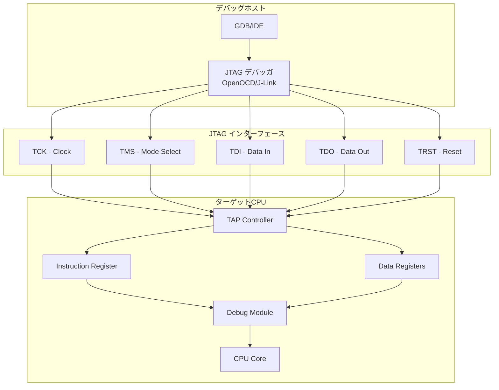
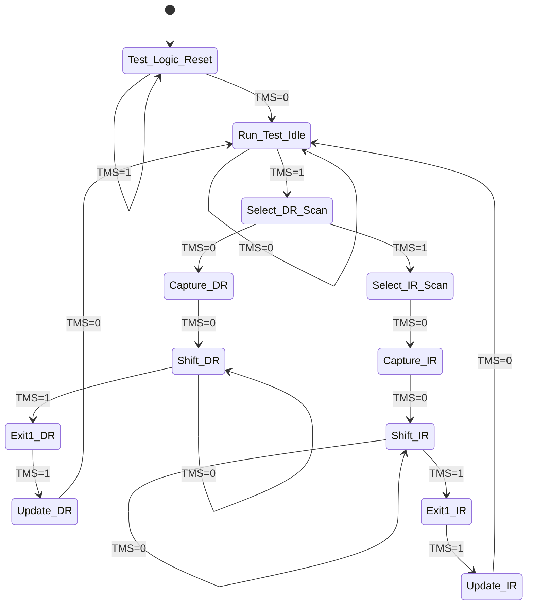
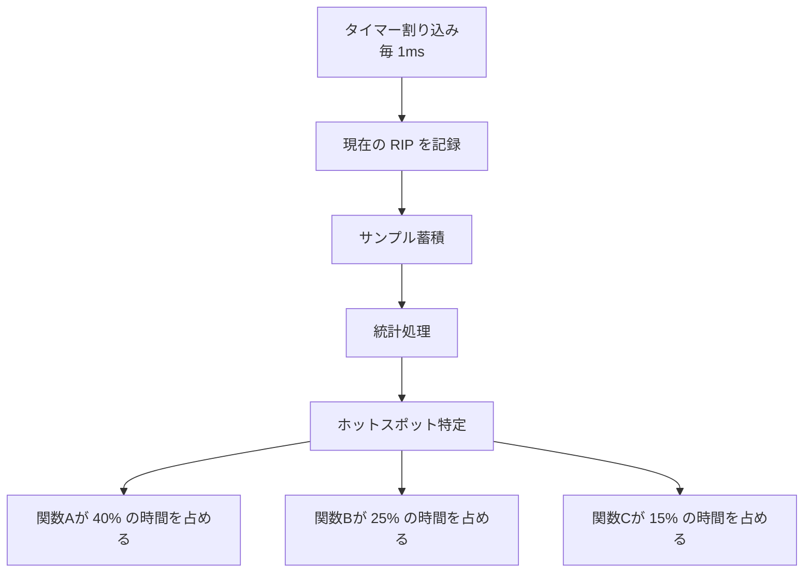
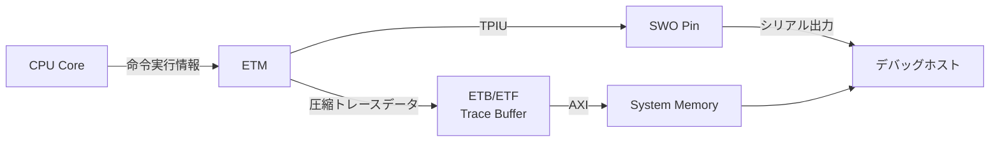

# デバッグツールの仕組み

🎯 **この章で学ぶこと**
- JTAG/SWD ハードウェアデバッガの原理
- GDB リモートデバッグプロトコルの詳細
- UEFI デバッグサポートプロトコルの実装
- シンボル情報の構造と活用方法
- プロファイリングツールの仕組み

📚 **前提知識**
- [ファームウェアデバッグの基礎](01-debug-fundamentals.md)
- [Part I: x86_64 ブート基礎](../part1/README.md)

---

## ハードウェアデバッガの原理

### JTAG (Joint Test Action Group)

JTAG は、元々 IC のテストのために設計された IEEE 1149.1 規格ですが、現在ではデバッグインターフェースとして広く使用されています。

#### JTAG のアーキテクチャ



#### JTAG 信号線の役割

| 信号 | 方向 | 説明 |
|------|------|------|
| **TCK** | Host → Target | クロック信号（通常 1-10 MHz） |
| **TMS** | Host → Target | モード選択（ステートマシン制御） |
| **TDI** | Host → Target | データ入力（シリアルデータ） |
| **TDO** | Target → Host | データ出力（シリアルデータ） |
| **TRST** | Host → Target | リセット（オプション） |

#### TAP ステートマシン



### ARM SWD (Serial Wire Debug)

SWD は ARM が開発した2線式のデバッグインターフェースで、JTAG よりもピン数が少ないのが特徴です。

#### SWD の信号線

| 信号 | 方向 | 説明 |
|------|------|------|
| **SWDCLK** | Host → Target | クロック信号 |
| **SWDIO** | Bidirectional | データ入出力（双方向） |
| **SWO** | Target → Host | トレース出力（オプション） |

#### SWD プロトコルの基本

```c
// SWD パケット構造（簡略版）
typedef struct {
  UINT8   Start    : 1;  // 常に 1
  UINT8   APnDP    : 1;  // 0=DP, 1=AP
  UINT8   RnW      : 1;  // 0=Write, 1=Read
  UINT8   Address  : 2;  // レジスタアドレス
  UINT8   Parity   : 1;  // パリティビット
  UINT8   Stop     : 1;  // 常に 0
  UINT8   Park     : 1;  // 常に 1
} SWD_REQUEST;

// SWD 読み取りの疑似コード
UINT32 SwdRead(UINT8 ap, UINT8 addr) {
  SWD_REQUEST req;
  req.Start = 1;
  req.APnDP = ap;
  req.RnW = 1;  // Read
  req.Address = addr;
  req.Parity = CalculateParity(&req);
  req.Stop = 0;
  req.Park = 1;

  // リクエスト送信
  SwdSendBits(&req, 8);

  // ACK 受信（3ビット）
  UINT8 ack = SwdReceiveBits(3);
  if (ack != SWD_ACK_OK) {
    return SWD_ERROR;
  }

  // データ受信（32ビット）
  UINT32 data = SwdReceiveBits(32);

  // パリティ受信
  UINT8 parity = SwdReceiveBits(1);

  return data;
}
```

---

## GDB リモートプロトコル

GDB は、リモートデバッグのために RSP (Remote Serial Protocol) を使用します。QEMU や実機デバッガは、このプロトコルを実装することで GDB と通信します。

### GDB リモートプロトコルの概要

```mermaid
sequenceDiagram
    participant GDB as GDB クライアント
    participant Stub as GDB Stub<br/>(QEMU/OpenOCD)
    participant Target as ターゲット

    GDB->>Stub: $g#67 (レジスタ読み取り)
    Stub->>Target: レジスタ値取得
    Target-->>Stub: RAX=0x1234, RBX=0x5678, ...
    Stub-->>GDB: +$rax:1234;rbx:5678;...#XX

    GDB->>Stub: $m7f800000,100#XX (メモリ読み取り)
    Stub->>Target: アドレス 0x7f800000 から 0x100 バイト読み取り
    Target-->>Stub: メモリ内容
    Stub-->>GDB: +$48656c6c6f...#XX

    GDB->>Stub: $Z0,7f801234,1#XX (ブレークポイント設定)
    Stub->>Target: 0x7f801234 に BP 設定
    Target-->>Stub: OK
    Stub-->>GDB: +$OK#XX

    GDB->>Stub: $c#63 (実行継続)
    Stub->>Target: CPU 実行再開
    Note over Target: ブレークポイントヒット
    Target-->>Stub: 停止通知
    Stub-->>GDB: +$S05#XX (SIGTRAP)
```

### 主要な GDB コマンド

| パケット | 説明 | 応答例 |
|---------|------|--------|
| `$g#67` | 全レジスタ読み取り | `$rax:1234;rbx:5678;...#XX` |
| `$G<data>#XX` | 全レジスタ書き込み | `$OK#XX` |
| `$m<addr>,<len>#XX` | メモリ読み取り | `$48656c6c6f...#XX` (HEX) |
| `$M<addr>,<len>:<data>#XX` | メモリ書き込み | `$OK#XX` |
| `$Z0,<addr>,<kind>#XX` | ソフトウェア BP 設定 | `$OK#XX` |
| `$z0,<addr>,<kind>#XX` | ソフトウェア BP 削除 | `$OK#XX` |
| `$c#63` | 実行継続 (continue) | `$S05#XX` (停止時) |
| `$s#73` | ステップ実行 (step) | `$S05#XX` |
| `$?#3F` | 停止理由の問い合わせ | `$S05#XX` |

### パケット形式

```
$<data>#<checksum>

例: $m7f800000,100#a4
     ^          ^ ^^
     |          | |+-- チェックサム（2桁HEX）
     |          | +--- '#' 区切り文字
     |          +----- データ部
     +---------------- '$' 開始マーカー

チェックサム = sum(data) % 256 の2桁HEX表現
```

### GDB Stub の実装例（簡略版）

```c
// GDB Stub の簡易実装
typedef struct {
  UINT64  Rax, Rbx, Rcx, Rdx;
  UINT64  Rsi, Rdi, Rbp, Rsp;
  UINT64  R8, R9, R10, R11, R12, R13, R14, R15;
  UINT64  Rip, Rflags;
  UINT32  Cs, Ss, Ds, Es, Fs, Gs;
} GDB_REGISTERS;

CHAR8 gGdbInputBuffer[4096];
CHAR8 gGdbOutputBuffer[4096];

VOID
GdbStubMain (
  VOID
  )
{
  while (TRUE) {
    // パケット受信
    if (!GdbReceivePacket(gGdbInputBuffer, sizeof(gGdbInputBuffer))) {
      continue;
    }

    // コマンド処理
    switch (gGdbInputBuffer[0]) {
      case 'g':  // レジスタ読み取り
        GdbReadRegisters(gGdbOutputBuffer);
        break;

      case 'G':  // レジスタ書き込み
        GdbWriteRegisters(&gGdbInputBuffer[1]);
        AsciiStrCpyS(gGdbOutputBuffer, sizeof(gGdbOutputBuffer), "OK");
        break;

      case 'm':  // メモリ読み取り
        GdbReadMemory(&gGdbInputBuffer[1], gGdbOutputBuffer);
        break;

      case 'M':  // メモリ書き込み
        GdbWriteMemory(&gGdbInputBuffer[1]);
        AsciiStrCpyS(gGdbOutputBuffer, sizeof(gGdbOutputBuffer), "OK");
        break;

      case 'c':  // 実行継続
        return;  // Stub を抜けて実行再開

      case 's':  // ステップ実行
        SetSingleStepFlag();
        return;

      case '?':  // 停止理由
        AsciiStrCpyS(gGdbOutputBuffer, sizeof(gGdbOutputBuffer), "S05");
        break;

      default:
        // 未サポートコマンド
        gGdbOutputBuffer[0] = '\0';
        break;
    }

    // 応答送信
    GdbSendPacket(gGdbOutputBuffer);
  }
}

VOID
GdbReadRegisters (
  OUT CHAR8  *Buffer
  )
{
  GDB_REGISTERS  *Regs = GetCurrentRegisters();

  // レジスタをHEX文字列に変換
  AsciiSPrint(Buffer, 4096,
    "%016lx%016lx%016lx%016lx"  // RAX, RBX, RCX, RDX
    "%016lx%016lx%016lx%016lx"  // RSI, RDI, RBP, RSP
    "%016lx%016lx%016lx%016lx"  // R8-R11
    "%016lx%016lx%016lx%016lx"  // R12-R15
    "%016lx",                    // RIP
    Regs->Rax, Regs->Rbx, Regs->Rcx, Regs->Rdx,
    Regs->Rsi, Regs->Rdi, Regs->Rbp, Regs->Rsp,
    Regs->R8, Regs->R9, Regs->R10, Regs->R11,
    Regs->R12, Regs->R13, Regs->R14, Regs->R15,
    Regs->Rip
  );
}

VOID
GdbReadMemory (
  IN  CHAR8  *AddrLenStr,
  OUT CHAR8  *Buffer
  )
{
  UINT64  Address;
  UINT32  Length;
  UINT8   *Ptr;
  UINTN   Index;

  // "7f800000,100" をパース
  AsciiStrHexToUint64S(AddrLenStr, NULL, &Address);
  // ',' を探して長さを取得
  CHAR8 *Comma = AsciiStrStr(AddrLenStr, ",");
  if (Comma) {
    AsciiStrHexToUint64S(Comma + 1, NULL, &Length);
  }

  // メモリ内容をHEX文字列に変換
  Ptr = (UINT8 *)(UINTN)Address;
  for (Index = 0; Index < Length; Index++) {
    AsciiSPrint(&Buffer[Index * 2], 3, "%02x", Ptr[Index]);
  }
}
```

---

## UEFI デバッグサポートプロトコル

UEFI 仕様では、デバッグをサポートするためのプロトコルが定義されています。

### EFI_DEBUG_SUPPORT_PROTOCOL

```c
typedef struct _EFI_DEBUG_SUPPORT_PROTOCOL {
  EFI_INSTRUCTION_SET_ARCHITECTURE  Isa;
  EFI_GET_MAXIMUM_PROCESSOR_INDEX   GetMaximumProcessorIndex;
  EFI_REGISTER_PERIODIC_CALLBACK    RegisterPeriodicCallback;
  EFI_REGISTER_EXCEPTION_CALLBACK   RegisterExceptionCallback;
  EFI_INVALIDATE_INSTRUCTION_CACHE  InvalidateInstructionCache;
} EFI_DEBUG_SUPPORT_PROTOCOL;

// 例外ハンドラの登録
typedef
VOID
(EFIAPI *EFI_EXCEPTION_CALLBACK) (
  IN EFI_EXCEPTION_TYPE  ExceptionType,
  IN EFI_SYSTEM_CONTEXT  SystemContext
  );

typedef
EFI_STATUS
(EFIAPI *EFI_REGISTER_EXCEPTION_CALLBACK) (
  IN EFI_DEBUG_SUPPORT_PROTOCOL  *This,
  IN UINTN                       ProcessorIndex,
  IN EFI_EXCEPTION_CALLBACK      ExceptionCallback,
  IN EFI_EXCEPTION_TYPE          ExceptionType
  );
```

### デバッグ例外の処理

```c
// INT3 (ブレークポイント) ハンドラの実装例
VOID
EFIAPI
DebugExceptionHandler (
  IN EFI_EXCEPTION_TYPE  ExceptionType,
  IN EFI_SYSTEM_CONTEXT  SystemContext
  )
{
  EFI_SYSTEM_CONTEXT_X64  *Context = SystemContext.SystemContextX64;

  if (ExceptionType == EXCEPT_X64_BREAKPOINT) {  // INT3
    DEBUG((DEBUG_ERROR, "Breakpoint hit at RIP: 0x%lx\n", Context->Rip));

    // ブレークポイント命令 (0xCC) をスキップ
    Context->Rip++;

    // GDB Stub に制御を移す
    GdbStubBreakpointHandler(Context);

  } else if (ExceptionType == EXCEPT_X64_DEBUG) {  // Single Step
    DEBUG((DEBUG_ERROR, "Single step at RIP: 0x%lx\n", Context->Rip));

    // TF フラグをクリア
    Context->Rflags &= ~BIT8;

    GdbStubSingleStepHandler(Context);
  }
}

// プロトコルのインストール例
EFI_STATUS
EFIAPI
InstallDebugSupport (
  IN EFI_HANDLE  ImageHandle
  )
{
  EFI_STATUS                  Status;
  EFI_DEBUG_SUPPORT_PROTOCOL  *DebugSupport;

  // プロトコルを取得
  Status = gBS->LocateProtocol(
    &gEfiDebugSupportProtocolGuid,
    NULL,
    (VOID **)&DebugSupport
  );
  if (EFI_ERROR(Status)) {
    return Status;
  }

  // ブレークポイント例外ハンドラを登録
  Status = DebugSupport->RegisterExceptionCallback(
    DebugSupport,
    0,  // Processor 0
    DebugExceptionHandler,
    EXCEPT_X64_BREAKPOINT
  );

  // シングルステップ例外ハンドラを登録
  Status = DebugSupport->RegisterExceptionCallback(
    DebugSupport,
    0,
    DebugExceptionHandler,
    EXCEPT_X64_DEBUG
  );

  return EFI_SUCCESS;
}
```

---

## シンボル情報とデバッグ情報

### DWARF デバッグフォーマット

DWARF (Debugging With Attributed Record Formats) は、ELF バイナリに埋め込まれるデバッグ情報の標準フォーマットです。

#### DWARF セクション

| セクション | 内容 |
|----------|------|
| `.debug_info` | 変数、関数、型の情報 |
| `.debug_abbrev` | 情報の省略形定義 |
| `.debug_line` | ソースコード行番号マッピング |
| `.debug_str` | 文字列テーブル |
| `.debug_loc` | 変数の位置情報 |
| `.debug_ranges` | アドレス範囲情報 |
| `.debug_frame` | スタックフレーム情報 |

#### DWARF 情報の読み取り

```bash
# DWARF 情報の表示
readelf --debug-dump=info DxeCore.dll

# 出力例:
# <1><2d>: Abbrev Number: 3 (DW_TAG_subprogram)
#    <2e>   DW_AT_name        : DxeMain
#    <35>   DW_AT_decl_file   : 1
#    <36>   DW_AT_decl_line   : 123
#    <38>   DW_AT_type        : <0x45>
#    <3c>   DW_AT_low_pc      : 0x7f800000
#    <44>   DW_AT_high_pc     : 0x7f800100

# 行番号マッピング
readelf --debug-dump=line DxeCore.dll

# 出力例:
# Line Number Statements:
#   [0x00000000]  Set column to 1
#   [0x00000000]  Extended opcode 2: set Address to 0x7f800000
#   [0x00000005]  Special opcode 14: advance Address by 0 to 0x7f800000 and Line by 123 to 123
#   [0x00000006]  Special opcode 76: advance Address by 5 to 0x7f800005 and Line by 1 to 124
```

### GDB でのシンボル情報の利用

```bash
# シンボルファイルのロード
(gdb) symbol-file Build/OvmfX64/DEBUG_GCC5/X64/MdeModulePkg/Core/Dxe/DxeMain/DEBUG/DxeCore.dll

# ソースコードレベルでのブレークポイント設定
(gdb) break DxeMain.c:123
Breakpoint 1 at 0x7f800010: file DxeMain.c, line 123.

# 変数の表示
(gdb) print HobStart
$1 = (VOID *) 0x7f000000

# 型情報を使った表示
(gdb) print *(EFI_HOB_HANDOFF_INFO_TABLE *)HobStart
$2 = {
  Header = {
    HobType = 0x1,
    HobLength = 0x38,
    Reserved = 0x0
  },
  Version = 0x9,
  ...
}

# ローカル変数の一覧
(gdb) info locals
Status = 0
CoreData = 0x7f850000
MemoryBaseAddress = 0x100000
MemoryLength = 0x7f000000
```

### PE/COFF デバッグ情報 (CodeView)

UEFI モジュールは PE/COFF フォーマットを使用し、Microsoft CodeView 形式のデバッグ情報を含むことがあります。

```c
// PE/COFF Debug Directory Entry
typedef struct {
  UINT32  Characteristics;
  UINT32  TimeDateStamp;
  UINT16  MajorVersion;
  UINT16  MinorVersion;
  UINT32  Type;           // IMAGE_DEBUG_TYPE_CODEVIEW
  UINT32  SizeOfData;
  UINT32  AddressOfRawData;
  UINT32  PointerToRawData;
} IMAGE_DEBUG_DIRECTORY;

// CodeView Debug Info (RSDS 形式)
typedef struct {
  UINT32  Signature;      // 'RSDS' (0x53445352)
  GUID    Guid;           // モジュールGUID
  UINT32  Age;
  CHAR8   PdbFileName[1]; // PDB ファイル名（可変長）
} CODEVIEW_RSDS;
```

---

## プロファイリングツールの仕組み

### サンプリングベースプロファイリング



#### サンプリングプロファイラの実装

```c
// サンプリングプロファイラ
#define MAX_SAMPLES  10000

typedef struct {
  UINT64  Rip;
  UINT64  Timestamp;
} PROFILE_SAMPLE;

PROFILE_SAMPLE  gSamples[MAX_SAMPLES];
UINTN           gSampleCount = 0;

VOID
EFIAPI
ProfilerTimerHandler (
  IN EFI_EVENT  Event,
  IN VOID       *Context
  )
{
  if (gSampleCount >= MAX_SAMPLES) {
    return;
  }

  // 現在の RIP を記録
  UINT64 Rip = GetCurrentRip();  // アーキテクチャ依存
  gSamples[gSampleCount].Rip = Rip;
  gSamples[gSampleCount].Timestamp = GetPerformanceCounter();
  gSampleCount++;
}

VOID
StartProfiling (
  VOID
  )
{
  EFI_STATUS  Status;
  EFI_EVENT   TimerEvent;

  // 1ms ごとにタイマーイベント
  Status = gBS->CreateEvent(
    EVT_TIMER | EVT_NOTIFY_SIGNAL,
    TPL_HIGH_LEVEL,
    ProfilerTimerHandler,
    NULL,
    &TimerEvent
  );

  Status = gBS->SetTimer(
    TimerEvent,
    TimerPeriodic,
    EFI_TIMER_PERIOD_MILLISECONDS(1)
  );
}

VOID
AnalyzeProfiling (
  VOID
  )
{
  // RIP をアドレスごとに集計
  UINT64  AddressCount[1000] = {0};

  for (UINTN i = 0; i < gSampleCount; i++) {
    UINT64 Rip = gSamples[i].Rip;
    // アドレスを関数単位に丸める
    UINT64 FunctionBase = GetFunctionBase(Rip);
    AddressCount[FunctionBase % 1000]++;
  }

  // トップ10を表示
  DEBUG((DEBUG_INFO, "Profile Results:\n"));
  for (UINTN i = 0; i < 10; i++) {
    UINT64 MaxAddr = 0;
    UINT64 MaxCount = 0;
    for (UINTN j = 0; j < 1000; j++) {
      if (AddressCount[j] > MaxCount) {
        MaxCount = AddressCount[j];
        MaxAddr = j;
      }
    }
    if (MaxCount > 0) {
      DEBUG((DEBUG_INFO, "  0x%lx: %d samples (%.2f%%)\n",
             MaxAddr,
             MaxCount,
             (DOUBLE)MaxCount / gSampleCount * 100.0));
      AddressCount[MaxAddr] = 0;  // 処理済みマーク
    }
  }
}
```

### インストルメンテーションベースプロファイリング

```c
// 関数の開始・終了を記録
#define PROFILE_FUNCTION_ENTER(name) \
  UINT64 __start_##name = GetPerformanceCounter(); \
  DEBUG((DEBUG_VERBOSE, ">> %a\n", #name))

#define PROFILE_FUNCTION_EXIT(name) \
  do { \
    UINT64 __end = GetPerformanceCounter(); \
    UINT64 __elapsed = __end - __start_##name; \
    DEBUG((DEBUG_VERBOSE, "<< %a: %ld ticks\n", #name, __elapsed)); \
  } while (0)

// 使用例
EFI_STATUS
MyFunction (
  VOID
  )
{
  PROFILE_FUNCTION_ENTER(MyFunction);

  // 処理...
  DoSomething();

  PROFILE_FUNCTION_EXIT(MyFunction);
  return EFI_SUCCESS;
}
```

---

## トレース機能

### ARM CoreSight ETM (Embedded Trace Macrocell)

ARM プロセッサには、命令トレース機能が組み込まれています。



**ETM の利点**:
- 実時間での命令フロー記録
- ブレークポイントなしでの実行解析
- 分岐予測ミスの検出
- カバレッジ測定

### Intel Processor Trace (PT)

Intel CPU には、ハードウェアベースのトレース機能があります。

```c
// Intel PT の有効化（簡略版）
VOID EnableIntelPT(VOID) {
  UINT64 Ia32RtitCtl;

  // IA32_RTIT_CTL MSR (0x570)
  Ia32RtitCtl = AsmReadMsr64(0x570);

  // TraceEn ビットを設定
  Ia32RtitCtl |= BIT0;  // TraceEn
  Ia32RtitCtl |= BIT1;  // CYCEn (サイクルカウント有効)
  Ia32RtitCtl |= BIT2;  // OS
  Ia32RtitCtl |= BIT3;  // User

  AsmWriteMsr64(0x570, Ia32RtitCtl);

  // トレース出力先（ToPA: Table of Physical Addresses）
  // IA32_RTIT_OUTPUT_BASE MSR (0x560)
  AsmWriteMsr64(0x560, (UINT64)(UINTN)gTraceBuffer);

  // トレース領域マスク
  // IA32_RTIT_OUTPUT_MASK_PTRS MSR (0x561)
  AsmWriteMsr64(0x561, TRACE_BUFFER_SIZE - 1);
}
```

---

## 💻 演習

### 演習 1: GDB リモートプロトコルの実装

簡単な GDB Stub を実装し、QEMU 上で動作させてください。

**要件**:
1. 'g' (レジスタ読み取り) コマンドの実装
2. 'm' (メモリ読み取り) コマンドの実装
3. 'c' (実行継続) コマンドの実装

**ヒント**:
```c
VOID GdbStubMain(VOID) {
  while (1) {
    ReceivePacket(buffer);
    switch (buffer[0]) {
      case 'g': HandleReadRegisters(); break;
      case 'm': HandleReadMemory(); break;
      case 'c': return;  // 実行継続
    }
  }
}
```

### 演習 2: プロファイリング機能の追加

タイマーベースのサンプリングプロファイラを実装し、以下を測定してください。

1. 各関数の実行時間の割合
2. 最もホットな関数トップ5
3. 関数呼び出しの階層

### 演習 3: DWARF 情報の解析

`readelf` を使って、EDK II モジュールのデバッグ情報を解析してください。

```bash
# 1. シンボルテーブルの表示
readelf -s DxeCore.dll | grep FUNC

# 2. DWARF 情報の表示
readelf --debug-dump=info DxeCore.dll | less

# 3. 行番号情報の抽出
readelf --debug-dump=line DxeCore.dll > lines.txt
```

---

## まとめ

本章では、デバッグツールの内部動作について学びました。

### 重要なポイント

| トピック | 重要事項 |
|---------|---------|
| **JTAG/SWD** | ハードウェアデバッグの基礎。TAP ステートマシンを理解する |
| **GDB リモートプロトコル** | シリアル通信でデバッグ可能。パケット形式を理解する |
| **DWARF** | シンボル情報の標準フォーマット。GDB が活用 |
| **プロファイリング** | サンプリングとインストルメンテーションの使い分け |
| **トレース** | ETM/PT でハードウェアレベルの実行フロー記録 |

### デバッグツール選択のガイドライン

| 状況 | 推奨ツール | 理由 |
|------|----------|------|
| 初期開発 | GDB + QEMU | 高速イテレーション |
| ハードウェア依存バグ | JTAG/SWD | 実機での詳細制御 |
| パフォーマンス問題 | サンプリングプロファイラ | オーバーヘッド小 |
| カバレッジ測定 | インストルメンテーション | 正確な実行経路 |
| タイミング問題 | ETM/PT | 非侵襲的トレース |

---

次章では、ファームウェアで頻繁に遭遇する典型的な問題パターンとその原因について解説します。

📚 **参考資料**
- [JTAG IEEE 1149.1 Specification](https://standards.ieee.org/standard/1149_1-2013.html)
- [ARM Debug Interface Architecture Specification](https://developer.arm.com/documentation/ihi0031/latest/)
- [GDB Remote Serial Protocol](https://sourceware.org/gdb/current/onlinedocs/gdb/Remote-Protocol.html)
- [DWARF Debugging Standard](https://dwarfstd.org/)
- [Intel 64 and IA-32 Architectures Software Developer Manuals](https://www.intel.com/sdm)
