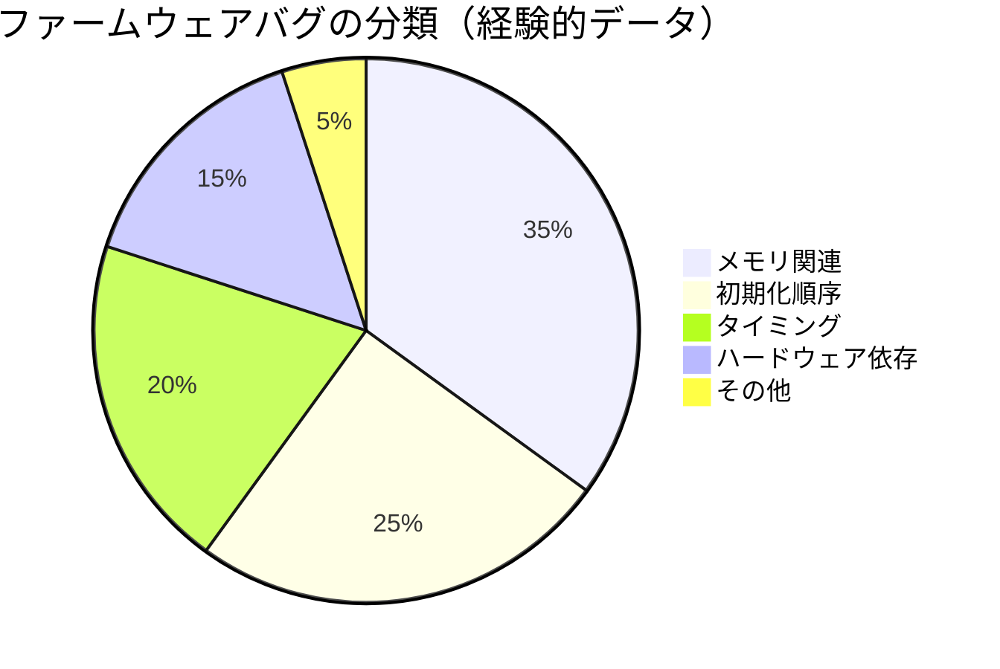
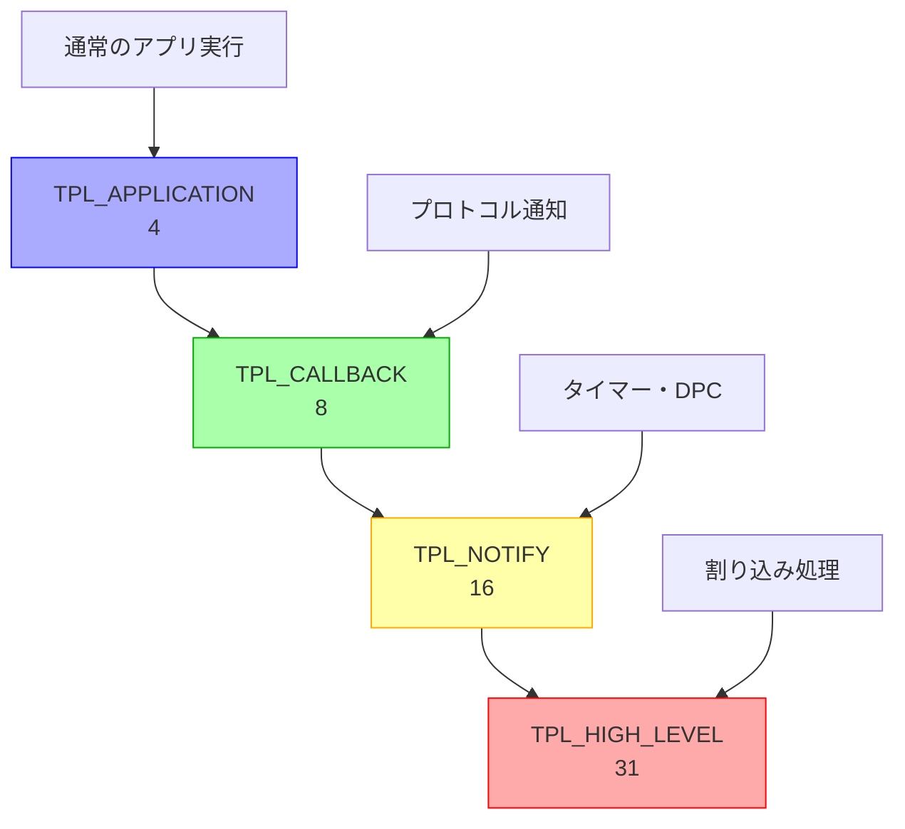
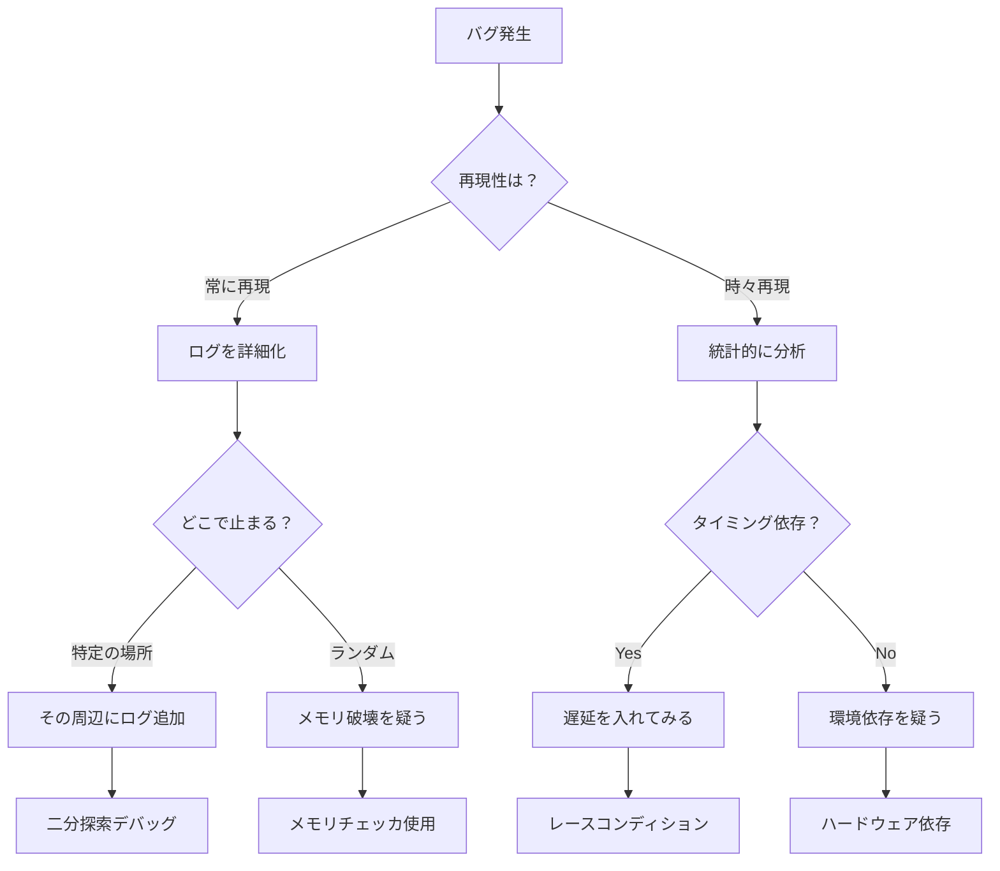

# 典型的な問題パターンと原因

🎯 **この章で学ぶこと**
- ファームウェア開発で頻繁に発生する問題パターン
- メモリ関連の問題の診断と解決
- タイミング依存バグの特定方法
- 初期化順序の問題と対策
- ハードウェア依存の問題の切り分け

📚 **前提知識**
- [ファームウェアデバッグの基礎](01-debug-fundamentals.md)
- [デバッグツールの仕組み](02-debug-tools-mechanism.md)

---

## 問題パターンの分類

ファームウェアのバグは、いくつかの典型的なパターンに分類できます。

### 問題の分類と頻度



### 問題発見の難易度

| 問題タイプ | 発見難易度 | 再現性 | デバッグ時間 |
|----------|----------|--------|------------|
| **NULL ポインタ参照** | 低 | 高 | 短 |
| **メモリリーク** | 中 | 中 | 中 |
| **Use-After-Free** | 高 | 低 | 長 |
| **初期化順序** | 中 | 高 | 中 |
| **レースコンディション** | 高 | 低 | 長 |
| **ハードウェアタイミング** | 高 | 低 | 長 |

---

## メモリ関連の問題

### 問題 1: NULL ポインタ参照

最も頻繁に発生するバグの一つです。

#### 典型的なケース

```c
// 悪い例: NULL チェックなし
EFI_STATUS
BadFunction (
  VOID
  )
{
  EFI_SIMPLE_FILE_SYSTEM_PROTOCOL  *Fs;
  EFI_STATUS                       Status;

  Status = gBS->LocateProtocol(
    &gEfiSimpleFileSystemProtocolGuid,
    NULL,
    (VOID **)&Fs
  );

  // Status チェックなしでポインタを使用
  Status = Fs->OpenVolume(Fs, &Root);  // Fs が NULL の可能性

  return Status;
}

// クラッシュ時の症状
// - Page Fault (0x0E) 例外
// - RIP が NULL 付近のアドレス
// - 即座にシステムハング
```

#### 修正方法

```c
// 良い例: 適切な NULL チェック
EFI_STATUS
GoodFunction (
  VOID
  )
{
  EFI_SIMPLE_FILE_SYSTEM_PROTOCOL  *Fs;
  EFI_STATUS                       Status;

  Status = gBS->LocateProtocol(
    &gEfiSimpleFileSystemProtocolGuid,
    NULL,
    (VOID **)&Fs
  );
  if (EFI_ERROR(Status)) {
    DEBUG((DEBUG_ERROR, "LocateProtocol failed: %r\n", Status));
    return Status;
  }

  // NULL チェック（念のため）
  if (Fs == NULL) {
    DEBUG((DEBUG_ERROR, "Fs is NULL\n"));
    return EFI_NOT_FOUND;
  }

  // ポインタの妥当性チェック
  ASSERT(Fs != NULL);

  Status = Fs->OpenVolume(Fs, &Root);
  if (EFI_ERROR(Status)) {
    DEBUG((DEBUG_ERROR, "OpenVolume failed: %r\n", Status));
    return Status;
  }

  return EFI_SUCCESS;
}
```

#### デバッグ方法

```bash
# GDB でのデバッグ
(gdb) info registers
rax            0x0                 0
rip            0x7f801234          0x7f801234

(gdb) x/i $rip
=> 0x7f801234:  mov    (%rax),%rbx  # RAX (NULL) からロード → クラッシュ

(gdb) backtrace
#0  0x00007f801234 in BadFunction () at Driver.c:45
#1  0x00007f801456 in DriverEntry () at Driver.c:100

(gdb) frame 0
#0  0x00007f801234 in BadFunction () at Driver.c:45
45        Status = Fs->OpenVolume(Fs, &Root);

(gdb) print Fs
$1 = (EFI_SIMPLE_FILE_SYSTEM_PROTOCOL *) 0x0  # NULL!
```

### 問題 2: バッファオーバーフロー

配列の境界を超えたアクセスによる問題。

#### 典型的なケース

```c
// 悪い例: 境界チェックなし
VOID
ParseString (
  IN CHAR16  *Input
  )
{
  CHAR16  Buffer[64];
  UINTN   Index;

  // Input の長さチェックなし
  for (Index = 0; Input[Index] != L'\0'; Index++) {
    Buffer[Index] = Input[Index];  // Index が 64 を超える可能性
  }
  Buffer[Index] = L'\0';

  // Buffer がオーバーフローし、スタックが破壊される
  // → リターンアドレスが上書きされ、予期しない挙動
}

// クラッシュ時の症状
// - 関数リターン時にランダムなアドレスにジャンプ
// - スタック破壊により変数値が異常
// - セキュリティ脆弱性（任意コード実行）
```

#### 修正方法

```c
// 良い例: 安全な文字列操作
VOID
ParseStringSafe (
  IN CHAR16  *Input
  )
{
  CHAR16  Buffer[64];
  UINTN   InputLen;
  UINTN   CopyLen;

  if (Input == NULL) {
    return;
  }

  // 入力長を取得
  InputLen = StrLen(Input);

  // バッファサイズを考慮
  CopyLen = MIN(InputLen, ARRAY_SIZE(Buffer) - 1);

  // 安全にコピー
  StrnCpyS(Buffer, ARRAY_SIZE(Buffer), Input, CopyLen);

  // または StrCpyS を使用
  // StrCpyS(Buffer, ARRAY_SIZE(Buffer), Input);
  // → 自動的に切り詰めてくれる
}

// さらに良い例: 動的メモリ確保
EFI_STATUS
ParseStringDynamic (
  IN CHAR16  *Input
  )
{
  CHAR16  *Buffer;
  UINTN   InputLen;

  if (Input == NULL) {
    return EFI_INVALID_PARAMETER;
  }

  InputLen = StrLen(Input);

  // 必要なサイズを確保
  Buffer = AllocatePool((InputLen + 1) * sizeof(CHAR16));
  if (Buffer == NULL) {
    return EFI_OUT_OF_RESOURCES;
  }

  StrCpyS(Buffer, InputLen + 1, Input);

  // Buffer を使用
  // ...

  // 解放
  FreePool(Buffer);

  return EFI_SUCCESS;
}
```

#### 検出ツール

```c
// デバッグビルドでのガードパターン
#ifdef DEBUG_BUILD
  #define GUARD_PATTERN  0xDEADBEEF

  typedef struct {
    UINT32  GuardBefore;
    UINT8   Data[SIZE];
    UINT32  GuardAfter;
  } GUARDED_BUFFER;

  VOID CheckGuard(GUARDED_BUFFER *Buf) {
    if (Buf->GuardBefore != GUARD_PATTERN) {
      DEBUG((DEBUG_ERROR, "Buffer underflow detected!\n"));
      ASSERT(FALSE);
    }
    if (Buf->GuardAfter != GUARD_PATTERN) {
      DEBUG((DEBUG_ERROR, "Buffer overflow detected!\n"));
      ASSERT(FALSE);
    }
  }
#endif
```

### 問題 3: メモリリーク

確保したメモリを解放し忘れることで発生。

#### 典型的なケース

```c
// 悪い例: メモリリーク
EFI_STATUS
ProcessData (
  IN CHAR16  *FileName
  )
{
  VOID        *Buffer;
  EFI_STATUS  Status;

  Buffer = AllocatePool(1024);
  if (Buffer == NULL) {
    return EFI_OUT_OF_RESOURCES;
  }

  Status = ReadFile(FileName, Buffer);
  if (EFI_ERROR(Status)) {
    return Status;  // Buffer を解放せずにリターン → メモリリーク
  }

  ProcessBuffer(Buffer);

  FreePool(Buffer);  // 正常系のみ解放
  return EFI_SUCCESS;
}
```

#### 修正方法

```c
// 良い例: 確実に解放
EFI_STATUS
ProcessDataSafe (
  IN CHAR16  *FileName
  )
{
  VOID        *Buffer = NULL;
  EFI_STATUS  Status;

  Buffer = AllocatePool(1024);
  if (Buffer == NULL) {
    Status = EFI_OUT_OF_RESOURCES;
    goto Exit;
  }

  Status = ReadFile(FileName, Buffer);
  if (EFI_ERROR(Status)) {
    goto Exit;  // Exit ラベルで解放
  }

  Status = ProcessBuffer(Buffer);

Exit:
  if (Buffer != NULL) {
    FreePool(Buffer);
  }

  return Status;
}

// または RAII パターン（C++ 風）
typedef struct {
  VOID  *Ptr;
} AUTO_FREE;

VOID AutoFreeCleanup(AUTO_FREE *Obj) {
  if (Obj->Ptr != NULL) {
    FreePool(Obj->Ptr);
  }
}

#define AUTO_FREE_VAR(name) \
  AUTO_FREE name __attribute__((cleanup(AutoFreeCleanup))) = {NULL}

EFI_STATUS
ProcessDataAuto (
  IN CHAR16  *FileName
  )
{
  AUTO_FREE_VAR(AutoBuffer);
  EFI_STATUS  Status;

  AutoBuffer.Ptr = AllocatePool(1024);
  if (AutoBuffer.Ptr == NULL) {
    return EFI_OUT_OF_RESOURCES;
  }

  Status = ReadFile(FileName, AutoBuffer.Ptr);
  if (EFI_ERROR(Status)) {
    return Status;  // 自動的に解放される
  }

  return ProcessBuffer(AutoBuffer.Ptr);
  // 関数終了時に自動的に解放される
}
```

#### メモリリークの検出

```c
// メモリプール追跡機構
typedef struct {
  LIST_ENTRY  Link;
  VOID        *Address;
  UINTN       Size;
  CHAR8       *File;
  UINTN       Line;
} POOL_TRACKER;

LIST_ENTRY  gPoolTrackerList = INITIALIZE_LIST_HEAD_VARIABLE(gPoolTrackerList);

VOID*
TrackedAllocatePool (
  IN UINTN        Size,
  IN CONST CHAR8  *File,
  IN UINTN        Line
  )
{
  VOID           *Ptr;
  POOL_TRACKER   *Tracker;

  Ptr = AllocatePool(Size);
  if (Ptr == NULL) {
    return NULL;
  }

  // トラッカーを記録
  Tracker = AllocatePool(sizeof(POOL_TRACKER));
  if (Tracker != NULL) {
    Tracker->Address = Ptr;
    Tracker->Size = Size;
    Tracker->File = (CHAR8 *)File;
    Tracker->Line = Line;
    InsertTailList(&gPoolTrackerList, &Tracker->Link);
  }

  return Ptr;
}

VOID
TrackedFreePool (
  IN VOID  *Ptr
  )
{
  LIST_ENTRY     *Link;
  POOL_TRACKER   *Tracker;

  // トラッカーから削除
  for (Link = GetFirstNode(&gPoolTrackerList);
       !IsNull(&gPoolTrackerList, Link);
       Link = GetNextNode(&gPoolTrackerList, Link)) {
    Tracker = CR(Link, POOL_TRACKER, Link, POOL_TRACKER_SIGNATURE);
    if (Tracker->Address == Ptr) {
      RemoveEntryList(Link);
      FreePool(Tracker);
      break;
    }
  }

  FreePool(Ptr);
}

VOID
ReportMemoryLeaks (
  VOID
  )
{
  LIST_ENTRY     *Link;
  POOL_TRACKER   *Tracker;

  DEBUG((DEBUG_ERROR, "=== Memory Leak Report ===\n"));
  for (Link = GetFirstNode(&gPoolTrackerList);
       !IsNull(&gPoolTrackerList, Link);
       Link = GetNextNode(&gPoolTrackerList, Link)) {
    Tracker = CR(Link, POOL_TRACKER, Link, POOL_TRACKER_SIGNATURE);
    DEBUG((DEBUG_ERROR, "Leaked: %d bytes at %p (%a:%d)\n",
           Tracker->Size,
           Tracker->Address,
           Tracker->File,
           Tracker->Line));
  }
}

// マクロでラップ
#ifdef DEBUG_BUILD
  #define AllocatePool(Size) \
    TrackedAllocatePool((Size), __FILE__, __LINE__)
  #define FreePool(Ptr) \
    TrackedFreePool(Ptr)
#endif
```

---

## 初期化順序の問題

### 問題 4: プロトコル依存関係

DXE ドライバのロード順序に依存する問題。

#### 典型的なケース

```c
// ドライバ A: プロトコルを提供
EFI_STATUS
EFIAPI
DriverAEntry (
  IN EFI_HANDLE        ImageHandle,
  IN EFI_SYSTEM_TABLE  *SystemTable
  )
{
  EFI_STATUS  Status;

  // 時間のかかる初期化
  HeavyInitialization();  // 1秒かかる

  // プロトコルをインストール
  Status = gBS->InstallProtocolInterface(
    &ImageHandle,
    &gMyProtocolGuid,
    EFI_NATIVE_INTERFACE,
    &mMyProtocol
  );

  return Status;
}

// ドライバ B: プロトコルに依存
EFI_STATUS
EFIAPI
DriverBEntry (
  IN EFI_HANDLE        ImageHandle,
  IN EFI_SYSTEM_TABLE  *SystemTable
  )
{
  MY_PROTOCOL  *Protocol;
  EFI_STATUS   Status;

  // ドライバ A がまだロードされていない可能性
  Status = gBS->LocateProtocol(
    &gMyProtocolGuid,
    NULL,
    (VOID **)&Protocol
  );
  if (EFI_ERROR(Status)) {
    DEBUG((DEBUG_ERROR, "MyProtocol not found!\n"));
    return Status;  // 失敗
  }

  return EFI_SUCCESS;
}
```

#### 解決方法 1: Depex (Dependency Expression) の使用

```ini
# DriverB.inf
[Depex]
  gMyProtocolGuid  # DriverA がロードされるまで待つ
```

#### 解決方法 2: プロトコル通知の使用

```c
// ドライバ B: プロトコル通知を使用
EFI_EVENT  mProtocolNotifyEvent;

VOID
EFIAPI
MyProtocolNotify (
  IN EFI_EVENT  Event,
  IN VOID       *Context
  )
{
  MY_PROTOCOL  *Protocol;
  EFI_STATUS   Status;

  DEBUG((DEBUG_INFO, "MyProtocol is now available\n"));

  Status = gBS->LocateProtocol(
    &gMyProtocolGuid,
    NULL,
    (VOID **)&Protocol
  );
  if (!EFI_ERROR(Status)) {
    // プロトコルを使用
    UseProtocol(Protocol);
  }
}

EFI_STATUS
EFIAPI
DriverBEntry (
  IN EFI_HANDLE        ImageHandle,
  IN EFI_SYSTEM_TABLE  *SystemTable
  )
{
  VOID  *Registration;

  // プロトコルが利用可能になったら通知を受ける
  EfiCreateProtocolNotifyEvent(
    &gMyProtocolGuid,
    TPL_CALLBACK,
    MyProtocolNotify,
    NULL,
    &Registration
  );

  // すでに利用可能かチェック
  MyProtocolNotify(NULL, NULL);

  return EFI_SUCCESS;
}
```

### 問題 5: ハードウェア初期化順序

```c
// 悪い例: 初期化順序が間違っている
VOID
InitializeDevice (
  VOID
  )
{
  // 1. デバイスを有効化
  EnableDevice();

  // 2. クロックを設定（逆！）
  SetupClock();  // クロック設定前にデバイスを有効化してしまった

  // 3. DMA を設定
  SetupDma();
}

// 正しい例
VOID
InitializeDeviceCorrect (
  VOID
  )
{
  // 1. クロックを設定（最初）
  SetupClock();

  // 2. DMA を設定
  SetupDma();

  // 3. デバイスを有効化（最後）
  EnableDevice();

  // 4. 初期化完了を待つ
  WaitForDeviceReady();
}
```

---

## タイミング依存の問題

### 問題 6: レースコンディション

複数の実行パスが同じリソースにアクセスする問題。

#### 典型的なケース

```c
// グローバル変数
UINTN  gCounter = 0;

// タイマーイベント
VOID
EFIAPI
TimerHandler (
  IN EFI_EVENT  Event,
  IN VOID       *Context
  )
{
  gCounter++;  // レースコンディション！
}

// メイン処理
VOID
MainFunction (
  VOID
  )
{
  gCounter++;  // TimerHandler と競合する可能性

  if (gCounter == 1) {
    // gCounter が 2 になっている可能性
    DoSomething();
  }
}
```

#### 解決方法: TPL (Task Priority Level) の使用

```c
// 正しい例: TPL で保護
VOID
MainFunctionSafe (
  VOID
  )
{
  EFI_TPL  OldTpl;

  // TPL を上げてタイマーをブロック
  OldTpl = gBS->RaiseTPL(TPL_HIGH_LEVEL);

  gCounter++;

  if (gCounter == 1) {
    DoSomething();  // 安全にアクセス
  }

  // TPL を戻す
  gBS->RestoreTPL(OldTpl);
}
```

#### TPL レベルの理解



| TPL レベル | 用途 | 注意点 |
|-----------|------|--------|
| **TPL_APPLICATION** | 通常の実行 | すべてのイベント実行可能 |
| **TPL_CALLBACK** | プロトコル通知 | タイマーは実行される |
| **TPL_NOTIFY** | タイマー | 新しいタイマーはブロック |
| **TPL_HIGH_LEVEL** | クリティカルセクション | すべてのイベントブロック |

### 問題 7: ハードウェアタイミング

```c
// 悪い例: 待ち時間なし
VOID
ConfigureDevice (
  VOID
  )
{
  // レジスタに書き込み
  MmioWrite32(DEVICE_CONTROL, ENABLE_BIT);

  // すぐにステータス読み取り（デバイスが準備できていない）
  UINT32 Status = MmioRead32(DEVICE_STATUS);
  if ((Status & READY_BIT) == 0) {
    DEBUG((DEBUG_ERROR, "Device not ready!\n"));  // 常に失敗
  }
}

// 正しい例: 待ち時間を入れる
VOID
ConfigureDeviceCorrect (
  VOID
  )
{
  UINTN  Timeout;

  // レジスタに書き込み
  MmioWrite32(DEVICE_CONTROL, ENABLE_BIT);

  // ハードウェアの準備を待つ
  Timeout = 1000;  // 1000 回試行
  while (Timeout > 0) {
    UINT32 Status = MmioRead32(DEVICE_STATUS);
    if (Status & READY_BIT) {
      break;  // 準備完了
    }
    MicroSecondDelay(10);  // 10 マイクロ秒待つ
    Timeout--;
  }

  if (Timeout == 0) {
    DEBUG((DEBUG_ERROR, "Device timeout!\n"));
  }
}
```

---

## ハードウェア依存の問題

### 問題 8: エンディアンの違い

```c
// 悪い例: エンディアンを考慮していない
typedef struct {
  UINT16  VendorId;
  UINT16  DeviceId;
  UINT32  Command;
} PCI_CONFIG;

VOID
ReadPciConfig (
  OUT PCI_CONFIG  *Config
  )
{
  // リトルエンディアンを前提（x86/x64 では動作）
  *(UINT32 *)Config = MmioRead32(PCI_CONFIG_ADDRESS);

  // ビッグエンディアンでは VendorId と DeviceId が逆になる
}

// 正しい例: エンディアン変換
VOID
ReadPciConfigSafe (
  OUT PCI_CONFIG  *Config
  )
{
  UINT32  Raw;

  Raw = MmioRead32(PCI_CONFIG_ADDRESS);

  // エンディアン変換
  Config->VendorId = (UINT16)(Raw & 0xFFFF);
  Config->DeviceId = (UINT16)((Raw >> 16) & 0xFFFF);

  // または SwapBytes16/32 を使用
  #ifdef BIG_ENDIAN
    Config->VendorId = SwapBytes16(Config->VendorId);
    Config->DeviceId = SwapBytes16(Config->DeviceId);
  #endif
}
```

### 問題 9: キャッシュの影響

```c
// DMA バッファの問題
VOID
DmaTransfer (
  VOID
  )
{
  UINT8  *Buffer;

  // バッファを確保
  Buffer = AllocatePool(4096);

  // バッファに書き込み
  SetMem(Buffer, 4096, 0xAA);

  // DMA 転送を開始
  MmioWrite32(DMA_SOURCE, (UINT32)(UINTN)Buffer);
  MmioWrite32(DMA_LENGTH, 4096);
  MmioWrite32(DMA_CONTROL, DMA_START);

  // 問題: キャッシュがフラッシュされていない
  // → DMA コントローラは古いデータを読む
}

// 正しい例: キャッシュを考慮
VOID
DmaTransferCorrect (
  VOID
  )
{
  VOID   *Buffer;
  VOID   *Mapping;
  UINTN  NumberOfBytes;

  NumberOfBytes = 4096;

  // DMA 用バッファを確保（キャッシュ不可領域）
  PciIo->AllocateBuffer(
    PciIo,
    AllocateAnyPages,
    EfiBootServicesData,
    EFI_SIZE_TO_PAGES(NumberOfBytes),
    &Buffer,
    0
  );

  SetMem(Buffer, NumberOfBytes, 0xAA);

  // DMA マッピング
  PciIo->Map(
    PciIo,
    EfiPciIoOperationBusMasterRead,
    Buffer,
    &NumberOfBytes,
    &DeviceAddress,
    &Mapping
  );

  // DMA 転送
  MmioWrite32(DMA_SOURCE, (UINT32)DeviceAddress);
  MmioWrite32(DMA_LENGTH, NumberOfBytes);
  MmioWrite32(DMA_CONTROL, DMA_START);

  // 転送完了を待つ
  WaitForDmaComplete();

  // アンマップ
  PciIo->Unmap(PciIo, Mapping);

  // バッファ解放
  PciIo->FreeBuffer(
    PciIo,
    EFI_SIZE_TO_PAGES(NumberOfBytes),
    Buffer
  );
}
```

---

## デバッグ戦略

### 問題切り分けのフローチャート



### 二分探索デバッグ

```c
// 問題のある関数
EFI_STATUS
ProblematicFunction (
  VOID
  )
{
  Step1();
  Step2();
  Step3();
  Step4();
  Step5();
  Step6();
  // どこかでハングする
}

// 二分探索でログを追加
EFI_STATUS
ProblematicFunctionDebug (
  VOID
  )
{
  DEBUG((DEBUG_ERROR, "Start\n"));

  Step1();
  Step2();
  Step3();

  DEBUG((DEBUG_ERROR, "Checkpoint 1\n"));  // ここまで実行されるか？

  Step4();
  Step5();
  Step6();

  DEBUG((DEBUG_ERROR, "End\n"));
}

// Checkpoint 1 が出力される → Step4-6 に問題
// Checkpoint 1 が出力されない → Step1-3 に問題

// さらに絞り込み
EFI_STATUS
ProblematicFunctionDebug2 (
  VOID
  )
{
  DEBUG((DEBUG_ERROR, "Start\n"));

  Step1();
  DEBUG((DEBUG_ERROR, "After Step1\n"));

  Step2();
  DEBUG((DEBUG_ERROR, "After Step2\n"));

  Step3();
  DEBUG((DEBUG_ERROR, "After Step3\n"));

  // ...
}
```

---

## 💻 演習

### 演習 1: メモリリークの検出

以下のコードからメモリリークを見つけ、修正してください。

```c
EFI_STATUS
ProcessFiles (
  IN CHAR16  **FileNames,
  IN UINTN   FileCount
  )
{
  UINTN       Index;
  VOID        *Buffer;
  EFI_STATUS  Status;

  for (Index = 0; Index < FileCount; Index++) {
    Buffer = AllocatePool(4096);
    if (Buffer == NULL) {
      return EFI_OUT_OF_RESOURCES;
    }

    Status = ReadFile(FileNames[Index], Buffer);
    if (EFI_ERROR(Status)) {
      continue;  // 問題: Buffer が解放されない
    }

    ProcessBuffer(Buffer);

    FreePool(Buffer);
  }

  return EFI_SUCCESS;
}
```

### 演習 2: レースコンディションの修正

以下のコードのレースコンディションを修正してください。

```c
GLOBAL REMOVE_IF_UNREFERENCED UINTN  gSharedCounter = 0;

VOID
EFIAPI
TimerCallback (
  IN EFI_EVENT  Event,
  IN VOID       *Context
  )
{
  gSharedCounter++;
}

VOID
MainTask (
  VOID
  )
{
  if (gSharedCounter < 10) {
    gSharedCounter++;
    DoSomething();
  }
}
```

### 演習 3: 初期化順序の問題

2つのドライバがあります。依存関係を正しく設定してください。

```
DriverA: MyProtocol を提供
DriverB: MyProtocol に依存
```

DriverB.inf に適切な Depex を追加してください。

---

## まとめ

本章では、ファームウェア開発で頻繁に遭遇する問題パターンと解決策を学びました。

### 重要な教訓

| 問題カテゴリ | 予防策 | 検出方法 |
|------------|--------|---------|
| **NULL ポインタ** | ASSERT, 入力検証 | Page Fault 例外 |
| **バッファオーバーフロー** | 境界チェック, 安全な文字列関数 | ガードパターン |
| **メモリリーク** | goto Exit パターン, RAII | メモリトラッカー |
| **初期化順序** | Depex, プロトコル通知 | ログ解析 |
| **レースコンディション** | TPL 制御 | 統計的テスト |
| **ハードウェアタイミング** | タイムアウト, 遅延 | オシロスコープ |

### デバッグのベストプラクティス

1. **ログを惜しまない**: 問題が起きている箇所は詳細にログを出力
2. **ASSERT を活用**: 前提条件を明示的にチェック
3. **段階的デバッグ**: 二分探索で問題箇所を絞り込む
4. **再現性の確保**: 同じ条件で何度も再現できるようにする
5. **コードレビュー**: 典型的な問題パターンを知っている人にレビューしてもらう

---

次章では、ログとトレースの設計について、効果的なデバッグログの書き方を学びます。

📚 **参考資料**
- [EDK II C Coding Standards](https://github.com/tianocore/tianocore.github.io/wiki/Code-Style-C)
- [UEFI Specification - Memory Allocation Services](https://uefi.org/specs/UEFI/2.10/)
- [Common Firmware Vulnerabilities](https://nvd.nist.gov/)
