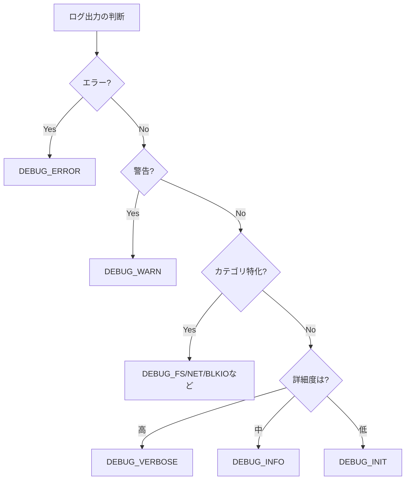

# ログとトレースの設計

🎯 **この章で学ぶこと**
- 効果的なデバッグログの設計原則
- ログレベルの適切な使い分け
- トレース機構の実装技術
- ロギングのパフォーマンスへの影響
- ログ解析ツールの活用

📚 **前提知識**
- [ファームウェアデバッグの基礎](./01-debug-fundamentals.md)
- [デバッグツールの仕組み](./02-debug-tools-mechanism.md)
- C言語の基本的な知識

---

## イントロダクション

ログとトレースは、ファームウェアデバッグにおける最も基本的かつ強力なツールです。シリアルポート経由のログ出力は、前章までで学んだ通り、ファームウェアの実行状況を外部に伝える主要な手段ですが、効果的なログを設計するには、**ログレベルの適切な使い分け**、**構造化されたログフォーマット**、**パフォーマンスへの影響の最小化**、**セキュリティへの配慮**といった多くの要素を考慮する必要があります。本章では、デバッグログとトレースの設計原則から、実装技術、パフォーマンス最適化、ログ解析ツールの活用まで、ファームウェアログ設計の全体像を詳細に解説します。

**ログの目的**は、開発フェーズや対象者によって異なります。開発時のデバッグでは、詳細な情報とソースコード位置が必要であり、すべての関数呼び出しや変数の値を記録することが有益です。一方、製品デバッグ（フィールドでの問題調査）では、問題特定に必要な情報のみを記録し、過度な詳細は避けます。セキュリティ監査では、ログの改ざん防止と完全性保証が重要であり、ログに署名やチェックサムを付与します。パフォーマンス分析では、タイムスタンプと実行時間が必要であり、各処理にかかった時間を正確に測定します。これらの異なる目的を満たすため、ログは**多層的なレベル設計**を採用し、実行時に必要なログレベルのみを出力できるようにします。

**ログレベル**は、ログの重要度と詳細度を制御する仕組みです。EDK II では、`DEBUG_ERROR`（エラー）、`DEBUG_WARN`（警告）、`DEBUG_INFO`（一般情報）、`DEBUG_VERBOSE`（詳細情報）といった標準的なレベルに加え、`DEBUG_FS`（ファイルシステム）、`DEBUG_NET`（ネットワーク）、`DEBUG_BLKIO`（ブロック I/O）といったカテゴリ特化型のレベルも定義されています。開発者は、PCD（Platform Configuration Database）で有効化するログレベルを指定でき、`PcdDebugPrintErrorLevel` を設定することで、実行時に出力されるログをフィルタリングします。例えば、`0x80000042`（DEBUG_ERROR | DEBUG_WARN | DEBUG_INFO）と設定すれば、エラー・警告・一般情報のみが出力され、詳細情報（DEBUG_VERBOSE）は抑制されます。この仕組みにより、ログのオーバーヘッドを最小限に抑えつつ、必要な情報を確実に取得できます。

**ログフォーマットの統一**は、ログ解析の効率化に不可欠です。プロジェクト全体で統一されたフォーマット（例: `[モジュール名] レベル: メッセージ`）を使用することで、ログパーサーが自動的にログを構造化し、モジュール名、ログレベル、タイムスタンプ、メッセージ本文を抽出できます。これにより、特定のモジュールのエラーのみを抽出したり、タイムスタンプから処理時間を計算したり、ログレベルごとに集計したりすることが容易になります。また、ログメッセージには**コンテキスト情報**（関数名、行番号、変数名、値）を含め、「Error」のような曖昧なメッセージではなく、「Failed to allocate 4096 bytes: Out of Resources」のように具体的な情報を記録します。

**トレース機構**は、関数呼び出しの流れを記録し、プログラムの実行フローを可視化します。関数の開始時と終了時に `TRACE_ENTER("FunctionName")` と `TRACE_EXIT("FunctionName")` を呼び出すことで、呼び出し階層（コールグラフ）と各関数の実行時間を記録できます。トレースログは、インデント付きで出力することで、呼び出しの深さを視覚的に表現します。例えば、`>> PlatformInit` → `  >> ChipsetInit` → `    >> PciInit` → `    << PciInit (10ms)` → `  << ChipsetInit (15ms)` → `<< PlatformInit (20ms)` のように、階層構造と実行時間が一目でわかります。トレースログは、パフォーマンスボトルネックの特定や、予期しない関数呼び出しの検出に非常に有効です。

**ログのパフォーマンスへの影響**は、無視できない問題です。シリアルポート（通常 115200 bps）への出力は非常に遅く、1 文字あたり約 87 マイクロ秒かかります。100 文字のログメッセージを出力すると、約 8.7 ミリ秒を消費します。この遅延が積み重なると、ブート時間が数秒から数十秒延びることがあります。対策として、**条件付きコンパイル**でリリースビルドではログを完全に削除したり、**バッファリング**で複数のログをまとめてから出力したり、**非同期ログ**でログ出力を別のタスクで行ったり、**ログレベルフィルタリング**で不要なログを実行時に抑制したりします。また、ログ出力先を**メモリバッファ**や **SPI Flash** に変更し、シリアルポートの遅延を回避することも有効です。

**セキュリティへの配慮**も重要です。ログには機密情報（パスワード、暗号化鍵、個人情報）が含まれることがあるため、出力前に**マスキング**（例: `Password: ********`）を行います。また、攻撃者がログを改ざんして証拠を隠滅することを防ぐため、ログに**チェックサムや署名**を付与し、完全性を保証します。さらに、ログのサイズが過度に大きくなることを防ぐため、**ローテーション**（古いログを削除）や **圧縮** を実装します。

本章では、これらのログとトレースの設計原則と実装技術を、具体的なコード例とともに詳しく解説します。これにより、効果的なデバッグログを設計し、ファームウェアの開発効率とデバッグ能力を大幅に向上させることができます。

---

## 1. ログの基本設計

### 1.1 ログの目的と要件

ファームウェアのログには複数の目的があります：

| 目的 | 対象者 | 要件 |
|------|--------|------|
| **開発時デバッグ** | 開発者 | 詳細な情報、ソースコード位置 |
| **製品デバッグ** | サポート | 問題特定に必要な情報のみ |
| **セキュリティ監査** | セキュリティ担当 | 改ざん防止、完全性保証 |
| **パフォーマンス分析** | 最適化担当 | タイムスタンプ、実行時間 |

### 1.2 ログレベルの設計

EDK IIでは標準的なログレベルが定義されています：

```c
// MdePkg/Include/Library/DebugLib.h

#define DEBUG_INIT      0x00000001  // 初期化
#define DEBUG_WARN      0x00000002  // 警告
#define DEBUG_LOAD      0x00000004  // モジュールロード
#define DEBUG_FS        0x00000008  // ファイルシステム
#define DEBUG_POOL      0x00000010  // メモリプール
#define DEBUG_PAGE      0x00000020  // ページアロケーション
#define DEBUG_INFO      0x00000040  // 一般情報
#define DEBUG_DISPATCH  0x00000080  // PEI/DXE ディスパッチ
#define DEBUG_VARIABLE  0x00000100  // 変数サービス
#define DEBUG_BM        0x00000400  // ブートマネージャ
#define DEBUG_BLKIO     0x00001000  // ブロックI/O
#define DEBUG_NET       0x00004000  // ネットワーク
#define DEBUG_UNDI      0x00010000  // UNDI
#define DEBUG_LOADFILE  0x00020000  // LoadFile
#define DEBUG_EVENT     0x00080000  // イベント
#define DEBUG_GCD       0x00100000  // GCD（Global Coherency Domain）
#define DEBUG_CACHE     0x00200000  // キャッシュ
#define DEBUG_VERBOSE   0x00400000  // 詳細情報
#define DEBUG_ERROR     0x80000000  // エラー

// 複合マスク
#define DEBUG_ALL       0xFFFFFFFF
```

#### ログレベルの使い分け指針



### 1.3 効果的なログメッセージの書き方

#### ❌ 悪い例

```c
// 情報が不足している
DEBUG((DEBUG_INFO, "Error\n"));

// コンテキストがない
DEBUG((DEBUG_INFO, "Value: %d\n", Value));

// 冗長すぎる
DEBUG((DEBUG_VERBOSE, "Entering function FooBar at line 123 in file Foo.c\n"));
DEBUG((DEBUG_VERBOSE, "Parameter1 = %p\n", Param1));
DEBUG((DEBUG_VERBOSE, "Parameter2 = %d\n", Param2));
DEBUG((DEBUG_VERBOSE, "Parameter3 = %s\n", Param3));
```

#### ✅ 良い例

```c
// エラー時は原因と影響を明確に
if (EFI_ERROR(Status)) {
  DEBUG((DEBUG_ERROR, "Failed to allocate %lu bytes: %r\n",
         Size, Status));
  return Status;
}

// コンテキストと意味を含める
DEBUG((DEBUG_INFO, "USB Device detected: VID=0x%04x PID=0x%04x\n",
       VendorId, ProductId));

// 重要なタイミングのみ記録
DEBUG((DEBUG_INIT, "Platform Init: Chipset=%a PCH=%a\n",
       ChipsetName, PchName));
```

### 1.4 ログフォーマットの統一

プロジェクト全体で統一されたフォーマットを使用します：

```c
// ログフォーマット標準
// [モジュール名] レベル: メッセージ

#define LOG_MODULE_NAME  "UsbCore"

#define USB_LOG_ERROR(fmt, ...)   \
  DEBUG((DEBUG_ERROR, "[%a] ERROR: " fmt "\n", LOG_MODULE_NAME, ##__VA_ARGS__))

#define USB_LOG_WARN(fmt, ...)    \
  DEBUG((DEBUG_WARN,  "[%a] WARN:  " fmt "\n", LOG_MODULE_NAME, ##__VA_ARGS__))

#define USB_LOG_INFO(fmt, ...)    \
  DEBUG((DEBUG_INFO,  "[%a] INFO:  " fmt "\n", LOG_MODULE_NAME, ##__VA_ARGS__))

// 使用例
USB_LOG_ERROR("Device enumeration failed: %r", Status);
USB_LOG_INFO("Device configured: Class=0x%02x SubClass=0x%02x",
             DeviceClass, DeviceSubClass);
```

出力例：
```
[UsbCore] ERROR: Device enumeration failed: Not Ready
[UsbCore] INFO: Device configured: Class=0x08 SubClass=0x06
```

---

## 2. ログ実装の詳細

### 2.1 DebugLib の内部実装

#### シリアル出力への変換

```c
// MdePkg/Library/BaseDebugLibSerialPort/DebugLib.c

VOID
EFIAPI
DebugPrint (
  IN  UINTN        ErrorLevel,
  IN  CONST CHAR8  *Format,
  ...
  )
{
  CHAR8    Buffer[MAX_DEBUG_MESSAGE_LENGTH];
  VA_LIST  Marker;

  // 1. ログレベルのフィルタリング
  if ((ErrorLevel & PcdGet32(PcdDebugPrintErrorLevel)) == 0) {
    return;  // このレベルは無効
  }

  // 2. 可変長引数の処理
  VA_START(Marker, Format);
  AsciiVSPrint(Buffer, sizeof(Buffer), Format, Marker);
  VA_END(Marker);

  // 3. シリアルポートへ出力
  SerialPortWrite((UINT8 *)Buffer, AsciiStrLen(Buffer));
}
```

#### ログレベルの動的制御

```c
// PCD（Platform Configuration Database）で制御

[PcdsFixedAtBuild]
  # ビルド時固定
  gEfiMdePkgTokenSpaceGuid.PcdDebugPrintErrorLevel|0x80000042

[PcdsDynamic]
  # 実行時変更可能
  gEfiMdePkgTokenSpaceGuid.PcdDebugPrintErrorLevel|0x80000042

// 実行時のログレベル変更
EFI_STATUS SetDebugLevel (UINT32 NewLevel)
{
  return PcdSet32S(PcdDebugPrintErrorLevel, NewLevel);
}
```

### 2.2 カスタムログバックエンドの実装

#### メモリバッファへのログ保存

```c
// ログをメモリバッファに保存
#define LOG_BUFFER_SIZE  (256 * 1024)  // 256KB

typedef struct {
  UINT32  WriteOffset;
  UINT32  ReadOffset;
  UINT32  BufferSize;
  BOOLEAN Overflow;
  UINT8   Data[LOG_BUFFER_SIZE];
} LOG_BUFFER;

STATIC LOG_BUFFER  gLogBuffer = {
  .WriteOffset = 0,
  .ReadOffset  = 0,
  .BufferSize  = LOG_BUFFER_SIZE,
  .Overflow    = FALSE,
};

VOID LogToBuffer (
  IN CONST CHAR8  *Message,
  IN UINTN        Length
  )
{
  UINTN  Available;
  UINTN  ToCopy;

  // リングバッファとして実装
  Available = gLogBuffer.BufferSize - gLogBuffer.WriteOffset;

  if (Length > Available) {
    // バッファをラップアラウンド
    ToCopy = Available;
    CopyMem(&gLogBuffer.Data[gLogBuffer.WriteOffset], Message, ToCopy);

    // 残りを先頭から書き込み
    CopyMem(&gLogBuffer.Data[0], Message + ToCopy, Length - ToCopy);
    gLogBuffer.WriteOffset = Length - ToCopy;
    gLogBuffer.Overflow = TRUE;
  } else {
    CopyMem(&gLogBuffer.Data[gLogBuffer.WriteOffset], Message, Length);
    gLogBuffer.WriteOffset += Length;
  }
}
```

#### フラッシュメモリへの永続化

```c
// SPI Flash の専用領域にログを保存

#define LOG_FLASH_BASE  0xFFF00000  // 1MB領域
#define LOG_FLASH_SIZE  0x00100000

typedef struct {
  UINT32  Signature;     // 'FWLG'
  UINT32  Version;
  UINT32  LogSize;
  UINT32  Checksum;
  UINT8   LogData[];
} FLASH_LOG_HEADER;

EFI_STATUS FlushLogToFlash (VOID)
{
  FLASH_LOG_HEADER  *Header;
  UINTN             TotalSize;
  EFI_STATUS        Status;

  TotalSize = sizeof(FLASH_LOG_HEADER) + gLogBuffer.WriteOffset;

  Header = AllocatePool(TotalSize);
  if (Header == NULL) {
    return EFI_OUT_OF_RESOURCES;
  }

  Header->Signature = SIGNATURE_32('F', 'W', 'L', 'G');
  Header->Version   = 1;
  Header->LogSize   = gLogBuffer.WriteOffset;

  CopyMem(Header->LogData, gLogBuffer.Data, gLogBuffer.WriteOffset);

  // チェックサム計算
  Header->Checksum = CalculateCrc32((UINT8 *)Header, TotalSize);

  // SPI Flash へ書き込み
  Status = SpiFlashErase(LOG_FLASH_BASE, LOG_FLASH_SIZE);
  if (EFI_ERROR(Status)) {
    FreePool(Header);
    return Status;
  }

  Status = SpiFlashWrite(LOG_FLASH_BASE, Header, TotalSize);

  FreePool(Header);
  return Status;
}
```

### 2.3 タイムスタンプの追加

```c
// 高精度タイマを使用したタイムスタンプ

UINT64 GetTimestampUs (VOID)
{
  UINT64  Frequency;
  UINT64  CurrentTick;

  Frequency   = GetPerformanceCounterProperties(NULL, NULL);
  CurrentTick = GetPerformanceCounter();

  // マイクロ秒に変換
  return DivU64x64Remainder(
           MultU64x32(CurrentTick, 1000000),
           Frequency,
           NULL
         );
}

VOID DebugPrintWithTimestamp (
  IN  UINTN        ErrorLevel,
  IN  CONST CHAR8  *Format,
  ...
  )
{
  CHAR8    Buffer[MAX_DEBUG_MESSAGE_LENGTH];
  CHAR8    TimestampedBuffer[MAX_DEBUG_MESSAGE_LENGTH + 32];
  VA_LIST  Marker;
  UINT64   Timestamp;

  if ((ErrorLevel & PcdGet32(PcdDebugPrintErrorLevel)) == 0) {
    return;
  }

  VA_START(Marker, Format);
  AsciiVSPrint(Buffer, sizeof(Buffer), Format, Marker);
  VA_END(Marker);

  Timestamp = GetTimestampUs();

  // [時間] メッセージ の形式
  AsciiSPrint(
    TimestampedBuffer,
    sizeof(TimestampedBuffer),
    "[%10lu.%06lu] %a",
    (UINTN)(Timestamp / 1000000),      // 秒
    (UINTN)(Timestamp % 1000000),      // マイクロ秒
    Buffer
  );

  SerialPortWrite(
    (UINT8 *)TimestampedBuffer,
    AsciiStrLen(TimestampedBuffer)
  );
}
```

出力例：
```
[         0.000123] Platform Init started
[         0.045678] Memory initialized: 4096 MB
[         0.123456] PCI enumeration complete
```

---

## 3. トレースの実装

### 3.1 関数トレースの基本

#### マクロベースの実装

```c
// FunctionTracer.h

extern UINTN gTraceDepth;

#define TRACE_ENTRY()  \
  do { \
    DEBUG((DEBUG_VERBOSE, "%*a>> %a() [%a:%d]\n", \
           (UINT32)gTraceDepth * 2, "", __FUNCTION__, __FILE__, __LINE__)); \
    gTraceDepth++; \
  } while (0)

#define TRACE_EXIT()  \
  do { \
    gTraceDepth--; \
    DEBUG((DEBUG_VERBOSE, "%*a<< %a()\n", \
           (UINT32)gTraceDepth * 2, "", __FUNCTION__)); \
  } while (0)

#define TRACE_EXIT_STATUS(Status)  \
  do { \
    gTraceDepth--; \
    DEBUG((DEBUG_VERBOSE, "%*a<< %a() = %r\n", \
           (UINT32)gTraceDepth * 2, "", __FUNCTION__, Status)); \
  } while (0)

// 使用例
EFI_STATUS
EFIAPI
InitializeUsbHost (
  IN EFI_HANDLE        ImageHandle,
  IN EFI_SYSTEM_TABLE  *SystemTable
  )
{
  EFI_STATUS  Status;

  TRACE_ENTRY();

  Status = RegisterUsbProtocols();
  if (EFI_ERROR(Status)) {
    TRACE_EXIT_STATUS(Status);
    return Status;
  }

  Status = StartUsbControllers();

  TRACE_EXIT_STATUS(Status);
  return Status;
}
```

出力例：
```
>> InitializeUsbHost() [UsbHost.c:123]
  >> RegisterUsbProtocols() [UsbProtocol.c:45]
  << RegisterUsbProtocols() = Success
  >> StartUsbControllers() [UsbController.c:67]
    >> ResetController() [UsbHw.c:89]
    << ResetController() = Success
  << StartUsbControllers() = Success
<< InitializeUsbHost() = Success
```

### 3.2 イベントトレース

#### 構造化イベントログ

```c
// イベントの種類
typedef enum {
  TraceEventFunctionEntry,
  TraceEventFunctionExit,
  TraceEventMemoryAlloc,
  TraceEventMemoryFree,
  TraceEventProtocolInstall,
  TraceEventProtocolUninstall,
  TraceEventTimerExpired,
  TraceEventInterrupt,
} TRACE_EVENT_TYPE;

// イベントレコード
typedef struct {
  UINT64             Timestamp;
  TRACE_EVENT_TYPE   Type;
  UINT32             ThreadId;  // SMM/DXEなど
  CONST CHAR8        *FunctionName;
  UINTN              Arg1;
  UINTN              Arg2;
} TRACE_EVENT;

#define MAX_TRACE_EVENTS  10000

STATIC TRACE_EVENT  gTraceEvents[MAX_TRACE_EVENTS];
STATIC UINTN        gTraceEventCount = 0;

VOID RecordTraceEvent (
  IN TRACE_EVENT_TYPE  Type,
  IN CONST CHAR8       *FunctionName,
  IN UINTN             Arg1,
  IN UINTN             Arg2
  )
{
  TRACE_EVENT  *Event;

  if (gTraceEventCount >= MAX_TRACE_EVENTS) {
    return;  // バッファフル
  }

  Event = &gTraceEvents[gTraceEventCount++];

  Event->Timestamp    = GetTimestampUs();
  Event->Type         = Type;
  Event->ThreadId     = GetCurrentThreadId();
  Event->FunctionName = FunctionName;
  Event->Arg1         = Arg1;
  Event->Arg2         = Arg2;
}

// マクロで簡潔に
#define TRACE_FUNC_ENTRY()  \
  RecordTraceEvent(TraceEventFunctionEntry, __FUNCTION__, 0, 0)

#define TRACE_FUNC_EXIT()  \
  RecordTraceEvent(TraceEventFunctionExit, __FUNCTION__, 0, 0)

#define TRACE_ALLOC(Ptr, Size)  \
  RecordTraceEvent(TraceEventMemoryAlloc, __FUNCTION__, (UINTN)Ptr, Size)

#define TRACE_FREE(Ptr)  \
  RecordTraceEvent(TraceEventMemoryFree, __FUNCTION__, (UINTN)Ptr, 0)
```

#### トレースデータのダンプ

```c
VOID DumpTraceEvents (VOID)
{
  UINTN        Index;
  TRACE_EVENT  *Event;
  CONST CHAR8  *TypeStr;

  DEBUG((DEBUG_INFO, "=== Trace Events (%lu entries) ===\n", gTraceEventCount));

  for (Index = 0; Index < gTraceEventCount; Index++) {
    Event = &gTraceEvents[Index];

    switch (Event->Type) {
      case TraceEventFunctionEntry:
        TypeStr = "ENTRY";
        break;
      case TraceEventFunctionExit:
        TypeStr = "EXIT ";
        break;
      case TraceEventMemoryAlloc:
        TypeStr = "ALLOC";
        break;
      case TraceEventMemoryFree:
        TypeStr = "FREE ";
        break;
      default:
        TypeStr = "OTHER";
        break;
    }

    DEBUG((DEBUG_INFO, "[%10lu.%06lu] %a %-20a Arg1=0x%lx Arg2=0x%lx\n",
           (UINTN)(Event->Timestamp / 1000000),
           (UINTN)(Event->Timestamp % 1000000),
           TypeStr,
           Event->FunctionName,
           Event->Arg1,
           Event->Arg2));
  }
}
```

### 3.3 コールグラフの生成

#### トレースデータからの可視化

Python スクリプトでコールグラフを生成：

```python
#!/usr/bin/env python3
import sys
import re
from graphviz import Digraph

def parse_trace_log(filename):
    """トレースログをパースして関数呼び出しグラフを作成"""
    call_stack = []
    call_graph = {}

    with open(filename, 'r') as f:
        for line in f:
            # [timestamp] >> FunctionName() 形式を解析
            match_entry = re.match(r'\[.*?\] (\s*)>> (\w+)\(\)', line)
            match_exit = re.match(r'\[.*?\] (\s*)<< (\w+)\(\)', line)

            if match_entry:
                depth = len(match_entry.group(1)) // 2
                func_name = match_entry.group(2)

                # 呼び出し元を記録
                if call_stack:
                    caller = call_stack[-1]
                    if caller not in call_graph:
                        call_graph[caller] = set()
                    call_graph[caller].add(func_name)

                call_stack.append(func_name)

            elif match_exit:
                if call_stack:
                    call_stack.pop()

    return call_graph

def generate_callgraph(call_graph, output_file):
    """Graphviz形式でコールグラフを出力"""
    dot = Digraph(comment='Function Call Graph')
    dot.attr(rankdir='LR')

    # ノードとエッジを追加
    for caller, callees in call_graph.items():
        for callee in callees:
            dot.edge(caller, callee)

    # ファイル出力
    dot.render(output_file, format='png')
    print(f"Call graph saved to {output_file}.png")

if __name__ == '__main__':
    if len(sys.argv) != 2:
        print(f"Usage: {sys.argv[0]} <trace_log_file>")
        sys.exit(1)

    trace_file = sys.argv[1]
    call_graph = parse_trace_log(trace_file)
    generate_callgraph(call_graph, 'callgraph')
```

実行：
```bash
# トレースログを取得
qemu-system-x86_64 ... -debugcon file:trace.log

# コールグラフ生成
python3 generate_callgraph.py trace.log

# 画像を確認
xdg-open callgraph.png
```

---

## 4. パフォーマンス考慮事項

### 4.1 ログのオーバーヘッド測定

```c
// ログ出力のコスト測定

VOID MeasureLogOverhead (VOID)
{
  UINT64  Start, End;
  UINTN   Iterations = 10000;
  UINTN   Index;

  // ケース1: ログなし
  Start = GetTimestampUs();
  for (Index = 0; Index < Iterations; Index++) {
    // 何もしない
  }
  End = GetTimestampUs();
  DEBUG((DEBUG_INFO, "No-log baseline: %lu us\n", End - Start));

  // ケース2: ログあり（無効化）
  PcdSet32S(PcdDebugPrintErrorLevel, 0);  // すべて無効
  Start = GetTimestampUs();
  for (Index = 0; Index < Iterations; Index++) {
    DEBUG((DEBUG_INFO, "Test message %d\n", Index));
  }
  End = GetTimestampUs();
  DEBUG((DEBUG_INFO, "Log disabled: %lu us\n", End - Start));

  // ケース3: ログあり（有効化）
  PcdSet32S(PcdDebugPrintErrorLevel, DEBUG_INFO);
  Start = GetTimestampUs();
  for (Index = 0; Index < Iterations; Index++) {
    DEBUG((DEBUG_INFO, "Test message %d\n", Index));
  }
  End = GetTimestampUs();
  DEBUG((DEBUG_INFO, "Log enabled: %lu us\n", End - Start));
}
```

典型的な測定結果：
```
No-log baseline: 50 us
Log disabled: 120 us       (条件判定のみ)
Log enabled: 45000 us      (シリアル出力含む)
```

### 4.2 条件付きコンパイルの活用

#### リリースビルドでのログ削除

```c
// DebugConfig.h

#ifdef DEBUG_BUILD
  #define DBG_TRACE(fmt, ...)  DEBUG((DEBUG_VERBOSE, fmt, ##__VA_ARGS__))
  #define DBG_INFO(fmt, ...)   DEBUG((DEBUG_INFO, fmt, ##__VA_ARGS__))
#else
  // リリースビルドではコンパイル時に削除
  #define DBG_TRACE(fmt, ...)
  #define DBG_INFO(fmt, ...)
#endif

// エラーログは常に有効
#define DBG_ERROR(fmt, ...)  DEBUG((DEBUG_ERROR, fmt, ##__VA_ARGS__))

// 使用例
DBG_TRACE("Detailed trace: ptr=%p size=%lu\n", Ptr, Size);  // DEBUGのみ
DBG_INFO("Module loaded\n");                                // DEBUGのみ
DBG_ERROR("Critical error: %r\n", Status);                  // 常に有効
```

### 4.3 バッファリング戦略

#### 非同期ログフラッシュ

```c
// ログをバッファに溜めて、アイドル時にフラッシュ

#define LOG_FLUSH_THRESHOLD  4096

typedef struct {
  CHAR8   Buffer[LOG_FLUSH_THRESHOLD];
  UINTN   Used;
} LOG_BUFFER_CONTEXT;

STATIC LOG_BUFFER_CONTEXT  gLogContext = { .Used = 0 };

VOID BufferedLog (
  IN CONST CHAR8  *Message,
  IN UINTN        Length
  )
{
  // バッファに追加
  if (gLogContext.Used + Length > LOG_FLUSH_THRESHOLD) {
    FlushLogBuffer();
  }

  CopyMem(&gLogContext.Buffer[gLogContext.Used], Message, Length);
  gLogContext.Used += Length;
}

VOID FlushLogBuffer (VOID)
{
  if (gLogContext.Used == 0) {
    return;
  }

  SerialPortWrite((UINT8 *)gLogContext.Buffer, gLogContext.Used);
  gLogContext.Used = 0;
}

// タイマーイベントで定期的にフラッシュ
VOID
EFIAPI
LogFlushTimerCallback (
  IN EFI_EVENT  Event,
  IN VOID       *Context
  )
{
  FlushLogBuffer();
}

// 初期化時にタイマー登録
EFI_STATUS SetupLogFlushTimer (VOID)
{
  EFI_EVENT   TimerEvent;
  EFI_STATUS  Status;

  Status = gBS->CreateEvent(
                  EVT_TIMER | EVT_NOTIFY_SIGNAL,
                  TPL_CALLBACK,
                  LogFlushTimerCallback,
                  NULL,
                  &TimerEvent
                );
  if (EFI_ERROR(Status)) {
    return Status;
  }

  // 100ms ごとにフラッシュ
  Status = gBS->SetTimer(
                  TimerEvent,
                  TimerPeriodic,
                  EFI_TIMER_PERIOD_MILLISECONDS(100)
                );

  return Status;
}
```

---

## 5. ログ解析ツール

### 5.1 ログパーサの実装

#### Python によるログ解析

```python
#!/usr/bin/env python3
"""
UEFI ログ解析ツール
"""
import re
from dataclasses import dataclass
from typing import List, Dict
from collections import Counter

@dataclass
class LogEntry:
    timestamp: float  # マイクロ秒
    level: str
    module: str
    message: str

    @classmethod
    def parse(cls, line: str):
        """ログ行をパース"""
        # [timestamp] [module] LEVEL: message
        pattern = r'\[(\d+\.\d+)\] \[(\w+)\] (\w+): (.+)'
        match = re.match(pattern, line)

        if match:
            return cls(
                timestamp=float(match.group(1)),
                level=match.group(3),
                module=match.group(2),
                message=match.group(4)
            )
        return None

class LogAnalyzer:
    def __init__(self, log_file: str):
        self.entries: List[LogEntry] = []
        self._parse_log(log_file)

    def _parse_log(self, log_file: str):
        with open(log_file, 'r') as f:
            for line in f:
                entry = LogEntry.parse(line.strip())
                if entry:
                    self.entries.append(entry)

    def count_by_level(self) -> Dict[str, int]:
        """ログレベル別の集計"""
        return Counter(entry.level for entry in self.entries)

    def count_by_module(self) -> Dict[str, int]:
        """モジュール別の集計"""
        return Counter(entry.module for entry in self.entries)

    def find_errors(self) -> List[LogEntry]:
        """エラーログのみ抽出"""
        return [e for e in self.entries if e.level == 'ERROR']

    def find_pattern(self, pattern: str) -> List[LogEntry]:
        """正規表現でメッセージを検索"""
        regex = re.compile(pattern)
        return [e for e in self.entries if regex.search(e.message)]

    def calculate_boot_time(self) -> float:
        """ブート時間を計算（秒）"""
        if not self.entries:
            return 0.0
        return (self.entries[-1].timestamp - self.entries[0].timestamp) / 1_000_000

    def generate_report(self):
        """統計レポート生成"""
        print("=== UEFI Log Analysis Report ===\n")

        print(f"Total entries: {len(self.entries)}")
        print(f"Boot time: {self.calculate_boot_time():.3f} seconds\n")

        print("Entries by level:")
        for level, count in self.count_by_level().items():
            print(f"  {level}: {count}")

        print("\nEntries by module:")
        for module, count in sorted(self.count_by_module().items(),
                                   key=lambda x: x[1], reverse=True)[:10]:
            print(f"  {module}: {count}")

        errors = self.find_errors()
        if errors:
            print(f"\n⚠️  {len(errors)} errors found:")
            for error in errors[:5]:  # 最初の5件
                print(f"  [{error.timestamp:.6f}] {error.module}: {error.message}")

if __name__ == '__main__':
    import sys
    if len(sys.argv) != 2:
        print(f"Usage: {sys.argv[0]} <log_file>")
        sys.exit(1)

    analyzer = LogAnalyzer(sys.argv[1])
    analyzer.generate_report()
```

実行例：
```bash
$ python3 analyze_log.py boot.log

=== UEFI Log Analysis Report ===

Total entries: 1523
Boot time: 2.145 seconds

Entries by level:
  INFO: 1245
  WARN: 32
  ERROR: 5
  VERBOSE: 241

Entries by module:
  PlatformInit: 234
  MemoryInit: 198
  PciEnumeration: 156
  UsbCore: 123
  ...

⚠️  5 errors found:
  [0.123456] UsbCore: Device enumeration timeout
  [0.456789] PciEnumeration: Invalid BAR size
  ...
```

### 5.2 タイムライン可視化

```python
#!/usr/bin/env python3
"""
ブートプロセスのタイムライン可視化
"""
import matplotlib.pyplot as plt
import matplotlib.patches as mpatches
from log_analyzer import LogAnalyzer, LogEntry

class TimelineVisualizer:
    def __init__(self, analyzer: LogAnalyzer):
        self.analyzer = analyzer
        self.phases = self._detect_phases()

    def _detect_phases(self):
        """ブートフェーズを検出"""
        phases = []

        for entry in self.analyzer.entries:
            if 'SEC Phase' in entry.message:
                phases.append(('SEC', entry.timestamp))
            elif 'PEI Phase' in entry.message:
                phases.append(('PEI', entry.timestamp))
            elif 'DXE Phase' in entry.message:
                phases.append(('DXE', entry.timestamp))
            elif 'BDS Phase' in entry.message:
                phases.append(('BDS', entry.timestamp))

        return phases

    def plot_timeline(self, output_file='timeline.png'):
        """タイムラインをプロット"""
        fig, ax = plt.subplots(figsize=(12, 6))

        # フェーズごとの色
        colors = {'SEC': 'red', 'PEI': 'orange', 'DXE': 'blue', 'BDS': 'green'}

        for i, (phase, timestamp) in enumerate(self.phases):
            # 次のフェーズまでの期間
            if i < len(self.phases) - 1:
                duration = self.phases[i+1][1] - timestamp
            else:
                duration = self.analyzer.entries[-1].timestamp - timestamp

            # 矩形で表示
            rect = mpatches.Rectangle(
                (timestamp / 1_000_000, 0),  # 秒に変換
                duration / 1_000_000,
                1,
                facecolor=colors.get(phase, 'gray'),
                edgecolor='black'
            )
            ax.add_patch(rect)

            # ラベル
            ax.text(
                timestamp / 1_000_000 + duration / 2_000_000,
                0.5,
                f'{phase}\n{duration/1000:.1f}ms',
                ha='center',
                va='center',
                fontsize=10,
                fontweight='bold'
            )

        ax.set_xlim(0, self.analyzer.calculate_boot_time())
        ax.set_ylim(0, 1)
        ax.set_xlabel('Time (seconds)', fontsize=12)
        ax.set_title('UEFI Boot Timeline', fontsize=14, fontweight='bold')
        ax.set_yticks([])

        plt.tight_layout()
        plt.savefig(output_file, dpi=150)
        print(f"Timeline saved to {output_file}")

if __name__ == '__main__':
    import sys
    if len(sys.argv) != 2:
        print(f"Usage: {sys.argv[0]} <log_file>")
        sys.exit(1)

    analyzer = LogAnalyzer(sys.argv[1])
    visualizer = TimelineVisualizer(analyzer)
    visualizer.plot_timeline()
```

### 5.3 リアルタイムログモニタリング

```python
#!/usr/bin/env python3
"""
リアルタイムログモニタ
"""
import sys
import time
import curses
from collections import deque
from log_analyzer import LogEntry

class LogMonitor:
    def __init__(self, log_file: str, max_lines: int = 50):
        self.log_file = log_file
        self.max_lines = max_lines
        self.buffer = deque(maxlen=max_lines)
        self.stats = {'INFO': 0, 'WARN': 0, 'ERROR': 0}

    def run(self, stdscr):
        """curses UI でリアルタイム表示"""
        curses.use_default_colors()
        curses.init_pair(1, curses.COLOR_GREEN, -1)   # INFO
        curses.init_pair(2, curses.COLOR_YELLOW, -1)  # WARN
        curses.init_pair(3, curses.COLOR_RED, -1)     # ERROR

        stdscr.nodelay(True)  # ノンブロッキング

        with open(self.log_file, 'r') as f:
            while True:
                # 新しい行を読む
                line = f.readline()
                if line:
                    entry = LogEntry.parse(line.strip())
                    if entry:
                        self.buffer.append(entry)
                        self.stats[entry.level] = self.stats.get(entry.level, 0) + 1
                else:
                    time.sleep(0.1)

                # 画面更新
                stdscr.clear()
                height, width = stdscr.getmaxyx()

                # ヘッダー
                header = f"UEFI Log Monitor - INFO: {self.stats.get('INFO', 0)} " \
                         f"WARN: {self.stats.get('WARN', 0)} " \
                         f"ERROR: {self.stats.get('ERROR', 0)}"
                stdscr.addstr(0, 0, header, curses.A_BOLD)
                stdscr.addstr(1, 0, "=" * (width - 1))

                # ログ表示
                for i, entry in enumerate(list(self.buffer)[-height+3:]):
                    y = i + 2
                    if y >= height - 1:
                        break

                    # レベルに応じた色
                    color = 1  # INFO
                    if entry.level == 'WARN':
                        color = 2
                    elif entry.level == 'ERROR':
                        color = 3

                    log_str = f"[{entry.timestamp:10.6f}] {entry.level:5s} " \
                              f"{entry.module:15s} {entry.message}"
                    stdscr.addstr(y, 0, log_str[:width-1], curses.color_pair(color))

                stdscr.refresh()

                # 'q' で終了
                key = stdscr.getch()
                if key == ord('q'):
                    break

if __name__ == '__main__':
    if len(sys.argv) != 2:
        print(f"Usage: {sys.argv[0]} <log_file>")
        sys.exit(1)

    monitor = LogMonitor(sys.argv[1])
    curses.wrapper(monitor.run)
```

実行：
```bash
# QEMU起動（ログをファイルに出力）
qemu-system-x86_64 ... -debugcon file:boot.log &

# リアルタイムモニタ起動
python3 log_monitor.py boot.log
```

---

## 6. ログのセキュリティ

### 6.1 機密情報の保護

#### フィルタリング実装

```c
// 機密情報をマスクするログ関数

BOOLEAN IsSensitiveData (
  IN CONST CHAR8  *Message
  )
{
  // パスワード、秘密鍵などのキーワードを検出
  CONST CHAR8  *SensitiveKeywords[] = {
    "password",
    "secret",
    "private key",
    "token",
    NULL
  };

  UINTN  Index;

  for (Index = 0; SensitiveKeywords[Index] != NULL; Index++) {
    if (AsciiStrStr(Message, SensitiveKeywords[Index]) != NULL) {
      return TRUE;
    }
  }

  return FALSE;
}

VOID SecureDebugPrint (
  IN  UINTN        ErrorLevel,
  IN  CONST CHAR8  *Format,
  ...
  )
{
  CHAR8    Buffer[MAX_DEBUG_MESSAGE_LENGTH];
  VA_LIST  Marker;

  VA_START(Marker, Format);
  AsciiVSPrint(Buffer, sizeof(Buffer), Format, Marker);
  VA_END(Marker);

  if (IsSensitiveData(Buffer)) {
    // 機密情報はマスク
    DEBUG((ErrorLevel, "[REDACTED]\n"));
  } else {
    DEBUG((ErrorLevel, "%a", Buffer));
  }
}

// 使用例
SecureDebugPrint(DEBUG_INFO, "User password: %a\n", Password);
// 出力: [REDACTED]
```

### 6.2 ログの改ざん検知

#### HMAC による署名

```c
// ログに署名を追加

#include <Library/BaseCryptLib.h>

#define LOG_SIGNATURE_SIZE  32  // SHA256

typedef struct {
  UINT32  LogSize;
  UINT8   Signature[LOG_SIGNATURE_SIZE];
  UINT8   LogData[];
} SIGNED_LOG;

EFI_STATUS SignLog (
  IN  CONST UINT8  *LogData,
  IN  UINTN        LogSize,
  IN  CONST UINT8  *SecretKey,
  IN  UINTN        KeySize,
  OUT UINT8        *Signature
  )
{
  VOID     *HmacContext;
  BOOLEAN  Result;

  // HMAC-SHA256 コンテキスト作成
  HmacContext = AllocatePool(HmacSha256GetContextSize());
  if (HmacContext == NULL) {
    return EFI_OUT_OF_RESOURCES;
  }

  // HMAC計算
  Result = HmacSha256Init(HmacContext, SecretKey, KeySize);
  if (!Result) {
    FreePool(HmacContext);
    return EFI_DEVICE_ERROR;
  }

  Result = HmacSha256Update(HmacContext, LogData, LogSize);
  if (!Result) {
    FreePool(HmacContext);
    return EFI_DEVICE_ERROR;
  }

  Result = HmacSha256Final(HmacContext, Signature);

  FreePool(HmacContext);

  return Result ? EFI_SUCCESS : EFI_DEVICE_ERROR;
}

EFI_STATUS VerifyLog (
  IN CONST SIGNED_LOG  *SignedLog,
  IN CONST UINT8       *SecretKey,
  IN UINTN             KeySize
  )
{
  UINT8       ComputedSignature[LOG_SIGNATURE_SIZE];
  EFI_STATUS  Status;

  Status = SignLog(
             SignedLog->LogData,
             SignedLog->LogSize,
             SecretKey,
             KeySize,
             ComputedSignature
           );
  if (EFI_ERROR(Status)) {
    return Status;
  }

  // 署名を比較
  if (CompareMem(SignedLog->Signature, ComputedSignature, LOG_SIGNATURE_SIZE) != 0) {
    return EFI_SECURITY_VIOLATION;
  }

  return EFI_SUCCESS;
}
```

---

## 7. ベストプラクティス

### 7.1 ログ設計のチェックリスト

| 項目 | 推奨 | 理由 |
|------|------|------|
| **レベル分け** | 5段階以上 | 柔軟なフィルタリング |
| **タイムスタンプ** | マイクロ秒精度 | タイミング問題の解析 |
| **モジュール名** | 全ログに含める | 問題箇所の特定 |
| **エラー時のコンテキスト** | 引数・状態を記録 | 再現性確保 |
| **リリースビルド** | ERROR のみ | パフォーマンス維持 |

### 7.2 避けるべきアンチパターン

```c
// ❌ アンチパターン1: ループ内の大量ログ
for (Index = 0; Index < 10000; Index++) {
  DEBUG((DEBUG_INFO, "Processing index %lu\n", Index));  // 遅い
}

// ✅ 改善: サマリーのみ記録
DEBUG((DEBUG_INFO, "Processing %lu items...\n", 10000));
for (Index = 0; Index < 10000; Index++) {
  // 処理
}
DEBUG((DEBUG_INFO, "Processing complete\n"));

// ❌ アンチパターン2: デバッグ時だけ必要な変数
UINTN  DebugVar = CalculateExpensiveValue();  // リリースで無駄
DEBUG((DEBUG_VERBOSE, "Value: %lu\n", DebugVar));

// ✅ 改善: 条件付きコンパイル
#ifdef DEBUG_BUILD
  UINTN  DebugVar = CalculateExpensiveValue();
  DEBUG((DEBUG_VERBOSE, "Value: %lu\n", DebugVar));
#endif

// ❌ アンチパターン3: 複数行にまたがるログ
DEBUG((DEBUG_INFO, "Long message\n"));
DEBUG((DEBUG_INFO, "that spans\n"));
DEBUG((DEBUG_INFO, "multiple lines\n"));

// ✅ 改善: 1行にまとめる or 明示的な継続
DEBUG((DEBUG_INFO, "Long message that spans multiple lines\n"));
// または
DEBUG((DEBUG_INFO, "Config:\n"));
DEBUG((DEBUG_INFO, "  Option1 = %d\n", Option1));
DEBUG((DEBUG_INFO, "  Option2 = %d\n", Option2));
```

### 7.3 ログレベルの使い分け指針

```c
// DEBUG_ERROR: エラー条件（処理継続不可）
if (Buffer == NULL) {
  DEBUG((DEBUG_ERROR, "Failed to allocate buffer: out of memory\n"));
  return EFI_OUT_OF_RESOURCES;
}

// DEBUG_WARN: 警告（処理は継続可能）
if (ConfigValue > RECOMMENDED_MAX) {
  DEBUG((DEBUG_WARN, "Config value %lu exceeds recommended max %lu\n",
         ConfigValue, RECOMMENDED_MAX));
}

// DEBUG_INFO: 重要なマイルストーン
DEBUG((DEBUG_INFO, "Platform initialization complete\n"));

// DEBUG_VERBOSE: 詳細なトレース情報
DEBUG((DEBUG_VERBOSE, "Entering function with param1=%p param2=%lu\n",
       Param1, Param2));
```

---

## 💻 演習

### 演習1: 構造化ログの実装

**課題**: モジュール名・タイムスタンプ付きログマクロを実装してください。

```c
// 要件:
// - [timestamp] [module] LEVEL: message 形式
// - マイクロ秒精度のタイムスタンプ
// - DEBUG_INFO, DEBUG_WARN, DEBUG_ERROR に対応

#define MODULE_NAME  "MyDriver"

// TODO: LOG_INFO, LOG_WARN, LOG_ERROR マクロを実装

EFI_STATUS TestLogging (VOID)
{
  LOG_INFO("Driver loaded");
  LOG_WARN("Configuration not found, using defaults");

  EFI_STATUS Status = DoSomething();
  if (EFI_ERROR(Status)) {
    LOG_ERROR("Operation failed: %r", Status);
    return Status;
  }

  return EFI_SUCCESS;
}
```

<details>
<summary>解答例</summary>

```c
UINT64 GetTimestampUs (VOID)
{
  UINT64  Frequency = GetPerformanceCounterProperties(NULL, NULL);
  UINT64  CurrentTick = GetPerformanceCounter();
  return DivU64x64Remainder(MultU64x32(CurrentTick, 1000000), Frequency, NULL);
}

#define LOG_INFO(fmt, ...)  \
  do { \
    UINT64 ts = GetTimestampUs(); \
    DEBUG((DEBUG_INFO, "[%10lu.%06lu] [%a] INFO: " fmt "\n", \
           (UINTN)(ts / 1000000), (UINTN)(ts % 1000000), \
           MODULE_NAME, ##__VA_ARGS__)); \
  } while (0)

#define LOG_WARN(fmt, ...)  \
  do { \
    UINT64 ts = GetTimestampUs(); \
    DEBUG((DEBUG_WARN, "[%10lu.%06lu] [%a] WARN: " fmt "\n", \
           (UINTN)(ts / 1000000), (UINTN)(ts % 1000000), \
           MODULE_NAME, ##__VA_ARGS__)); \
  } while (0)

#define LOG_ERROR(fmt, ...)  \
  do { \
    UINT64 ts = GetTimestampUs(); \
    DEBUG((DEBUG_ERROR, "[%10lu.%06lu] [%a] ERROR: " fmt "\n", \
           (UINTN)(ts / 1000000), (UINTN)(ts % 1000000), \
           MODULE_NAME, ##__VA_ARGS__)); \
  } while (0)
```

</details>

### 演習2: トレースイベントの可視化

**課題**: トレースログから関数の実行時間を集計するPythonスクリプトを作成してください。

```python
# 入力ログ例:
# [0.001234] ENTRY >> FunctionA()
# [0.002345] EXIT  << FunctionA()
# [0.003456] ENTRY >> FunctionB()
# [0.005678] EXIT  << FunctionB()

# 出力例:
# FunctionA: 1.111 ms (1 calls)
# FunctionB: 2.222 ms (1 calls)

# TODO: 実装してください
```

<details>
<summary>解答例</summary>

```python
#!/usr/bin/env python3
import re
from collections import defaultdict

def analyze_function_times(log_file):
    call_stack = []
    function_times = defaultdict(lambda: {'total': 0.0, 'calls': 0})

    with open(log_file, 'r') as f:
        for line in f:
            match_entry = re.match(r'\[(\d+\.\d+)\] ENTRY >> (\w+)\(\)', line)
            match_exit = re.match(r'\[(\d+\.\d+)\] EXIT  << (\w+)\(\)', line)

            if match_entry:
                timestamp = float(match_entry.group(1))
                func_name = match_entry.group(2)
                call_stack.append((func_name, timestamp))

            elif match_exit and call_stack:
                timestamp = float(match_exit.group(1))
                func_name, entry_time = call_stack.pop()

                elapsed = (timestamp - entry_time) * 1000  # ms
                function_times[func_name]['total'] += elapsed
                function_times[func_name]['calls'] += 1

    # 結果表示
    print("Function execution times:")
    for func, stats in sorted(function_times.items(),
                              key=lambda x: x[1]['total'], reverse=True):
        avg = stats['total'] / stats['calls']
        print(f"{func}: {stats['total']:.3f} ms total, "
              f"{avg:.3f} ms avg ({stats['calls']} calls)")

if __name__ == '__main__':
    import sys
    if len(sys.argv) != 2:
        print(f"Usage: {sys.argv[0]} <trace_log>")
        sys.exit(1)
    analyze_function_times(sys.argv[1])
```

</details>

### 演習3: ログのフィルタリングツール

**課題**: コマンドライン引数でログレベル・モジュール名を指定してフィルタするツールを作成してください。

```bash
# 使用例
./filter_log.py boot.log --level ERROR
./filter_log.py boot.log --module UsbCore
./filter_log.py boot.log --level WARN --module PlatformInit
```

<details>
<summary>解答例</summary>

```python
#!/usr/bin/env python3
import argparse
from log_analyzer import LogAnalyzer

def filter_logs(log_file, level=None, module=None):
    analyzer = LogAnalyzer(log_file)

    filtered = analyzer.entries

    if level:
        filtered = [e for e in filtered if e.level == level]

    if module:
        filtered = [e for e in filtered if e.module == module]

    # 出力
    for entry in filtered:
        print(f"[{entry.timestamp:10.6f}] [{entry.module}] "
              f"{entry.level}: {entry.message}")

    print(f"\n{len(filtered)} entries matched")

if __name__ == '__main__':
    parser = argparse.ArgumentParser(description='Filter UEFI logs')
    parser.add_argument('log_file', help='Log file to analyze')
    parser.add_argument('--level', choices=['ERROR', 'WARN', 'INFO', 'VERBOSE'],
                       help='Filter by log level')
    parser.add_argument('--module', help='Filter by module name')

    args = parser.parse_args()
    filter_logs(args.log_file, args.level, args.module)
```

</details>

---

## まとめ

本章では、ファームウェアのログとトレースの設計について、設計原則から実装技術、パフォーマンス最適化、セキュリティ対策、ログ解析ツールの活用まで、包括的に学びました。効果的なログ設計は、デバッグ効率を大幅に向上させ、製品品質の向上とサポートコストの削減に直結します。

**ログレベルの適切な使い分け**は、ログシステムの基盤です。EDK II では、`DEBUG_ERROR`（エラー）、`DEBUG_WARN`（警告）、`DEBUG_INFO`（一般情報）、`DEBUG_VERBOSE`（詳細情報）といった標準レベルに加え、`DEBUG_FS`（ファイルシステム）、`DEBUG_NET`（ネットワーク）、`DEBUG_BLKIO`（ブロック I/O）といったカテゴリ特化型のレベルが定義されています。PCD（`PcdDebugPrintErrorLevel`）で有効化するログレベルを制御することで、実行時に必要な情報のみを出力し、ログのオーバーヘッドを最小限に抑えます。エラーと警告は常に出力し、一般情報は開発時のみ、詳細情報はデバッグ時のみ有効化する、といった使い分けが推奨されます。また、ログメッセージには、「Error」のような曖昧な表現ではなく、「Failed to allocate 4096 bytes: Out of Resources」のように、具体的なコンテキスト情報（関数名、変数名、値、エラー原因）を含めます。

**ログフォーマットの統一**は、ログ解析の効率化に不可欠です。プロジェクト全体で統一されたフォーマット（例: `[Timestamp] [Module] Level: Message`）を採用することで、ログパーサーが自動的にログを構造化し、モジュール名、ログレベル、タイムスタンプ、メッセージ本文を抽出できます。タイムスタンプには、パフォーマンスカウンタ（TSC や `GetPerformanceCounter()`）を使用し、マイクロ秒精度で時刻を記録します。これにより、各処理にかかった時間を正確に測定し、パフォーマンスボトルネックを特定できます。また、モジュール名を明示することで、特定のモジュール（例: UsbCore）のログのみを抽出したり、エラーが発生したモジュールを即座に特定したりできます。構造化ログ（JSON 形式）を採用すれば、さらに高度な解析が可能になります。

**トレース機構**は、関数呼び出しの流れを記録し、プログラムの実行フローを可視化します。`TRACE_ENTER("FunctionName")` と `TRACE_EXIT("FunctionName")` マクロを使用し、関数の開始時と終了時にログを出力することで、呼び出し階層（コールグラフ）と各関数の実行時間を記録できます。トレースログは、インデント付きで出力することで、呼び出しの深さを視覚的に表現します（例: `>> PlatformInit` → `  >> ChipsetInit` → `    >> PciInit` → `    << PciInit (10ms)`）。トレースログは、パフォーマンスボトルネックの特定、予期しない関数呼び出しの検出、デッドロックやスタックオーバーフローの原因究明に非常に有効です。また、トレースデータを Flame Graph や Call Graph として可視化することで、システム全体のパフォーマンス特性を直感的に理解できます。

**ログのパフォーマンスへの影響**を最小化するための手法として、まず**条件付きコンパイル**があります。`#if !defined(MDEPKG_NDEBUG)` で囲むことで、リリースビルドではログコードを完全に削除し、実行時オーバーヘッドをゼロにします。次に、**バッファリング**では、複数のログメッセージをメモリバッファに蓄積し、一定サイズ（例: 4KB）に達したらまとめてシリアルポートに出力することで、I/O 回数を削減します。**非同期ログ**では、ログ出力を別のタスク（タイマーコールバック）で行い、メインタスクをブロックしません。**ログレベルフィルタリング**では、実行時に `PcdDebugPrintErrorLevel` をチェックし、不要なレベルのログは `DebugPrint` 関数内で即座にリターンします。また、ログ出力先を**メモリバッファ**や **SPI Flash** に変更することで、シリアルポート（115200 bps、1 文字あたり約 87 マイクロ秒）の遅延を回避し、ログのパフォーマンス影響を劇的に削減できます。

**セキュリティへの配慮**も重要です。ログには機密情報（パスワード、暗号化鍵、TPM Seed、個人情報）が含まれることがあるため、出力前に**マスキング**を行います。例えば、パスワードは `Password: ********` のように表示し、暗号化鍵の先頭 4 バイトのみを表示します（`Key: 12345678...`）。また、攻撃者がログを改ざんして証拠を隠滅することを防ぐため、ログに **HMAC や署名**を付与し、完全性を保証します。ログを SPI Flash に保存する場合、ログヘッダに CRC32 チェックサムを含め、読み取り時に検証します。さらに、ログのサイズが過度に大きくなることを防ぐため、**ローテーション**（古いログを削除）や **圧縮**（gzip など）を実装します。リングバッファ方式では、バッファが満杯になると最古のログを上書きし、常に最新のログを保持します。

**ログ解析ツール**の活用により、大量のログから有益な情報を効率的に抽出できます。Python の正規表現を使ったログパーサーで、ログエントリを構造化し、タイムスタンプ、モジュール名、ログレベル、メッセージを抽出します。これにより、特定のエラーのみを抽出したり（`level == "ERROR"`）、特定のモジュールのログをフィルタリングしたり（`module == "UsbCore"`）、タイムスタンプから処理時間を計算したり（`end_time - start_time`）できます。また、Elasticsearch + Kibana や Splunk といった商用ログ管理ツールを使用すれば、リアルタイムでログを可視化し、異常検知やトレンド分析を行えます。トレースログから Flame Graph を生成することで、パフォーマンスボトルネックを視覚的に特定できます。

これらのログとトレースの設計技術を習得することで、ファームウェアのデバッグ効率が大幅に向上し、製品品質の向上、開発期間の短縮、サポートコストの削減を実現できます。効果的なログは、開発者にとって最も信頼できる「目」であり、ファームウェアの内部状態を正確に伝える重要なインフラストラクチャです。

次章では、パフォーマンス測定の原理について詳しく学びます。

---

📚 **参考資料**
- [EDK II DebugLib Implementation](https://github.com/tianocore/edk2/tree/master/MdePkg/Library/BaseDebugLibSerialPort)
- [UEFI Debug Support Protocol Specification](https://uefi.org/specifications)
- [Linux Kernel Logging](https://www.kernel.org/doc/html/latest/core-api/printk-basics.html)
- [Structured Logging Best Practices](https://www.datadoghq.com/blog/log-management/)
- [Python logging module](https://docs.python.org/3/library/logging.html)
