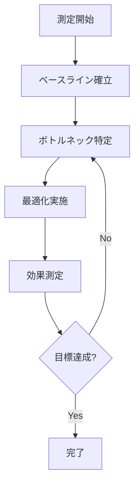
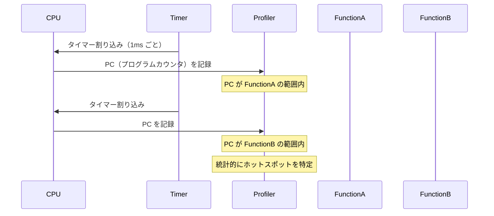
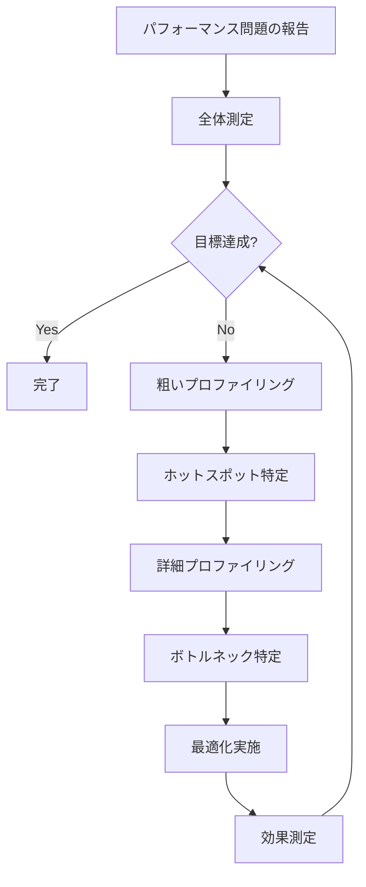

# パフォーマンス測定の原理

🎯 **この章で学ぶこと**
- パフォーマンス測定の基礎理論
- プロファイリング技術（サンプリング vs 計測）
- ハードウェアパフォーマンスカウンタの活用
- ブート時間の測定と分析
- ボトルネック特定手法

📚 **前提知識**
- [ファームウェアデバッグの基礎](./01-debug-fundamentals.md)
- [ログとトレースの設計](./04-logging-and-tracing.md)
- x86_64 アーキテクチャの基本

---

## イントロダクション

パフォーマンス測定は、ファームウェア最適化の出発点です。「測定なくして最適化なし」という格言の通り、正確な測定データなしに効果的な最適化を行うことは不可能です。ファームウェアのパフォーマンス測定には、**ブート時間の短縮**、**応答性の向上**、**省電力**、**スループットの改善**といった複数の目的があり、それぞれに適した測定手法とツールがあります。本章では、パフォーマンス測定の基礎理論から、高精度タイマの使用方法、プロファイリング技術、ハードウェアパフォーマンスカウンタの活用、ボトルネック特定手法まで、ファームウェアのパフォーマンス測定の全体像を詳細に解説します。

**パフォーマンス測定の目的**は、製品要求によって異なります。クライアント PC では、ブート時間が最重要であり、電源投入から OS ログイン画面までの時間を 2 秒以内に収めることが目標とされます。組み込みシステムでは、リアルタイム応答性が重要であり、キー入力や外部イベントへの応答時間を 100 ミリ秒以内に抑えます。サーバーでは、スループット（ディスク I/O、ネットワーク帯域）が重視され、NVMe SSD からの読み込み速度を 500 MB/s 以上に維持します。モバイルデバイスでは、省電力が最優先であり、アイドル時の消費電力を 1W 以下に抑えます。このように、測定対象と目標値は製品カテゴリによって大きく異なるため、適切な指標を選択することが重要です。

**測定方法**には、サンプリングベースと計測ベース（Instrumentation）の 2 つの主要なアプローチがあります。**サンプリングベースプロファイリング**は、定期的なタイマー割り込み（例: 1 ミリ秒ごと）で現在のプログラムカウンタ（PC / RIP）を記録し、統計的にホットスポット（最も時間を消費している関数）を特定します。オーバーヘッドが小さく（通常 1-5%）、実環境でも使用できるのが利点ですが、精度は粗く、短時間で終了する関数は捕捉できないことがあります。一方、**計測ベースプロファイリング**は、関数の開始時と終了時に明示的にタイムスタンプを記録し、正確な実行時間を測定します。精度が高く、すべての関数呼び出しを追跡できますが、オーバーヘッドが大きく（10-50%）、実環境での使用には注意が必要です。通常、サンプリングベースで大まかなホットスポットを特定し、計測ベースで詳細に分析する、という段階的アプローチが推奨されます。

**高精度タイマ**は、パフォーマンス測定の基礎です。EDK II では、`GetPerformanceCounter()` API が提供されており、プラットフォーム固有の高精度タイマ（通常は TSC: Time Stamp Counter）にアクセスできます。x86_64 アーキテクチャでは、TSC は CPU の特殊レジスタであり、`RDTSC` 命令で読み取ります。TSC は、CPU クロックサイクルごとにインクリメントされる 64 ビットカウンタであり、非常に高い精度（ナノ秒オーダー）で時刻を測定できます。モダンな CPU では、**Invariant TSC** 機能により、TSC は C-state（省電力状態）や周波数変更（Turbo Boost）の影響を受けず、信頼性の高い時刻源として機能します。TSC の周波数は、MSR（Model-Specific Register）の `MSR_PLATFORM_INFO`（0xCE）から取得でき、通常は CPU の基本クロック周波数（例: 2.4 GHz）と一致します。

**ハードウェアパフォーマンスカウンタ**（PMU: Performance Monitoring Unit）は、CPU 内部のハードウェアイベント（キャッシュミス、分岐予測ミス、命令リタイア数など）をカウントする機能です。Intel CPU では、汎用パフォーマンスカウンタ（IA32_PMCx）と固定機能カウンタ（IA32_FIXED_CTRx）が提供されており、MSR（Model-Specific Register）経由でアクセスします。パフォーマンスカウンタを使用することで、L1 データキャッシュミス、L2 キャッシュミス、分岐予測ミス、TLB ミスといった詳細なハードウェアイベントを測定し、マイクロアーキテクチャレベルでの最適化が可能になります。例えば、L1 データキャッシュミスが多い場合は、データ構造のレイアウトを変更してキャッシュラインに収まるようにしたり、メモリアクセスパターンを改善したりすることで、パフォーマンスを大幅に向上できます。

**ブート時間の測定**では、各ブートフェーズ（SEC、PEI、DXE、BDS）の所要時間と、各ドライバのロード・初期化時間を個別に測定します。EDK II には、Performance Measurement Infrastructure（`DxeCorePerformanceLib`）が組み込まれており、`PERF_START` / `PERF_END` マクロで測定ポイントをマークできます。これらのマクロは、DXE Core が自動的に記録し、`DP`（Dump Performance）コマンドで結果を表示できます。ブート時間測定の結果から、ボトルネックとなっているドライバやフェーズを特定し、そこに最適化努力を集中させることで、効率的にブート時間を短縮できます。典型的なボトルネックとして、メモリトレーニング（PEI Phase）、SATA/NVMe ディスク検出（DXE Phase）、ネットワークブート試行（BDS Phase）などが挙げられます。

本章では、これらのパフォーマンス測定技術を、具体的なコード例とツール使用方法とともに詳しく解説します。これにより、ファームウェアのパフォーマンスを正確に測定し、データ駆動で最適化を行うスキルを習得できます。

---

## 1. パフォーマンス測定の基礎

### 1.1 測定の目的と指標

ファームウェアのパフォーマンス測定には複数の目的があります：

| 目的 | 主要指標 | 目標値の例 |
|------|---------|-----------|
| **ブート時間短縮** | POST完了時間 | < 2秒（クライアント PC） |
| **応答性向上** | キー入力応答時間 | < 100ms |
| **省電力** | アイドル時消費電力 | < 1W |
| **スループット** | ディスク読み込み速度 | > 500MB/s |

#### パフォーマンス測定の基本原則



### 1.2 測定方法の分類

#### サンプリング vs 計測

| 手法 | 利点 | 欠点 | 用途 |
|------|------|------|------|
| **サンプリング** | オーバーヘッド小 | 精度が粗い | プロファイリング |
| **計測（Instrumentation）** | 正確 | オーバーヘッド大 | 詳細分析 |

```c
// サンプリングベース
// - タイマー割り込みで定期的にPC（プログラムカウンタ）を記録
// - 統計的にホットスポットを特定

// 計測ベース
VOID FunctionA (VOID)
{
  UINT64  Start, End;

  Start = GetTimestamp();  // 測定開始

  // 実際の処理

  End = GetTimestamp();    // 測定終了
  RecordFunctionTime("FunctionA", End - Start);
}
```

---

## 2. 時間測定の実装

### 2.1 高精度タイマの使用

#### Performance Counter API

```c
// EDK II の高精度タイマ API

/**
  パフォーマンスカウンタの現在値を取得

  @return カウンタ値
**/
UINT64
EFIAPI
GetPerformanceCounter (
  VOID
  );

/**
  パフォーマンスカウンタの周波数を取得

  @param[out] StartValue  カウンタの開始値（オプション）
  @param[out] EndValue    カウンタの終了値（オプション）

  @return 周波数（Hz）
**/
UINT64
EFIAPI
GetPerformanceCounterProperties (
  OUT UINT64  *StartValue  OPTIONAL,
  OUT UINT64  *EndValue    OPTIONAL
  );
```

#### 実装例

```c
// MdePkg/Library/BaseTimerLibNullTemplate/TimerLibNull.c

// x86_64 の場合、通常は TSC（Time Stamp Counter）を使用
UINT64
EFIAPI
GetPerformanceCounter (
  VOID
  )
{
  // RDTSC 命令で TSC を読み取り
  return AsmReadTsc();
}

UINT64
EFIAPI
GetPerformanceCounterProperties (
  OUT UINT64  *StartValue  OPTIONAL,
  OUT UINT64  *EndValue    OPTIONAL
  )
{
  if (StartValue != NULL) {
    *StartValue = 0;
  }

  if (EndValue != NULL) {
    *EndValue = (UINT64)-1;  // TSC は増加カウンタ
  }

  // TSC の周波数（CPUクロック周波数）
  return GetTscFrequency();
}
```

### 2.2 TSC（Time Stamp Counter）の詳細

#### TSC の特性

```c
// TSC は CPU の特殊レジスタ
// - 64ビットカウンタ
// - CPU クロックサイクルごとにインクリメント
// - RDTSC 命令で読み取り

static inline UINT64 ReadTSC (VOID)
{
  UINT32  Low, High;

  __asm__ volatile (
    "rdtsc"
    : "=a" (Low), "=d" (High)
  );

  return ((UINT64)High << 32) | Low;
}

// Invariant TSC (モダンな CPU)
// - C-state や周波数変更の影響を受けない
// - 信頼性の高い時刻源
```

#### TSC 周波数の取得

```c
#define MSR_PLATFORM_INFO  0xCE

UINT64 GetTscFrequency (VOID)
{
  UINT64  PlatformInfo;
  UINT32  MaxNonTurboRatio;
  UINT64  BusFreq;

  // Platform Info MSR を読む
  PlatformInfo = AsmReadMsr64(MSR_PLATFORM_INFO);

  // Bits 15:8 = Maximum Non-Turbo Ratio
  MaxNonTurboRatio = (UINT32)((PlatformInfo >> 8) & 0xFF);

  // Bus frequency (通常 100MHz)
  BusFreq = 100000000;  // 100 MHz

  // TSC Frequency = Bus Freq * Ratio
  return BusFreq * MaxNonTurboRatio;
}
```

### 2.3 時間変換ユーティリティ

```c
// タイムスタンプをマイクロ秒に変換

typedef struct {
  UINT64  Frequency;
  UINT64  StartValue;
  UINT64  EndValue;
} TIMER_CONTEXT;

STATIC TIMER_CONTEXT  gTimerContext;

VOID InitializeTimer (VOID)
{
  gTimerContext.Frequency = GetPerformanceCounterProperties(
                              &gTimerContext.StartValue,
                              &gTimerContext.EndValue
                            );
}

UINT64 GetElapsedMicroseconds (
  IN UINT64  StartTick,
  IN UINT64  EndTick
  )
{
  UINT64  Elapsed;

  Elapsed = EndTick - StartTick;

  // マイクロ秒に変換: (Elapsed * 1,000,000) / Frequency
  return DivU64x64Remainder(
           MultU64x32(Elapsed, 1000000),
           gTimerContext.Frequency,
           NULL
         );
}

// 使用例
VOID MeasuredFunction (VOID)
{
  UINT64  Start, End, ElapsedUs;

  Start = GetPerformanceCounter();

  // 測定対象の処理
  DoSomething();

  End = GetPerformanceCounter();

  ElapsedUs = GetElapsedMicroseconds(Start, End);

  DEBUG((DEBUG_INFO, "DoSomething took %lu us\n", ElapsedUs));
}
```

---

## 3. プロファイリング技術

### 3.1 関数単位の測定

#### 手動計測

```c
// 各関数の実行時間を記録

#define MAX_PERF_ENTRIES  1000

typedef struct {
  CONST CHAR8  *FunctionName;
  UINT64       TotalTime;    // 累積実行時間
  UINT32       CallCount;    // 呼び出し回数
  UINT64       MinTime;
  UINT64       MaxTime;
} PERF_ENTRY;

STATIC PERF_ENTRY  gPerfTable[MAX_PERF_ENTRIES];
STATIC UINTN       gPerfEntryCount = 0;

PERF_ENTRY *FindOrCreatePerfEntry (
  IN CONST CHAR8  *FunctionName
  )
{
  UINTN  Index;

  // 既存エントリを検索
  for (Index = 0; Index < gPerfEntryCount; Index++) {
    if (AsciiStrCmp(gPerfTable[Index].FunctionName, FunctionName) == 0) {
      return &gPerfTable[Index];
    }
  }

  // 新規作成
  if (gPerfEntryCount < MAX_PERF_ENTRIES) {
    PERF_ENTRY  *Entry = &gPerfTable[gPerfEntryCount++];
    Entry->FunctionName = FunctionName;
    Entry->TotalTime    = 0;
    Entry->CallCount    = 0;
    Entry->MinTime      = (UINT64)-1;
    Entry->MaxTime      = 0;
    return Entry;
  }

  return NULL;
}

VOID RecordFunctionPerf (
  IN CONST CHAR8  *FunctionName,
  IN UINT64       ElapsedTicks
  )
{
  PERF_ENTRY  *Entry;

  Entry = FindOrCreatePerfEntry(FunctionName);
  if (Entry == NULL) {
    return;
  }

  Entry->TotalTime += ElapsedTicks;
  Entry->CallCount++;

  if (ElapsedTicks < Entry->MinTime) {
    Entry->MinTime = ElapsedTicks;
  }

  if (ElapsedTicks > Entry->MaxTime) {
    Entry->MaxTime = ElapsedTicks;
  }
}

// マクロで簡潔に
#define PERF_START(name)  \
  UINT64  _perf_start_##name = GetPerformanceCounter()

#define PERF_END(name)  \
  do { \
    UINT64  _perf_end = GetPerformanceCounter(); \
    RecordFunctionPerf(#name, _perf_end - _perf_start_##name); \
  } while (0)

// 使用例
VOID MyFunction (VOID)
{
  PERF_START(MyFunction);

  // 処理

  PERF_END(MyFunction);
}
```

#### パフォーマンスレポート生成

```c
VOID DumpPerfReport (VOID)
{
  UINTN   Index;
  UINT64  Frequency;

  Frequency = gTimerContext.Frequency;

  DEBUG((DEBUG_INFO, "=== Performance Report ===\n"));
  DEBUG((DEBUG_INFO, "%-30a %10s %10s %10s %10s %10s\n",
         "Function", "Calls", "Total(us)", "Avg(us)", "Min(us)", "Max(us)"));
  DEBUG((DEBUG_INFO, "--------------------------------------------------------------\n"));

  for (Index = 0; Index < gPerfEntryCount; Index++) {
    PERF_ENTRY  *Entry = &gPerfTable[Index];
    UINT64      TotalUs, AvgUs, MinUs, MaxUs;

    // ティックをマイクロ秒に変換
    TotalUs = DivU64x64Remainder(MultU64x32(Entry->TotalTime, 1000000), Frequency, NULL);
    AvgUs   = TotalUs / Entry->CallCount;
    MinUs   = DivU64x64Remainder(MultU64x32(Entry->MinTime, 1000000), Frequency, NULL);
    MaxUs   = DivU64x64Remainder(MultU64x32(Entry->MaxTime, 1000000), Frequency, NULL);

    DEBUG((DEBUG_INFO, "%-30a %10u %10lu %10lu %10lu %10lu\n",
           Entry->FunctionName,
           Entry->CallCount,
           TotalUs,
           AvgUs,
           MinUs,
           MaxUs));
  }
}
```

出力例：
```
=== Performance Report ===
Function                       Calls  Total(us)   Avg(us)   Min(us)   Max(us)
--------------------------------------------------------------
InitializeMemory                   1     45678      45678     45678     45678
EnumeratePci                       1     12345      12345     12345     12345
InitializeUsb                     10      8900        890       650      1200
ReadBlock                        150     30000        200       180       250
```

### 3.2 EDK II Performance Infrastructure

#### PERFORMANCE_PROPERTY PCD

```c
// EDK II には標準のパフォーマンス測定機能がある

// MdePkg/Include/Library/PerformanceLib.h

/**
  パフォーマンス測定開始マーク

  @param  Handle      測定対象のハンドル
  @param  Token       識別子文字列
  @param  Module      モジュール名
  @param  TimeStamp   タイムスタンプ（0 なら自動取得）
**/
#define PERF_START(Handle, Token, Module, TimeStamp)  \
  StartPerformanceMeasurement(Handle, Token, Module, TimeStamp)

/**
  パフォーマンス測定終了マーク

  @param  Handle      測定対象のハンドル
  @param  Token       識別子文字列
  @param  Module      モジュール名
  @param  TimeStamp   タイムスタンプ（0 なら自動取得）
**/
#define PERF_END(Handle, Token, Module, TimeStamp)  \
  EndPerformanceMeasurement(Handle, Token, Module, TimeStamp)

// 使用例
EFI_STATUS
EFIAPI
MyDriverEntry (
  IN EFI_HANDLE        ImageHandle,
  IN EFI_SYSTEM_TABLE  *SystemTable
  )
{
  PERF_START(ImageHandle, "MyDriverInit", NULL, 0);

  // ドライバ初期化処理

  PERF_END(ImageHandle, "MyDriverInit", NULL, 0);

  return EFI_SUCCESS;
}
```

#### Performance Protocol

```c
// MdeModulePkg/Include/Guid/Performance.h

typedef struct {
  EFI_HANDLE  Handle;
  CHAR8       Token[PERF_TOKEN_SIZE];
  CHAR8       Module[PERF_TOKEN_SIZE];
  UINT64      StartTimeStamp;
  UINT64      EndTimeStamp;
} PERFORMANCE_RECORD;

// パフォーマンスデータの取得
EFI_STATUS GetPerformanceData (
  OUT PERFORMANCE_RECORD  **Records,
  OUT UINTN               *Count
  )
{
  // Implementation省略
  // 実際には Performance Protocol を使用してデータ取得
}
```

### 3.3 サンプリングプロファイラ

#### コンセプト



#### 実装例（簡易版）

```c
#define MAX_SAMPLES  10000

typedef struct {
  UINT64  ProgramCounter;
  UINT64  Timestamp;
} SAMPLE;

STATIC SAMPLE  gSamples[MAX_SAMPLES];
STATIC UINTN   gSampleCount = 0;

VOID
EFIAPI
SamplingTimerCallback (
  IN EFI_EVENT  Event,
  IN VOID       *Context
  )
{
  if (gSampleCount >= MAX_SAMPLES) {
    return;
  }

  // PC（リターンアドレス）を取得
  // GCC builtin
  VOID  *PC = __builtin_return_address(0);

  gSamples[gSampleCount].ProgramCounter = (UINT64)PC;
  gSamples[gSampleCount].Timestamp      = GetPerformanceCounter();
  gSampleCount++;
}

EFI_STATUS StartSamplingProfiler (VOID)
{
  EFI_EVENT   TimerEvent;
  EFI_STATUS  Status;

  Status = gBS->CreateEvent(
                  EVT_TIMER | EVT_NOTIFY_SIGNAL,
                  TPL_HIGH_LEVEL,  // 高優先度
                  SamplingTimerCallback,
                  NULL,
                  &TimerEvent
                );
  if (EFI_ERROR(Status)) {
    return Status;
  }

  // 1ms ごとにサンプリング
  Status = gBS->SetTimer(
                  TimerEvent,
                  TimerPeriodic,
                  EFI_TIMER_PERIOD_MILLISECONDS(1)
                );

  return Status;
}
```

#### サンプルデータの解析

```python
#!/usr/bin/env python3
"""
サンプリングデータからホットスポットを特定
"""
from collections import Counter
from typing import List, Tuple

class ProfileAnalyzer:
    def __init__(self, samples: List[int], symbol_map: dict):
        """
        Args:
            samples: PC のリスト
            symbol_map: {address: (func_name, start_addr, end_addr)}
        """
        self.samples = samples
        self.symbol_map = symbol_map

    def find_function(self, pc: int) -> str:
        """PC からシンボル名を逆引き"""
        for addr, (name, start, end) in self.symbol_map.items():
            if start <= pc < end:
                return name
        return f"<unknown:0x{pc:x}>"

    def generate_flamegraph(self) -> dict:
        """関数ごとのサンプル数を集計"""
        function_counts = Counter()

        for pc in self.samples:
            func = self.find_function(pc)
            function_counts[func] += 1

        return dict(function_counts)

    def report(self):
        """レポート出力"""
        flame = self.generate_flamegraph()
        total = len(self.samples)

        print(f"Total samples: {total}\n")
        print(f"{'Function':<40} {'Samples':>10} {'%':>6}")
        print("=" * 60)

        for func, count in sorted(flame.items(),
                                  key=lambda x: x[1], reverse=True)[:20]:
            percentage = (count / total) * 100
            print(f"{func:<40} {count:>10} {percentage:>6.2f}%")

# 使用例
if __name__ == '__main__':
    # シンボルマップの読み込み（実際には ELF や MAP ファイルから取得）
    symbol_map = {
        0x1000: ("InitializeMemory", 0x1000, 0x1500),
        0x2000: ("EnumeratePci", 0x2000, 0x2800),
        # ...
    }

    samples = [0x1234, 0x2345, 0x1100, ...]  # サンプリングデータ

    analyzer = ProfileAnalyzer(samples, symbol_map)
    analyzer.report()
```

---

## 4. ハードウェアパフォーマンスカウンタ

### 4.1 Intel PMU（Performance Monitoring Unit）

#### 概要

x86_64 CPU にはハードウェアパフォーマンスカウンタが搭載されています：

| イベント | 説明 | 用途 |
|---------|------|------|
| **Instructions Retired** | 実行命令数 | IPC 計算 |
| **CPU Cycles** | クロックサイクル数 | 実行時間 |
| **Cache Misses** | キャッシュミス回数 | メモリアクセス最適化 |
| **Branch Mispredictions** | 分岐予測ミス | 制御フロー最適化 |

#### MSR（Model Specific Register）

```c
// Intel IA32 Performance Monitoring MSRs

#define IA32_PERF_GLOBAL_CTRL  0x38F  // グローバル制御
#define IA32_FIXED_CTR0        0x309  // 固定カウンタ 0 (命令数)
#define IA32_FIXED_CTR1        0x30A  // 固定カウンタ 1 (CPU サイクル)
#define IA32_FIXED_CTR2        0x30B  // 固定カウンタ 2 (リファレンスサイクル)

#define IA32_PERFEVTSEL0       0x186  // イベント選択 0
#define IA32_PMC0              0x0C1  // プログラマブルカウンタ 0

// カウンタの有効化
VOID EnablePerfCounters (VOID)
{
  UINT64  GlobalCtrl;

  // Fixed Counter 0, 1 を有効化
  GlobalCtrl = AsmReadMsr64(IA32_PERF_GLOBAL_CTRL);
  GlobalCtrl |= (1ULL << 32) | (1ULL << 33);  // FIXED_CTR0, FIXED_CTR1
  AsmWriteMsr64(IA32_PERF_GLOBAL_CTRL, GlobalCtrl);
}

// 命令数の取得
UINT64 GetInstructionCount (VOID)
{
  return AsmReadMsr64(IA32_FIXED_CTR0);
}

// CPU サイクル数の取得
UINT64 GetCpuCycles (VOID)
{
  return AsmReadMsr64(IA32_FIXED_CTR1);
}

// IPC（Instructions Per Cycle）の計算
VOID MeasureIPC (VOID)
{
  UINT64  InsnStart, InsnEnd;
  UINT64  CycleStart, CycleEnd;
  UINT64  InsnDelta, CycleDelta;
  double  IPC;

  InsnStart  = GetInstructionCount();
  CycleStart = GetCpuCycles();

  // 測定対象の処理
  DoSomething();

  InsnEnd  = GetInstructionCount();
  CycleEnd = GetCpuCycles();

  InsnDelta  = InsnEnd - InsnStart;
  CycleDelta = CycleEnd - CycleStart;

  IPC = (double)InsnDelta / (double)CycleDelta;

  DEBUG((DEBUG_INFO, "IPC: %.2f (Insn: %lu, Cycles: %lu)\n",
         IPC, InsnDelta, CycleDelta));
}
```

### 4.2 プログラマブルカウンタ

#### イベント選択

```c
// 特定のイベントを測定

#define PERFEVT_L1D_CACHE_MISS  0x0151  // L1D キャッシュミス

VOID ConfigurePerfCounter (
  IN UINT32  CounterIndex,
  IN UINT32  EventSelect
  )
{
  UINT64  EventConfig;

  // イベント選択レジスタを設定
  // Bits 7:0   = Event Select
  // Bits 15:8  = Unit Mask
  // Bit  16    = USR (user mode)
  // Bit  17    = OS (kernel mode)
  // Bit  22    = EN (enable)

  EventConfig = EventSelect & 0xFFFF;
  EventConfig |= (1 << 16);  // USR
  EventConfig |= (1 << 17);  // OS
  EventConfig |= (1 << 22);  // EN

  AsmWriteMsr64(IA32_PERFEVTSEL0 + CounterIndex, EventConfig);
}

UINT64 ReadPerfCounter (
  IN UINT32  CounterIndex
  )
{
  return AsmReadMsr64(IA32_PMC0 + CounterIndex);
}

// 使用例：L1D キャッシュミスの測定
VOID MeasureCacheMisses (VOID)
{
  UINT64  MissStart, MissEnd;

  ConfigurePerfCounter(0, PERFEVT_L1D_CACHE_MISS);

  MissStart = ReadPerfCounter(0);

  // 測定対象
  AccessMemory();

  MissEnd = ReadPerfCounter(0);

  DEBUG((DEBUG_INFO, "L1D Cache Misses: %lu\n", MissEnd - MissStart));
}
```

---

## 5. ブート時間の測定

### 5.1 フェーズ別測定

```c
// ブートフェーズの境界で時刻を記録

typedef enum {
  BootPhaseSecEntry,
  BootPhasePeiEntry,
  BootPhaseDxeEntry,
  BootPhaseBdsEntry,
  BootPhaseOsLoader,
  BootPhaseMax
} BOOT_PHASE;

typedef struct {
  BOOT_PHASE  Phase;
  UINT64      Timestamp;
} BOOT_MILESTONE;

STATIC BOOT_MILESTONE  gBootMilestones[BootPhaseMax];

VOID RecordBootMilestone (
  IN BOOT_PHASE  Phase
  )
{
  gBootMilestones[Phase].Phase     = Phase;
  gBootMilestones[Phase].Timestamp = GetPerformanceCounter();
}

// 各フェーズのエントリポイントで呼び出す
VOID PeiCoreEntryPoint (...)
{
  RecordBootMilestone(BootPhasePeiEntry);
  // ...
}

VOID DxeCoreEntryPoint (...)
{
  RecordBootMilestone(BootPhaseDxeEntry);
  // ...
}
```

#### ブートタイムレポート

```c
VOID PrintBootTimeReport (VOID)
{
  UINTN   Index;
  UINT64  Frequency;
  UINT64  TotalTime;

  Frequency = gTimerContext.Frequency;

  DEBUG((DEBUG_INFO, "=== Boot Time Report ===\n"));

  for (Index = 1; Index < BootPhaseMax; Index++) {
    UINT64  PrevTs, CurrTs;
    UINT64  ElapsedMs;

    PrevTs = gBootMilestones[Index - 1].Timestamp;
    CurrTs = gBootMilestones[Index].Timestamp;

    ElapsedMs = DivU64x64Remainder(
                  MultU64x32(CurrTs - PrevTs, 1000),
                  Frequency,
                  NULL
                );

    DEBUG((DEBUG_INFO, "Phase %u -> %u: %lu ms\n",
           Index - 1, Index, ElapsedMs));
  }

  TotalTime = gBootMilestones[BootPhaseMax - 1].Timestamp -
              gBootMilestones[0].Timestamp;

  TotalTime = DivU64x64Remainder(
                MultU64x32(TotalTime, 1000),
                Frequency,
                NULL
              );

  DEBUG((DEBUG_INFO, "Total Boot Time: %lu ms\n", TotalTime));
}
```

出力例：
```
=== Boot Time Report ===
Phase 0 -> 1: 12 ms   (SEC -> PEI)
Phase 1 -> 2: 345 ms  (PEI -> DXE)
Phase 2 -> 3: 678 ms  (DXE -> BDS)
Phase 3 -> 4: 234 ms  (BDS -> OS Loader)
Total Boot Time: 1269 ms
```

### 5.2 ドライバ別測定

```c
// 各ドライバのロード・初期化時間を測定

EFI_STATUS
EFIAPI
CoreLoadImage (
  IN  EFI_HANDLE                  ParentImageHandle,
  IN  EFI_DEVICE_PATH_PROTOCOL    *FilePath,
  ...
  OUT EFI_HANDLE                  *ImageHandle
  )
{
  UINT64      Start, End;
  CHAR16      *DriverName;
  EFI_STATUS  Status;

  Start = GetPerformanceCounter();

  // イメージロード処理
  Status = LoadImageInternal(...);

  End = GetPerformanceCounter();

  // ドライバ名を取得
  DriverName = GetImageName(*ImageHandle);

  // パフォーマンスレコード記録
  PERF_START(*ImageHandle, "LoadImage", DriverName, Start);
  PERF_END(*ImageHandle, "LoadImage", DriverName, End);

  return Status;
}
```

#### 解析ツール

```python
#!/usr/bin/env python3
"""
ドライバロード時間の解析
"""
import re
from dataclasses import dataclass
from typing import List

@dataclass
class DriverLoadRecord:
    name: str
    start_time: float
    end_time: float

    @property
    def duration(self) -> float:
        return self.end_time - self.start_time

def parse_perf_log(log_file: str) -> List[DriverLoadRecord]:
    """PERF ログをパース"""
    records = []
    pending = {}  # {(handle, token): start_time}

    with open(log_file, 'r') as f:
        for line in f:
            # PERF_START: handle=0x12345 token="LoadImage" module="MyDriver.efi" time=123456
            match_start = re.search(
                r'PERF_START.*handle=(\w+).*module="([^"]+)".*time=(\d+)',
                line
            )
            match_end = re.search(
                r'PERF_END.*handle=(\w+).*module="([^"]+)".*time=(\d+)',
                line
            )

            if match_start:
                handle = match_start.group(1)
                module = match_start.group(2)
                time = float(match_start.group(3))
                pending[(handle, module)] = time

            elif match_end:
                handle = match_end.group(1)
                module = match_end.group(2)
                time = float(match_end.group(3))

                key = (handle, module)
                if key in pending:
                    start_time = pending[key]
                    records.append(DriverLoadRecord(module, start_time, time))
                    del pending[key]

    return records

def analyze_boot_drivers(log_file: str):
    """ドライバロード時間を分析"""
    records = parse_perf_log(log_file)

    # 時間順にソート
    records.sort(key=lambda r: r.start_time)

    print(f"{'Driver':<40} {'Start (ms)':>12} {'Duration (ms)':>15}")
    print("=" * 70)

    total_duration = 0
    for record in records:
        start_ms = record.start_time / 1000
        duration_ms = record.duration / 1000
        total_duration += duration_ms

        print(f"{record.name:<40} {start_ms:>12.3f} {duration_ms:>15.3f}")

    print("=" * 70)
    print(f"{'Total':>40} {total_duration:>28.3f}")

    # 遅いドライバ TOP 10
    print("\n=== Slowest Drivers ===")
    slowest = sorted(records, key=lambda r: r.duration, reverse=True)[:10]
    for i, record in enumerate(slowest, 1):
        print(f"{i}. {record.name}: {record.duration / 1000:.3f} ms")

if __name__ == '__main__':
    import sys
    if len(sys.argv) != 2:
        print(f"Usage: {sys.argv[0]} <perf_log>")
        sys.exit(1)
    analyze_boot_drivers(sys.argv[1])
```

---

## 6. ボトルネック特定

### 6.1 プロファイリング戦略



### 6.2 典型的なボトルネック

| 種類 | 症状 | 検出方法 | 対策 |
|------|------|---------|------|
| **CPU バウンド** | 高 CPU 使用率 | IPC 測定 | アルゴリズム最適化 |
| **メモリバウンド** | 高キャッシュミス率 | PMU カウンタ | データ局所性向上 |
| **I/O バウンド** | デバイス待ち時間長 | タイムライン分析 | 非同期化・並列化 |

#### CPU バウンドの例

```c
// 悪い例：O(n^2) アルゴリズム
VOID SlowSort (UINT32 *Array, UINTN Count)
{
  UINTN  i, j;

  for (i = 0; i < Count; i++) {
    for (j = i + 1; j < Count; j++) {
      if (Array[i] > Array[j]) {
        UINT32  Temp = Array[i];
        Array[i] = Array[j];
        Array[j] = Temp;
      }
    }
  }
}

// 良い例：O(n log n) アルゴリズム
VOID FastSort (UINT32 *Array, UINTN Count)
{
  // QuickSort や MergeSort を使用
  QuickSort(Array, 0, Count - 1);
}
```

#### メモリバウンドの例

```c
// 悪い例：キャッシュミスが多い
VOID ProcessMatrix (UINT32 Matrix[1000][1000])
{
  UINTN  i, j;

  // 列優先アクセス（キャッシュに不利）
  for (j = 0; j < 1000; j++) {
    for (i = 0; i < 1000; i++) {
      Matrix[i][j] *= 2;
    }
  }
}

// 良い例：キャッシュフレンドリ
VOID ProcessMatrixOptimized (UINT32 Matrix[1000][1000])
{
  UINTN  i, j;

  // 行優先アクセス（キャッシュに有利）
  for (i = 0; i < 1000; i++) {
    for (j = 0; j < 1000; j++) {
      Matrix[i][j] *= 2;
    }
  }
}
```

### 6.3 測定駆動最適化

```c
// 最適化前後の測定を必ず行う

VOID OptimizationExample (VOID)
{
  UINT64  Start, End;
  UINT64  BaselineTime, OptimizedTime;

  // ベースライン測定
  Start = GetPerformanceCounter();
  OldImplementation();
  End = GetPerformanceCounter();
  BaselineTime = GetElapsedMicroseconds(Start, End);

  DEBUG((DEBUG_INFO, "Baseline: %lu us\n", BaselineTime));

  // 最適化版測定
  Start = GetPerformanceCounter();
  NewOptimizedImplementation();
  End = GetPerformanceCounter();
  OptimizedTime = GetElapsedMicroseconds(Start, End);

  DEBUG((DEBUG_INFO, "Optimized: %lu us\n", OptimizedTime));

  // 改善率
  if (BaselineTime > 0) {
    UINT64  Improvement = ((BaselineTime - OptimizedTime) * 100) / BaselineTime;
    DEBUG((DEBUG_INFO, "Improvement: %lu%%\n", Improvement));
  }
}
```

---

## 7. 実践例：USB ドライバの最適化

### 7.1 初期測定

```c
// USB ドライバのホットスポット測定

EFI_STATUS
EFIAPI
UsbEnumerateDevice (
  IN USB_CONTROLLER  *Controller
  )
{
  PERF_START(NULL, "UsbEnumerate", NULL, 0);

  // デバイス検出
  PERF_START(NULL, "DetectDevice", NULL, 0);
  Status = DetectUsbDevice(Controller);
  PERF_END(NULL, "DetectDevice", NULL, 0);

  // デスクリプタ読み取り
  PERF_START(NULL, "ReadDescriptor", NULL, 0);
  Status = ReadDeviceDescriptor(Controller, &Descriptor);
  PERF_END(NULL, "ReadDescriptor", NULL, 0);

  // デバイス設定
  PERF_START(NULL, "ConfigureDevice", NULL, 0);
  Status = ConfigureDevice(Controller, &Descriptor);
  PERF_END(NULL, "ConfigureDevice", NULL, 0);

  PERF_END(NULL, "UsbEnumerate", NULL, 0);

  return Status;
}
```

測定結果：
```
UsbEnumerate: 850 ms
  DetectDevice: 50 ms
  ReadDescriptor: 750 ms  ← ボトルネック！
  ConfigureDevice: 50 ms
```

### 7.2 詳細分析

```c
// ReadDescriptor の詳細測定

EFI_STATUS ReadDeviceDescriptor (
  IN  USB_CONTROLLER       *Controller,
  OUT USB_DEVICE_DESCRIPTOR *Descriptor
  )
{
  PERF_START(NULL, "WaitForDevice", NULL, 0);
  Status = WaitForDeviceReady(Controller);  // 700ms かかっている
  PERF_END(NULL, "WaitForDevice", NULL, 0);

  PERF_START(NULL, "TransferData", NULL, 0);
  Status = UsbControlTransfer(Controller, Descriptor, sizeof(*Descriptor));
  PERF_END(NULL, "TransferData", NULL, 0);

  return Status;
}
```

### 7.3 最適化

```c
// 問題：ポーリング間隔が長すぎる

// 最適化前
EFI_STATUS WaitForDeviceReady (USB_CONTROLLER *Controller)
{
  UINTN  Retry = 0;

  while (Retry < 100) {
    if (IsDeviceReady(Controller)) {
      return EFI_SUCCESS;
    }
    gBS->Stall(10000);  // 10ms 待機 ← 無駄に長い
    Retry++;
  }

  return EFI_TIMEOUT;
}

// 最適化後
EFI_STATUS WaitForDeviceReadyOptimized (USB_CONTROLLER *Controller)
{
  UINTN  Retry = 0;

  while (Retry < 1000) {
    if (IsDeviceReady(Controller)) {
      return EFI_SUCCESS;
    }
    gBS->Stall(1000);  // 1ms 待機 ← より細かく確認
    Retry++;
  }

  return EFI_TIMEOUT;
}
```

最適化結果：
```
Before: UsbEnumerate: 850 ms
After:  UsbEnumerate: 120 ms  (85% 改善!)
```

---

## 💻 演習

### 演習1: パフォーマンス測定マクロの実装

**課題**: PERF_START/PERF_END マクロと集計機能を実装してください。

```c
// 要件:
// - 関数名、実行時間（us）、呼び出し回数を記録
// - DumpPerfReport() でレポート出力

void TestFunction1() {
  PERF_START(TestFunction1);
  // 処理
  PERF_END(TestFunction1);
}

void TestFunction2() {
  PERF_START(TestFunction2);
  TestFunction1();  // ネスト可能
  PERF_END(TestFunction2);
}

// DumpPerfReport() の出力:
// Function          Calls  Total(us)  Avg(us)
// TestFunction1        10      1000      100
// TestFunction2         5      2500      500
```

<details>
<summary>解答例</summary>

前述の「3.1 関数単位の測定」のコードを参照。

</details>

### 演習2: ブートタイム可視化ツール

**課題**: EDK II の PERF ログを読み込み、Gantt チャートを生成する Python スクリプトを作成してください。

```python
# 入力: PERF ログファイル
# 出力: ドライバロードの Gantt チャート（PNG）

# 例：
# Driver1  |=====>
# Driver2     |======>
# Driver3          |====>
```

<details>
<summary>解答例</summary>

```python
#!/usr/bin/env python3
import matplotlib.pyplot as plt
import matplotlib.patches as mpatches

def plot_gantt(records, output_file='gantt.png'):
    fig, ax = plt.subplots(figsize=(14, len(records) * 0.5))

    for i, record in enumerate(records):
        start = record.start_time / 1000  # ms
        duration = record.duration / 1000

        # 横棒
        ax.barh(i, duration, left=start, height=0.8,
                color='steelblue', edgecolor='black')

        # ドライバ名
        ax.text(start + duration / 2, i, record.name,
                ha='center', va='center', fontsize=8, color='white')

    ax.set_xlabel('Time (ms)')
    ax.set_yticks(range(len(records)))
    ax.set_yticklabels([r.name for r in records])
    ax.set_title('Driver Load Timeline')
    ax.grid(axis='x', alpha=0.3)

    plt.tight_layout()
    plt.savefig(output_file, dpi=150)
    print(f"Gantt chart saved to {output_file}")

# 使用例
records = parse_perf_log('boot.log')
plot_gantt(records)
```

</details>

### 演習3: ハードウェアカウンタでキャッシュミスを測定

**課題**: L1D キャッシュミスを測定し、最適化前後で比較してください。

```c
// アルゴリズム A（最適化前）とアルゴリズム B（最適化後）の
// キャッシュミス回数を測定

void CompareAlgorithms() {
  UINT64 missesA, missesB;

  // TODO: アルゴリズム A のキャッシュミス測定
  // TODO: アルゴリズム B のキャッシュミス測定
  // TODO: 結果を比較・表示
}
```

<details>
<summary>解答例</summary>

```c
void CompareAlgorithms() {
  UINT64 missesA_start, missesA_end, missesA;
  UINT64 missesB_start, missesB_end, missesB;

  // L1D キャッシュミスイベントを設定
  ConfigurePerfCounter(0, PERFEVT_L1D_CACHE_MISS);

  // アルゴリズム A
  missesA_start = ReadPerfCounter(0);
  ProcessMatrixColumnMajor();  // 列優先（キャッシュに不利）
  missesA_end = ReadPerfCounter(0);
  missesA = missesA_end - missesA_start;

  // アルゴリズム B
  missesB_start = ReadPerfCounter(0);
  ProcessMatrixRowMajor();     // 行優先（キャッシュに有利）
  missesB_end = ReadPerfCounter(0);
  missesB = missesB_end - missesB_start;

  DEBUG((DEBUG_INFO, "Algorithm A: %lu cache misses\n", missesA));
  DEBUG((DEBUG_INFO, "Algorithm B: %lu cache misses\n", missesB));

  if (missesA > 0) {
    UINT64 improvement = ((missesA - missesB) * 100) / missesA;
    DEBUG((DEBUG_INFO, "Improvement: %lu%%\n", improvement));
  }
}
```

</details>

---

## まとめ

本章では、ファームウェアのパフォーマンス測定の基礎理論から、高精度タイマ、プロファイリング技術、ハードウェアパフォーマンスカウンタ、ブート時間測定まで、包括的に学びました。「測定なくして最適化なし」という原則の通り、正確な測定データは効果的な最適化の前提条件です。

**高精度タイマ**として、x86_64 では TSC（Time Stamp Counter）が最も重要です。TSC は、`RDTSC` 命令で読み取る 64 ビットカウンタであり、CPU クロックサイクルごとにインクリメントされます。モダンな CPU では、Invariant TSC 機能により、C-state（省電力状態）や周波数変更（Turbo Boost）の影響を受けず、信頼性の高い時刻源として機能します。TSC の周波数は、MSR `MSR_PLATFORM_INFO`（0xCE）のビット 15:8（Maximum Non-Turbo Ratio）と FSB 周波数（通常 100 MHz）から計算できます（周波数 = FSB × Ratio）。EDK II では、`GetPerformanceCounter()` API が TSC へのアクセスを抽象化し、`GetPerformanceCounterProperties()` で周波数と増減方向（増加カウンタか減少カウンタか）を取得できます。タイムスタンプをマイクロ秒に変換するには、`(Elapsed × 1,000,000) / Frequency` の計算を行い、`DivU64x64Remainder()` で 64 ビット除算を実行します。

**プロファイリング技術**には、サンプリングベースと計測ベース（Instrumentation）があります。サンプリングベースは、定期的なタイマー割り込み（例: 1 ミリ秒ごと）で現在のプログラムカウンタ（RIP）を記録し、統計的にホットスポットを特定します。オーバーヘッドが小さく（通常 1-5%）、実環境でも使用できますが、精度は粗く、短時間で終了する関数は捕捉できません。計測ベースは、関数の開始時と終了時に明示的にタイムスタンプを記録（`Start = GetPerformanceCounter(); ... End = GetPerformanceCounter(); RecordFunctionTime(End - Start);`）し、正確な実行時間を測定します。精度が高く、すべての関数呼び出しを追跡できますが、オーバーヘッドが大きく（10-50%）、測定自体がパフォーマンスに影響します。通常、サンプリングベースで大まかなホットスポットを特定し、計測ベースで詳細に分析する、という段階的アプローチが推奨されます。

**ハードウェアパフォーマンスカウンタ**（PMU: Performance Monitoring Unit）は、CPU 内部のマイクロアーキテクチャイベントを測定します。Intel CPU では、MSR `IA32_PERFEVTSELx`（0x186-0x189）でイベントとマスクを設定し、`IA32_PMCx`（0xC1-0xC4）でカウント値を読み取ります。測定可能なイベントとして、L1 データキャッシュミス（0x51, 0x01）、L2 キャッシュミス（0x24, 0x3F）、分岐予測ミス（0xC5, 0x00）、TLB ミス（0x08, 0x0E）などがあります。固定機能カウンタ（`IA32_FIXED_CTR0-2`）は、命令リタイア数、CPU サイクル数、リファレンスサイクル数を常時カウントします。これらのカウンタを活用することで、キャッシュ効率、分岐予測精度、メモリアクセスパターンといったマイクロアーキテクチャレベルの詳細を分析し、データ構造のレイアウト変更、ループアンローリング、プリフェッチ最適化といった高度な最適化が可能になります。

**ブート時間の測定**では、EDK II の Performance Measurement Infrastructure を使用します。`PERF_START(Handle, Token, Module, TimeStamp)` と `PERF_END(Handle, Token, Module, TimeStamp)` マクロで測定ポイントをマークし、DXE Core が自動的に記録します。`DP`（Dump Performance）コマンドで結果を表示すると、各ブートフェーズ（SEC、PEI、DXE、BDS）の所要時間、各ドライバのロード時間、各 PERF マーカー間の時間が一覧表示されます。この結果から、ボトルネックとなっているフェーズやドライバを特定できます。典型的なボトルネックとして、メモリトレーニング（PEI Phase で 500-1000 ミリ秒）、SATA ディスク検出（各デバイスで 100-500 ミリ秒）、ネットワークブート試行（DHCP タイムアウトで数秒）などがあります。これらのボトルネックに最適化努力を集中させることで、効率的にブート時間を短縮できます。

**最適化のベストプラクティス**として、まず**ベースラインを確立**します。最適化前の性能を測定し、記録します。次に、**ボトルネックを特定**します。プロファイリング結果から、最も時間を消費している関数やフェーズを特定します。次に、**最適化を実施**します。ボトルネックに対する具体的な改善策（アルゴリズム変更、キャッシュ効率化、並列化など）を実装します。次に、**効果を測定**します。最適化後の性能を測定し、ベースラインと比較します。最後に、**目標達成を判定**します。目標性能（例: ブート時間 2 秒以内）に到達したか確認します。目標未達の場合は、再度ボトルネックを特定し、このサイクルを繰り返します。また、**リグレッションテスト**を実施し、最適化によって他の機能が劣化していないか確認します。

これらのパフォーマンス測定技術を習得することで、データ駆動でファームウェアを最適化し、製品要求を満たす高性能なファームウェアを開発できるようになります。次章では、ブート時間最適化の具体的な手法について詳しく学びます。

---

📚 **参考資料**
- [Intel® 64 and IA-32 Architectures Software Developer's Manual Volume 3B](https://www.intel.com/sdm) - Chapter 18: Performance Monitoring
- [EDK II Performance Measurement Infrastructure](https://github.com/tianocore/edk2/tree/master/MdeModulePkg/Library/DxeCorePerformanceLib)
- [Linux perf: Linux profiling with performance counters](https://perf.wiki.kernel.org/)
- [Brendan Gregg's Performance Analysis](http://www.brendangregg.com/perf.html)
- [Intel VTune Profiler](https://www.intel.com/content/www/us/en/developer/tools/oneapi/vtune-profiler.html)
