# パフォーマンス測定の原理

🎯 **この章で学ぶこと**
- パフォーマンス測定の基礎理論
- プロファイリング技術（サンプリング vs 計測）
- ハードウェアパフォーマンスカウンタの活用
- ブート時間の測定と分析
- ボトルネック特定手法

📚 **前提知識**
- [ファームウェアデバッグの基礎](./01-debug-fundamentals.md)
- [ログとトレースの設計](./04-logging-and-tracing.md)
- x86_64 アーキテクチャの基本

---

## 1. パフォーマンス測定の基礎

### 1.1 測定の目的と指標

ファームウェアのパフォーマンス測定には複数の目的があります：

| 目的 | 主要指標 | 目標値の例 |
|------|---------|-----------|
| **ブート時間短縮** | POST完了時間 | < 2秒（クライアント PC） |
| **応答性向上** | キー入力応答時間 | < 100ms |
| **省電力** | アイドル時消費電力 | < 1W |
| **スループット** | ディスク読み込み速度 | > 500MB/s |

#### パフォーマンス測定の基本原則

```mermaid
graph TD
    A[測定開始] --> B[ベースライン確立]
    B --> C[ボトルネック特定]
    C --> D[最適化実施]
    D --> E[効果測定]
    E --> F{目標達成?}
    F -->|No| C
    F -->|Yes| G[完了]
```



### 1.2 測定方法の分類

#### サンプリング vs 計測

| 手法 | 利点 | 欠点 | 用途 |
|------|------|------|------|
| **サンプリング** | オーバーヘッド小 | 精度が粗い | プロファイリング |
| **計測（Instrumentation）** | 正確 | オーバーヘッド大 | 詳細分析 |

```c
// サンプリングベース
// - タイマー割り込みで定期的にPC（プログラムカウンタ）を記録
// - 統計的にホットスポットを特定

// 計測ベース
VOID FunctionA (VOID)
{
  UINT64  Start, End;

  Start = GetTimestamp();  // 測定開始

  // 実際の処理

  End = GetTimestamp();    // 測定終了
  RecordFunctionTime("FunctionA", End - Start);
}
```

---

## 2. 時間測定の実装

### 2.1 高精度タイマの使用

#### Performance Counter API

```c
// EDK II の高精度タイマ API

/**
  パフォーマンスカウンタの現在値を取得

  @return カウンタ値
**/
UINT64
EFIAPI
GetPerformanceCounter (
  VOID
  );

/**
  パフォーマンスカウンタの周波数を取得

  @param[out] StartValue  カウンタの開始値（オプション）
  @param[out] EndValue    カウンタの終了値（オプション）

  @return 周波数（Hz）
**/
UINT64
EFIAPI
GetPerformanceCounterProperties (
  OUT UINT64  *StartValue  OPTIONAL,
  OUT UINT64  *EndValue    OPTIONAL
  );
```

#### 実装例

```c
// MdePkg/Library/BaseTimerLibNullTemplate/TimerLibNull.c

// x86_64 の場合、通常は TSC（Time Stamp Counter）を使用
UINT64
EFIAPI
GetPerformanceCounter (
  VOID
  )
{
  // RDTSC 命令で TSC を読み取り
  return AsmReadTsc();
}

UINT64
EFIAPI
GetPerformanceCounterProperties (
  OUT UINT64  *StartValue  OPTIONAL,
  OUT UINT64  *EndValue    OPTIONAL
  )
{
  if (StartValue != NULL) {
    *StartValue = 0;
  }

  if (EndValue != NULL) {
    *EndValue = (UINT64)-1;  // TSC は増加カウンタ
  }

  // TSC の周波数（CPUクロック周波数）
  return GetTscFrequency();
}
```

### 2.2 TSC（Time Stamp Counter）の詳細

#### TSC の特性

```c
// TSC は CPU の特殊レジスタ
// - 64ビットカウンタ
// - CPU クロックサイクルごとにインクリメント
// - RDTSC 命令で読み取り

static inline UINT64 ReadTSC (VOID)
{
  UINT32  Low, High;

  __asm__ volatile (
    "rdtsc"
    : "=a" (Low), "=d" (High)
  );

  return ((UINT64)High << 32) | Low;
}

// Invariant TSC (モダンな CPU)
// - C-state や周波数変更の影響を受けない
// - 信頼性の高い時刻源
```

#### TSC 周波数の取得

```c
#define MSR_PLATFORM_INFO  0xCE

UINT64 GetTscFrequency (VOID)
{
  UINT64  PlatformInfo;
  UINT32  MaxNonTurboRatio;
  UINT64  BusFreq;

  // Platform Info MSR を読む
  PlatformInfo = AsmReadMsr64(MSR_PLATFORM_INFO);

  // Bits 15:8 = Maximum Non-Turbo Ratio
  MaxNonTurboRatio = (UINT32)((PlatformInfo >> 8) & 0xFF);

  // Bus frequency (通常 100MHz)
  BusFreq = 100000000;  // 100 MHz

  // TSC Frequency = Bus Freq * Ratio
  return BusFreq * MaxNonTurboRatio;
}
```

### 2.3 時間変換ユーティリティ

```c
// タイムスタンプをマイクロ秒に変換

typedef struct {
  UINT64  Frequency;
  UINT64  StartValue;
  UINT64  EndValue;
} TIMER_CONTEXT;

STATIC TIMER_CONTEXT  gTimerContext;

VOID InitializeTimer (VOID)
{
  gTimerContext.Frequency = GetPerformanceCounterProperties(
                              &gTimerContext.StartValue,
                              &gTimerContext.EndValue
                            );
}

UINT64 GetElapsedMicroseconds (
  IN UINT64  StartTick,
  IN UINT64  EndTick
  )
{
  UINT64  Elapsed;

  Elapsed = EndTick - StartTick;

  // マイクロ秒に変換: (Elapsed * 1,000,000) / Frequency
  return DivU64x64Remainder(
           MultU64x32(Elapsed, 1000000),
           gTimerContext.Frequency,
           NULL
         );
}

// 使用例
VOID MeasuredFunction (VOID)
{
  UINT64  Start, End, ElapsedUs;

  Start = GetPerformanceCounter();

  // 測定対象の処理
  DoSomething();

  End = GetPerformanceCounter();

  ElapsedUs = GetElapsedMicroseconds(Start, End);

  DEBUG((DEBUG_INFO, "DoSomething took %lu us\n", ElapsedUs));
}
```

---

## 3. プロファイリング技術

### 3.1 関数単位の測定

#### 手動計測

```c
// 各関数の実行時間を記録

#define MAX_PERF_ENTRIES  1000

typedef struct {
  CONST CHAR8  *FunctionName;
  UINT64       TotalTime;    // 累積実行時間
  UINT32       CallCount;    // 呼び出し回数
  UINT64       MinTime;
  UINT64       MaxTime;
} PERF_ENTRY;

STATIC PERF_ENTRY  gPerfTable[MAX_PERF_ENTRIES];
STATIC UINTN       gPerfEntryCount = 0;

PERF_ENTRY *FindOrCreatePerfEntry (
  IN CONST CHAR8  *FunctionName
  )
{
  UINTN  Index;

  // 既存エントリを検索
  for (Index = 0; Index < gPerfEntryCount; Index++) {
    if (AsciiStrCmp(gPerfTable[Index].FunctionName, FunctionName) == 0) {
      return &gPerfTable[Index];
    }
  }

  // 新規作成
  if (gPerfEntryCount < MAX_PERF_ENTRIES) {
    PERF_ENTRY  *Entry = &gPerfTable[gPerfEntryCount++];
    Entry->FunctionName = FunctionName;
    Entry->TotalTime    = 0;
    Entry->CallCount    = 0;
    Entry->MinTime      = (UINT64)-1;
    Entry->MaxTime      = 0;
    return Entry;
  }

  return NULL;
}

VOID RecordFunctionPerf (
  IN CONST CHAR8  *FunctionName,
  IN UINT64       ElapsedTicks
  )
{
  PERF_ENTRY  *Entry;

  Entry = FindOrCreatePerfEntry(FunctionName);
  if (Entry == NULL) {
    return;
  }

  Entry->TotalTime += ElapsedTicks;
  Entry->CallCount++;

  if (ElapsedTicks < Entry->MinTime) {
    Entry->MinTime = ElapsedTicks;
  }

  if (ElapsedTicks > Entry->MaxTime) {
    Entry->MaxTime = ElapsedTicks;
  }
}

// マクロで簡潔に
#define PERF_START(name)  \
  UINT64  _perf_start_##name = GetPerformanceCounter()

#define PERF_END(name)  \
  do { \
    UINT64  _perf_end = GetPerformanceCounter(); \
    RecordFunctionPerf(#name, _perf_end - _perf_start_##name); \
  } while (0)

// 使用例
VOID MyFunction (VOID)
{
  PERF_START(MyFunction);

  // 処理

  PERF_END(MyFunction);
}
```

#### パフォーマンスレポート生成

```c
VOID DumpPerfReport (VOID)
{
  UINTN   Index;
  UINT64  Frequency;

  Frequency = gTimerContext.Frequency;

  DEBUG((DEBUG_INFO, "=== Performance Report ===\n"));
  DEBUG((DEBUG_INFO, "%-30a %10s %10s %10s %10s %10s\n",
         "Function", "Calls", "Total(us)", "Avg(us)", "Min(us)", "Max(us)"));
  DEBUG((DEBUG_INFO, "--------------------------------------------------------------\n"));

  for (Index = 0; Index < gPerfEntryCount; Index++) {
    PERF_ENTRY  *Entry = &gPerfTable[Index];
    UINT64      TotalUs, AvgUs, MinUs, MaxUs;

    // ティックをマイクロ秒に変換
    TotalUs = DivU64x64Remainder(MultU64x32(Entry->TotalTime, 1000000), Frequency, NULL);
    AvgUs   = TotalUs / Entry->CallCount;
    MinUs   = DivU64x64Remainder(MultU64x32(Entry->MinTime, 1000000), Frequency, NULL);
    MaxUs   = DivU64x64Remainder(MultU64x32(Entry->MaxTime, 1000000), Frequency, NULL);

    DEBUG((DEBUG_INFO, "%-30a %10u %10lu %10lu %10lu %10lu\n",
           Entry->FunctionName,
           Entry->CallCount,
           TotalUs,
           AvgUs,
           MinUs,
           MaxUs));
  }
}
```

出力例：
```
=== Performance Report ===
Function                       Calls  Total(us)   Avg(us)   Min(us)   Max(us)
--------------------------------------------------------------
InitializeMemory                   1     45678      45678     45678     45678
EnumeratePci                       1     12345      12345     12345     12345
InitializeUsb                     10      8900        890       650      1200
ReadBlock                        150     30000        200       180       250
```

### 3.2 EDK II Performance Infrastructure

#### PERFORMANCE_PROPERTY PCD

```c
// EDK II には標準のパフォーマンス測定機能がある

// MdePkg/Include/Library/PerformanceLib.h

/**
  パフォーマンス測定開始マーク

  @param  Handle      測定対象のハンドル
  @param  Token       識別子文字列
  @param  Module      モジュール名
  @param  TimeStamp   タイムスタンプ（0 なら自動取得）
**/
#define PERF_START(Handle, Token, Module, TimeStamp)  \
  StartPerformanceMeasurement(Handle, Token, Module, TimeStamp)

/**
  パフォーマンス測定終了マーク

  @param  Handle      測定対象のハンドル
  @param  Token       識別子文字列
  @param  Module      モジュール名
  @param  TimeStamp   タイムスタンプ（0 なら自動取得）
**/
#define PERF_END(Handle, Token, Module, TimeStamp)  \
  EndPerformanceMeasurement(Handle, Token, Module, TimeStamp)

// 使用例
EFI_STATUS
EFIAPI
MyDriverEntry (
  IN EFI_HANDLE        ImageHandle,
  IN EFI_SYSTEM_TABLE  *SystemTable
  )
{
  PERF_START(ImageHandle, "MyDriverInit", NULL, 0);

  // ドライバ初期化処理

  PERF_END(ImageHandle, "MyDriverInit", NULL, 0);

  return EFI_SUCCESS;
}
```

#### Performance Protocol

```c
// MdeModulePkg/Include/Guid/Performance.h

typedef struct {
  EFI_HANDLE  Handle;
  CHAR8       Token[PERF_TOKEN_SIZE];
  CHAR8       Module[PERF_TOKEN_SIZE];
  UINT64      StartTimeStamp;
  UINT64      EndTimeStamp;
} PERFORMANCE_RECORD;

// パフォーマンスデータの取得
EFI_STATUS GetPerformanceData (
  OUT PERFORMANCE_RECORD  **Records,
  OUT UINTN               *Count
  )
{
  // Implementation省略
  // 実際には Performance Protocol を使用してデータ取得
}
```

### 3.3 サンプリングプロファイラ

#### コンセプト

```mermaid
sequenceDiagram
    participant CPU
    participant Timer
    participant Profiler
    participant FunctionA
    participant FunctionB

    Timer->>CPU: タイマー割り込み（1ms ごと）
    CPU->>Profiler: PC（プログラムカウンタ）を記録
    Note over Profiler: PC が FunctionA の範囲内

    Timer->>CPU: タイマー割り込み
    CPU->>Profiler: PC を記録
    Note over Profiler: PC が FunctionB の範囲内

    Note over Profiler: 統計的にホットスポットを特定
```



#### 実装例（簡易版）

```c
#define MAX_SAMPLES  10000

typedef struct {
  UINT64  ProgramCounter;
  UINT64  Timestamp;
} SAMPLE;

STATIC SAMPLE  gSamples[MAX_SAMPLES];
STATIC UINTN   gSampleCount = 0;

VOID
EFIAPI
SamplingTimerCallback (
  IN EFI_EVENT  Event,
  IN VOID       *Context
  )
{
  if (gSampleCount >= MAX_SAMPLES) {
    return;
  }

  // PC（リターンアドレス）を取得
  // GCC builtin
  VOID  *PC = __builtin_return_address(0);

  gSamples[gSampleCount].ProgramCounter = (UINT64)PC;
  gSamples[gSampleCount].Timestamp      = GetPerformanceCounter();
  gSampleCount++;
}

EFI_STATUS StartSamplingProfiler (VOID)
{
  EFI_EVENT   TimerEvent;
  EFI_STATUS  Status;

  Status = gBS->CreateEvent(
                  EVT_TIMER | EVT_NOTIFY_SIGNAL,
                  TPL_HIGH_LEVEL,  // 高優先度
                  SamplingTimerCallback,
                  NULL,
                  &TimerEvent
                );
  if (EFI_ERROR(Status)) {
    return Status;
  }

  // 1ms ごとにサンプリング
  Status = gBS->SetTimer(
                  TimerEvent,
                  TimerPeriodic,
                  EFI_TIMER_PERIOD_MILLISECONDS(1)
                );

  return Status;
}
```

#### サンプルデータの解析

```python
#!/usr/bin/env python3
"""
サンプリングデータからホットスポットを特定
"""
from collections import Counter
from typing import List, Tuple

class ProfileAnalyzer:
    def __init__(self, samples: List[int], symbol_map: dict):
        """
        Args:
            samples: PC のリスト
            symbol_map: {address: (func_name, start_addr, end_addr)}
        """
        self.samples = samples
        self.symbol_map = symbol_map

    def find_function(self, pc: int) -> str:
        """PC からシンボル名を逆引き"""
        for addr, (name, start, end) in self.symbol_map.items():
            if start <= pc < end:
                return name
        return f"<unknown:0x{pc:x}>"

    def generate_flamegraph(self) -> dict:
        """関数ごとのサンプル数を集計"""
        function_counts = Counter()

        for pc in self.samples:
            func = self.find_function(pc)
            function_counts[func] += 1

        return dict(function_counts)

    def report(self):
        """レポート出力"""
        flame = self.generate_flamegraph()
        total = len(self.samples)

        print(f"Total samples: {total}\n")
        print(f"{'Function':<40} {'Samples':>10} {'%':>6}")
        print("=" * 60)

        for func, count in sorted(flame.items(),
                                  key=lambda x: x[1], reverse=True)[:20]:
            percentage = (count / total) * 100
            print(f"{func:<40} {count:>10} {percentage:>6.2f}%")

# 使用例
if __name__ == '__main__':
    # シンボルマップの読み込み（実際には ELF や MAP ファイルから取得）
    symbol_map = {
        0x1000: ("InitializeMemory", 0x1000, 0x1500),
        0x2000: ("EnumeratePci", 0x2000, 0x2800),
        # ...
    }

    samples = [0x1234, 0x2345, 0x1100, ...]  # サンプリングデータ

    analyzer = ProfileAnalyzer(samples, symbol_map)
    analyzer.report()
```

---

## 4. ハードウェアパフォーマンスカウンタ

### 4.1 Intel PMU（Performance Monitoring Unit）

#### 概要

x86_64 CPU にはハードウェアパフォーマンスカウンタが搭載されています：

| イベント | 説明 | 用途 |
|---------|------|------|
| **Instructions Retired** | 実行命令数 | IPC 計算 |
| **CPU Cycles** | クロックサイクル数 | 実行時間 |
| **Cache Misses** | キャッシュミス回数 | メモリアクセス最適化 |
| **Branch Mispredictions** | 分岐予測ミス | 制御フロー最適化 |

#### MSR（Model Specific Register）

```c
// Intel IA32 Performance Monitoring MSRs

#define IA32_PERF_GLOBAL_CTRL  0x38F  // グローバル制御
#define IA32_FIXED_CTR0        0x309  // 固定カウンタ 0 (命令数)
#define IA32_FIXED_CTR1        0x30A  // 固定カウンタ 1 (CPU サイクル)
#define IA32_FIXED_CTR2        0x30B  // 固定カウンタ 2 (リファレンスサイクル)

#define IA32_PERFEVTSEL0       0x186  // イベント選択 0
#define IA32_PMC0              0x0C1  // プログラマブルカウンタ 0

// カウンタの有効化
VOID EnablePerfCounters (VOID)
{
  UINT64  GlobalCtrl;

  // Fixed Counter 0, 1 を有効化
  GlobalCtrl = AsmReadMsr64(IA32_PERF_GLOBAL_CTRL);
  GlobalCtrl |= (1ULL << 32) | (1ULL << 33);  // FIXED_CTR0, FIXED_CTR1
  AsmWriteMsr64(IA32_PERF_GLOBAL_CTRL, GlobalCtrl);
}

// 命令数の取得
UINT64 GetInstructionCount (VOID)
{
  return AsmReadMsr64(IA32_FIXED_CTR0);
}

// CPU サイクル数の取得
UINT64 GetCpuCycles (VOID)
{
  return AsmReadMsr64(IA32_FIXED_CTR1);
}

// IPC（Instructions Per Cycle）の計算
VOID MeasureIPC (VOID)
{
  UINT64  InsnStart, InsnEnd;
  UINT64  CycleStart, CycleEnd;
  UINT64  InsnDelta, CycleDelta;
  double  IPC;

  InsnStart  = GetInstructionCount();
  CycleStart = GetCpuCycles();

  // 測定対象の処理
  DoSomething();

  InsnEnd  = GetInstructionCount();
  CycleEnd = GetCpuCycles();

  InsnDelta  = InsnEnd - InsnStart;
  CycleDelta = CycleEnd - CycleStart;

  IPC = (double)InsnDelta / (double)CycleDelta;

  DEBUG((DEBUG_INFO, "IPC: %.2f (Insn: %lu, Cycles: %lu)\n",
         IPC, InsnDelta, CycleDelta));
}
```

### 4.2 プログラマブルカウンタ

#### イベント選択

```c
// 特定のイベントを測定

#define PERFEVT_L1D_CACHE_MISS  0x0151  // L1D キャッシュミス

VOID ConfigurePerfCounter (
  IN UINT32  CounterIndex,
  IN UINT32  EventSelect
  )
{
  UINT64  EventConfig;

  // イベント選択レジスタを設定
  // Bits 7:0   = Event Select
  // Bits 15:8  = Unit Mask
  // Bit  16    = USR (user mode)
  // Bit  17    = OS (kernel mode)
  // Bit  22    = EN (enable)

  EventConfig = EventSelect & 0xFFFF;
  EventConfig |= (1 << 16);  // USR
  EventConfig |= (1 << 17);  // OS
  EventConfig |= (1 << 22);  // EN

  AsmWriteMsr64(IA32_PERFEVTSEL0 + CounterIndex, EventConfig);
}

UINT64 ReadPerfCounter (
  IN UINT32  CounterIndex
  )
{
  return AsmReadMsr64(IA32_PMC0 + CounterIndex);
}

// 使用例：L1D キャッシュミスの測定
VOID MeasureCacheMisses (VOID)
{
  UINT64  MissStart, MissEnd;

  ConfigurePerfCounter(0, PERFEVT_L1D_CACHE_MISS);

  MissStart = ReadPerfCounter(0);

  // 測定対象
  AccessMemory();

  MissEnd = ReadPerfCounter(0);

  DEBUG((DEBUG_INFO, "L1D Cache Misses: %lu\n", MissEnd - MissStart));
}
```

---

## 5. ブート時間の測定

### 5.1 フェーズ別測定

```c
// ブートフェーズの境界で時刻を記録

typedef enum {
  BootPhaseSecEntry,
  BootPhasePeiEntry,
  BootPhaseDxeEntry,
  BootPhaseBdsEntry,
  BootPhaseOsLoader,
  BootPhaseMax
} BOOT_PHASE;

typedef struct {
  BOOT_PHASE  Phase;
  UINT64      Timestamp;
} BOOT_MILESTONE;

STATIC BOOT_MILESTONE  gBootMilestones[BootPhaseMax];

VOID RecordBootMilestone (
  IN BOOT_PHASE  Phase
  )
{
  gBootMilestones[Phase].Phase     = Phase;
  gBootMilestones[Phase].Timestamp = GetPerformanceCounter();
}

// 各フェーズのエントリポイントで呼び出す
VOID PeiCoreEntryPoint (...)
{
  RecordBootMilestone(BootPhasePeiEntry);
  // ...
}

VOID DxeCoreEntryPoint (...)
{
  RecordBootMilestone(BootPhaseDxeEntry);
  // ...
}
```

#### ブートタイムレポート

```c
VOID PrintBootTimeReport (VOID)
{
  UINTN   Index;
  UINT64  Frequency;
  UINT64  TotalTime;

  Frequency = gTimerContext.Frequency;

  DEBUG((DEBUG_INFO, "=== Boot Time Report ===\n"));

  for (Index = 1; Index < BootPhaseMax; Index++) {
    UINT64  PrevTs, CurrTs;
    UINT64  ElapsedMs;

    PrevTs = gBootMilestones[Index - 1].Timestamp;
    CurrTs = gBootMilestones[Index].Timestamp;

    ElapsedMs = DivU64x64Remainder(
                  MultU64x32(CurrTs - PrevTs, 1000),
                  Frequency,
                  NULL
                );

    DEBUG((DEBUG_INFO, "Phase %u -> %u: %lu ms\n",
           Index - 1, Index, ElapsedMs));
  }

  TotalTime = gBootMilestones[BootPhaseMax - 1].Timestamp -
              gBootMilestones[0].Timestamp;

  TotalTime = DivU64x64Remainder(
                MultU64x32(TotalTime, 1000),
                Frequency,
                NULL
              );

  DEBUG((DEBUG_INFO, "Total Boot Time: %lu ms\n", TotalTime));
}
```

出力例：
```
=== Boot Time Report ===
Phase 0 -> 1: 12 ms   (SEC -> PEI)
Phase 1 -> 2: 345 ms  (PEI -> DXE)
Phase 2 -> 3: 678 ms  (DXE -> BDS)
Phase 3 -> 4: 234 ms  (BDS -> OS Loader)
Total Boot Time: 1269 ms
```

### 5.2 ドライバ別測定

```c
// 各ドライバのロード・初期化時間を測定

EFI_STATUS
EFIAPI
CoreLoadImage (
  IN  EFI_HANDLE                  ParentImageHandle,
  IN  EFI_DEVICE_PATH_PROTOCOL    *FilePath,
  ...
  OUT EFI_HANDLE                  *ImageHandle
  )
{
  UINT64      Start, End;
  CHAR16      *DriverName;
  EFI_STATUS  Status;

  Start = GetPerformanceCounter();

  // イメージロード処理
  Status = LoadImageInternal(...);

  End = GetPerformanceCounter();

  // ドライバ名を取得
  DriverName = GetImageName(*ImageHandle);

  // パフォーマンスレコード記録
  PERF_START(*ImageHandle, "LoadImage", DriverName, Start);
  PERF_END(*ImageHandle, "LoadImage", DriverName, End);

  return Status;
}
```

#### 解析ツール

```python
#!/usr/bin/env python3
"""
ドライバロード時間の解析
"""
import re
from dataclasses import dataclass
from typing import List

@dataclass
class DriverLoadRecord:
    name: str
    start_time: float
    end_time: float

    @property
    def duration(self) -> float:
        return self.end_time - self.start_time

def parse_perf_log(log_file: str) -> List[DriverLoadRecord]:
    """PERF ログをパース"""
    records = []
    pending = {}  # {(handle, token): start_time}

    with open(log_file, 'r') as f:
        for line in f:
            # PERF_START: handle=0x12345 token="LoadImage" module="MyDriver.efi" time=123456
            match_start = re.search(
                r'PERF_START.*handle=(\w+).*module="([^"]+)".*time=(\d+)',
                line
            )
            match_end = re.search(
                r'PERF_END.*handle=(\w+).*module="([^"]+)".*time=(\d+)',
                line
            )

            if match_start:
                handle = match_start.group(1)
                module = match_start.group(2)
                time = float(match_start.group(3))
                pending[(handle, module)] = time

            elif match_end:
                handle = match_end.group(1)
                module = match_end.group(2)
                time = float(match_end.group(3))

                key = (handle, module)
                if key in pending:
                    start_time = pending[key]
                    records.append(DriverLoadRecord(module, start_time, time))
                    del pending[key]

    return records

def analyze_boot_drivers(log_file: str):
    """ドライバロード時間を分析"""
    records = parse_perf_log(log_file)

    # 時間順にソート
    records.sort(key=lambda r: r.start_time)

    print(f"{'Driver':<40} {'Start (ms)':>12} {'Duration (ms)':>15}")
    print("=" * 70)

    total_duration = 0
    for record in records:
        start_ms = record.start_time / 1000
        duration_ms = record.duration / 1000
        total_duration += duration_ms

        print(f"{record.name:<40} {start_ms:>12.3f} {duration_ms:>15.3f}")

    print("=" * 70)
    print(f"{'Total':>40} {total_duration:>28.3f}")

    # 遅いドライバ TOP 10
    print("\n=== Slowest Drivers ===")
    slowest = sorted(records, key=lambda r: r.duration, reverse=True)[:10]
    for i, record in enumerate(slowest, 1):
        print(f"{i}. {record.name}: {record.duration / 1000:.3f} ms")

if __name__ == '__main__':
    import sys
    if len(sys.argv) != 2:
        print(f"Usage: {sys.argv[0]} <perf_log>")
        sys.exit(1)
    analyze_boot_drivers(sys.argv[1])
```

---

## 6. ボトルネック特定

### 6.1 プロファイリング戦略

```mermaid
graph TD
    A[パフォーマンス問題の報告] --> B[全体測定]
    B --> C{目標達成?}
    C -->|Yes| D[完了]
    C -->|No| E[粗いプロファイリング]
    E --> F[ホットスポット特定]
    F --> G[詳細プロファイリング]
    G --> H[ボトルネック特定]
    H --> I[最適化実施]
    I --> J[効果測定]
    J --> C
```



### 6.2 典型的なボトルネック

| 種類 | 症状 | 検出方法 | 対策 |
|------|------|---------|------|
| **CPU バウンド** | 高 CPU 使用率 | IPC 測定 | アルゴリズム最適化 |
| **メモリバウンド** | 高キャッシュミス率 | PMU カウンタ | データ局所性向上 |
| **I/O バウンド** | デバイス待ち時間長 | タイムライン分析 | 非同期化・並列化 |

#### CPU バウンドの例

```c
// 悪い例：O(n^2) アルゴリズム
VOID SlowSort (UINT32 *Array, UINTN Count)
{
  UINTN  i, j;

  for (i = 0; i < Count; i++) {
    for (j = i + 1; j < Count; j++) {
      if (Array[i] > Array[j]) {
        UINT32  Temp = Array[i];
        Array[i] = Array[j];
        Array[j] = Temp;
      }
    }
  }
}

// 良い例：O(n log n) アルゴリズム
VOID FastSort (UINT32 *Array, UINTN Count)
{
  // QuickSort や MergeSort を使用
  QuickSort(Array, 0, Count - 1);
}
```

#### メモリバウンドの例

```c
// 悪い例：キャッシュミスが多い
VOID ProcessMatrix (UINT32 Matrix[1000][1000])
{
  UINTN  i, j;

  // 列優先アクセス（キャッシュに不利）
  for (j = 0; j < 1000; j++) {
    for (i = 0; i < 1000; i++) {
      Matrix[i][j] *= 2;
    }
  }
}

// 良い例：キャッシュフレンドリ
VOID ProcessMatrixOptimized (UINT32 Matrix[1000][1000])
{
  UINTN  i, j;

  // 行優先アクセス（キャッシュに有利）
  for (i = 0; i < 1000; i++) {
    for (j = 0; j < 1000; j++) {
      Matrix[i][j] *= 2;
    }
  }
}
```

### 6.3 測定駆動最適化

```c
// 最適化前後の測定を必ず行う

VOID OptimizationExample (VOID)
{
  UINT64  Start, End;
  UINT64  BaselineTime, OptimizedTime;

  // ベースライン測定
  Start = GetPerformanceCounter();
  OldImplementation();
  End = GetPerformanceCounter();
  BaselineTime = GetElapsedMicroseconds(Start, End);

  DEBUG((DEBUG_INFO, "Baseline: %lu us\n", BaselineTime));

  // 最適化版測定
  Start = GetPerformanceCounter();
  NewOptimizedImplementation();
  End = GetPerformanceCounter();
  OptimizedTime = GetElapsedMicroseconds(Start, End);

  DEBUG((DEBUG_INFO, "Optimized: %lu us\n", OptimizedTime));

  // 改善率
  if (BaselineTime > 0) {
    UINT64  Improvement = ((BaselineTime - OptimizedTime) * 100) / BaselineTime;
    DEBUG((DEBUG_INFO, "Improvement: %lu%%\n", Improvement));
  }
}
```

---

## 7. 実践例：USB ドライバの最適化

### 7.1 初期測定

```c
// USB ドライバのホットスポット測定

EFI_STATUS
EFIAPI
UsbEnumerateDevice (
  IN USB_CONTROLLER  *Controller
  )
{
  PERF_START(NULL, "UsbEnumerate", NULL, 0);

  // デバイス検出
  PERF_START(NULL, "DetectDevice", NULL, 0);
  Status = DetectUsbDevice(Controller);
  PERF_END(NULL, "DetectDevice", NULL, 0);

  // デスクリプタ読み取り
  PERF_START(NULL, "ReadDescriptor", NULL, 0);
  Status = ReadDeviceDescriptor(Controller, &Descriptor);
  PERF_END(NULL, "ReadDescriptor", NULL, 0);

  // デバイス設定
  PERF_START(NULL, "ConfigureDevice", NULL, 0);
  Status = ConfigureDevice(Controller, &Descriptor);
  PERF_END(NULL, "ConfigureDevice", NULL, 0);

  PERF_END(NULL, "UsbEnumerate", NULL, 0);

  return Status;
}
```

測定結果：
```
UsbEnumerate: 850 ms
  DetectDevice: 50 ms
  ReadDescriptor: 750 ms  ← ボトルネック！
  ConfigureDevice: 50 ms
```

### 7.2 詳細分析

```c
// ReadDescriptor の詳細測定

EFI_STATUS ReadDeviceDescriptor (
  IN  USB_CONTROLLER       *Controller,
  OUT USB_DEVICE_DESCRIPTOR *Descriptor
  )
{
  PERF_START(NULL, "WaitForDevice", NULL, 0);
  Status = WaitForDeviceReady(Controller);  // 700ms かかっている
  PERF_END(NULL, "WaitForDevice", NULL, 0);

  PERF_START(NULL, "TransferData", NULL, 0);
  Status = UsbControlTransfer(Controller, Descriptor, sizeof(*Descriptor));
  PERF_END(NULL, "TransferData", NULL, 0);

  return Status;
}
```

### 7.3 最適化

```c
// 問題：ポーリング間隔が長すぎる

// 最適化前
EFI_STATUS WaitForDeviceReady (USB_CONTROLLER *Controller)
{
  UINTN  Retry = 0;

  while (Retry < 100) {
    if (IsDeviceReady(Controller)) {
      return EFI_SUCCESS;
    }
    gBS->Stall(10000);  // 10ms 待機 ← 無駄に長い
    Retry++;
  }

  return EFI_TIMEOUT;
}

// 最適化後
EFI_STATUS WaitForDeviceReadyOptimized (USB_CONTROLLER *Controller)
{
  UINTN  Retry = 0;

  while (Retry < 1000) {
    if (IsDeviceReady(Controller)) {
      return EFI_SUCCESS;
    }
    gBS->Stall(1000);  // 1ms 待機 ← より細かく確認
    Retry++;
  }

  return EFI_TIMEOUT;
}
```

最適化結果：
```
Before: UsbEnumerate: 850 ms
After:  UsbEnumerate: 120 ms  (85% 改善!)
```

---

## 💻 演習

### 演習1: パフォーマンス測定マクロの実装

**課題**: PERF_START/PERF_END マクロと集計機能を実装してください。

```c
// 要件:
// - 関数名、実行時間（us）、呼び出し回数を記録
// - DumpPerfReport() でレポート出力

void TestFunction1() {
  PERF_START(TestFunction1);
  // 処理
  PERF_END(TestFunction1);
}

void TestFunction2() {
  PERF_START(TestFunction2);
  TestFunction1();  // ネスト可能
  PERF_END(TestFunction2);
}

// DumpPerfReport() の出力:
// Function          Calls  Total(us)  Avg(us)
// TestFunction1        10      1000      100
// TestFunction2         5      2500      500
```

<details>
<summary>解答例</summary>

前述の「3.1 関数単位の測定」のコードを参照。

</details>

### 演習2: ブートタイム可視化ツール

**課題**: EDK II の PERF ログを読み込み、Gantt チャートを生成する Python スクリプトを作成してください。

```python
# 入力: PERF ログファイル
# 出力: ドライバロードの Gantt チャート（PNG）

# 例：
# Driver1  |=====>
# Driver2     |======>
# Driver3          |====>
```

<details>
<summary>解答例</summary>

```python
#!/usr/bin/env python3
import matplotlib.pyplot as plt
import matplotlib.patches as mpatches

def plot_gantt(records, output_file='gantt.png'):
    fig, ax = plt.subplots(figsize=(14, len(records) * 0.5))

    for i, record in enumerate(records):
        start = record.start_time / 1000  # ms
        duration = record.duration / 1000

        # 横棒
        ax.barh(i, duration, left=start, height=0.8,
                color='steelblue', edgecolor='black')

        # ドライバ名
        ax.text(start + duration / 2, i, record.name,
                ha='center', va='center', fontsize=8, color='white')

    ax.set_xlabel('Time (ms)')
    ax.set_yticks(range(len(records)))
    ax.set_yticklabels([r.name for r in records])
    ax.set_title('Driver Load Timeline')
    ax.grid(axis='x', alpha=0.3)

    plt.tight_layout()
    plt.savefig(output_file, dpi=150)
    print(f"Gantt chart saved to {output_file}")

# 使用例
records = parse_perf_log('boot.log')
plot_gantt(records)
```

</details>

### 演習3: ハードウェアカウンタでキャッシュミスを測定

**課題**: L1D キャッシュミスを測定し、最適化前後で比較してください。

```c
// アルゴリズム A（最適化前）とアルゴリズム B（最適化後）の
// キャッシュミス回数を測定

void CompareAlgorithms() {
  UINT64 missesA, missesB;

  // TODO: アルゴリズム A のキャッシュミス測定
  // TODO: アルゴリズム B のキャッシュミス測定
  // TODO: 結果を比較・表示
}
```

<details>
<summary>解答例</summary>

```c
void CompareAlgorithms() {
  UINT64 missesA_start, missesA_end, missesA;
  UINT64 missesB_start, missesB_end, missesB;

  // L1D キャッシュミスイベントを設定
  ConfigurePerfCounter(0, PERFEVT_L1D_CACHE_MISS);

  // アルゴリズム A
  missesA_start = ReadPerfCounter(0);
  ProcessMatrixColumnMajor();  // 列優先（キャッシュに不利）
  missesA_end = ReadPerfCounter(0);
  missesA = missesA_end - missesA_start;

  // アルゴリズム B
  missesB_start = ReadPerfCounter(0);
  ProcessMatrixRowMajor();     // 行優先（キャッシュに有利）
  missesB_end = ReadPerfCounter(0);
  missesB = missesB_end - missesB_start;

  DEBUG((DEBUG_INFO, "Algorithm A: %lu cache misses\n", missesA));
  DEBUG((DEBUG_INFO, "Algorithm B: %lu cache misses\n", missesB));

  if (missesA > 0) {
    UINT64 improvement = ((missesA - missesB) * 100) / missesA;
    DEBUG((DEBUG_INFO, "Improvement: %lu%%\n", improvement));
  }
}
```

</details>

---

## まとめ

この章では、ファームウェアのパフォーマンス測定について学びました：

| トピック | 重要ポイント |
|---------|------------|
| **時間測定** | TSC・Performance Counter の活用 |
| **プロファイリング** | サンプリング vs 計測の使い分け |
| **ハードウェアカウンタ** | PMU による詳細分析 |
| **ブート時間** | フェーズ別・ドライバ別の測定 |
| **最適化** | 測定駆動・ボトルネック特定 |

次章では、ブート時間最適化の具体的な手法について詳しく学びます。

---

📚 **参考資料**
- [Intel® 64 and IA-32 Architectures Software Developer's Manual Volume 3B](https://www.intel.com/sdm) - Chapter 18: Performance Monitoring
- [EDK II Performance Measurement Infrastructure](https://github.com/tianocore/edk2/tree/master/MdeModulePkg/Library/DxeCorePerformanceLib)
- [Linux perf: Linux profiling with performance counters](https://perf.wiki.kernel.org/)
- [Brendan Gregg's Performance Analysis](http://www.brendangregg.com/perf.html)
- [Intel VTune Profiler](https://www.intel.com/content/www/us/en/developer/tools/oneapi/vtune-profiler.html)
