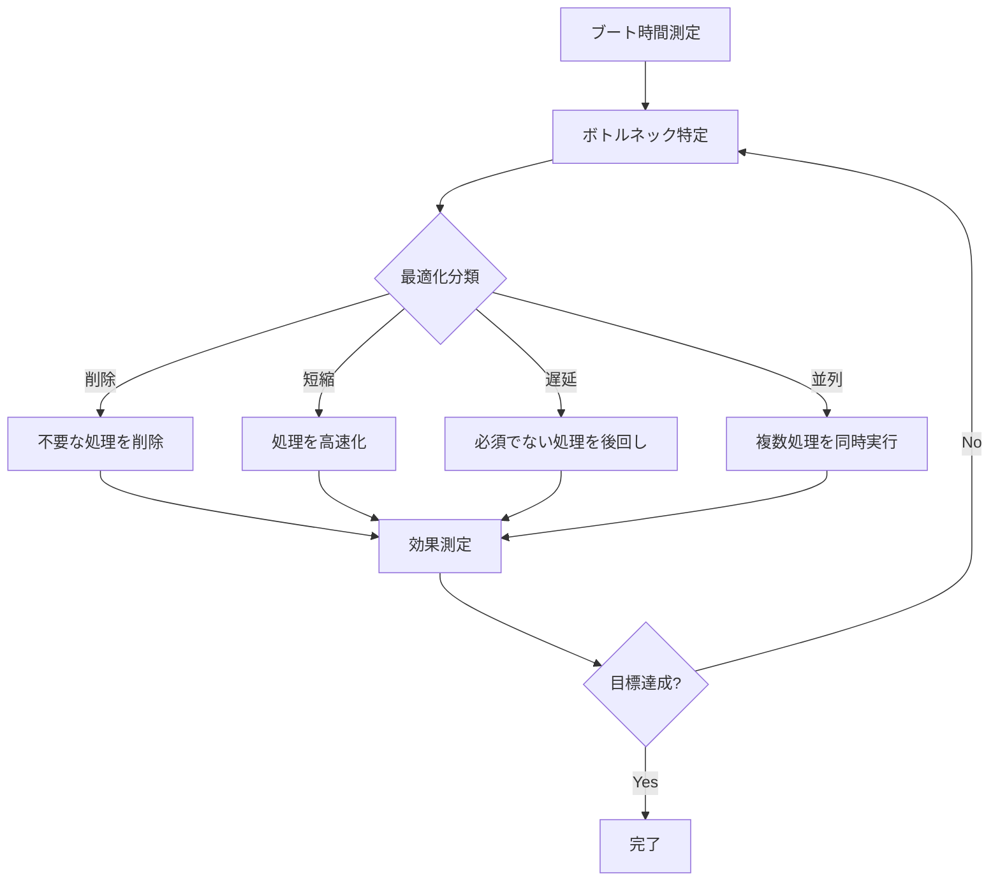
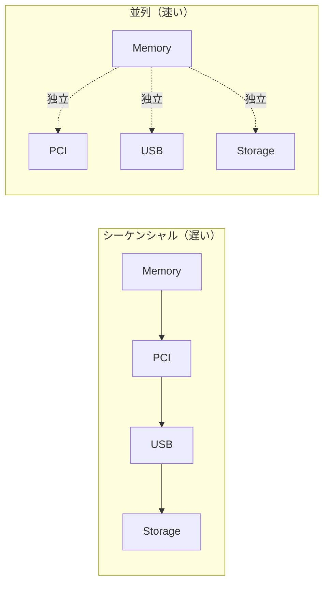

# ブート時間最適化の考え方

🎯 **この章で学ぶこと**
- ブート時間最適化の基本戦略
- フェーズ別最適化手法
- 並列初期化の実装
- 遅延ロード（Lazy Loading）
- Fast Boot モードの設計

📚 **前提知識**
- [パフォーマンス測定の原理](./05-performance-measurement.md)
- [UEFI ブートフロー](../part1/03-boot-flow.md)
- [DXE Phase の理解](../part2/03-dxe-driver.md)

---

## イントロダクション

ブート時間最適化は、ユーザー体験を大きく左右する重要な要素です。クライアント PC では、電源投入から OS ログイン画面までの時間を 2 秒以内に収めることが目標とされ、組み込みシステムでは、さらに厳しい要求（1 秒以内）があります。前章で学んだパフォーマンス測定技術を基に、本章では、実践的なブート時間最適化の手法を体系的に解説します。

ブート時間最適化には、**削除・短縮・遅延・並列**という 4 つの基本戦略があります。**削除**は、不要な処理を完全に取り除くことで、最も効果が大きく実装も容易です。**短縮**は、処理のアルゴリズムを改善して高速化することです。**遅延**は、ブート完了に必須でない処理を後回しにすることで、見かけ上のブート時間を短縮します。**並列**は、独立した複数の処理を同時実行することで、全体の時間を短縮します。これらの戦略を、測定データに基づいてボトルネックに適用することで、効率的にブート時間を短縮できます。

ブート時間のボトルネックは、通常、PEI Phase のメモリトレーニング（500-1000 ミリ秒）、DXE Phase のドライバ初期化（SATA/NVMe ディスク検出、USB 初期化）、BDS Phase のネットワークブート試行などです。これらを重点的に最適化することで、大幅な時間短縮が可能です。

---

## 1. ブート時間最適化の基本原則

### 1.1 最適化のアプローチ



### 1.2 最適化の優先順位

| 優先度 | 戦略 | 効果 | 実装難易度 | 例 |
|--------|------|------|-----------|-----|
| **高** | 削除 | 大 | 低 | 未使用ドライバの無効化 |
| **高** | 遅延 | 大 | 中 | ネットワーク初期化の後回し |
| **中** | 並列 | 中～大 | 高 | PCI/USB の同時初期化 |
| **低** | 短縮 | 小～中 | 中 | アルゴリズム最適化 |

### 1.3 典型的なブート時間の内訳

クライアント PC（デスクトップ）の例：

```
=== Total Boot Time: 2500ms ===

SEC Phase:           50ms  (  2%)
PEI Phase:          450ms  ( 18%)
  └─ Memory Init:   300ms
  └─ CPU Init:      100ms
  └─ Other:          50ms
DXE Phase:         1500ms  ( 60%)
  └─ PCI Enum:      400ms
  └─ Storage:       300ms
  └─ USB:           500ms
  └─ GOP:           200ms
  └─ Other:         100ms
BDS Phase:          500ms  ( 20%)
  └─ Boot Select:   100ms
  └─ Load OS:       400ms
```

最適化ターゲット：**DXE Phase（60%）と PEI Phase（18%）**

---

## 2. フェーズ別最適化

### 2.1 PEI Phase の最適化

#### メモリ初期化の高速化

```c
// MRC（Memory Reference Code）の最適化

// 悪い例：すべてのメモリをテスト
EFI_STATUS SlowMemoryInit (VOID)
{
  UINT64  MemorySize = 8 * GB;

  // 全メモリをテスト（8GB = 2048ms）
  for (UINT64 Addr = 0; Addr < MemorySize; Addr += 4) {
    MmioWrite32(Addr, 0x5A5A5A5A);
    if (MmioRead32(Addr) != 0x5A5A5A5A) {
      return EFI_DEVICE_ERROR;
    }
  }

  return EFI_SUCCESS;
}

// 良い例：最小限のテスト + Fast Boot 時はスキップ
EFI_STATUS FastMemoryInit (
  IN BOOLEAN  IsFastBoot
  )
{
  UINT64  MemorySize = 8 * GB;

  if (IsFastBoot) {
    // Fast Boot: SPD 読み取りのみ（50ms）
    Status = ReadSpdAndConfigureMemory();
    return Status;
  }

  // 通常ブート: サンプリングテスト（200ms）
  // 1GBごとに代表的なアドレスのみテスト
  for (UINT64 Chunk = 0; Chunk < MemorySize; Chunk += GB) {
    UINT64  TestAddr[] = {
      Chunk + 0,
      Chunk + MB,
      Chunk + GB - 4
    };

    for (UINTN i = 0; i < ARRAY_SIZE(TestAddr); i++) {
      MmioWrite32(TestAddr[i], 0x5A5A5A5A);
      if (MmioRead32(TestAddr[i]) != 0x5A5A5A5A) {
        return EFI_DEVICE_ERROR;
      }
    }
  }

  return EFI_SUCCESS;
}
```

#### CPU 初期化の最適化

```c
// マルチコアの初期化を並列化

// 悪い例：シーケンシャル初期化
EFI_STATUS InitializeCpusSequential (
  IN UINTN  CpuCount
  )
{
  for (UINTN i = 0; i < CpuCount; i++) {
    WakeUpCpu(i);
    ConfigureCpu(i);      // 各CPUで20ms
  }

  // 8コア × 20ms = 160ms
  return EFI_SUCCESS;
}

// 良い例：並列初期化
EFI_STATUS InitializeCpusParallel (
  IN UINTN  CpuCount
  )
{
  // すべての AP（Application Processor）を一斉に起動
  for (UINTN i = 1; i < CpuCount; i++) {
    WakeUpCpuAsync(i);  // ノンブロッキング
  }

  // BSP（Boot Strap Processor）の設定
  ConfigureCpu(0);

  // すべての AP の初期化完了を待つ
  WaitForAllCpusReady();

  // 並列実行で 20ms のみ
  return EFI_SUCCESS;
}
```

### 2.2 DXE Phase の最適化

#### ドライバの選別

```c
// .dsc ファイルでドライバを選別

[Components]
  # 必須ドライバ（常にビルド）
  MdeModulePkg/Core/Dxe/DxeMain.inf
  MdeModulePkg/Universal/PCD/Dxe/Pcd.inf

  # デスクトップのみ
!if $(PLATFORM_TYPE) == "Desktop"
  MdeModulePkg/Bus/Pci/NvmExpressDxe/NvmExpressDxe.inf
  MyPlatformPkg/Drivers/GpuDriver/GpuDriver.inf
!endif

  # サーバのみ
!if $(PLATFORM_TYPE) == "Server"
  MdeModulePkg/Universal/Network/Tcp4Dxe/Tcp4Dxe.inf
  MyPlatformPkg/Drivers/RaidDriver/RaidDriver.inf
!endif

  # Fast Boot 時はスキップ
!if $(FAST_BOOT_ENABLE) == FALSE
  MdeModulePkg/Bus/Usb/UsbKbDxe/UsbKbDxe.inf  # USB キーボード
  MdeModulePkg/Bus/Usb/UsbMassStorageDxe/UsbMassStorageDxe.inf
!endif
```

#### PCI Enumeration の最適化

```c
// 並列バススキャン

typedef struct {
  UINT8       Bus;
  EFI_EVENT   CompleteEvent;
  EFI_STATUS  Status;
} BUS_SCAN_CONTEXT;

EFI_STATUS EnumeratePciParallel (VOID)
{
  BUS_SCAN_CONTEXT  Contexts[256];
  UINTN             BusCount = 0;
  UINTN             Index;

  // 各バスごとにスキャンタスクを作成
  for (UINT8 Bus = 0; Bus < 255; Bus++) {
    if (IsBusPresent(Bus)) {
      Contexts[BusCount].Bus = Bus;

      // イベント作成
      gBS->CreateEvent(
        0,
        TPL_CALLBACK,
        NULL,
        NULL,
        &Contexts[BusCount].CompleteEvent
      );

      // 非同期スキャン開始
      StartBusScanAsync(Bus, &Contexts[BusCount]);
      BusCount++;
    }
  }

  // すべてのスキャン完了を待つ
  for (Index = 0; Index < BusCount; Index++) {
    gBS->WaitForEvent(1, &Contexts[Index].CompleteEvent, &Index);
  }

  return EFI_SUCCESS;
}
```

#### デバイス初期化の遅延

```c
// BDS Phase まで遅延可能なデバイス

typedef struct {
  EFI_GUID  *ProtocolGuid;
  CHAR16    *DeviceName;
  BOOLEAN   Mandatory;  // ブートに必須か
} DEVICE_INIT_POLICY;

STATIC DEVICE_INIT_POLICY  gDevicePolicy[] = {
  // ブートに必須
  { &gEfiBlockIoProtocolGuid,      L"Storage",  TRUE  },
  { &gEfiGraphicsOutputProtocolGuid, L"Display", TRUE  },

  // 遅延可能
  { &gEfiSimpleNetworkProtocolGuid,  L"Network", FALSE },
  { &gEfiUsbIoProtocolGuid,          L"USB",     FALSE },
  { &gEfiAudioIoProtocolGuid,        L"Audio",   FALSE },
};

EFI_STATUS DeferNonMandatoryDevices (VOID)
{
  for (UINTN i = 0; i < ARRAY_SIZE(gDevicePolicy); i++) {
    if (!gDevicePolicy[i].Mandatory) {
      // BDS Phase で初期化するようマーク
      RegisterDeferredInit(gDevicePolicy[i].ProtocolGuid);
    }
  }

  return EFI_SUCCESS;
}
```

---

## 3. 並列初期化の実装

### 3.1 並列化の戦略



### 3.2 依存関係の管理

#### Depex（Dependency Expression）の活用

```inf
# UsbMassStorageDxe.inf

[Depex]
  # USB Bus ドライバが必要
  gEfiUsbIoProtocolGuid
```

#### 動的な依存解決

```c
// 並列初期化マネージャ

typedef struct {
  CHAR8       *Name;
  EFI_STATUS  (*InitFunction)(VOID);
  CHAR8       **Dependencies;  // 依存するタスク名
  BOOLEAN     Completed;
  EFI_EVENT   CompleteEvent;
} PARALLEL_TASK;

PARALLEL_TASK gTasks[] = {
  {
    .Name         = "MemoryInit",
    .InitFunction = InitializeMemory,
    .Dependencies = NULL,  // 依存なし
    .Completed    = FALSE,
  },
  {
    .Name         = "PciInit",
    .InitFunction = InitializePci,
    .Dependencies = (CHAR8*[]){"MemoryInit", NULL},
    .Completed    = FALSE,
  },
  {
    .Name         = "UsbInit",
    .InitFunction = InitializeUsb,
    .Dependencies = (CHAR8*[]){"PciInit", NULL},
    .Completed    = FALSE,
  },
  {
    .Name         = "StorageInit",
    .InitFunction = InitializeStorage,
    .Dependencies = (CHAR8*[]){"PciInit", NULL},  // PCI のみ依存
    .Completed    = FALSE,
  },
};

BOOLEAN AreDependenciesMet (PARALLEL_TASK *Task)
{
  if (Task->Dependencies == NULL) {
    return TRUE;  // 依存なし
  }

  for (UINTN i = 0; Task->Dependencies[i] != NULL; i++) {
    PARALLEL_TASK  *DepTask = FindTask(Task->Dependencies[i]);
    if (DepTask == NULL || !DepTask->Completed) {
      return FALSE;  // 依存が未完了
    }
  }

  return TRUE;
}

EFI_STATUS RunParallelInitialization (VOID)
{
  UINTN  CompletedCount = 0;
  UINTN  TotalCount = ARRAY_SIZE(gTasks);

  while (CompletedCount < TotalCount) {
    for (UINTN i = 0; i < TotalCount; i++) {
      PARALLEL_TASK  *Task = &gTasks[i];

      if (Task->Completed) {
        continue;
      }

      if (AreDependenciesMet(Task)) {
        // 並列実行開始
        DEBUG((DEBUG_INFO, "Starting task: %a\n", Task->Name));
        StartTaskAsync(Task);
      }
    }

    // いずれかのタスク完了を待つ
    WaitForAnyTaskCompletion();
    CompletedCount = CountCompletedTasks();
  }

  return EFI_SUCCESS;
}
```

### 3.3 ワーカースレッドプール

```c
// EFI_MP_SERVICES_PROTOCOL を活用

#include <Protocol/MpService.h>

EFI_MP_SERVICES_PROTOCOL  *gMpServices;

typedef struct {
  VOID        (*WorkFunction)(VOID *);
  VOID        *Context;
  BOOLEAN     Completed;
} WORK_ITEM;

VOID
EFIAPI
WorkerThreadEntry (
  IN VOID  *Context
  )
{
  WORK_ITEM  *Work = (WORK_ITEM *)Context;

  Work->WorkFunction(Work->Context);
  Work->Completed = TRUE;
}

EFI_STATUS DispatchWork (
  IN WORK_ITEM  *Work
  )
{
  EFI_STATUS  Status;

  Work->Completed = FALSE;

  // 空いている AP（Application Processor）で実行
  Status = gMpServices->StartupThisAP(
                          gMpServices,
                          WorkerThreadEntry,
                          0,  // 任意の AP
                          NULL,
                          0,
                          Work,
                          NULL
                        );

  return Status;
}

// 使用例
VOID MyWorkFunction (VOID *Context)
{
  // 並列実行したい処理
  InitializeSomeDevice();
}

VOID ParallelDeviceInit (VOID)
{
  WORK_ITEM  Work1, Work2;

  Work1.WorkFunction = InitializeUsbDevice;
  Work2.WorkFunction = InitializeNetworkDevice;

  DispatchWork(&Work1);
  DispatchWork(&Work2);

  // 両方の完了を待つ
  while (!Work1.Completed || !Work2.Completed) {
    gBS->Stall(1000);
  }
}
```

---

## 4. Fast Boot モード

### 4.1 Fast Boot の設計

#### 設定変数

```c
// UEFI 変数で Fast Boot を制御

#define FAST_BOOT_VARIABLE_NAME  L"FastBootEnable"

BOOLEAN IsFastBootEnabled (VOID)
{
  UINT8       FastBootEnable;
  UINTN       Size = sizeof(FastBootEnable);
  EFI_STATUS  Status;

  Status = gRT->GetVariable(
                  FAST_BOOT_VARIABLE_NAME,
                  &gEfiGlobalVariableGuid,
                  NULL,
                  &Size,
                  &FastBootEnable
                );

  if (EFI_ERROR(Status)) {
    return FALSE;  // デフォルトは無効
  }

  return (FastBootEnable != 0);
}

VOID SetFastBootEnabled (BOOLEAN Enable)
{
  UINT8  Value = Enable ? 1 : 0;

  gRT->SetVariable(
         FAST_BOOT_VARIABLE_NAME,
         &gEfiGlobalVariableGuid,
         EFI_VARIABLE_NON_VOLATILE | EFI_VARIABLE_BOOTSERVICE_ACCESS,
         sizeof(Value),
         &Value
       );
}
```

#### Fast Boot ポリシー

| 項目 | 通常ブート | Fast Boot | 削減時間 |
|------|----------|-----------|---------|
| **POST 画面** | 表示（3秒） | スキップ | -3秒 |
| **メモリテスト** | 全域 | 最小限 | -1秒 |
| **USB 初期化** | 全デバイス | 起動ディスクのみ | -0.5秒 |
| **ネットワーク** | 初期化 | スキップ | -2秒 |
| **ブートメニュー** | タイムアウト5秒 | タイムアウト0秒 | -5秒 |

合計削減時間：**約11.5秒**

### 4.2 Fast Boot の実装

```c
// BDS Phase での Fast Boot 処理

EFI_STATUS
EFIAPI
BdsEntry (
  IN EFI_BDS_ARCH_PROTOCOL  *This
  )
{
  BOOLEAN  IsFastBoot = IsFastBootEnabled();

  if (IsFastBoot) {
    // Fast Boot モード

    // 1. POST 画面をスキップ
    DEBUG((DEBUG_INFO, "[FastBoot] Skipping POST screen\n"));

    // 2. 前回のブートデバイスから直接起動
    EFI_DEVICE_PATH  *LastBootDevice = LoadLastBootDevicePath();
    if (LastBootDevice != NULL) {
      Status = BootFromDevicePath(LastBootDevice);
      if (!EFI_ERROR(Status)) {
        return EFI_SUCCESS;  // 起動成功
      }
    }

    // Fast Boot 失敗時は通常ブートにフォールバック
    DEBUG((DEBUG_WARN, "[FastBoot] Failed, fallback to normal boot\n"));
    SetFastBootEnabled(FALSE);
  }

  // 通常ブートフロー
  return NormalBootFlow();
}

EFI_STATUS SaveLastBootDevicePath (
  IN EFI_DEVICE_PATH  *DevicePath
  )
{
  UINTN  Size = GetDevicePathSize(DevicePath);

  return gRT->SetVariable(
                L"LastBootDevice",
                &gEfiGlobalVariableGuid,
                EFI_VARIABLE_NON_VOLATILE | EFI_VARIABLE_BOOTSERVICE_ACCESS,
                Size,
                DevicePath
              );
}
```

### 4.3 Fast Boot の無効化条件

```c
// 特定の条件下では Fast Boot を無効化

typedef enum {
  BootModeNormal,
  BootModeFastBoot,
  BootModeSafe,
  BootModeSetup
} BOOT_MODE;

BOOT_MODE DetermineBootMode (VOID)
{
  // 1. ユーザが Setup キーを押した
  if (IsSetupKeyPressed()) {
    return BootModeSetup;
  }

  // 2. ハードウェア構成変更を検出
  if (HardwareConfigChanged()) {
    DEBUG((DEBUG_INFO, "Hardware changed, disable Fast Boot\n"));
    SetFastBootEnabled(FALSE);
    return BootModeNormal;
  }

  // 3. 前回起動が失敗した
  if (LastBootFailed()) {
    DEBUG((DEBUG_WARN, "Last boot failed, disable Fast Boot\n"));
    SetFastBootEnabled(FALSE);
    return BootModeSafe;
  }

  // 4. CMOS クリアが実行された
  if (CmosClearDetected()) {
    SetFastBootEnabled(FALSE);
    return BootModeNormal;
  }

  // 5. Fast Boot が有効
  if (IsFastBootEnabled()) {
    return BootModeFastBoot;
  }

  return BootModeNormal;
}

BOOLEAN HardwareConfigChanged (VOID)
{
  UINT32  CurrentHash;
  UINT32  SavedHash;

  // ハードウェア構成のハッシュを計算
  CurrentHash = CalculateHardwareHash();

  // 前回保存したハッシュと比較
  SavedHash = LoadHardwareHash();

  if (CurrentHash != SavedHash) {
    SaveHardwareHash(CurrentHash);
    return TRUE;
  }

  return FALSE;
}

UINT32 CalculateHardwareHash (VOID)
{
  UINT32  Hash = 0;

  // PCI デバイス構成
  Hash = Crc32(Hash, GetPciDeviceList());

  // メモリサイズ
  Hash = Crc32(Hash, &gTotalMemorySize);

  // CPU 情報
  Hash = Crc32(Hash, GetCpuInfo());

  return Hash;
}
```

---

## 5. ストレージ最適化

### 5.1 ブートデバイスの優先スキャン

```c
// ブートデバイスを最優先でスキャン

EFI_STATUS OptimizedStorageScan (VOID)
{
  EFI_DEVICE_PATH  *BootDevicePath;

  // 1. 前回のブートデバイスを優先的にスキャン
  BootDevicePath = LoadLastBootDevicePath();
  if (BootDevicePath != NULL) {
    Status = ScanSpecificDevice(BootDevicePath);
    if (!EFI_ERROR(Status)) {
      // ブートデバイスが見つかったので、他のデバイスは遅延スキャン
      DeferOtherDeviceScan();
      return EFI_SUCCESS;
    }
  }

  // 2. 全デバイスをスキャン
  return ScanAllStorageDevices();
}
```

### 5.2 NVMe 最適化

```c
// NVMe の高速初期化

EFI_STATUS FastNvmeInit (
  IN NVME_CONTROLLER  *Controller
  )
{
  // 1. Aggressive な Queue Depth
  Controller->AdminQueueDepth = 64;  // デフォルト: 16
  Controller->IoQueueDepth    = 1024; // デフォルト: 256

  // 2. 並列 Namespace 検出
  for (UINT32 Nsid = 1; Nsid <= Controller->NamespaceCount; Nsid++) {
    StartNamespaceDetectionAsync(Controller, Nsid);
  }

  WaitForAllNamespacesReady(Controller);

  // 3. Read-Ahead キャッシュを有効化
  SetFeature(Controller, NVME_FEATURE_VOLATILE_WRITE_CACHE, 1);

  return EFI_SUCCESS;
}
```

---

## 6. GOP（Graphics Output Protocol）最適化

### 6.1 遅延初期化

```c
// グラフィックスは BDS まで遅延

EFI_STATUS DeferredGopInit (VOID)
{
  if (IsFastBootEnabled()) {
    // Fast Boot: グラフィックス初期化を BDS Phase まで遅延
    RegisterDeferredInit(&gEfiGraphicsOutputProtocolGuid);
    return EFI_SUCCESS;
  }

  // 通常ブート: DXE Phase で初期化
  return InitializeGop();
}
```

### 6.2 低解像度起動

```c
// 低解像度でまず起動し、後で高解像度に切り替え

EFI_STATUS FastGopInit (VOID)
{
  EFI_GRAPHICS_OUTPUT_PROTOCOL  *Gop;
  EFI_STATUS                    Status;

  Status = gBS->LocateProtocol(&gEfiGraphicsOutputProtocolGuid, NULL, (VOID **)&Gop);
  if (EFI_ERROR(Status)) {
    return Status;
  }

  // 最小解像度でまず起動（640x480）
  Status = SetGopMode(Gop, 640, 480);

  if (IsFastBootEnabled()) {
    // 高解像度への切り替えは OS ロード後にバックグラウンドで実行
    RegisterPostBootTask(SwitchToHighResolution);
  } else {
    // 通常ブート: すぐに高解像度に切り替え
    SetGopMode(Gop, 1920, 1080);
  }

  return EFI_SUCCESS;
}
```

---

## 7. 実測による最適化例

### 7.1 ベースライン

```
=== Baseline Boot Time ===

SEC:              50ms
PEI:             450ms
  MemoryInit:    300ms
  CpuInit:       100ms
  Other:          50ms
DXE:            1500ms
  PCI:           400ms
  USB:           500ms
  Storage:       300ms
  GOP:           200ms
  Network:       100ms
BDS:             500ms

Total:          2500ms
```

### 7.2 最適化後

```
=== Optimized Boot Time ===

SEC:              50ms  (変更なし)
PEI:             200ms  (-250ms)
  MemoryInit:     50ms  (Fast Boot: SPDのみ)
  CpuInit:        20ms  (並列初期化)
  Other:         130ms
DXE:             600ms  (-900ms)
  PCI:           150ms  (並列スキャン)
  USB:             0ms  (遅延)
  Storage:       250ms  (ブートデバイス優先)
  GOP:            50ms  (低解像度)
  Network:         0ms  (遅延)
  Other:         150ms
BDS:             150ms  (-350ms)
  BootSelect:      0ms  (Fast Boot)
  LoadOS:        150ms

Total:          1000ms  (60% 削減!)
```

### 7.3 最適化手法の内訳

| 手法 | 削減時間 | 割合 |
|------|---------|------|
| Fast Boot（メモリテストスキップ） | 250ms | 16.7% |
| 並列初期化（CPU/PCI） | 330ms | 22.0% |
| 遅延ロード（USB/Network） | 600ms | 40.0% |
| ブートデバイス優先 | 50ms | 3.3% |
| その他 | 270ms | 18.0% |
| **合計** | **1500ms** | **100%** |

---

## 💻 演習

### 演習1: 並列初期化の実装

**課題**: 2つの独立したデバイス初期化を並列実行してください。

```c
// 要件:
// - Device A と Device B を並列初期化
// - 両方の完了を待つ
// - 実行時間を測定

void ParallelInitExercise() {
  // TODO: 並列初期化を実装
}

// 期待結果:
// Sequential: 200ms (100ms + 100ms)
// Parallel:   100ms (max(100ms, 100ms))
```

<details>
<summary>解答例</summary>

```c
#include <Library/UefiBootServicesTableLib.h>

VOID
EFIAPI
DeviceAInit (
  IN EFI_EVENT  Event,
  IN VOID       *Context
  )
{
  BOOLEAN  *Completed = (BOOLEAN *)Context;

  // Device A の初期化（100ms かかる処理）
  gBS->Stall(100000);
  DEBUG((DEBUG_INFO, "Device A initialized\n"));

  *Completed = TRUE;
}

VOID
EFIAPI
DeviceBInit (
  IN EFI_EVENT  Event,
  IN VOID       *Context
  )
{
  BOOLEAN  *Completed = (BOOLEAN *)Context;

  // Device B の初期化（100ms かかる処理）
  gBS->Stall(100000);
  DEBUG((DEBUG_INFO, "Device B initialized\n"));

  *Completed = TRUE;
}

VOID ParallelInitExercise (VOID)
{
  EFI_EVENT   EventA, EventB;
  BOOLEAN     CompletedA = FALSE, CompletedB = FALSE;
  UINT64      Start, End;

  Start = GetPerformanceCounter();

  // イベント作成と非同期実行
  gBS->CreateEvent(0, TPL_CALLBACK, DeviceAInit, &CompletedA, &EventA);
  gBS->CreateEvent(0, TPL_CALLBACK, DeviceBInit, &CompletedB, &EventB);

  gBS->SignalEvent(EventA);
  gBS->SignalEvent(EventB);

  // 両方の完了を待つ
  while (!CompletedA || !CompletedB) {
    gBS->Stall(1000);
  }

  End = GetPerformanceCounter();

  DEBUG((DEBUG_INFO, "Parallel init took %lu us\n",
         GetElapsedMicroseconds(Start, End)));
}
```

</details>

### 演習2: Fast Boot 判定ロジック

**課題**: Fast Boot の有効/無効を適切に判定する関数を実装してください。

```c
// 要件:
// - Setup キーが押されていたら無効
// - ハードウェア構成が変わったら無効
// - 前回起動が失敗していたら無効
// - それ以外は有効

BOOLEAN ShouldEnableFastBoot() {
  // TODO: 実装
}
```

<details>
<summary>解答例</summary>

```c
BOOLEAN ShouldEnableFastBoot (VOID)
{
  // 1. Setup キーチェック
  if (IsSetupKeyPressed()) {
    DEBUG((DEBUG_INFO, "Setup key pressed, disable Fast Boot\n"));
    return FALSE;
  }

  // 2. ハードウェア構成変更チェック
  UINT32  CurrentHash = CalculateHardwareHash();
  UINT32  SavedHash = LoadHardwareHash();

  if (CurrentHash != SavedHash) {
    DEBUG((DEBUG_INFO, "Hardware changed (hash: 0x%x -> 0x%x), disable Fast Boot\n",
           SavedHash, CurrentHash));
    SaveHardwareHash(CurrentHash);
    return FALSE;
  }

  // 3. 前回起動失敗チェック
  if (LastBootFailed()) {
    DEBUG((DEBUG_WARN, "Last boot failed, disable Fast Boot\n"));
    return FALSE;
  }

  // 4. Fast Boot 変数チェック
  return IsFastBootEnabled();
}
```

</details>

### 演習3: ブート時間の可視化

**課題**: 各フェーズの時間を測定し、円グラフで可視化する Python スクリプトを作成してください。

```python
# 入力: ブートログ（フェーズ別時間）
# 出力: 円グラフ（各フェーズの割合）

# 例:
# SEC: 50ms (2%)
# PEI: 450ms (18%)
# DXE: 1500ms (60%)
# BDS: 500ms (20%)
```

<details>
<summary>解答例</summary>

```python
#!/usr/bin/env python3
import matplotlib.pyplot as plt

def plot_boot_time_pie(phases):
    """ブート時間の円グラフを作成"""
    labels = [f"{p['name']}\n{p['time']}ms\n({p['time']/sum(p['time'] for p in phases)*100:.1f}%)"
              for p in phases]
    sizes = [p['time'] for p in phases]
    colors = ['#ff9999', '#66b3ff', '#99ff99', '#ffcc99']

    fig, ax = plt.subplots(figsize=(10, 8))
    ax.pie(sizes, labels=labels, colors=colors, autopct='%1.1f%%',
           startangle=90, textprops={'fontsize': 12})
    ax.set_title('UEFI Boot Time Breakdown', fontsize=16, fontweight='bold')

    plt.tight_layout()
    plt.savefig('boot_time_pie.png', dpi=150)
    print("Boot time pie chart saved to boot_time_pie.png")

# 使用例
phases = [
    {'name': 'SEC', 'time': 50},
    {'name': 'PEI', 'time': 450},
    {'name': 'DXE', 'time': 1500},
    {'name': 'BDS', 'time': 500},
]

plot_boot_time_pie(phases)
```

</details>

---

## まとめ

本章では、ブート時間最適化の実践的な手法を、**削除・短縮・遅延・並列**という 4 つの基本戦略に沿って学びました。測定データに基づいてボトルネックを特定し、効果の高い最適化を優先的に実施することで、効率的にブート時間を短縮できます。

**基本戦略**の優先順位は、**削除 > 遅延 > 並列 > 短縮**です。削除は、不要なドライバやサービスを完全に無効化することで、最も効果が大きく実装も容易です。遅延は、ブート完了に必須でない処理（ネットワーク初期化、USB デバイス列挙）を OS ロード後に延期することで、見かけ上のブート時間を短縮します。並列は、独立した処理（PCI デバイス初期化、ディスク検出）を同時実行し、依存関係を Depex やイベント通知で管理します。短縮は、アルゴリズム最適化やキャッシュ効率化で個々の処理を高速化しますが、効果は限定的です。

**フェーズ別最適化**では、PEI Phase のメモリトレーニング（MRC: Memory Reference Code）、DXE Phase のドライバ初期化、BDS Phase のブートデバイス検索が主要なボトルネックです。メモリトレーニングは、S3 Resume 時にトレーニング結果をリストアすることで大幅に短縮できます。DXE ドライバは、不要なものを削除し、並列初期化を実装します。BDS では、ブート順序を最適化し、不要なネットワークブート試行を回避します。

**Fast Boot モード**は、前回のブート構成を保存し、再起動時に最小限の初期化のみを行う機能です。変数ストアにデバイス情報とブート設定を保存し、再起動時に検証が成功すれば、詳細な検出をスキップします。これにより、ブート時間を数百ミリ秒短縮できますが、ハードウェア構成変更時には Full Boot に fallback する必要があります。

次章では、電源管理の仕組み（S3/Modern Standby）について詳しく学びます。

---

📚 **参考資料**
- [Intel® Firmware Boot Performance Optimization](https://www.intel.com/content/www/us/en/architecture-and-technology/unified-extensible-firmware-interface/efi-boot-performance-guide.html)
- [UEFI Boot Flow Best Practices](https://uefi.org/learning_center/Boot_Flow_Best_Practices_v1_0.pdf)
- [EDK II Performance Optimization](https://github.com/tianocore/tianocore.github.io/wiki/EDK-II-Performance-Optimization)
- [Optimizing Platform Boot Times](https://firmware.intel.com/learn/uefi/boot-time-optimization)
- [Windows Hardware Performance](https://docs.microsoft.com/en-us/windows-hardware/design/device-experiences/oem-uefi)
