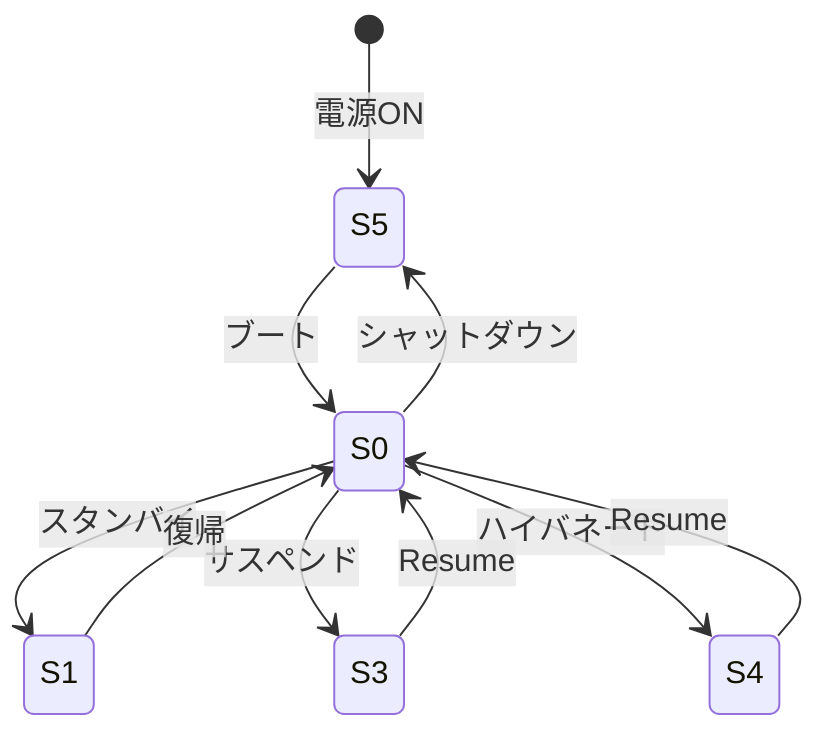
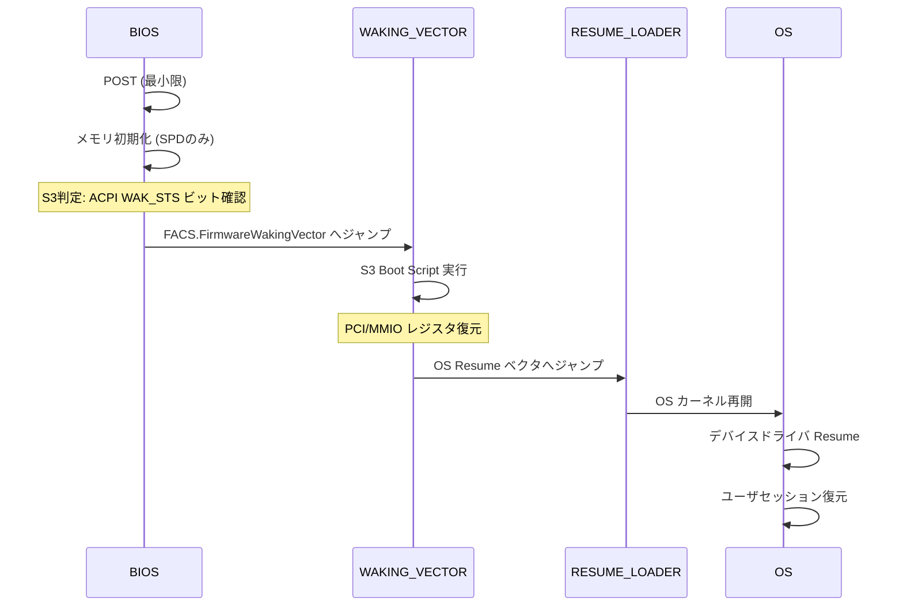
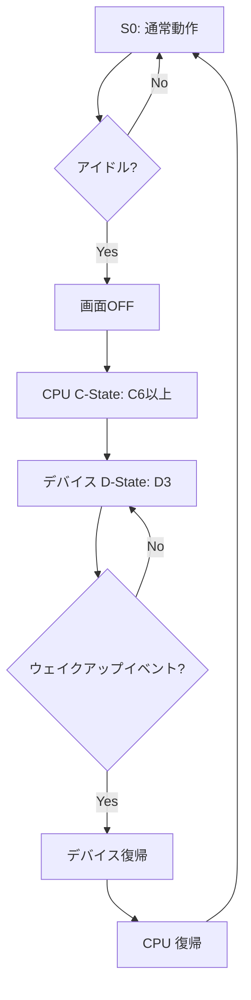

# 電源管理の仕組み (S3/Modern Standby)

🎯 **この章で学ぶこと**
- ACPI 電源状態の基礎（S0/S3/S4/S5）
- S3 (Suspend to RAM) の実装
- Modern Standby の仕組み
- Resume パスの詳細
- 電源管理のデバッグ手法

📚 **前提知識**
- [ACPI の基礎](../part3/06-acpi-tables.md)
- [プラットフォーム初期化](../part3/01-platform-init.md)
- C言語とアセンブリの基本

---

## 1. ACPI 電源状態の概要

### 1.1 Sステート (System States)

ACPI では、システム全体の電源状態を **Sステート** で定義しています：

| 状態 | 名称 | 説明 | 消費電力 | 復帰時間 |
|------|------|------|---------|---------|
| **S0** | Working | 通常動作状態 | 最大 | - |
| **S1** | Standby | CPU停止、RAMアクティブ | 中 | < 1秒 |
| **S2** | (未使用) | - | - | - |
| **S3** | Suspend to RAM | RAM以外は電源OFF | 小 | 1～3秒 |
| **S4** | Hibernate | すべて電源OFF、ディスク保存 | 最小 | 5～10秒 |
| **S5** | Soft Off | 完全シャットダウン | 0 | 電源ボタン |



### 1.2 Cステート (CPU States)

S0状態内でのCPUの省電力状態：

| 状態 | 説明 | 消費電力 | 復帰時間 |
|------|------|---------|---------|
| **C0** | 実行中 | 100% | - |
| **C1** | Halt | 50% | < 1µs |
| **C2** | Stop Clock | 30% | < 10µs |
| **C3** | Deep Sleep | 10% | < 100µs |
| **C6** | Package Sleep | 5% | < 1ms |

---

## 2. S3 (Suspend to RAM) の実装

### 2.1 S3への遷移

#### ACPI メソッド

```asl
// ACPI ASL コード

DefinitionBlock ("DSDT.aml", "DSDT", 2, "MYOEM", "MYPLATF", 1)
{
    // S3サポートの宣言
    Name (\_S3, Package (0x04)
    {
        0x03,  // SLP_TYPa (PM1a_CNT.SLP_TYP)
        0x03,  // SLP_TYPb (PM1b_CNT.SLP_TYP)
        0x00,  // Reserved
        0x00   // Reserved
    })

    // _PTS: Prepare To Sleep
    Method (_PTS, 1, NotSerialized)
    {
        // Arg0 = Sstate (3 for S3)
        If (Arg0 == 3)
        {
            // S3準備処理
            // - デバイスの電源管理
            // - ウェイクアップソースの設定
        }
    }

    // _WAK: Wake
    Method (_WAK, 1, NotSerialized)
    {
        // Arg0 = Sstate from which waking
        If (Arg0 == 3)
        {
            // S3からの復帰処理
        }
        Return (Package (0x02) { 0, 0 })
    }
}
```

#### OS からの S3 要求

```c
// Linux カーネルの例（簡略化）

int enter_s3_state(void)
{
    // 1. すべてのデバイスをサスペンド
    device_suspend();

    // 2. CPU以外を停止
    disable_nonboot_cpus();

    // 3. ACPI の _PTS メソッドを実行
    acpi_execute_method("\\_PTS", 3);

    // 4. PM1 Control Register に SLP_TYP + SLP_EN を書き込み
    outw(PM1_CNT, (0x03 << 10) | (1 << 13));

    // ここで S3 に入る（CPU停止）
    // ...

    // Resume後、ここから再開
    // 5. ACPI の _WAK メソッドを実行
    acpi_execute_method("\\_WAK", 3);

    // 6. デバイスを再開
    device_resume();

    return 0;
}
```

### 2.2 UEFI での S3 準備

#### S3 Boot Script の作成

```c
// DXE Phase で S3 Boot Script を記録

#include <Library/S3BootScriptLib.h>

EFI_STATUS
EFIAPI
SaveDeviceStateForS3 (
  IN  PCI_DEVICE  *Device
  )
{
  EFI_STATUS  Status;
  UINT32      Value;

  // PCI Config Space の保存と復元をスクリプトに記録

  // 1. Command Register の保存
  Value = PciRead32(Device->Bus, Device->Dev, Device->Func, PCI_COMMAND_OFFSET);

  Status = S3BootScriptSavePciCfgWrite(
             S3BootScriptWidthUint32,
             PCI_LIB_ADDRESS(Device->Bus, Device->Dev, Device->Func, PCI_COMMAND_OFFSET),
             1,
             &Value
           );

  // 2. BAR (Base Address Register) の保存
  for (UINTN i = 0; i < 6; i++) {
    Value = PciRead32(Device->Bus, Device->Dev, Device->Func, PCI_BAR_OFFSET + i * 4);

    Status = S3BootScriptSavePciCfgWrite(
               S3BootScriptWidthUint32,
               PCI_LIB_ADDRESS(Device->Bus, Device->Dev, Device->Func, PCI_BAR_OFFSET + i * 4),
               1,
               &Value
             );
  }

  // 3. デバイス固有のレジスタ
  // 例: USB Controller の設定
  if (Device->Class == PCI_CLASS_SERIAL_USB) {
    // MMIO レジスタの保存
    UINT32  UsbCmdReg = MmioRead32(Device->BaseAddress + USB_CMD_OFFSET);

    Status = S3BootScriptSaveMemWrite(
               S3BootScriptWidthUint32,
               Device->BaseAddress + USB_CMD_OFFSET,
               1,
               &UsbCmdReg
             );
  }

  return EFI_SUCCESS;
}
```

#### S3 Boot Script の構造

```c
// S3 Boot Script のエントリ構造

typedef enum {
  EfiBootScriptWidthUint8,
  EfiBootScriptWidthUint16,
  EfiBootScriptWidthUint32,
  EfiBootScriptWidthUint64,
} EFI_BOOT_SCRIPT_WIDTH;

typedef struct {
  UINT16                  OpCode;    // 操作コード
  UINT8                   Length;    // エントリ長
  EFI_BOOT_SCRIPT_WIDTH   Width;     // アクセス幅
  UINT64                  Address;   // 対象アドレス
  UINT32                  Count;     // 繰り返し回数
  UINT8                   Value[];   // 書き込む値
} S3_BOOT_SCRIPT_ENTRY;

// OpCode の種類
#define S3_BOOT_SCRIPT_IO_WRITE          0x00
#define S3_BOOT_SCRIPT_IO_READ_WRITE     0x01
#define S3_BOOT_SCRIPT_MEM_WRITE         0x02
#define S3_BOOT_SCRIPT_MEM_READ_WRITE    0x03
#define S3_BOOT_SCRIPT_PCI_CFG_WRITE     0x04
#define S3_BOOT_SCRIPT_PCI_CFG_READ_WRITE 0x05
#define S3_BOOT_SCRIPT_DISPATCH          0x06  // 関数呼び出し
#define S3_BOOT_SCRIPT_STALL             0x07  // 待機
```

### 2.3 S3 Resume パス



#### S3 Resume の実装

```c
// PEI Phase での S3 判定

#include <Ppi/BootScriptExecutor.h>

EFI_STATUS
EFIAPI
PeiS3ResumeCheck (
  IN CONST EFI_PEI_SERVICES  **PeiServices
  )
{
  EFI_ACPI_3_0_ROOT_SYSTEM_DESCRIPTION_POINTER  *Rsdp;
  EFI_ACPI_3_0_FIXED_ACPI_DESCRIPTION_TABLE     *Fadt;
  UINT16                                        Pm1Sts;

  // 1. ACPI RSDP を探す
  Rsdp = FindAcpiRsdp();

  // 2. FADT を取得
  Fadt = (EFI_ACPI_3_0_FIXED_ACPI_DESCRIPTION_TABLE *)(UINTN)Rsdp->XsdtAddress;

  // 3. PM1_STS レジスタを読む
  Pm1Sts = IoRead16(Fadt->Pm1aEvtBlk);

  // 4. WAK_STS ビット (bit 15) をチェック
  if ((Pm1Sts & BIT15) != 0) {
    // S3 Resume パス
    DEBUG((DEBUG_INFO, "S3 Resume detected\n"));

    // S3 Boot Script Executor PPI を取得
    PEI_S3_RESUME_PPI  *S3ResumePpi;
    Status = PeiServicesLocatePpi(
               &gPeiS3ResumePpiGuid,
               0,
               NULL,
               (VOID **)&S3ResumePpi
             );

    if (!EFI_ERROR(Status)) {
      // S3 Boot Script を実行
      Status = S3ResumePpi->S3RestoreConfig(PeiServices);
    }

    // FACS の Firmware Waking Vector へジャンプ
    JumpToWakingVector(Facs->FirmwareWakingVector);

    // ここには戻ってこない
  }

  // 通常ブート
  return EFI_SUCCESS;
}
```

#### S3 Boot Script の実行

```c
// S3 Boot Script Executor の実装

EFI_STATUS
EFIAPI
ExecuteS3BootScript (
  IN UINT8  *ScriptBase,
  IN UINTN  ScriptSize
  )
{
  UINT8   *Script = ScriptBase;
  UINT8   *ScriptEnd = ScriptBase + ScriptSize;

  while (Script < ScriptEnd) {
    S3_BOOT_SCRIPT_ENTRY  *Entry = (S3_BOOT_SCRIPT_ENTRY *)Script;

    switch (Entry->OpCode) {
      case S3_BOOT_SCRIPT_IO_WRITE:
        // I/O ポートへ書き込み
        IoWrite32((UINT16)Entry->Address, *(UINT32 *)Entry->Value);
        break;

      case S3_BOOT_SCRIPT_MEM_WRITE:
        // メモリへ書き込み
        MmioWrite32(Entry->Address, *(UINT32 *)Entry->Value);
        break;

      case S3_BOOT_SCRIPT_PCI_CFG_WRITE:
        // PCI Config Space へ書き込み
        PciWrite32(Entry->Address, *(UINT32 *)Entry->Value);
        break;

      case S3_BOOT_SCRIPT_DISPATCH:
        // 関数呼び出し
        DISPATCH_ENTRY  *DispatchEntry = (DISPATCH_ENTRY *)Entry;
        DispatchEntry->EntryPoint(DispatchEntry->Context);
        break;

      case S3_BOOT_SCRIPT_STALL:
        // 待機
        gBS->Stall(*(UINT32 *)Entry->Value);
        break;

      default:
        DEBUG((DEBUG_ERROR, "Unknown S3 script opcode: 0x%x\n", Entry->OpCode));
        return EFI_INVALID_PARAMETER;
    }

    Script += Entry->Length;
  }

  return EFI_SUCCESS;
}
```

---

## 3. Modern Standby (Connected Standby)

### 3.1 Modern Standby の概要

Modern Standby（旧称 Connected Standby）は、Windows 8 以降でサポートされる新しい省電力モード：

| 項目 | 従来の S3 | Modern Standby |
|------|----------|---------------|
| **電源状態** | S3 | S0 (低電力アイドル) |
| **ネットワーク** | 切断 | 接続維持 |
| **通知** | 不可 | メール・SNSなど受信可 |
| **復帰時間** | 1～3秒 | < 1秒 |
| **実装** | BIOS主導 | OS主導 |



### 3.2 BIOS の要件

#### Low Power S0 Idle (LPSS) のサポート

```asl
// ACPI FADT の Flags

DefinitionBlock ("FACP.aml", "FACP", 5, "MYOEM", "MYPLATF", 1)
{
    // Low Power S0 Idle Capable フラグを設定
    [0x70] DWORD Flags = 0x000480B5
    //                           ↑ Bit 21: Low Power S0 Idle Capable
}
```

#### _LPI (Low Power Idle States) メソッド

```asl
// システムレベルの低電力状態を定義

Device (\_SB)
{
    // _LPI: Low Power Idle States
    Method (_LPI, 0, NotSerialized)
    {
        Return (Package (0x03)
        {
            0,  // Revision
            1,  // LPI State Count
            Package (0x0A)  // LPI State 0
            {
                2500,  // Min Residency (us)
                10,    // Wake Latency (us)
                1,     // Flags
                0,     // Arch Context Lost Flags
                0,     // Residency Counter Frequency
                0,     // Enabled Parent State
                ResourceTemplate () { Register (SystemIO, 8, 0, 0x1840) },  // Entry Method
                ResourceTemplate () { Register (SystemMemory, 0, 0, 0) },  // Residency Counter
                ResourceTemplate () { Register (SystemMemory, 0, 0, 0) },  // Usage Counter
                "C10"  // State Name
            }
        })
    }
}
```

### 3.3 デバイスの電源管理

#### D-State (Device Power States)

| 状態 | 説明 | 消費電力 |
|------|------|---------|
| **D0** | Fully On | 100% |
| **D1** | Low Power | 50% |
| **D2** | Lower Power | 20% |
| **D3hot** | Off (電源供給あり) | 5% |
| **D3cold** | Off (電源供給なし) | 0% |

```asl
// USB Controller の電源管理

Device (USB0)
{
    Name (_ADR, 0x00140000)  // Bus 0, Dev 20, Func 0

    // _PS0: Power State 0 (D0)
    Method (_PS0, 0, Serialized)
    {
        // デバイスを D0 (Full Power) に遷移
        Store (0x00, \_SB.PCI0.USB0.PWRG)  // Power Gate OFF
    }

    // _PS3: Power State 3 (D3)
    Method (_PS3, 0, Serialized)
    {
        // デバイスを D3 (Off) に遷移
        Store (0x01, \_SB.PCI0.USB0.PWRG)  // Power Gate ON
    }

    // _PR0: Power Resources for D0
    Name (_PR0, Package (0x01) { UPWR })

    // _PR3: Power Resources for D3hot
    Name (_PR3, Package (0x01) { UPWR })

    PowerResource (UPWR, 0, 0)
    {
        Method (_STA, 0, NotSerialized)
        {
            // 電源状態を返す (0=OFF, 1=ON)
            Return (\_SB.PCI0.USB0.PWRG ^ 1)
        }

        Method (_ON, 0, NotSerialized)
        {
            // 電源ON
            Store (0x00, \_SB.PCI0.USB0.PWRG)
        }

        Method (_OFF, 0, NotSerialized)
        {
            // 電源OFF
            Store (0x01, \_SB.PCI0.USB0.PWRG)
        }
    }
}
```

---

## 4. Wake Sources (ウェイクアップソース)

### 4.1 ウェイクアップイベント

S3/Modern Standby からの復帰トリガー：

| ソース | 説明 | ACPI GPE |
|-------|------|----------|
| **電源ボタン** | ハードウェアボタン | GPE0 |
| **RTC アラーム** | タイマー | GPE0 Bit 8 |
| **LAN (Wake-on-LAN)** | ネットワークパケット | GPE0 Bit 13 |
| **USB デバイス** | キーボード・マウス | GPE0 Bit 14 |
| **PCIE** | PCIe PME | GPE0 Bit 9 |

#### GPE (General Purpose Event) の設定

```asl
// ACPI GPE Block

Scope (\_GPE)
{
    // _L0D: GPE13 Level-Triggered Event Handler (LAN Wake)
    Method (_L0D, 0, NotSerialized)
    {
        Notify (\_SB.PCI0.LAN0, 0x02)  // Device Wake
    }

    // _L0E: GPE14 Level-Triggered Event Handler (USB Wake)
    Method (_L0E, 0, NotSerialized)
    {
        Notify (\_SB.PCI0.USB0, 0x02)  // Device Wake
    }

    // _L08: GPE8 Level-Triggered Event Handler (RTC)
    Method (_L08, 0, NotSerialized)
    {
        // RTC Alarm による Wake
        Notify (\_SB.PCI0.RTC, 0x02)
    }
}
```

#### Wake-on-LAN の設定

```c
// UEFI Setup での Wake-on-LAN 設定

#include <Library/PcdLib.h>

EFI_STATUS
EFIAPI
ConfigureWakeOnLan (
  IN BOOLEAN  Enable
  )
{
  UINT32  PmcBase;
  UINT32  GpeSts, GpeEn;

  // PMC (Power Management Controller) Base Address
  PmcBase = PciRead32(PCI_LIB_ADDRESS(0, 31, 2, 0x48));

  if (Enable) {
    // GPE0_EN レジスタで LAN Wake を有効化
    GpeEn = MmioRead32(PmcBase + R_PMC_GEN_PMCON_A);
    GpeEn |= B_PMC_GPE0_EN_LAN_WAKE;  // Bit 13
    MmioWrite32(PmcBase + R_PMC_GEN_PMCON_A, GpeEn);

    // LAN Controller に WOL Magic Packet を設定
    ConfigureLanWolMagicPacket();

    DEBUG((DEBUG_INFO, "Wake-on-LAN enabled\n"));
  } else {
    // 無効化
    GpeEn = MmioRead32(PmcBase + R_PMC_GEN_PMCON_A);
    GpeEn &= ~B_PMC_GPE0_EN_LAN_WAKE;
    MmioWrite32(PmcBase + R_PMC_GEN_PMCON_A, GpeEn);

    DEBUG((DEBUG_INFO, "Wake-on-LAN disabled\n"));
  }

  return EFI_SUCCESS;
}
```

---

## 5. 電源管理のデバッグ

### 5.1 S3 Resume の失敗パターン

| 症状 | 原因 | 対策 |
|------|------|------|
| Resume せず再起動 | S3 Boot Script 不良 | Script ログ確認 |
| 画面が真っ黒 | GOP 未復元 | GOP復元 Script 追加 |
| デバイスが認識されない | PCI BAR 未復元 | BAR 復元 Script 追加 |
| Hang | デッドロック | TPL・割り込み確認 |

#### S3 Boot Script のダンプ

```c
// S3 Boot Script の内容をダンプ

VOID DumpS3BootScript (
  IN UINT8  *ScriptBase,
  IN UINTN  ScriptSize
  )
{
  UINT8  *Script = ScriptBase;

  DEBUG((DEBUG_INFO, "=== S3 Boot Script Dump ===\n"));
  DEBUG((DEBUG_INFO, "Base: 0x%p, Size: 0x%x\n", ScriptBase, ScriptSize));

  while (Script < ScriptBase + ScriptSize) {
    S3_BOOT_SCRIPT_ENTRY  *Entry = (S3_BOOT_SCRIPT_ENTRY *)Script;

    switch (Entry->OpCode) {
      case S3_BOOT_SCRIPT_IO_WRITE:
        DEBUG((DEBUG_INFO, "[IO_WRITE] Port=0x%04x Value=0x%08x\n",
               (UINT16)Entry->Address, *(UINT32 *)Entry->Value));
        break;

      case S3_BOOT_SCRIPT_MEM_WRITE:
        DEBUG((DEBUG_INFO, "[MEM_WRITE] Addr=0x%016lx Value=0x%08x\n",
               Entry->Address, *(UINT32 *)Entry->Value));
        break;

      case S3_BOOT_SCRIPT_PCI_CFG_WRITE:
        DEBUG((DEBUG_INFO, "[PCI_WRITE] Addr=0x%016lx Value=0x%08x\n",
               Entry->Address, *(UINT32 *)Entry->Value));
        break;

      default:
        DEBUG((DEBUG_INFO, "[UNKNOWN] OpCode=0x%02x\n", Entry->OpCode));
        break;
    }

    Script += Entry->Length;
  }

  DEBUG((DEBUG_INFO, "=== End of Script ===\n"));
}
```

### 5.2 Modern Standby のデバッグ

#### SleepStudy レポート (Windows)

```powershell
# Windows の SleepStudy レポート生成
powercfg /sleepstudy

# レポート例:
# - 各 Modern Standby セッションの時間
# - デバイスごとの電力消費
# - ウェイクアップイベント
```

#### ファームウェアログ

```c
// Modern Standby イベントのログ記録

VOID LogModernStandbyEvent (
  IN CHAR8  *EventName,
  IN UINT64 Timestamp
  )
{
  // ログをメモリバッファに記録
  MODERN_STANDBY_LOG_ENTRY  *Entry;

  Entry = AllocateLogEntry();
  if (Entry == NULL) {
    return;
  }

  AsciiStrCpyS(Entry->EventName, sizeof(Entry->EventName), EventName);
  Entry->Timestamp = Timestamp;
  Entry->PowerState = GetCurrentPowerState();

  // S3 Resume 後も保持される ACPI NVS 領域に保存
  SaveToAcpiNvs(Entry);
}

// 使用例
LogModernStandbyEvent("ScreenOff", GetTimestamp());
LogModernStandbyEvent("DeviceD3", GetTimestamp());
LogModernStandbyEvent("PackageC10", GetTimestamp());
```

---

## 💻 演習

### 演習1: S3 Boot Script の記録

**課題**: PCI デバイスの設定を S3 Boot Script に記録してください。

```c
// 要件:
// - PCI Command Register の保存
// - PCI BAR0～BAR5 の保存
// - S3 Resume 時に自動復元される

EFI_STATUS SavePciDeviceForS3 (
  IN UINT8  Bus,
  IN UINT8  Dev,
  IN UINT8  Func
  )
{
  // TODO: 実装
}
```

<details>
<summary>解答例</summary>

前述の「2.2 UEFI での S3 準備」の `SaveDeviceStateForS3()` を参照。

</details>

### 演習2: Wake-on-LAN の実装

**課題**: Wake-on-LAN を有効化する関数を実装してください。

```c
// 要件:
// - PMC の GPE0_EN レジスタで LAN Wake (Bit 13) を有効化
// - LAN Controller の PME (Power Management Event) を設定
// - Magic Packet で Wake 可能にする

EFI_STATUS EnableWakeOnLan (VOID)
{
  // TODO: 実装
}
```

<details>
<summary>解答例</summary>

前述の「4.1 ウェイクアップイベント」の `ConfigureWakeOnLan()` を参照。

</details>

### 演習3: S3 Resume デバッグツール

**課題**: S3 Resume の各ステージで時間を測定するツールを作成してください。

```c
// 要件:
// - PEI S3 Resume 開始時刻
// - S3 Boot Script 実行時間
// - OS Waking Vector ジャンプ時刻
// - 合計 Resume 時間

typedef struct {
  UINT64  PeiS3Start;
  UINT64  ScriptStart;
  UINT64  ScriptEnd;
  UINT64  WakingVectorJump;
} S3_RESUME_PROFILE;

VOID ProfileS3Resume (VOID)
{
  // TODO: 実装
}
```

<details>
<summary>解答例</summary>

```c
#include <Library/TimerLib.h>

STATIC S3_RESUME_PROFILE  gS3Profile;

VOID ProfileS3Resume (VOID)
{
  gS3Profile.PeiS3Start = GetPerformanceCounter();

  // S3 Boot Script 実行
  gS3Profile.ScriptStart = GetPerformanceCounter();
  ExecuteS3BootScript(ScriptBase, ScriptSize);
  gS3Profile.ScriptEnd = GetPerformanceCounter();

  // Waking Vector へジャンプ前
  gS3Profile.WakingVectorJump = GetPerformanceCounter();

  // レポート出力（次回ブート時に表示）
  SaveS3ProfileToNvs(&gS3Profile);

  // Waking Vector へジャンプ
  JumpToWakingVector(WakingVector);
}

VOID PrintS3ResumeProfile (VOID)
{
  S3_RESUME_PROFILE  *Profile;
  UINT64             Freq;

  Profile = LoadS3ProfileFromNvs();
  if (Profile == NULL) {
    return;
  }

  Freq = GetPerformanceCounterProperties(NULL, NULL);

  DEBUG((DEBUG_INFO, "=== S3 Resume Profile ===\n"));
  DEBUG((DEBUG_INFO, "Script Execution: %lu ms\n",
         DivU64x64Remainder(
           MultU64x32(Profile->ScriptEnd - Profile->ScriptStart, 1000),
           Freq,
           NULL
         )));
  DEBUG((DEBUG_INFO, "Total Resume Time: %lu ms\n",
         DivU64x64Remainder(
           MultU64x32(Profile->WakingVectorJump - Profile->PeiS3Start, 1000),
           Freq,
           NULL
         )));
}
```

</details>

---

## まとめ

この章では、ACPI 電源管理の仕組みについて学びました：

| トピック | 重要ポイント |
|---------|------------|
| **Sステート** | S0/S3/S4/S5 の違いと用途 |
| **S3 実装** | Boot Script による状態保存・復元 |
| **Modern Standby** | S0アイドル状態での省電力 |
| **Wake Sources** | GPE によるウェイクアップ制御 |
| **デバッグ** | Script ダンプ・プロファイル測定 |

次章では、ファームウェア更新の仕組みについて詳しく学びます。

---

📚 **参考資料**
- [ACPI Specification Version 6.5](https://uefi.org/specifications) - Chapter 7: Power and Performance Management
- [Intel® Low Power S0 Idle](https://www.intel.com/content/www/us/en/developer/articles/technical/modern-standby.html)
- [S3 Boot Script Specification](https://tianocore-docs.github.io/edk2-UefiDriverWritersGuide/draft/20_s3_support/)
- [Windows Modern Standby](https://docs.microsoft.com/en-us/windows-hardware/design/device-experiences/modern-standby)
- [Linux Suspend and Resume](https://www.kernel.org/doc/html/latest/power/suspend-and-resume.html)
