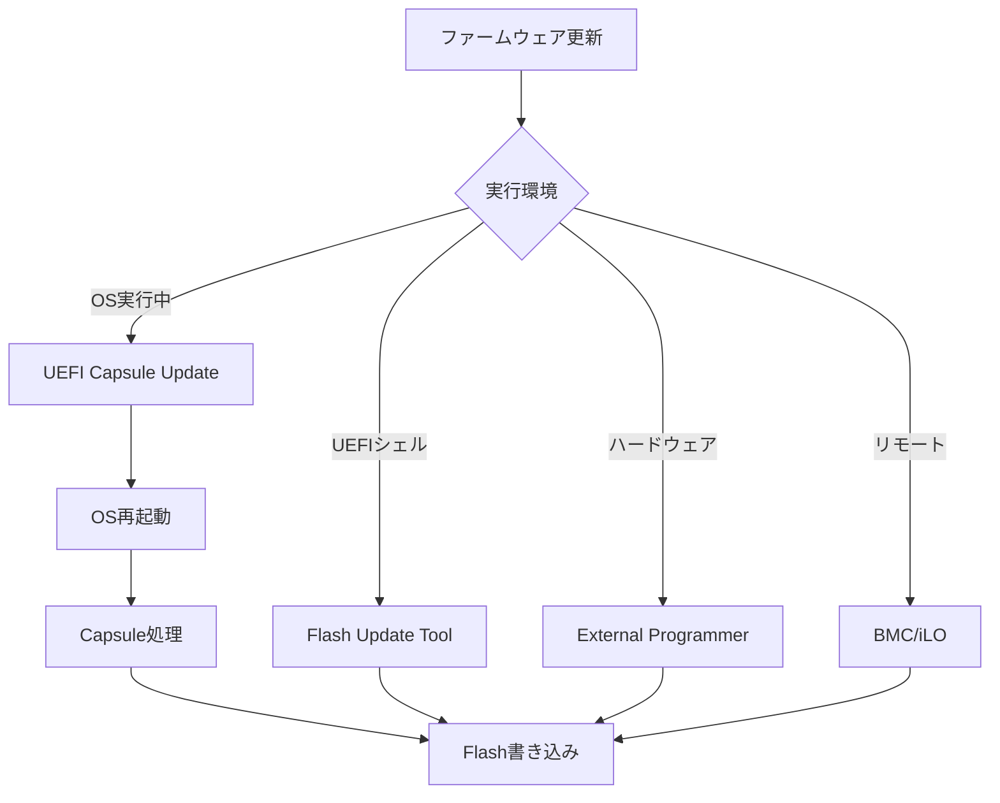
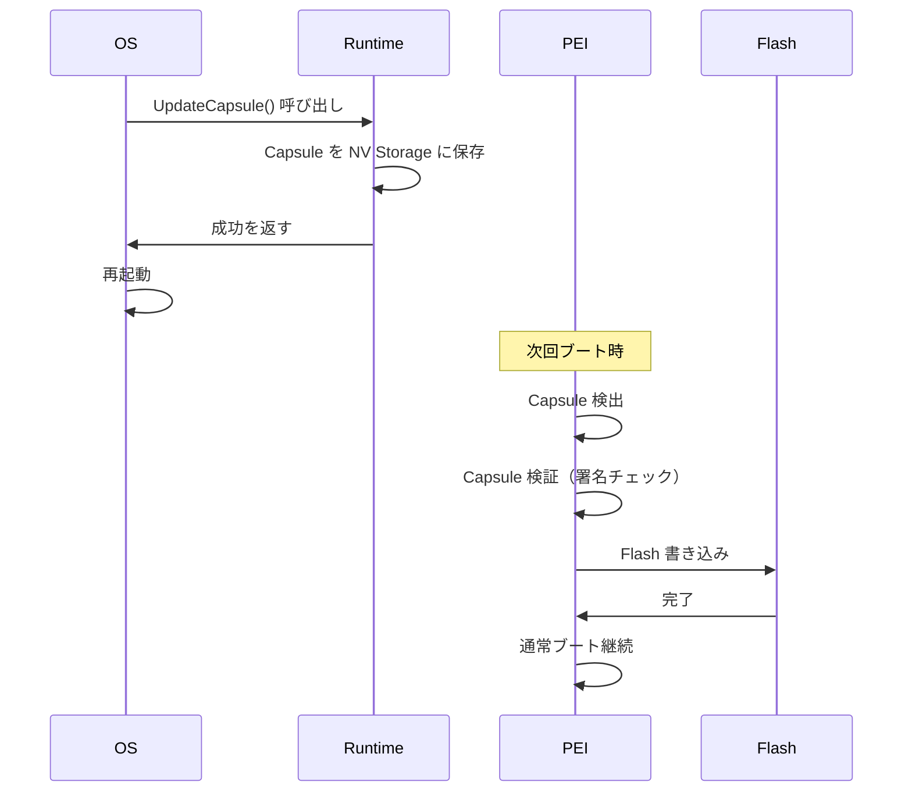

# ファームウェア更新の仕組み

🎯 **この章で学ぶこと**
- UEFI Capsule Update の仕組み
- フラッシュメモリの書き込み
- 安全な更新プロセスの設計
- ロールバック機構
- 更新の検証とセキュリティ

📚 **前提知識**
- [SPI Flash の基礎](../part3/07-spi-flash.md)
- [セキュア更新](../part4/04-firmware-update-security.md)
- UEFI ブートフローの理解

---

## イントロダクション

ファームウェア更新は、セキュリティパッチ適用、機能追加、バグ修正のために不可欠な機能です。しかし、更新に失敗するとシステムが起動不能（ブリック）になるリスクがあるため、安全な更新メカニズムの設計が極めて重要です。UEFI Capsule Update は、OS 実行中にファームウェアイメージをメモリに配置し、再起動時にファームウェアが自動的に更新を実行する標準的な仕組みです。本章では、Capsule Update の実装、SPI Flash の書き込み、ロールバック機構、更新の検証とセキュリティについて解説します。

ファームウェア更新には、UEFI Capsule（OS統合）、UEFI Shell ツール、外部プログラマ（CH341A など）、BMC 経由（サーバ）といった複数の方法があります。Capsule Update は、OS が提供する UI から更新を開始でき、ユーザーフレンドリですが、実装が複雑です。更新プロセスでは、署名検証、バージョンチェック、A/B パーティション、ロールバック機構などのセキュリティ対策が必須です。

---

## 1. ファームウェア更新の基本

### 1.1 更新方法の分類

| 方法 | 実行環境 | 利点 | 欠点 |
|------|---------|------|------|
| **UEFI Capsule** | OS実行中 | OS統合、ユーザフレンドリ | 複雑 |
| **UEFI Shell** | UEFI環境 | シンプル | OS起動前のみ |
| **外部プログラマ** | ハードウェア | 確実 | 専用機材が必要 |
| **BMC経由** | サーバ | リモート可能 | サーバのみ |



### 1.2 UEFI Capsule Update のフロー



---

## 2. UEFI Capsule の実装

### 2.1 Capsule の構造

```c
// UEFI Capsule ヘッダ

typedef struct {
  EFI_GUID  CapsuleGuid;        // Capsule の種類を識別
  UINT32    HeaderSize;         // ヘッダサイズ
  UINT32    Flags;              // フラグ
  UINT32    CapsuleImageSize;   // Capsule 全体のサイズ
} EFI_CAPSULE_HEADER;

// Flags
#define CAPSULE_FLAGS_PERSIST_ACROSS_RESET  0x00010000
#define CAPSULE_FLAGS_POPULATE_SYSTEM_TABLE 0x00020000
#define CAPSULE_FLAGS_INITIATE_RESET        0x00040000

// ファームウェア更新用 Capsule の GUID
#define EFI_FIRMWARE_MANAGEMENT_CAPSULE_ID_GUID \
  { 0x6dcbd5ed, 0xe82d, 0x4c44, \
    { 0xbd, 0xa1, 0x71, 0x94, 0x19, 0x9a, 0xd9, 0x2a } }
```

#### Firmware Management Capsule

```c
// FMP (Firmware Management Protocol) Capsule の構造

typedef struct {
  UINT32  Version;              // バージョン
  UINT16  EmbeddedDriverCount;  // 埋め込みドライバ数
  UINT16  PayloadItemCount;     // ペイロード数
  // 以下、可変長データ
  // UINT64  ItemOffsetList[];
  // FMP_CAPSULE_IMAGE_HEADER ImageHeaders[];
  // UINT8  Drivers[];
  // UINT8  Payloads[];
} EFI_FIRMWARE_MANAGEMENT_CAPSULE_HEADER;

typedef struct {
  UINT32    Version;
  EFI_GUID  UpdateImageTypeId;  // 更新対象のファームウェア種別
  UINT8     UpdateImageIndex;
  UINT8     Reserved[3];
  UINT32    UpdateImageSize;
  UINT32    UpdateVendorCodeSize;
  UINT64    UpdateHardwareInstance;
  // 以下、イメージデータ
} EFI_FIRMWARE_MANAGEMENT_CAPSULE_IMAGE_HEADER;
```

### 2.2 Capsule の作成

#### Capsule ビルドツール

```bash
# EDK II の GenFmpImageAuth ツールで署名付き Capsule を作成

# 1. BIOS イメージの準備
cp Build/MyPlatform/RELEASE/FV/BIOS.fd NewBios.fd

# 2. 署名付き Capsule イメージの作成
GenerateCapsule \
  -g 6dcbd5ed-e82d-4c44-bda1-7194199ad92a \
  --fw-version 0x00000002 \
  --lsv 0x00000001 \
  --guid 12345678-1234-1234-1234-123456789abc \
  --signer-private-cert=TestCert.pem \
  -o BiosCapsule.bin \
  -j CapsuleInfo.json \
  NewBios.fd

# 3. Capsule 配布パッケージの作成
zip BiosCapsule.zip BiosCapsule.bin CapsuleInfo.json
```

#### Capsule 作成スクリプト (Python)

```python
#!/usr/bin/env python3
"""
UEFI Capsule 作成ツール
"""
import struct
import hashlib
import os

def create_capsule(firmware_image, output_file, capsule_guid):
    """
    Capsule ファイルを作成

    Args:
        firmware_image: ファームウェアイメージのパス
        output_file: 出力 Capsule ファイル
        capsule_guid: Capsule GUID
    """
    # ファームウェアイメージを読み込み
    with open(firmware_image, 'rb') as f:
        fw_data = f.read()

    # Capsule Header の構築
    header_size = 28  # sizeof(EFI_CAPSULE_HEADER)
    flags = 0x00050000  # PERSIST_ACROSS_RESET | INITIATE_RESET
    capsule_size = header_size + len(fw_data)

    # GUID をバイナリに変換
    guid_bytes = bytes.fromhex(capsule_guid.replace('-', ''))

    # Header を Pack
    header = struct.pack(
        '<16sIII',
        guid_bytes,
        header_size,
        flags,
        capsule_size
    )

    # Capsule ファイルに書き込み
    with open(output_file, 'wb') as f:
        f.write(header)
        f.write(fw_data)

    print(f"Capsule created: {output_file} ({capsule_size} bytes)")

if __name__ == '__main__':
    import sys
    if len(sys.argv) != 4:
        print(f"Usage: {sys.argv[0]} <firmware.fd> <output.cap> <guid>")
        sys.exit(1)

    create_capsule(sys.argv[1], sys.argv[2], sys.argv[3])
```

### 2.3 Capsule の配信（OS 側）

#### Windows での実装

```c
// Windows アプリケーションから UpdateCapsule() を呼び出す

#include <windows.h>
#include <winternl.h>

typedef NTSTATUS (WINAPI *NtUpdateCapsule_t)(
  PVOID  *CapsuleHeaderArray,
  ULONG  CapsuleCount,
  PHYSICAL_ADDRESS  ScatterGatherList
);

BOOL DeliverCapsule(const char *capsule_file)
{
  HMODULE ntdll;
  NtUpdateCapsule_t NtUpdateCapsule;
  HANDLE hFile;
  DWORD fileSize;
  PVOID capsuleData;
  NTSTATUS status;

  // ntdll.dll から NtUpdateCapsule をロード
  ntdll = LoadLibrary("ntdll.dll");
  NtUpdateCapsule = (NtUpdateCapsule_t)GetProcAddress(ntdll, "NtUpdateCapsule");

  // Capsule ファイルを読み込み
  hFile = CreateFile(capsule_file, GENERIC_READ, 0, NULL,
                     OPEN_EXISTING, 0, NULL);
  fileSize = GetFileSize(hFile, NULL);

  capsuleData = VirtualAlloc(NULL, fileSize, MEM_COMMIT | MEM_RESERVE,
                             PAGE_READWRITE);
  ReadFile(hFile, capsuleData, fileSize, NULL, NULL);
  CloseHandle(hFile);

  // UpdateCapsule() を呼び出し
  PVOID capsuleArray[1] = { capsuleData };
  status = NtUpdateCapsule(capsuleArray, 1, 0);

  if (NT_SUCCESS(status)) {
    printf("Capsule delivered successfully. Please reboot.\n");
    return TRUE;
  } else {
    printf("Failed to deliver capsule: 0x%08lx\n", status);
    return FALSE;
  }
}
```

#### Linux での実装

```c
// Linux では /sys/firmware/efi/capsule 経由で配信

#include <stdio.h>
#include <fcntl.h>
#include <unistd.h>

int deliver_capsule_linux(const char *capsule_file)
{
  int fd_capsule, fd_sysfs;
  unsigned char buffer[4096];
  ssize_t bytes;

  // Capsule ファイルを開く
  fd_capsule = open(capsule_file, O_RDONLY);
  if (fd_capsule < 0) {
    perror("Failed to open capsule file");
    return -1;
  }

  // /sys/firmware/efi/capsule に書き込み
  fd_sysfs = open("/sys/firmware/efi/capsule", O_WRONLY);
  if (fd_sysfs < 0) {
    perror("Failed to open /sys/firmware/efi/capsule");
    close(fd_capsule);
    return -1;
  }

  // Capsule データを転送
  while ((bytes = read(fd_capsule, buffer, sizeof(buffer))) > 0) {
    if (write(fd_sysfs, buffer, bytes) != bytes) {
      perror("Failed to write capsule");
      close(fd_capsule);
      close(fd_sysfs);
      return -1;
    }
  }

  close(fd_capsule);
  close(fd_sysfs);

  printf("Capsule delivered. Please reboot.\n");
  return 0;
}
```

---

## 3. Capsule 処理（PEI Phase）

### 3.1 Capsule の検出と検証

```c
// PEI Phase での Capsule 処理

#include <Ppi/Capsule.h>

EFI_STATUS
EFIAPI
ProcessCapsules (
  IN CONST EFI_PEI_SERVICES  **PeiServices
  )
{
  EFI_STATUS                    Status;
  PEI_CAPSULE_PPI               *CapsulePpi;
  VOID                          *CapsuleBuffer;
  UINTN                         CapsuleSize;
  EFI_CAPSULE_HEADER            *CapsuleHeader;

  // Capsule PPI を取得
  Status = PeiServicesLocatePpi(
             &gPeiCapsulePpiGuid,
             0,
             NULL,
             (VOID **)&CapsulePpi
           );

  if (EFI_ERROR(Status)) {
    return EFI_SUCCESS;  // Capsule なし
  }

  // Capsule データを取得
  Status = CapsulePpi->Coalesce(PeiServices, &CapsuleBuffer, &CapsuleSize);
  if (EFI_ERROR(Status)) {
    DEBUG((DEBUG_ERROR, "Failed to coalesce capsule: %r\n", Status));
    return Status;
  }

  CapsuleHeader = (EFI_CAPSULE_HEADER *)CapsuleBuffer;

  DEBUG((DEBUG_INFO, "Capsule detected: GUID=%g Size=%lu\n",
         &CapsuleHeader->CapsuleGuid, CapsuleSize));

  // 1. Capsule の署名検証
  Status = VerifyCapsuleSignature(CapsuleBuffer, CapsuleSize);
  if (EFI_ERROR(Status)) {
    DEBUG((DEBUG_ERROR, "Capsule signature verification failed: %r\n", Status));
    return EFI_SECURITY_VIOLATION;
  }

  // 2. Capsule の種類に応じて処理
  if (CompareGuid(&CapsuleHeader->CapsuleGuid, &gEfiFirmwareManagementCapsuleIdGuid)) {
    Status = ProcessFirmwareManagementCapsule(CapsuleBuffer, CapsuleSize);
  } else {
    DEBUG((DEBUG_WARN, "Unknown capsule type\n"));
    Status = EFI_UNSUPPORTED;
  }

  return Status;
}
```

### 3.2 署名検証

```c
// Capsule の署名検証

#include <Library/BaseCryptLib.h>

EFI_STATUS VerifyCapsuleSignature (
  IN VOID   *CapsuleBuffer,
  IN UINTN  CapsuleSize
  )
{
  UINT8              *PublicKey;
  UINTN              PublicKeySize;
  UINT8              *Signature;
  UINTN              SignatureSize;
  UINT8              *Data;
  UINTN              DataSize;
  VOID               *RsaContext;
  BOOLEAN            Result;

  // 1. 埋め込まれた公開鍵を取得
  PublicKey = GetEmbeddedPublicKey(&PublicKeySize);

  // 2. Capsule から署名部分を抽出
  ExtractSignatureFromCapsule(
    CapsuleBuffer,
    CapsuleSize,
    &Signature,
    &SignatureSize,
    &Data,
    &DataSize
  );

  // 3. RSA コンテキスト作成
  RsaContext = RsaNew();
  if (RsaContext == NULL) {
    return EFI_OUT_OF_RESOURCES;
  }

  // 4. 公開鍵を設定
  Result = RsaSetKey(RsaContext, RsaKeyN, PublicKey, PublicKeySize);
  if (!Result) {
    RsaFree(RsaContext);
    return EFI_SECURITY_VIOLATION;
  }

  // 5. SHA256 ハッシュ計算
  UINT8  Hash[32];
  Sha256HashAll(Data, DataSize, Hash);

  // 6. 署名検証（PKCS#1 v1.5）
  Result = RsaPkcs1Verify(
             RsaContext,
             Hash,
             32,
             Signature,
             SignatureSize
           );

  RsaFree(RsaContext);

  return Result ? EFI_SUCCESS : EFI_SECURITY_VIOLATION;
}
```

---

## 4. Flash 書き込み

### 4.1 SPI Flash Controller のアクセス

```c
// Intel PCH の SPI Flash Controller 経由で書き込み

#define SPI_BASE_ADDRESS  0xFED1F800

#define R_SPI_HSFSC   0x04  // Hardware Sequencing Flash Status and Control
#define R_SPI_FADDR   0x08  // Flash Address
#define R_SPI_FDATA0  0x10  // Flash Data 0

EFI_STATUS SpiFlashErase (
  IN UINT32  Address,
  IN UINT32  Size
  )
{
  UINT32  BlockCount;
  UINT32  i;

  BlockCount = Size / SIZE_4KB;

  for (i = 0; i < BlockCount; i++) {
    UINT32  Addr = Address + (i * SIZE_4KB);

    // 1. アドレス設定
    MmioWrite32(SPI_BASE_ADDRESS + R_SPI_FADDR, Addr);

    // 2. Erase コマンド発行
    MmioWrite32(SPI_BASE_ADDRESS + R_SPI_HSFSC, 0x0003);  // Sector Erase

    // 3. 完了待ち
    while ((MmioRead32(SPI_BASE_ADDRESS + R_SPI_HSFSC) & 0x0001) != 0) {
      // Cycle in progress
    }

    // 4. エラーチェック
    if ((MmioRead32(SPI_BASE_ADDRESS + R_SPI_HSFSC) & 0x0002) != 0) {
      DEBUG((DEBUG_ERROR, "SPI erase error at 0x%08x\n", Addr));
      return EFI_DEVICE_ERROR;
    }
  }

  return EFI_SUCCESS;
}

EFI_STATUS SpiFlashWrite (
  IN UINT32  Address,
  IN VOID    *Buffer,
  IN UINT32  Size
  )
{
  UINT8   *Data = (UINT8 *)Buffer;
  UINT32  Offset;

  for (Offset = 0; Offset < Size; Offset += 64) {
    UINT32  Addr = Address + Offset;
    UINT32  ChunkSize = (Size - Offset) > 64 ? 64 : (Size - Offset);

    // 1. データを FDATA レジスタに書き込み
    for (UINT32 i = 0; i < ChunkSize; i += 4) {
      UINT32  *Ptr = (UINT32 *)&Data[Offset + i];
      MmioWrite32(SPI_BASE_ADDRESS + R_SPI_FDATA0 + i, *Ptr);
    }

    // 2. アドレス設定
    MmioWrite32(SPI_BASE_ADDRESS + R_SPI_FADDR, Addr);

    // 3. Write コマンド発行
    MmioWrite32(SPI_BASE_ADDRESS + R_SPI_HSFSC, 0x0002 | (ChunkSize - 1) << 24);

    // 4. 完了待ち
    while ((MmioRead32(SPI_BASE_ADDRESS + R_SPI_HSFSC) & 0x0001) != 0) {
      // Cycle in progress
    }

    // 5. エラーチェック
    if ((MmioRead32(SPI_BASE_ADDRESS + R_SPI_HSFSC) & 0x0002) != 0) {
      DEBUG((DEBUG_ERROR, "SPI write error at 0x%08x\n", Addr));
      return EFI_DEVICE_ERROR;
    }
  }

  return EFI_SUCCESS;
}
```

### 4.2 Flash Layout と Protected Range

```c
// Flash Descriptor と Protected Range の確認

#define FLREG_BIOS  0x54  // BIOS Region Offset

typedef struct {
  UINT32  RegionLimit : 15;
  UINT32  Reserved1   : 1;
  UINT32  RegionBase  : 15;
  UINT32  Reserved2   : 1;
} FLASH_REGION_DESCRIPTOR;

BOOLEAN IsBiosRegionWritable (
  IN UINT32  Address
  )
{
  FLASH_REGION_DESCRIPTOR  BiosRegion;
  UINT32                   Base, Limit;

  // BIOS Region の範囲を取得
  BiosRegion.Raw = MmioRead32(SPI_BASE_ADDRESS + FLREG_BIOS);

  Base  = BiosRegion.RegionBase << 12;   // 4KB 単位
  Limit = (BiosRegion.RegionLimit << 12) | 0xFFF;

  // アドレスが BIOS Region 内かチェック
  if (Address < Base || Address > Limit) {
    DEBUG((DEBUG_ERROR, "Address 0x%08x is outside BIOS region\n", Address));
    return FALSE;
  }

  // Protected Range のチェック
  for (UINT8 i = 0; i < 5; i++) {
    UINT32  PR = MmioRead32(SPI_BASE_ADDRESS + 0x84 + i * 4);

    if ((PR & 0x80000000) != 0) {  // Write Protection Enable
      UINT32  PRBase  = (PR & 0x00007FFF) << 12;
      UINT32  PRLimit = ((PR >> 16) & 0x00007FFF) << 12 | 0xFFF;

      if (Address >= PRBase && Address <= PRLimit) {
        DEBUG((DEBUG_WARN, "Address 0x%08x is write-protected (PR%u)\n",
               Address, i));
        return FALSE;
      }
    }
  }

  return TRUE;
}
```

---

## 5. ロールバック保護

### 5.1 バージョン管理

```c
// ファームウェアバージョンの管理

typedef struct {
  UINT32  Magic;          // 'FWVR'
  UINT32  Version;        // ファームウェアバージョン
  UINT32  MinVersion;     // 最小許容バージョン (Rollback 防止)
  UINT32  Checksum;
} FIRMWARE_VERSION_INFO;

EFI_STATUS CheckFirmwareVersion (
  IN UINT32  NewVersion
  )
{
  FIRMWARE_VERSION_INFO  *CurrentInfo;
  UINT32                 CurrentVersion;
  UINT32                 MinVersion;

  // 現在のバージョン情報を取得
  CurrentInfo = GetFirmwareVersionInfo();

  if (CurrentInfo->Magic != SIGNATURE_32('F', 'W', 'V', 'R')) {
    DEBUG((DEBUG_WARN, "Invalid version info, allowing update\n"));
    return EFI_SUCCESS;
  }

  CurrentVersion = CurrentInfo->Version;
  MinVersion     = CurrentInfo->MinVersion;

  DEBUG((DEBUG_INFO, "Current Version: 0x%08x\n", CurrentVersion));
  DEBUG((DEBUG_INFO, "Min Version: 0x%08x\n", MinVersion));
  DEBUG((DEBUG_INFO, "New Version: 0x%08x\n", NewVersion));

  // ロールバック防止チェック
  if (NewVersion < MinVersion) {
    DEBUG((DEBUG_ERROR, "Firmware rollback not allowed (New: 0x%08x < Min: 0x%08x)\n",
           NewVersion, MinVersion));
    return EFI_SECURITY_VIOLATION;
  }

  // ダウングレード警告
  if (NewVersion < CurrentVersion) {
    DEBUG((DEBUG_WARN, "Firmware downgrade detected (New: 0x%08x < Current: 0x%08x)\n",
           NewVersion, CurrentVersion));
    // 許可するかどうかはポリシー次第
  }

  return EFI_SUCCESS;
}
```

### 5.2 A/B パーティション (Dual Flash)

```c
// Dual Flash によるフェールセーフ

typedef enum {
  FlashPartitionA,
  FlashPartitionB,
  FlashPartitionMax
} FLASH_PARTITION;

typedef struct {
  UINT32  BaseAddress;
  UINT32  Size;
  UINT32  Version;
  BOOLEAN Valid;
} FLASH_PARTITION_INFO;

FLASH_PARTITION DetermineBootPartition (VOID)
{
  FLASH_PARTITION_INFO  PartitionA, PartitionB;

  // 各パーティションの情報を取得
  ReadPartitionInfo(FlashPartitionA, &PartitionA);
  ReadPartitionInfo(FlashPartitionB, &PartitionB);

  // 1. 両方が有効な場合、バージョンの高い方を選択
  if (PartitionA.Valid && PartitionB.Valid) {
    if (PartitionA.Version >= PartitionB.Version) {
      DEBUG((DEBUG_INFO, "Booting from Partition A (v0x%x)\n", PartitionA.Version));
      return FlashPartitionA;
    } else {
      DEBUG((DEBUG_INFO, "Booting from Partition B (v0x%x)\n", PartitionB.Version));
      return FlashPartitionB;
    }
  }

  // 2. A が無効な場合、B から起動
  if (!PartitionA.Valid && PartitionB.Valid) {
    DEBUG((DEBUG_WARN, "Partition A invalid, booting from B\n"));
    return FlashPartitionB;
  }

  // 3. B が無効な場合、A から起動
  if (PartitionA.Valid && !PartitionB.Valid) {
    DEBUG((DEBUG_WARN, "Partition B invalid, booting from A\n"));
    return FlashPartitionA;
  }

  // 4. 両方無効 → リカバリモード
  DEBUG((DEBUG_ERROR, "Both partitions invalid, entering recovery mode\n"));
  EnterRecoveryMode();

  return FlashPartitionA;  // フォールバック
}

EFI_STATUS UpdateInactivePartition (
  IN VOID   *NewFirmware,
  IN UINTN  Size
  )
{
  FLASH_PARTITION       ActivePartition, InactivePartition;
  FLASH_PARTITION_INFO  Info;
  EFI_STATUS            Status;

  // 現在のアクティブパーティションを判定
  ActivePartition = DetermineBootPartition();

  // 非アクティブパーティションに書き込み
  InactivePartition = (ActivePartition == FlashPartitionA) ?
                      FlashPartitionB : FlashPartitionA;

  ReadPartitionInfo(InactivePartition, &Info);

  DEBUG((DEBUG_INFO, "Updating inactive partition %u at 0x%08x\n",
         InactivePartition, Info.BaseAddress));

  // 1. Erase
  Status = SpiFlashErase(Info.BaseAddress, Info.Size);
  if (EFI_ERROR(Status)) {
    return Status;
  }

  // 2. Write
  Status = SpiFlashWrite(Info.BaseAddress, NewFirmware, Size);
  if (EFI_ERROR(Status)) {
    return Status;
  }

  // 3. Verify
  Status = VerifyFlashContents(Info.BaseAddress, NewFirmware, Size);
  if (EFI_ERROR(Status)) {
    DEBUG((DEBUG_ERROR, "Verification failed\n"));
    // 非アクティブパーティションを無効化
    InvalidatePartition(InactivePartition);
    return Status;
  }

  // 4. 次回ブート時に新パーティションから起動するよう設定
  SetNextBootPartition(InactivePartition);

  DEBUG((DEBUG_INFO, "Update successful. Next boot will use partition %u\n",
         InactivePartition));

  return EFI_SUCCESS;
}
```

---

## 💻 演習

### 演習1: Capsule の作成

**課題**: 簡易的な Capsule ファイルを作成してください。

```python
# 要件:
# - EFI_CAPSULE_HEADER の構築
# - ファームウェアイメージの追加
# - バイナリファイルとして出力

def create_simple_capsule(firmware_file, output_file):
    # TODO: 実装
    pass
```

<details>
<summary>解答例</summary>

前述の「2.2 Capsule の作成」の `create_capsule()` を参照。

</details>

### 演習2: Flash 書き込みの検証

**課題**: Flash に書き込んだデータが正しいか検証する関数を実装してください。

```c
// 要件:
// - Flash から読み出したデータとバッファを比較
// - 不一致があればエラーを返す

EFI_STATUS VerifyFlashContents (
  IN UINT32  FlashAddress,
  IN VOID    *ExpectedData,
  IN UINTN   Size
  )
{
  // TODO: 実装
}
```

<details>
<summary>解答例</summary>

```c
EFI_STATUS VerifyFlashContents (
  IN UINT32  FlashAddress,
  IN VOID    *ExpectedData,
  IN UINTN   Size
  )
{
  UINT8   *Expected = (UINT8 *)ExpectedData;
  UINT8   *FlashBase = (UINT8 *)(UINTN)FlashAddress;

  for (UINTN Offset = 0; Offset < Size; Offset++) {
    UINT8  FlashByte = FlashBase[Offset];
    UINT8  ExpectedByte = Expected[Offset];

    if (FlashByte != ExpectedByte) {
      DEBUG((DEBUG_ERROR, "Verification failed at offset 0x%lx: "
             "Flash=0x%02x Expected=0x%02x\n",
             Offset, FlashByte, ExpectedByte));
      return EFI_DEVICE_ERROR;
    }
  }

  DEBUG((DEBUG_INFO, "Flash verification successful (%lu bytes)\n", Size));
  return EFI_SUCCESS;
}
```

</details>

### 演習3: ロールバック防止の実装

**課題**: ファームウェアバージョンのロールバックを防止する関数を実装してください。

```c
// 要件:
// - 現在のバージョンと最小バージョンを取得
// - 新バージョンが最小バージョン未満ならエラー

EFI_STATUS CheckRollbackProtection (UINT32 NewVersion)
{
  // TODO: 実装
}
```

<details>
<summary>解答例</summary>

前述の「5.1 バージョン管理」の `CheckFirmwareVersion()` を参照。

</details>

---

## まとめ

本章では、ファームウェア更新の仕組みを、UEFI Capsule Update、SPI Flash 書き込み、ロールバック機構、セキュリティ対策という観点から学びました。

**UEFI Capsule Update**は、OS 実行中にファームウェアイメージをメモリに配置し、再起動時にファームウェアが自動的に更新を実行する標準的な仕組みです。OS は `UpdateCapsule()` Runtime Service を呼び出し、Capsule イメージ（ヘッダ + ファームウェアイメージ + 署名）を渡します。再起動後、DXE Phase の Capsule Service がメモリから Capsule を取得し、署名検証、バージョンチェックを行い、SPI Flash に書き込みます。

**SPI Flash 書き込み**では、SPI Controller 経由でコマンドを発行します。Write Enable（0x06）、Sector Erase（0x20/0xD8）、Page Program（0x02）のシーケンスで更新を実行し、各コマンド後に Status Register をポーリングして完了を待ちます。書き込み中の電源断を防ぐため、バッテリーバックアップや UPS の確認が推奨されます。

**ロールバック機構**として、A/B パーティション（Dual Flash）と SVN（Security Version Number）を使用します。A/B パーティションでは、片方を更新し、起動に成功したら切り替え、失敗したら元のパーティションに戻ります。SVN は、古いバージョンへのダウングレードを防ぎ、既知の脆弱性を悪用した攻撃を防ぎます。

次章では、Part V 全体のまとめを行います。

---

📚 **参考資料**
- [UEFI Specification](https://uefi.org/specifications) - Chapter 8: Services — Runtime Services (UpdateCapsule)
- [Windows Firmware Update](https://docs.microsoft.com/en-us/windows-hardware/drivers/bringup/windows-uefi-firmware-update-platform)
- [Linux Firmware Update (fwupd)](https://fwupd.org/)
- [EDK II Capsule Update](https://github.com/tianocore/tianocore.github.io/wiki/Capsule-Update-and-Recovery)
- [Intel Flash Programming Tool](https://www.intel.com/content/www/us/en/support/programmable/support-resources/download/dri-spi-flash-programming-tool.html)
