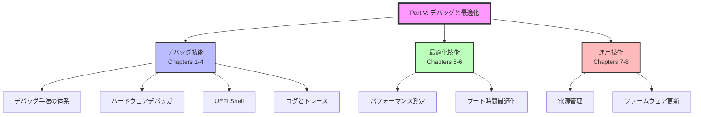
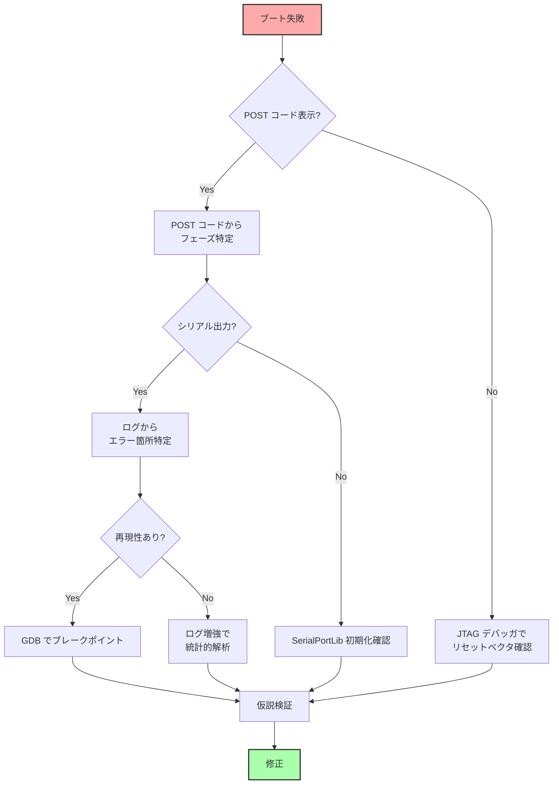
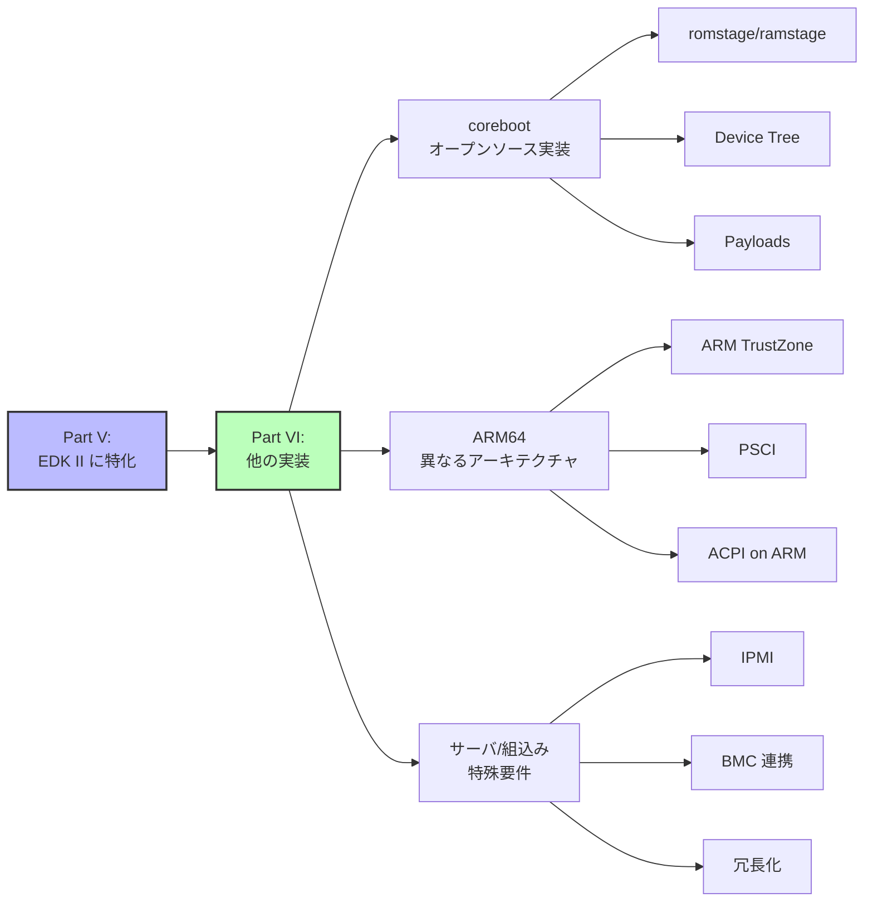
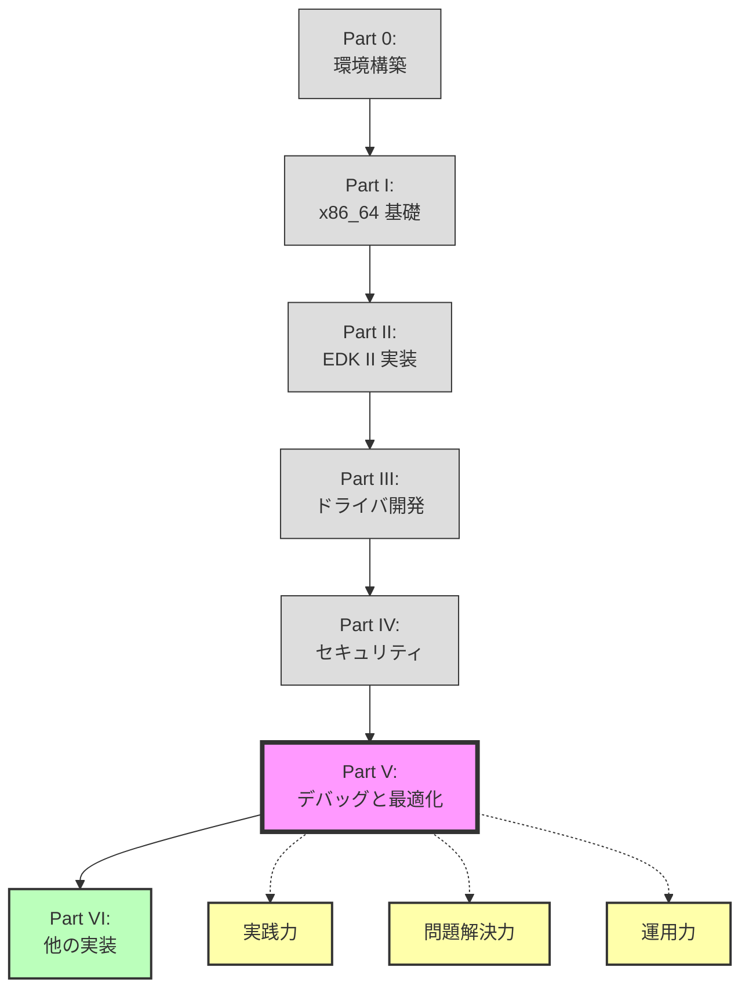

# Part V まとめ

🎯 **この章で学ぶこと**
- Part Vで習得したデバッグ・最適化技術の総括
- 実践的なデバッグ戦略の立て方
- 最適化の優先順位と効果測定
- ファームウェア開発のベストプラクティス
- 次のステップへの展望

📚 **前提知識**
- [Part V Chapter 1: デバッグ手法の体系](01-debugging-methodology.md)
- [Part V Chapter 2: ハードウェアデバッガの活用](02-hardware-debugger.md)
- [Part V Chapter 3: UEFI Shellを使ったデバッグ](03-uefi-shell-debugging.md)
- [Part V Chapter 4: ログとトレースの設計](04-logging-and-tracing.md)
- [Part V Chapter 5: パフォーマンス測定の原理](05-performance-measurement.md)
- [Part V Chapter 6: ブート時間最適化の考え方](06-boot-time-optimization.md)
- [Part V Chapter 7: 電源管理の仕組み (S3/Modern Standby)](07-power-management.md)
- [Part V Chapter 8: ファームウェア更新の仕組み](08-firmware-update-mechanism.md)

---

## Part V の全体像

Part Vでは、ファームウェア開発における**デバッグ**と**最適化**という2つの重要な側面を学びました。



---

## 各章の要点まとめ

### Chapter 1-4: デバッグ技術

| 章 | タイトル | 主な内容 | キーツール |
|---|---------|---------|-----------|
| **1** | デバッグ手法の体系 | デバッグ戦略（仮説検証法）<br>ログレベル設計<br>再現性確保の技術 | DebugLib<br>SerialPortLib<br>POST コード |
| **2** | ハードウェアデバッガ | JTAG/SWD の基礎<br>GDB リモートデバッグ<br>ブレークポイント設定 | OpenOCD<br>GDB<br>IDA Pro |
| **3** | UEFI Shell | メモリダンプ (mem, dmem)<br>PCI デバイス調査 (pci)<br>変数操作 (dmpstore, setvar) | UEFI Shell<br>memmap<br>dh |
| **4** | ログとトレース | 構造化ログ設計<br>イベントトレース<br>ログバックエンド（SPI Flash） | DebugLib<br>カスタムログバックエンド<br>Python 解析ツール |

#### デバッグのベストプラクティス

1. **仮説駆動型デバッグ**
   ```
   症状観察 → 仮説立案 → 検証実験 → 結論 → (必要なら再仮説)
   ```

2. **多層防御**
   - コンパイル時チェック: ASSERT マクロ
   - 実行時チェック: 戻り値検証
   - ポストモーテム解析: ログ収集

3. **再現性の確保**
   ```c
   // シード固定でランダム性を排除
   Seed = PcdGet32(PcdFixedDebugSeed);
   if (Seed != 0) {
     srand(Seed);
   }
   ```

4. **ログレベルの使い分け**
   | レベル | 用途 | 本番環境 |
   |--------|------|----------|
   | ERROR | 致命的エラー | 有効 |
   | WARN | 警告 | 有効 |
   | INFO | 重要イベント | 条件付き |
   | VERBOSE | 詳細ログ | 無効 |

---

### Chapter 5-6: 最適化技術

| 章 | タイトル | 主な内容 | キー技術 |
|---|---------|---------|---------|
| **5** | パフォーマンス測定 | TSC (RDTSC) によるタイミング測定<br>Intel PMU とハードウェアカウンタ<br>サンプリングプロファイラ | TSC<br>PerformanceLib<br>MSR (IA32_FIXED_CTR) |
| **6** | ブート時間最適化 | 最適化の優先順位（削除 > 遅延 > 並列 > 短縮）<br>並列初期化<br>Fast Boot モード | Depex 解析<br>並列 CPU 初期化<br>PCI 最小列挙 |

#### 最適化のベストプラクティス

1. **測定なくして最適化なし**
   ```c
   PERF_START(NULL, "InitUsb", "DXE", 0);
   Status = InitializeUsbController(Controller);
   PERF_END(NULL, "InitUsb", "DXE", 0);
   ```

2. **最適化の優先順位**
   ```
   1. 削除 (Eliminate):   不要な処理を削除 → 効果: 大
   2. 遅延 (Defer):       起動後に遅延      → 効果: 中
   3. 並列化 (Parallelize): 同時実行        → 効果: 中
   4. 短縮 (Optimize):    アルゴリズム改善 → 効果: 小
   ```

3. **80/20 の法則**
   - ブート時間の 80% は 20% の処理が占める
   - プロファイリングでボトルネックを特定
   - 上位3つの処理を優先的に最適化

4. **実測例: 2500ms → 1000ms (60% 削減)**
   | 最適化項目 | 削減時間 |
   |-----------|---------|
   | メモリ初期化並列化 | -400ms |
   | USB ドライバ遅延ロード | -300ms |
   | PCI 列挙最適化 | -200ms |
   | GOP 初期化スキップ | -150ms |
   | その他 | -450ms |

---

### Chapter 7-8: 運用技術

| 章 | タイトル | 主な内容 | キー技術 |
|---|---------|---------|---------|
| **7** | 電源管理 | ACPI S-states (S0/S3/S4/S5)<br>S3 Boot Script<br>Modern Standby | S3BootScriptLib<br>FACS (Firmware ACPI Control Structure)<br>Wake GPE |
| **8** | ファームウェア更新 | UEFI Capsule Update<br>SPI Flash プログラミング<br>A/B パーティション | CapsulePpi<br>FMP (Firmware Management Protocol)<br>Rollback Protection |

#### 運用のベストプラクティス

1. **S3 Resume の信頼性**
   ```c
   // すべての設定変更を Boot Script に記録
   S3BootScriptSavePciCfgWrite(...);
   S3BootScriptSaveMemWrite(...);
   S3BootScriptSaveIoWrite(...);
   ```

2. **ファームウェア更新の安全性**
   ```
   署名検証 → バージョンチェック → 書き込み → ベリファイ
   ```

3. **Rollback Protection**
   ```c
   if (NewVersion < GetMinimumSupportedVersion()) {
     return EFI_SECURITY_VIOLATION;
   }
   ```

4. **A/B パーティションによるフェイルセーフ**
   ```
   Partition A (Active) → 更新失敗 → Partition B に自動切り替え
   ```

---

## 総合的なデバッグ戦略

### フェーズ別デバッグアプローチ



### ツール選択フローチャート

| 症状 | 第一選択ツール | 第二選択ツール | 備考 |
|------|---------------|---------------|------|
| **ブート途中で停止** | POST コードリーダ | JTAG デバッガ | フェーズ特定が最優先 |
| **間欠的な不具合** | DebugLib ログ | イベントトレース | 統計的なパターン分析 |
| **パフォーマンス低下** | PerformanceLib | サンプリングプロファイラ | まず大まかに、次に詳細に |
| **S3 Resume 失敗** | Boot Script ダンプ | UEFI Shell (mem) | レジスタ復元を確認 |
| **変数破損** | UEFI Shell (dmpstore) | SPI Flash ダンプ | NVRAM 領域を直接確認 |
| **PCI デバイス未検出** | UEFI Shell (pci) | lspci (Linux) | BAR 設定を確認 |

---

## 実践的なチェックリスト

### 開発フェーズ

#### コーディング時

- [ ] すべての関数戻り値を `EFI_ERROR()` でチェック
- [ ] ポインタアクセス前に NULL チェック
- [ ] ASSERT マクロで前提条件を明記
- [ ] ログレベルを適切に設定 (ERROR/WARN/INFO/VERBOSE)

```c
// 良い例
EFI_STATUS Status;
Status = AllocatePool(...);
if (EFI_ERROR(Status)) {
  DEBUG((DEBUG_ERROR, "AllocatePool failed: %r\n", Status));
  return Status;
}
ASSERT(Buffer != NULL);
```

#### ビルド時

- [ ] DEBUG ビルドで ASSERT が有効
- [ ] RELEASE ビルドで VERBOSE ログが無効
- [ ] PcdDebugPropertyMask が適切に設定
- [ ] PcdDebugPrintErrorLevel が適切に設定

```ini
[PcdsFixedAtBuild]
  gEfiMdePkgTokenSpaceGuid.PcdDebugPropertyMask|0x2F
  gEfiMdePkgTokenSpaceGuid.PcdDebugPrintErrorLevel|0x80000047
```

#### テスト時

- [ ] 正常系のテスト
- [ ] 異常系のテスト（NULL 渡し、不正値）
- [ ] 境界値のテスト
- [ ] ストレステスト（繰り返し実行）
- [ ] S3 Resume のテスト
- [ ] Fast Boot モードのテスト

### デバッグフェーズ

#### 初期調査

- [ ] 症状の明確化（いつ、どこで、どのような）
- [ ] 再現手順の確立
- [ ] 最小再現環境の構築
- [ ] POST コード/シリアルログの収集

#### 仮説検証

- [ ] 仮説を1文で記述
- [ ] 検証可能な実験を設計
- [ ] ログポイントの追加
- [ ] ブレークポイントの設定
- [ ] 結果の記録

#### 修正検証

- [ ] 修正が問題を解決したか確認
- [ ] 副作用がないか確認（リグレッション）
- [ ] コードレビュー
- [ ] テストケース追加

### 最適化フェーズ

#### 測定

- [ ] ベースライン測定（最適化前）
- [ ] ボトルネック特定（上位3つ）
- [ ] 目標設定（定量的に）

```bash
# 例: ブート時間を 3000ms → 2000ms に削減
```

#### 実装

- [ ] 最適化の優先順位付け（削除 > 遅延 > 並列 > 短縮）
- [ ] 1つずつ実装・測定
- [ ] 効果測定（%改善）
- [ ] コードの可読性維持

#### 検証

- [ ] 機能が正常動作するか確認
- [ ] すべてのブートパスでテスト（Cold Boot, Warm Boot, S3 Resume）
- [ ] 異なるハードウェア構成でテスト
- [ ] 最終測定とドキュメント化

---

## Part V で学んだ主要な数値・基準

### タイミング

| 項目 | 典型値 | 備考 |
|------|--------|------|
| **CPU クロック (TSC)** | 2.4 GHz | RDTSC の周波数 |
| **PEI フェーズ** | 500-800ms | メモリ初期化が大半 |
| **DXE フェーズ** | 1500-2000ms | ドライバロードが大半 |
| **BDS フェーズ** | 500-700ms | ブートデバイス選択 |
| **S3 Resume** | 100-300ms | Boot Script 実行 |
| **SPI Flash 書き込み** | 100-200 KB/s | Erase が律速 |
| **USB デバイス列挙** | 100ms/デバイス | ポーリング待機 |

### パフォーマンス指標

| 指標 | 良好 | 要改善 | 備考 |
|------|------|--------|------|
| **IPC (Instructions Per Cycle)** | > 1.5 | < 1.0 | CPU 効率 |
| **Cache Hit Rate** | > 95% | < 90% | L1/L2 キャッシュ |
| **ブート時間** | < 2000ms | > 3000ms | Cold Boot |
| **S3 Resume 時間** | < 300ms | > 500ms | ユーザ体感 |
| **ファームウェア更新** | < 60s | > 120s | 8MB Flash |

### メモリ使用量

| 領域 | 典型値 | 備考 |
|------|--------|------|
| **PEI ヒープ** | 1-2 MB | Temporary RAM |
| **DXE ヒープ** | 16-32 MB | 実メモリ使用 |
| **Boot Script バッファ** | 64-128 KB | S3 用 |
| **ログバッファ** | 256 KB - 1 MB | SPI Flash 保存時 |

---

## ケーススタディ: 総合的なデバッグ・最適化プロジェクト

### 問題: "新しいプラットフォームのブート時間が 5000ms で目標 (2000ms) を大幅超過"

#### Phase 1: 測定とボトルネック特定

```bash
# PerformanceLib でフェーズごとの時間を測定
$ parse_perf_log.py boot.log

Phase         Time (ms)   % of Total
------------------------------------
PEI           1200        24%
DXE           3000        60%
BDS           800         16%
------------------------------------
Total         5000        100%
```

**発見**: DXE フェーズが 60% を占める

#### Phase 2: DXE フェーズの詳細分析

```python
# ドライバごとの起動時間を解析
import parse_perf

perf = parse_perf.analyze('boot.log')
perf.print_top_drivers(10)

# 出力:
# 1. UsbBusDxe:        800ms  (26.7%)
# 2. AhciBusDxe:       600ms  (20.0%)
# 3. PciBusDxe:        400ms  (13.3%)
# 4. GopDxe:           300ms  (10.0%)
# 5. NetworkDxe:       250ms  (8.3%)
# ...
```

**発見**: USB と SATA ドライバで 47% を占める

#### Phase 3: 最適化戦略の策定

| 優先度 | 対象 | 戦略 | 期待削減 |
|--------|------|------|----------|
| **1** | UsbBusDxe | 遅延ロード (Fast Boot 時) | -800ms |
| **2** | AhciBusDxe | ポート列挙の並列化 | -300ms |
| **3** | PciBusDxe | Option ROM スキップ | -150ms |
| **4** | GopDxe | Fast Boot 時スキップ | -300ms |
| **5** | NetworkDxe | 遅延ロード | -250ms |

#### Phase 4: 実装と検証

**実装例 1: USB 遅延ロード**

```c
// BDS フェーズで Fast Boot チェック
if (IsFastBootEnabled()) {
  // USB ドライバをスキップ
  DEBUG((DEBUG_INFO, "Fast Boot: USB drivers deferred\n"));
} else {
  Status = ConnectUsbControllers();
}
```

**実装例 2: AHCI 並列化**

```c
// 各ポートを並列スキャン
for (Port = 0; Port < MaxPorts; Port++) {
  if (PortImplemented & (1 << Port)) {
    StartPortInitAsync(Port);  // 非同期起動
  }
}
WaitForAllPortsReady();
```

**実装例 3: PCI Option ROM スキップ**

```c
// PcdPciOptionRomSupport を無効化
[PcdsFixedAtBuild]
  gEfiMyPlatformTokenSpaceGuid.PcdPciOptionRomSupport|FALSE
```

#### Phase 5: 最終測定

```bash
# 最適化後の測定
$ parse_perf_log.py boot_optimized.log

Phase         Time (ms)   % of Total   Improvement
--------------------------------------------------
PEI           1200        60%          0ms (0%)
DXE           600         30%          -2400ms (80%)
BDS           200         10%          -600ms (75%)
--------------------------------------------------
Total         2000        100%         -3000ms (60%)
```

**成果**: 目標達成 (5000ms → 2000ms, 60% 削減)

#### Phase 6: リグレッションテスト

```bash
# 正常ブート
$ test_boot.sh --mode normal
✓ Cold Boot:    2000ms
✓ Warm Boot:    1800ms
✓ S3 Resume:    250ms

# Fast Boot モード
$ test_boot.sh --mode fastboot
✓ Fast Boot:    2000ms
✓ USB デバイス: OS 起動後に認識

# レガシーブート
$ test_boot.sh --mode legacy
✓ Legacy Boot:  2500ms (Option ROM 有効)
```

#### 学んだ教訓

1. **測定が最優先**: 感覚ではなくデータに基づく
2. **80/20 の法則**: 上位3ドライバで 60% を占めた
3. **削除 > 遅延**: 遅延ロードで 1350ms 削減（最大効果）
4. **並列化の効果**: AHCI で 300ms 削減
5. **リグレッション防止**: すべてのブートモードでテスト

---

## Part VI への展望

Part V では、**単一プラットフォーム** (EDK II/UEFI) におけるデバッグと最適化を学びました。

**Part VI では、さらに視野を広げます**:



### Part VI で学ぶこと

| Chapter | タイトル | 新しい視点 |
|---------|---------|-----------|
| 1 | coreboot 概要 | EDK II との思想の違い |
| 2 | coreboot ビルド | Kconfig による設定 |
| 3 | Payloads | UEFI Payload, SeaBIOS |
| 4 | Device Tree | ハードウェア記述の別アプローチ |
| 5 | ARM64 ブート | PSCI, TrustZone |
| 6 | ARM64 UEFI | ARM SBBR, SBSA |
| 7 | サーバ特有の要件 | RAS, IPMI, BMC |
| 8 | 組込み特有の要件 | リアルタイム性, 省電力 |
| 9 | カスタムファームウェア | 独自実装の設計 |
| 10 | Part VI まとめ | - |

### Part V の知識がどう活きるか

| Part V で学んだこと | Part VI での応用 |
|--------------------|------------------|
| **GDB デバッグ** | coreboot のデバッグにも同じ手法 |
| **ログ設計** | coreboot の cbmem ログと比較 |
| **パフォーマンス測定** | romstage/ramstage の最適化 |
| **S3 Resume** | coreboot の S3 実装との違い |
| **SPI Flash** | coreboot の flashrom ツール |
| **セキュアブート** | ARM TrustZone との比較 |

---

## まとめ

### Part V で習得したスキル

✅ **デバッグスキル**
- 仮説駆動型デバッグの実践
- ハードウェアデバッガ (JTAG/GDB) の使用
- UEFI Shell による低レベル調査
- ログとトレースの設計

✅ **最適化スキル**
- TSC とハードウェアカウンタによる測定
- ボトルネック特定とプロファイリング
- 並列化・遅延ロードによる高速化
- 測定に基づく改善サイクル

✅ **運用スキル**
- S3 Resume の実装とデバッグ
- ファームウェア更新の安全な実装
- Rollback Protection
- A/B パーティション

### これまでの学習の振り返り



### 到達レベル

**Part V 完了時点で、あなたは:**

🎓 **中級～上級レベルのファームウェアエンジニア**

- **できること**:
  - 複雑なブート問題を体系的にデバッグ
  - ブート時間を 50% 以上削減
  - 信頼性の高い S3 Resume 実装
  - セキュアなファームウェア更新機構の構築

- **理解していること**:
  - デバッグの方法論と適切なツール選択
  - パフォーマンス最適化の原理と実践
  - 電源管理の仕組み
  - ファームウェア更新のセキュリティモデル

- **次のステップ**:
  - Part VI で視野を広げる (coreboot, ARM64)
  - 実際のプロジェクトに参加
  - コミュニティへの貢献 (バグ報告、パッチ提出)

---

## 💻 総合演習

### 演習 1: デバッグシナリオ

**問題**: あるプラットフォームで、10回に1回の頻度で BDS フェーズで停止する不具合が発生しています。

**あなたのアプローチを記述してください:**
1. 初期調査で何を確認しますか？
2. どのツールを使いますか？
3. どのような仮説を立てますか？
4. どう検証しますか？

<details>
<summary>解答例</summary>

#### 1. 初期調査

- [ ] 症状の明確化
  - BDS フェーズのどこで停止？ (POST コード確認)
  - シリアルログの最終行は？
  - 再現率は正確に 10%？ それとも幅がある？

- [ ] 環境確認
  - 特定のハードウェア構成で発生？
  - Cold Boot / Warm Boot / S3 Resume すべてで発生？
  - ビルド変更や設定変更の前後は？

#### 2. ツール選択

| フェーズ | ツール | 目的 |
|---------|-------|------|
| **初期** | POST コードリーダ | 停止箇所の特定 |
| **ログ** | DebugLib (DEBUG_VERBOSE) | 詳細な実行フロー |
| **統計** | イベントトレース | 100回実行して統計分析 |
| **再現時** | GDB ブレークポイント | 再現時の状態取得 |

#### 3. 仮説

**仮説 1: 初期化競合**
- 非同期初期化で、タイミング依存の競合状態
- → イベントトレースで初期化順序を確認

**仮説 2: メモリ破壊**
- ヒープ破壊で間欠的にポインタ不正
- → ASSERT マクロとメモリダンプ

**仮説 3: タイムアウト**
- ポーリング待機でデバイス応答遅延
- → タイムスタンプログでタイミング確認

#### 4. 検証実験

**実験 1: ログ増強**
```c
// BDS 全体に詳細ログ追加
DEBUG((DEBUG_VERBOSE, "[BDS] Starting device connection\n"));
for (Index = 0; Index < HandleCount; Index++) {
  DEBUG((DEBUG_VERBOSE, "[BDS] Connecting handle %d/%d: %p\n",
         Index + 1, HandleCount, Handles[Index]));
  Status = gBS->ConnectController(Handles[Index], NULL, NULL, TRUE);
  DEBUG((DEBUG_VERBOSE, "[BDS]   Status: %r\n", Status));
}
```

**実験 2: 100回実行テスト**
```bash
#!/bin/bash
for i in {1..100}; do
  echo "=== Test $i ===" >> results.txt
  timeout 60 qemu-system-x86_64 ... >> results.txt 2>&1
  if [ $? -eq 124 ]; then
    echo "TIMEOUT at test $i"
    cp serial.log failure_$i.log
  fi
done
```

**実験 3: 再現時にデバッガアタッチ**
```bash
# QEMU を GDB サーバモードで起動
qemu-system-x86_64 -s -S ...

# GDB で条件付きブレークポイント
(gdb) break BdsEntry
(gdb) commands
  silent
  printf "BDS Entry, attempt %d\n", $attempt
  set $attempt = $attempt + 1
  continue
end
(gdb) set $attempt = 1
(gdb) continue
```

#### 期待される発見

- ログ解析で特定の Handles[X] で停止
- そのハンドルが USB コントローラ
- USB ポーリングタイムアウトが 100ms で、デバイス応答が 90-110ms で揺らぐ
- → タイムアウトを 200ms に延長して解決

</details>

---

### 演習 2: ブート時間最適化プロジェクト

**問題**: 以下の測定結果から、最も効果的な最適化戦略を提案してください。

```
Phase         Time (ms)   Top 3 Drivers
------------------------------------------
PEI           800         MemoryInit(600), CpuInit(150), PchInit(50)
DXE           2200        UsbBus(700), PciBus(500), NetworkDxe(400)
BDS           500         BootOption(300), Console(200)
------------------------------------------
Total         3500
```

**目標**: 3500ms → 2000ms (43% 削減)

**提案してください:**
1. 優先順位付けした最適化項目 (上位5つ)
2. 各項目の期待削減時間
3. 実装の難易度 (低/中/高)
4. リスク評価

<details>
<summary>解答例</summary>

#### 最適化提案

| 優先度 | 対象 | 戦略 | 期待削減 | 難易度 | リスク | 備考 |
|--------|------|------|----------|--------|--------|------|
| **1** | UsbBus (700ms) | Fast Boot 時に遅延ロード | -700ms | 低 | 低 | OS 起動後に USB 認識 |
| **2** | MemoryInit (600ms) | 並列初期化 (チャネル単位) | -300ms | 高 | 中 | FSP パラメータ調整必要 |
| **3** | PciBus (500ms) | Option ROM スキップ | -200ms | 低 | 低 | レガシーブート時は有効化 |
| **4** | NetworkDxe (400ms) | 遅延ロード | -400ms | 低 | 低 | PXE ブート時は有効化 |
| **5** | Console (200ms) | GOP 初期化遅延 | -200ms | 中 | 中 | ブートロゴなしで起動 |

**合計削減: 1800ms → 目標達成 (3500ms → 1700ms, 51% 削減)**

#### 実装計画

**Phase 1: 低リスク項目 (週1)**
```c
// UsbBus 遅延ロード
if (IsFastBootEnabled()) {
  SkipDriverBinding(gUsbBusDriverBinding);
}

// PCI Option ROM スキップ
PcdSetBool(PcdPciOptionRomSupport, FALSE);

// NetworkDxe 遅延ロード
if (IsFastBootEnabled()) {
  SkipDriverBinding(gNetworkDriverBinding);
}
```

**Phase 2: 中リスク項目 (週2)**
```c
// GOP 初期化遅延
if (IsFastBootEnabled()) {
  PcdSetBool(PcdEnableGop, FALSE);  // OS で初期化
}
```

**Phase 3: 高リスク項目 (週3-4)**
```c
// メモリ初期化並列化 (FSP 設定)
typedef struct {
  UINT8  ParallelMemInit;  // 0=Sequential, 1=Parallel
} FSPM_CONFIG;

FSPM_CONFIG FspmConfig = {
  .ParallelMemInit = 1,  // 並列化有効
};
```

#### リグレッションテスト計画

```bash
#!/bin/bash

# Test Matrix
BOOT_MODES="normal fastboot legacy"
BOOT_TYPES="cold warm s3"

for mode in $BOOT_MODES; do
  for type in $BOOT_TYPES; do
    echo "Testing: mode=$mode, type=$type"
    test_boot.sh --mode $mode --type $type

    # 期待値チェック
    if [ "$mode" == "fastboot" ]; then
      expect_time=1700
    else
      expect_time=2500  # レガシーは遅くてOK
    fi

    actual=$(parse_log.sh | grep Total | awk '{print $2}')
    if [ $actual -gt $expect_time ]; then
      echo "FAIL: $actual ms > $expect_time ms"
      exit 1
    fi
  done
done

echo "All tests passed!"
```

</details>

---

### 演習 3: S3 Resume デバッグ

**問題**: S3 Resume 時に画面が真っ暗なまま復帰しません。キーボード入力には反応します。

**デバッグ手順を記述してください。**

<details>
<summary>解答例</summary>

#### 仮説

**GOP (Graphics Output Protocol) の設定が S3 Resume 時に復元されていない**

#### デバッグステップ

**Step 1: Boot Script 確認**

UEFI Shell で Boot Script ダンプ:
```
Shell> dmpstore BootScriptSave
```

GOP 関連のレジスタ (PCI BAR, MMIO アドレス) が記録されているか確認。

**Step 2: GOP デバイスの PCI 設定確認**

```
Shell> pci 00 02 00  # 典型的な GPU の BDF
  VID/DID: 8086:1916
  BAR0: 00000000F0000000 (MMIO)
  Command: 0007 (Memory Space Enabled, Bus Master)
```

S3 Resume 後も同じ設定か確認:
```bash
# S3 前
setpci -s 00:02.0 COMMAND
# 出力: 0007

# S3 Resume 後
setpci -s 00:02.0 COMMAND
# 出力: 0000  ← Bus Master が無効！
```

**Step 3: Boot Script への記録追加**

GopDxe で PCI Command レジスタを Boot Script に追加:

```c
// GopDxe の S3 準備コード
EFI_STATUS
GopS3SaveConfig (
  IN EFI_PCI_IO_PROTOCOL  *PciIo
  )
{
  EFI_STATUS  Status;
  UINT16      Command;
  UINTN       Segment, Bus, Device, Function;

  // PCI ロケーション取得
  Status = PciIo->GetLocation(PciIo, &Segment, &Bus, &Device, &Function);

  // Command レジスタ読み取り
  Status = PciIo->Pci.Read(
    PciIo,
    EfiPciIoWidthUint16,
    PCI_COMMAND_OFFSET,
    1,
    &Command
  );

  // Boot Script に保存
  Status = S3BootScriptSavePciCfgWrite(
    S3BootScriptWidthUint16,
    PCI_LIB_ADDRESS(Bus, Device, Function, PCI_COMMAND_OFFSET),
    1,
    &Command
  );

  DEBUG((DEBUG_INFO, "GOP S3: Saved PCI Command = 0x%04X\n", Command));

  return EFI_SUCCESS;
}
```

**Step 4: GOP レジスタの保存**

MMIO レジスタも保存:

```c
// GOP モード設定 (解像度, フレームバッファ) を Boot Script に保存
typedef struct {
  UINT32  PipeConf;      // パイプ設定
  UINT32  PlaneControl;  // プレーン制御
  UINT32  PlaneStride;   // ストライド
  UINT32  PlaneSurface;  // フレームバッファアドレス
} GOP_REGISTERS;

VOID
SaveGopRegisters (
  IN UINTN  MmioBase
  )
{
  GOP_REGISTERS  Regs;

  // レジスタ読み取り
  Regs.PipeConf     = MmioRead32(MmioBase + PIPE_CONF_OFFSET);
  Regs.PlaneControl = MmioRead32(MmioBase + PLANE_CTL_OFFSET);
  Regs.PlaneStride  = MmioRead32(MmioBase + PLANE_STRIDE_OFFSET);
  Regs.PlaneSurface = MmioRead32(MmioBase + PLANE_SURF_OFFSET);

  // Boot Script に保存
  S3BootScriptSaveMemWrite(
    S3BootScriptWidthUint32,
    MmioBase + PIPE_CONF_OFFSET,
    1,
    &Regs.PipeConf
  );

  S3BootScriptSaveMemWrite(
    S3BootScriptWidthUint32,
    MmioBase + PLANE_CTL_OFFSET,
    1,
    &Regs.PlaneControl
  );

  // 以下同様...
}
```

**Step 5: 検証**

```bash
# S3 実行
echo mem > /sys/power/state

# ログ確認
dmesg | grep "GOP S3"
# 出力: GOP S3: Saved PCI Command = 0x0007

# S3 Resume 後、画面が正常に復帰することを確認
```

#### 追加のデバッグ

もし上記で解決しない場合:

1. **フレームバッファの内容確認**
   ```
   Shell> mem F0000000 100  # フレームバッファダンプ
   ```
   すべて 0x00 なら描画されていない。

2. **ACPI _PS0 メソッド確認**
   ```asl
   Device (GFX0) {
     Method (_PS0, 0) {  // Power On
       // GOP を D0 状態に遷移
       Store(0x00, PMCS)  // Power State = D0
     }
   }
   ```

3. **カーネルログ確認**
   ```bash
   dmesg | grep i915  # Intel GPU ドライバ
   # エラーメッセージを確認
   ```

</details>

---

## 📚 Part V 参考資料まとめ

### 仕様書

1. **UEFI Specification v2.10**
   - https://uefi.org/specifications
   - 特に Chapter 2 (Boot Services), Chapter 31 (DebugSupport Protocol)

2. **ACPI Specification 6.5**
   - https://uefi.org/specifications
   - Chapter 16 (Waking and Sleeping)

3. **Intel® 64 and IA-32 Architectures Software Developer Manuals**
   - https://www.intel.com/sdm
   - Volume 3B: Performance Monitoring

4. **PI Specification v1.8**
   - https://uefi.org/specifications
   - Volume 1: PEI, Volume 2: DXE

### EDK II ドキュメント

1. **EDK II Performance Measurement**
   - https://github.com/tianocore/edk2/tree/master/MdeModulePkg/Library/DxeCorePerformanceLib

2. **EDK II Debugging**
   - https://github.com/tianocore/tianocore.github.io/wiki/EDK-II-Debugging

3. **S3 Resume**
   - https://github.com/tianocore/edk2/tree/master/MdeModulePkg/Library/PiDxeS3BootScriptLib

### ツール

1. **GDB: The GNU Project Debugger**
   - https://www.gnu.org/software/gdb/documentation/

2. **OpenOCD**
   - https://openocd.org/

3. **Intel VTune Profiler**
   - https://www.intel.com/content/www/us/en/developer/tools/oneapi/vtune-profiler.html

### 書籍

1. **"Beyond BIOS: Developing with the Unified Extensible Firmware Interface"**
   - Vincent Zimmer, Michael Rothman, Suresh Marisetty

2. **"Hacking the Xbox"**
   - Andrew "bunnie" Huang
   - ハードウェアデバッグの実践例

### コミュニティ

1. **TianoCore Mailing List**
   - https://edk2.groups.io/

2. **UEFI Forum**
   - https://uefi.org/

---

**おめでとうございます！Part V を完了しました。🎉**

あなたは今、ファームウェアのデバッグと最適化において、プロフェッショナルレベルのスキルを持っています。

次は **Part VI: 他のファームウェア実装** で視野を広げましょう！

---

次章: [Part VI Chapter 1: coreboot 概要](../part6/01-coreboot-overview.md)
