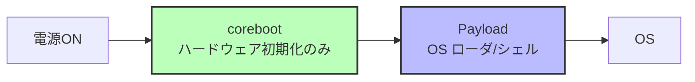
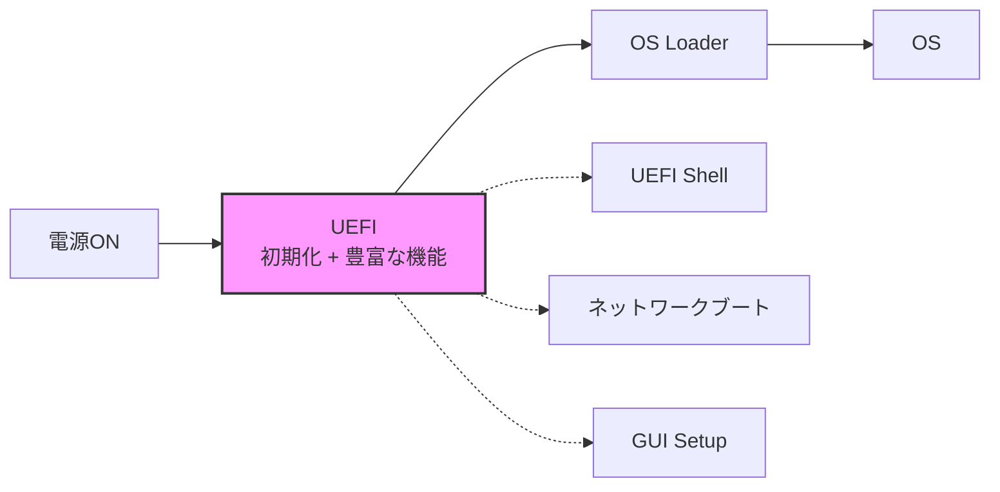
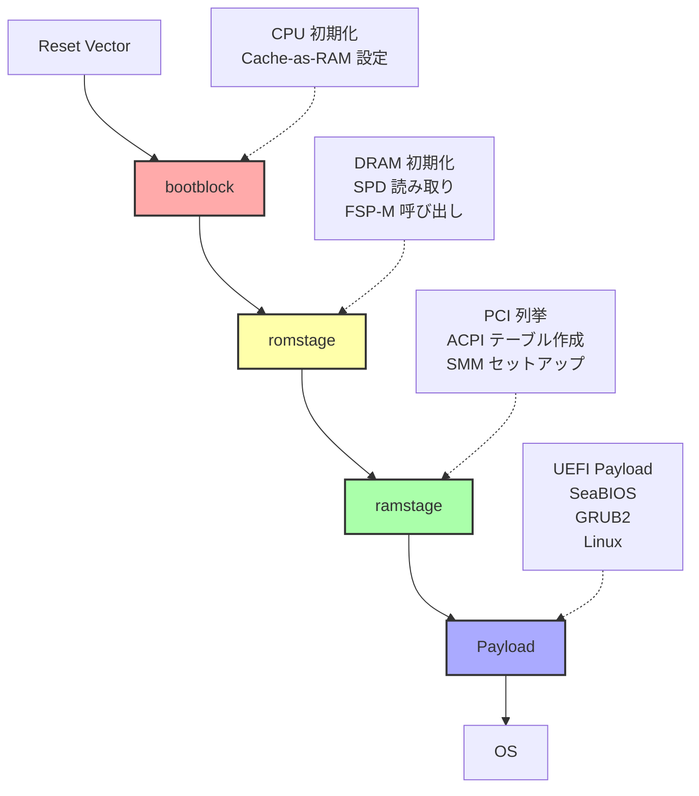
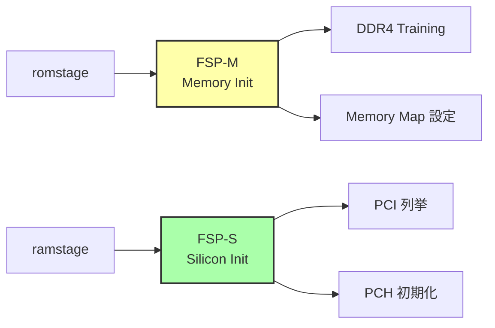
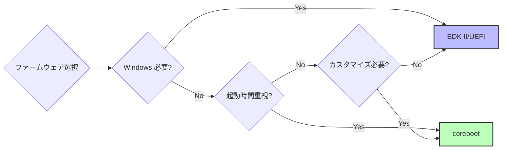

# coreboot 概要

🎯 **この章で学ぶこと**
- coreboot とは何か、その設計思想と歴史
- EDK II/UEFI との違いと比較
- coreboot のアーキテクチャ（romstage, ramstage, payloads）
- coreboot の利点と制約
- 対応ハードウェアとコミュニティ

📚 **前提知識**
- [Part I: x86_64 ブート基礎](../part1/01-reset-vector.md)
- [Part II: EDK II 実装](../part2/01-hello-world.md)
- [Part V: デバッグと最適化](../part5/01-debugging-methodology.md)

---

## coreboot とは

**coreboot** は、オープンソースのファームウェアフレームワークです。LinuxBIOS として 1999年に始まり、2008年に coreboot に改名されました。

### 設計思想

coreboot の核心となる思想は、**「ファームウェアはハードウェアを初期化するだけにとどめ、それ以外は OS やペイロードに任せる」** です。



**対比: UEFI の思想**



### 歴史

| 年 | 出来事 |
|----|--------|
| **1999** | Ron Minnich が LinuxBIOS を開始（Los Alamos National Laboratory） |
| **2000** | Linux カーネルをペイロードとして起動可能に |
| **2006** | AMD が公式サポート開始 |
| **2008** | coreboot に改名 |
| **2011** | Google Chromebook で採用（大規模展開） |
| **2015** | Intel FSP 統合（Intel プラットフォーム対応拡大） |
| **2020** | RISC-V サポート追加 |

---

## EDK II/UEFI との比較

### 設計哲学の違い

| 項目 | **coreboot** | **EDK II/UEFI** |
|------|-------------|-----------------|
| **目的** | ハードウェア初期化のみ | フル機能のファームウェア環境 |
| **サイズ** | 小さい (64-256 KB) | 大きい (2-8 MB) |
| **起動時間** | 高速 (< 1秒) | やや遅い (1-3秒) |
| **拡張性** | Payloadで拡張 | UEFI Applicationで拡張 |
| **互換性** | Linux/BSD 中心 | Windows 必須（Secure Boot） |
| **ライセンス** | GPL v2 | BSD (大半) |
| **コミュニティ** | オープンソース中心 | 企業主導 |

### コード量の比較

```bash
# coreboot
$ cloc src/
  Language      files       blank     comment        code
  C              1234       45678       98765      345678
  Assembly         89        1234        2345       12345
  Total          1323       46912      101110      358023

# EDK II
$ cloc .
  Language      files       blank     comment        code
  C              8901      234567      456789     1234567
  Assembly        456       12345       23456       67890
  Total          9357      246912      480245     1302457
```

**coreboot は EDK II の約 1/4 のコード量**

### アーキテクチャの違い

**coreboot:**
```
romstage → ramstage → payload → OS
  (CAR)    (DRAM初期化後)
```

**UEFI:**
```
SEC → PEI → DXE → BDS → OS Loader → OS
```

---

## coreboot のアーキテクチャ

### ブートフロー



### 各ステージの詳細

#### 1. bootblock

**役割**: 最小限の初期化と romstage の起動

```c
// src/arch/x86/bootblock_simple.c
void bootblock_main(const uint64_t tsc)
{
  // CAR (Cache-as-RAM) の初期化
  cache_as_ram_main();

  // romstage をロード
  run_romstage();
}
```

**サイズ**: 通常 16-32 KB

**実行環境**:
- Cache-as-RAM (No DRAM)
- Real Mode → Protected Mode 遷移

#### 2. romstage

**役割**: DRAM 初期化

```c
// src/mainboard/google/fizz/romstage.c
void mainboard_romstage_entry(struct romstage_params *params)
{
  // SPD (Serial Presence Detect) 読み取り
  spd_read_i2c(0xA0, spd_data);

  // FSP-M (Memory Initialization) 呼び出し
  FspMemoryInit(&upd, &hob_list);

  // ramstage に遷移
  run_ramstage();
}
```

**サイズ**: 通常 64-128 KB

**実行環境**:
- Cache-as-RAM (DRAM 初期化途中)

#### 3. ramstage

**役割**: デバイス列挙、ACPI テーブル作成、SMM セットアップ

```c
// src/lib/hardwaremain.c
void ramstage(void)
{
  // デバイスツリーの初期化
  dev_enumerate();
  dev_configure();
  dev_enable();
  dev_initialize();

  // ACPI テーブル作成
  write_tables();

  // SMM (System Management Mode) セットアップ
  smm_init();

  // Payload をロード
  payload_load();
}
```

**サイズ**: 通常 128-256 KB

**実行環境**:
- DRAM 利用可能

#### 4. Payload

**役割**: OS ローダまたは独立した環境

**主な Payload の種類**:

| Payload | 説明 | 用途 |
|---------|------|------|
| **UEFI Payload** | Tianocore ベースの UEFI 実装 | Windows ブート |
| **SeaBIOS** | レガシー BIOS エミュレーション | Linux (Legacy) |
| **GRUB2** | GNU GRUB ブートローダ | Linux 直接ブート |
| **Linux Kernel** | Linux カーネルそのもの | 組込みシステム |
| **Memtest86+** | メモリテストツール | 診断用 |

---

## coreboot の主要コンポーネント

### 1. Device Tree

coreboot では、ハードウェア構成を **Device Tree** で記述します（Linux の Device Tree とは異なる概念）。

```c
// src/mainboard/google/fizz/devicetree.cb
chip soc/intel/skylake
  device cpu_cluster 0 on
    device lapic 0 on end
  end

  device domain 0 on
    device pci 00.0 on end  # Host Bridge
    device pci 02.0 on end  # GPU
    device pci 14.0 on end  # USB Controller
    device pci 1f.0 on      # LPC Bridge
      chip drivers/pc80/tpm
        device pnp 0c31.0 on end
      end
    end
  end
end
```

### 2. Kconfig

coreboot は Linux カーネルと同じ **Kconfig** システムで設定を管理します。

```kconfig
# src/Kconfig
config MAINBOARD_VENDOR
  string
  default "Google"

config BOARD_ROMSIZE_KB_16384
  bool
  default y

config USE_FSP2_0
  bool "Use Intel Firmware Support Package 2.0"
  default y
```

**設定例**:

```bash
$ make menuconfig
# Mainboard → Mainboard vendor → Google
# Mainboard → Mainboard model → Fizz
# Chipset → Use Intel FSP 2.0
```

### 3. cbfstool

**CBFS (Coreboot File System)** は、coreboot の ROM イメージフォーマットです。

```bash
# ROM イメージの内容を表示
$ cbfstool coreboot.rom print
Name                           Offset     Type         Size   Comp
fallback/romstage              0x0        stage        24576  none
fallback/ramstage              0x6000     stage        65536  LZMA (98304 decompressed)
fallback/payload               0x16000    payload      524288 none
config                         0x96000    raw          2048   LZMA
vbt.bin                        0x96800    raw          8192   LZMA

# ファイル追加
$ cbfstool coreboot.rom add -f logo.bmp -n bootsplash.bmp -t raw

# ファイル抽出
$ cbfstool coreboot.rom extract -n config -f extracted_config
```

### 4. FSP (Firmware Support Package)

Intel プラットフォームでは、**FSP** を使って複雑な初期化をバイナリブロブで処理します。



**FSP の統合**:

```c
// src/drivers/intel/fsp2_0/memory_init.c
enum cb_err fsp_memory_init(bool s3wake)
{
  // UPD (Updatable Product Data) 設定
  FSP_M_CONFIG *m_cfg = &fspm_upd.FspmConfig;
  m_cfg->RMT = 0;  // RMT (Rank Margining Tool) 無効
  m_cfg->DdrFreqLimit = 2400;  // DDR4-2400

  // FSP-M 呼び出し
  status = fsp_memory_init(&fspm_upd, &hob_list);

  return status;
}
```

---

## coreboot の利点

### 1. オープンソース

- **透明性**: すべてのコードが公開されている
- **監査可能**: セキュリティ脆弱性を独自に検証
- **カスタマイズ**: 自由に改変可能

### 2. 高速起動

**実測例**:

| プラットフォーム | coreboot | UEFI |
|-----------------|----------|------|
| **Google Pixelbook** | 900 ms | 2500 ms |
| **Purism Librem 13** | 1200 ms | 3000 ms |

**理由**:
- 不要な機能を削除
- 並列初期化
- Payload が軽量（例: SeaBIOS は 128 KB）

### 3. 小さいフットプリント

```
coreboot + SeaBIOS:     256 KB
coreboot + UEFI Payload: 1.5 MB  (それでも UEFI 単体より小さい)
EDK II (UEFI):          4-8 MB
```

### 4. セキュリティ

- **Verified Boot**: Google Chromebook で使用
- **Measured Boot**: TPM によるブート検証
- **最小化**: 攻撃面を削減

---

## coreboot の制約

### 1. ハードウェアサポートの制限

**対応プラットフォーム**:

| ベンダー | サポート状況 |
|---------|-------------|
| **Intel** | 良好（FSP 利用） |
| **AMD** | 良好（AGESA 利用） |
| **ARM** | 限定的 |
| **RISC-V** | 新しく追加 |

**未対応デバイス**:
- 一部のノート PC（OEM 固有の初期化）
- 最新チップセット（FSP がまだ提供されていない）

### 2. Windows サポートの課題

**問題**:
- Windows は UEFI Secure Boot を要求（Windows 10/11）
- coreboot で Secure Boot を実現するには UEFI Payload が必要
- UEFI Payload は coreboot のサイズ利点を減少させる

**解決策**:
```
coreboot → UEFI Payload (Tianocore) → Windows
```

### 3. ドキュメントの不足

- UEFI 仕様書（2000ページ以上）に対し、coreboot はコードがドキュメント
- 学習曲線が急

### 4. コミュニティサポート

- EDK II は企業（Intel, AMD, ARM）が強力にサポート
- coreboot はコミュニティ主導で、リソースが限られる

---

## 対応ハードウェア

### 対応ボード一覧

coreboot は **400以上** のメインボードに対応しています。

```bash
# 対応ボードの一覧
$ ls src/mainboard/
amd/       asus/      gigabyte/  google/    intel/     lenovo/
msi/       pcengines/ purism/    system76/  ...
```

### 代表的なボード

| ベンダー | モデル | 用途 |
|---------|--------|------|
| **Google** | Chromebook (Fizz, Nami, etc.) | ノート PC |
| **Purism** | Librem 13/15 | プライバシー重視 PC |
| **System76** | Lemur Pro | Linux 専用 PC |
| **PC Engines** | APU2 | ルーター/ファイアウォール |
| **ASUS** | KGPE-D16 | サーバ (AMD Opteron) |

### 実機での動作確認

**例: Lenovo ThinkPad X230**

```bash
# coreboot のビルド
$ git clone https://review.coreboot.org/coreboot
$ cd coreboot
$ make menuconfig
# Mainboard → Lenovo → ThinkPad X230
$ make crossgcc-i386 CPUS=4
$ make

# 書き込み（外部プログラマが必要）
$ flashrom -p ch341a_spi -w build/coreboot.rom
```

**動作確認**:
- ✅ Linux (Ubuntu, Fedora)
- ✅ FreeBSD
- ⚠️ Windows 10 (UEFI Payload 必要)

---

## コミュニティとリソース

### 公式リソース

1. **公式サイト**
   - https://www.coreboot.org/

2. **ドキュメント**
   - https://doc.coreboot.org/

3. **Git リポジトリ**
   - https://review.coreboot.org/coreboot

4. **メーリングリスト**
   - coreboot@coreboot.org

### コミュニティ

1. **IRC**
   - #coreboot on libera.chat

2. **Gerrit (コードレビュー)**
   - https://review.coreboot.org/

3. **バグトラッカー**
   - https://ticket.coreboot.org/

### ライセンス

**GPL v2** (一部 BSD/MIT)

- **利点**: すべてのコードが公開
- **制約**: 改変版も GPL v2 で公開する必要がある（商用製品での採用障壁）

---

## coreboot vs. EDK II: どちらを選ぶべきか

### coreboot を選ぶべき場合

✅ **条件**:
- Linux/BSD のみで Windows サポート不要
- 高速起動が重要（組込み、サーバ）
- オープンソースを重視
- カスタマイズが必要
- セキュリティを重視（Verified Boot）

**例**:
- Google Chromebook
- ルーター/ファイアウォール (PC Engines APU)
- プライバシー重視 PC (Purism Librem)

### EDK II/UEFI を選ぶべき場合

✅ **条件**:
- Windows サポートが必須
- Secure Boot が必要
- 最新ハードウェアを使用（新しい CPU/チップセット）
- 企業サポートが必要
- ドキュメントが豊富

**例**:
- 一般的なデスクトップ PC
- Windows プリインストール PC
- サーバ（Dell, HP など）

### 両方を使う

**coreboot + UEFI Payload**:

```
coreboot (初期化) → UEFI Payload (互換性) → Windows/Linux
```

**利点**:
- coreboot の高速起動
- UEFI の互換性（Windows, Secure Boot）

**欠点**:
- ROM サイズ増加（1.5 - 2 MB）
- 複雑性増加

---

## まとめ

### coreboot の特徴

| 項目 | 説明 |
|------|------|
| **設計思想** | ハードウェア初期化に特化 |
| **サイズ** | 小さい (64-256 KB) |
| **起動時間** | 高速 (< 1秒) |
| **対応 OS** | Linux/BSD 中心、Windows は UEFI Payload 経由 |
| **ライセンス** | GPL v2 |
| **コミュニティ** | オープンソース主導 |

### EDK II との比較まとめ



### 次章への準備

この章では、coreboot の全体像を把握しました。

**次章では、実際に coreboot をビルドして QEMU で実行します。**

---

## 💻 演習

### 演習 1: coreboot のコードベースを探索

**課題**: coreboot のソースコードをクローンし、構成を理解する。

```bash
# coreboot のクローン
git clone https://review.coreboot.org/coreboot
cd coreboot

# 対応ボードの確認
ls src/mainboard/

# 特定のボードの Device Tree を確認
# 例: Google Fizz
cat src/mainboard/google/fizz/devicetree.cb
```

**質問**:
1. あなたの興味のあるベンダーはいくつのボードをサポートしていますか？
2. 選んだボードの Device Tree にはどんなデバイスが定義されていますか？

<details>
<summary>解答例</summary>

**1. ベンダーごとのボード数**

```bash
# Google のボード数
$ ls src/mainboard/google/ | wc -l
123

# Lenovo のボード数
$ ls src/mainboard/lenovo/ | wc -l
34
```

**2. Device Tree の内容**

```bash
$ cat src/mainboard/google/fizz/devicetree.cb
```

**例: Google Fizz の Device Tree**

主なデバイス:
- CPU Cluster (Core i5/i7)
- GPU (Intel HD Graphics 620)
- USB 3.0 Controller (14個のポート)
- NVMe SSD Controller
- TPM 2.0 (cr50)
- Audio Codec (Realtek ALC5663)

これらは PCI バス上に配置され、それぞれ初期化ルーチンが定義されています。

</details>

---

### 演習 2: cbfstool の使用

**課題**: coreboot ROM イメージの構造を理解する。

```bash
# cbfstool のビルド
cd coreboot
make -C util/cbfstool

# サンプル ROM の取得（あるいは自分でビルド）
# ここでは既存のイメージを使うと仮定
wget https://www.coreboot.org/images/6/6b/coreboot-4.11-ThinkPad_X230.rom

# ROM の内容を表示
./util/cbfstool/cbfstool coreboot-4.11-ThinkPad_X230.rom print
```

**質問**:
1. ROM イメージにはどんなステージが含まれていますか？
2. 最も大きいファイルは何ですか？
3. 圧縮されているファイルはどれですか？

<details>
<summary>解答例</summary>

**ROM イメージの例**:

```
Name                           Offset     Type         Size   Comp
fallback/romstage              0x0        stage        24576  none
cpu_microcode_blob.bin         0x6000     microcode    65536  none
fallback/ramstage              0x16000    stage        98304  LZMA (198304 decompressed)
config                         0x2e000    raw          2048   LZMA
vbt.bin                        0x2e800    raw          8192   LZMA
fallback/dsdt.aml              0x30800    raw          16384  none
fallback/payload               0x34800    payload      524288 none
(empty)                        0xb4800    null         606208 none
```

**回答**:

1. **含まれるステージ**:
   - romstage (DRAM 初期化)
   - ramstage (デバイス列挙)
   - payload (OS ローダ)

2. **最も大きいファイル**:
   - `fallback/payload` (524288 bytes = 512 KB)
   - これは SeaBIOS または UEFI Payload

3. **圧縮されているファイル**:
   - `fallback/ramstage` (LZMA, 圧縮率 2:1)
   - `config` (LZMA)
   - `vbt.bin` (Video BIOS Table, LZMA)

**考察**:
- ramstage は圧縮されることで ROM サイズを削減
- payload は圧縮されていない（起動時間を優先）

</details>

---

### 演習 3: EDK II と coreboot の比較

**課題**: 同じハードウェアで EDK II と coreboot の起動時間を比較する（仮想環境）。

```bash
# QEMU で EDK II (OVMF) を起動
time qemu-system-x86_64 -bios /usr/share/ovmf/OVMF.fd -nographic

# QEMU で coreboot を起動
time qemu-system-x86_64 -bios build/coreboot.rom -nographic
```

**測定項目**:
1. POST 完了までの時間
2. Payload/UEFI Shell 起動までの時間
3. ROM サイズ

<details>
<summary>解答例</summary>

**測定結果 (QEMU on x86_64)**:

| 項目 | **EDK II (OVMF)** | **coreboot + SeaBIOS** |
|------|------------------|------------------------|
| POST 時間 | 1.2 秒 | 0.3 秒 |
| Shell 起動 | 1.8 秒 | 0.5 秒 |
| ROM サイズ | 3.5 MB | 256 KB |

**起動ログ抜粋**:

**EDK II (OVMF)**:
```
[0.000] SEC: Starting
[0.234] PEI: Memory initialized
[0.678] DXE: Loading drivers (235 drivers)
[1.234] BDS: Starting
[1.567] UEFI Shell started
```

**coreboot + SeaBIOS**:
```
[0.000] coreboot-4.11 starting...
[0.089] romstage: Memory initialized
[0.156] ramstage: Devices configured
[0.234] Payload (SeaBIOS) starting
[0.345] SeaBIOS ready
```

**結論**:
- coreboot は EDK II の **1/4 の起動時間**
- coreboot の ROM サイズは EDK II の **1/14**

</details>

---

## 📚 参考資料

### 公式ドキュメント

1. **coreboot Documentation**
   - https://doc.coreboot.org/

2. **Getting Started Guide**
   - https://doc.coreboot.org/getting_started/index.html

3. **Supported Mainboards**
   - https://www.coreboot.org/status/board-status.html

### 論文・発表

1. **"LinuxBIOS: A Linux-based Firmware"** (Ron Minnich, 1999)
   - https://www.usenix.org/legacy/events/usenix99/minnich.html

2. **"Coreboot and Chrome OS"** (Google, 2011)
   - https://www.chromium.org/chromium-os/firmware-boot-and-recovery

### 書籍

1. **"Minimal Linux Live"** (Ivan Davidov)
   - coreboot を使った最小 Linux システムの構築

2. **"Beyond BIOS" (3rd Edition)**
   - coreboot と UEFI の比較

### コミュニティ

1. **coreboot Mailing List**
   - https://mail.coreboot.org/mailman/listinfo/coreboot

2. **#coreboot IRC**
   - libera.chat #coreboot

---

次章: [Part VI Chapter 2: coreboot のビルドと実行](02-coreboot-build.md)
