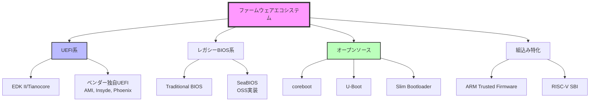
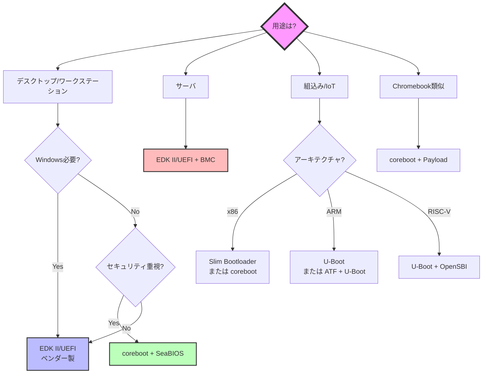

# ファームウェアの多様性

🎯 **この章で学ぶこと**
- 現代のファームウェアエコシステムの全体像
- EDK II/UEFI、coreboot、レガシーBIOSなど主要な実装の特徴
- プラットフォームごとの選択基準
- オープンソースとプロプライエタリファームウェアの比較

📚 **前提知識**
- [Part I: x86_64 ブート基礎](../part1/01-reset-vector.md)
- [Part II: EDK II 実装](../part2/01-hello-world.md)

---

## ファームウェアエコシステムの全体像

ファームウェアは、単一の標準ではなく、**多様な実装が共存**しています。



---

## 主要なファームウェア実装の比較

### 1. EDK II / Tianocore

**概要**: UEFI仕様の参照実装、Intelが主導

| 項目 | 詳細 |
|------|------|
| **ライセンス** | BSD (オープンソース) |
| **サイズ** | 4-8 MB |
| **対応アーキテクチャ** | x86, x86_64, ARM, AARCH64, RISC-V |
| **起動時間** | 中程度（2-3秒） |
| **主な用途** | デスクトップPC、サーバ、ワークステーション |
| **Secure Boot** | 完全サポート |
| **Windows対応** | 必須（Windows 10/11） |

**特徴**:
- UEFI仕様準拠
- 豊富なドライバとアプリケーション
- 企業サポート充実

### 2. coreboot

**概要**: 最小限のハードウェア初期化に特化、LinuxBIOSから発展

| 項目 | 詳細 |
|------|------|
| **ライセンス** | GPL v2 (オープンソース) |
| **サイズ** | 64-256 KB |
| **対応アーキテクチャ** | x86, x86_64, ARM, RISC-V |
| **起動時間** | 高速（< 1秒） |
| **主な用途** | Chromebook、組込み、セキュリティ重視PC |
| **Secure Boot** | UEFI Payload経由で可能 |
| **Windows対応** | UEFI Payload必要 |

**特徴**:
- 高速起動
- 小さいフットプリント
- Verified Boot（Google Chromebook）

### 3. レガシーBIOS

**概要**: 1980年代から続く伝統的なファームウェア

| 項目 | 詳細 |
|------|------|
| **ライセンス** | プロプライエタリ（多くは非公開） |
| **サイズ** | 128 KB - 2 MB |
| **対応アーキテクチャ** | x86のみ |
| **起動時間** | 高速（1-2秒） |
| **主な用途** | レガシーシステム |
| **Secure Boot** | なし |
| **Windows対応** | Windows 7まで |

**特徴**:
- シンプル
- MBRブート
- 16ビットリアルモード

### 4. U-Boot

**概要**: 組込みシステム向けブートローダ

| 項目 | 詳細 |
|------|------|
| **ライセンス** | GPL v2 (オープンソース) |
| **サイズ** | 100-500 KB |
| **対応アーキテクチャ** | ARM, MIPS, PowerPC, RISC-V, x86 |
| **起動時間** | 高速（< 1秒） |
| **主な用途** | 組込みLinux、IoT |
| **Secure Boot** | 限定的 |
| **Windows対応** | なし |

**特徴**:
- 多様なアーキテクチャサポート
- Linuxカーネル直接ブート
- ネットワークブート（TFTP）

### 5. Slim Bootloader (SBL)

**概要**: Intel製の軽量ブートローダ

| 項目 | 詳細 |
|------|------|
| **ライセンス** | BSD (オープンソース) |
| **サイズ** | 256-512 KB |
| **対応アーキテクチャ** | x86, x86_64 (Intel専用) |
| **起動時間** | 非常に高速（< 500ms） |
| **主な用途** | IoT、エッジコンピューティング |
| **Secure Boot** | サポート |
| **Windows対応** | 限定的 |

**特徴**:
- 超高速起動
- Pythonベースのビルドシステム
- モジュール構造

---

## プラットフォーム別の選択基準

### デスクトップ / ワークステーション

```
推奨: EDK II/UEFI (ベンダーファームウェア)

理由:
✅ Windows 10/11サポート必須
✅ Secure Boot必要
✅ 豊富なハードウェアサポート
✅ ベンダーサポート
```

**例**:
- Dell OptiPlex: Dell製UEFI
- HP EliteDesk: HP製UEFI
- 自作PC: AMI UEFI (マザーボードベンダー)

### サーバ

```
推奨: EDK II/UEFI + BMC統合

理由:
✅ リモート管理（IPMI/Redfish）
✅ RAS機能（Reliability, Availability, Serviceability）
✅ 大容量メモリサポート
✅ ホットプラグ対応
```

**例**:
- Dell PowerEdge: iDRAC統合UEFI
- HP ProLiant: iLO統合UEFI
- Supermicro: IPMI統合UEFI

### Chromebook

```
推奨: coreboot + UEFI Payload または depthcharge

理由:
✅ Verified Boot（改ざん検知）
✅ 高速起動（< 8秒でChrome OS起動）
✅ セキュリティ重視
✅ オープンソース
```

**例**:
- Google Pixelbook: coreboot + depthcharge
- ASUS Chromebook: coreboot
- Acer Chromebook: coreboot

### 組込みLinux

```
推奨: U-Boot または coreboot

理由:
✅ 小さいフットプリント
✅ カスタマイズ容易
✅ ネットワークブート
✅ Device Tree対応
```

**例**:
- Raspberry Pi: U-Boot
- BeagleBone: U-Boot
- 産業用PC: coreboot

### IoT / エッジ

```
推奨: Slim Bootloader (Intel) または U-Boot (ARM)

理由:
✅ 超高速起動
✅ 小さいフラッシュサイズ
✅ セキュリティ機能
✅ OTA更新対応
```

**例**:
- Intel Apollo Lake IoT: Slim Bootloader
- NXP i.MX: U-Boot
- Qualcomm IoT: UEFI

---

## オープンソース vs プロプライエタリ

### オープンソースファームウェア

**代表例**: coreboot, U-Boot, EDK II

✅ **利点**:
- **透明性**: すべてのコードが公開
- **監査可能**: セキュリティ脆弱性を独自検証
- **カスタマイズ**: 自由に改変
- **コミュニティサポート**: 活発な開発

❌ **欠点**:
- **ハードウェアサポート**: 限定的（ベンダー依存）
- **ドキュメント**: 不足しがち
- **商用サポート**: 限定的

### プロプライエタリファームウェア

**代表例**: AMI BIOS, Insyde H2O, Phoenix SecureCore

✅ **利点**:
- **ハードウェアサポート**: 最新チップセット対応
- **商用サポート**: ベンダーからの技術サポート
- **統合機能**: GUI Setup、ネットワークブート等
- **検証済み**: 大規模テスト

❌ **欠点**:
- **ブラックボックス**: ソースコード非公開
- **脆弱性**: 監査困難
- **ベンダーロックイン**: カスタマイズ困難
- **コスト**: ライセンス料

---

## 実際の選択例

### 例1: Linux専用PC

**要件**:
- Linux (Ubuntu) のみ使用
- Windows不要
- セキュリティ重視
- 高速起動

**選択**: coreboot + SeaBIOS

**理由**:
- Linux専用なのでUEFI不要
- Secure Boot不要
- corebootで高速起動
- オープンソースで監査可能

**実装**:
```
coreboot (ハードウェア初期化)
  → SeaBIOS (Legacy BIOS)
    → GRUB2
      → Linux Kernel
```

### 例2: Windows/Linuxデュアルブート

**要件**:
- Windows 11とLinux両方使用
- Secure Boot必要
- 汎用ハードウェア

**選択**: EDK II/UEFI (ベンダー製)

**理由**:
- Windows 11はSecure Boot必須
- UEFI標準サポート
- ベンダーファームウェアで安定性

**実装**:
```
UEFI Firmware
  → Secure Boot検証
    → GRUB2 (署名済み)
      → Linux Kernel または Windows Boot Manager
```

### 例3: 産業用組込みシステム

**要件**:
- ARM Cortex-A53
- 起動時間 < 2秒
- ネットワークブート対応
- 長期サポート（10年以上）

**選択**: U-Boot

**理由**:
- ARMサポート完全
- ネットワークブート標準装備
- 長期安定版（LTS）
- カスタマイズ容易

**実装**:
```
U-Boot (SPL)
  → U-Boot (full)
    → TFTP Boot または SD/eMMC Boot
      → Linux Kernel
```

---

## ファームウェアの将来動向

### 1. オープンソース化の進展

**Google Chromebook**の成功により、corebootが注目されています。

- **Pixel 7** (Google): ABL (Android Bootloader) + coreboot要素
- **System76**: coreboot + オープンEmbedded Controller
- **Purism**: coreboot + ME無効化

### 2. セキュリティの強化

**主な動向**:
- Measured Boot (TPM)
- Verified Boot (暗号学的検証)
- Firmware Resilience (NIST SP 800-193)

### 3. 標準化の進展

- **UEFI 2.10**: Confidential Computing対応
- **ACPI 6.5**: 新しい電源管理
- **SPDM** (Security Protocol and Data Model): デバイス認証

### 4. RISC-Vの台頭

**RISC-V**: オープンソースISA

- **SBI** (Supervisor Binary Interface)
- **U-Boot** RISC-V対応
- **EDK II** RISC-V移植

---

## まとめ

### ファームウェア選択のフローチャート



### 主要ファームウェアの比較表

| 項目 | EDK II/UEFI | coreboot | U-Boot | Slim Bootloader |
|------|-------------|----------|--------|----------------|
| **サイズ** | 4-8 MB | 64-256 KB | 100-500 KB | 256-512 KB |
| **起動時間** | 2-3秒 | < 1秒 | < 1秒 | < 500ms |
| **Windows対応** | ✅ 完全 | ⚠️ UEFI Payload経由 | ❌ なし | ⚠️ 限定的 |
| **Linux対応** | ✅ 完全 | ✅ 完全 | ✅ 完全 | ✅ 完全 |
| **Secure Boot** | ✅ 完全 | ⚠️ UEFI Payload経由 | ⚠️ 限定的 | ✅ あり |
| **オープンソース** | ✅ BSD | ✅ GPL v2 | ✅ GPL v2 | ✅ BSD |
| **アーキテクチャ** | 多数 | x86, ARM, RISC-V | 全て | Intel専用 |
| **主な用途** | 汎用PC、サーバ | Chromebook、組込み | 組込み | IoT |

---

## 💻 演習

### 演習 1: ファームウェアの調査

**課題**: 手元のPCやデバイスのファームウェアを調査する。

**Linux**:
```bash
# UEFI/BIOSベンダー確認
sudo dmidecode -t bios

# 例:
# BIOS Information
#   Vendor: American Megatrends Inc.
#   Version: 1.40
#   Release Date: 03/15/2023
```

**Windows**:
```powershell
Get-WmiObject -Class Win32_BIOS

# Manufacturer : American Megatrends Inc.
# Version      : 1.40
# ReleaseDate  : 20230315000000.000000+000
```

**質問**:
1. あなたのPCのファームウェアベンダーは？
2. UEFIとレガシーBIOSのどちらですか？
3. Secure Bootは有効ですか？

<details>
<summary>解答例</summary>

**1. ベンダー**

```bash
$ sudo dmidecode -t bios | grep Vendor
Vendor: American Megatrends Inc.
```

→ **AMI UEFI**

**2. UEFI vs Legacy**

```bash
$ ls /sys/firmware/efi
# /sys/firmware/efi ディレクトリが存在する → UEFI
# 存在しない → Legacy BIOS
```

→ **UEFI**

**3. Secure Boot**

```bash
$ mokutil --sb-state
SecureBoot enabled
```

→ **有効**

</details>

---

### 演習 2: corebootの可能性調査

**課題**: あなたのPCがcorebootに対応しているか調べる。

```bash
# corebootの対応ボード一覧
git clone https://review.coreboot.org/coreboot
cd coreboot
ls src/mainboard/

# 特定のベンダーを検索
ls src/mainboard/lenovo/
# x230  x240  t420  t430  ...
```

**質問**:
1. あなたのPC（またはターゲットPC）はcoreboot対応ですか？
2. 対応している場合、どのPayloadを使いますか？

<details>
<summary>解答例</summary>

**例: Lenovo ThinkPad X230**

**1. 対応状況**

```bash
$ ls src/mainboard/lenovo/ | grep x230
x230
```

→ **対応している**

**2. Payload選択**

**用途**: Linux専用、Windows不要

**選択**: SeaBIOS

**理由**:
- Linux専用なのでUEFI不要
- Secure Boot不要
- 軽量（128 KB）
- 高速起動

**設定**:
```bash
make menuconfig
# Mainboard → Lenovo → ThinkPad X230
# Payload → SeaBIOS
```

</details>

---

## 📚 参考資料

### ファームウェア実装

1. **EDK II**
   - https://github.com/tianocore/edk2

2. **coreboot**
   - https://www.coreboot.org/

3. **U-Boot**
   - https://www.denx.de/wiki/U-Boot

4. **Slim Bootloader**
   - https://slimbootloader.github.io/

### 仕様書

1. **UEFI Specification**
   - https://uefi.org/specifications

2. **ACPI Specification**
   - https://uefi.org/specifications

### コミュニティ

1. **coreboot Mailing List**
   - https://mail.coreboot.org/

2. **U-Boot Mailing List**
   - https://lists.denx.de/

---

次章: [Part VI Chapter 2: coreboot の設計思想](02-coreboot-philosophy.md)
