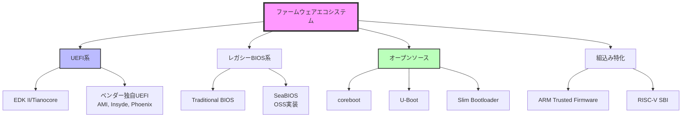
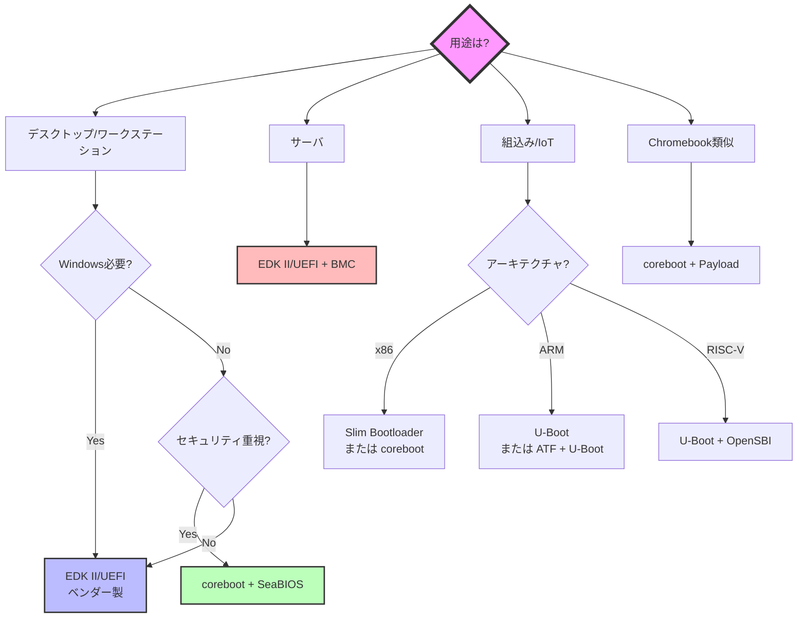

# ファームウェアの多様性

🎯 **この章で学ぶこと**
- 現代のファームウェアエコシステムの全体像
- EDK II/UEFI、coreboot、レガシーBIOSなど主要な実装の特徴
- プラットフォームごとの選択基準
- オープンソースとプロプライエタリファームウェアの比較

📚 **前提知識**
- [Part I: x86_64 ブート基礎](../part1/01-reset-vector.md)
- [Part II: EDK II 実装](../part2/01-hello-world.md)

---

## ファームウェアエコシステムの全体像

**ファームウェアの世界**は、単一の標準に収束するのではなく、**多様な実装が共存し進化し続けるエコシステム**として成長してきました。本書ではこれまで EDK II と UEFI 標準を中心に学んできましたが、実際のコンピュータシステムでは UEFI 以外にも coreboot、U-Boot、レガシー BIOS、Slim Bootloader など、さまざまなファームウェア実装が活用されています。これらの実装はそれぞれ異なる設計思想、ターゲットプラットフォーム、性能特性を持ち、用途や要件に応じて選択されます。

**プラットフォームの多様性**が、ファームウェアの多様性を生み出す主要因です。デスクトップ PC やワークステーションでは、Windows や Linux の互換性、Secure Boot のサポート、豊富なハードウェアサポートが求められるため、EDK II ベースの UEFI ファームウェアが主流です。一方、Chromebook ではセキュリティと高速起動が重視されるため、coreboot が採用されています。組込みシステムでは、小さいフットプリントと高速起動、Device Tree サポートが必要なため、U-Boot が広く使われています。サーバでは、リモート管理機能（IPMI や Redfish）や RAS 機能（Reliability, Availability, Serviceability）が不可欠なため、BMC と統合された UEFI ファームウェアが標準です。

**オープンソース対プロプライエタリ**という軸も重要です。EDK II、coreboot、U-Boot はすべてオープンソースであり、ソースコードが完全に公開されているため、セキュリティ監査やカスタマイズが可能です。特に coreboot は Google が Chromebook で採用したことで広く認知され、セキュリティを重視するユーザーから支持されています。一方、AMI BIOS、Insyde H2O、Phoenix SecureCore といった商用ファームウェアは、ベンダーからの技術サポート、最新チップセットへの迅速な対応、充実した GUI Setup などの利点があり、特にコンシューマー向け PC では主流です。

**アーキテクチャの多様性**も無視できません。x86_64 アーキテクチャは PC やサーバで圧倒的なシェアを持ち、EDK II と coreboot が対応しています。ARM アーキテクチャはモバイルデバイスや組込みシステムで広く使われ、U-Boot と ARM Trusted Firmware (ATF) が主要な選択肢です。RISC-V という新しいオープンソース ISA も急速に成長しており、U-Boot や EDK II が対応を進めています。したがって、ファームウェア開発者は、ターゲットアーキテクチャに応じて適切なファームウェア実装を選択する必要があります。

**ファームウェアの選択**は、単なる技術的判断ではなく、**ビジネス要件、セキュリティポリシー、長期サポート戦略、コスト、開発リソース**といった多面的な要素を考慮した意思決定です。本章では、主要なファームウェア実装の特徴を体系的に比較し、プラットフォームごとの選択基準を明確にし、実際の選択例を通じて意思決定プロセスを理解します。さらに、オープンソースとプロプライエタリファームウェアの利点と欠点を評価し、ファームウェアエコシステムの将来動向についても展望します。

以下の図は、現代のファームウェアエコシステムの全体像を示したものです。



---

## 主要なファームウェア実装の比較

### 1. EDK II / Tianocore

**概要**: UEFI仕様の参照実装、Intelが主導

| 項目 | 詳細 |
|------|------|
| **ライセンス** | BSD (オープンソース) |
| **サイズ** | 4-8 MB |
| **対応アーキテクチャ** | x86, x86_64, ARM, AARCH64, RISC-V |
| **起動時間** | 中程度（2-3秒） |
| **主な用途** | デスクトップPC、サーバ、ワークステーション |
| **Secure Boot** | 完全サポート |
| **Windows対応** | 必須（Windows 10/11） |

**特徴**:
- UEFI仕様準拠
- 豊富なドライバとアプリケーション
- 企業サポート充実

### 2. coreboot

**概要**: 最小限のハードウェア初期化に特化、LinuxBIOSから発展

| 項目 | 詳細 |
|------|------|
| **ライセンス** | GPL v2 (オープンソース) |
| **サイズ** | 64-256 KB |
| **対応アーキテクチャ** | x86, x86_64, ARM, RISC-V |
| **起動時間** | 高速（< 1秒） |
| **主な用途** | Chromebook、組込み、セキュリティ重視PC |
| **Secure Boot** | UEFI Payload経由で可能 |
| **Windows対応** | UEFI Payload必要 |

**特徴**:
- 高速起動
- 小さいフットプリント
- Verified Boot（Google Chromebook）

<div style="border: 2px solid #4a90e2; border-radius: 8px; padding: 10px 20px 20px 20px; margin: 20px 0;">

## 💡 コラム: coreboot プロジェクトの20年 - オープンソースファームウェアの挑戦

**👥 コミュニティの話**

coreboot プロジェクトの歴史は、**オープンソースファームウェアの可能性と限界**を示す壮大な物語です。1999年、ロスアラモス国立研究所の研究者たちが、スーパーコンピュータのクラスタを高速起動させるため、「LinuxBIOS」という実験的なプロジェクトを開始しました。当時の BIOS は起動に数分かかることもあり、1000台規模のクラスタでは致命的なボトルネックでした。LinuxBIOS の目標は明確でした：**必要最小限のハードウェア初期化だけを行い、すぐに Linux カーネルを起動する**。この思想は、現在の coreboot にも受け継がれています。

2000年代初頭、LinuxBIOS は AMD の支援を受けて発展しました。AMD は、Opteron プロセッサ向けの初期化コードを LinuxBIOS に提供し、オープンソースコミュニティとの協力関係を築きました。しかし、Intel は当初、オープンソースファームウェアに懐疑的であり、初期化コードの公開を拒否しました。この状況は、2008年にプロジェクト名が「coreboot」に変更され、目標が「Linux 専用ブートローダ」から「汎用的なオープンソースファームウェアフレームワーク」へと拡大した後も続きました。

**転機は2011年、Google が Chromebook に coreboot を採用したこと**でした。Google は、セキュリティと高速起動を重視し、coreboot に **Verified Boot** という独自の署名検証機構を実装しました。Chromebook は世界で数千万台が出荷され、coreboot は一躍「実用的なオープンソースファームウェア」として認知されました。この成功を受けて、Intel も態度を軟化させ、Firmware Support Package（FSP）という形で初期化コードを提供し始めました。現在、coreboot は Google、Facebook（現 Meta）、System76 といった企業から支援を受け、活発に開発が続いています。

coreboot の**技術的な特徴**は、そのモジュール設計にあります。coreboot 本体は、CPU とチップセットの初期化、DRAM の設定、キャッシュ設定など、**プラットフォーム固有の最小限の処理**だけを行います。その後、**Payload** と呼ばれるモジュールに制御を移譲し、Payload が OS ブートや UEFI 互換性を提供します。代表的な Payload には、SeaBIOS（レガシー BIOS 互換）、TianoCore（UEFI 互換）、GRUB2（直接ブート）、depthcharge（Chromebook 専用）があります。この設計により、coreboot は柔軟性と小さいフットプリント（64-256 KB）を両立しています。

しかし、coreboot には**普及の壁**も存在します。最大の課題は、**ハードウェアサポートの限定性**です。coreboot は、各マザーボードごとに専用の初期化コードが必要であり、コミュニティがサポートしているボードは限られています。Chromebook や一部のサーバマザーボード（Supermicro の一部モデルなど）では採用されていますが、一般的なコンシューマー向け PC ではほとんど見られません。また、Windows のサポートには UEFI Payload が必要であり、Secure Boot の実装も複雑です。これらの理由から、coreboot は「オープンソースを重視するニッチな市場」に留まっています。

それでも、coreboot の**哲学的な影響**は計り知れません。「ファームウェアはブラックボックスであってはならない」「ユーザーは自分のハードウェアを完全に制御すべきだ」という主張は、セキュリティ研究者やプライバシー擁護者から強く支持されています。また、coreboot の成功は、Intel に FSP の公開を促し、Slim Bootloader という新たなオープンソースプロジェクトを生み出しました。coreboot は、20年間の挑戦を通じて、ファームウェアエコシステムに「透明性と選択肢」をもたらし続けています。

**📚 参考資料**
- [coreboot Official Website](https://www.coreboot.org/)
- [coreboot Documentation](https://doc.coreboot.org/)
- [LinuxBIOS: A Modern, Open-Source x86 Firmware (2003 Paper)](https://www.coreboot.org/images/6/6c/LCA-2003-linuxbios.pdf)
- [Google Chromebook Verified Boot](https://www.chromium.org/chromium-os/chromiumos-design-docs/verified-boot/)

</div>

### 3. レガシーBIOS

**概要**: 1980年代から続く伝統的なファームウェア

| 項目 | 詳細 |
|------|------|
| **ライセンス** | プロプライエタリ（多くは非公開） |
| **サイズ** | 128 KB - 2 MB |
| **対応アーキテクチャ** | x86のみ |
| **起動時間** | 高速（1-2秒） |
| **主な用途** | レガシーシステム |
| **Secure Boot** | なし |
| **Windows対応** | Windows 7まで |

**特徴**:
- シンプル
- MBRブート
- 16ビットリアルモード

### 4. U-Boot

**概要**: 組込みシステム向けブートローダ

| 項目 | 詳細 |
|------|------|
| **ライセンス** | GPL v2 (オープンソース) |
| **サイズ** | 100-500 KB |
| **対応アーキテクチャ** | ARM, MIPS, PowerPC, RISC-V, x86 |
| **起動時間** | 高速（< 1秒） |
| **主な用途** | 組込みLinux、IoT |
| **Secure Boot** | 限定的 |
| **Windows対応** | なし |

**特徴**:
- 多様なアーキテクチャサポート
- Linuxカーネル直接ブート
- ネットワークブート（TFTP）

### 5. Slim Bootloader (SBL)

**概要**: Intel製の軽量ブートローダ

| 項目 | 詳細 |
|------|------|
| **ライセンス** | BSD (オープンソース) |
| **サイズ** | 256-512 KB |
| **対応アーキテクチャ** | x86, x86_64 (Intel専用) |
| **起動時間** | 非常に高速（< 500ms） |
| **主な用途** | IoT、エッジコンピューティング |
| **Secure Boot** | サポート |
| **Windows対応** | 限定的 |

**特徴**:
- 超高速起動
- Pythonベースのビルドシステム
- モジュール構造

---

## プラットフォーム別の選択基準

### デスクトップ / ワークステーション

```
推奨: EDK II/UEFI (ベンダーファームウェア)

理由:
✅ Windows 10/11サポート必須
✅ Secure Boot必要
✅ 豊富なハードウェアサポート
✅ ベンダーサポート
```

**例**:
- Dell OptiPlex: Dell製UEFI
- HP EliteDesk: HP製UEFI
- 自作PC: AMI UEFI (マザーボードベンダー)

### サーバ

```
推奨: EDK II/UEFI + BMC統合

理由:
✅ リモート管理（IPMI/Redfish）
✅ RAS機能（Reliability, Availability, Serviceability）
✅ 大容量メモリサポート
✅ ホットプラグ対応
```

**例**:
- Dell PowerEdge: iDRAC統合UEFI
- HP ProLiant: iLO統合UEFI
- Supermicro: IPMI統合UEFI

### Chromebook

```
推奨: coreboot + UEFI Payload または depthcharge

理由:
✅ Verified Boot（改ざん検知）
✅ 高速起動（< 8秒でChrome OS起動）
✅ セキュリティ重視
✅ オープンソース
```

**例**:
- Google Pixelbook: coreboot + depthcharge
- ASUS Chromebook: coreboot
- Acer Chromebook: coreboot

### 組込みLinux

```
推奨: U-Boot または coreboot

理由:
✅ 小さいフットプリント
✅ カスタマイズ容易
✅ ネットワークブート
✅ Device Tree対応
```

**例**:
- Raspberry Pi: U-Boot
- BeagleBone: U-Boot
- 産業用PC: coreboot

### IoT / エッジ

```
推奨: Slim Bootloader (Intel) または U-Boot (ARM)

理由:
✅ 超高速起動
✅ 小さいフラッシュサイズ
✅ セキュリティ機能
✅ OTA更新対応
```

**例**:
- Intel Apollo Lake IoT: Slim Bootloader
- NXP i.MX: U-Boot
- Qualcomm IoT: UEFI

---

## オープンソース vs プロプライエタリ

### オープンソースファームウェア

**代表例**: coreboot, U-Boot, EDK II

✅ **利点**:
- **透明性**: すべてのコードが公開
- **監査可能**: セキュリティ脆弱性を独自検証
- **カスタマイズ**: 自由に改変
- **コミュニティサポート**: 活発な開発

❌ **欠点**:
- **ハードウェアサポート**: 限定的（ベンダー依存）
- **ドキュメント**: 不足しがち
- **商用サポート**: 限定的

### プロプライエタリファームウェア

**代表例**: AMI BIOS, Insyde H2O, Phoenix SecureCore

✅ **利点**:
- **ハードウェアサポート**: 最新チップセット対応
- **商用サポート**: ベンダーからの技術サポート
- **統合機能**: GUI Setup、ネットワークブート等
- **検証済み**: 大規模テスト

❌ **欠点**:
- **ブラックボックス**: ソースコード非公開
- **脆弱性**: 監査困難
- **ベンダーロックイン**: カスタマイズ困難
- **コスト**: ライセンス料

---

## 実際の選択例

### 例1: Linux専用PC

**要件**:
- Linux (Ubuntu) のみ使用
- Windows不要
- セキュリティ重視
- 高速起動

**選択**: coreboot + SeaBIOS

**理由**:
- Linux専用なのでUEFI不要
- Secure Boot不要
- corebootで高速起動
- オープンソースで監査可能

**実装**:
```
coreboot (ハードウェア初期化)
  → SeaBIOS (Legacy BIOS)
    → GRUB2
      → Linux Kernel
```

### 例2: Windows/Linuxデュアルブート

**要件**:
- Windows 11とLinux両方使用
- Secure Boot必要
- 汎用ハードウェア

**選択**: EDK II/UEFI (ベンダー製)

**理由**:
- Windows 11はSecure Boot必須
- UEFI標準サポート
- ベンダーファームウェアで安定性

**実装**:
```
UEFI Firmware
  → Secure Boot検証
    → GRUB2 (署名済み)
      → Linux Kernel または Windows Boot Manager
```

### 例3: 産業用組込みシステム

**要件**:
- ARM Cortex-A53
- 起動時間 < 2秒
- ネットワークブート対応
- 長期サポート（10年以上）

**選択**: U-Boot

**理由**:
- ARMサポート完全
- ネットワークブート標準装備
- 長期安定版（LTS）
- カスタマイズ容易

**実装**:
```
U-Boot (SPL)
  → U-Boot (full)
    → TFTP Boot または SD/eMMC Boot
      → Linux Kernel
```

---

## ファームウェアの将来動向

### 1. オープンソース化の進展

**Google Chromebook**の成功により、corebootが注目されています。

- **Pixel 7** (Google): ABL (Android Bootloader) + coreboot要素
- **System76**: coreboot + オープンEmbedded Controller
- **Purism**: coreboot + ME無効化

### 2. セキュリティの強化

**主な動向**:
- Measured Boot (TPM)
- Verified Boot (暗号学的検証)
- Firmware Resilience (NIST SP 800-193)

### 3. 標準化の進展

- **UEFI 2.10**: Confidential Computing対応
- **ACPI 6.5**: 新しい電源管理
- **SPDM** (Security Protocol and Data Model): デバイス認証

### 4. RISC-Vの台頭

**RISC-V**: オープンソースISA

- **SBI** (Supervisor Binary Interface)
- **U-Boot** RISC-V対応
- **EDK II** RISC-V移植

---

## まとめ

この章では、**ファームウェアエコシステムの多様性**と、プラットフォームや要件に応じた適切なファームウェア実装の選択方法を学びました。ファームウェアは単一の標準に収束するのではなく、EDK II/UEFI、coreboot、U-Boot、レガシー BIOS、Slim Bootloader といった多様な実装が共存し、それぞれが異なる設計思想とターゲットプラットフォームを持っています。

**主要なファームウェア実装の特徴**として、まず **EDK II/UEFI** は、UEFI 仕様の参照実装であり、4-8 MB のサイズで起動時間は 2-3 秒程度です。Windows 10/11 のサポートには Secure Boot が必須であるため、デスクトップ PC、ワークステーション、サーバでは EDK II ベースの UEFI ファームウェアが標準です。ライセンスは BSD でオープンソースですが、実際には AMI、Insyde、Phoenix などのベンダーが独自のカスタマイズを加えた商用ファームウェアが主流です。次に **coreboot** は、最小限のハードウェア初期化に特化したファームウェアであり、64-256 KB という非常に小さいサイズで起動時間は 1 秒未満です。Google Chromebook で採用されており、Verified Boot による改ざん検知とオープンソース（GPL v2）による透明性が特徴です。Windows を動かす場合は UEFI Payload（TianoCore）を組み合わせる必要があります。さらに **U-Boot** は、組込みシステム向けのブートローダであり、100-500 KB のサイズで起動時間は 1 秒未満です。ARM、MIPS、PowerPC、RISC-V など多様なアーキテクチャをサポートし、Device Tree による柔軟なハードウェア記述と TFTP によるネットワークブートが可能です。組込み Linux や IoT デバイスで広く使われています。最後に **Slim Bootloader** は、Intel が開発した軽量ブートローダであり、256-512 KB のサイズで起動時間は 500 ミリ秒未満という超高速起動を実現します。IoT やエッジコンピューティングに最適化されており、Python ベースのビルドシステムとモジュール構造が特徴です。

**プラットフォーム別の選択基準**として、まず**デスクトップ/ワークステーション**では、Windows 10/11 が Secure Boot を必須とするため、EDK II ベースの UEFI ファームウェア（ベンダー製）が推奨されます。Dell OptiPlex、HP EliteDesk、自作 PC のマザーボード（AMI UEFI）などがこのカテゴリです。**サーバ**では、リモート管理（IPMI や Redfish）、RAS 機能、大容量メモリサポート、ホットプラグ対応が必要なため、BMC と統合された UEFI ファームウェアが標準です。Dell PowerEdge（iDRAC）、HP ProLiant（iLO）、Supermicro（IPMI）などが該当します。**Chromebook** では、Verified Boot によるセキュリティと高速起動（8 秒未満で Chrome OS が起動）が重視されるため、coreboot + UEFI Payload または depthcharge が採用されています。Google Pixelbook、ASUS Chromebook、Acer Chromebook などがこのカテゴリです。**組込み Linux** では、小さいフットプリント、カスタマイズの容易性、ネットワークブート、Device Tree 対応が求められるため、U-Boot または coreboot が推奨されます。Raspberry Pi、BeagleBone、産業用 PC などで使用されます。**IoT/エッジ**では、超高速起動、小さいフラッシュサイズ、セキュリティ機能、OTA 更新対応が必要なため、Slim Bootloader（Intel プラットフォーム）または U-Boot（ARM プラットフォーム）が選択されます。

**オープンソース対プロプライエタリ**の比較では、オープンソースファームウェア（coreboot、U-Boot、EDK II）は**透明性**（すべてのコードが公開）、**監査可能性**（セキュリティ脆弱性を独自検証）、**カスタマイズ性**（自由に改変）、**コミュニティサポート**（活発な開発）という利点があります。一方、欠点としては**ハードウェアサポートの限定性**（ベンダー依存）、**ドキュメントの不足**、**商用サポートの限定性**があります。プロプライエタリファームウェア（AMI BIOS、Insyde H2O、Phoenix SecureCore）は、**最新チップセット対応**、**商用サポート**（ベンダーからの技術サポート）、**統合機能**（GUI Setup、ネットワークブート等）、**大規模テスト**による検証済み品質という利点があります。一方、欠点としては**ブラックボックス性**（ソースコード非公開）、**脆弱性の監査困難性**、**ベンダーロックイン**（カスタマイズ困難）、**ライセンス料**があります。

**実際の選択例**として、**Linux 専用 PC**（Ubuntu のみ使用、Windows 不要、セキュリティ重視、高速起動）では、coreboot + SeaBIOS が適切です。Linux 専用なので UEFI は不要であり、Secure Boot も不要です。coreboot により高速起動が実現でき、オープンソースでセキュリティ監査が可能です。**Windows/Linux デュアルブート**（Windows 11 と Linux 両方使用、Secure Boot 必要、汎用ハードウェア）では、EDK II/UEFI（ベンダー製）が必須です。Windows 11 は Secure Boot を必須とし、UEFI 標準サポートが必要です。ベンダーファームウェアにより安定性が保証されます。**産業用組込みシステム**（ARM Cortex-A53、起動時間 2 秒未満、ネットワークブート対応、長期サポート 10 年以上）では、U-Boot が最適です。ARM サポートが完全であり、ネットワークブート（TFTP）が標準装備され、長期安定版（LTS）が提供され、カスタマイズが容易です。

**ファームウェアの将来動向**として、まず**オープンソース化の進展**が顕著です。Google Chromebook の成功により coreboot が注目され、System76 や Purism といった企業が coreboot とオープン Embedded Controller を採用した PC を販売しています。次に**セキュリティの強化**として、Measured Boot（TPM）、Verified Boot（暗号学的検証）、Firmware Resilience（NIST SP 800-193）といった仕組みが標準化されています。さらに**標準化の進展**として、UEFI 2.10 が Confidential Computing に対応し、ACPI 6.5 が新しい電源管理機能を追加し、SPDM（Security Protocol and Data Model）がデバイス認証の標準として策定されています。最後に **RISC-V の台頭**として、オープンソース ISA である RISC-V が急速に成長しており、SBI（Supervisor Binary Interface）、U-Boot の RISC-V 対応、EDK II の RISC-V 移植が進んでいます。

**ファームウェア選択の意思決定プロセス**は、まず**用途の特定**（デスクトップ、サーバ、組込み、IoT）から始まります。次に**OS 要件の確認**（Windows が必要か、Linux 専用か）を行い、Windows が必要な場合は UEFI と Secure Boot が必須です。さらに**セキュリティ要件の評価**（オープンソースでの監査可能性が必要か、商用サポートが必要か）を行います。次に**アーキテクチャの選択**（x86、ARM、RISC-V）に応じて対応ファームウェアを絞り込みます。最後に**パフォーマンス要件**（起動時間、フットプリント）と**サポート要件**（長期サポート、コミュニティサポート、商用サポート）を総合的に評価して最終決定します。この体系的なアプローチにより、プロジェクトに最適なファームウェア実装を選択できます。

以下の補足図は、用途別のファームウェア選択フローチャートを示しています。

**補足図: ファームウェア選択のフローチャート**



以下の参考表は、主要ファームウェアの特性を比較したものです。

**参考表: 主要ファームウェアの比較**

| 項目 | EDK II/UEFI | coreboot | U-Boot | Slim Bootloader |
|------|-------------|----------|--------|----------------|
| **サイズ** | 4-8 MB | 64-256 KB | 100-500 KB | 256-512 KB |
| **起動時間** | 2-3秒 | < 1秒 | < 1秒 | < 500ms |
| **Windows対応** | ✅ 完全 | ⚠️ UEFI Payload経由 | ❌ なし | ⚠️ 限定的 |
| **Linux対応** | ✅ 完全 | ✅ 完全 | ✅ 完全 | ✅ 完全 |
| **Secure Boot** | ✅ 完全 | ⚠️ UEFI Payload経由 | ⚠️ 限定的 | ✅ あり |
| **オープンソース** | ✅ BSD | ✅ GPL v2 | ✅ GPL v2 | ✅ BSD |
| **アーキテクチャ** | 多数 | x86, ARM, RISC-V | 全て | Intel専用 |
| **主な用途** | 汎用PC、サーバ | Chromebook、組込み | 組込み | IoT |

---

## 💻 演習

### 演習 1: ファームウェアの調査

**課題**: 手元のPCやデバイスのファームウェアを調査する。

**Linux**:
```bash
# UEFI/BIOSベンダー確認
sudo dmidecode -t bios

# 例:
# BIOS Information
#   Vendor: American Megatrends Inc.
#   Version: 1.40
#   Release Date: 03/15/2023
```

**Windows**:
```powershell
Get-WmiObject -Class Win32_BIOS

# Manufacturer : American Megatrends Inc.
# Version      : 1.40
# ReleaseDate  : 20230315000000.000000+000
```

**質問**:
1. あなたのPCのファームウェアベンダーは？
2. UEFIとレガシーBIOSのどちらですか？
3. Secure Bootは有効ですか？

<details>
<summary>解答例</summary>

**1. ベンダー**

```bash
$ sudo dmidecode -t bios | grep Vendor
Vendor: American Megatrends Inc.
```

→ **AMI UEFI**

**2. UEFI vs Legacy**

```bash
$ ls /sys/firmware/efi
# /sys/firmware/efi ディレクトリが存在する → UEFI
# 存在しない → Legacy BIOS
```

→ **UEFI**

**3. Secure Boot**

```bash
$ mokutil --sb-state
SecureBoot enabled
```

→ **有効**

</details>

---

### 演習 2: corebootの可能性調査

**課題**: あなたのPCがcorebootに対応しているか調べる。

```bash
# corebootの対応ボード一覧
git clone https://review.coreboot.org/coreboot
cd coreboot
ls src/mainboard/

# 特定のベンダーを検索
ls src/mainboard/lenovo/
# x230  x240  t420  t430  ...
```

**質問**:
1. あなたのPC（またはターゲットPC）はcoreboot対応ですか？
2. 対応している場合、どのPayloadを使いますか？

<details>
<summary>解答例</summary>

**例: Lenovo ThinkPad X230**

**1. 対応状況**

```bash
$ ls src/mainboard/lenovo/ | grep x230
x230
```

→ **対応している**

**2. Payload選択**

**用途**: Linux専用、Windows不要

**選択**: SeaBIOS

**理由**:
- Linux専用なのでUEFI不要
- Secure Boot不要
- 軽量（128 KB）
- 高速起動

**設定**:
```bash
make menuconfig
# Mainboard → Lenovo → ThinkPad X230
# Payload → SeaBIOS
```

</details>

---

## 📚 参考資料

### ファームウェア実装

1. **EDK II**
   - https://github.com/tianocore/edk2

2. **coreboot**
   - https://www.coreboot.org/

3. **U-Boot**
   - https://www.denx.de/wiki/U-Boot

4. **Slim Bootloader**
   - https://slimbootloader.github.io/

### 仕様書

1. **UEFI Specification**
   - https://uefi.org/specifications

2. **ACPI Specification**
   - https://uefi.org/specifications

### コミュニティ

1. **coreboot Mailing List**
   - https://mail.coreboot.org/

2. **U-Boot Mailing List**
   - https://lists.denx.de/

---

次章: [Part VI Chapter 2: coreboot の設計思想](02-coreboot-philosophy.md)
