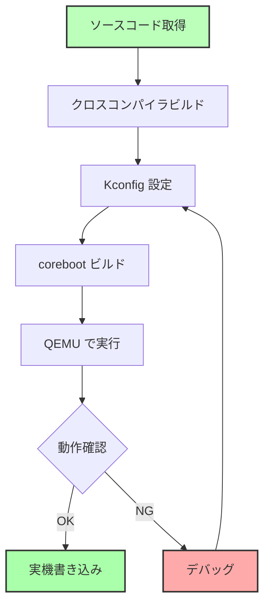

# coreboot のビルドと実行

🎯 **この章で学ぶこと**
- coreboot のソースコード取得と依存パッケージのインストール
- クロスコンパイラのビルド
- Kconfig による設定
- coreboot のビルドとデバッグ
- QEMU での実行と動作確認

📚 **前提知識**
- [Part VI Chapter 1: coreboot 概要](01-coreboot-overview.md)
- [Part 0 Chapter 2: 開発環境構築（Linux）](../part0/02-dev-environment-unix.md)
- Linux コマンドラインの基本操作

---

## 環境準備

### 必要なツール

coreboot のビルドには、以下のツールが必要です。

**Ubuntu/Debian**:

```bash
sudo apt-get update
sudo apt-get install -y \
  git build-essential gnat flex bison libncurses5-dev wget zlib1g-dev \
  python3 python3-distutils
```

**Fedora/RHEL**:

```bash
sudo dnf install -y \
  git gcc-gnat flex bison ncurses-devel wget zlib-devel \
  python3
```

**macOS (Homebrew)**:

```bash
brew install coreboot-toolchain
# または個別に
brew install gcc nasm qemu
```

### ディスク容量の確認

coreboot のビルドには、十分なディスク容量が必要です。

```bash
# 必要な容量
- coreboot ソースコード: ~500 MB
- クロスコンパイラ: ~2 GB
- ビルド成果物: ~500 MB
# 合計: 約 3 GB
```

```bash
# 現在の空き容量を確認
df -h .
```

---

## ソースコードの取得

### coreboot のクローン

```bash
# 最新版をクローン
git clone https://review.coreboot.org/coreboot
cd coreboot

# サブモジュールの初期化（重要！）
git submodule update --init --recursive
```

**サブモジュールの内容**:
- `3rdparty/blobs`: バイナリブロブ（Intel ME, VGA BIOS など）
- `3rdparty/arm-trusted-firmware`: ARM TrustZone
- `util/crossgcc/tarballs`: クロスコンパイラのソース

### ディレクトリ構造

```bash
$ tree -L 1 -d
.
├── 3rdparty           # サードパーティコード（FSP, AGESA など）
├── Documentation      # ドキュメント
├── configs            # サンプル設定ファイル
├── payloads           # Payload（SeaBIOS, GRUB2 など）
├── src                # coreboot 本体のソースコード
│   ├── acpi           # ACPI テーブル
│   ├── arch           # アーキテクチャ固有コード（x86, ARM, RISC-V）
│   ├── cpu            # CPU 初期化
│   ├── device         # デバイスドライバ
│   ├── drivers        # 汎用ドライバ
│   ├── ec             # Embedded Controller
│   ├── lib            # ライブラリ関数
│   ├── mainboard      # メインボード固有コード
│   ├── northbridge    # ノースブリッジ（メモリコントローラ）
│   ├── soc            # System-on-Chip（Intel, AMD）
│   └── southbridge    # サウスブリッジ（PCH）
├── util               # ユーティリティツール
│   ├── cbfstool       # CBFS 操作ツール
│   ├── crossgcc       # クロスコンパイラビルドスクリプト
│   └── kconfig        # Kconfig ツール
└── build              # ビルド成果物（生成される）
```

---

## クロスコンパイラのビルド

coreboot は、複数のアーキテクチャ（x86, ARM, RISC-V）をサポートしているため、専用のクロスコンパイラが必要です。

### x86_64 用のクロスコンパイラをビルド

```bash
# x86_64 (i386) 用のクロスコンパイラをビルド
make crossgcc-i386 CPUS=$(nproc)
```

**所要時間**: 10-30 分（CPUとネットワーク速度に依存）

**ビルド内容**:
- GCC (GNU Compiler Collection)
- binutils (アセンブラ、リンカ)
- GDB (デバッガ)

**インストール先**:

```bash
$ ls util/crossgcc/xgcc/bin/
i386-elf-addr2line  i386-elf-gcc       i386-elf-nm       ...
i386-elf-ar         i386-elf-gcc-ar    i386-elf-objcopy
i386-elf-as         i386-elf-gcov      i386-elf-objdump
i386-elf-gdb        i386-elf-ld        i386-elf-ranlib
```

### 複数アーキテクチャのビルド

```bash
# すべてのアーキテクチャ（時間がかかる）
make crossgcc-all CPUS=$(nproc)

# 個別に指定
make crossgcc-i386 CPUS=$(nproc)   # x86 (32-bit)
make crossgcc-x64 CPUS=$(nproc)    # x86_64 (64-bit)
make crossgcc-arm CPUS=$(nproc)    # ARM
make crossgcc-aarch64 CPUS=$(nproc)  # ARM64
make crossgcc-riscv CPUS=$(nproc)  # RISC-V
```

### トラブルシューティング: クロスコンパイラのビルド失敗

**問題 1: gnat (Ada コンパイラ) が見つからない**

```bash
# Ubuntu/Debian
sudo apt-get install gnat

# Fedora
sudo dnf install gcc-gnat
```

**問題 2: ディスク容量不足**

```bash
# /tmp のクリーンアップ
sudo rm -rf /tmp/*

# ビルドディレクトリを別の場所に
export TMPDIR=/path/to/large/partition/tmp
mkdir -p $TMPDIR
```

---

## ボードの選択と設定

### Kconfig による設定

coreboot は Linux カーネルと同じ **Kconfig** システムを使用します。

```bash
# メニュー形式の設定画面を開く
make menuconfig
```

**設定画面**:

```
┌───────────────────── coreboot Configuration ──────────────────────┐
│  Arrow keys navigate the menu.  <Enter> selects submenus --->.   │
│  Highlighted letters are hotkeys.  Pressing <Y> includes, <N>    │
│  excludes, <M> modularizes features.  Press <Esc><Esc> to exit,  │
│  <?> for Help, </> for Search.  Legend: [*] built-in  [ ]         │
│ ┌───────────────────────────────────────────────────────────────┐ │
│ │    General setup  --->                                        │ │
│ │    Mainboard  --->                                            │ │
│ │    Chipset  --->                                              │ │
│ │    Devices  --->                                              │ │
│ │    Generic Drivers  --->                                      │ │
│ │    Console  --->                                              │ │
│ │    System tables  --->                                        │ │
│ │    Payload  --->                                              │ │
│ └───────────────────────────────────────────────────────────────┘ │
├─────────────────────────────────────────────────────────────────┤
│        <Select>    < Exit >    < Help >    < Save >    < Load >  │
└─────────────────────────────────────────────────────────────────┘
```

### QEMU エミュレータ用の設定

**ステップ 1: Mainboard の選択**

```
Mainboard  --->
  Mainboard vendor (Emulation)  --->
    (X) Emulation
  Mainboard model (QEMU x86 i440fx/piix4)  --->
    (X) QEMU x86 i440fx/piix4
  ROM chip size (8192 KB (8 MB))  --->
    (X) 8192 KB (8 MB)
```

**ステップ 2: Payload の選択**

```
Payload  --->
  Add a payload (SeaBIOS)  --->
    (X) SeaBIOS
  SeaBIOS version (master)  --->
```

**ステップ 3: Console の設定**

```
Console  --->
  [*] Send console output to a CBMEM buffer
  [*] Send POST codes to an external device
  [*] Send POST codes to I/O port 0x80
```

**ステップ 4: 設定を保存**

```
<Save> を選択 → .config に保存
<Exit> で終了
```

### 設定ファイルの確認

```bash
# 生成された .config を確認
cat .config

# 主要な設定
CONFIG_VENDOR_EMULATION=y
CONFIG_BOARD_EMULATION_QEMU_X86_I440FX=y
CONFIG_CBFS_SIZE=0x00800000
CONFIG_PAYLOAD_SEABIOS=y
CONFIG_CONSOLE_CBMEM=y
```

---

## coreboot のビルド

### ビルド実行

```bash
# 並列ビルド（CPU コア数に応じて高速化）
make -j$(nproc)
```

**ビルドログ抜粋**:

```
    HOSTCC     cbfstool (link)
    OPTION     option_table.h
    GEN        build.h
    ROMCC      romstage/cpu/x86/16bit/entry16.inc
    CC         romstage/arch/x86/bootblock_simple.o
    CC         romstage/lib/cbfs.o
    ...
    CBFS       coreboot.rom
    CBFSPRINT  coreboot.rom

Name                           Offset     Type         Size   Comp
fallback/romstage              0x0        stage        24576  none
fallback/ramstage              0x6000     stage        98304  LZMA (198304 decompressed)
fallback/payload               0x24000    payload      65536  none
config                         0x34000    raw          2048   LZMA
(empty)                        0x34800    null         7963648 none
```

**成果物**:

```bash
$ ls -lh build/coreboot.rom
-rw-r--r-- 1 user user 8.0M Oct  5 12:34 build/coreboot.rom
```

### ビルド成果物の確認

```bash
# cbfstool で ROM イメージの内容を確認
./build/cbfstool build/coreboot.rom print

# 詳細情報
./build/cbfstool build/coreboot.rom print -v
```

---

## QEMU での実行

### 基本的な実行

```bash
# coreboot を BIOS として QEMU を起動
qemu-system-x86_64 \
  -bios build/coreboot.rom \
  -serial stdio \
  -m 1G
```

**起動ログ**:

```
coreboot-4.15 Mon Oct  5 12:34:56 UTC 2023 bootblock starting (log level: 8)...
CBFS: 'Master Header Locator' located CBFS at [500100:7fffc0)
CBFS: Locating 'fallback/romstage'
CBFS: Found @ offset 80 size c00

coreboot-4.15 Mon Oct  5 12:34:56 UTC 2023 romstage starting (log level: 7)...
CBFS: 'Master Header Locator' located CBFS at [500100:7fffc0)
CBFS: Locating 'fallback/ramstage'
CBFS: Found @ offset 6000 size 18000

coreboot-4.15 Mon Oct  5 12:34:56 UTC 2023 ramstage starting (log level: 7)...
Enumerating buses...
Show all devs... Before device enumeration.
Root Device: enabled 1
...
Initializing devices...
Devices initialized
Writing coreboot table at 0x00500000
CBMEM:
 0. 00000000500001c0 00000000 0000003c VBOOT
 1. 00000000500002c0 00000000 00000000 CONSOLE
...
Jumping to boot code at 0x1110000(0x00000000)
SeaBIOS (version rel-1.14.0-0-g155821a1990b)


iPXE (http://ipxe.org) 00:03.0 C900 PCI2.10 PnP PMM+07F8F4A0+07ECF4A0 C900


Booting from Hard Disk...
```

### デバッグオプション

**シリアル出力をファイルに保存**:

```bash
qemu-system-x86_64 \
  -bios build/coreboot.rom \
  -serial file:serial.log \
  -m 1G
```

**GDB でデバッグ**:

```bash
# QEMU を GDB サーバモードで起動
qemu-system-x86_64 \
  -bios build/coreboot.rom \
  -s -S \
  -nographic

# 別のターミナルで GDB を起動
$ gdb
(gdb) target remote localhost:1234
(gdb) break *0xFFFFFFF0  # リセットベクタ
(gdb) continue
```

### ディスクイメージの追加

```bash
# ディスクイメージを作成
dd if=/dev/zero of=disk.img bs=1M count=100
mkfs.ext4 disk.img

# ディスクイメージをマウント
qemu-system-x86_64 \
  -bios build/coreboot.rom \
  -drive file=disk.img,format=raw \
  -serial stdio \
  -m 1G
```

---

## Payload の選択

### SeaBIOS (デフォルト)

**特徴**:
- レガシー BIOS エミュレーション
- MBR (Master Boot Record) ブート
- 高速（128 KB 程度）

**設定**:

```
Payload  --->
  Add a payload (SeaBIOS)  --->
    (X) SeaBIOS
```

### GRUB2

**特徴**:
- 直接 Linux カーネルをロード
- マルチブート対応

**設定**:

```
Payload  --->
  Add a payload (GRUB2)  --->
    (X) GRUB2
  GRUB2 version (HEAD)  --->
```

**ビルドと実行**:

```bash
make menuconfig  # GRUB2 を選択
make clean
make -j$(nproc)

qemu-system-x86_64 \
  -bios build/coreboot.rom \
  -kernel /path/to/vmlinuz \
  -initrd /path/to/initrd.img \
  -append "console=ttyS0" \
  -serial stdio
```

### UEFI Payload (Tianocore)

**特徴**:
- UEFI 互換
- Windows ブート可能
- サイズが大きい（1.5 - 2 MB）

**設定**:

```
Payload  --->
  Add a payload (Tianocore coreboot payload)  --->
    (X) Tianocore coreboot payload
```

**ビルド**:

```bash
make menuconfig  # Tianocore を選択
make clean
make -j$(nproc)

# Windows インストール ISO でテスト
qemu-system-x86_64 \
  -bios build/coreboot.rom \
  -cdrom Windows10.iso \
  -m 4G \
  -enable-kvm
```

---

## デバッグ手法

### ログレベルの調整

```
Console  --->
  Default console log level (8: SPEW)  --->
    (X) 8: SPEW
```

**ログレベル**:

| レベル | 名前 | 説明 |
|--------|------|------|
| 0 | EMERG | 緊急事態 |
| 1 | ALERT | 警告 |
| 2 | CRIT | 致命的 |
| 3 | ERR | エラー |
| 4 | WARNING | 警告 |
| 5 | NOTICE | 通知 |
| 6 | INFO | 情報 |
| 7 | DEBUG | デバッグ |
| 8 | SPEW | 詳細（すべて） |

### POST コードの確認

```c
// src/arch/x86/bootblock.c
#include <console/post_codes.h>

void bootblock_main(void)
{
  post_code(0x05);  // Bootblock started
  // ...
  post_code(0x10);  // Bootblock done
}
```

**POST コードの表示**:

```bash
# QEMU で POST コードを表示
qemu-system-x86_64 \
  -bios build/coreboot.rom \
  -chardev stdio,id=seabios \
  -device isa-debugcon,iobase=0x402,chardev=seabios
```

### cbmem ツールによるログ確認

**cbmem**: coreboot のメモリログを読み取るツール

```bash
# ビルド
cd util/cbmem
make

# ログ確認（実機で実行）
sudo ./cbmem -c

# タイムスタンプ表示
sudo ./cbmem -t
```

**出力例**:

```
0:1st timestamp                                        0
1:start of bootblock                                   12
19:end of bootblock                                    1,234
30:start of romstage                                   1,456
40:before ram initialization                           2,345
50:after ram initialization                            45,678
60:end of romstage                                     46,789
70:start of ramstage                                   47,123
...
Total Time: 98,765 microseconds
```

---

## 実機でのビルドと書き込み

### 対応ボードの選択

**例: Lenovo ThinkPad X230**

```bash
make menuconfig
# Mainboard → Lenovo → ThinkPad X230
```

**設定の要点**:

```
Mainboard  --->
  Mainboard vendor (Lenovo)  --->
  Mainboard model (ThinkPad X230)  --->
  ROM chip size (12288 KB (12 MB))  --->

Chipset  --->
  [*] Use Intel Firmware Support Package
  [*] Add Intel descriptor.bin file
  [*] Add Intel ME/TXE firmware
```

### ME (Management Engine) の無効化

Intel ME を無効化する場合（プライバシー重視）:

```bash
# me_cleaner ツールを使用
git clone https://github.com/corna/me_cleaner
cd me_cleaner
python me_cleaner.py -S -O cleaned_me.bin descriptor.bin

# coreboot に統合
cp cleaned_me.bin coreboot/3rdparty/blobs/mainboard/lenovo/x230/me.bin
```

### flashrom による書き込み

**警告**: 実機への書き込みは慎重に！失敗するとブートしなくなります。

```bash
# flashrom のインストール
sudo apt-get install flashrom

# 現在の BIOS をバックアップ（重要！）
sudo flashrom -p internal -r backup.rom

# coreboot の書き込み（内部フラッシュプログラマ）
sudo flashrom -p internal -w build/coreboot.rom

# 外部プログラマ使用（より安全）
sudo flashrom -p ch341a_spi -w build/coreboot.rom
```

**外部プログラマの使用例**:

```
[USB CH341A SPI Programmer]
        ↓
   [SPI Flash Clip]
        ↓
   [BIOS Chip on Motherboard]
```

---

## トラブルシューティング

### ビルドエラー

**問題 1: "gnat: command not found"**

```bash
sudo apt-get install gnat
```

**問題 2: "Cannot find iasl (ACPI compiler)"**

```bash
sudo apt-get install iasl
```

**問題 3: "Missing submodules"**

```bash
git submodule update --init --recursive
```

### 起動しない

**問題 1: QEMU で起動しない**

```bash
# ログレベルを最大にして確認
make menuconfig
# Console → Default console log level → 8: SPEW

make clean && make -j$(nproc)

qemu-system-x86_64 -bios build/coreboot.rom -serial stdio
```

**問題 2: 実機で起動しない**

- バックアップ ROM を復元
  ```bash
  sudo flashrom -p internal -w backup.rom
  ```

- 外部プログラマで書き直し

---

## まとめ

### coreboot ビルドの流れ



### この章で学んだこと

| 項目 | 内容 |
|------|------|
| **環境構築** | 依存パッケージのインストール、ディスク容量確保 |
| **クロスコンパイラ** | x86_64 用 GCC のビルド（10-30分） |
| **Kconfig** | メニュー形式での設定（Mainboard, Payload, Console） |
| **ビルド** | `make -j$(nproc)` で coreboot.rom 生成 |
| **実行** | QEMU で動作確認、シリアルログ出力 |
| **Payload** | SeaBIOS, GRUB2, UEFI Payload の選択 |
| **デバッグ** | ログレベル調整、POST コード、cbmem ツール |

### 次章への準備

この章では、coreboot をビルドして QEMU で実行しました。

**次章では、Payloads の詳細と UEFI Payload の使い方を学びます。**

---

## 💻 演習

### 演習 1: coreboot を QEMU で起動

**課題**: coreboot をビルドして QEMU で起動し、起動ログを確認する。

```bash
# coreboot のクローン
git clone https://review.coreboot.org/coreboot
cd coreboot
git submodule update --init --recursive

# クロスコンパイラのビルド
make crossgcc-i386 CPUS=$(nproc)

# QEMU 用の設定
make menuconfig
# Mainboard → Emulation → QEMU x86 i440fx/piix4
# Payload → SeaBIOS

# ビルド
make -j$(nproc)

# QEMU で実行
qemu-system-x86_64 -bios build/coreboot.rom -serial stdio
```

**質問**:
1. ビルドにかかった時間は？
2. 生成された coreboot.rom のサイズは？
3. 起動ログに表示された POST コードは？

<details>
<summary>解答例</summary>

**1. ビルド時間**

```bash
# クロスコンパイラ: 約 15 分（4コア CPU）
# coreboot 本体: 約 2 分
```

**2. ROM サイズ**

```bash
$ ls -lh build/coreboot.rom
-rw-r--r-- 1 user user 8.0M Oct  5 12:34 build/coreboot.rom
```

**3. POST コード**

```
POST: 0x05  # Bootblock started
POST: 0x10  # Bootblock done
POST: 0x30  # Romstage started
POST: 0x40  # Before RAM init
POST: 0x50  # After RAM init
POST: 0x60  # Romstage done
POST: 0x70  # Ramstage started
POST: 0x75  # Device enumeration
POST: 0x77  # Device configuration
POST: 0x79  # Device initialization
POST: 0x80  # Device enabled
POST: 0x85  # Resources allocated
POST: 0x8a  # Tables written
POST: 0xf8  # Payload loading
POST: 0xf9  # Payload started
```

</details>

---

### 演習 2: UEFI Payload の使用

**課題**: UEFI Payload (Tianocore) をビルドして Windows ISO で起動を試みる。

```bash
# UEFI Payload の設定
make menuconfig
# Payload → Tianocore coreboot payload

# クリーンビルド
make clean
make -j$(nproc)

# Windows ISO でテスト（ISO イメージが必要）
qemu-system-x86_64 \
  -bios build/coreboot.rom \
  -cdrom /path/to/Windows10.iso \
  -m 4G \
  -enable-kvm
```

**質問**:
1. UEFI Payload ビルド後の ROM サイズは SeaBIOS と比べてどう変わりましたか？
2. UEFI Shell が起動しましたか？
3. Windows インストーラは起動しましたか？

<details>
<summary>解答例</summary>

**1. ROM サイズの比較**

```bash
# SeaBIOS
$ ls -lh build/coreboot.rom
-rw-r--r-- 1 user user 8.0M Oct  5 12:34 build/coreboot.rom
# → 実際の使用量: 約 512 KB

# UEFI Payload
$ ls -lh build/coreboot.rom
-rw-r--r-- 1 user user 8.0M Oct  5 13:00 build/coreboot.rom
# → 実際の使用量: 約 2.5 MB
```

**2. UEFI Shell の起動**

```
coreboot-4.15 ramstage starting...
...
Jumping to boot code at 0x1110000

UEFI Payload (TianoCore) - Version 2021.05
Initializing platform...
BdsDxe: loading Boot0001 "UEFI QEMU DVD-ROM" from PciRoot(0x0)/Pci(0x1,0x1)/Ata(0x0)
Press ESC in 1 seconds to skip startup.nsh or any other key to continue.

Shell> _
```

**3. Windows インストーラ**

✅ **成功**: UEFI Payload により Windows インストーラが起動

```
Windows Setup
   Install now
   Repair your computer
```

</details>

---

### 演習 3: ログレベルの変更とデバッグ

**課題**: ログレベルを変更して、詳細なデバッグ情報を確認する。

```bash
# ログレベルを最大に設定
make menuconfig
# Console → Default console log level → 8: SPEW

make clean && make -j$(nproc)

# ログをファイルに保存
qemu-system-x86_64 -bios build/coreboot.rom -serial file:debug.log

# ログを確認
cat debug.log
```

**質問**:
1. ログレベル 8 (SPEW) ではどのような情報が追加されましたか？
2. ramstage で初期化されたデバイスは何個ありましたか？
3. ACPI テーブルは何個作成されましたか？

<details>
<summary>解答例</summary>

**1. ログレベル 8 (SPEW) の情報**

```
# デバイスごとの詳細な初期化ログ
SPEW:  PCI: 00:00.0 init
SPEW:    i440fx Northbridge init
SPEW:    Setting up DRAM at 0x00000000 - 0x80000000
SPEW:  PCI: 00:01.0 init
SPEW:    i440fx PCI bridge init
SPEW:  PCI: 00:1f.0 init
SPEW:    PIIX4 LPC bridge init
...

# レジスタ読み書きの詳細
SPEW:  MmioWrite32(0xFED00000, 0x00000001)
SPEW:  MmioRead32(0xFED00004) = 0x12345678
```

**2. 初期化されたデバイス数**

```bash
$ grep "init$" debug.log | wc -l
42  # 42 個のデバイスが初期化された
```

**デバイスの例**:
- PCI: 00:00.0 (Host Bridge)
- PCI: 00:01.0 (PCI Bridge)
- PCI: 00:02.0 (VGA Controller)
- PCI: 00:03.0 (Ethernet)
- PCI: 00:1f.0 (LPC Bridge)
- PCI: 00:1f.2 (SATA Controller)
- ...

**3. ACPI テーブル数**

```bash
$ grep "ACPI.*created" debug.log

INFO:  ACPI: Writing ACPI tables at 0x7ff00000
INFO:  ACPI:    * FADT
INFO:  ACPI:    * FACS
INFO:  ACPI:    * DSDT
INFO:  ACPI:    * SSDT (CPU)
INFO:  ACPI:    * MADT
INFO:  ACPI:    * MCFG
INFO:  ACPI:    * HPET
INFO:  ACPI:    * RSDP
```

**合計**: 8 個の ACPI テーブル

</details>

---

## 📚 参考資料

### 公式ドキュメント

1. **coreboot Build HOWTO**
   - https://doc.coreboot.org/tutorial/part1.html

2. **Supported Mainboards**
   - https://www.coreboot.org/status/board-status.html

3. **Kconfig Options**
   - https://doc.coreboot.org/Kconfig_options.html

### ツール

1. **cbfstool**
   - https://doc.coreboot.org/util/cbfstool/index.html

2. **flashrom**
   - https://www.flashrom.org/

3. **me_cleaner**
   - https://github.com/corna/me_cleaner

### コミュニティ

1. **coreboot Mailing List**
   - https://mail.coreboot.org/mailman/listinfo/coreboot

2. **#coreboot IRC**
   - libera.chat #coreboot

---

次章: [Part VI Chapter 3: Payloads (UEFI Payload, SeaBIOS)](03-payloads.md)
