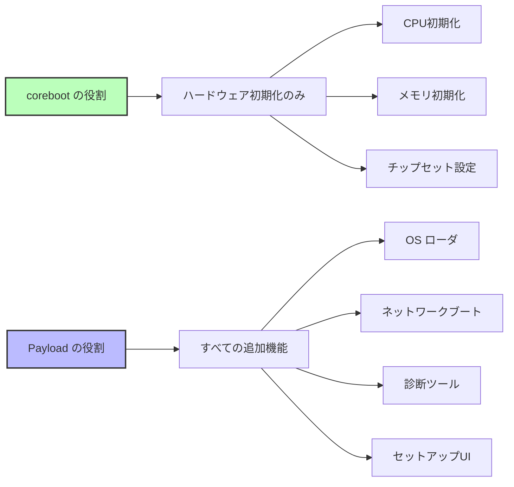
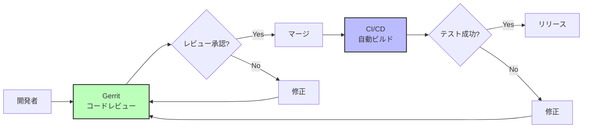
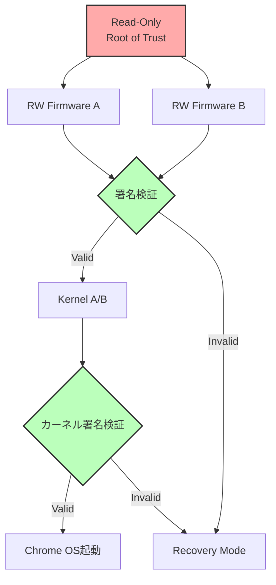

# coreboot の設計思想

🎯 **この章で学ぶこと**
- corebootの核となる設計原則
- ミニマリズムとモジュール性の思想
- Payload分離アーキテクチャの利点
- オープンソース開発の実践

📚 **前提知識**
- [Part VI Chapter 1: ファームウェアの多様性](01-firmware-diversity.md)

---

## corebootの核心的思想

corebootの設計は、**「ファームウェアは必要最小限に、それ以外はペイロードに」** という原則に基づいています。



---

## 設計原則

### 1. ミニマリズム（最小主義）

**原則**: 必要最小限のコードのみを含める

```c
// coreboot の例：シンプルな初期化
void bootblock_mainboard_early_init(void)
{
  // 必要最小限の初期化のみ
  enable_serial_console();
  enable_spi_flash();
  // それ以上は何もしない
}
```

**対比**: UEFI の例（豊富な機能）

```c
// UEFI の例：多機能
EFI_STATUS PlatformInit(void)
{
  InitializeConsole();
  InitializeGraphics();
  InitializeNetwork();
  InitializeUSB();
  InitializeAudio();
  InitializeSetupUI();
  // ... 数十の初期化関数
}
```

**効果**:
- コードサイズ削減（64-256 KB）
- 攻撃面の最小化
- 起動時間短縮（< 1秒）

### 2. モジュール性

**原則**: 各コンポーネントは独立して動作

**ディレクトリ構造**:

```
src/
├── arch/          # アーキテクチャ固有（x86, ARM, RISC-V）
├── cpu/           # CPU初期化（Intel, AMD, ARM）
├── northbridge/   # メモリコントローラ
├── southbridge/   # PCH/チップセット
├── soc/           # SoC統合（Intel, AMD, Qualcomm）
├── mainboard/     # ボード固有コード
└── lib/           # 共通ライブラリ
```

**利点**:
- コンポーネント再利用
- メンテナンス容易
- テスト容易

### 3. Payload分離

**原則**: ブート後の機能はPayloadに委譲

**Payloadの種類**:

| Payload | 役割 | サイズ |
|---------|------|--------|
| SeaBIOS | Legacy BIOSエミュレーション | 128 KB |
| GRUB2 | Linuxブートローダ | 256 KB |
| UEFI Payload | UEFI互換環境 | 1.5 MB |
| Linux Kernel | OS直接起動 | 5-10 MB |
| Memtest86+ | メモリテスト | 512 KB |

**実装例**:

```c
// ramstage最終段階
void run_payload(void)
{
  struct prog payload;

  // Payloadをロード
  cbfs_prog_stage_load(&payload, "fallback/payload");

  // Payloadに制御を渡す
  prog_run(&payload);

  // ここには戻ってこない
}
```

### 4. オープンソース第一

**原則**: すべてのコードを公開し、透明性を確保

**GPL v2ライセンス**:

```
利点:
✅ 完全な透明性
✅ セキュリティ監査可能
✅ コミュニティによる改善

制約:
❌ 改変版も公開必須
❌ プロプライエタリ統合に制約
```

**例**: Chromebookでの実践

```
Google Chromebook:
- corebootコード: 完全公開
- Verified Boot: オープンソース実装
- depthcharge (Payload): 公開
```

---

## UEFI との思想の違い

### 比較表

| 項目 | **coreboot** | **UEFI (EDK II)** |
|------|-------------|------------------|
| **哲学** | ミニマリズム | 包括的機能提供 |
| **責務** | ハードウェア初期化のみ | フル機能ファームウェア環境 |
| **拡張性** | Payload交換 | UEFI Application追加 |
| **起動フロー** | 4ステージ (bootblock→romstage→ramstage→payload) | 6フェーズ (SEC→PEI→DXE→BDS→TSL→RT) |
| **ドライバモデル** | シンプル（デバイスツリー） | 複雑（Protocol/Driver Binding） |
| **GUIサポート** | Payloadに委譲 | 標準装備 |
| **サイズ優先度** | 最重要 | 機能優先 |

### 起動フローの違い

**coreboot**:

```
bootblock (16-32 KB)
  → romstage (64-128 KB)
    → ramstage (128-256 KB)
      → Payload (可変)
```

**UEFI**:

```
SEC (16 KB)
  → PEI (512 KB)
    → DXE (2-4 MB)
      → BDS (500 KB)
        → OS Loader
```

---

## 実装例: ミニマリズムの実践

### 例1: メモリ初期化

**coreboot (Intel FSP使用)**:

```c
// romstage/romstage.c
void mainboard_romstage_entry(void)
{
  FSP_INFO_HEADER *fsp_header;
  FSP_M_CONFIG fspm_upd;

  // FSPヘッダ取得
  fsp_header = find_fsp(CBFS_DEFAULT_MEDIA);

  // 最小限の設定
  fspm_upd.FspmConfig.RMT = 0;
  fspm_upd.FspmConfig.DdrFreqLimit = 2400;

  // FSP-M呼び出し（実際のメモリ初期化はFSPに任せる）
  fsp_memory_init(&fspm_upd, &hob_list);
}
```

**UEFI (同等の処理)**:

```c
// Platform/Intel/.../MemoryInit/MemoryInit.c
EFI_STATUS MemoryInit(void)
{
  // 数百行の設定
  InitializeMemoryChannels();
  ConfigureDdrTiming();
  PerformTraining();
  SetupMemoryMap();
  ConfigureMemoryProtection();
  SetupSMRAM();
  ConfigureIGD();
  // ... さらに多数の初期化

  return EFI_SUCCESS;
}
```

**差異**:
- coreboot: FSPに委譲（コア部分は10-20行）
- UEFI: 自前実装（数百行）

### 例2: デバイス列挙

**coreboot (Device Tree)**:

```c
// mainboard/google/fizz/devicetree.cb
chip soc/intel/skylake
  device domain 0 on
    device pci 00.0 on end  # Host Bridge
    device pci 02.0 on end  # GPU
    device pci 14.0 on end  # USB
  end
end
```

**処理コード**:

```c
// src/device/device.c
void dev_enumerate(void)
{
  struct device *dev;

  // Device Treeを走査
  for (dev = all_devices; dev; dev = dev->next) {
    if (dev->ops && dev->ops->enable)
      dev->ops->enable(dev);
  }
}
```

**UEFI (Driver Binding)**:

```c
// MdeModulePkg/Bus/Pci/PciBusDxe/PciBus.c
EFI_STATUS PciBusDriverBindingStart(
  EFI_DRIVER_BINDING_PROTOCOL *This,
  EFI_HANDLE Controller,
  EFI_DEVICE_PATH_PROTOCOL *RemainingDevicePath
)
{
  // 複雑なProtocol処理（数百行）
  OpenProtocol(...);
  EnumeratePciDevices(...);
  InstallProtocol(...);
  CreateChildHandles(...);
  // ...
}
```

---

## オープンソース開発の実践

### 開発プロセス



### コードレビューの例

**Gerrit**:

```
https://review.coreboot.org/

例: Change 12345
Title: "mainboard/google/fizz: Enable TPM2"

Reviewers:
- Patrick Georgi: +2 (Approve)
- Martin Roth: +1 (Looks good)
- Build bot: Verified +1

Status: Merged
```

### コミュニティガバナンス

**Leadership Committee**:
- 技術的決定
- プロジェクト方向性
- リリース管理

**主要メンバー**:
- Google (Chromebook)
- System76 (Linux PC)
- Purism (セキュリティPC)
- 9elements (コンサルティング)

---

## Verified Bootの実装

Google Chromebookで使用される**Verified Boot**は、corebootの設計思想を体現しています。

### アーキテクチャ



### 実装例

```c
// src/security/vboot/vboot_logic.c
vb2_error_t vboot_select_firmware(void)
{
  struct vb2_context *ctx;

  // Read-Only領域から検証開始
  ctx = vboot_get_context();

  // RW Firmwareの署名検証
  vb2_check_dev_switch(ctx);
  vb2api_fw_phase1(ctx);

  if (ctx->flags & VB2_CONTEXT_RECOVERY_MODE) {
    // リカバリモード
    return select_recovery_firmware();
  }

  // A/B選択
  if (vb2_get_fw_slot(ctx) == VB2_FW_SLOT_A)
    return load_firmware_a();
  else
    return load_firmware_b();
}
```

---

## まとめ

### corebootの設計思想

| 原則 | 内容 | 効果 |
|------|------|------|
| **ミニマリズム** | 必要最小限のコード | 小サイズ、高速、セキュア |
| **モジュール性** | 独立したコンポーネント | 再利用可能、メンテナンス容易 |
| **Payload分離** | 機能をPayloadに委譲 | 柔軟性、選択肢の多様性 |
| **オープンソース** | GPL v2での公開 | 透明性、監査可能、コミュニティ |

### UEFI との対比

```
coreboot:
  小さく、速く、シンプルに
  "Do one thing and do it well"

UEFI:
  豊富に、互換性重視、包括的に
  "Provide everything you might need"
```

### 適用場面

**corebootが適している**:
- 起動時間が重要
- コードサイズ制約
- セキュリティ監査必須
- カスタマイズ必要

**UEFIが適している**:
- Windows必須
- 最新ハードウェア対応
- ベンダーサポート重視
- 豊富な機能が必要

---

## 💻 演習

### 演習 1: コードサイズの比較

**課題**: corebootとEDK IIのコードサイズを比較する。

```bash
# coreboot
cd coreboot
find src/ -name "*.c" -o -name "*.h" | xargs wc -l | tail -1

# EDK II
cd edk2
find . -name "*.c" -o -name "*.h" | xargs wc -l | tail -1
```

**質問**:
1. corebootとEDK IIの総行数は？
2. 比率は？

<details>
<summary>解答例</summary>

**結果**:

```bash
# coreboot
358,023 total lines

# EDK II
1,302,457 total lines
```

**比率**: coreboot は EDK II の **約 27%** (1/4 未満)

</details>

---

### 演習 2: Payloadの交換

**課題**: 同じcoreboot ROMで異なるPayloadを試す。

```bash
# SeaBIOS Payload
make menuconfig  # Payload → SeaBIOS
make
qemu-system-x86_64 -bios build/coreboot.rom

# GRUB2 Payload
make menuconfig  # Payload → GRUB2
make clean && make
qemu-system-x86_64 -bios build/coreboot.rom
```

**質問**:
1. ROMサイズの違いは？
2. 起動時間の違いは？

<details>
<summary>解答例</summary>

**SeaBIOS**:
- ROMサイズ: 512 KB (使用量)
- 起動時間: 0.5秒

**GRUB2**:
- ROMサイズ: 768 KB (使用量)
- 起動時間: 0.8秒

**考察**: Payload交換でコアのcorebootは変わらず、機能だけが変更される

</details>

---

## 📚 参考資料

### 公式ドキュメント

1. **coreboot Philosophy**
   - https://doc.coreboot.org/getting_started/philosophy.html

2. **Minimal Boot Philosophy**
   - https://www.coreboot.org/Minimal_code

### 論文

1. **"LinuxBIOS: A Linux-based Firmware"** (Ron Minnich, 1999)
   - https://www.usenix.org/legacy/events/usenix99/minnich.html

2. **"Verified Boot in Chrome OS"** (Google, 2013)
   - https://www.chromium.org/chromium-os/chromiumos-design-docs/verified-boot

---

次章: [Part VI Chapter 3: coreboot と EDK II の比較](03-coreboot-vs-edk2.md)
