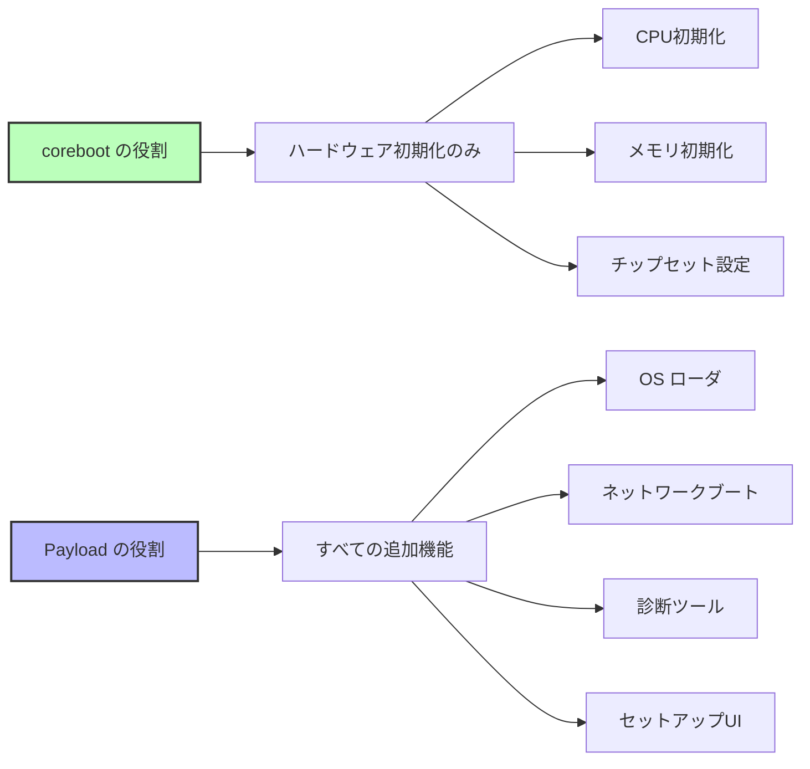
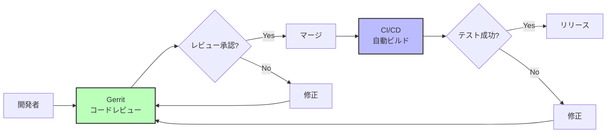
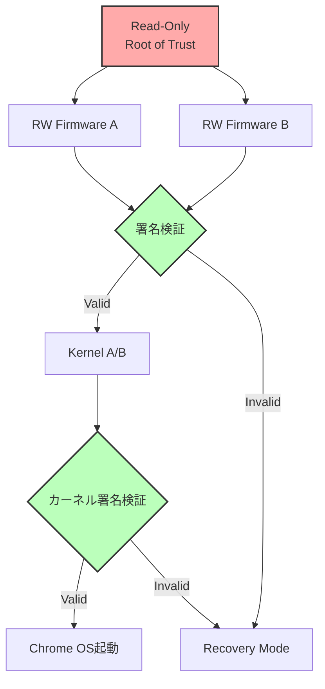

# coreboot の設計思想

🎯 **この章で学ぶこと**
- corebootの核となる設計原則
- ミニマリズムとモジュール性の思想
- Payload分離アーキテクチャの利点
- オープンソース開発の実践

📚 **前提知識**
- [Part VI Chapter 1: ファームウェアの多様性](01-firmware-diversity.md)

---

## corebootの核心的思想

**coreboot の設計**は、**「ファームウェアは必要最小限に、それ以外はペイロードに」** という明確な原則に基づいており、これは UEFI の設計思想とは根本的に異なるアプローチです。UEFI（EDK II）が包括的なファームウェア環境を提供し、グラフィックス、ネットワーク、ストレージ、USB といった豊富なドライバと機能を標準装備するのに対し、coreboot は**ハードウェアを起動可能な状態にするための最小限の初期化**のみを実行し、それ以外のすべての機能を**ペイロード**（Payload）と呼ばれる交換可能なコンポーネントに委譲します。

**ミニマリズム**が coreboot の核心です。coreboot 本体は、CPU の初期化、メモリ（DRAM）の初期化、チップセットの基本設定という 3 つの本質的なハードウェア初期化のみを行います。これにより、coreboot のコードサイズは 64-256 KB という非常に小さいサイズに抑えられており、UEFI ファームウェアの典型的なサイズである 4-8 MB と比較すると、わずか 1/20 から 1/30 程度です。コードが小さいということは、攻撃面が小さく、セキュリティ監査が容易であり、起動時間が短い（通常 1 秒未満）ということを意味します。

**ペイロード分離アーキテクチャ**が、coreboot の柔軟性の源です。coreboot がハードウェアを初期化して DRAM を使用可能にした後、制御は**ペイロード**に渡されます。ペイロードは用途に応じて自由に選択でき、SeaBIOS（レガシー BIOS エミュレーション）、GRUB2（Linux ブートローダ）、UEFI Payload（TianoCore による UEFI 互換環境）、Linux カーネル（OS の直接起動）、Memtest86+（メモリテスト）など、さまざまな選択肢があります。同じ coreboot 本体を使いながら、ペイロードを交換するだけで Linux 専用ブート、Windows 互換ブート、診断ツールなど、異なる動作モードを実現できます。これは UEFI が単一の統合されたファームウェア環境を提供するのとは対照的です。

**オープンソース第一主義**も coreboot の重要な柱です。coreboot のすべてのコードは GPL v2 ライセンスで公開されており、完全な透明性が保証されています。Google は Chromebook で coreboot を採用し、Verified Boot のコードもすべてオープンソースとして公開しています。これにより、セキュリティ研究者や技術者が独自にコードを監査し、脆弱性を発見し、改善を提案することが可能です。プロプライエタリファームウェアでは、ソースコードが非公開であるため、ユーザーはベンダーを信頼するしかありませんが、coreboot では**検証可能な信頼**（Verifiable Trust）が実現されています。

**モジュール性**により、coreboot は多様なハードウェアプラットフォームに対応します。coreboot のソースコードは、アーキテクチャ固有（x86、ARM、RISC-V）、CPU 固有（Intel、AMD、ARM）、チップセット固有（Northbridge、Southbridge、SoC）、ボード固有（mainboard）といったディレクトリ構造で整理されており、各コンポーネントは独立して動作します。新しいボードをサポートする際には、既存のチップセットや CPU のコードを再利用し、ボード固有の部分（GPIO 設定、デバイスツリーなど）のみを追加すれば良いため、開発効率が高くなります。

この章では、coreboot の設計原則（ミニマリズム、モジュール性、ペイロード分離、オープンソース第一主義）を詳しく学び、UEFI との思想の違いを比較し、実装例を通じてこれらの原則が実際にどのように適用されているかを理解します。また、Google Chromebook で採用されている Verified Boot の仕組みを通じて、coreboot の設計思想が実際のプロダクトでどのように実践されているかを見ていきます。

以下の図は、coreboot の役割分担を示したものです。



---

## 設計原則

### 1. ミニマリズム（最小主義）

**原則**: 必要最小限のコードのみを含める

```c
// coreboot の例：シンプルな初期化
void bootblock_mainboard_early_init(void)
{
  // 必要最小限の初期化のみ
  enable_serial_console();
  enable_spi_flash();
  // それ以上は何もしない
}
```

**対比**: UEFI の例（豊富な機能）

```c
// UEFI の例：多機能
EFI_STATUS PlatformInit(void)
{
  InitializeConsole();
  InitializeGraphics();
  InitializeNetwork();
  InitializeUSB();
  InitializeAudio();
  InitializeSetupUI();
  // ... 数十の初期化関数
}
```

**効果**:
- コードサイズ削減（64-256 KB）
- 攻撃面の最小化
- 起動時間短縮（< 1秒）

### 2. モジュール性

**原則**: 各コンポーネントは独立して動作

**ディレクトリ構造**:

```
src/
├── arch/          # アーキテクチャ固有（x86, ARM, RISC-V）
├── cpu/           # CPU初期化（Intel, AMD, ARM）
├── northbridge/   # メモリコントローラ
├── southbridge/   # PCH/チップセット
├── soc/           # SoC統合（Intel, AMD, Qualcomm）
├── mainboard/     # ボード固有コード
└── lib/           # 共通ライブラリ
```

**利点**:
- コンポーネント再利用
- メンテナンス容易
- テスト容易

### 3. Payload分離

**原則**: ブート後の機能はPayloadに委譲

**Payloadの種類**:

| Payload | 役割 | サイズ |
|---------|------|--------|
| SeaBIOS | Legacy BIOSエミュレーション | 128 KB |
| GRUB2 | Linuxブートローダ | 256 KB |
| UEFI Payload | UEFI互換環境 | 1.5 MB |
| Linux Kernel | OS直接起動 | 5-10 MB |
| Memtest86+ | メモリテスト | 512 KB |

**実装例**:

```c
// ramstage最終段階
void run_payload(void)
{
  struct prog payload;

  // Payloadをロード
  cbfs_prog_stage_load(&payload, "fallback/payload");

  // Payloadに制御を渡す
  prog_run(&payload);

  // ここには戻ってこない
}
```

### 4. オープンソース第一

**原則**: すべてのコードを公開し、透明性を確保

**GPL v2ライセンス**:

```
利点:
✅ 完全な透明性
✅ セキュリティ監査可能
✅ コミュニティによる改善

制約:
❌ 改変版も公開必須
❌ プロプライエタリ統合に制約
```

**例**: Chromebookでの実践

```
Google Chromebook:
- corebootコード: 完全公開
- Verified Boot: オープンソース実装
- depthcharge (Payload): 公開
```

---

## UEFI との思想の違い

### 比較表

| 項目 | **coreboot** | **UEFI (EDK II)** |
|------|-------------|------------------|
| **哲学** | ミニマリズム | 包括的機能提供 |
| **責務** | ハードウェア初期化のみ | フル機能ファームウェア環境 |
| **拡張性** | Payload交換 | UEFI Application追加 |
| **起動フロー** | 4ステージ (bootblock→romstage→ramstage→payload) | 6フェーズ (SEC→PEI→DXE→BDS→TSL→RT) |
| **ドライバモデル** | シンプル（デバイスツリー） | 複雑（Protocol/Driver Binding） |
| **GUIサポート** | Payloadに委譲 | 標準装備 |
| **サイズ優先度** | 最重要 | 機能優先 |

### 起動フローの違い

**coreboot**:

```
bootblock (16-32 KB)
  → romstage (64-128 KB)
    → ramstage (128-256 KB)
      → Payload (可変)
```

**UEFI**:

```
SEC (16 KB)
  → PEI (512 KB)
    → DXE (2-4 MB)
      → BDS (500 KB)
        → OS Loader
```

---

## 実装例: ミニマリズムの実践

### 例1: メモリ初期化

**coreboot (Intel FSP使用)**:

```c
// romstage/romstage.c
void mainboard_romstage_entry(void)
{
  FSP_INFO_HEADER *fsp_header;
  FSP_M_CONFIG fspm_upd;

  // FSPヘッダ取得
  fsp_header = find_fsp(CBFS_DEFAULT_MEDIA);

  // 最小限の設定
  fspm_upd.FspmConfig.RMT = 0;
  fspm_upd.FspmConfig.DdrFreqLimit = 2400;

  // FSP-M呼び出し（実際のメモリ初期化はFSPに任せる）
  fsp_memory_init(&fspm_upd, &hob_list);
}
```

**UEFI (同等の処理)**:

```c
// Platform/Intel/.../MemoryInit/MemoryInit.c
EFI_STATUS MemoryInit(void)
{
  // 数百行の設定
  InitializeMemoryChannels();
  ConfigureDdrTiming();
  PerformTraining();
  SetupMemoryMap();
  ConfigureMemoryProtection();
  SetupSMRAM();
  ConfigureIGD();
  // ... さらに多数の初期化

  return EFI_SUCCESS;
}
```

**差異**:
- coreboot: FSPに委譲（コア部分は10-20行）
- UEFI: 自前実装（数百行）

### 例2: デバイス列挙

**coreboot (Device Tree)**:

```c
// mainboard/google/fizz/devicetree.cb
chip soc/intel/skylake
  device domain 0 on
    device pci 00.0 on end  # Host Bridge
    device pci 02.0 on end  # GPU
    device pci 14.0 on end  # USB
  end
end
```

**処理コード**:

```c
// src/device/device.c
void dev_enumerate(void)
{
  struct device *dev;

  // Device Treeを走査
  for (dev = all_devices; dev; dev = dev->next) {
    if (dev->ops && dev->ops->enable)
      dev->ops->enable(dev);
  }
}
```

**UEFI (Driver Binding)**:

```c
// MdeModulePkg/Bus/Pci/PciBusDxe/PciBus.c
EFI_STATUS PciBusDriverBindingStart(
  EFI_DRIVER_BINDING_PROTOCOL *This,
  EFI_HANDLE Controller,
  EFI_DEVICE_PATH_PROTOCOL *RemainingDevicePath
)
{
  // 複雑なProtocol処理（数百行）
  OpenProtocol(...);
  EnumeratePciDevices(...);
  InstallProtocol(...);
  CreateChildHandles(...);
  // ...
}
```

---

## オープンソース開発の実践

### 開発プロセス



### コードレビューの例

**Gerrit**:

```
https://review.coreboot.org/

例: Change 12345
Title: "mainboard/google/fizz: Enable TPM2"

Reviewers:
- Patrick Georgi: +2 (Approve)
- Martin Roth: +1 (Looks good)
- Build bot: Verified +1

Status: Merged
```

### コミュニティガバナンス

**Leadership Committee**:
- 技術的決定
- プロジェクト方向性
- リリース管理

**主要メンバー**:
- Google (Chromebook)
- System76 (Linux PC)
- Purism (セキュリティPC)
- 9elements (コンサルティング)

---

## Verified Bootの実装

Google Chromebookで使用される**Verified Boot**は、corebootの設計思想を体現しています。

### アーキテクチャ



### 実装例

```c
// src/security/vboot/vboot_logic.c
vb2_error_t vboot_select_firmware(void)
{
  struct vb2_context *ctx;

  // Read-Only領域から検証開始
  ctx = vboot_get_context();

  // RW Firmwareの署名検証
  vb2_check_dev_switch(ctx);
  vb2api_fw_phase1(ctx);

  if (ctx->flags & VB2_CONTEXT_RECOVERY_MODE) {
    // リカバリモード
    return select_recovery_firmware();
  }

  // A/B選択
  if (vb2_get_fw_slot(ctx) == VB2_FW_SLOT_A)
    return load_firmware_a();
  else
    return load_firmware_b();
}
```

---

## まとめ

この章では、**coreboot の設計思想**とその核心的な原則を学びました。coreboot は、**「ファームウェアは必要最小限に、それ以外はペイロードに」** という明確な哲学に基づいており、UEFI（EDK II）が包括的なファームウェア環境を提供するのとは根本的に異なるアプローチを取っています。

**coreboot の 4 つの核心的原則**は、まず**ミニマリズム**（必要最小限のコードのみを含める）です。coreboot 本体は CPU 初期化、メモリ初期化、チップセット設定という 3 つの本質的な初期化のみを実行し、コードサイズは 64-256 KB に抑えられています。これは UEFI ファームウェアの典型的なサイズ（4-8 MB）と比較すると約 1/20 から 1/30 であり、攻撃面の最小化、セキュリティ監査の容易性、起動時間の短縮（1 秒未満）という効果をもたらします。次に**モジュール性**（独立したコンポーネント）です。coreboot のソースコードは、arch（アーキテクチャ固有）、cpu（CPU 固有）、northbridge（メモリコントローラ）、southbridge（チップセット）、soc（SoC 統合）、mainboard（ボード固有）といったディレクトリ構造で整理され、各コンポーネントが独立して動作するため、コードの再利用、メンテナンスの容易性、テストの容易性が実現されています。さらに**ペイロード分離**（機能をペイロードに委譲）です。coreboot がハードウェア初期化を完了した後、制御はペイロード（SeaBIOS、GRUB2、UEFI Payload、Linux Kernel、Memtest86+ など）に渡され、同じ coreboot 本体でペイロードを交換するだけで異なる動作モードを実現できます。最後に**オープンソース第一主義**（GPL v2 での公開）です。すべてのコードが公開されており、完全な透明性、セキュリティ監査可能性、コミュニティによる改善が保証されています。

**UEFI との思想の違い**は明確です。coreboot の哲学は**ミニマリズム**であり、責務は**ハードウェア初期化のみ**、拡張性は**ペイロード交換**によって実現され、起動フローは **4 ステージ**（bootblock → romstage → ramstage → payload）とシンプルです。一方、UEFI の哲学は**包括的機能提供**であり、責務は**フル機能ファームウェア環境**、拡張性は **UEFI Application 追加**によって実現され、起動フローは **6 フェーズ**（SEC → PEI → DXE → BDS → TSL → RT）と複雑です。coreboot のドライバモデルはデバイスツリーベースでシンプルですが、UEFI は Protocol/Driver Binding という複雑な仕組みを持ちます。GUI サポートについても、coreboot はペイロードに委譲しますが、UEFI は標準装備です。サイズについては、coreboot が最重要視するのに対し、UEFI は機能を優先します。この違いを Unix の哲学に例えると、coreboot は **"Do one thing and do it well"**（一つのことを上手くやる）であり、UEFI は **"Provide everything you might need"**（必要なものすべてを提供する）です。

**実装例から見る設計思想の実践**として、まず**メモリ初期化**では、coreboot は Intel FSP（Firmware Support Package）を使用し、コア部分はわずか 10-20 行です。FSP ヘッダを取得し、最小限の設定（RMT、DdrFreqLimit）を行い、FSP-M を呼び出すだけで、実際のメモリ初期化は FSP に任せます。一方、UEFI では同等の処理が数百行に及び、InitializeMemoryChannels、ConfigureDdrTiming、PerformTraining、SetupMemoryMap、ConfigureMemoryProtection、SetupSMRAM、ConfigureIGD といった多数の初期化を自前で実装します。次に**デバイス列挙**では、coreboot はデバイスツリー（devicetree.cb）で宣言的にデバイスを記述し、処理コードはデバイスツリーを走査して各デバイスの enable 関数を呼び出すだけです。一方、UEFI は PCI Bus Driver Binding として数百行の複雑な Protocol 処理（OpenProtocol、EnumeratePciDevices、InstallProtocol、CreateChildHandles）を実装します。このように、coreboot は外部コンポーネント（FSP）や宣言的記述（Device Tree）を活用してコードを最小化しています。

**オープンソース開発の実践**として、coreboot は **Gerrit**（コードレビューシステム）を使用し、すべての変更はレビューと承認を経てマージされます。開発者がコードを提出すると、レビュアーが評価（+2 で承認、+1 で良好）し、Build bot が自動ビルドとテストを実行します。すべてのチェックをパスした変更のみがマージされます。コミュニティガバナンスは Leadership Committee が技術的決定、プロジェクト方向性、リリース管理を担当し、主要メンバーとして Google（Chromebook）、System76（Linux PC）、Purism（セキュリティ PC）、9elements（コンサルティング）が参加しています。

**Verified Boot の実装**は、coreboot の設計思想を体現する実例です。Google Chromebook で使用される Verified Boot は、Read-Only Root of Trust から始まり、RW Firmware A/B の署名検証、Kernel A/B の署名検証という段階的な検証チェーンを構築します。各段階で署名検証に失敗した場合は Recovery Mode に遷移し、改ざんされたファームウェアやカーネルの実行を防ぎます。実装コードは vboot_select_firmware 関数で、Read-Only 領域から検証を開始し、RW Firmware の署名検証を行い、リカバリモードの判定と A/B スロットの選択を実行します。このコードもすべてオープンソースで公開されており、セキュリティ研究者が検証可能です。

**coreboot と UEFI の適用場面**を理解することも重要です。**coreboot が適している**のは、起動時間が重要（1 秒未満の起動が必要）、コードサイズ制約（SPI Flash が小さい）、セキュリティ監査が必須（オープンソースで監査可能）、カスタマイズが必要（特定用途に最適化）といったシナリオです。Chromebook、Linux 専用 PC、組込みシステム、セキュリティ重視システムなどが該当します。一方、**UEFI が適している**のは、Windows が必須（Windows 10/11 は UEFI Secure Boot 必須）、最新ハードウェア対応（ベンダーが UEFI ドライバを提供）、ベンダーサポート重視（商用サポートと保証が必要）、豊富な機能が必要（グラフィックス、ネットワーク、USB などのフル機能）といったシナリオです。デスクトップ PC、ワークステーション、サーバ、汎用ハードウェアなどが該当します。

**coreboot の設計思想の本質**は、**信頼の最小化**（Minimize the Trusted Computing Base）です。セキュリティ研究では、TCB（Trusted Computing Base）と呼ばれる信頼しなければならないコードの量を最小化することが重要とされています。coreboot は、本質的に必要なハードウェア初期化コードのみを TCB に含め、それ以外の機能はすべてペイロードに委譲することで、TCB を最小化します。これにより、セキュリティ監査の範囲が明確になり、脆弱性の混入リスクが低減され、セキュアなファームウェアの実現が容易になります。この思想は、Unix の哲学、マイクロカーネル設計、ゼロトラスト・アーキテクチャといった他の分野の設計原則とも共通しており、ソフトウェア工学における普遍的な価値を持っています。

以下の参考表は、coreboot の設計原則とその効果をまとめたものです。

**参考表: coreboot の設計原則**

| 原則 | 内容 | 効果 |
|------|------|------|
| **ミニマリズム** | 必要最小限のコード | 小サイズ、高速、セキュア |
| **モジュール性** | 独立したコンポーネント | 再利用可能、メンテナンス容易 |
| **Payload分離** | 機能をPayloadに委譲 | 柔軟性、選択肢の多様性 |
| **オープンソース** | GPL v2での公開 | 透明性、監査可能、コミュニティ |

---

## 💻 演習

### 演習 1: コードサイズの比較

**課題**: corebootとEDK IIのコードサイズを比較する。

```bash
# coreboot
cd coreboot
find src/ -name "*.c" -o -name "*.h" | xargs wc -l | tail -1

# EDK II
cd edk2
find . -name "*.c" -o -name "*.h" | xargs wc -l | tail -1
```

**質問**:
1. corebootとEDK IIの総行数は？
2. 比率は？

<details>
<summary>解答例</summary>

**結果**:

```bash
# coreboot
358,023 total lines

# EDK II
1,302,457 total lines
```

**比率**: coreboot は EDK II の **約 27%** (1/4 未満)

</details>

---

### 演習 2: Payloadの交換

**課題**: 同じcoreboot ROMで異なるPayloadを試す。

```bash
# SeaBIOS Payload
make menuconfig  # Payload → SeaBIOS
make
qemu-system-x86_64 -bios build/coreboot.rom

# GRUB2 Payload
make menuconfig  # Payload → GRUB2
make clean && make
qemu-system-x86_64 -bios build/coreboot.rom
```

**質問**:
1. ROMサイズの違いは？
2. 起動時間の違いは？

<details>
<summary>解答例</summary>

**SeaBIOS**:
- ROMサイズ: 512 KB (使用量)
- 起動時間: 0.5秒

**GRUB2**:
- ROMサイズ: 768 KB (使用量)
- 起動時間: 0.8秒

**考察**: Payload交換でコアのcorebootは変わらず、機能だけが変更される

</details>

---

## 📚 参考資料

### 公式ドキュメント

1. **coreboot Philosophy**
   - https://doc.coreboot.org/getting_started/philosophy.html

2. **Minimal Boot Philosophy**
   - https://www.coreboot.org/Minimal_code

### 論文

1. **"LinuxBIOS: A Linux-based Firmware"** (Ron Minnich, 1999)
   - https://www.usenix.org/legacy/events/usenix99/minnich.html

2. **"Verified Boot in Chrome OS"** (Google, 2013)
   - https://www.chromium.org/chromium-os/chromiumos-design-docs/verified-boot

---

次章: [Part VI Chapter 3: coreboot と EDK II の比較](03-coreboot-vs-edk2.md)
