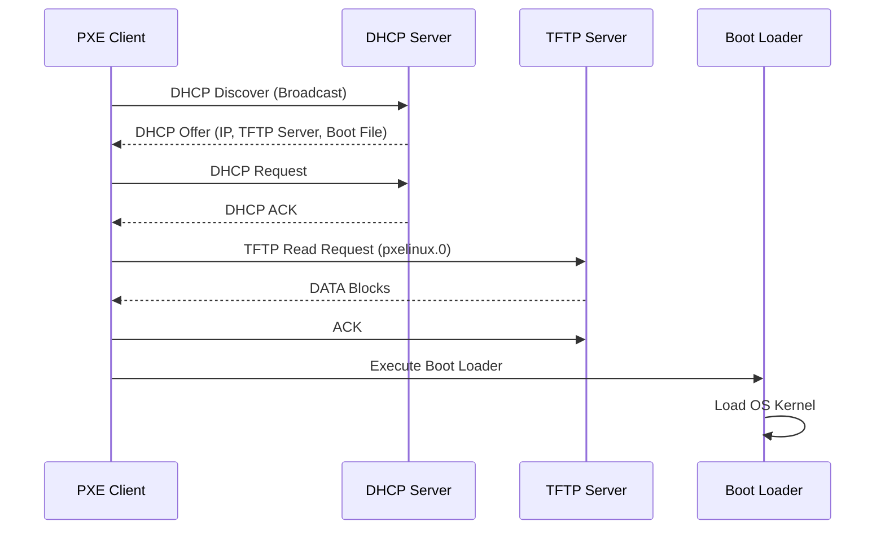
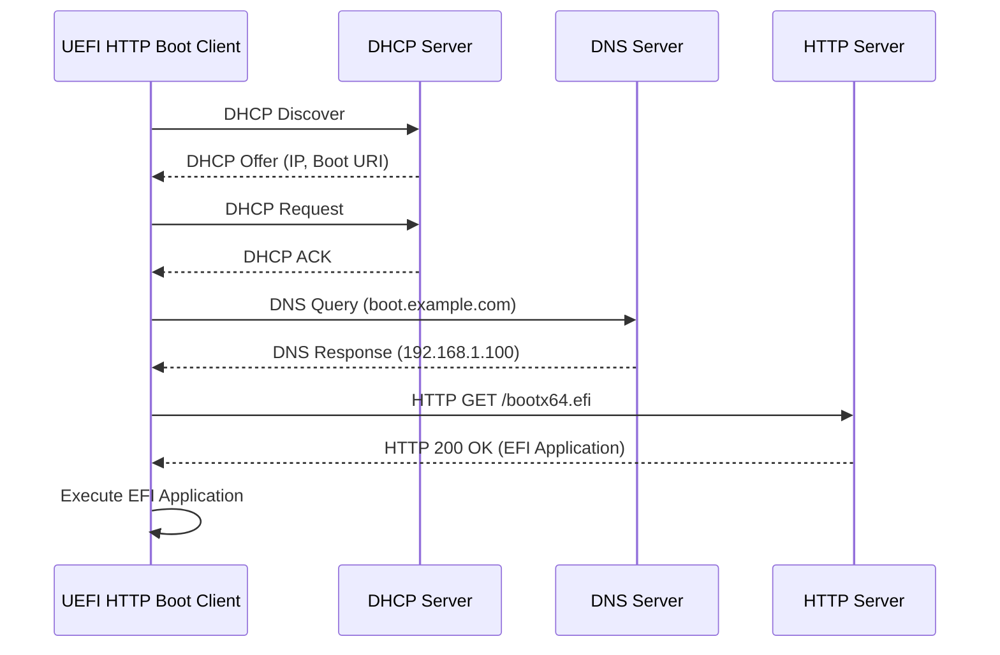

# ネットワークブートの仕組み

🎯 **この章で学ぶこと**
- PXE (Preboot Execution Environment) の基礎
- TFTP/HTTP ブートプロトコル
- UEFI HTTP Bootの実装

📚 **前提知識**
- [Part II: EDK II 実装](../part2/01-hello-world.md)

---

## はじめに

**ネットワークブート**は、ローカルディスクではなく**ネットワーク経由で OS やファームウェアをロードする仕組み**であり、ディスクレスワークステーション、大規模展開、サーバ管理、組込みシステム、クラウドインフラなど、さまざまな用途で活用されています。ネットワークブートの最も一般的な実装は **PXE（Preboot Execution Environment）** であり、Intel が策定した標準プロトコルです。PXE は DHCP でネットワーク設定を取得し、TFTP でブートローダをダウンロードし、実行します。UEFI 環境では、より高速で柔軟な **HTTP Boot** もサポートされており、大きなイメージファイルの転送や HTTPS による暗号化通信が可能です。

**ネットワークブートの利点**は多岐にわたります。まず、**ディスクレス運用**により、クライアント側にストレージが不要になり、ハードウェアコストを削減できます。次に、**集中管理**により、OS イメージをサーバ側で一元管理し、複数のクライアントに同じイメージを配信できるため、ソフトウェア更新やセキュリティパッチの適用が容易になります。さらに、**迅速な展開**により、新しいマシンをネットワークに接続するだけで自動的に OS がインストールされるため、大規模な PC 展開やデータセンターのプロビジョニングが効率化されます。また、**障害復旧**として、ローカルディスクが故障してもネットワークブートで一時的に OS を起動し、復旧作業を実行できます。最後に、**セキュリティ**として、OS イメージがサーバ側で管理されるため、ローカルディスクへの不正な改ざんを防げます。

**PXE（Preboot Execution Environment）** は、1999 年に Intel が策定したネットワークブート標準であり、DHCP、TFTP、そして Option ROM（NIC 上の BIOS 拡張）を組み合わせて実現されます。PXE ブートフローは、まず NIC の Option ROM が実行され、DHCP Request をブロードキャストして IP アドレスと TFTP サーバ情報を取得し、次に TFTP で指定されたブートローダ（pxelinux.0、grubnetx64.efi など）をダウンロードし、最後にダウンロードしたブートローダを実行して OS カーネルをロードします。PXE は広くサポートされており、ほとんどの NIC が PXE ブート機能を搭載していますが、TFTP の転送速度が遅い（通常 1-5 MB/s）という欠点があります。

**UEFI HTTP Boot** は、PXE の後継として UEFI 仕様 2.5 で導入されたネットワークブート方式であり、HTTP/HTTPS プロトコルを使用してブートローダや OS イメージをダウンロードします。HTTP Boot は、TFTP よりも高速（10-100 MB/s）であり、大きなイメージファイル（数 GB）の転送に適しています。また、HTTPS による暗号化通信をサポートしており、ブートイメージの改ざんを防げます。さらに、IPv6 をサポートしており、現代のネットワークインフラに対応します。EDK II の NetworkPkg/HttpBootDxe が UEFI HTTP Boot の参照実装であり、DHCP で IP アドレスとブート URI を取得し、HTTP GET でブートファイルをダウンロードし、EFI Application として実行します。

この章では、PXE ブートの仕組みと DHCP/TFTP プロトコルの詳細、UEFI HTTP Boot の実装と利点、サーバ側の設定例（dnsmasq、Apache、Nginx）、そしてネットワークブートのトラブルシューティングを学びます。ネットワークブートは、現代のインフラ管理において不可欠な技術であり、クラウドコンピューティング、コンテナオーケストレーション、エッジコンピューティングといった新しいパラダイムにおいても重要な役割を果たしています。

## PXE (Preboot Execution Environment)

### PXE の概要

**PXE**（Preboot Execution Environment）は、1999 年に Intel が策定したネットワーク経由で OS をブートする標準プロトコルです。PXE は、DHCP と TFTP という 2 つの既存プロトコルを組み合わせることで、ディスクレスワークステーションやサーバの集中管理を実現します。PXE の最大の特徴は、ハードウェア（NIC）レベルでのサポートであり、ほとんどの Ethernet アダプタが PXE ブート機能を Option ROM として搭載しています。

PXE ブートのプロセスは、ファームウェアが起動した後、ブートデバイスとして NIC を選択すると開始されます。NIC の Option ROM が実行され、ネットワークスタック（UDP/IP）が初期化されます。この時点ではまだ OS が起動していないため、Option ROM が提供するミニマルなネットワーク機能のみが使用可能です。

### PXEブートフローの詳細

PXE ブートフローは、以下の 4 つの主要なステップから構成されます。



**ステップ 1: DHCP Discover と Offer（ネットワーク設定の取得）**

クライアントは、まず DHCP Discover パケットをブロードキャスト（255.255.255.255）で送信します。この時点では IP アドレスを持っていないため、送信元 IP は 0.0.0.0 です。DHCP Discover パケットには、PXE Client であることを示す DHCP Option 93（Client System Architecture）が含まれます。この Option により、DHCP サーバは PXE ブート要求と通常の DHCP 要求を区別できます。

DHCP サーバは、DHCP Offer パケットで応答します。このパケットには、IP アドレス、サブネットマスク、ゲートウェイ、DNS サーバといった通常のネットワーク設定に加えて、**Option 66（TFTP Server Name）** と **Option 67（Bootfile Name）** が含まれます。Option 66 は TFTP サーバの IP アドレスまたはホスト名を指定し、Option 67 はダウンロードすべきブートファイルのパス（例: pxelinux.0、grubnetx64.efi）を指定します。

**ステップ 2: DHCP Request と ACK（IP アドレスの確定）**

クライアントは、受け取った DHCP Offer の内容を確認し、DHCP Request パケットで IP アドレスの割り当てを要求します。DHCP サーバは DHCP ACK で応答し、IP アドレスのリース期間や追加設定を確定します。この時点で、クライアントは有効な IP アドレスを持ち、ネットワーク通信が可能になります。

**ステップ 3: TFTP Read Request（ブートローダのダウンロード）**

クライアントは、DHCP Offer で取得した TFTP サーバアドレスとブートファイル名を使用して、TFTP Read Request（RRQ）を送信します。TFTP は UDP ポート 69 を使用するシンプルなプロトコルであり、エラー回復機能は限定的ですが、実装が容易です。TFTP サーバは、要求されたファイル（pxelinux.0 など）を 512 バイトのブロックに分割して送信します。クライアントは各ブロックに対して ACK を返し、すべてのブロックを受信するまでこのプロセスを繰り返します。

**ステップ 4: Execute（ブートローダの実行）**

ダウンロードが完了すると、クライアントはブートローダをメモリ上で実行します。ブートローダ（pxelinux、GRUB2、iPXE など）は、さらに設定ファイルや OS カーネルをネットワーク経由でダウンロードし、最終的に OS を起動します。

### PXE の利点と制約

**利点**として、まず**広範なサポート**があります。ほとんどの NIC が PXE ブート機能を搭載しており、追加のハードウェアが不要です。次に**シンプルな実装**があり、DHCP と TFTP という確立されたプロトコルを使用するため、サーバ側の設定が比較的容易です。さらに**レガシー互換性**があり、古い BIOS システムでも動作します。

**制約**として、まず**転送速度の遅さ**があります。TFTP の転送速度は通常 1-5 MB/s であり、大きな OS イメージ（数 GB）のダウンロードには時間がかかります。次に**セキュリティの欠如**があり、TFTP は暗号化をサポートしないため、ブートイメージの改ざんや盗聴のリスクがあります。また**ファイアウォールの問題**があり、TFTP は動的にポートを使用するため、ファイアウォールの設定が複雑になります。

---

## プロトコル詳細

### DHCP Option の詳細

DHCP プロトコルは、Option フィールドを使用して拡張情報を伝達します。PXE ブートに関連する主要な Option は以下の通りです。

| Option | 名前 | 説明 | 例 |
|--------|------|------|-----|
| **60** | Vendor Class Identifier | クライアントのベンダー情報 | "PXEClient:Arch:00007:UNDI:003000" |
| **66** | TFTP Server Name | TFTP サーバのホスト名または IP アドレス | "192.168.1.1" または "tftp.example.com" |
| **67** | Bootfile Name | ブートファイルのパス | "pxelinux.0" または "grubnetx64.efi" |
| **43** | Vendor Specific Information | PXE 固有の情報（Discovery Control、Boot Server List） | バイナリデータ |
| **93** | Client System Architecture | クライアントアーキテクチャ（0x0000=BIOS, 0x0007=UEFI x64） | 0x0007 |

**Option 60（Vendor Class Identifier）** は、クライアントが PXE Client であることを示す識別子です。形式は "PXEClient:Arch:XXXXX:UNDI:YYYYYY" であり、Arch はアーキテクチャ（00007 = UEFI x64）、UNDI は Network Driver のバージョンを示します。DHCP サーバは、この識別子を見て PXE ブート要求と判断し、Option 66/67 を含む応答を返します。

**Option 66 と 67** は、TFTP サーバとブートファイルを指定します。Option 66 は TFTP サーバの IP アドレス（"192.168.1.1"）またはホスト名（"tftp.example.com"）を指定します。ホスト名の場合、クライアントは DNS 解決を行う必要があります。Option 67 はブートファイルのパス（"pxelinux.0"）を指定します。BIOS モードでは pxelinux.0、UEFI モードでは grubnetx64.efi または bootx64.efi が一般的です。

**Option 93（Client System Architecture）** は、クライアントのアーキテクチャを示します。0x0000 は BIOS（Legacy x86）、0x0007 は UEFI x64、0x0009 は UEFI x86、0x000b は UEFI ARM64 を示します。DHCP サーバは、この値に基づいて適切なブートファイルを返すことができます（例: BIOS クライアントには pxelinux.0、UEFI クライアントには grubnetx64.efi）。

### TFTP (Trivial File Transfer Protocol) の詳細

**TFTP** は、RFC 1350 で定義されたシンプルなファイル転送プロトコルであり、UDP ポート 69 を使用します。TFTP は、認証、ディレクトリリスト、削除といった機能を持たず、ファイルの読み込み（RRQ）と書き込み（WRQ）のみをサポートします。この簡潔さにより、実装が容易で、ROM やファームウェアに組み込むのに適しています。

**TFTP のプロトコルフロー**は以下の通りです。

```
Client → Server: RRQ (Read Request)
                  Filename: "pxelinux.0"
                  Mode: "octet" (binary)

Server → Client: DATA (Block 1, 512 bytes)
Client → Server: ACK (Block 1)

Server → Client: DATA (Block 2, 512 bytes)
Client → Server: ACK (Block 2)

Server → Client: DATA (Block 3, 512 bytes)
Client → Server: ACK (Block 3)

...

Server → Client: DATA (Block N, < 512 bytes)  ← 最終ブロック
Client → Server: ACK (Block N)
```

**Read Request（RRQ）** は、ファイル名（"pxelinux.0"）とモード（"octet" for binary、"netascii" for text）を指定します。サーバは、このリクエストを受け取ると、ファイルを 512 バイトのブロックに分割して送信を開始します。

**DATA パケット**は、Block Number（1, 2, 3, ...）と Data（最大 512 バイト）を含みます。クライアントは、各 DATA パケットを受信すると、ACK パケット（Block Number のみ）を返します。512 バイト未満の DATA パケットを受信すると、ファイルの終端を意味し、転送が完了します。

**エラー処理**は、タイムアウトと再送信によって実現されます。クライアントが ACK を送信しなかった場合、サーバは同じ DATA パケットを再送します。同様に、サーバが DATA を送信しなかった場合、クライアントは ACK を再送します。このシンプルな機構により、パケットロスに対応します。

**TFTP の制約**として、まず**転送速度の遅さ**があります。512 バイトのブロックサイズとストップ&ウェイト方式（1 ブロック送信 → ACK 待機 → 次のブロック送信）により、転送速度が制限されます。ネットワーク遅延が大きい場合、スループットがさらに低下します。次に**セキュリティの欠如**があり、TFTP は暗号化、認証、アクセス制御をサポートしません。任意のクライアントがファイルをダウンロードでき、通信内容が平文で送信されます。また**動的ポートの使用**があり、TFTP サーバは最初のリクエストを UDP 69 で受け取りますが、その後の通信では動的に割り当てられたポート（例: 1024-65535）を使用します。このため、ファイアウォールの設定が複雑になります

---

## UEFI HTTP Boot

### HTTP Boot の概要

UEFI HTTP Boot は、PXE/TFTP の欠点を克服するために UEFI 仕様 2.5（2015 年）で導入されたネットワークブート方式です。HTTP Boot は、HTTP/HTTPS プロトコルを使用してブートローダや OS イメージをダウンロードします。HTTP は Web サーバと同じプロトコルであり、高速転送、圧縮、暗号化、認証といった豊富な機能をサポートします。

HTTP Boot の最大の利点は、**転送速度の向上**です。HTTP は TCP を使用し、ウィンドウサイズやパイプライン化により、高速なデータ転送が可能です。TFTP の 1-5 MB/s に対し、HTTP Boot は 10-100 MB/s の転送速度を実現できます。これにより、数 GB の Linux カーネルや initramfs を短時間でダウンロードできます。

また、**HTTPS による暗号化通信**をサポートしており、ブートイメージの改ざんや盗聴を防ぐことができます。UEFI Secure Boot と組み合わせることで、ネットワークブートでもエンドツーエンドのセキュリティが実現されます。さらに、**IPv6 をサポート**しており、現代のネットワークインフラに対応します。

### HTTP Bootフローの詳細

HTTP Boot のフローは、PXE と似ていますが、TFTP の代わりに HTTP を使用します。



**ステップ 1: DHCP で IP アドレスとブート URI を取得**

HTTP Boot クライアントは、DHCP Discover を送信し、IP アドレスとネットワーク設定を取得します。PXE と異なり、DHCP Option 67 には TFTP ファイルパスではなく、**HTTP URI**（例: "http://boot.example.com/bootx64.efi"）が含まれます。この URI は、ブートファイルをダウンロードするための完全な URL です。

**ステップ 2: DNS 解決（必要な場合）**

ブート URI がホスト名を含む場合（例: "boot.example.com"）、クライアントは DNS クエリを実行して IP アドレスを解決します。EDK II の HTTP Boot 実装は、EFI_DNS_PROTOCOL を使用して DNS 解決を行います。

**ステップ 3: HTTP GET でブートファイルをダウンロード**

クライアントは、ブート URI に対して HTTP GET リクエストを送信します。HTTP サーバは、ブートファイル（bootx64.efi）を HTTP 200 OK レスポンスとして返します。HTTP は TCP を使用するため、信頼性の高いデータ転送が保証されます。また、HTTP の Range ヘッダをサポートすることで、部分的なダウンロードの再開や、複数の並列接続による高速化が可能です。

**ステップ 4: EFI Application を実行**

ダウンロードが完了すると、クライアントは EFI Application をメモリ上で実行します。この EFI Application は、さらに OS カーネルや設定ファイルを HTTP 経由でダウンロードすることもできます。

### HTTPS による暗号化

HTTP Boot は、HTTPS（HTTP over TLS）もサポートしており、暗号化通信とサーバ認証が可能です。HTTPS を使用する場合、ブート URI は "https://boot.example.com/bootx64.efi" となります。

UEFI ファームウェアは、TLS ハンドシェイクを実行し、サーバ証明書を検証します。証明書の検証には、UEFI 変数に格納された CA（Certificate Authority）証明書が使用されます。証明書が検証されると、TLS セッションが確立され、すべての HTTP 通信が暗号化されます。

HTTPS により、以下のセキュリティが実現されます。

- **機密性**: ブートイメージの内容が暗号化され、盗聴を防ぎます。
- **完全性**: ブートイメージの改ざんが検出されます。
- **認証**: サーバの正当性が証明書により検証されます。

### 実装例

EDK II の HTTP Boot 実装は、NetworkPkg/HttpBootDxe にあります。以下は、HTTP Boot の主要な処理フローを示すコード例です。

```c
// EDK II: NetworkPkg/HttpBootDxe/HttpBootImpl.c
EFI_STATUS
EFIAPI
HttpBootStart (
  IN EFI_HANDLE  ControllerHandle,
  IN EFI_DEVICE_PATH_PROTOCOL *FilePath
  )
{
  EFI_STATUS Status;
  CHAR8      *Uri;
  UINT8      *Buffer;
  UINTN      BufferSize;

  // Step 1: DHCP でIP取得とブートURI取得
  Status = HttpBootDhcp4 (Private);
  if (EFI_ERROR (Status)) {
    return Status;
  }

  // Step 2: ブートURIを取得
  Status = HttpBootParseBootFileUri (Private, &Uri);
  if (EFI_ERROR (Status)) {
    return Status;
  }

  // Step 3: DNS解決（必要な場合）
  Status = HttpBootDns (Private, Uri);
  if (EFI_ERROR (Status)) {
    return Status;
  }

  // Step 4: HTTP GETでダウンロード
  Status = HttpBootGetBootFile (
             Private,
             Uri,
             &Buffer,
             &BufferSize
           );
  if (EFI_ERROR (Status)) {
    return Status;
  }

  // Step 5: EFI Application実行
  Status = HttpBootLoadImage (
             Private,
             Buffer,
             BufferSize
           );

  return Status;
}
```

このコードは、HTTP Boot の主要なステップを示しています。HttpBootDhcp4 で DHCP を実行し、HttpBootParseBootFileUri でブート URI を解析し、HttpBootDns で DNS 解決を行い、HttpBootGetBootFile で HTTP GET を実行し、HttpBootLoadImage でダウンロードしたイメージを実行します。

### HTTP Boot の利点

HTTP Boot の利点は、以下の通りです。

**高速転送**: TCP ベースの HTTP は、TFTP よりも高速です。ウィンドウサイズの調整、パイプライン化、圧縮（gzip）により、転送速度が大幅に向上します。

**大きなファイル対応**: 数 GB の OS イメージも短時間でダウンロードできます。Live OS や Docker イメージのネットワークブートが実用的になります。

**HTTPS 暗号化**: ブートイメージの改ざんや盗聴を防ぎます。Secure Boot と組み合わせることで、エンドツーエンドのセキュリティが実現されます。

**IPv6 対応**: 現代のネットワークインフラに対応し、IPv6 専用環境でもネットワークブートが可能です。

**標準 Web サーバ**: Apache、Nginx、IIS といった標準的な Web サーバをそのまま使用できます。TFTP サーバの専用設定が不要です。

**動的コンテンツ**: HTTP の CGI や REST API を使用して、クライアントの MAC アドレスや UUID に応じて、動的にブートイメージを生成することも可能です

---

## サーバ側設定例

### dnsmasq設定

```conf
# /etc/dnsmasq.conf
dhcp-range=192.168.1.100,192.168.1.200,12h
dhcp-boot=pxelinux.0

# UEFI Boot
dhcp-match=set:efi-x86_64,option:client-arch,7
dhcp-boot=tag:efi-x86_64,bootx64.efi

# TFTP設定
enable-tftp
tftp-root=/srv/tftp
```

---

## まとめ

この章では、**ネットワークブートの仕組み**として、PXE（Preboot Execution Environment）と UEFI HTTP Boot の詳細を学びました。ネットワークブートは、ディスクレス運用、集中管理、迅速な展開、障害復旧、セキュリティといった多くの利点を提供し、現代のインフラ管理において不可欠な技術です。

**PXE（Preboot Execution Environment）** は、1999 年に Intel が策定したネットワークブート標準であり、DHCP と TFTP を組み合わせて実現されます。PXE ブートフローは、まず **DHCP Request** で IP アドレス、サブネットマスク、ゲートウェイ、DNS サーバを取得し、次に **DHCP Offer** で TFTP サーバアドレス（Option 66: TFTP Server Name）とブートファイル名（Option 67: Bootfile Name）を取得します。さらに **TFTP Read** でブートローダ（pxelinux.0、grubnetx64.efi など）をダウンロードし、最後に **Execute** でブートローダを実行して OS カーネルを起動します。PXE は広くサポートされており、ほとんどの NIC（Network Interface Card）が PXE ブート機能を搭載していますが、TFTP の転送速度が遅い（通常 1-5 MB/s）という欠点があります。

**DHCP Option** は、PXE ブートに必要な情報を伝達します。Option 66（TFTP Server Name）は TFTP サーバのホスト名または IP アドレスを指定し、Option 67（Bootfile Name）はブートファイルのパス（例: pxelinux.0、bootx64.efi）を指定します。Option 43（Vendor Specific Information）は PXE 固有の情報（PXE Discovery Control、Boot Server List など）を含みます。これらの Option を適切に設定することで、クライアントは自動的に正しいブートファイルをダウンロードできます。

**TFTP（Trivial File Transfer Protocol）** は、UDP ポート 69 を使用するシンプルなファイル転送プロトコルです。クライアントは **RRQ（Read Request）** でファイルを要求し、サーバは **DATA パケット**（Block 1、Block 2、...）でファイル内容を送信します。クライアントは各 DATA パケットに対して **ACK** を返します。DATA パケットのサイズは通常 512 バイトであり、512 バイト未満の DATA パケットを受信するとファイル転送の終了を意味します。TFTP は非常にシンプルですが、エラー回復機能が限られており、転送速度も遅いため、大きなファイルの転送には適していません。

**UEFI HTTP Boot** は、PXE の後継として UEFI 仕様 2.5 で導入されたネットワークブート方式であり、HTTP/HTTPS プロトコルを使用します。HTTP Boot フローは、まず **DHCP** で IP アドレスとブート URI（HTTP Server URL）を取得し、次に **HTTP GET /bootx64.efi** でブートファイルをダウンロードし、最後に **Execute EFI Application** で EFI アプリケーションを実行します。HTTP Boot は、TFTP よりも高速（10-100 MB/s）であり、大きなイメージファイル（数 GB の Linux カーネルや initramfs）の転送に適しています。また、HTTPS による暗号化通信をサポートしており、ブートイメージの改ざんを防げます。さらに、IPv6 をサポートしており、現代のネットワークインフラに対応します。

**HTTP Boot の実装例**として、EDK II の NetworkPkg/HttpBootDxe が参照実装です。HttpBootStart 関数は、まず HttpBootDhcp で DHCP を実行して IP アドレスとブート URI を取得し、次に GetBootFileUrl でブート URI を解析し、さらに HttpBootLoadFile で HTTP GET を実行してファイルをダウンロードし、最後に StartImage でダウンロードした EFI Application を実行します。この実装は、EFI_HTTP_PROTOCOL と EFI_DNS_PROTOCOL を使用して HTTP 通信を実現します。

**サーバ側設定例**として、dnsmasq が DHCP と TFTP の統合サーバとして広く使われます。/etc/dnsmasq.conf で dhcp-range（DHCP で配布する IP アドレス範囲）、dhcp-boot（ブートファイル名）、enable-tftp（TFTP サーバ有効化）、tftp-root（TFTP ルートディレクトリ）を設定します。UEFI Boot をサポートする場合は、dhcp-match で client-arch（クライアントアーキテクチャ）を判定し、dhcp-boot で適切なブートファイル（bootx64.efi for x86_64 UEFI）を指定します。HTTP Boot をサポートする場合は、Apache や Nginx を HTTP サーバとして設定し、DocumentRoot にブートファイルを配置します。

**ネットワークブートの用途**として、まず**ディスクレスワークステーション**では、ローカルストレージを持たないクライアントがネットワーク経由で OS を起動します。次に**大規模展開**では、数百台の PC に OS を一斉にインストールする際に、ネットワークブートで自動インストールを実行します（Red Hat Kickstart、Debian Preseed、Windows WDS など）。さらに**ライブOS**では、Live CD/USB の代わりにネットワークブートで一時的な OS 環境を提供します。また **iSCSI Boot** では、ネットワーク上の SAN（Storage Area Network）からディスクイメージをマウントして OS を起動します。最後に**コンテナ/クラウド**では、Kubernetes の PixieCore や OpenStack の Ironic がネットワークブートを活用してベアメタルサーバをプロビジョニングします。

**トラブルシューティング**として、よくある問題は **DHCP Offer が届かない**（DHCP サーバが応答しない、VLAN 設定の問題、IP Helper/DHCP Relay の設定ミス）、**TFTP タイムアウト**（ファイアウォールで UDP 69 がブロックされている、TFTP ルートディレクトリのパーミッション不足）、**ブートファイルが見つからない**（ファイル名の大文字小文字の違い、パスの設定ミス）、**HTTP Boot 失敗**（HTTP サーバが起動していない、HTTPS 証明書の検証エラー、DNS 解決の失敗）などがあります。Wireshark や tcpdump でパケットキャプチャを行い、DHCP、TFTP、HTTP のトランザクションを詳しく調査することで、問題を特定できます。

**ネットワークブートの将来**として、UEFI HTTP Boot が標準となり、PXE/TFTP は徐々に減少していくと予想されます。また、Secure Boot と組み合わせることで、ネットワークブートでもブートイメージの署名検証が可能になり、セキュリティが向上します。さらに、5G やエッジコンピューティングの発展により、ネットワークブートの用途が拡大し、リモートワーク、産業用 IoT、自動車などの新しい領域でも活用されるでしょう。

以下の参考表は、主要なネットワークブートプロトコルの比較です。

**参考表: ネットワークブートプロトコルの比較**

| プロトコル | 用途 | 利点 | 欠点 |
|-----------|------|------|------|
| PXE/TFTP | レガシー、広く普及 | シンプル、広くサポート | 転送速度が遅い |
| HTTP Boot | UEFI、現代的 | 高速、大きいファイル対応、HTTPS暗号化 | UEFI必須 |
| iSCSI Boot | SAN、エンタープライズ | ディスクレスワークステーション、集中管理 | 複雑な設定 |

---

次章: [Part VI Chapter 6: プラットフォーム別の特性](06-platform-characteristics.md)
