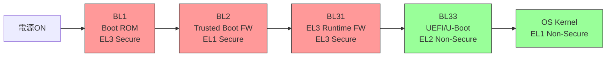

# ARM64 ブートアーキテクチャ

🎯 **この章で学ぶこと**
- ARM64 (AARCH64) のブート手順
- ARM Trusted Firmware (ATF) の役割
- UEFI on ARMの実装
- Device Treeとの連携

📚 **前提知識**
- [Part I: x86_64 ブート基礎](../part1/01-reset-vector.md)

---

## はじめに

**ARM64（AARCH64）** は、モバイルデバイス、サーバ、組込みシステムで広く使用されるアーキテクチャであり、x86_64 とは根本的に異なるブート手順とセキュリティモデルを持っています。ARM64 のブートは **ARM Trusted Firmware（ATF）** を中心に設計されており、TrustZone テクノロジーによるセキュアブートと PSCI（Power State Coordination Interface）による電源管理が統合されています。x86 では BIOS や UEFI がハードウェア初期化とブート手順を一手に引き受けますが、ARM64 では BL1（Boot ROM）、BL2（Trusted Boot Firmware）、BL31（EL3 Runtime Firmware）、BL33（UEFI/U-Boot）という 4 段階のブートステージが明確に分離され、それぞれが異なる Exception Level（特権レベル）で動作します。また、ARM システムではハードウェア構成を Device Tree（デバイスツリー）で記述し、OS に渡すため、x86 の ACPI とは異なるアプローチを取ります。この章では、ARM64 のブートフロー、ARM Trusted Firmware の役割、UEFI on ARM の実装、Device Tree との連携、そして x86 との主な違いを学びます。

## ARM64ブートフロー

### ブートステージの概要

ARM64 のブートフローは、**4 段階のブートステージ**（BL1、BL2、BL31、BL33）から構成されます。この 4 段階の分離は、セキュリティと責務の明確化を目的としており、x86 の BIOS/UEFI とは根本的に異なるアプローチです。



各ブートステージは、異なる **Exception Level（EL）** で動作します。ARM64 には 4 つの Exception Level があり、EL0（ユーザーアプリケーション）、EL1（OS カーネル）、EL2（ハイパーバイザ）、EL3（Secure Monitor）という階層構造を持ちます。さらに、EL1-EL3 にはそれぞれ **Secure World** と **Non-Secure World** があり、TrustZone テクノロジーにより分離されています。

### 各ブートステージの詳細

| Stage | 名前 | Exception Level | Secure/Non-Secure | 役割 |
|-------|------|----------------|-------------------|------|
| **BL1** | AP Trusted ROM | EL3 | Secure | CPU初期化、BL2ロード、署名検証 |
| **BL2** | Trusted Boot Firmware | EL1 | Secure | BL31/BL33ロード、署名検証、DRAM初期化 |
| **BL31** | EL3 Runtime Firmware | EL3 | Secure | PSCI実装、SMC処理、Runtime Services |
| **BL33** | Non-Trusted Firmware | EL2 | Non-Secure | UEFI/U-Boot、OSローダ |

**BL1（AP Trusted ROM）** は、SoC の ROM に焼き込まれたコードであり、電源投入後に最初に実行されます。BL1 は EL3（Secure）で動作し、CPU とキャッシュを初期化し、セキュアメモリ（SRAM または キャッシュ）を設定します。次に、BL2 イメージを SPI Flash や eMMC からロードし、署名を検証します。署名が有効であれば BL2 に制御を渡し、無効であればブートを中止します。BL1 は ROM に焼き込まれているため、改ざんが不可能であり、信頼の起点（Root of Trust）となります。

**BL2（Trusted Boot Firmware）** は、BL1 からロードされ、EL1（Secure）で動作します。BL2 の主な役割は、BL31 と BL33 をロードして署名検証を行うことです。また、DRAM の初期化も BL2 が担当します。BL2 は、BL31（EL3 Runtime Firmware）と BL33（UEFI/U-Boot）の両方をメモリにロードし、それぞれの署名を検証します。検証が成功すると、BL31 に制御を渡します。

**BL31（EL3 Runtime Firmware）** は、EL3（Secure）で動作する常駐ファームウェアであり、OS 実行中も EL3 に留まります。BL31 の主な役割は、**PSCI（Power State Coordination Interface）** の実装です。PSCI は、CPU の電源管理（CPU ON/OFF、スリープ、リセット）を提供する標準インターフェースであり、OS は SMC（Secure Monitor Call）を通じて PSCI を呼び出します。また、BL31 は Secure World と Non-Secure World の切り替えを管理し、Secure Services（例: Trusted Applications の実行）を提供します。

**BL33（Non-Trusted Firmware）** は、EL2（Non-Secure）で動作する UEFI や U-Boot です。BL33 は、非セキュアな世界で動作し、OS カーネルをロードします。x86 の UEFI と同様に、BL33 はブートデバイスを選択し、OS ローダを実行します。UEFI の場合、DXE Phase、BDS Phase を経て、OS カーネルに制御を渡します。

### x86 との比較

x86 のブートフローと比較すると、ARM64 の最大の違いは **セキュアブートのハードウェアサポート** です。x86 では、UEFI Secure Boot はファームウェアレベルで実装されますが、ARM64 では TrustZone と Exception Level により、セキュアな処理（BL1/BL2/BL31）と非セキュアな処理（BL33/OS）が CPU レベルで分離されます。これにより、より堅牢なセキュリティが実現されます。

また、x86 では BIOS/UEFI が単一のファームウェアとしてすべての初期化を担当しますが、ARM64 では BL1-BL33 という 4 段階の分離により、責務が明確になっています。BL1 は信頼の起点、BL2 はロードとDRAM初期化、BL31 は Runtime Services、BL33 は OS ブートという役割分担です。

---

## ARM Trusted Firmware (ATF)

### ATF の概要

**ARM Trusted Firmware（ATF）** は、ARM が提供するオープンソースのセキュアブートファームウェアであり、BL1、BL2、BL31 の参照実装を提供します。ATF は、ARM のセキュリティアーキテクチャ（TrustZone、PSCI、Secure Boot）を実装し、ARM64 プラットフォームの標準的なセキュアブート基盤となっています。

ATF は、GitHub で公開されており、ARM のプロセッサ（Cortex-A53、Cortex-A57、Cortex-A72 など）をサポートしています。また、各 SoC ベンダー（Qualcomm、MediaTek、Rockchip など）は、ATF をベースに自社プラットフォーム向けにカスタマイズしています。

ATF の主要な機能は、以下の通りです。

**PSCI（Power State Coordination Interface）の実装**: PSCI は、OS が CPU の電源状態を制御するための標準インターフェースです。PSCI により、OS は CPU のパワーオン/オフ、スリープ、リセットを統一的な方法で実行できます。

**Secure Boot**: BL1 と BL2 による署名検証により、信頼できるファームウェアと OS のみが実行されることを保証します。

**TrustZone サポート**: Secure World と Non-Secure World の分離を管理し、Secure Services を提供します。

**SMC（Secure Monitor Call）処理**: 非セキュアな OS から EL3 のセキュアモニタを呼び出すための SMC を処理します

### PSCI (Power State Coordination Interface) の詳細

**PSCI** は、ARM Architecture Profile である ARMv8-A で導入された電源管理の標準インターフェースです。PSCI により、OS は CPU のパワーオン/オフ、スリープ、システムリセット、システムシャットダウンといった電源管理操作を、統一的な方法で実行できます。

**PSCI の主要な機能:**

- **CPU_ON**: 指定された CPU をパワーオンし、指定されたエントリポイントから実行を開始します。マルチコアシステムの起動に不可欠です。
- **CPU_OFF**: 現在の CPU をパワーオフします。OS がアイドル状態の CPU を停止する際に使用します。
- **CPU_SUSPEND**: 現在の CPU を低電力状態にします。スリープモードへの遷移に使用します。
- **SYSTEM_RESET**: システム全体をリセットします。
- **SYSTEM_OFF**: システム全体をシャットダウンします。

以下は、ATF の BL31 における PSCI の CPU_ON 実装例です。

```c
// ARM Trusted Firmware: BL31 PSCI実装
// services/std_svc/psci/psci_cpu_on.c

/**
  指定されたCPUをパワーオンします

  @param target_cpu    ターゲットCPUのMPID
  @param entrypoint    CPUが開始するアドレス
  @param context_id    コンテキストID（OSが自由に使用）

  @retval PSCI_E_SUCCESS      成功
  @retval PSCI_E_INVALID_PARAMS パラメータエラー
**/
int32_t psci_cpu_on(
  u_register_t target_cpu,
  uintptr_t    entrypoint,
  u_register_t context_id
  )
{
  int rc;
  unsigned int target_idx;

  // ターゲットCPUのインデックスを取得
  target_idx = plat_core_pos_by_mpidr(target_cpu);
  if (target_idx == UINT_MAX) {
    return PSCI_E_INVALID_PARAMS;
  }

  // CPUの状態を確認（既にONの場合はエラー）
  if (psci_get_cpu_state(target_idx) == PSCI_STATE_ON) {
    return PSCI_E_ALREADY_ON;
  }

  // プラットフォーム固有のCPUパワーオン処理
  rc = plat_cpu_pwron(target_cpu);
  if (rc != PSCI_E_SUCCESS) {
    return rc;
  }

  // CPUのエントリポイントとコンテキストIDを設定
  psci_set_cpu_entrypoint(target_idx, entrypoint);
  psci_set_cpu_context_id(target_idx, context_id);

  // CPUの状態をONに更新
  psci_set_cpu_state(target_idx, PSCI_STATE_ON);

  return PSCI_E_SUCCESS;
}
```

この実装は、ターゲット CPU の MPID（Multiprocessor Affinity Register）を検証し、CPU がすでにオンでないことを確認し、プラットフォーム固有のパワーオン処理（plat_cpu_pwron）を実行し、エントリポイントとコンテキスト ID を設定します。

### SMC (Secure Monitor Call) の詳細

**SMC** は、非セキュアな世界（EL1 Non-Secure）から EL3 の Secure Monitor を呼び出すための命令です。SMC 命令は、CPU を EL3 に遷移させ、ATF の SMC ハンドラを実行します。SMC ハンドラは、X0 レジスタに格納された Function ID を解析し、適切な PSCI 関数を呼び出します。

以下は、Linux カーネルから PSCI の CPU_ON を呼び出す例です。

```asm
// Linux カーネル: arch/arm64/kernel/psci.c
// PSCI_CPU_ON (Function ID: 0xC4000003) を呼び出す

// レジスタ設定:
// X0 = PSCI Function ID (0xC4000003 = CPU_ON)
// X1 = Target CPU MPID (例: 0x1 = CPU 1)
// X2 = Entry Point (CPUが開始するアドレス)
// X3 = Context ID (OSが使用する任意の値)

MOV X0, #0xC4000003  // PSCI_CPU_ON Function ID
MOV X1, #1           // Target CPU = CPU 1
LDR X2, =secondary_entry_point // エントリポイント
MOV X3, #0           // Context ID
SMC #0               // Secure Monitor Call

// SMC実行後、X0に戻り値が格納される
// 0 = PSCI_E_SUCCESS
// -1 = PSCI_E_NOT_SUPPORTED
// -2 = PSCI_E_INVALID_PARAMS
```

SMC 命令が実行されると、CPU は EL3 に遷移し、ATF の SMC Exception Handler が実行されます。ハンドラは X0 の Function ID を確認し、psci_cpu_on 関数を呼び出します。処理が完了すると、CPU は元の EL1 Non-Secure に戻り、X0 に戻り値が格納されます。

この仕組みにより、非セキュアな OS は、セキュアな PSCI サービスを安全に利用できます。TrustZone により、Secure World のメモリや状態は Non-Secure World から隔離されており、セキュリティが保たれます。

---

## UEFI on ARM

### UEFI on ARM の概要

ARM プラットフォームでも UEFI ファームウェアが広く採用されています。特に、ARM64 サーバ（Ampere Altra、AWS Graviton、Fujitsu A64FX など）では、UEFI が標準的なファームウェアとなっています。UEFI on ARM は、EDK II の ArmPlatformPkg と ArmVirtPkg で実装されています。

UEFI on ARM の特徴は、x86 の UEFI と同じ UEFI 仕様に準拠しながら、ARM 固有の要件（Device Tree、PSCI、GIC など）に対応していることです。これにより、Windows や Linux といった OS は、ARM プラットフォームでも x86 と同じ UEFI インターフェースを使用できます。

### EDK II ARM 実装の詳細

EDK II の ARM 実装は、ArmPlatformPkg/PrePi で SEC Phase と PEI Phase の処理を実装しています。以下は、マルチコア ARM プラットフォームのエントリポイントです。

```c
// EDK II: ArmPlatformPkg/PrePi/MainMPCore.c

/**
  ARM プラットフォームのC言語エントリポイント

  @param MpId         Multiprocessor Affinity Register (MPIDR)
  @param SecBootMode  ブートモード（通常起動、S3 Resume など）
**/
VOID
EFIAPI
CEntryPoint (
  IN UINTN  MpId,
  IN UINTN  SecBootMode
  )
{
  EFI_HOB_HANDOFF_INFO_TABLE  *HobList;
  UINTN                       UefiMemoryBase;
  UINTN                       UefiMemorySize;

  // 1. MMU (Memory Management Unit) を設定
  //    ARMではページングを有効化し、仮想メモリマッピングを構築
  ArmConfigureMmu (
    ArmGetMemoryMap (),
    &UefiMemoryBase,
    &UefiMemorySize
    );

  // 2. HOB (Hand-Off Block) リストを構築
  //    メモリマップ、CPUアーキテクチャ、ブートモードなどの情報を格納
  HobList = BuildHobList (
              MpId,
              UefiMemoryBase,
              UefiMemorySize
              );

  // 3. DXE コアをロードして実行
  //    x86のPEI-to-DXE遷移と同様
  LoadDxeCore (HobList);

  // ここには到達しない（DXEコアに制御が移る）
  ASSERT (FALSE);
}
```

**MMU 設定**: ARM では、MMU を有効化してページングを設定する必要があります。ArmConfigureMmu 関数は、メモリマップに基づいてページテーブルを構築し、MMU を有効化します。これにより、仮想メモリアドレスが使用可能になります。

**HOB リスト構築**: HOB（Hand-Off Block）は、SEC/PEI Phase から DXE Phase に情報を渡すためのデータ構造です。BuildHobList 関数は、メモリマップ、CPU 情報、ブートモードなどを HOB リストに追加します。

**DXE コアロード**: LoadDxeCore 関数は、DXE コアをメモリにロードし、実行します。この時点で、ARM の UEFI は x86 と同じ DXE Phase に入り、ドライバのロード、プロトコルの公開、BDS Phase への遷移が行われます。

### ARM 固有の処理

ARM プラットフォームでは、x86 にはない以下の処理が必要です。

**GIC（Generic Interrupt Controller）の初期化**: ARM の割り込みコントローラである GIC を初期化します。x86 の APIC に相当します。

**PSCI の統合**: UEFI Runtime Services から PSCI を呼び出すための統合が必要です。例えば、EFI_RESET_SYSTEM Runtime Service は、内部で PSCI の SYSTEM_RESET を呼び出します。

**Device Tree の生成**: UEFI は、Device Tree Blob（DTB）を生成し、OS に渡します。または、ACPI テーブルを生成します（サーバプラットフォームでは ACPI が主流）。

---

## Device Tree

### Device Tree の概要

**Device Tree（デバイスツリー）** は、ハードウェア構成を記述するためのデータ構造であり、ARM、PowerPC、RISC-V などのアーキテクチャで広く使用されています。Device Tree は、.dts（Device Tree Source）ファイルで記述され、dtc（Device Tree Compiler）により .dtb（Device Tree Blob）にコンパイルされます。

Device Tree の役割は、ハードウェアの構成（CPU、メモリ、デバイスのアドレス、割り込み番号など）を OS に伝えることです。x86 では ACPI がこの役割を担いますが、ARM では Device Tree が主流です（ただし、サーバプラットフォームでは ACPI も使用されます）。

### Device Tree の構造

Device Tree は、ツリー構造を持ち、ルートノード（"/"）から始まります。各ノードは、ハードウェアデバイスを表し、プロパティ（compatible、reg、interrupts など）でデバイスの詳細を記述します。

### 例: Raspberry Pi 4 の Device Tree

以下は、Raspberry Pi 4 の簡略化された Device Tree の例です。

```dts
/ {
  // ボードの識別
  compatible = "raspberrypi,4-model-b", "brcm,bcm2711";
  model = "Raspberry Pi 4 Model B";

  // メモリ領域の記述
  memory@0 {
    device_type = "memory";
    // reg = <address-cells size-cells address size>
    // 0x0_00000000 から 0x40000000 (1GB) のメモリ
    reg = <0x0 0x0 0x0 0x40000000>;
  };

  // SoC (System on Chip) デバイスツリー
  soc {
    #address-cells = <1>;
    #size-cells = <1>;
    compatible = "simple-bus";
    ranges;

    // UART0 (シリアルポート)
    uart0: serial@7e201000 {
      compatible = "arm,pl011", "arm,primecell";
      // レジスタアドレス: 0x7e201000、サイズ: 0x200
      reg = <0x7e201000 0x200>;
      // 割り込み番号: GIC SPI 57, Level-High
      interrupts = <GIC_SPI 57 IRQ_TYPE_LEVEL_HIGH>;
      clocks = <&clocks BCM2835_CLOCK_UART>,
               <&clocks BCM2835_CLOCK_VPU>;
      clock-names = "uartclk", "apb_pclk";
      status = "okay";
    };

    // GIC (Generic Interrupt Controller)
    gic: interrupt-controller@40000000 {
      compatible = "arm,gic-400";
      #interrupt-cells = <3>;
      interrupt-controller;
      reg = <0x40041000 0x1000>,  // GIC Distributor
            <0x40042000 0x2000>;  // GIC CPU Interface
    };
  };
};
```

**compatible プロパティ**: デバイスの互換性を示す文字列のリストです。OS は、この文字列に基づいて適切なドライバを選択します。"raspberrypi,4-model-b" は Raspberry Pi 4 固有、"brcm,bcm2711" は Broadcom BCM2711 SoC のドライバが使用できることを示します。

**reg プロパティ**: デバイスのレジスタアドレスとサイズを記述します。UART0 の例では、レジスタアドレスが 0x7e201000、サイズが 0x200（512 バイト）であることを示しています。

**interrupts プロパティ**: デバイスが使用する割り込み番号を記述します。UART0 は GIC の SPI（Shared Peripheral Interrupt）57 番を使用し、トリガータイプは Level-High です。

### UEFI と Device Tree の連携

UEFI ファームウェアは、Device Tree Blob（DTB）を生成し、OS に渡します。Linux カーネルは、DTB を解析し、デバイスドライバを動的にロードします。この仕組みにより、ハードウェア構成が異なるプラットフォームでも、同じカーネルイメージを使用できます

---

## x86との主な違い

| 項目 | x86 | ARM64 |
|------|-----|-------|
| **リセットベクタ** | 0xFFFFFFF0 | SoC依存 |
| **セキュリティ** | SMM | TrustZone (EL3) |
| **初期化** | BIOS/UEFI | ATF + UEFI/U-Boot |
| **ハードウェア記述** | ACPI | Device Tree + ACPI |
| **割り込み** | APIC/x2APIC | GIC (Generic Interrupt Controller) |

---

## まとめ

この章では、**ARM64 ブートアーキテクチャ**として、ARM Trusted Firmware（ATF）による 4 段階のブートフロー、PSCI と SMC、UEFI on ARM の実装、Device Tree によるハードウェア記述、そして x86 との主な違いを学びました。ARM64 は、TrustZone テクノロジーと Exception Level を活用した堅牢なセキュリティモデルを持ち、モバイルからサーバまで幅広いプラットフォームで採用されています。

**ARM64 ブートフローの 4 段階**は、BL1（AP Trusted ROM、EL3 Secure）→ BL2（Trusted Boot Firmware、EL1 Secure）→ BL31（EL3 Runtime Firmware、EL3 Secure）→ BL33（Non-Trusted Firmware、EL2 Non-Secure）→ OS Kernel という流れです。BL1 は SoC の ROM に焼き込まれたコードであり、最初に実行され、BL2 をロードします。BL2 は BL31 と BL33 をロードして検証します。BL31 は PSCI（Power State Coordination Interface）を実装し、OS からの電源管理要求（CPU ON/OFF、スリープ）を処理します。BL33 は UEFI や U-Boot といった非セキュアなファームウェアであり、最終的に OS カーネルをロードします。この 4 段階の分離により、セキュアな初期化（BL1/BL2/BL31）と非セキュアなブート（BL33）が明確に区別され、TrustZone によるセキュリティが保証されます。

**ARM Trusted Firmware（ATF）** は、ARM のセキュアブート実装であり、BL1、BL2、BL31 を提供します。ATF は、PSCI（Power State Coordination Interface）の参照実装であり、psci_cpu_on 関数で CPU をパワーオンし、エントリポイントを設定します。SMC（Secure Monitor Call）により、非セキュアな OS から EL3 のセキュアモニタを呼び出し、PSCI 機能（CPU ON/OFF、スリープ、リセット）を実行できます。Linux カーネルは、X0 レジスタに PSCI Function ID（例: 0xC4000003 for PSCI_CPU_ON）、X1-X3 にパラメータ（Target CPU、Entry point）を設定し、SMC #0 命令で ATF を呼び出します。

**UEFI on ARM の実装**は、EDK II の ArmPlatformPkg で提供されます。CEntryPoint 関数は、MMU（Memory Management Unit）を設定し、HOB（Hand-Off Block）リストを構築し、DXE コアをロードします。ARM では MMU の初期化が重要であり、ArmConfigureMmu 関数で仮想メモリマッピングを設定します。その後、x86 と同様の DXE → BDS → OS Loader というフローに進みます。

**Device Tree（デバイスツリー）** は、ARM システムでハードウェア構成を記述する宣言的なデータ構造であり、.dts ファイルで記述され、.dtb（Device Tree Blob）にコンパイルされます。Raspberry Pi 4 の例では、compatible プロパティでボードを識別し、memory@0 ノードでメモリアドレスとサイズを記述し、uart0 ノードで UART の互換性、レジスタアドレス、割り込み番号を記述します。UEFI や U-Boot は、この Device Tree を OS に渡し、OS はデバイスドライバを動的にロードします。x86 では ACPI が同様の役割を果たしますが、ARM では Device Tree が主流です（ただし、サーバ向け ARM64 では ACPI も使用されます）。

**x86 との主な違い**として、まず**リセットベクタ**は、x86 が固定アドレス 0xFFFFFFF0 ですが、ARM64 は SoC 依存（通常は ROM の先頭アドレス）です。次に**セキュリティ**は、x86 が SMM（System Management Mode）を使用し、ARM64 は TrustZone（EL3）を使用します。さらに**初期化**は、x86 が BIOS/UEFI で統合的に行いますが、ARM64 は ATF + UEFI/U-Boot という分離アーキテクチャです。また**ハードウェア記述**は、x86 が ACPI を使用し、ARM64 は Device Tree + ACPI（サーバ）を使用します。最後に**割り込み**は、x86 が APIC/x2APIC を使用し、ARM64 は GIC（Generic Interrupt Controller）を使用します。

ARM64 のブートアーキテクチャは、x86 よりもセキュリティを重視した設計であり、TrustZone と Exception Level により、セキュアな処理と非セキュアな処理を明確に分離します。モバイルデバイスやクラウドサーバでのセキュリティ要件の高まりに伴い、ARM64 の採用が拡大しており、ファームウェア開発者は x86 と ARM64 の両方のアーキテクチャを理解することが重要になっています。

以下の参考表は、x86 と ARM64 の主な違いをまとめたものです。

**参考表: x86 と ARM64 の比較**

| 項目 | x86 | ARM64 |
|------|-----|-------|
| **リセットベクタ** | 0xFFFFFFF0 | SoC依存 |
| **セキュリティ** | SMM | TrustZone (EL3) |
| **初期化** | BIOS/UEFI | ATF + UEFI/U-Boot |
| **ハードウェア記述** | ACPI | Device Tree + ACPI |
| **割り込み** | APIC/x2APIC | GIC (Generic Interrupt Controller) |

---

次章: [Part VI Chapter 8: ARM と x86 の違い](08-arm-vs-x86.md)
