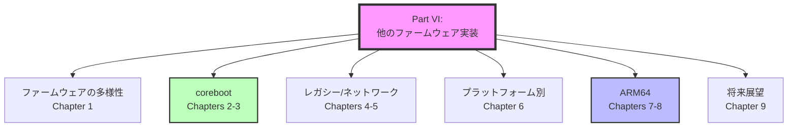
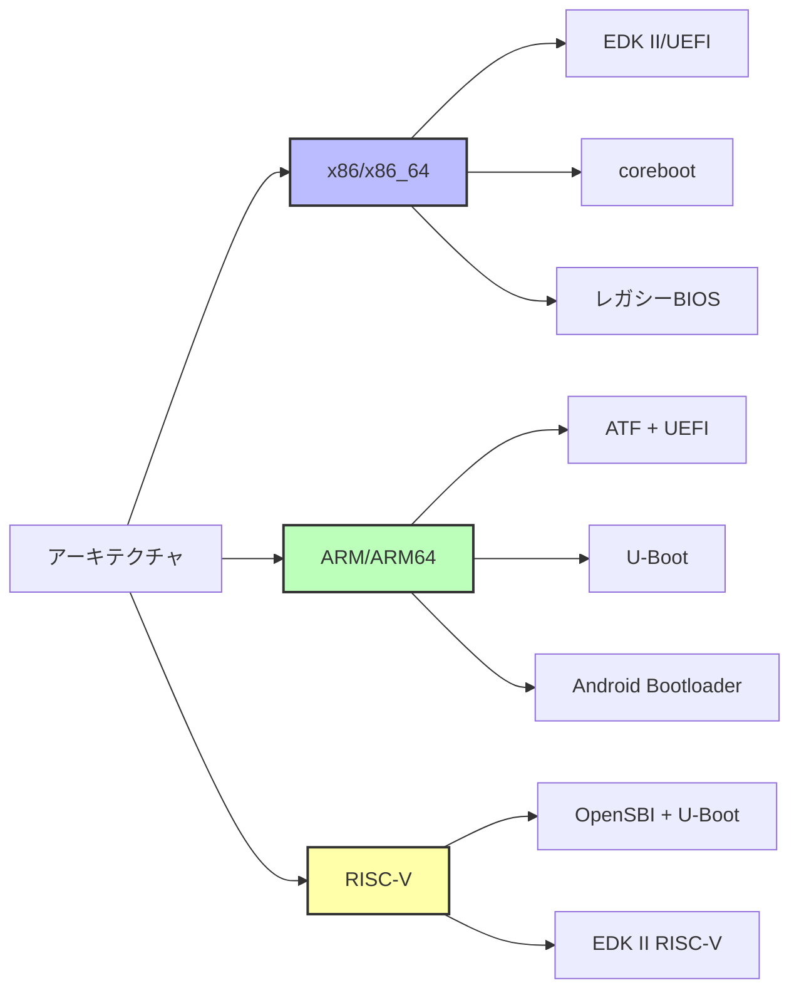
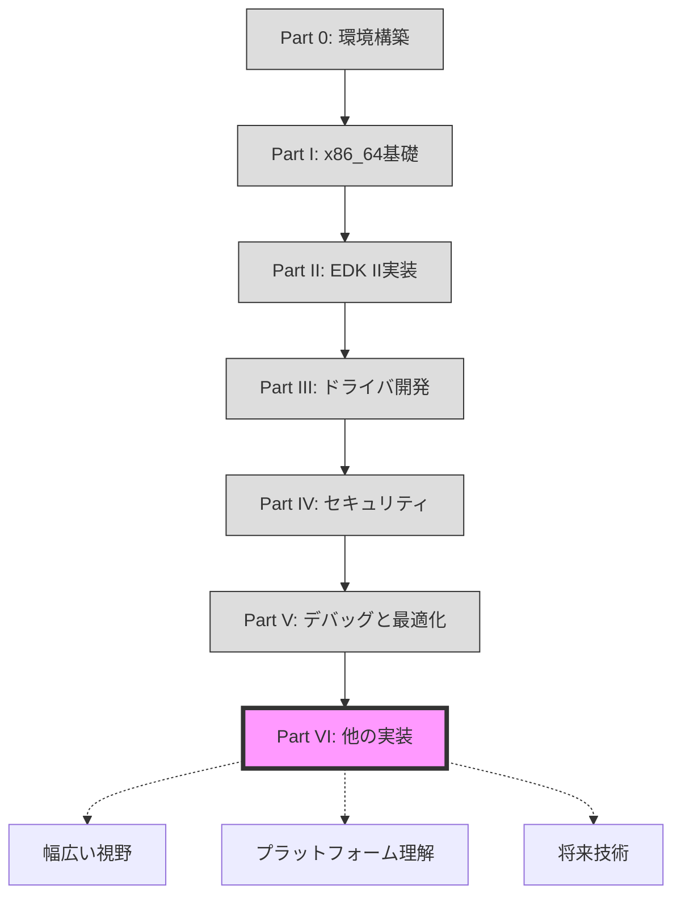

# Part VI まとめ

🎯 **この章で学んだこと**
- ファームウェアエコシステムの多様性
- coreboot、レガシーBIOS、ARM64など異なる実装
- プラットフォーム別の特性と要件
- ファームウェアの将来展望

📚 **前提知識**
- Part VI Chapters 1-9

---

## はじめに

**Part VI のまとめ**として、この Part では EDK II/UEFI 以外のファームウェア実装、多様なプラットフォームの特性、アーキテクチャの違い、そしてファームウェアの将来展望を学びました。本書の Part 0 から Part V までは、主に x86_64 アーキテクチャと EDK II/UEFI に焦点を当ててきましたが、Part VI では視野を広げ、coreboot、U-Boot、レガシー BIOS、ARM64 といった異なるファームウェア実装とアーキテクチャを学びました。これにより、ファームウェアエコシステム全体を俯瞰し、プラットフォームや要件に応じた適切な選択ができるようになりました。また、オープンソース化、セキュリティ強化、RISC-V の台頭といったファームウェアの将来動向を理解し、継続的な学習の重要性を認識しました。この章では、Part VI の各章の要点を振り返り、ファームウェアの分類と選択基準を整理し、アーキテクチャの違いを比較し、学習の振り返りと次のステップを示します。そして、本書全体の総まとめとして、60 章で学んだ内容を総括し、あなたが到達した知識レベルを確認します。

## Part VI の全体像

Part VI では、EDK II/UEFI 以外のファームウェア実装と、多様なプラットフォームについて学びました。



---

## 各章の要点

| 章 | タイトル | 主な内容 |
|----|----------|----------|
| **1** | ファームウェアの多様性 | EDK II, coreboot, U-Boot, Slim Bootloader |
| **2** | corebootの設計思想 | ミニマリズム、Payload分離、オープンソース |
| **3** | corebootとEDK IIの比較 | アーキテクチャ、サイズ、機能の違い |
| **4** | レガシーBIOSアーキテクチャ | INT割り込み、MBR、CSM |
| **5** | ネットワークブート | PXE、TFTP、HTTP Boot |
| **6** | プラットフォーム別の特性 | サーバ (RAS/IPMI)、組込み、モバイル |
| **7** | ARM64ブート | ATF、PSCI、Device Tree |
| **8** | ARMとx86の違い | アーキテクチャ、セキュリティモデル、電源管理 |
| **9** | ファームウェアの将来展望 | オープンソース化、RISC-V、セキュリティ |

---

## ファームウェアの分類

### アーキテクチャ別



### 用途別

| 用途 | 推奨ファームウェア | 理由 |
|------|-------------------|------|
| **デスクトップPC** | EDK II/UEFI (ベンダー製) | Windows対応、Secure Boot |
| **サーバ** | EDK II/UEFI + BMC | RAS機能、IPMI/Redfish |
| **Chromebook** | coreboot | 高速起動、Verified Boot |
| **組込みLinux** | U-Boot | 小サイズ、カスタマイズ容易 |
| **IoT/エッジ** | Slim Bootloader | 超高速起動、省電力 |
| **スマートフォン** | Android Bootloader (ABL) | Android最適化 |

---

## 主要ファームウェアの比較

### 総合比較表

| 項目 | EDK II/UEFI | coreboot | U-Boot | Slim Bootloader |
|------|-------------|----------|--------|----------------|
| **コードサイズ** | 4-8 MB | 256KB-2MB | 100-500KB | 256-512KB |
| **起動時間** | 2-3秒 | < 1秒 | < 1秒 | < 500ms |
| **アーキテクチャ** | x86, ARM, RISC-V | x86, ARM, RISC-V | すべて | x86 (Intel) |
| **Secure Boot** | 完全 | Payload経由 | 限定的 | あり |
| **Windows対応** | 必須 | UEFI Payload経由 | なし | 限定的 |
| **Linux対応** | 完全 | 完全 | 完全 | 完全 |
| **オープンソース** | BSD | GPL v2 | GPL v2 | BSD |
| **主な用途** | PC、サーバ | Chromebook | 組込み | IoT |
| **開発元** | Intel/Tianocore | コミュニティ | Denx/コミュニティ | Intel |

---

## アーキテクチャの違い

### x86 vs ARM64

| 項目 | x86/x86_64 | ARM64 |
|------|-----------|-------|
| **命令セット** | CISC | RISC |
| **セキュリティ** | SMM | TrustZone (EL3) |
| **ブートフロー** | BIOS/UEFI直接 | BL1→BL2→BL31→BL33 |
| **ハードウェア記述** | ACPI | Device Tree + ACPI |
| **割り込み** | APIC/x2APIC | GIC |
| **電源管理** | ACPI P/C-states | PSCI |
| **消費電力** | 15-65W | 5-15W (同性能) |
| **主な用途** | デスクトップ、サーバ | モバイル、組込み、一部サーバ |

---

## 学習の振り返り

### Part 0-VI の全体構成



### 到達レベル

**Part VI 完了時点で、あなたは:**

🎓 **上級レベルのファームウェアエンジニア**

✅ **できること**:
- EDK II以外のファームウェアも理解
- プラットフォーム別の適切な選択
- ARM64システムのブート理解
- corebootのビルドと実行
- 将来技術のトレンド把握

✅ **理解していること**:
- ファームウェアエコシステム全体
- アーキテクチャ間の違い
- オープンソースとプロプライエタリの選択
- プラットフォーム固有の要件

---

## 次のステップ

### 実践的なプロジェクト

1. **corebootで実機起動**
   - 対応ボード (ThinkPad X230等) でcorebootビルド
   - flashromで書き込み
   - Linux起動確認

2. **ARM64開発ボードでのUEFI**
   - Raspberry Pi 4 + EDK II
   - U-Boot から EDK II への移行
   - Device Treeの理解

3. **オープンソースコントリビューション**
   - coreboot/EDK IIのバグ報告
   - ドキュメント改善
   - 新しいボードのサポート追加

### さらなる学習

1. **専門分野の深掘り**
   - サーバファームウェア (IPMI/Redfish)
   - セキュアブート実装
   - ファームウェア更新メカニズム

2. **新しいアーキテクチャ**
   - RISC-V開発
   - OpenSBI + U-Boot
   - SiFive Unmatched等での実験

3. **コミュニティ参加**
   - coreboot Mailing List購読
   - UEFI Forum参加
   - カンファレンス参加 (OSFC, UEFI Plugfest)

---

## 本書の総まとめ

### 全60章で学んだこと

**Part 0** (5章): 開発環境構築
**Part I** (7章): x86_64ブート基礎
**Part II** (10章): EDK II実装
**Part III** (9章): ドライバ開発
**Part IV** (10章): セキュリティ
**Part V** (9章): デバッグと最適化
**Part VI** (10章): 他のファームウェア実装

**合計**: 60章

### あなたが到達した知識レベル

```
初心者 → 中級者 → 上級者 → エキスパート
  Part 0-I    Part II-III  Part IV-V   Part VI + 実践
```

**現在地**: 上級者レベル

**エキスパートへの道**:
- 実機での開発経験 (最低3プロジェクト)
- オープンソース貢献 (パッチ10件以上)
- 複数アーキテクチャの経験 (x86 + ARM)
- セキュリティ脆弱性の発見・修正

---

## 謝辞

本書を最後まで読んでいただき、ありがとうございました。

**ファームウェア開発の世界へようこそ！**

---

## 📚 総合参考資料

### 公式仕様書

1. **UEFI Specification**
   - https://uefi.org/specifications

2. **ACPI Specification**
   - https://uefi.org/specifications

3. **Intel Software Developer Manual**
   - https://www.intel.com/sdm

4. **ARM Architecture Reference Manual**
   - https://developer.arm.com/architectures

### オープンソースプロジェクト

1. **EDK II**
   - https://github.com/tianocore/edk2

2. **coreboot**
   - https://www.coreboot.org/

3. **U-Boot**
   - https://www.denx.de/wiki/U-Boot

4. **ARM Trusted Firmware**
   - https://www.trustedfirmware.org/

### コミュニティ

1. **TianoCore (EDK II)**
   - https://www.tianocore.org/

2. **coreboot**
   - https://www.coreboot.org/mailinglist

3. **UEFI Forum**
   - https://uefi.org/

---

## 本書完了のまとめ

**おめでとうございます！本書全 60 章を完了しました。🎉**

この学習の旅を通じて、あなたは**ファームウェア開発の基礎から応用まで、体系的かつ包括的な知識**を習得しました。Part 0 では開発環境を構築し、Part I では x86_64 ブートの基礎を学び、Part II では EDK II によるファームウェア実装を習得し、Part III ではドライバ開発の実践を積み、Part IV ではセキュリティアーキテクチャを理解し、Part V ではデバッグと最適化の技術を磨き、そして Part VI では他のファームウェア実装と将来展望を学びました。これらの知識は、**プロフェッショナルレベルのファームウェアエンジニアとして実際のプロジェクトに参加するための確固たる基盤**となります。

**ファームウェア開発は、コンピュータシステムの最も基盤的な部分**を扱う分野であり、OS よりも低レベルで動作し、ハードウェアとソフトウェアの境界で機能します。あなたが学んだ知識は、デスクトップ PC、サーバ、モバイルデバイス、組込みシステム、IoT デバイスといった多様なプラットフォームで活用でき、セキュリティ、パフォーマンス、信頼性という重要な要素に直接影響を与えます。ファームウェアエンジニアは、システム全体の動作を理解し、ハードウェアの詳細を把握し、OS の動作原理を知り、セキュリティの脅威に対応できる、**真に多面的なスキルを持つエンジニア**です。

**次のステップ**として、実機での開発経験を積み、オープンソースプロジェクトに貢献し、コミュニティに参加することで、さらなる成長を続けてください。coreboot、EDK II、U-Boot といったプロジェクトは、常に新しいコントリビューターを歓迎しています。バグ報告、ドキュメント改善、パッチ提出、新しいボードのサポート追加など、さまざまな形で貢献できます。また、OSFC（Open Source Firmware Conference）や UEFI Plugfest といったカンファレンスに参加し、世界中のファームウェアエンジニアと交流することで、最新の技術動向を学び、視野を広げることができます。

**継続的な学習**が、エキスパートへの道です。ファームウェアの世界は常に進化しており、新しいアーキテクチャ（RISC-V）、新しいセキュリティ技術（Confidential Computing）、新しい標準（UEFI 2.x、ACPI 6.x）が次々と登場します。本書で学んだ基礎知識を基に、これらの新しい技術を積極的に学び、実践し、共有することで、あなたは**ファームウェアエコシステムを形作る一員**となります。

ファームウェア開発の世界へようこそ！あなたの活躍を期待しています。

---

次: [付録: 用語集](../appendix/glossary.md)
